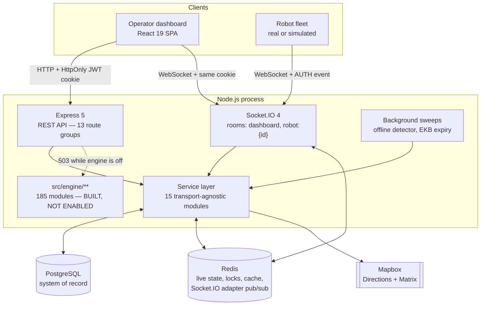

# RobotX Architecture

> **What this document is.** The single root-level answer to *"what is RobotX today?"* — written
> against the repository as it actually stands, not against any design document.
>
> **What this document is not.** It is **not** architectural authority. It does not decide
> anything, supersede anything, or resolve any open question. Where it and any document listed in
> §2 disagree, **the document in §2 wins and this one is defective.**
>
> **Verified against:** branch `feature/dashboard`, commit `cbe540e`, plus the uncommitted Phase 15
> routing-prerequisite working tree, plus the pre-Phase-16 ownership reconciliation. Baseline at
> time of writing — **historical, do not quote as current**: 7 build gates PASS · 145 test suites ·
> 6 287 tests · 0 failures; measured, not quoted. `gate:calibration` is **FAIL at 39** and is a
> release gate, not a build gate.
>
> **Current, re-measured 2026-08-29 at digest `431010ace1…` (565 files), HEAD `b68dc5d`:**
> `npm run gates` now runs **eight** gates and **exits 1** — seven PASS and `gate:composition`
> FAILs on B1. `gate:calibration` is still FAIL at 39. For anything Phase-15-related, the current
> source of truth is [`docs/phase15/PHASE_15_MASTER.md`](docs/phase15/PHASE_15_MASTER.md); numbers
> elsewhere in this file are dated where they are known to have drifted.

---

## Status vocabulary

This document labels every component with exactly one of these. They are not synonyms, and the
difference between the last three is the difference between a system that works and a system that
is merely written down.

| Label | Meaning |
|---|---|
| **DESIGN** | Specified in the frozen architecture. No code, or code not yet owned by a completed phase |
| **IMPLEMENTED** | Code exists, is tested, and passes the build gates |
| **NOT YET WIRED** | Code exists and is tested, but nothing in the repository constructs it in a production path |
| **ENABLED / LIVE** | Actually running and deciding in production |
| **BLOCKED** | Cannot proceed until a named external decision, procurement, or measurement lands |
| **HISTORICAL** | Described a system generation that no longer exists |

**At the time of writing, no component of the assignment engine is ENABLED / LIVE.**

---

## 1. Current System Status

### 1.1 The one-paragraph version

RobotX is a fleet command-and-control backend for autonomous delivery robots. It is mid-way
through replacing its original assignment engine with a new one. **The original engine has been
deleted. The replacement is built but switched off.** The host platform around them — telemetry
ingestion, robot authentication, the operator dashboard feed, the simulator, obstacle handling — is
live and working. Task *assignment* is not.

### 1.2 The three generations

| Generation | State | Where it is |
|---|---|---|
| **Original dashboard prototype** (≈ Apr 2026) | **HISTORICAL** | Superseded entirely |
| **Legacy DTARO assignment engine** (≈ Jul 2026) | **HISTORICAL — deleted from the build** | `docs/history/` |
| **Next-generation assignment engine** (Jul 2026 →) | **IMPLEMENTED, NOT YET WIRED, NOT ENABLED** | `Backend/src/engine/**` |

### 1.3 The legacy engine has been retired, not bypassed

Phase 15 deleted four modules outright:

- `taskAssignment.service.js`
- `costEvaluator.service.js`
- `robotValidator.service.js`
- `taskRecovery.service.js`

`Backend/tools/gates/checkLegacyRetirement.js` **fails the build** if any of them returns. The gate
reports, re-measured 2026-08-29: *"4 retired module(s) absent from the build and unimported; no
retired symbol redefined across 340 file(s)."* (It said 301 files when this section was written;
the file count grows with the tree — the load-bearing number is **4 absent**, not the corpus size.)

`task.service.js` retains **no** selection path, no `setImmediate` detachment, and no
`robotReserve:*` retry loop. It kept exactly one legacy surface deliberately — `rerouteTask` and
its straight-line fallback — because rerouting work already committed is an operator action, not an
assignment decision, and deleting it would strand in-flight missions across the cutover.

### 1.4 The next-generation engine exists but does not run

| Fact | Evidence |
|---|---|
| ~185 engine modules, **18 registered workers**, 38 feasibility predicates, 242 registered parameters | `Backend/src/engine/**`, `Backend/src/workers/**`. *(Worker count re-derived 2026-08-29: `registry.js` registers 18; `src/workers/` holds 20 `.js` files — 18 `*.worker.js` plus `registry.js` and `leaderWorkers.js`. "19 workers" was wrong under every reading. The engine-module count is approximate and each gate scopes its own: `gate:tiers` governs 285, `gate:params` scans 189 — quote a gate's number with the gate's name attached.)* |
| `ENGINE_ENABLED` defaults to **false** | `Backend/src/engine/cutover/enabled.js` |
| Liveness is a **conjunction**: process `ENGINE_ENABLED` **AND** the shard's `cutover.engine_enabled` binding | `cutover/enabled.js` |
| **No real solve path is constructed anywhere outside a test fixture.** `server.js` *is* the production composition root: it starts the 8 `SCHEDULED` workers at boot and 3 of the 4 `LEADER_ONLY` workers on promotion — **11 of 18**. The `coordinator` cannot be composed (its round loop bottoms out in a routing engine **B1 has not selected**) and 6 workers are `DEFERRED` with declared blockers. `gate:composition` fails on the `coordinator` alone | `docs/phase15/PHASE_15_IMPLEMENTATION_STATE.md` · `docs/phase15/PHASE_15_BLOCKERS.md` **B1** · verified 2026-08-29. *(Originally recorded as "no production composition root exists" — finding N12 of the archived consolidated report, written before Phase 15's composition work landed. A 2026-08-29 revision then said "starts 17 of 18", which confused `gate:composition`'s compliance count with the number of workers that run; corrected here.)* |
| No round has ever executed | ibid. |

**Consequence a new developer will hit immediately:** `POST /api/tasks` currently responds
**`503 ENGINE_NOT_LIVE`**. This is deliberate. With the legacy dispatcher out of the build,
accepting a task for a shard whose coordinator is not running would durably record work that no
component is responsible for deciding — the exact defect the new architecture exists to eliminate.
A 503 naming the state is honest; a queue nobody drains is not.

### 1.5 Programme status

| Item | Status | Authority |
|---|---|---|
| Phases 0–14 | Implemented and independently verified | `PHASE_*_INDEPENDENT_VERIFICATION.md` |
| **Phases 1–2** | **Additionally remediated and closed**, each with its migration executed against a disposable PostgreSQL 18.3 rather than statically checked | `PHASE_1_REMEDIATION_AND_CLOSURE.md`, `PHASE_2_REMEDIATION_AND_CLOSURE.md` |
| **Phase 15** (verification, gates, cutover) | **IMPLEMENTATION CLOSED · RELEASE BLOCKED** — 8 of 24 blocking §24 gates are not green, none of them closable by a commit here | `docs/phase15/PHASE_15_CLOSURE_CHECKLIST.md` |
| **Phase 16** (Tier 2 enablement) | **NOT READY — must not begin** | ibid. |
| **B1** (routing engine) — Step 1 | **BLOCKED** behind D1 (region), D3 (fleet speed model) and D8 (extract vintage) | `docs/phase15/PHASE_15_BLOCKERS.md` · `npm run routing:readiness` |
| Calibration | **39 Safety-class parameters not `DERIVED`** (242 entries: 52 DERIVED / 152 PROVISIONAL / 38 UNCALIBRATED; 54 Safety-class) | `npm run gate:calibration` · verified 2026-08-29 |
| §6.1 blocking decisions B1, B2, B3, B6, B8 | **Unresolved** | `IMPLEMENTATION_EXECUTION_PLAN.md` §6.1 |

`gates.blockers({})` returns all **24** rows with no evidence filed. **This is the release-gate
machinery working as designed, not a defect.** *(The table has held 24 rows since Phase 15;
"23" here predated the last addition. Re-measured 2026-08-29:
`RELEASE_GATES.length === 24`, every row `blocking: true`.)*

> **Routing adapters exist. A routing engine has not been selected.**
> `Backend/tools/routing/` contains a benchmark harness, an adapter contract, and a five-state
> readiness gate. Their purpose is to make the B1 decision *mechanically checkable when it
> arrives*. Their existence is not the decision, and no engine has been chosen, deployed, or
> benchmarked against a real region.

---

## 2. Architecture Authority

This document ranks **below every item in this table.**

| Rank | Document | Standing |
|---|---|---|
| 1 | [`NEXT_GENERATION_ASSIGNMENT_ENGINE.md`](NEXT_GENERATION_ASSIGNMENT_ENGINE.md) | **FROZEN.** The architecture. Where anything disagrees with it, the other thing is defective |
| 2 | [`docs/adr/`](docs/adr/) — **38 frozen records + 2 integration records = 40 files** | ADR-01…32 plus six lettered sub-records `Accepted — frozen` (the complete Appendix C set); **ADR-33** (B1 traversal-domain scope) and **ADR-34** (cutover rehearsal purpose) `Accepted` — integration decisions, numbered from 33 upward per [`docs/adr/README.md`](docs/adr/README.md). Each fixes one decision's identity **and its rejected alternative** |
| 3 | [`IMPLEMENTATION_EXECUTION_PLAN.md`](IMPLEMENTATION_EXECUTION_PLAN.md) | **Active — the plan of record.** Phases 0–16, capability inventory, §6.1 blocking decisions, §7 master checklist |
| 4 | [`docs/phase15/PHASE_15_MASTER.md`](docs/phase15/PHASE_15_MASTER.md) | **The Phase 15 source of truth.** Authoritative for *current programme state*, with `PHASE_15_IMPLEMENTATION_STATE.md`, `PHASE_15_VERIFICATION_STATE.md`, `PHASE_15_BLOCKERS.md` and `PHASE_15_CLOSURE_CHECKLIST.md` beside it. Superseded reports — including the former register `PHASE_15_CONSOLIDATED_REMEDIATION_REPORT.md` — are in [`docs/phase15/archive/`](docs/phase15/archive/) and are **historical evidence only** |
| 5 | [`Backend/src/engine/ARCHITECTURE.md`](Backend/src/engine/ARCHITECTURE.md) · [`TIERS.md`](Backend/src/engine/TIERS.md) | Module map and obligation tiers. `TIERS.md` is machine-checked against `guards/tierAssertions.js` |
| 6 | Source, tests, and the **eight** build gates | The final arbiter of what exists. `npm run gates` runs eight — Phase 15 added `gate:composition` — and currently **exits 1**: seven PASS, `gate:composition` FAILs on B1. CI runs seven of the eight and is therefore green; see §9.1 |

> **Two of these are build dependencies, not prose.** Four test files read
> `NEXT_GENERATION_ASSIGNMENT_ENGINE.md` and `docs/adr/**` from disk by path and assert against
> their contents — `configRegister.test.js`, `degradedModeRegister.test.js`,
> `failureCatalogue.test.js`, and `phase0Scaffold.test.js`. `TIERS.md` is read by three more.
> **Moving, renaming, or reformatting any of them breaks the build.**

**Adding an ADR:** during Phases 0–16 you do not, except for *integration* decisions numbered 33
upward. See [`docs/adr/README.md`](docs/adr/README.md).

---

## 3. Current Host Platform

**Status: IMPLEMENTED and LIVE.** This is the part of RobotX that runs today. Authority for this
section is the current source; it was verified module by module, not copied forward.

### 3.1 Shape

A service-layered Node.js monolith — one process hosting the REST API, the Socket.IO server, the
database and cache clients, background sweeps, and (in development) a full robot simulator.
It is **cluster-capable but not clustered by default.**

**The organising principle is a split between durable and live state.** PostgreSQL owns identity,
ownership, and business records. Redis owns everything that changes every two seconds: positions,
battery, utilization, zone membership, route geometry, and locks. That split is what lets a
1 000-robot fleet stream telemetry continuously while the database sees roughly four writes per
robot per minute.

**Services never reach for global clients.** `prisma`, `kv`, and `io` are passed in as arguments.
That is why the same service layer serves both HTTP controllers and Socket.IO handlers, and why
business logic is testable against an in-memory cache and a mock database.

### 3.2 Technology

Node.js · Express 5 · Prisma 5 + PostgreSQL · Redis (`ioredis`) · Socket.IO 4 with
`@socket.io/redis-adapter` · `zod` validation · `pino` logging · `bcrypt` ·
`jsonwebtoken` · `@simplewebauthn/server` · `google-auth-library` · `h3-js` · `helmet`.
CI runs Node 20.

### 3.3 Service layer — 15 modules

`adminBootstrap` · `alertDissemination` · `campus` · `commandDispatcher` · `ekb` · `location` ·
`mapbox` · `metrics` · `robot` · `robotRegistry` · `routeIntersection` · `routing` · `task` ·
`telemetry` · `zoneManager`

### 3.4 HTTP API — 13 route groups under `/api`

| Mount | Purpose | Introduced |
|---|---|---|
| `/auth` | Login, Google sign-in, PIN and WebAuthn step-up | Host platform |
| `/locations`, `/campuses` | Site and campus management | Host platform |
| `/robots` | Registry, commissioning, pairing, commands | Host platform |
| `/tasks` | Task intake — **currently 503 `ENGINE_NOT_LIVE`** | Host platform |
| `/simulator` | Simulator lifecycle | Host platform |
| `/config` | Configuration surface | Phase 1 |
| `/legs` | §4.5 operator visibility: leg state, deadline, owning timer | Phase 5 |
| `/diagnostics` | §7.7 binding-constraint distribution, near-miss margins | Phase 6 |
| `/explain` | §21.3 Explanation API — explainability is a functional requirement (T8) | Phase 11 |
| `/health` | §26 invariant register, §18.5 degraded-mode register | Phase 12 |
| `/shards` | §3.5 shard model, §19.2 rebalancing | Phase 13 |
| `/privacy` | §23.7 erasure surface — the only operator surface that destroys data | Phase 14 |

Express pipeline: `helmet` → CORS → JSON/cookies → request logging → `/health` → `/api/*` → 404 →
error handler.

### 3.5 Socket.IO contract

**Rooms:** `dashboard` (all operator sockets) and `robot:{robotId}`.

| Direction | Events |
|---|---|
| Robot → server | `AUTH`, `TELEMETRY`, `HEARTBEAT`, `OBSTACLE_REPORT`, `TASK_COMPLETE`, `ROBOT_FAULT`, `COMMAND_ACK`, `OFFER_ACCEPT` / `OFFER_REJECT` / `OFFER_DEFER`, `SESSION_REKEY_ACK` |
| Server → robot | `AUTH_OK` / `AUTH_SUCCESS`, `AUTH_REQUIRED`, `UNAUTHORIZED`, `ERROR`, `TASK_ASSIGNED`, `COMMAND_STATUS`, `OBSTACLE_REPORT_ACK`, `TASK_COMPLETE_ACK`, `ROBOT_FAULT_ACK`, `SESSION_REKEY`, `SUPERVISION_SIGNAL` |
| Server → dashboard | `ROBOT_UPDATE` / `ROBOT_UPDATED`, `robot_online` / `robot_offline`, `robot_unregistered`, `TASK_UPDATED`, `ZONE_UPDATED`, `ALERT_CREATED`, `REROUTE_ALERT`, `SECURITY_EVENT` |

Handlers: `robot.handler` (AUTH, lifecycle), `telemetry.handler` (the hot path),
`command.handler`, `dtaro.handler` (obstacle reports, completion, faults — retains its historical
name), `offer.handler` (Phase 4 agent protocol). Per-socket per-event rate limiting throughout.

### 3.6 Redis — key catalogue

All 21 key families below were verified present in the current source. **Writer/reader
attributions that named the four deleted modules have been dropped rather than carried forward.**

| Key | Type | TTL | Purpose |
|---|---|---|---|
| `robot:{robotId}` | JSON | 15 s (30 s from `VirtualRobot.commission`) | Dashboard/REST live state |
| `registry:{robotId}` | JSON | 30 s | Control-plane robot state |
| `robots:all` | Set | none | Membership set, maintained at connection-lifecycle boundaries |
| `session:{robotId}` | string | 86 400 s / 604 800 s | Robot session token |
| `pairing:{robotId}` | 6-digit | 300 s | Commissioning pairing code |
| `pairingAttempts:{robotId}` | counter | 300 s | Brute-force counter |
| `pairingLocked:{robotId}` | `"1"` | 3 600 s | Lockout after 5 failures |
| `socket:{socket.id}` | robotId | 3 600 s | Socket → robot binding |
| `snapshotState:{robotId}` | JSON | 86 400 s | History-snapshot throttle |
| `vr:battery:{robotId}`, `vr:batteryPersistAt:{robotId}` | number | 48 h | Simulator battery continuity |
| `taskPath:{taskId}` | JSON | 86 400 s | Route geometry |
| `robotTaskState:{robotId}` | JSON | 86 400 s | Execution cursor |
| `robotTask:{robotId}`, `task:{taskId}` | string / JSON | 86 400 s | Legacy work-state keys |
| `robotReserve:{robotId}` | taskId | 30 s | **Advisory cache lock only** (ADR-04) |
| `zones:all` | JSON array | 300 s | Zone cache tier |
| `ekb:event:{obstacleId}` | JSON | 300 s | Environmental Knowledge Base entry |
| `ekb:obstacles` | Set | none (swept 60 s) | EKB index |
| `metrics:allocation:{ms}` | JSON | 3 600 s | Allocation metrics |
| `cmd:rt:{commandId}`, `cmdretry:{commandId}` | string | 86 400 s / 3 600 s | Command round-trip and retry |
| `webauthn:{reg\|auth}Challenge:{userId}` | challenge | 300 s | Server-issued WebAuthn challenge |

**Three TTL philosophies coexist deliberately:**
- **Liveness (15–30 s)** — the TTL *is* the signal. Shorter than the offline cutoff, so a stale key
  is always noticed before the sweep acts.
- **Session (5 min – 7 days)** — the credential outlives its legitimate use window and no longer.
- **Work state (24 h)** — garbage collection, not a correctness dependency; these are rebuilt from
  PostgreSQL at boot.

`robots:all` has no TTL because it is a membership set, not a cache.

**`kv.js` is the sole Redis facade:** pipelining, batch reads (`mget`), atomic counters,
**fail-closed** distributed locks, in-memory fallback, and background reconnect with capped
backoff. `pipeline()` is explicitly **not** a transaction — there is no `MULTI`, so it collapses
round trips without adding cross-key atomicity.

> **Known duplication, still present.** `robot:{id}` and `registry:{id}` overlap in six fields
> written twice per tick. Consolidating them is the most obvious remaining Redis optimisation and
> has not been done.

The Socket.IO Redis adapter maintains its own `socket.io#…` pub/sub channels on **separate
dedicated connections**, never touched through `kv`.

### 3.7 Authentication and security

**Sessions.** `POST /api/auth/login` bcrypt-compares, then issues a 7-day JWT into an **HttpOnly**
cookie. Verification does three things beyond `jwt.verify`: rejects a non-UUID-shaped `id` claim
before it reaches a Prisma UUID column, re-reads the user so a deleted account's token stops
working immediately, and returns `null` rather than throwing. `authUser` returns
`500 "Server misconfigured"` if `JWT_SECRET` is unset rather than silently accepting everything.

**Google sign-in never creates an account.** It verifies against `GOOGLE_CLIENT_ID`, requires
`email_verified`, looks up **by email**, and returns 403 if absent. Email is the merge key.

**Step-up authorization.** PIN (bcrypt, with transparent re-hash of legacy plaintext via
`timingSafeEqual`) and **genuinely server-verified WebAuthn** via `@simplewebauthn/server`:
server-generated challenges stored in Redis with 300 s TTL and deleted on both success and failure;
RP identity derived from the request `Origin` through the same allowlist CORS uses; registration
additionally requires the PIN, so a stolen session cookie alone cannot plant a passkey;
`userVerification: "required"`; signature-counter enforcement against cloned authenticators.

> This was **not** always true. The client-only passkey ceremony was finding **F31** of the legacy
> hardening review and has since been implemented properly — see
> [`docs/history/legacy-phase1-hardening-review.md`](docs/history/legacy-phase1-hardening-review.md).

**CORS.** `isOriginAllowed` is shared by Express CORS, Socket.IO CORS, and WebAuthn RP resolution —
one policy, three surfaces. A **missing `Origin` header is denied**; outside production any
`localhost`/`127.0.0.1` origin is allowed; in production the allowlist is exactly `[FRONTEND_URL]`.

**Socket authentication.** Dashboard sockets present the same JWT as REST. Robot sockets are
useless until `AUTH` succeeds — `telemetry.handler` checks `socket.data.isAuthed && socket.data.robotId`
on **every** frame. There is no first-telemetry binding and no unauthenticated fallback. Only the
AUTH success path may set `socket.data.robotId`. An uncommissioned `robotId` is disconnected.

**Single-tenant, single-role.** The only `Role` value is `SUPER_ADMIN`; any authenticated user has
full access to every operational endpoint.

### 3.8 Telemetry pipeline

Each robot streams position, speed, battery, and status every ~2 s. Per frame:
validation → status-transition check → one pipelined Redis read → gated Postgres flush → gated
history snapshot → merged registry write → one pipelined Redis write → one **room-scoped**
broadcast.

The gating is the point: Postgres writes and history snapshots are throttled, so database load is
decoupled from fleet size × tick rate.

### 3.9 EKB, obstacles, and rerouting

Robots report obstacles into a TTL-based **Environmental Knowledge Base** (`ekb:*`, 300 s). The
server computes which robots' planned paths **geometrically intersect** the obstacle
(`routeIntersection.service`) and reroutes only those, rather than replanning the fleet. Expiry is
swept every 60 s.

### 3.10 Simulator

`VirtualRobot` instances connect back into the same server over `socket.io-client` and speak the
**identical wire protocol** as physical hardware — no privileged path. Battery state persists
across restarts via `vr:battery:*`. Controlled by `SimulationEngine` and `/api/simulator`;
disabled with `DISABLE_VIRTUAL_SIMULATOR`.

### 3.11 Configuration

Backend environment variables in current use:

`DATABASE_URL` · `REDIS_URL` · `REDIS_ENABLED` · `REDIS_CONNECT_TIMEOUT_MS` · `PORT` · `HOST` ·
`HOSTNAME` · `NODE_ENV` · `JWT_SECRET` · `COOKIE_SECURE` · `COOKIE_SAMESITE` · `FRONTEND_URL` ·
`GOOGLE_CLIENT_ID` · `MAPBOX_ACCESS_TOKEN` / `MAPBOX_TOKEN` · `ADMIN_EMAIL` · `ADMIN_PASSWORD` ·
`SEED_ADMIN_EMAIL` · `SEED_ADMIN_PASSWORD` · `LOG_LEVEL` · `LOG_PII` ·
`TELEMETRY_LOG_SAMPLE_MS` · `DISABLE_VIRTUAL_SIMULATOR` · `SOCKET_BUFFER_LIMIT_BYTES` ·
**`ENGINE_ENABLED`** · `SHARD_ID` · `SHARD_CONSENSUS_REPLICATION` · `AGENT_MTLS_REQUIRED` ·
`SUPERVISE_STALL_TIME_SECONDS` · `VERIFY_ARRIVAL_RADIUS_M` · `VERIFY_CORRIDOR_HALF_WIDTH_M` ·
`VERIFY_MAX_SPEED_MS` · `VERIFY_TRACK_MAX_GAP_SECONDS` · `VERIFY_TRACK_MIN_CORRIDOR_FRACTION` ·
`VERIFY_TRACK_MIN_FIX_RATE`

**Behavioural constants are not environment variables.** Every engine parameter lives in the
parameter register (`src/engine/config/register/*.json`, 242 entries) and
`npm run gate:params` fails the build on any bare behavioural constant in engine code.

---

## 4. Next-Generation Assignment Engine

**Overall status: IMPLEMENTED · NOT YET WIRED · NOT ENABLED.**

The engine is a new tree under `src/engine/**`, not a refactor of the old one. The frozen
architecture is a rolling-horizon batch allocator over Legs with absolute CU costs, durable
two-scope-fenced commitment, transactional-outbox dispatch, and durable supervision. The engine it
replaced was a greedy per-arrival single-task dispatcher. Those are different systems.

### 4.1 Layering (§3.1)

Four layers separated by **failure semantics**. A layer may only depend downward.

| Layer | Contents | Failure semantics |
|---|---|---|
| **L4 Decision** | Feasibility · column pricing · solve · SOFT reservations · decision records | Retryable, idempotent, no external effect |
| **L3 Commitment** | HARD commitment write · fence allocation · outbox write · lease grant | **CP** — refuses to act when it cannot guarantee exclusivity |
| **L2 Execution** | Dispatch · ACK · lease renewal · progress ingestion · recovery | At-least-once, idempotent, supervised |
| **L1 State & estimation** | Live agent state · spatial index · routing · forecast · prices · reliability | **AP** — degrades to reduced-envelope operation |

**The critical property: L1 may be lossy and L4 may be repeated, but L3 must be exactly once.**
This is the inverse of the legacy system, where the cache — an L1 concern — carried the exclusivity
guarantee.

### 4.2 Component status

| Component | Path | Status |
|---|---|---|
| Configuration, units, determinism | `config/`, `determinism/` | **IMPLEMENTED** |
| Domain model (Agent, Mission, Leg, Stop) | `domain/` | **IMPLEMENTED** |
| Commitment core, fencing, guards G1–G6, leases | `commitment/` | **IMPLEMENTED** |
| Dispatch, outbox, dedup handshake | `dispatch/` | **IMPLEMENTED** |
| Supervision, reconciliation, verification | `supervision/`, `lifecycle/` | **IMPLEMENTED** |
| Feasibility gate — 38 predicates, three-valued | `feasibility/` | **IMPLEMENTED** |
| Energy and payload | `energy/`, `payload/` | **IMPLEMENTED** |
| Cost function and plan builder | `cost/`, `plan/`, `pricing/` | **IMPLEMENTED** |
| Candidates and admissible bound | `candidates/` | **IMPLEMENTED** (see §10 — the per-candidate filter is a known gap) |
| Round loop and solve | `solve/`, `shard/`, `intake/` | **IMPLEMENTED · NOT YET WIRED** |
| Observability and explainability | `observability/` | **IMPLEMENTED** |
| Degraded modes, failure catalogue | `degraded/`, `failure/`, `map/` | **IMPLEMENTED** |
| Sharding and leadership | `shard/` | **IMPLEMENTED** |
| Security, privacy, erasure | `security/`, `privacy/` | **IMPLEMENTED** |
| Cutover machinery and release gates | `cutover/` | **IMPLEMENTED** — gates report BLOCKED |
| **Routing client** | `routing/client.js` | **MISSING** — named as Phase 8's in `engine/ARCHITECTURE.md`; the directory holds caches only |
| **Store role assignment** | `stores/roles.js` | **MISSING** — named as Phase 3's; directory empty |
| **Dependency contracts / circuit breakers** | `deps/registry.js` | **MISSING** — named as Phase 12's; directory empty |
| **Fairness — anti-starvation ladder, operator capacity, agent starvation** | `fairness/ladder.js`, `operatorCapacity.js`, `agentStarvation.js` | **MISSING — Tier 1 (T1-04, invariant I13).** Not Phase 16's. **Ownership resolved:** `IMPLEMENTATION_EXECUTION_PLAN.md` §3 **REMEDIAL PHASE T1-04**. Registered, not implemented. See §10 gap 16 |
| **Fairness — duty-cycle regulariser, repositioning** | `fairness/dutyCycle.js`, `repositioning.js` | **DESIGN — Phase 16** (Tier 2, T2-10 / T2-11). Absent by design |
| **Reliability estimation** | `reliability/` | **DESIGN — Phase 16** (Tier 2, T2-09). Empty by design |

**18 workers** are registered in `src/workers/registry.js` (coordinator, outbox, reconciler, timer,
invariant, cutover, calibration, shadow, and others). **Phase 15 moved 11 of them onto production
scheduling** — `server.js` starts the 8 `SCHEDULED` workers at boot and `leaderWorkers.js` starts 3
of the 4 `LEADER_ONLY` workers on leadership promotion. The `coordinator` is refused (B1) and 6 are
`DEFERRED`, each naming its own blocker, which `assertRegistry()` makes mandatory.

*Corrected 2026-08-29. This paragraph previously read "19 workers exist … None is on production
scheduling", which was true before Phase 15 and false after it. Current breakdown and the six
deferral reasons: [`docs/phase15/PHASE_15_IMPLEMENTATION_STATE.md`](docs/phase15/PHASE_15_IMPLEMENTATION_STATE.md).*

### 4.3 Obligation tiers

The frozen architecture tiers every mechanism, and **the tiering is normative**:

| Tier | If it is wrong | May a release ship without it? |
|---|---|---|
| **0 — Safety core** | A physical incident: a double-commanded machine, a stranded agent, lost goods, an unsafe pairing executed | **No** |
| **1 — Operational integrity** | The engine is unsupportable, unauditable, or unbounded in time | **No**, for production |
| **2 — Allocation quality** | It allocates worse than it could. Nothing physical is at risk | **Yes** — each individually disableable |

Three rules: every Tier 2 mechanism must be individually disableable and degrade to a *tested*
Tier 1 behaviour; **no Tier 0 or Tier 1 guarantee may depend on a Tier 2 mechanism**; and the
staged order is a consequence, not a suggestion. Rule 2 is mechanically enforced over the static
import graph — `npm run gate:tiers`, which reports, re-measured 2026-08-29: *"285 modules, 423
governed import edges, no Tier 0/1 → Tier 2 dependency."*

Full detail: [`Backend/src/engine/TIERS.md`](Backend/src/engine/TIERS.md).

---

## 5. Assignment / Solver Architecture

**Status: DESIGN, IMPLEMENTED in the singleton regime, NOT ENABLED.** Nothing below has ever
decided a real task.

The engine allocates in **rolling-horizon batch rounds indexed over Legs**, with the fast path
expressed as a batch of one (ADR-02). Per round:

1. **Intake** admits, deduplicates, and price-checks work onto a durable per-shard `WorkQueue`.
2. **Candidate generation** expands hierarchically over the spatial index with **admissible
   lower-bound pruning** (ADR-08).
3. **Feasibility** applies 38 predicates as a boolean pre-cost gate, structurally incapable of
   being bypassed, in **three-valued logic** — `DENY` on indeterminate for every class I and R
   predicate, with a systemic-indeterminacy guard (ADR-06).
4. **Cost** is built in **absolute additive cost units (CU)** with dimensioned exchange rates
   (ADR-01), not a normalised weighted sum.
5. **Solve** is set partitioning over marginally-priced columns, one column per agent per round,
   **degenerating to an integral min-cost flow in the singleton regime** (ADR-02b) — which is what
   is implemented today.
6. **Commit** is a serialised conditional write per shard with guards G1–G6, **two-scope fencing**
   (agent `authority_epoch` + per-commitment `fence`), and an outbox row written in the same
   transaction (ADR-04, ADR-10, ADR-27).

**Deliberate exclusions today:** `capacity[agent_class] = 1`, singleton regime, deferral and
preemption **off**, `λ_zone` from static configured priors. The frozen architecture states that
this subset — Tier 0 + Tier 1 — is *"a complete, safe, shippable engine."* Tier 2 mechanisms are
Phase 16, enabled one at a time behind individual kill switches, each validated in shadow first.

**SOFT reservations are round-local in coordinator memory and schema-forbidden in the store**
(ADR-04c). They produce no external effect, so losing one means recomputing it.

---

## 6. Routing Architecture

**Status: BLOCKED.**

### 6.1 What is decided

| Decision | Record |
|---|---|
| **Self-hosted routing with precomputed hierarchies.** Rejected: metered external API in the hot path | **ADR-11** (frozen) |
| **Region ⊃ zone ⊃ cell**, site orthogonal to zone; containment by *published assignment*, not query-time geometry | **ADR-28** (frozen) |
| **Region sharding exploiting locality.** Rejected: global queue or global optimiser | **ADR-12** (frozen) |
| **B1 traversal-domain scope:** B1 procures a self-hosted outdoor geodesic engine serving `SIDEWALK_GRAPH` and `ROAD_GRAPH` from one OSM extract per region. `INDOOR_GRAPH` and `AIRSPACE_VOLUME` are **excluded** | **ADR-33** (integration, `Accepted`) |
| H3 resolutions `FINE: 8` / `COARSE: 5`, pinned `@structural` under B5 | `spatial/cells.js` |

### 6.2 What is not decided

**No routing engine has been selected.** OSRM, Valhalla, GraphHopper and an in-house option remain
candidates. Nothing has been deployed or benchmarked against a real region.

The blocker is **one step earlier than "deploy a routing engine"**: the target region, its spatial
map, and the fleet's mobility profiles **do not exist in configuration**. Verified live —
`service.defaultSnapshot()` returns `spatial: null`, `shards: null`, `bindings: {}`. A routing
deployment is defined by *which extract*, *which profiles*, *which cells*, and this repository
declares none of them.

| Blocker | State |
|---|---|
| **D1** — region definition | **WAITING FOR OPERATIONS / COMMERCIAL DECISION.** No authoritative operational input found |
| **D3** — mobility models / routing profiles | **OPEN.** Nine-criterion acceptance contract defined; inputs not supplied |
| **D8** — extract metadata contract | **OPEN** |
| **B1 Step 1** | **BLOCKED** on the above |

### 6.3 What exists in the repository

A benchmark harness (`npm run routing:b1`), an adapter contract, and a five-state readiness gate
(`npm run routing:readiness`) — built so that when the decisions arrive they are accepted or
refused **mechanically**, and so that until they arrive the repository reports **BLOCKED in code**
rather than only in a document.

Current state: [`docs/phase15/PHASE_15_BLOCKERS.md`](docs/phase15/PHASE_15_BLOCKERS.md) **B1**, or run
`npm run routing:readiness`. Historical detail (archived, superseded):
[`docs/phase15/archive/PHASE_15_B1_ROUTING_DECISION_REPORT.md`](docs/phase15/archive/PHASE_15_B1_ROUTING_DECISION_REPORT.md),
[`PHASE_15_ROUTING_CONFIGURATION_DECISION.md`](docs/phase15/archive/PHASE_15_ROUTING_CONFIGURATION_DECISION.md),
[`PHASE_15_ROUTING_PREREQUISITE_REMEDIATION_REPORT.md`](docs/phase15/archive/PHASE_15_ROUTING_PREREQUISITE_REMEDIATION_REPORT.md),
and §6/§21/§32 of the consolidated report.

### 6.4 Consequence for scheduling

Routing is not one item among several. `docs/phase15/archive/PHASE_15_CONSOLIDATED_REMEDIATION_REPORT.md`
finding **N11** established that the **shadow composition root itself depends on B1** — `expandCandidates`
needs `evaluateExact`, which needs travel times, which need a routing engine. The 14-day shadow
window therefore sits *behind* the longest-lead-time procurement item, not beside it.

---

## 7. Safety, Reliability, and Security

Authority for this section is the frozen specification, the ADRs, `TIERS.md`, the generated safety
case, and the runbooks. **This document does not restate ADRs — it points at them.**

### 7.1 Safety

- **Tier 0 is indivisible.** No agent may be commanded by an engine whose Tier 0 is incomplete.
  Tier 0 covers: the feasibility gate and its class I/R predicates; three-valued evaluation with
  `DENY` on indeterminate; energy feasibility at all three shortfall tiers plus charger
  reachability; payload/capability/route-permission predicates; the serialised conditional commit
  with guards G1–G6; and two-scope fencing with durable agent-side deduplication.
- **The safety case is generated, not written.** [`docs/safety-case/SAFETY_CASE.md`](docs/safety-case/SAFETY_CASE.md)
  is assembled by `npm run safety:case` from the shipped code — the constraint register, invariant
  checker, tier registry, and release gates. The only hand-written input is `hazards.json`.
  **Do not hand-edit it.** 38 predicates, 22 invariants.
- **Energy shortfall is governed as fleet-year event budgets across three consequence tiers**, with
  per-mission `α` derived from them (ADR-09b) — not a single per-mission probability.
- **Stranding is severity-classified** — `STRANDED_SAFE` vs `STRANDED_OBSTRUCTING`, from map hazard
  data (ADR-25).

### 7.2 Reliability

- **Dispatch is a transactional outbox with mandatory ACK/NACK** (ADR-05). Every external side
  effect is emitted only via an outbox row written in the same transaction as the guarded write
  authorising it (ADR-27).
- **Lifecycle supervision is durable timers plus a continuous reconciler** (ADR-07) — not
  in-process timers.
- **Recovery is custody-aware**: reassign, transfer, or physical recovery (ADR-16).
- **Completion is graded verification with plausibility checking** (ADR-17), not a trusted agent
  assertion.
- **Degraded operation** uses a named register plus a full invariant × mode matrix, with
  `SUSPENDED` as a first-class checker status (ADR-20).
- **I16 — the cache tier never holds the only copy of a correctness-critical fact.** This is the
  property that separates the new engine from the legacy one, whose cache lock *was* the
  exclusivity guarantee. Its owning module `src/engine/stores/roles.js` **does not yet exist**
  (§10).

### 7.3 Security and privacy

- **Identity isolation.** Identifying values live only in a separate identity store behind a stable
  surrogate key; erasure tombstones the identity and leaves the technical record replayable
  (ADR-30). Enforced by two gates: `npm run gate:privacy` (*"16 modules in the cost and
  decision-record scopes hold no identifying field; no street address is an input to any cost
  term"*) and `npm run gate:erasure`, which replays a deliberately erased corpus and asserts
  byte-for-byte reconstruction.
- **Decision records are two-tiered** — bounded always-on Tier A, sampled and budgeted Tier B,
  reconstructible by replay (ADR-24). Full per-candidate retention would be ~10 TB/day/region.
- Host-platform authentication is described in §3.7.

### 7.4 Conservatism

Every derating factor must declare the uncertainty it compensates; the Config Service publishes the
combined product and rejects it beyond a stated cap (ADR-32) — so margins cannot compound
invisibly into a fleet-wide conservatism nobody chose.

---

## 8. Performance and Scalability

> **Read this section's headings carefully.** Targets, historical measurements, and current
> measurements are three different things, and conflating them is how a blocked system comes to
> look like a benchmarked one.

### 8.1 Targets — DESIGN, not achieved

§20.1 of the frozen architecture states per-unit latency budgets and a 250 ms round wall-clock
p99 target. **The `scale_targets` release gate is RED.**

> **Open issue (unresolved).** Consolidated finding **N19**: §20.1's per-unit budgets *do not
> compose* into its round budget under any rule the frozen architecture states. At §9.4's own caps,
> five rows exceed the 250 ms round budget as per-round aggregates by 2×–40×, and
> `solve.time_budget` (250 ms) **equals** `perf.round_wall_clock_p99` (250 ms) exactly. There is no
> stated aggregation rule and no intra-round concurrency model. **`scale_targets` therefore has no
> arithmetically defined target.** This is not a routing problem and is answerable now. It is
> **not decided here.**

### 8.2 Current measurements — engine

| Measurement | Status |
|---|---|
| Round latency in production | **None. No round has ever run.** |
| Solver measurement on the build machine | Recorded in `PHASE_10_COST_SCALING_IMPLEMENTATION_REPORT.md` and consolidated §13/§25 |
| Shadow-mode agreement | **Not started** — blocked behind B1 (N11) |
| Soak, simulator fidelity, invariants-enforced | **Not started** — require production evidence |

All build-machine numbers were taken on **a Windows 11 laptop, Node v22.17.0 — not representative
production hardware, and not a shard.** Every report that carries them says so; so does this one.

### 8.3 Historical measurements — legacy DTARO monolith, HISTORICAL

`Backend/benchmark/` contains a full harness and `Backend/benchmark/results/` holds raw artefacts:
`baseline`, `cluster-2w`, `cluster-4w`, `highfleet`, `optimized`, `optimized-redis-logging`,
`pgbouncer-100/200`, `pool-20…100`, and V8 profiles.

**These measured the legacy DTARO monolith, which no longer exists.** They are retained as
engineering evidence of the host platform's behaviour under load — Redis pipelining, logging
overhead, connection-pool sizing, clustering — and several of those optimisations are still in the
live host platform. **They are not, and must never be presented as, next-generation engine
performance.**

### 8.4 Scale reasoning — HISTORICAL

The 10-million-robot arithmetic that motivated geo-sharding is preserved in
[`docs/history/legacy-scale-analysis.md`](docs/history/legacy-scale-analysis.md), **with its
original caveat intact**: those figures are order-of-magnitude reasoning derived from the
codebase's own constants, not a capacity plan. Its surviving architectural conclusion — that
locality-exploiting sharding is mandatory — is now **ADR-12**, and that is where the decision
lives.

---

## 9. Deployment, Cutover, and Rollback

**No production deployment architecture for the new engine exists in this repository, and this
document does not invent one.**

### 9.1 Today

Single Node.js process, `npm start`. CI (`.github/workflows/ci.yml`) runs the build gates first,
independently of the test suites, then the test projects — deliberately, because a tier-dependency
violation or an unregistered constant is a structural defect no passing test makes acceptable.
Until the pre-Phase-16 reconciliation it ran **three** gates and **two** of the five test lanes; it
now runs **seven gate steps** (`gate:columngen` on pull requests only, so a push runs six) plus
`test:gates`, and all five Jest projects. `gate:calibration` and `safety:case` stay out of CI on
purpose — the reasons are recorded in the workflow file itself.

> **CI runs seven of the eight gates in `npm run gates`. The eighth — `gate:composition` — is not
> in CI, and it is the one that fails.** The workflow's header enumerates exactly two deliberate
> absences and this is not one of them; it gives no reason. **Consequence: CI is green on a tree
> where the blocking §24 gate `engine_decision_path_wired` is RED.** The authority is
> `npm run gates` and `npm run release:verdict`, not CI. Recorded — not fixed — as residual
> observation 7 in [`docs/phase15/PHASE_15_BLOCKERS.md`](docs/phase15/PHASE_15_BLOCKERS.md);
> changing CI is outside a documentation pass.

### 9.2 Cutover — IMPLEMENTED, not executed

[`docs/runbooks/cutover.md`](docs/runbooks/cutover.md) stages `cutover.engine_enabled = true`
**shard by shard**. There is **no partial cutover**: because Tier 0 is indivisible, the cutover
switches the whole decision path at once, per shard, with rollback. There is no state in which half
the commitment core is live.

### 9.3 Rollback — read this before cutover, not after

> **There is no legacy dispatcher to restore after Phase 15.**
>
> Disabling a shard does **not** restore the legacy dispatcher.
> `taskAssignment.service.js`, `costEvaluator.service.js`, `robotValidator.service.js` and
> `taskRecovery.service.js` are deleted; `task.service.js` has no selection path; and
> `tools/gates/checkLegacyRetirement.js` fails the build if any of them returns.

This fact is counter-intuitive and, discovered during an incident, expensive. It is the single most
important sentence in [`docs/runbooks/rollback.md`](docs/runbooks/rollback.md), which must be read
**before** the cutover runbook.

`rollback_rehearsed` remains an **open gate** — organisational and staging work, depending on
nothing else, and the earliest gate that can close.

---

## 10. Current Known Gaps

Every item here is real, open, and recorded elsewhere. **None is resolved by this document.**

| # | Gap | Severity | Authority |
|---|---|---|---|
| 1 | **No production composition root.** Nothing constructs a real solve path outside a test fixture — for the coordinator *or* for shadow | High | Consolidated **N12**, **N11** |
| 2 | **`src/engine/routing/client.js` does not exist** though `engine/ARCHITECTURE.md` names it as Phase 8's. With it, §5.2's two timeouts, the degradation ladder, §18.3 B6's uniform-treatment rule, and three unregistered parameters | High | Consolidated **N14** |
| 3 | **`src/engine/stores/roles.js` does not exist** though named as Phase 3's — it owns the I16 obligation that the cache never holds the only copy of a correctness-critical fact | Open | `engine/ARCHITECTURE.md` §3, §185 |
| 4 | **`src/engine/deps/registry.js` and `circuitBreaker.js` do not exist** though named as Phase 12's | Open | `engine/ARCHITECTURE.md` §109 |
| 5 | **§6.4's per-candidate lower-bound filter does not exist.** `expansion.js` computes `LB(a, l)`, records it, then calls `evaluateExact` **unconditionally**. Cell-level pruning does exist and is active | High | Consolidated **N16** |
| 6 | **§9.4's "truncate by lower bound" is truncation by enumeration order** — the first 200 agents in canonical order, not the 200 smallest `LB`. A quality defect, not an admissibility defect | Medium | Consolidated **N17** |
| 7 | **The recorded search gap understates the proven bound** on cap, wall-clock and max-radius truncation paths. Inert today; **must be fixed before the composition root lands**, because shadow's decision records are the `shadow_agreement` evidence | High | Consolidated **N18** |
| 8 | **39 Safety-class calibration parameters are not `DERIVED`** — 17 accountable decisions, 15 measurements, 3 production-evidence, 2 shadow, 2 retirements. **B8 (naming the calibration owner) gates 38 of the 39** | Blocking | Consolidated §7 |
| 9 | **Eleven worker rows name a cadence parameter absent from the register**; five belong to workers the process claims it starts. Inert today, live the moment a scheduler runs | Medium | Consolidated **N13** |
| 10 | **The §26 invariant-observation window is undefined anywhere in the repository.** Must be registered and derived *before* cutover, not while watching it | Open | Blocker plan §11.4 |
| 11 | `locality` gate classified `EVIDENCE.SUITE` but the T9 cross-scale claim is not build-closable. Must be fixed before cutover | Open | Ph15 **F4** |
| 12 | `surrogateKeys` written by no engine code path | Open | Ph14 **F2** |
| 13 | `formal/` — `tla2tools.jar` is not vendored, so the TLA+ configurations are not executed here. Deferred; §24.2 permits an equivalent checker, and one exists | Deferred | Ph15 **F1** |
| 14 | **`robot:{id}` / `registry:{id}` Redis duplication** — six fields written twice per tick | Low | §3.6 |
| 15 | **Frontend is undocumented architecturally** beyond its own README | Low | — |
| **16** | **`src/engine/fairness/ladder.js`, `operatorCapacity.js` and `agentStarvation.js` do not exist.** They are **T1-04 — Tier 1**, invariant **I13**: §1.8 puts the anti-starvation *guarantee* in this ladder, and rule 2 leans on it — the aging multiplier could be capped precisely because the guarantee lives here and not in the Tier 2 price. The cap shipped in Phase 8; the guarantee did not. The execution plan named the three modules in its §2.8 inventory and assigned them in **no phase**. Three documents had filed them under Phase 16 and are corrected as of this pass. **Ownership is now closed (OAD-7): plan §3 carries REMEDIAL PHASE T1-04.** The modules remain absent — registration is authorization, not implementation | **Still blocking** — Phase 15 **E1** and **E2** cannot be honestly discharged until the remedial phase *completes*, and Phase 16's only prerequisite is Phase 15 | `IMPLEMENTATION_EXECUTION_PLAN.md` §3, §6.3 · `TIERS.md` T1-04 · spec §1.8 |
| **17** | **The counterfactual evaluator was not wired as a release gate** though §21.6 requires it *"whenever column generation changes"* and Phase 16d's gate names it. **Closed by this pass** — `npm run gate:columngen` now runs in `npm run gates` and on every pull request. It reports `NOT_REQUIRED` unless the change touches column generation, and **fails closed** when it does, because no corpus exists to discharge it | Closed (the gate); the corpus remains blocked behind the composition root | `PHASE_11_INDEPENDENT_VERIFICATION.md` Finding 1 · spec §21.6 |
| **18** | **CI ran three of the six build gates and two of the five test lanes.** Phase 15's execution-plan row names the CI pipeline among its files to modify and it was never updated. **Closed by this pass** — `gate:privacy`, `gate:erasure`, `gate:legacy`, `gate:columngen`, `test:chaos` and `test:scale` now run. `gate:calibration` and `safety:case` are deliberately still absent, with the reasons recorded in the workflow itself | Closed | `.github/workflows/ci.yml` · plan Phase 15 |

### 10.1 Open architectural decisions

**These are recorded here. They are not decided here.** Each belongs to a named authority.

| ID | Question | Owner | Where it lives |
|---|---|---|---|
| **OAD-1** | Does a mobility model declaring **only** `INDOOR_GRAPH` or **only** `AIRSPACE_VOLUME` legitimately pass D3? `ADR-33` makes this ambiguous rather than wrong | The authority owning ADR-33's scope | Consolidated §39.3 (C7) |
| **OAD-2** | §20.1 budget composition — no aggregation rule, no intra-round concurrency model | Architecture authority | Consolidated §25 (N19) |
| **OAD-3** | §6.4 recorded search gap vs proven bound | Owning phase, **before** the composition root | Consolidated §23 (N18) |
| **OAD-4** | **B1** — routing engine selection, blocked behind **D1** (region) | Operations / commercial | Consolidated §36 |
| **OAD-5** | **B2, B3, B6, B8** — §6.1 blocking decisions | Programme | `IMPLEMENTATION_EXECUTION_PLAN.md` §6.1 |
| **OAD-6** | Ownership of the three missing modules (gaps 2–4) | Owning phases | `engine/ARCHITECTURE.md` |
| **OAD-7** ✅ **CLOSED** | **Which phase owns T1-04** (gap 16) — re-open a closed phase, open a remedial phase, or re-scope Phase 15. **Decided: open a remedial phase.** `IMPLEMENTATION_EXECUTION_PLAN.md` §3 now carries **REMEDIAL PHASE T1-04**, prerequisites Phases 11–14, parallel with Phase 15, preceding Phase 15's *completion* criteria E1/E2. **Ownership only is closed:** the three modules are still absent, Phase 15 is still incomplete, and Phase 16 is still blocked on Phase 15. The decisions the phase itself carries — **AR-1** (STEP-3) above all — are open and registered in that entry | **Programme** | `IMPLEMENTATION_EXECUTION_PLAN.md` §3, §6.3 closure, **OD-1** |
| **OAD-8** | **Enabling gates for churn pricing, post-solve local search and the duty-cycle regulariser** — three Tier 2 mechanisms with a kill switch each and no §22.5 ladder row, no Phase 16 sub-phase and no gate. Escalated at Phase 0; never answered | Architecture | plan §6.4 **OD-2** · `TIERS.md` "Recorded specification discrepancy" |
| **OAD-9** | **B10 — the Forecast Service**: build, buy, or declare permanently absent. Without it, Phase 16a's live `λ_zone` resolves permanently to the static priors 16a exists to replace, so its gate could be signed off while delivering nothing | **Programme (UNASSIGNED)** | plan §6.1 **B10**, §6.4 **OD-4** |

---

## 11. Source-of-Truth Map

| Subject | Authoritative source | Supporting | Historical |
|---|---|---|---|
| Overall system | **This document** | Source | `docs/history/legacy-system-reference.md` |
| Architecture | `NEXT_GENERATION_ASSIGNMENT_ENGINE.md` | `docs/adr/`, `engine/ARCHITECTURE.md` | `docs/history/legacy-scale-analysis.md` |
| Implementation plan | `IMPLEMENTATION_EXECUTION_PLAN.md` | Phase reports | — |
| **Current programme status** | **`docs/phase15/PHASE_15_MASTER.md`** | The four canonical documents beside it | `docs/phase15/archive/` (all superseded Phase 15 reports) |
| Assignment engine | Spec §1–§9 · ADR-01, 02, 02b–d, 26 | `engine/ARCHITECTURE.md`, `TIERS.md` | `docs/history/legacy-assignment-engine-audit.md` |
| Solver | Spec §9.3 · ADR-02b, 02d | `PHASE_10_COST_SCALING_*`, `solve/` | `PHASE_10_*` |
| Routing | Spec §5.2, §20.3 · **ADR-11, ADR-33** | `docs/phase15/PHASE_15_BLOCKERS.md` (B1), `tools/routing/` | 4 Phase 15 routing reports in `docs/phase15/archive/` |
| Spatial | Spec §3.6 · **ADR-28** | `spatial/cells.js` | — |
| Mobility | Spec §2.1–2.2 | `domain/mobilityModel.js` | — |
| Feasibility | Spec §7, §14, §15 · ADR-06, 09, 09b, 15 | `feasibility/`, `TIERS.md` | — |
| Cost model | Spec §8 · ADR-01, 02c, 03 | `cost/`, `register/cost.json` | `docs/history/legacy-assignment-engine-audit.md` |
| Fairness — §17.4/§17.5 ladder | Spec §17.4 · ADR-19 · **`TIERS.md` T1-04 (Tier 1)** | plan §3 **REMEDIAL PHASE T1-04** (registered; **not implemented**, §10 gap 16) | — |
| Fairness — §17.2/§17.3 | Spec §17.2–17.3 · ADR-13 | — (Phase 16, Tier 2) | — |
| Lifecycle | Spec §4 · ADR-07, 16, 18 | `lifecycle/`, `formal/lifecycle.tla` | — |
| Reliability | Spec §16 · ADR-05, 17, 23 | — (Phase 16) | — |
| Cutover | `docs/runbooks/cutover.md` | Spec §22.4, `cutover/` | — |
| Kill switches | Spec §22.5 · ADR-26 | `TIERS.md`, `cutover/enabled.js` | — |
| Safety | `docs/safety-case/SAFETY_CASE.md` (generated) · `TIERS.md` | `hazards.json`, `tierAssertions.js` | — |
| Security | Spec §23 · ADR-30 · **§3.7 of this document** | `engine/security/`, `privacy/` | `docs/history/legacy-phase1-hardening-review.md` |
| Calibration | Spec §22 · ADR-32 | `checkCalibration.js`, consolidated §7 | — |
| Performance | Spec §20.1 (**target undefined — OAD-2**) | Consolidated §13, §25 | `docs/history/legacy-scale-analysis.md`, `Backend/benchmark/results/` |
| Scalability | **ADR-12** | Spec §19.2, `shard/` | `docs/history/legacy-scale-analysis.md` |
| Deployment | `.github/workflows/ci.yml`, runbooks | `package.json` gate scripts | — |
| Operations | `docs/runbooks/` | `workers/registry.js` | — |
| Verification | Spec §24 · `PHASE_*_INDEPENDENT_VERIFICATION.md` | `formal/`, gates | `docs/history/legacy-phase1-hardening-verification.md` |
| **Host platform** | **§3 of this document** | Source | `docs/history/legacy-system-reference.md` |

---

## 12. Historical Documentation

Seven documents describing superseded system generations were moved to
[`docs/history/`](docs/history/) during the documentation consolidation. **Nothing was deleted.**

| Was | Now |
|---|---|
| `system.md` | `docs/history/legacy-system-reference.md` |
| `FINAL_ARCHITECTURE_SUMMARY.md` | `docs/history/legacy-architecture-summary.md` |
| `ASSIGNMENT_ENGINE_AUDIT.md` | `docs/history/legacy-assignment-engine-audit.md` |
| `ARCHITECTURE_PROPOSAL.md` | `docs/history/legacy-architecture-proposal.md` |
| `scale-architecture.md` | `docs/history/legacy-scale-architecture.md` |
| `PHASE1_REVIEW.md` | `docs/history/legacy-phase1-hardening-review.md` |
| `PHASE1_VERIFICATION.md` | `docs/history/legacy-phase1-hardening-verification.md` |

They were moved because each describes either the original prototype or the **legacy DTARO engine
whose modules have since been deleted** — meaning they document code that is not merely old but
absent. Their surviving rationale, evidence, and platform detail were migrated into this document
and into `docs/history/legacy-scale-analysis.md` before the move.

> **The two `PHASE1_*` files are not Phase 1 of the execution plan.** They belong to an earlier,
> unrelated legacy-hardening programme and were renamed on archive to end a one-character naming
> collision with `PHASE_1_IMPLEMENTATION_REPORT.md`.

**`PHASE_*` reports remain at the repository root, untouched.** They are historical engineering
evidence and are deliberately not archived, merged, or renamed.

See [`docs/history/README.md`](docs/history/README.md) for what each document described, why it is
no longer current, and where its surviving information now lives.
