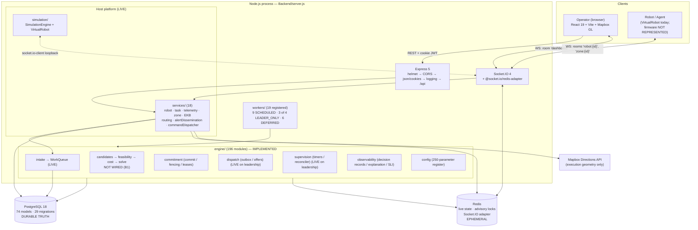
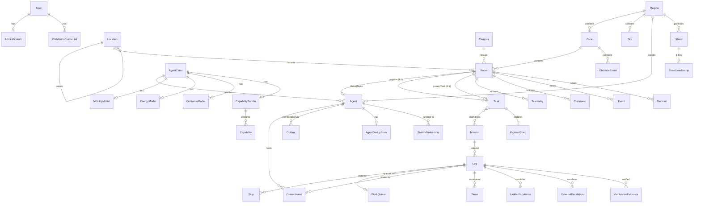
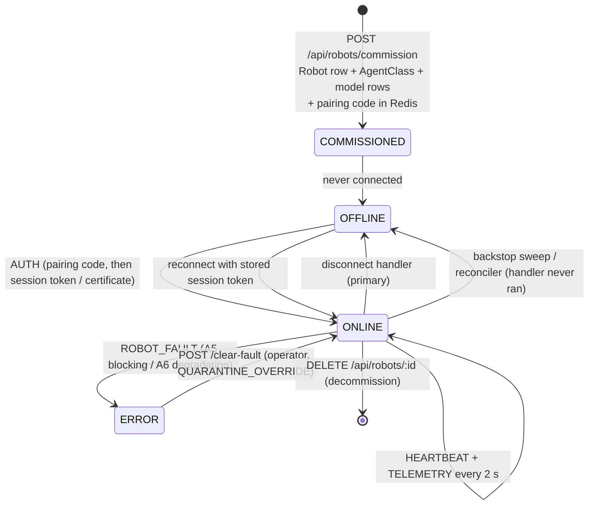
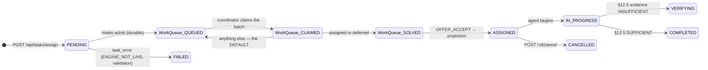
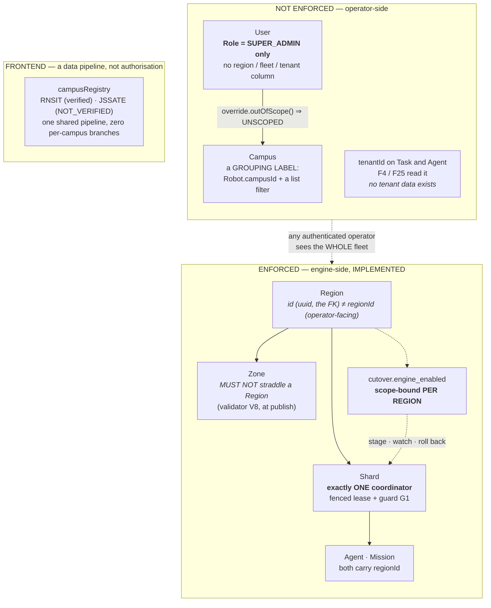
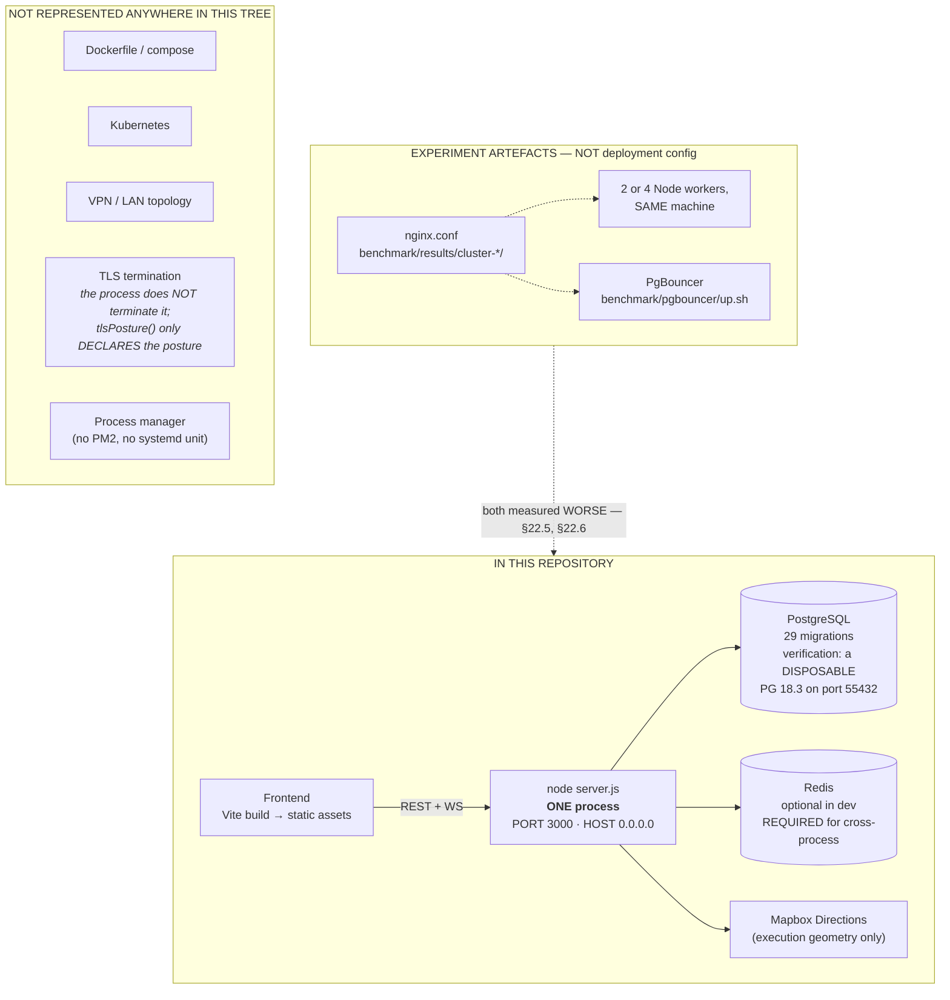

# RobotX Architecture

> **What this document is.** The authoritative technical description of **what RobotX is today** —
> reconstructed by reading the repository and by *executing* its own verification tooling, not by
> editing the previous version of this file.
>
> **What this document is not.** It is not architectural *authority*. It decides nothing and
> supersedes nothing. Where it and any document in [§2](#2-architecture-authority) disagree, the
> document in §2 wins and this one is defective.
>
> **The previous edition** (2026-08-29, HEAD `b68dc5d`) is preserved byte-for-byte at
> [`docs/history/architecture-snapshot-2026-08-29.md`](docs/history/architecture-snapshot-2026-08-29.md).

---

## 0. Provenance of this edition

| | |
|---|---|
| **Reconstructed** | 2026-09-07 |
| **Branch / HEAD** | `feature/dashboard` / `1223574` ("before changing to presentation") |
| **Working tree** | **DIRTY** — 22 modified files, 11 new paths (the uncommitted **P0 presentation pass**). Every statement below describes the *working tree*, which is what runs when you `npm run dev` |
| **Node / npm** | v22.17.0 / 11.12.1 (per `docs/runbooks/demonstration.md` §7) |
| **Measured by executing** | `npm run gates`, `npm run gate:calibration`, `npm run release:verdict`, plus direct module introspection (`require()` of the feasibility register and the parameter register) |

### 0.1 What was executed to write this, and what came back

| Command | Exit | Result observed 2026-09-07 |
|---|---|---|
| `npm run gate:tiers` | 0 | **PASS** — 295 modules, 459 governed import edges, no Tier 0/1 → Tier 2 |
| `npm run gate:params` | 0 | **PASS** — 193 engine modules against **250** registered parameters; 292 runtime modules checked; every name resolved |
| `npm run gate:tenets` | 0 | **PASS** — 292 modules |
| `npm run gate:privacy` | 0 | **PASS** — 16 modules; no street address is an input to any cost term |
| `npm run gate:erasure` | 0 | **PASS** — 3 corpus decisions, byte-for-byte reconstruction from Tier A under erasure |
| `npm run gate:legacy` | 0 | **PASS** — 4 retired modules absent across **353** files |
| `npm run gate:columngen` | 0 | **PASS — NOT_REQUIRED** (33 changed paths, none column-generation) |
| `npm run gate:composition` | **1** | **FAIL — 1 violation across 19 registered workers**: `coordinator`, `LEADER_ONLY_NOT_COMPOSABLE`, **34 declared inputs** enumerated in the failure text |
| `npm run gate:calibration` | **1** | **FAIL — 39 blocking findings.** 250 entries: **52 DERIVED / 160 PROVISIONAL / 38 UNCALIBRATED**; **54 Safety-class** |
| `npm run release:verdict` | **1** | **RELEASE: BLOCKED** — 0 green, 17 red (all `STALE`: evidence ≈ 8.5 days old against an 86 400 s admittance window), 7 `NOT_EVALUATED` |

**`npm run gates` exits 1, and that is the correct result on this tree.** See
[§7.1](#71-the-one-structural-break-b1) — the failing gate is the honest report of an external
blocker, not an engineering defect to be fixed.

### 0.2 Counts measured directly from the tree

| Quantity | Measured |
|---|---|
| Prisma models | **74** (`schema.prisma`, 4 065 lines) |
| Prisma enums | **16** |
| Migrations | **29** dated directories under `Backend/prisma/migrations/` |
| Backend `src/**/*.js` modules | **295** |
| — of which `src/engine/**` | **196** |
| Feasibility predicates | **38** (`engine/feasibility/register.js` — 19 class I, 7 P, 6 R, 3 C, 3 F) |
| Registered configuration parameters | **250** across 5 register files |
| Workers in the registry | **19** (`src/workers/registry.js`); 23 `.js` files in `src/workers/` |
| — SCHEDULED at boot | **9** |
| — LEADER_ONLY (on leadership) | **4** — of which **3 compose**, 1 refuses |
| — DEFERRED with named blockers | **6** |
| REST route groups under `/api` | **13** |
| Backend service modules | **18** (`src/services/`) |
| Socket.IO handler modules | **5** (`src/sockets/handlers/`) |
| Jest test files | **175**, in **5 projects** (legacy · gates · engine · chaos · scale) |
| Frontend source files | **114** |
| ADRs | **40** (`docs/adr/`) |

---

## 1. Executive overview

### 1.1 One paragraph

RobotX is a **fleet command-and-control platform for autonomous delivery robots**, with a real-time
operator dashboard. It is a Node.js monolith: Express for REST, Socket.IO for the bidirectional
robot and dashboard channels, PostgreSQL (via Prisma) as durable truth, Redis as live/ephemeral
state and cross-process fan-out. **The host platform is live and working**: robots authenticate,
stream telemetry, report obstacles, are commanded, are rerouted, and are rendered on a live map.
**Task assignment is not.** The original greedy DTARO allocator was *deleted* from the build; its
replacement — a 196-module assignment engine with a feasibility gate, an absolute-cost functional,
a min-cost-flow solve and a serialised commitment core — is **built, tested, and refuses to start**,
because it needs a routing engine, fifteen calibration values and six input families that nobody in
this repository is permitted to invent.

### 1.2 The status vocabulary used throughout

These are not synonyms. The difference between the middle three is the difference between a system
that works and a system that is merely written down.

| Label | Meaning |
|---|---|
| **DESIGN** | Specified in the frozen architecture. No code, or code not owned by a completed phase |
| **IMPLEMENTED** | Code exists, is tested, and passes the build gates |
| **NOT WIRED** | Code exists and is tested, but nothing in the repository constructs it in a production path |
| **LIVE** | Actually running and doing its job in the running process |
| **PARTIAL** | Some of it runs; a named part does not |
| **BLOCKED** | Cannot proceed until a named *external* decision, procurement, or measurement lands |
| **NOT VERIFIED** | Exists; the evidence for it is insufficient or has aged out |
| **NOT REPRESENTED** | Discussed in the project, but **absent from this repository**. No file describes it |

### 1.3 The three generations

| Generation | State | Where it is |
|---|---|---|
| Dashboard prototype (≈ Apr 2026) | **HISTORICAL** — superseded entirely | — |
| **Legacy DTARO assignment engine** (≈ Jul 2026) | **HISTORICAL — deleted from the build.** A gate fails if it returns | `docs/history/` |
| **Next-generation assignment engine** (Jul 2026 →) | **IMPLEMENTED · PARTIALLY WIRED · NOT DECIDING** | `Backend/src/engine/**` |

### 1.4 What runs today, in one table

| Subsystem | Status | Evidence |
|---|---|---|
| Robot authentication (pairing → session token → mTLS-capable) | **LIVE** | `sockets/handlers/robot.handler.js` |
| Telemetry ingestion + Redis live state + throttled Postgres mirror | **LIVE** | `sockets/handlers/telemetry.handler.js` |
| Dashboard live feed (`robot:update`, room-scoped) | **LIVE** | ibid. |
| Obstacle reporting → EKB → route-intersection → reroute fan-out | **LIVE** | `services/alertDissemination.service.js` |
| Operator commands (STOP/PAUSE/RETURN/RESUME) with ACK tracking | **LIVE** | `services/commandDispatcher.service.js`, `sockets/handlers/command.handler.js` |
| Commissioning, unit specification, decommissioning | **LIVE** | `controllers/robots.controller.js`, `services/robotSpecification.js` |
| Virtual robot simulator (reference agent implementation) | **LIVE** | `simulation/VirtualRobot.js` |
| Operator dashboard (7 pages, Mapbox campus map) | **LIVE** | `Frontend/src/` |
| Task **intake** — validate, create `Task`, map to Mission/Leg/Stops, enqueue `WorkQueue`, arm §4.5 deadline | **LIVE** (behind the cutover gate) | `services/task.service.js` → `engine/intake/intake.js` |
| Shard leader election, lease renewal, failover reconciliation | **LIVE** (with `ENGINE_ENABLED=true`) | `workers/shardSupervisor.worker.js` |
| Outbox drain, reconciler sweep, durable timers + §17.4 ladder | **LIVE** (on leadership) | `workers/leaderWorkers.js` |
| Shard supervisor, invariant checker, cutover controller, Tier B, fairness, rejection aggregation, certificate rotation, calibration, counterfactual | **LIVE** (the 9 `SCHEDULED` workers) | `server.js` — 7 via `startScheduledWorkers()`, 2 by their own `start()` calls |
| **The assignment round loop** (candidate → gate → cost → solve → commit) | **NOT WIRED — refuses to compose** | `gate:composition` FAIL |
| **`POST /api/tasks/assign`** on an unstaged shard | Returns **`503 ENGINE_NOT_LIVE`** | `services/task.service.js` |
| Physical robot hardware / firmware | **NOT REPRESENTED** — see [§13](#13-physical-robot-architecture) | no file in the repository |
| Machine learning / AI in any decision | **NOT PRESENT** — see [§25](#25-ai-and-machine-learning) | zero ML imports in `src/` |

---

## 2. Architecture authority

Read in this order. Each row wins over every row below it.

| # | Document | Role |
|---|---|---|
| 1 | `NEXT_GENERATION_ASSIGNMENT_ENGINE.md` | **The frozen architecture.** Absolute authority. 448 KB, §-numbered; every `§n.n` reference in the codebase points here |
| 2 | `docs/adr/` (40 records) | The 38 frozen Appendix C decisions + ADR-33 (B1 traversal-domain scope), ADR-34 (cutover-rehearsal purpose) |
| 3 | `IMPLEMENTATION_EXECUTION_PLAN.md` | The plan of record: 16 phases, blocking decisions B1–B8, the §24 release-gate table |
| 4 | `docs/phase15/PHASE_15_MASTER.md` | **Current programme status.** Start here for anything Phase-15 |
| 5 | `docs/v1/V1_IMPLEMENTATION_CONTROL.md` | The V1 stop conditions S-1…S-8 and the current score |
| 6 | `docs/runbooks/` — `rollback.md`, `cutover.md`, `demonstration.md` | Operational procedure. **Read `rollback.md` before `cutover.md`** |
| 7 | `Backend/src/engine/TIERS.md` | The obligation tiers, checked against `guards/tierAssertions.js` by a test |
| 8 | **This document** | Descriptive reconstruction. Authority over nothing |
| 9 | `docs/history/` | Superseded documentation of **deleted** systems. Not authority |

> **Two documents are build dependencies.** Tests read `NEXT_GENERATION_ASSIGNMENT_ENGINE.md`,
> `docs/adr/**` and `TIERS.md` from disk and assert against their contents. Moving, renaming or
> reformatting them breaks the build.

---

## 3. High-level architecture

### 3.1 The whole system



### 3.2 The two decision paths, and which one exists

```
                      ┌──────────────────────────────────────────┐
  HISTORICAL          │  LEGACY DTARO (DELETED at Phase 15)      │
  ───────────         │  request → greedy pick → reserve (Redis) │
                      │  → setImmediate detach → dispatch        │
                      │  4 modules removed; gate:legacy enforces │
                      └──────────────────────────────────────────┘

  CURRENT             ┌──────────────────────────────────────────┐
  ───────             │  ENGINE                                  │
   LIVE ────────────► │  1. intake: validate → Task → Mission/   │
                      │     Leg/Stops → WorkQueue row (durable)  │
                      │                                          │
   NOT WIRED ───────► │  2. round: claim batch → candidates →    │
     (B1)             │     38-predicate gate → Φ cost → solve → │
                      │     commit (SERIALIZABLE, G1–G6)         │
                      │                                          │
   LIVE ────────────► │  3. dispatch: outbox drain → OFFER →     │
                      │     agent ACCEPT/REJECT/DEFER            │
                      │                                          │
   LIVE ────────────► │  4. supervision: timers, ladder,         │
                      │     reconciler sweep                     │
                      └──────────────────────────────────────────┘
```

**Step 2 is the break.** Steps 1, 3 and 4 are composed and running; step 2 refuses to compose, so
nothing ever reaches step 3 with work in it.

### 3.3 Layering (§3.1 of the frozen architecture)

| Layer | What it is | Store |
|---|---|---|
| **L1 — Request** | REST/socket admission, validation, idempotency, queue placement. **No routing provider is consulted here** | Postgres (`Task`, `Leg`, `WorkQueue`) |
| **L2 — Live state** | Agent position, battery, heartbeat, availability index | Redis (advisory), Postgres (authoritative mirror) |
| **L3 — Commitment** | The durable contract binding an Agent to a Leg. **The only exclusivity mechanism** | Postgres, SERIALIZABLE |
| **L4 — Plan state** | Round-local SOFT reservations, columns, the incumbent | Coordinator memory; reconstructed on failover, never persisted |

The rule that makes this work: **§3.3 — the cache is never authoritative.** Every Redis key in the
system is either an advisory mirror of a Postgres row or a genuinely ephemeral value whose loss
costs latency and never correctness. `commit.js` takes **no cache dependency at all**.

---

## 4. Runtime and composition architecture

### 4.1 The composition root

`Backend/server.js` **is** the production composition root. There is no other. It is 1 184 lines and
almost all of it is dependency wiring with the reasoning inlined. What it does, in order:

```
1.  require config/env         → dotenv from Backend/.env
2.  eventLoopMonitor.start()   → perf_hooks histogram, exposed on /health
3.  http.createServer(app)     → Express app from src/app.js
4.  new Server(server, {cors}) → Socket.IO
5.  connectPrismaWithRetry()   → Prisma client
6.  initKv()                   → the Redis facade (src/cache/kv.js)
7.  Socket.IO Redis adapter    → pub/sub duplicate clients; warns loudly and
                                 falls back to the single-process adapter
8.  app.locals = {kv, prisma, io, config}
9.  configService.bootstrap()  → load + pin the published config version
10. configPropagation.start()  → the PULL loop (§22.1 rule 4). Republished
                                 config reaches a running process here
11. initSocketServer(io, …)    → registers 5 handler modules per connection
12. ensureAdminUser()          → idempotent admin bootstrap
13. if (ENGINE_ENABLED):
       election.postgresLeadershipStore(…)  ← refuses an undeclared
                                              SHARD_CONSENSUS_REPLICATION
       leaderWorkers.create(…)              ← the LEADER_ONLY lifecycle
       shardSupervisor.start(…)             ← lease renewal, failover,
                                              sizing, migration; onTick →
                                              leaderLifecycle.apply(tick)
       certificateRotation.start(…)         ← §23.2 revocation sweep
       startScheduledWorkers(…)             ← 7 of the 9 SCHEDULED workers
14. server.listen(port, host)
15. createVirtualRobotSimulator(…)  → started only if ENABLE_VIRTUAL_SIMULATOR=true
16. rehydrateSimulatedRobots(…)     → Robot.simulated = true rows ONLY; writes no liveness
17. re-dispatch active tasks after 5 s  (fleet-wide; not gated on the simulator)
18. SIGINT/SIGTERM → stop workers → release leadership → close → disconnect
```

### 4.2 The worker registry — the answer to "what runs?"

`src/workers/registry.js` is a *declarative table*, not inferred from reading `server.js`. Every row
carries a readiness, a spec section, a cadence source, and — if `DEFERRED` — a **mandatory**
`blockedBy`. `assertRegistry()` throws at module load on a row that violates the shape.

| Worker | Readiness | Cadence parameter | Status today |
|---|---|---|---|
| `shard_supervisor` | SCHEDULED | `shard.renewal_interval` | **LIVE** |
| `invariant` | SCHEDULED | `invariant.check_interval` | **LIVE** |
| `cutover` | SCHEDULED | `cutover.guardrail_check_interval` | **LIVE** |
| `tier_b` | SCHEDULED | `observability.tier_b_write_budget` | **LIVE** |
| `fairness` | SCHEDULED | `fairness.idle_alert_period` | **LIVE** (refuses to start if unresolved, and says so at `error`) |
| `rejection_aggregation` | SCHEDULED | *(none — module constant, 30 s)* | **LIVE** |
| `certificate_rotation` | SCHEDULED | `security.certificate_revocation_recheck_interval` | **LIVE** |
| `calibration` | SCHEDULED | *(none — module constant, 5 min)* | **LIVE** |
| `counterfactual` | SCHEDULED | *(none — module constant, 24 h)* | **LIVE** |
| `outbox` | LEADER_ONLY | `dispatch.max_delivery_delay` | **LIVE on leadership** |
| `reconciler` | LEADER_ONLY | *(none — worker ceiling)* | **LIVE on leadership** |
| `timer` | LEADER_ONLY | `supervise.max_timer_lag` | **LIVE on leadership** |
| **`coordinator`** | LEADER_ONLY | `solve.window_min` | **REFUSES — B1** |
| `shadow` | DEFERRED | — | needs a solve path → same B1 blocker |
| `index_maintainer` | DEFERRED | — | needs capability/charging classifiers |
| `capacity_pricing` | DEFERRED | — | **Tier 2**; `killswitch.opportunity_cost_term` thrown at launch |
| `charger_reachability` | DEFERRED | — | exposes a pass function, no scheduler; needs the routing client |
| `energy_calibration` | DEFERRED | — | inputs are realised-outcome rows the fleet has not produced (B8) |
| `service_time_model` | DEFERRED | — | §22.4 names per-site service-time models as data the fleet does not yet produce |

**Nine of nineteen are running at boot with `ENGINE_ENABLED=true`; three more start on leadership;
one refuses; six are deferred with declared, non-repository blockers.**

### 4.3 The refusal, not a stub

`workers/leaderWorkers.js` composes each `LEADER_ONLY` worker through a **composer that may refuse**.
The rule is stated in the registry and enforced here:

> A stub would produce a worker that runs, reports success, and computes nothing — the worst of the
> three possible states.

So `COMPOSERS.coordinator` *actually attempts the assembly* (`workers/coordinatorSolvePath.js` builds
the real `expandCandidates`, `pricedCandidateFor`, `expansionInputFor` and `commit` from the shipped
modules) and returns the measured list of what it could not resolve. The refusal you see in the log
is produced by the code that would run, not by a paragraph describing it.

---

## 5. Backend architecture

### 5.1 Directory map, with responsibility

```
Backend/
  server.js                    Composition root (§4.1). 1 184 lines
  src/
    app.js                     Express pipeline + GET /health (unauthenticated)
    routes/          (14)      13 route groups; every one does router.use(authUser)
    controllers/     (14)      HTTP handlers; thin, asyncHandler-wrapped
    services/        (18)      Transport-agnostic business logic
    sockets/
      socket.server.js         Connection gate; dashboard JWT check; 5 handler registrations
      robotSockets.js          Process-local socketId↔robotId map (presence only, never delivery)
      rateLimit.js             Per-socket, per-event token bucket
      handlers/       (5)      robot · telemetry · command · dtaro · offer
    engine/         (196)      The next-generation assignment engine — see §12
    workers/         (23)      19 registered; see §4.2
    simulation/       (3)      SimulationEngine, VirtualRobot, constants
    cache/
      kv.js                    THE sole Redis facade — pipelining, mget, fail-closed locks,
                               in-memory fallback, background reconnect with capped backoff
      robotStateCache.js       Per-process Robot row cache (the telemetry hot-path optimisation)
    db/prisma.js               Prisma client + runSerializable + selectForUpdate helpers
    middlewares/      (4)      auth_middleware (JWT + §23.4 RBAC), rateLimitHttp, errorHandler, notFound
    config/           (6)      env, logger (pino), cors, dtaro.constants, liveness.constants, privacyKeys
    observability/    (1)      eventLoopMonitor (perf_hooks histogram)
    utils/            (4)      asyncHandler, distance (haversine), json, parse
  prisma/                      schema.prisma (4 065 lines, 74 models), 29 migrations, seed.js
  tests/           (175)       5 Jest projects
  tools/                       gates/ · routing/ · release/ · replay/ · safetyCase/ · verify/ · migrate/
  benchmark/                   Load harness + 18 result directories (see §22)
```

### 5.2 The service layer (18 modules)

| Module | Responsibility | Called by | Calls |
|---|---|---|---|
| `robot.service.js` | Commission, list, update specification, retire | `robots.controller` | Prisma, `robotSpecification` |
| `robotSpecification.js` | **Pure.** Chassis vocabulary (ROVER/DRONE) → `AgentClass` + Mobility/Energy/Container models + `chassis_type` capability | `robot.service`, `task.service` | nothing |
| `task.service.js` | §3.4 request path: validate → payload spec → cutover gate → `Task` → `admitToRound` | `tasks.controller`, `socket.server` | `engine/intake`, `engine/domain/mappers` |
| `telemetry.service.js` | Persist a `Telemetry` snapshot row | `telemetry.handler` | Prisma |
| `robotRegistry.service.js` | Redis live-robot registry: online/offline, merged state, health, assigned task | telemetry/robot/dtaro handlers | `kv` |
| `zoneManager.service.js` | Bounding-box zone membership; 3-tier cache (60 s process → 5 min Redis → Postgres); socket room join/leave | telemetry handler, robot handler | Prisma, `kv` |
| `ekb.service.js` | Environmental Knowledge Base: obstacle store with TTL (Redis) + durable `ObstacleEvent` | `alertDissemination` | Prisma, `kv` |
| `routeIntersection.service.js` | **Pure geometry.** Segment–segment intersection of planned paths against an obstacle box | `alertDissemination` | nothing |
| `alertDissemination.service.js` | Obstacle → zone → EKB → `ALERT_CREATED` → affected robots → `REROUTE_ALERT` → replan | `dtaro.handler` | ekb, zone, registry, routing |
| `routing.service.js` | Server-side path replanning for an affected robot | `alertDissemination` | `mapbox.service` |
| `mapbox.service.js` | Mapbox Directions API client; 3 profiles (driving → walking → cycling) | routing, task, executionGeometry | HTTPS |
| `executionGeometry.service.js` | **NEW (P0).** Resolves the drivable polyline for an offer's stop sequence, **outside** the commit transaction | `coordinatorSolvePath` | `mapbox.service` |
| `assignmentProjection.service.js` | **NEW (P0).** Projects an accepted commitment onto the legacy `Task.robotId` / `Robot.currentTaskId` columns the UI reads | `offer.handler` | Prisma, `kv` |
| `commandDispatcher.service.js` | The **only** server→robot emit path. Room-routed (`io.to("robot:{id}")`), adapter-aware, with retry policy | controllers, handlers, outbox worker | Socket.IO, `engine/degraded/modeRegister` |
| `campus.service.js` | List/create `Campus` rows | `campuses.controller` | Prisma |
| `location.service.js` | Location hierarchy (COUNTRY→STATE→CITY→AREA) with descendants | `locations.controller` | Prisma |
| `metrics.service.js` | `/health` metric aggregation + §20.1 SLI summary | `app.js` | Prisma, `kv` |
| `adminBootstrap.service.js` | Idempotent admin `User` creation from env | `server.js` | Prisma, bcrypt |

### 5.3 HTTP API — 13 route groups

Every group mounts `router.use(authUser)` **except** the unauthenticated `GET /health` on the app
root. `authUser` accepts an HttpOnly `token` cookie or a `Bearer` header, verifies the JWT, and
re-reads the `User` row (so a deleted user's live token stops working immediately).

| Mount | Endpoints | Guard beyond `authUser` |
|---|---|---|
| `/api/auth` | `POST /login`, `/google`, `/logout`, `/change-password`, `/pin-auth`; `GET /me`; 5 `webauthn/*` | login + webauthn rate-limited; `/login` & `/google` & `/logout` unauthenticated by design |
| `/api/robots` | `GET /`, `GET /state`, `GET /:id/history`, `POST /commission`, `POST /:id/command`, `POST /:id/clear-fault`, `POST /:id/pairing/unlock`, **`PATCH /:id`**, `DELETE /:id`, `POST /` (legacy) | `quarantineOverride` (§23.4 action class) on `clear-fault` and `pairing/unlock` |
| `/api/tasks` | `GET /`, `POST /assign`, `POST /:id/cancel`, `POST /:id/reroute` | `gateManualAssignment` (§23.4) on `/assign` |
| `/api/campuses` | `GET /`, `POST /` | — |
| `/api/locations` | `GET /`, `POST /`, `GET /:id/descendants` | — |
| `/api/simulator` | `GET /status`, `POST /start|stop|reset`, `PATCH /config` | — |
| `/api/config` | `GET /resolve`, `GET /versions`, `POST /versions` | `requireElevatedRole()` on the whole group |
| `/api/legs` | `GET /:legId/supervision` | — |
| `/api/diagnostics` | `GET /rejections`, `/energy/:agentId`, `/candidates/:legId` | — |
| `/api/explain` | `GET /queries`, `GET /:decisionId` | — |
| `/api/health` | `GET /invariants`, `/modes`, `/cutover` | — |
| `/api/shards` | `GET /`, `POST /:id/rebalance` | `requireElevatedRole()` on rebalance |
| `/api/privacy` | `POST /erasure`, `GET /identity/:key` | `requireElevatedRole()` on the whole group |

> **Naming note (documentation drift, corrected here).** The README and prior architecture editions
> say the refused endpoint is `POST /api/tasks`. It is **`POST /api/tasks/assign`**.

### 5.4 REST vs Socket.IO — which mechanism carries what

This split is not stylistic. The rule is: **REST for operator intent that must return a verdict;
Socket.IO for continuous state and for anything addressed to a robot.**

| Operation | Mechanism | Why |
|---|---|---|
| Login, session, WebAuthn | REST | Needs a status code and a `Set-Cookie` |
| List robots / tasks / locations | REST | Request/response with pagination-shaped answers; the dashboard hydrates on mount |
| Commission / retire / edit a unit | REST | The caller must learn *why* a validation failed, in the response |
| Create a task | REST (`POST /api/tasks/assign`) | The §3.4 contract returns queue position + predicted window, or **503 with a code** |
| Operator command to a robot | REST in, **Socket.IO out** | The HTTP call creates a durable `Command` row; delivery is a room emit; the ACK closes the row |
| Robot AUTH / HEARTBEAT / TELEMETRY | Socket.IO | Continuous, high-rate, connection-scoped |
| `TASK_ASSIGN` / `OFFER` / `REROUTE_ALERT` / `STOP` | Socket.IO | Addressed to a specific robot, which has no inbound address |
| `robot:update`, `TASK_UPDATED`, `ALERT_CREATED` | Socket.IO → room `dashboard` | Push; a poll at this rate would be the original O(N²) problem |
| Health / metrics | REST (`GET /health`, unauthenticated) | Load balancers and monitoring poll it |

---

## 6. Database architecture — PostgreSQL and Prisma

### 6.1 Why Prisma, and what it costs

Prisma is the **only** route to Postgres (`src/db/prisma.js` owns the single client). It was chosen
for a typed query surface, a migration history that is a first-class artefact (30 ordered
directories, each reviewable), and `previewFeatures = ["metrics"]` — which is what makes
`prisma_pool_connections_busy` and `prisma_client_queries_wait_histogram_ms` readable from
`GET /health`. That instrumentation is not incidental: **pool wait is the metric that identified the
500-robot bottleneck** (§22.3).

Its costs are acknowledged in the code: raw SQL is used where Prisma cannot express the need —
`runSerializable()` and `selectForUpdate()` in `db/prisma.js` exist because §10.3.2's commit needs
`SERIALIZABLE` plus `FOR UPDATE` row locks, and three migrations add **database triggers** as schema
backstops (config immutability, `Commitment.kind = 'HARD'` CHECK, decision-record immutability) so
the invariants hold even when application logic is defective.

### 6.2 The two vocabularies

The schema carries **two generations of model side by side**, deliberately, and knowing which is
which is the single most useful thing to understand about it.

| | **Legacy vocabulary** | **Engine vocabulary (§2)** |
|---|---|---|
| The machine | `Robot` | `Agent` (1:1 projection via `Agent.robotDbId`) |
| Its type | *(none)* | `AgentClass` → `MobilityModel` · `EnergyModel` · `ContainerModel` · `CapabilityBundle` |
| The work | `Task` | `Mission` (many-to-many with `Task`) → ordered `Leg`s → ordered `Stop`s |
| The binding | `Task.robotId` + `Robot.currentTaskId` | `Commitment` (durable, fenced, SERIALIZABLE) |
| Geography | `Location` (4-level tree), `Campus`, `Zone` (bounding box) | `Region` → `Site` → `CellAssignment` (H3) |
| Queue | *(none — the legacy path had no queue)* | `WorkQueue` |

**Neither is dead.** The legacy columns are what every existing dashboard screen reads; the engine
columns are what every decision reads. The **`assignmentProjection.service.js`** module (new in the
P0 pass) is the one-way bridge: after a commitment is accepted, it copies the fact into
`Task.robotId` / `Task.status` / `Robot.currentTaskId` so the old screens show the new engine's
decision. It writes *only* legacy columns, is imported *only* by socket handlers, and a test
(`assignmentProjectionIsolation.test.js`) asserts both directions of that isolation structurally.

### 6.3 What the important entities actually mean

#### `Robot` — the commissioned physical unit, and its live mirror

Not merely a row. A `Robot` is:

- **an identity** — `robotId` is the string a physical unit presents at `AUTH`, and the only thing
  the wire protocol knows it by;
- **a credential holder** — `session:{robotId}` (Redis) holds either a bearer session token or, after
  §23.2, a certificate binding; `pairing:{robotId}` holds the one-time commissioning code;
- **a live socket** — `socketId` on the row, `robot:{robotId}` as its Socket.IO room, membership in
  the `robots:all` Redis set;
- **an operational state** — `status` (IDLE/ACTIVE/PAUSED/OFFLINE/ERROR/ISSUES), `isOnline`,
  `lastSeenAt`, `lat`/`lon`/`speed`/`battery`. **The row is a throttled mirror**: the live values are
  in Redis at `robot:{robotId}` on every tick, and the row is flushed on status change, reconnect,
  a ≥2 % battery swing, or `DB_FLUSH_INTERVAL_MS`, whichever comes first;
- **a specification** — since the P0 pass, `massKg` and `batteryReservePct` live here, and the other
  four commissioning values live on the unit's own `AgentClass` model rows;
- **a projection source** — `Agent.robotDbId` makes exactly one `Agent` per `Robot`, and that is what
  the engine reasons about. The reverse is nullable: §25 admits agents with no `Robot` row (drones,
  human couriers).

**How a robot is authenticated:** see [§11.2](#112-robot--agent-authentication).
**How it is paired:** commissioning mints a code into `pairing:{robotId}`; the first successful
`AUTH` consumes it and mints a session token; five failures lock the unit out for an hour.

#### `Task` — the unit of customer-visible work

`Task` is what a customer asked for: an origin, a destination, and (since the P0 pass) a declared
payload and a requested chassis class. It is **not** the unit of assignment. §2.4 splits that:

```
Task  >──<  Mission  ──<  Leg  ──<  Stop
(what the        (the ordered   (one agent,   (a located,
 customer         set of Legs    one commit-   time-windowed
 asked for)       that discharge  ment)         action)
                  it)
```

For a simple pickup→drop delivery the mapper (`engine/domain/mappers/legacyTask.js`) collapses this
to **one Mission, one PRIMARY Leg, two Stops**, with ids that are a pure function of `Task.taskId` —
which is what makes a retried submission converge on the same rows instead of creating a second Leg.

`Task.status` carries **both** vocabularies: the six legacy values (`PENDING`, `ASSIGNED`,
`IN_PROGRESS`, `COMPLETED`, `FAILED`, `CANCELLED`) and the eight §4.2 states (`RECEIVED`, `REJECTED`,
`PLANNABLE`, `WAITING`, `IN_EXECUTION`, `AT_RISK`, `SUSPENDED`, `VERIFYING`).

#### `Commitment` — the durable contract, and the only exclusivity mechanism

This is the heart of the correctness argument.

- **Only HARD commitments exist in the store.** A SOFT reservation is round-local coordinator memory
  and MUST NOT be written here. A `kind = 'HARD'` CHECK constraint in the migration is the schema
  backstop for invariant I18.
- A partial unique index enforces **≤ `capacity[agent_class]` active commitments per agent** (I1).
- Each commitment draws its own **fencing token** from `Agent.fenceCounter`, and is compared *per
  commitment id* — never as a single maximum across an agent's concurrent commitments. The separate
  `Agent.authorityEpoch` is the agent-scope fence, advanced on quarantine, session rekey and shard
  migration.
- `onDelete: Restrict` on both foreign keys: a durable contract must not be silently destroyed by
  deleting the row it binds.

#### `WorkQueue` — the thing whose absence was the original defect

The legacy path detached assignment into a `setImmediate` with no owner, no timeout, no retry and no
observability. §5.2 item C6 of the execution plan names the consequence: *"stuck at PENDING with no
record of the failure."* `WorkQueue` is the fix: the request path's **last act** is a durable queue
row, and the round path's **first act** is to read it. Between them there is no closure and no
process-local state, so a restart loses nothing and a waiting Leg is a row with a position, an age
and a state.

Rows move `QUEUED → CLAIMED → SOLVED`, always by **conditional write on `(id, state, version)`**, so
two coordinators racing produce one winner and one no-op without a distributed lock.

#### `Region` / `Site` / `CellAssignment` / `Shard` — the real isolation model

- **`Region`** is the operating region. `Agent.regionId`, `Mission.regionId` and `Zone.regionId` all
  point here. It has two identifiers and they are different things: `Region.id` is a uuid (the FK
  target) and `Region.regionId` is the operator-facing string. `server.js` resolves the *business*
  identifier for §18.6's contact set precisely because an operator authors that map by the region
  they know — a bug found only by running against a live database.
- **`Shard`** is the unit of the single-writer guarantee. Exactly one coordinator per shard, chosen
  by leader election with a fenced lease. `ShardMembership` is a transactional handoff **with a
  history** — deliberately not a `currentShardId` column on `Agent`, because a denormalised pointer
  would be a second place the answer lives.
- **`CellAssignment`** is H3 cell → zone containment, **by published assignment, never by query-time
  geometry** (§3.6, ADR-28). The `Zone` bounding box is legacy DTARO state and is not what the engine
  resolves containment from.

#### `ConfigVersion` / `ParameterRegisterEntry` — configuration as a versioned artefact

Configuration is not a `.env` file. 250 parameters are declared in five JSON register files with a
change class (HOT/TUNED/POLICY/SAFETY/STRUCTURAL/DERIVED/CONTRACTUAL) and a calibration status
(DERIVED/PROVISIONAL/UNCALIBRATED). A version is **published**, then **pinned**; publishing is an
approved operation and `ConfigVersion`/`ConfigScopeBinding` are immutable once written — enforced by
**database triggers**, not only by application code.

#### `DecisionRecordA` / `DecisionRecordB` / `InputSnapshot` — explainability as a functional requirement

Two tiers. Tier A is written for **every** decision and carries the complete §21.2 shape; Tier B is
sampled within a per-shard write budget and carries the full candidate set. `InputSnapshot` pins
what the round saw. The property that makes this worth anything is verified at build:
`gate:erasure` reconstructs Tier B **from Tier A alone, byte for byte**, and still does after the
inputs have been through `privacy/erasure.eraseCorpus()`.

### 6.4 Entity-relationship overview (the load-bearing subset)



---

## 7. What is blocked, and by what

### 7.1 The one structural break: B1

`gate:composition` fails on exactly one worker. Its failure text enumerates the coordinator's whole
declared contract — **34 inputs**, each with an owner. The live measurement from the V1 core-path
harness (`docs/runbooks/demonstration.md` §5.3) is **26 of 34 unresolved**:

| Class | Count | What it is | Owner |
|---|---|---|---|
| `EXTERNAL_ROUTING` | **5** | `route` (the six-field traversal contract), `travelSdSeconds`, `speedMetresPerSecond` per profile, per-hop terrain (`climbM`/`descentM`/`stopStartCycles`), `timeBucket` | **B1** — blocked on D1 (no authoritative operating region), D3 (no fleet speed model), D8 (no extract vintage) |
| `REGISTER_UNRESOLVED` | **15** | Every `C_direct`, `C_risk`, `C_lifecycle` and `C_delay` exchange rate — `cost.energy.cu_per_wh`, `cost.wear.cu_per_metre`, `cost.failure.cu`, `cost.sla.cu_per_second_late`, `lifecycle.cu_per_*`, `energy.reserve_floor_wh`, … | **B8** — the §22.4 calibration owner. §22.3 forbids an automated process from choosing them |
| `NO_PRODUCER` | **6** | `environment.ambientC/packC`, `masses.vehicleMassKg`, `p_fail`, `route_hazard_cost`, per-profile return-leg Wh/metre, §14.4 battery-wear mission inputs (`socThroughput`, `dod`, `socMid`, `tempC`, `cRate`) | Engineering **+ a named data source**. These are missing *code against a data source nobody has named* — not a withheld decision |
| **satisfied** | **8** | `candidate.max_radius_by_sla_class`, `prisma`, `kv`, `runSerializable`, `selectForUpdate`, `signingKey`, `snapshot`, Ω correction | — |

**B1 releases 5 of the 26.** A routing engine arriving alone starts no coordinator.

### 7.2 The second boundary: S-5, the cutover binding

Even with the coordinator composable, `POST /api/tasks/assign` refuses. The cutover switch is a
**conjunction** (`engine/cutover/enabled.js`):

```
live = process ENGINE_ENABLED === "true"
       AND  the shard's published `cutover.engine_enabled` binding is true
```

The second half has never been published. That is **S-5**, an owner act, and it is measured as
*refused* on two independent grounds (V9 and S2), both needing a Safety authority and a second
approver that do not exist today (`SAFETY_APPROVAL_QUORUM = 2`, no self-approval, `FD-3 = NO`).

**The two boundaries are reached in this order, and they have different owners.** A task submission
hits S-5 first (503 before any row is written); the coordinator's S-3 refusal is one layer further in
and appears only in the server's own log at leadership promotion.

### 7.3 The release-gate table

`npm run release:verdict` reports **RELEASE: BLOCKED** — 24 blocking gates, **0 green**. Today all
17 `RED` rows are red for one reason: **`[STALE]` — the recorded evidence is ~8.5 days old against an
86 400 s admittance window.** Seven are `NOT_EVALUATED`, which blocks exactly as `RED` does but is
kept distinct so an incident review can tell *"we ran it and it failed"* from *"nobody ran it."*

> **Do not re-collect release evidence to make the verdict render better.** The verdict is BLOCKED
> either way; re-collection is the release owner's step at a quiescent tree.

---

## 8. Redis architecture

### 8.1 The rule every key obeys

**§3.3 — the cache is never authoritative.** Every key below is either an advisory mirror of a
Postgres row or a genuinely ephemeral value. Losing Redis entirely degrades latency and
cross-process broadcast; it must never change a decision. `engine/commitment/commit.js` — the module
that decides exclusivity — takes **no cache dependency at all**.

### 8.2 The facade

`src/cache/kv.js` is the **sole** Redis client in the application (the Socket.IO adapter in
`server.js` is the one exception, and it uses its own pub/sub pair). It provides:

| Operation | Note |
|---|---|
| `get` / `set(k,v,{ex})` / `del` | Basic KV with TTL |
| `mget(keys)` | One `MGET` round trip instead of N `GET`s |
| `setManyEx(entries)` | One pipeline instead of N awaited `SET`s |
| **`pipeline().get().set().exec()`** | Mixed batch, one round trip. **The single most important performance primitive in the system** — see §22.3 |
| `sadd` / `srem` / `smembers` | The live-robot index |
| `incr(k,{ex})` | Atomic counter (pairing-attempt lockout) |
| `reserveRobot(k,v,ttl,{advisory})` | `SET NX EX`. **Advisory by default since Phase 15** |
| `health()` | `{ redis, configured, reconnecting }` |

Three behaviours worth knowing:

1. **In-memory fallback with TTL semantics.** Every operation degrades to a `Map`, so the process
   runs without Redis at all (`REDIS_ENABLED=false` is a supported development mode).
2. **Background reconnect with capped exponential backoff** (1 s → 30 s, `unref`'d). Without it a
   single transient blip permanently downgraded the process to in-memory mode for the rest of its
   life — silently, with no way back short of a restart.
3. **The fail-closed distinction.** *Not configured* (no `REDIS_URL`) means single-process operation
   is intentional, so the memory lock is genuinely a lock. *Configured but unreachable* means the
   operator asked for a shared lock and there is not one — an advisory caller is granted it (§10.4:
   *"cache unavailability MUST NOT halt commitment"*), a caller that passed `{ advisory: false }`
   gets a 503 `LOCK_UNAVAILABLE`. **No caller in this repository passes `advisory: false`**; the
   throw is retained so the capability can still be expressed, never as the default.

### 8.3 Key catalogue — every family in the running system

**Host-platform keys**

| Key | Value | TTL | Writer | Reader |
|---|---|---|---|---|
| `robot:{robotId}` | Live state JSON — lat, lon, battery, status, speed, lastSeenAt, distanceTravelled | **15 s** | `telemetry.handler`, every tick | `robots.controller` live overlay, `task.service` reroute |
| `registry:{robotId}` | Merged registry state — adds `lastHeartbeat`, EMA `utilization`, `zoneId`, `plannedPath` | `REGISTRY_TTL` | `robotRegistry.service` | offline sweep, obstacle dissemination |
| `snapshotState:{robotId}` | `{t, lat, lon, battery}` — the throttle gate for `Telemetry` history rows | 86 400 s | `telemetry.handler` | itself |
| `robots:all` | **SET** of live robot ids | none | AUTH (`sadd`), disconnect + offline sweep (`srem`) | obstacle fan-out, `/health` |
| `session:{robotId}` | Bearer session token **or** a §23.2 certificate binding (JSON) | 86 400 s | `robot.handler` AUTH | `robot.handler` AUTH |
| `pairing:{robotId}` | One-time commissioning code | set at commission | `robots.controller` | AUTH; deleted on success |
| `pairingAttempts:{robotId}` | Failure counter (atomic `INCR`) | 300 s | `robot.handler` | itself |
| `pairingLocked:{robotId}` | Lockout flag after 5 failures | **3 600 s** | `robot.handler` | AUTH; cleared by `POST /:id/pairing/unlock` |
| `socket:{socket.id}` | Reverse map to `robotId`, for disconnect cleanup | 3 600 s | AUTH | disconnect |
| `taskPath:{taskId}` | `{toPickup:[…], toDrop:[…]}` — the drawable route | 86 400 s | `assignmentProjection`, `task.service` reroute | dashboard re-hydration, reroute |
| `robotTaskState:{robotId}` | `{phase, pathIndex, …}` — progress along the path | 86 400 s | `assignmentProjection`, VirtualRobot | reroute (resets `pathIndex`) |
| `robotTask:{robotId}` | Current task binding | — | dtaro handler | — |
| `ekb:obstacles` / `ekb:event:{id}` | The Environmental Knowledge Base — obstacle set + records | per-obstacle | `ekb.service` | 60 s sweep, dissemination |
| `zones:all` | Cached `Zone` list (tier 2 of a 3-tier cache) | **300 s** | `zoneManager` | `zoneManager` |
| `cmd:rt:{commandId}` / `cmdretry:{commandId}` | Command round-trip timing and retry state | short | `command.handler` | itself |
| `vr:battery:{robotId}` / `vr:batteryPersistAt:{robotId}` | Battery persistence across restarts | 48 h | VirtualRobot, telemetry handler | VirtualRobot boot |
| `vr:dedup:{robotId}` | The agent's **non-volatile** §11.5 deduplication state (Redis stands in for flash) | 1 800 s | VirtualRobot | VirtualRobot |
| `webauthn:{purpose}Challenge:{userId}` | WebAuthn ceremony challenge | short | `webauthn_controller` | itself |
| `robotReserve:{robotId}` | **Advisory only** since Phase 15 | 30 s | *(no production caller)* | — |

**Engine keys** — all advisory (§3.3), each named with the row that is authoritative instead

| Key | Purpose | Authority |
|---|---|---|
| `engine:queue:{shardId}` | Queue-depth peek for an operator surface | `WorkQueue` table |
| `engine:round:{shardId}:current` | Round liveness. **Never a lock** — leadership is | `Round` table |
| `engine:shard:leader:{shardId}` | Leadership mirror. `/health` deliberately reads the **durable row**, because a probe answering from a cache would report a dead coordinator as leading for the mirror's whole TTL | `ShardLeadership` |
| `engine:mode:{shardId}` | Open degraded modes, for pollers | `DegradedModeEvent` |
| `engine:offer:{commitmentId}` | Offer state mirror | `Outbox` |
| `engine:outbox:claim:{workerId}` | Drain claim mirror | `Outbox.claimedBy` |
| `engine:idx:{shard}:{cell}:{availClass}` | The cell-partitioned availability index (§6.2) | Agent rows |
| `engine:feas:agent:{id}` · `engine:feas:class:…` · `engine:feas:neg:{pair}` | Feasibility caches, tiered AGENT / CLASS / negative | recomputation |
| `engine:route:cell:{o}:{d}:{profile}:{bucket}` | Cell-pair hop cache | the routing engine (**absent — B1**) |
| `engine:charger:reach:…` · `engine:charger:proj:{version}` | Charger reachability and availability projections | Postgres |
| `engine:price:{version}` | λ_zone snapshot | Tier 2, kill switch thrown at launch |
| `engine:sli:{shard}:{instance}` · `engine:sli:instances:{shard}` | SLI registry | — |
| `engine:timerlag` | Timer-lag SLI gauge | `Timer` table |
| `engine:pack` | Packing result cache (§15.3 tier 4 memo; never memoises `BUDGET_EXHAUSTED`) | none — recomputation. The `PackingResultCache` table was never read or written and was dropped by `20261005180000_schema_cleanup_stage1` |
| `config:v:{version}` · `derived:{digest}` · `regime:{name}` | Config mirrors | `ConfigVersion` |

### 8.4 The lifecycle of one robot's Redis state

Traced from source. Every step is a real write in the current tree.

```
COMMISSION   robots.controller:  SET pairing:{id} = <code>
             (no live state — the unit has never connected)

CONNECT      Socket.IO handshake. No robot state yet.

AUTH         robot.handler:
               DB   robot.findUnique   → seeds robotStateCache (process memory)
               GET  session:{id}, GET pairing:{id}        (one Promise.all)
               SET  session:{id} = <uuid>  EX 86400       (mint on first pair)
               DEL  pairing:{id}, DEL pairingAttempts:{id}
               SET  socket:{socket.id} = {id}  EX 3600
               DB   robot.update {isOnline, socketId, lastSeenAt}
               SADD robots:all {id}
               registry: markOnline  → SET registry:{id}
               zoneManager:  socket.join("zone:{zoneId}")
             → emit AUTH_SUCCESS, socket.join("robot:{id}")

TELEMETRY    telemetry.handler, every 2 s per robot:
             ONE pipelined READ:
               GET robot:{id}, GET snapshotState:{id},
               GET registry:{id}, GET vr:batteryPersistAt:{id}
             ONE pipelined WRITE:
               SET robot:{id}         EX 15     (always)
               SET registry:{id}      EX ttl    (always — merged, EMA utilisation, zone)
               SET snapshotState:{id} EX 86400  (only when a snapshot was due)
               SET vr:battery:{id}    EX 48h    (only every ~2 min)
             Postgres write ONLY when: status changed | reconnected |
                                       |Δbattery| ≥ 2 % | flush interval elapsed
             → io.to("dashboard").emit("robot:update", fullState)

HEARTBEAT    robot.handler, every 2 s:
               SET registry:{id}.lastHeartbeat = now   (every beat, Redis only)
               DB  robot.lastSeenAt                     (throttled, same interval)

DISCONNECT   robot.handler:
               DEL  socket:{socket.id}
               SREM robots:all {id}
               DB   robot.update {isOnline:false, status:OFFLINE, socketId:null}
               registry: markOffline
             → io.to("dashboard").emit("robot_offline")

EXPIRY       robot:{id} lapses 15 s after the last tick — so a robot that vanished
             without a disconnect has no live state, while its DB row is repaired by
             the backstop sweep (engine off) or the reconciler (engine on).
```

### 8.5 Why both Redis and PostgreSQL

They are not interchangeable, and treating them as such is what the architecture spent a phase
undoing.

| | PostgreSQL | Redis |
|---|---|---|
| **Holds** | Persistent truth and history: who exists, what was committed, what happened | Live/ephemeral state: where a robot is *right now*, who is heartbeating, advisory mirrors |
| **Write rate** | Throttled — a `Robot` row is written ~4×/min at steady state | Per tick — ~30 writes/min/robot, batched into ~1 round trip |
| **Consistency** | ACID; `SERIALIZABLE` + `FOR UPDATE` where exclusivity is decided | None assumed. `kv.pipeline()` is explicitly **not** `MULTI` — it collapses round trips, it does not add cross-key atomicity |
| **If lost** | The system is down | The system degrades: broadcasts stop crossing processes, live overlays go stale, **decisions are unaffected** |
| **Authority** | Always | Never |

The reason for the split is **measured, not aesthetic**. At 500 robots the telemetry path originally
did a `prisma.robot.findUnique` *per frame*; that read alone drove Prisma pool wait to ~159 ms and
REST latency to ~21 s. Moving live state to Redis (and the row read to a process cache) took the same
tier to 0.01 ms pool wait and 189 ms end-to-end assignment. See [§22](#22-scalability-engineering).

---

## 9. Real-time architecture — Socket.IO

### 9.1 Connection establishment

One `io.on("connection")` handler (`sockets/socket.server.js`) serves **both** client kinds and
discriminates on the handshake:

```js
const isDashboard = !!(origin || (typeof ua === "string" && ua.includes("Mozilla")));
```

- **Dashboard socket** → must present the **same JWT REST auth uses**, from the HttpOnly `token`
  cookie (or `auth.token` for non-cookie clients). `verifyUserToken()` is the *same function* the HTTP
  middleware uses, so both surfaces enforce identical rules. On failure: `UNAUTHORIZED` + disconnect.
  On success: `socket.join("dashboard")`, then an immediate re-hydration pass emitting `TASK_ASSIGNED`
  for every active task with a cached path — so a browser that opens the page *after* the original
  broadcast still draws its routes.
- **Robot socket** → untouched at connect; it authenticates by emitting `AUTH` (§11.2).

### 9.2 Rooms

| Room | Members | Purpose |
|---|---|---|
| `dashboard` | Authenticated browser clients only | Every operator-facing broadcast. **This is the O(N²) fix** — telemetry used to be `io.emit`, which sent every robot's position to every *other robot*, none of which has any use for it |
| `robot:{robotId}` | Exactly one socket, joined at AUTH | **All** server→robot delivery. Adapter-aware, so it works across worker processes |
| `zone:{zoneId}` | Robots currently inside a zone | Zone-targeted broadcast; membership maintained by `zoneManager` on every position change |

**Nothing delivers a payload through the process-local socket map.** `sockets/robotSockets.js` still
exists for local presence checks, but `commandDispatcher` routes exclusively through `io.to(room)` and
`io.in(room).fetchSockets()`, which go through the Socket.IO adapter. That indirection is *required*,
not optional, the moment the process is one of several behind a load balancer — and a real bug once
shipped in the restart re-dispatch path from calling the two-argument form, which bound `robotId` to
`io` and made every re-dispatch a silent no-op that still reported itself as attempted.
`assertIoServer()` now fails loudly instead.

### 9.3 The Redis adapter

`server.js` attaches `@socket.io/redis-adapter` with a duplicated pub/sub client pair when
`REDIS_URL` is set. Its absence is the **one** place the graceful-degradation policy causes a real
behaviour change rather than a transparent one — cross-worker broadcast silently stops working — so
it is logged loudly:

> *"Socket.IO Redis adapter unavailable — falling back to the default single-process adapter. If this
> process is one of several workers behind a load balancer, dashboard broadcasts from other workers
> will NOT reach clients connected here."*

### 9.4 Event contract

**Robot → Server**

| Event | Handler | Rate limit | Effect |
|---|---|---|---|
| `AUTH` | `robot.handler` | 5 / 60 s, ≥100 ms | Certificate, session-token or pairing-code admission; shard identity resolved and cached on the socket; §11.5 dedup handshake; joins `robot:{id}` |
| `HEARTBEAT` / `heartbeat` | `robot.handler` | 10 / 5 s | Redis liveness every beat; throttled `Robot.lastSeenAt`; §23.2 revocation re-check on certificate sessions |
| `TELEMETRY` / `telemetry` | `telemetry.handler` | 50 / 5 s, ≥100 ms | The main pipeline (§16) |
| `OBSTACLE_REPORT` | `dtaro.handler` | 10 / 60 s, ≥500 ms | EKB store → dissemination → reroute |
| `TASK_COMPLETE` | `dtaro.handler` | 5 / 30 s, ≥1 s | §12.5 graded verification → legacy completion → release the robot |
| `ROBOT_FAULT` | `dtaro.handler` | 5 / 60 s, ≥1 s | §18.2 classification (A5 blocking / A6 degradation) → `ERROR` → `Event` row → dashboard |
| `COMMAND_ACK` | `command.handler` | — | Closes the `Command` row, records response time |
| `OFFER_ACCEPT` / `OFFER_REJECT` / `OFFER_DEFER` | `offer.handler` | — | §11.2. On ACCEPT: commitment → HARD, Leg → `ACCEPTED`, then the legacy projection |
| `SESSION_REKEY_ACK` | `robot.handler` | 10 / 60 s | Rotates the §23.2 binding. **The agent id is not a parameter** — that would be a privilege escalation wearing the name of a maintenance operation |
| `{COMMAND}_RESULT` | agent side | — | Query answers (§10.3.1 row 3 — queries are never fenced) |

**Server → Robot** (all through `commandDispatcher`, all room-routed)

| Event | Path | Fenced? |
|---|---|---|
| `TASK_ASSIGN` | Legacy dispatch; still used by the restart re-dispatch path | No |
| `REROUTE_ALERT` | Obstacle dissemination + operator reroute | No |
| `COMMAND` (STOP/PAUSE/RETURN/RESUME) | Operator, with a durable `Command` row + ACK | No |
| `STOP` | Task cancellation, fire-and-forget | No |
| `SESSION_REKEY` | §23.2 | — |
| **§10.3.1 engine commands** (`OFFER`, `WITHDRAW`, `RECALL`, `SHARD_MIGRATE`, `QUARANTINE`, `PROBE`, …) | **Only** via `deliverOutboxCommand` | **Yes** — commitment- or agent-scope fence, sequence, `not_valid_after`, HMAC signature |

**Server → Dashboard** (room `dashboard`)

| Event | Meaning |
|---|---|
| `robot:update` | The single canonical telemetry event. `ROBOT_UPDATE` and `robot_update` were **removed** — subscribing to all three fired the same handler 3× per tick |
| `ROBOT_UPDATED` | Status/fault change, carrying the §18.2 classification |
| `ROBOT_SPECIFICATION_UPDATED` | **New (P0).** A unit's configuration changed. Deliberately *not* folded into `robot:update`, which fires at tick rate |
| `robot_online` / `robot_offline` / `robot_unregistered` | Presence |
| `TASK_CREATED` | A `PENDING` card appears immediately |
| **`task_accepted`** | §3.4's honest intake acknowledgement: validated, admitted, deduplicated, routed to a shard, durably queued. **No robot has been chosen.** Carries queue position and predicted window |
| `task_assigned` (lowercase) | **A compatibility echo.** Its payload says `PENDING` / `robotId: null`, because that is the truth. The dashboard deliberately does **not** subscribe |
| **`TASK_ASSIGNED`** (uppercase) | A real assignment with a drawable route. Emitted by the projection after `OFFER_ACCEPT` |
| `TASK_UPDATED` | Lifecycle change (ASSIGNED / VERIFYING / COMPLETED / CANCELLED / REROUTED) |
| `task_error` | Intake refusal, carrying `code`. `ENGINE_NOT_LIVE` is the one that matters today |
| `OFFER_RESPONSE` | §11.2 accept / reject / defer |
| `ALERT_CREATED` / `REROUTE_ALERT` | Obstacle raised / robot rerouted |
| `SECURITY_EVENT` | §23.5 — `PERSISTENT_IMPLAUSIBILITY`, `UNREACHABLE_COMPLETION_CLAIM` |
| `SUPERVISION_SIGNAL` | §12.3 stall detection |
| `INVARIANT_STATUS_CHANGED` / `STRANDING_ESCALATED` | §26 invariant register, §18.6 escalation |
| `SHARD_LEADERSHIP_CHANGED` / `SHARD_MIGRATED` | §19 shard model |

> **The two events whose names lie, and why the dashboard reads only one.** `task_accepted` is the
> truth after the cutover; `task_assigned` survives only so an unmigrated client still renders a card.
> `Frontend/src/lib/socket.js` is the single place that documents which is which, and it exports
> `RETIRED_AFTER_RETENTION_WINDOW` so the eventual removal is one grep away.

### 9.5 Disconnect, reconnect, failure

- **Disconnect is handled twice, deliberately.** The *primary* signal is the socket `disconnect`
  handler, which marks the robot offline immediately. The *backstop* is a sweep in `socket.server.js`
  for robots whose handler never ran — a process kill, a half-open TCP connection, a lost network. The
  backstop is Redis-aware by necessity: because both TELEMETRY and HEARTBEAT throttle their
  `lastSeenAt` write, a stale DB column is no longer sufficient evidence that a robot is gone, so the
  registry's `lastHeartbeat` is consulted first.
- **Exactly one loop owns that fact.** With `ENGINE_ENABLED=true` the sweep stands down and the
  reconciler owns §12.4 row 9; with it false the legacy sweep runs. Never both — *"a divergence
  repaired twice, by two loops with different notions of stale, is the disagreement §12.1's
  control-loop model exists to remove."*
- **Reconnect** presents the stored session token (or certificate). `AUTH` replaces the previous
  socket, updates the DB `socketId` **first**, and only then disconnects the old socket — so there is
  no window in which the row points at a dead handle.
- **A shard migration disconnects the agent on purpose.** `membership.migrate()` advances the
  authority epoch, voiding every mission authority the agent holds; §11.5's deduplication handshake
  (by which the agent adopts a new epoch and fence floor) rides on `AUTH_SUCCESS`. So the agent
  reconnects, re-AUTHs, and `agentGate` resolves the shard it is now actually in. Cross-process by
  construction — the Redis adapter fans the disconnect out to whichever worker owns the socket.
- **Backpressure.** The telemetry handler drops frames when `ws.bufferedAmount` exceeds
  `SOCKET_BUFFER_LIMIT_BYTES` (default 1 MB).

---

## 10. Configuration architecture

### 10.1 Why it is not a `.env` file

§22.1 admits **no behavioural constant outside the register**, and `gate:params` enforces it over 193
engine modules — a bare numeric literal in a decision path fails the build unless it carries an
`@structural` annotation explaining that it is a unit conversion or a key scheme rather than a
threshold. (`.env` still exists, for **deployment** facts: connection strings, secrets, ports, the
master switch. Those are not behavioural constants.)

### 10.2 The register

250 parameters across five JSON files under `engine/config/register/`:

| File | Parameters | Source |
|---|---|---|
| `appendixA.json` | 89 | The frozen architecture's Appendix A |
| `supplementary.json` | 114 | Parameters the phases added |
| `cost.json` | 29 | §8's exchange rates |
| `killSwitches.json` | 12 | §22.5's Tier 2 switches |
| `legacy.json` | 6 | Legacy-path constants brought under governance |

Every entry declares a **change class** and a **calibration status**:

| Change class | Count | Meaning |
|---|---|---|
| POLICY | 71 | An operational policy choice |
| TUNED | 68 | Tunable within a validated range |
| **SAFETY** | **54** | §22.4: **no Tier 0 parameter may be PROVISIONAL or UNCALIBRATED at launch** |
| STRUCTURAL | 45 | Changes the shape of a computation, not its magnitude |
| DERIVED | 6 | Computed from others; a validator checks consistency |
| CONTRACTUAL | 3 | Bound by an external agreement |
| OPERATIONAL | 3 | — |

| Calibration status | Count |
|---|---|
| DERIVED — measured and defensible | **52** |
| PROVISIONAL — a placeholder that works | **160** |
| UNCALIBRATED — nobody has chosen a value | **38** |

**`npm run gate:calibration` FAILs at 39 blocking findings** — every one a Safety-class parameter that
is PROVISIONAL or UNCALIBRATED. Each names what it awaits, e.g.
`security.position_plausibility_tolerance` → *"the measured distribution of implied speed between
accepted fixes, per agent class."* This is **execution-plan item B8**, a named calibration owner's
work, not a code change. The gate is deliberately **not** in `npm run gates` — it blocks the cutover,
not the build.

### 10.3 Publish, pin, propagate

```
POST /api/config/versions            (elevated role required)
   → validators run  (V1…V9 — including mutual satisfiability of the four lease
     parameters, and the rule that a Zone may not straddle a Region)
   → ConfigVersion row written        ← IMMUTABLE (database trigger, not just code)
   → optionally pinned  (body.pin !== false)
   → ConfigActiveVersion pointer + Redis mirror

Running process:
   configPropagation.start({ load: loadPinnedSnapshot, apply: … })
   → a PULL on a cadence, never a push
   → §22.1 rule 4: "pull-with-pin, never a push that could land mid-round"
   → app.locals.config is replaced; every reader reads it at CALL time
```

Two consequences are load-bearing, and both were once defects:

1. **Handlers read the snapshot through `appLocals` by reference**, so a republished configuration
   reaches an already-connected socket. Three handlers previously reached for
   `socket.request.app.locals.config`, which **does not exist** — the Socket.IO upgrade request never
   passes through the Express app — so every `configNumber()` call returned `undefined` in every
   deployment, and three §23.5 security controls were silently off.
2. **Worker *cadences* are resolved once** (an interval is a property of the timer you create), but
   **worker *configuration* is resolved through an accessor at promotion time**, so a leadership
   acquisition composes against the version in force then, not the one the process booted on.

---

## 11. Authentication, authorization, and security

### 11.1 Operator authentication

| Mechanism | Status | Detail |
|---|---|---|
| **Email + password** | **LIVE** | bcrypt; `POST /api/auth/login`; HttpOnly `token` cookie (`COOKIE_SECURE` / `COOKIE_SAMESITE` configurable); rate-limited |
| **Google Sign-In** | **LIVE** | `google-auth-library` verifies the ID token **server-side**; resolves to the existing account **by verified email**, never creating a second one. `User.googleId` is stamped on first use |
| **PIN step-up** | **LIVE** | `AdminPinAuth` — a separate table, bcrypt hash. Guards destructive intents in the UI |
| **WebAuthn / passkey step-up** | **LIVE, server-verified** | `@simplewebauthn/server`. `WebAuthnCredential` stores the COSE public key and a **signature counter that must strictly increase** (replay-clone detection). Challenges live in Redis. This is the fix for legacy finding **F31**, where the ceremony ran entirely in the browser, discarded the public key at registration, and treated any truthy assertion as sufficient |
| **Roles** | The `Role` enum has **exactly one value: `SUPER_ADMIN`** | There is no second role today. `security.elevated_roles` defaults to `["SUPER_ADMIN"]` |

### 11.2 Robot / agent authentication

Three states, and which applies is a **deployment decision, not a code change**:

| State | Trigger | Behaviour |
|---|---|---|
| 1. **Legacy** | No certificate presented, `AGENT_MTLS_REQUIRED` unset | Pairing code on first connect → mint a session UUID into `session:{id}` (86 400 s) → session-token reconnect thereafter. **This is what the simulator uses** |
| 2. **Opportunistic mTLS** | A certificate *is* presented | It is validated and bound `(agent_id, certificate, session_id)` whether or not mTLS is required. There is no window in which a real certificate is ignored in favour of a weaker credential that happens also to be present |
| 3. **Enforced mTLS** | `AGENT_MTLS_REQUIRED=true` | An absent or invalid certificate is refused. **Pairing is refused by name**, not by falling through — *"a bootstrap path that silently still works is not a bootstrap path; it is a second authentication scheme nobody is monitoring"* |

The peer certificate is accepted from three places because three deployments are normal: Node
terminating TLS (`getPeerCertificate()`), a reverse proxy forwarding the PEM in `x-client-cert`, or
the Socket.IO auth payload (simulator and tests). **The process does not terminate mutual TLS
itself**; `tlsPosture()` is logged once at boot, because the failure this exists to prevent — a
deployment that believes mTLS is enforced while agents connect unauthenticated — is silent by nature.

**Brute-force protection:** five failed pairing attempts (counted per `robotId`, *across* reconnects
and sockets) → one-hour lockout, clearable by `POST /api/robots/:id/pairing/unlock` under a
`QUARANTINE_OVERRIDE` action class.

**A type-confusion bug worth knowing (P14-R8).** The `session:{id}` key holds two different kinds of
thing: a bearer token (a secret) and a certificate binding (which names a public fingerprint). The
legacy branch once compared the *binding* as though it were a shared secret, so anyone who learned it
could authenticate as that agent without a certificate. `isCertificateBinding()` now refuses a binding
as a token, logs it, and falls through to pairing — the correct answer for a certificate-bound agent
that connected without its certificate.

### 11.3 Authorization

**Authentication** answers *"who are you"* — the JWT (operator) or the certificate/session token
(robot). **Authorization** answers *"may you do this"*, and there are two layers:

1. **`requireElevatedRole()`** — for a privileged *read*, or a whole route group (`/api/config`,
   `/api/privacy`, `POST /api/shards/:id/rebalance`). The role list comes from the register
   (`security.elevated_roles`), not from a constant duplicated per route file — because two copies of
   an authorisation list is one copy that gets updated.
2. **`requireActionClass(id, {subjectFrom})`** — §23.4's four high-privilege action classes:
   **quarantine override**, **safety-class config change**, **bulk cancellation**, **manual assignment
   against a Policy constraint**. Each requires an elevated role **plus a recorded reason** (request
   body or `X-Override-Reason`) and, where configured, a **second approver** (`X-Second-Approver`).

**Every authorisation decision is audited, including refusals** — appended to the hash-chained
`AuditEvent` stream *and* to the queryable `OverrideAudit` table. *"A stream holding only successes
answers 'nobody tried' to a question whose true answer is 'somebody tried eleven times.'"* The audit
write is best-effort and never turns a refusal into a 500, because a caller that received a 500 would
retry, and a retry landing after the audit recovered would look like a first attempt.

**Scope (region / fleet / tenant) is NOT enforced today**, and the code says so rather than assuming
it: `policyFor()` reads `req.user.scope`, the `User` table carries no such column, and
`override.outOfScope()` therefore treats every operator as unscoped. When those columns land, this is
the single place that changes and every gated surface inherits it.

### 11.4 Agent input is untrusted (§23.5)

| Reported field | Rule | Enforced? |
|---|---|---|
| **Position** | Kinematic plausibility against the last accepted fix, ceilinged by the agent's `MobilityModel` max speed. **A jump exceeding achievable speed is rejected, not smoothed** — the frame is dropped whole, because a smoothed jump is a position that is *plausible and wrong*, which every downstream consumer would then treat as measured | Computed always; **enforced only where the engine is the decision path for that agent's shard** |
| **Energy** | Monotonicity except while charging; rate-of-change bounds | ditto |
| **Health** | **Asymmetric.** Accepted for *restricting* the agent (an agent may always declare itself unfit); never for *expanding* eligibility. Returning to service is an operator action: `POST /api/robots/:id/clear-fault`, gated as an override | ditto |
| **Completion** | Graded verification (§12.5) **plus** an explicit kinematic check of the *claimed* position against the last accepted fix. An unreachable claim raises a `SECURITY_EVENT`, not a data-quality warning | ditto |
| **Capability** | **Rejected entirely.** The frame is *dropped*, not stripped — dropping makes the attempt cost the attacker their telemetry, which is the correct incentive | **Always** |

Why capability gets one word where every other field gets a validation rule: position can be
sanity-checked against physics, but a capability claim has nothing to check it against, because *the
claim is the fact.* Capabilities derive from the commissioning record plus a signed
firmware/hardware attestation.

Persistent implausibility (a counter per agent, cleared on any accepted frame) crossing
`security.implausible_report_quarantine_threshold` raises a `SECURITY_EVENT` and quarantine. **If that
threshold does not resolve, the control is off, and the code says so at `error` level** — because an
operator who has never seen that line cannot tell *"no agent has misbehaved"* from *"the check cannot
fire."*

### 11.5 Engine command security

Every §10.3.1 command carries a **fence**, a **sequence number**, a **`not_valid_after` expiry**, and
an **HMAC signature** (`COMMAND_SIGNING_KEY` — an operator-declared deployment secret; the code
refuses to invent one, and the paths that need it report `NO_COMMAND_CREDENTIALS` rather than emitting
unsigned commands). Two fence scopes, compared differently:

- **Mission scope** — rejected at `fence ≤ highest_seen[commitment_id]`, **per commitment id**, never
  against a maximum across the agent's concurrent commitments;
- **Agent scope** — rejected at `authority_epoch < highest_seen_authority`;
- **Queries are never fenced.** Always answered.

Those three predicates live in **one module** — `engine/commitment/fencing.js` — imported by both the
server and `VirtualRobot`, precisely so the two cannot drift apart. A firmware author porting the
agent side ports that module.

---

## 12. The assignment engine

### 12.1 Obligation tiers (§1.8) — the normative core

A mechanism's tier states **what its absence or incorrectness costs**.

| Tier | If it is wrong | May a release ship without it? |
|---|---|---|
| **0 — Safety core** | A physical incident: a double-commanded machine, a stranded or immobilised agent, lost goods, an unsafe pairing executed | **No.** No agent may be commanded by an engine whose Tier 0 is incomplete |
| **1 — Operational integrity** | The engine is unsupportable, unauditable, or unbounded in time — it makes decisions nobody can explain, reproduce, or terminate | **No**, for production. A Tier 1 gap is a launch blocker, not a safety event |
| **2 — Allocation quality** | The engine allocates worse than it could. Nothing physical is at risk | **Yes** — each individually disableable (§22.5) |

Three rules. `gate:tiers` enforces the second over the static import graph (295 modules, 459 governed
edges):

1. Every Tier 2 mechanism must be **individually disableable**, degrading to a Tier 1 behaviour that is
   itself complete and tested. A kill switch that degrades to an untested path is not a control.
2. **No Tier 0 or Tier 1 guarantee may depend on a Tier 2 mechanism.** The compliant pattern is
   dependency inversion — `cost/phi.js` (Tier 1) exposes `registerTerm()` and the Tier 2
   `C_opportunity` injects itself. *"A Tier 2 mechanism statically linked into the Tier 1 path is a
   kill switch that cannot actually be thrown."* With nothing registered, Φ is exactly the Tier 1
   functional — **five terms instead of six — and it says so in its breakdown** rather than reporting a
   zero that could be mistaken for "the opportunity cost happened to be nil."
3. The staged order is a consequence, not a suggestion: Tier 0 + Tier 1, at `capacity[agent_class] = 1`,
   in the singleton regime, with deferral and preemption off and λ_zone from static priors, **is a
   complete, safe, shippable engine.** Phases 0–15 deliver exactly that; Phase 16 enables Tier 2 one
   mechanism at a time.

**Tier 0 carries invariants I1, I2, I4, I5, I7, I8, I9, I12, I16, I17, I18, I19, I21, I22.**

### 12.2 The round, end to end

```
leadership → claim batch → snapshot → plan (L4) → commit (L3) → settle → record
```

Two orderings must never be reversed, and `coordinator.worker.js` states why:

1. **Leadership first.** Guard G1 fences the commit itself, so a stale leader cannot write — but one
   that *planned* would still spend routing budget and emit decision records for a shard it does not
   own. The check is cheap and it is first.
2. **Settle the queue after the commit, never before.** A row moved to `SOLVED` before its commit
   landed would be a Leg removed from the queue with no commitment to show for it — the original
   "stuck at PENDING with no record" defect reproduced one layer down.

```mermaid
sequenceDiagram
    autonumber
    participant C as Coordinator (LEADER_ONLY)
    participant DB as PostgreSQL
    participant EX as candidates/expansion
    participant FG as feasibility (38 predicates)
    participant PH as cost/phi (Φ)
    participant SV as solve/round + minCostFlow
    participant OB as Outbox
    C->>DB: readStoreTime() — the STORE's clock, never the worker's
    C->>DB: readLeadership(shardId); shouldStopCommitting()?
    Note over C: NOT_LEADER → return. Refuse to PLAN, not merely to commit
    C->>DB: readQueueState → depth, SLA classes waiting
    C->>C: cadence.windowFor() → window + maxLegsThisRound
    C->>DB: claimBatch — conditional write on (id, state, version)
    C->>C: pin decisionTime, derive seed from roundId, planState.beginRound
    loop per Leg
        C->>EX: expandCandidates (radius by SLA class, availability index, Ω)
        EX-->>C: candidate agents
        loop per candidate
            C->>FG: evaluate — ALL 38, three-valued, collectAll
            FG-->>C: ADMIT | DENY(reason) | INDETERMINATE(reason)
            C->>PH: Φ(plan) over EVERY Leg the plan executes
            PH-->>C: γ in integer milli-CU, or a refusal naming the missing input
        end
    end
    C->>SV: solve within budgets (time, columns, branch nodes) — anytime
    SV-->>C: assignments + deferrals + a PROVEN gap, or no gap at all
    loop per assignment
        C->>DB: commit — SERIALIZABLE, FOR UPDATE, guards G1..G6
        DB-->>OB: Outbox row written IN THE SAME TRANSACTION
    end
    C->>DB: settleBatch — SOLVED, or back to QUEUED
    C->>DB: Round row + InputSnapshot + Tier A per Leg (+ sampled Tier B)
```

**This sequence does not execute in production.** Every module in it is implemented and tested;
`coordinatorSolvePath.create()` assembles them from the shipped modules; the assembly refuses on 26 of
34 inputs. A round has never run outside a test.

### 12.3 Candidate generation (§6)

The engine does not evaluate every robot. `engine/candidates/` provides:

| Module | Role |
|---|---|
| `availabilityIndex.js` | A cell-partitioned index (`engine:idx:{shard}:{cell}:{availClass}`), so the scan covers the cells that could plausibly serve the origin rather than the fleet |
| `expansion.js` | Ring expansion outward from the origin cell, bounded by `candidate.max_radius_by_sla_class` and `candidate.max_evaluated` |
| `lowerBound.js` | An **admissible** bound. A candidate whose optimistic cost already exceeds the incumbent is pruned without evaluation. Admissibility is its own release gate (`lower_bound_admissibility`) because a bound that is *not* admissible prunes the optimum and nobody notices |
| `omega.js` | The Ω correction — the difference between the index's coarse view and the true state |
| `ordering.js`, `clusterShare.js`, `admissibilityGate.js` | Determinism and fairness of the scan order |

### 12.4 The feasibility gate (§7) — Tier 0, mechanism T0-01

**38 predicates**, evaluated as a boolean pre-cost gate that is *structurally incapable of being
bypassed*. §7.1's rule is absolute: the gate **is evaluated before cost and is never traded against
it.**

| Class | Count | On `INDETERMINATE` | Meaning |
|---|---|---|---|
| **I** — Identity / integrity | **19** | **DENY** | Facts about the agent that must be true |
| **R** — Resource | **6** | **DENY** | Energy, capacity, charger reachability |
| **P** — Policy | 7 | configurable | Tenant scope, cooloff, restrictions |
| **C** — Capability | 3 | configurable | Typed requirement matching |
| **F** — Forecast | 3 | configurable | Deadline and plan feasibility |

By group: identity/lifecycle 6 · safety/health 6 · connectivity/commandability 4 ·
commitment/availability 4 · capability/payload 6 · spatial-temporal-regulatory 7 · computed mission
feasibility 5.

**Eleven are `volatile`** — F7, F8, F10, F13, F14, F16, F17, F18, F20, F34, F35 — meaning they can
change between plan and commit, so they are **re-checked inside the commit transaction**. Cache tiers:
12 `AGENT`, 5 `CLASS`, 21 `NONE`.

Two rules make this gate what it is:

- **UNKNOWN IS NOT PERMISSION.** Three-valued evaluation with DENY on indeterminate for every class I
  and R predicate. A `systemicGuard` exists for the case where *everything* is indeterminate — which
  is an infrastructure failure wearing the costume of a fleet with no capable agents.
- **The answer is the whole set**, not whichever predicate denied first (`collectAll`), so an operator
  asking *"why not this robot?"* gets every reason rather than the first one alphabetically.

Selected predicates, so the flavour is concrete:

| ID | Statement |
|---|---|
| F1 | Agent exists and is commissioned |
| F7 | Emergency stop not engaged |
| F13 | Live session exists and heartbeat within `connectivity.max_heartbeat_age` |
| F17 | The candidate plan holds no more than `capacity[agent_class]` concurrent commitments |
| F21 | `RequirementSet(m) ⊆ CapabilityBundle(a)` under §2.3's typed algebra |
| F22 | Total payload mass ≤ rated capacity × `payload.safety_factor` **at every loading state** |
| F27 | Agent authorised in every zone the planned route traverses |
| F33 | Geofence — origin **and** destination inside the serviceable region |
| F34 | Energy feasibility with layered reserves at the configured confidence |
| F35 | Charger reachable from the projected mission end with reserve intact |
| F38 | A complete, executable plan exists with all stops sequenced |

> **What the gate currently answers on a fixture run** (measured in
> `tests/engine/coordinatorSolvePathComposition.test.js`, 92 tests): **exactly one predicate returns
> `VIOLATED` — F17** — and that is *correct behaviour of a correct predicate*: the fixture's plan
> extends 920 s against a published `plan.commitment_horizon` of 900 s. **Every other denial is
> `INDETERMINATE` — an absence, not a violation.** That is *UNKNOWN IS NOT PERMISSION* holding at
> runtime: the gate denies because it cannot see, and it says which of the two it is.

### 12.5 Cost (§8) — absolute CU, never a normalised score

```
Φ(plan) = C_direct + C_opportunity + C_risk + C_lifecycle + C_policy + Σ C_delay[l]
                                                                    l ∈ legs(plan)
```

Four properties, each deliberate:

1. **It is a functional over *plans*, not a score over *pairings*.** `legs(plan)` is **every** Leg the
   plan executes — including the ones the agent had already committed. So inserting a new Leg into an
   occupied agent's plan is priced *automatically*: the delay it imposes on the existing Legs, the
   extra energy, the extra wear, the altered terminal state. **There is no separate "insertion cost
   model" that could disagree with the cost model**; there is one functional evaluated at two plans.
2. **The pairing cost is the degenerate case.** For an idle agent, `plan₀` is empty and
   `γ = Φ(plan with l) = Cost(a,l)`. Nothing about the single-mission case becomes more complicated.
3. **No normalisation, no rescaling, no relative ranking.** Each addend estimates a real quantity of
   resource consumed or value destroyed, in **integer milli-CU**. `units.refuseNormalisation()` exists
   as the explicit failure a contributor meets if they reintroduce the legacy habit of min-max scaling
   each candidate set into [0,1] before applying weights; the test suite scans this module and its five
   siblings for min-max, rank and z-score arithmetic.
4. **Sign discipline is enforced, not documented.** §8.1 declares each term's sign and, where it may be
   negative, its bound — because §6.4's pruning bound is admissible **only while those declarations
   hold**. Φ therefore *refuses* a plan whose terms violate them (`ok: false`, which reaches
   `plan/columnBuilder.js` and prunes the column with the reason recorded) rather than returning the
   value with a note nobody reads.

One specification ambiguity is resolved conservatively and recorded: §8.2's `C_direct` and §8.5's
`C_lifecycle` both state `cost.wear.cu_per_metre[class] · d_mission`. Summing both as written charges
one registered rate twice. Φ charges it **once, in `C_lifecycle`**, and `assertWearChargedOnce()`
proves the property from the two breakdowns rather than trusting the call site.

**Contrast with the deleted legacy model.** Legacy DTARO scored
`C(r) = 0.50·D + 0.30·(1−B/100) + 0.15·U + 0.05·T + 0.05·Z` — five normalised terms with tuned weights.
**ADR-01 rejected it.** Not because the weights were wrong, but because a normalised score cannot
answer *"how much did this cost?"* in a unit anyone can audit, cannot be compared across rounds, and
cannot support the exact sensitivity margin (`γ(runner-up) − γ(chosen)`, per term) that §21.3's
explanation API returns.

### 12.6 Solve (§9)

- **Formulation** (ADR-02b): assignment as a **min-cost flow** over a bipartite plan-column graph, with
  column generation as the Tier 2 extension.
- **Anytime, with budgets:** `solve.time_budget` (wall clock), `plan.max_columns_per_round`,
  `solve.branch_node_budget`, `candidate.max_evaluated`, `solve.max_legs_per_round`. A round that
  exhausts a budget returns its incumbent with the exceeded bound named.
- **Two clocks, two jobs.** The *store's* instant decides what the round sees (pinned, recorded,
  replayed); the *local* clock measures how long the round has taken. Subtracting one from the other
  charged clock skew to the solve budget — at the config's own tolerated 1 000 ms skew, four times the
  entire 250 ms budget, so a shard whose only fault was a clock a second out would exhaust its budget
  before the first candidate was expanded and defer every Leg.
- **The optimality gap is never fabricated.** `Round.searchGapMilliCU` is `String?` *precisely so that*
  "this round proved no bound" is representable. `String(null)` would write the four characters `"null"`
  into the column, which `metrics.js` would then pass to `BigInt()` and throw on, and which no reader
  could tell from a real figure. An unproven gap stays unproven all the way to the `Round` row, the
  decision record, the operator explanation and the SLI — instead of being coerced to `0`, which reads
  as *proven optimal*.

### 12.7 Commitment (§10.3.2) — Tier 0, mechanism T0-05

The commit is a **`SERIALIZABLE` transaction** with `FOR UPDATE` row locks on the agent and the Leg,
running six guards:

| Guard | Checks |
|---|---|
| **G1** | The leadership fence — this coordinator still leads this shard |
| **G2** | The agent's authority epoch has not advanced |
| **G3** | The Leg's version is what the plan was built against |
| **G4** | Capacity — fewer than `capacity[agent_class]` active commitments |
| **G5** | `cancel_requested_at IS NULL OR purpose ∈ custodial_purposes` — the *unqualified* guard would block its own mandated recovery path (§4.6) |
| **G6** | Idempotency — a retried commit converges rather than duplicating |

**Any guard failure aborts the transaction and returns the pairing to the next round with the cause
recorded.** The `Outbox` row is written **inside the same transaction** as the state transition and the
fence advance that authorise it (§4.1 rule 5), which is what makes *"the command was sent but the state
was not changed"* — and its mirror — unrepresentable.

Two schema backstops hold even when application logic is defective: the `kind = 'HARD'` CHECK
constraint (invariant I18) and the partial unique index enforcing capacity (I1).

### 12.8 Dispatch (§11) — **LIVE on leadership**

```
commit ──(same txn)──► Outbox row (PENDING)
                            │
        outbox.worker ──────┤ claim (conditional write, claimedBy = workerId)
                            │
                            ├─► deliverOutboxCommand(io, agentId, envelope)
                            │      ├─ §18.5 check: are commands suspended on this shard?
                            │      ├─ io.in("robot:{id}").fetchSockets()   ← adapter-aware
                            │      └─ io.to("robot:{id}").emit(envelope.command, envelope)
                            │
                            ├─ delivered            → record
                            ├─ AGENT_NOT_CONNECTED  → stays PENDING, retried with backoff
                            ├─ COMMANDS_SUSPENDED   → stays PENDING; §18.4 — infrastructure
                            │                         failure never fails customer work
                            └─ escalation ladder (§11.4) → WITHDRAW after N strikes
```

`deliverOutboxCommand` is the **single exit** every §10.3.1 command passes through, which is why the
degraded-mode check lives *there* and not in the worker: *"a check one level up would be a check some
future caller could route around; a check at the single exit is one nothing can."*

The event name **is** the command, so every §10.3.1 command is a distinct wire event the agent
subscribes to individually — rather than one opaque envelope whose type is a payload field an agent
could forget to switch on.

The agent answers `OFFER_ACCEPT` / `OFFER_REJECT` / `OFFER_DEFER`. On ACCEPT the commitment becomes
HARD and the Leg reaches `ACCEPTED`; then — **after** that transaction and **outside** it — the legacy
projection runs (§6.2). Both properties are load-bearing: running before the commit would let a read
model describe a decision that had not been taken; running inside the transaction would let a
projection failure roll back an assignment the engine had made.

### 12.9 Supervision (§4.5, §12) — **LIVE on leadership**

- **Every non-terminal state has a deadline, registered in the transaction that enters the state**
  (invariant I4). Timers are keyed on **the supervised entity's own version**, never the agent's epoch.
- **`timer.worker`** selects due timers, judges staleness, acts, and resolves or re-arms — *all in one
  transaction*, because a deadline acted on in one transaction and resolved in another is discharged by
  nobody across a crash between them (§4.1 rule 5).
- **Seventeen expiry actions** are declared across `legMachine`, `taskMachine` and the commitment lease.
  `expiryActions.assertComplete()` compares the handler map against the actions **derived from those
  machines**, so a state added later with a new expiry action *refuses composition* rather than
  producing a due timer that returns `HANDLER_NOT_REGISTERED` for ever — *"a worker that runs and
  supervises nothing is the worst of the three states."*
- **§17.4's anti-starvation ladder** runs from `ESCALATION_LADDER`, the expiry action for `QUEUED`. Its
  first deadline is **rung 1's boundary (25 % of the budget), not the whole budget** — a timer armed at
  100 % would fire once with all eight rungs already behind it, and every rung between "widen the
  radius" and "ask a person" would exist and never run. `Leg.slaDeadline` is written from the *whole*
  budget, though, because §17.4's triage comparator sorts by breach proximity and a deadline written
  from rung 1 would declare every Leg in breach at a quarter of its actual budget.
- **`reconciler.worker`** is the trigger-independent sweep. §12.1's argument is the whole reason it
  exists: *"no component is responsible for noticing that a state has stopped progressing. Patching
  each trigger individually leaves the seventh undiscovered."*

### 12.10 Observability and explainability (§21) — Tier 1, a *functional* requirement

- **Two tiers of decision record.** Tier A for **every** decision; Tier B sampled within
  `observability.tier_b_write_budget` **per shard per minute**, drained by `tierB.worker`. The budget is
  held across rounds, not created per round — a budget rebuilt each round would reset the count every
  window, so the bound would exist in the code and never bind in practice.
- **Reconstruction equivalence.** `round.plan()` is a pure function of the pinned Tier A inputs and
  `tierB.build()` is a pure function of a round result, so Tier B reconstructs from Tier A **byte for
  byte** — and still does after `privacy/erasure.eraseCorpus()` has been applied to the inputs.
  `gate:erasure` proves it at build (3 corpus decisions, measured 2026-09-07). A field whose erasure
  changed a replayed cost would be an identifying field wrongly admitted into the decision path, caught
  at build rather than at the first erasure request.
- **Eight §21.3 queries** are implemented: `why_this_agent`, `why_not_agent`, `why_still_waiting`,
  `why_deferred`, `why_distant_agent`, `what_would_change_it`, `what_did_it_cost`, `what_happened`.
  Every answer names its source — `TIER_A`, `TIER_B` or `RECONSTRUCTED` — because §21.3 requires the API
  to say when it is *recomputing* rather than *retrieving*. `source` is a field of every answer, not a
  property of the endpoint.
- **Sensitivity is exact, not searched.** Because Φ is a transparent additive sum, the minimum change
  that flips a decision is a subtraction: `γ(runner-up) − γ(chosen)`, reported per term in integer
  milli-CU. **This is the concrete payoff of a transparent optimiser over an opaque learned policy.**

---

## 13. Physical robot architecture

> ### ⚠ NOT REPRESENTED IN THIS REPOSITORY
>
> A repository-wide search for `Raspberry`, `ESP32`, `ultrasonic`, `EC200U`, `L298N`, `NEO-6M` and
> every related term returns **zero matches** outside `node_modules`. **There is no firmware directory,
> no hardware bill of materials, no wiring diagram, no pin map, no sensor driver, and no
> hardware-in-the-loop harness anywhere in this tree.**
>
> Any hardware architecture discussed elsewhere in the project — a Raspberry Pi 5 compute module, an
> ESP32 microcontroller, a camera, GPS, ultrasonic sensors, a 4G EC200U modem, L298N motor drivers, a
> BMS, converters, fuses, common-ground and voltage-level considerations — is, **as far as this
> repository is concerned, UNKNOWN.** Every such component must be classified as **discussed only**
> until a file in this repository describes it.
>
> That is not a gap in the audit; it is the audit's finding. `docs/runbooks/demonstration.md` §6
> corroborates it: **FD-1 = A** — *"S-6 requires a real commissioned physical agent. Hardware is in
> active development; no simulated agent is admitted as V1's agent."*

### 13.1 What the repository *does* define: the wire contract a physical robot must satisfy

This is derivable from code, and it is the useful, honest answer to "how does hardware integrate."
`Backend/src/simulation/VirtualRobot.js` is designated by the execution plan as **"the reference
implementation and the conformance fixture"** for the agent protocol: *"real-robot firmware must
implement the same contract."*

**Obligation 1 — durable deduplication state, written before any observable effect (§11.5).**

> *"Committed to non-volatile storage **before** the command's effect becomes externally observable —
> before motion, before a compartment actuates, before an ACK is sent. Acting first and recording after
> reopens the exact window the state exists to close."*

The agent maintains `dedup_state_generation`, `authority_epoch`, `fence_floor` and per-commitment
high-water pairs, in flash. On every session establishment it reports them; the server compares
against the Commitment Store and takes one of three paths. A **rising rate of generation advances
across a class indicates non-volatile storage that is not actually durable** — a defect invisible in
every other signal.

**Obligation 2 — two fence scopes, compared differently (§10.3.1).** See §11.5 above. Both predicates
are imported from `engine/commitment/fencing.js`; a firmware author ports that module rather than
reimplementing the rules.

**Obligation 3 — queries are never fenced.** Always answered.

**Obligation 4 — a bounded autonomous continuation limit (§18.5).** An agent that loses supervision
continues for at most `agent.autonomous_continuation_limit` (Appendix A default: 900 s) and then halts
**at the safest reachable location**. This is the on-agent bound that carries safety while the
Commitment Store is unreachable and invariant I2 is explicitly suspended.

**Obligation 5 — refuse an unexecutable offer, by name.** `assessExecutability()` refuses an offer
whose stops carry no traversable path and answers `OFFER_REJECT` with `NO_EXECUTABLE_PATH`. A path of
fewer than two waypoints does not describe a short journey; it describes *no journey at all*, and the
phase machine would walk straight through TO_PICKUP → WAIT_PICKUP → TO_DROP → WAIT_DROP and emit
`TASK_COMPLETE` for a mission during which the robot never moved. **That was a real defect (W-A8),
found and fixed.**

**Obligation 6 — the charge model.** The agent integrates **the same module** the server plans with
(`engine/energy/chargeCurve.js`), on the reserve parameters and target SoC **carried in the offer**, so
both sides reason from identical inputs by construction rather than by a shared constant a future edit
could desynchronise. §14.6's argument: a linear charge rate systematically underestimates time-to-full
and overestimates fleet availability, because Li-ion is constant-current to ~80 % and then
constant-voltage with a decaying current — *the last 20 % can take as long as the first 60 %.*

### 13.2 The simulated agent's own model — for calibration only

`simulation/constants.js` declares the simulated unit. **These are simulator constants, not measured
hardware specifications**, and must never be quoted as such:

| Constant | Value | Note |
|---|---|---|
| Tick interval | 2 000 ms | Telemetry **and** heartbeat on the same tick |
| Speed model | EMA, α = 0.20; base 5.56 m/s (≈20 km/h), jitter ±1.5, floor 5.0, ceiling 8.33 m/s (≈30 km/h) | Smooth, not per-tick random |
| Movement cap | 40 m per tick | A hard guard against GPS teleports |
| Battery drain | ACTIVE 0.0444 %/tick (100→20 % in 1 h); IDLE 0.0089 %/tick (100→20 % in 5 h) | Real-time rates |
| Battery thresholds | warn 20 % → `ISSUES`; critical 10 % → `CHARGING`; floor 5 % | |
| Charge model | 1 000 Wh pack, SoC power curve constant-current to 80 % then a decaying tail, temperature derating −10 °C→0.35 … 45 °C→0.7, 64 integration steps | 10→80 % in ≈21 min, 80→100 % in ≈24 min |
| Obstacle probability | 0.002 per ACTIVE tick | |
| Pickup / drop wait | 10 s / 8 s | |
| Session TTL / reconnect | 7 days / 3 s | |

---

## 14. GPS and localisation

**What the repository defines**

- **The wire field.** `TELEMETRY` carries `lat`, `lon` (and optionally `speed`, `heading`,
  `battery`, `status`, `distanceTravelled`). It is validated by a Zod schema that coerces numeric
  strings and admits nulls. There is no protocol below this — **no NMEA parsing, no UART handling, and
  no GPS driver exists in this repository.** How a coordinate reaches the `TELEMETRY` emit is the
  firmware's business, and the firmware is not here.
- **Frequency.** The simulator emits every 2 000 ms. **Nothing in the server requires that rate**; the
  rate limiter admits up to 50 frames / 5 s per socket with a ≥100 ms minimum interval, so 10 Hz is the
  hard server-side ceiling per robot.
- **How a fix enters the system.** `telemetry.handler` → validated → §23.5 kinematic plausibility →
  merged into `fullState` → `SET robot:{id}` (Redis, every tick) → conditionally `Robot.lat/lon`
  (Postgres) → `io.to("dashboard").emit("robot:update")`.
- **Distance accumulation.** VirtualRobots send `distanceTravelled` directly and it is trusted. A real
  robot that does not gets it accumulated server-side from the haversine delta between consecutive
  fixes, **with jumps over 500 m ignored as GPS artefacts**.
- **How position becomes a zone.** `zoneManager.getZoneForCoordinates()` — a rectangular bounding-box
  test against `Zone` rows, through a 3-tier cache (60 s process → 300 s Redis → Postgres). A change
  moves the robot between `zone:{id}` Socket.IO rooms and updates `registry:{id}.zoneId`. **`undefined`
  and `null` are different answers**: `undefined` means "position unknown this tick, don't touch
  `zoneId`"; `null` means "known position, outside all zones."
- **How position becomes an engine cell.** `engine/spatial/cells.js` maps a coordinate to an **H3** cell
  at COARSE or FINE resolution — a pure function, which is why §3.4 permits it on the request path.
  Containment of a cell in a zone is by **published `CellAssignment`, never by query-time geometry**
  (ADR-28).
- **Plausibility.** `trustBoundaries.validatePosition()` compares implied speed between the last
  accepted fix and the new one against the agent's `MobilityModel` maximum, with
  `security.position_plausibility_tolerance`. **Where the projected `Agent` carries no mobility model
  — every legacy `Robot` until the backfill has run — the check reports `INDETERMINATE` and the frame
  is NOT refused**: an absent ceiling is a missing input, not evidence of a spoof, and refusing on it
  would take the whole legacy fleet offline.

**What is NOT defined, and must not be invented**

| Question | Answer |
|---|---|
| GPS module, chipset, antenna | **NOT REPRESENTED** |
| Serial interface, baud rate, NMEA sentences | **NOT REPRESENTED** |
| Horizontal accuracy, CEP, HDOP handling | **UNKNOWN.** No accuracy figure appears anywhere in this repository, and none may be quoted |
| Dead-reckoning between fixes | **PARTIAL** — the `Observation` model carries a `deadReckoned` flag and §12.5's coverage test *excludes* dead-reckoned fixes as evidence of travel. Nothing produces them today |
| RTK / differential correction | **NOT REPRESENTED** |
| Indoor localisation / SLAM | **NOT REPRESENTED.** §31.3's indoor exclusion is a design position, not an implementation |

---

## 15. Task allocation — what actually decides, and what does not

### 15.1 The honest answer to "how does task allocation work today"

**It does not run.** `POST /api/tasks/assign` either creates a durable queue entry that no coordinator
drains, or — on any shard whose `cutover.engine_enabled` binding is unpublished, which is every shard
today — is refused with **`503 ENGINE_NOT_LIVE` before any row is written.**

That refusal is deliberate and is the architecture's central lesson. From `task.service.js`:

> *"With the legacy dispatcher out of the build, admitting work to a shard whose coordinator is not
> running would recreate exactly the defect the architecture exists to eliminate — a task accepted,
> durably recorded, and never decided, with no component responsible for noticing (§12.1). A 503 naming
> the state is honest; a queue nobody drains is not."*

### 15.2 What *is* live in the allocation path

| Stage | Status |
|---|---|
| Validation — pickup/drop, coordinates, payload (mass **and** tolerance), requested chassis class | **LIVE** |
| §15.1 `PayloadSpec` upsert, id a pure function of `taskId` | **LIVE** |
| Cutover gate — **checked before anything is written** | **LIVE** |
| `Task` row creation with `requirements` + `payloadSpecId` | **LIVE** |
| `taskToWork()` — Task → Mission + PRIMARY Leg + 2 Stops, deterministic ids | **LIVE** |
| **`Mission ↔ Task` connect** | **LIVE (new in P0)** — see §15.5 |
| §4.5 `QUEUED` deadline armed in the *same transaction* as the Leg upsert | **LIVE** |
| §23.7 identity sealing — `Stop.identityKey`, `Task.originIdentityKey`/`destinationIdentityKey`, `fineCell` | **LIVE** |
| `intake.admit()` → idempotency, shard resolution, `WorkQueue` row, queue position, predicted window | **LIVE** |
| **Candidate generation → gate → cost → solve → commit** | **NOT WIRED** |
| Outbox drain → `OFFER` → agent response | **LIVE (nothing to drain)** |
| Legacy projection on `OFFER_ACCEPT` | **LIVE (new in P0), never observed on a running system** |

### 15.3 "Why was Robot A selected instead of Robot B?" — the answer the architecture supports

Today the honest answer is **"no robot is selected; the round does not run."** But the machinery to
answer it exists and is exercised on fixtures, and it is worth stating precisely because it is the
question an interviewer will ask:

1. **B was never a candidate.** Its cell was outside the expansion radius for that SLA class, or the
   `candidate.max_evaluated` budget was exhausted before reaching it. → `why_distant_agent`.
2. **B was a candidate but the gate denied it.** One or more of the 38 predicates returned `DENY` or
   `INDETERMINATE`. The decision record carries **every** failing predicate, not the first, and
   distinguishes *denied* (a real violation) from *indeterminate* (the gate could not see). →
   `why_not_agent`.
3. **B was admitted but cost more.** `Φ(plan_B) > Φ(plan_A)`, and the record carries the **per-term
   breakdown in integer milli-CU** plus the exact margin `γ(B) − γ(A)`. Not "B scored 0.72 and A scored
   0.68", but "B costs 4 300 milli-CU more, of which 3 100 is `C_delay` on the two Legs B had already
   committed." → `why_this_agent`, `what_did_it_cost`, `what_would_change_it`.
4. **B cost less but was not available to *this* Leg.** The solve is a min-cost **flow**, not a greedy
   per-Leg pick — B may be strictly better for this Leg while the global assignment is cheaper with B
   elsewhere. This is the single most important behavioural difference from the deleted greedy
   allocator.
5. **B won the plan but lost the commit.** A guard fired (G1–G6) or a volatile predicate flipped between
   plan and commit; the pairing returned to the next round **with the cause recorded**.

### 15.4 What the engine controls, and what it does not

| The engine **does** decide | The engine does **not** decide |
|---|---|
| Which agent gets which Leg | The *route* the agent drives (the routing engine would; **none is selected**) |
| Whether to assign now or defer | Whether a task is *created* — that is the operator's |
| The order of Stops within a Leg | The physical motion, obstacle avoidance, or actuation |
| Whether a candidate is feasible at all | Whether an agent *accepts* an offer (§11.2 — the agent may refuse) |
| When to reassign, withdraw, recall | The calibration values it prices with (§22.4's owner) |
| When to escalate to a human (§17.4) | The serviceable region (D1, the owner's) |

**`task.robotId` — the legacy "assign me this specific robot" field — is no longer honoured**, and the
response says so in `ignoredFields` rather than dropping it silently. §7.1's rule is absolute: the gate
is evaluated before cost and is never traded against it, and a caller-nominated agent bypasses
candidate generation, the gate and the solve together. The supported way to force an agent is §23.6's
override discipline — scoped, reasoned, audited, and **refused outright for class I, R and F
predicates.**

### 15.5 A defect worth documenting, because it is instructive

Until the P0 pass, `admitToRound()` upserted the `Mission` **without connecting it to its `Task`**.
`taskToWork` is a pure mapper and correctly produces no relation write; this was the only place that
could make it. So **every Mission the running system created had an empty `tasks` list.**

The consequence was not a missing field. `legLoaderFor` reads the RequirementSet, the payload
specification, the SLA class and the tenant *through that relation* — "the decision path reads them
through this relation or not at all" — so **F21 (requirements), F22 (payload) and F25 (tenant) each
denied on an input that was populated on a row the query did not reach.** A class-I predicate denying
for lack of data that existed.

**The lesson:** a correct pure mapper plus a correct predicate can compose into a wrong answer when
nothing owns the join between them. Connecting on *both* upsert branches — not only `create` — is what
makes a retried submission's Mission linked too.

---

## 16. Telemetry architecture

### 16.1 The pipeline, in order

```
robot emits TELEMETRY  (2 s tick, 50/5 s rate limit, ≥100 ms interval)
   │
   ├─ backpressure guard      ws.bufferedAmount > SOCKET_BUFFER_LIMIT_BYTES → DROP
   ├─ rate limit              per-socket token bucket
   ├─ Zod parse               numeric-string coercion, nullable, passthrough
   ├─ F26 auth check          socket.data.isAuthed — no first-telemetry binding, ever
   ├─ §23.5 capability scan   a capability claim DROPS the whole frame + SECURITY_EVENT
   ├─ robotStateCache.get()   ← process memory. Was a prisma.findUnique PER FRAME
   ├─ §23.5 trust boundaries  position kinematics + energy monotonicity
   ├─ status transition table validated against TRANSITIONS + the asymmetric health rule
   │
   ├─ ONE pipelined READ      GET robot: · snapshotState: · registry: · vr:batteryPersistAt:
   │
   ├─ build fullState         merge reported ← previous Redis ← cached DB row
   ├─ distanceTravelled       trusted from VR, or haversine-accumulated (jumps >500 m ignored)
   │
   ├─ ONE pipelined WRITE     SET robot: (always) · registry: (always)
   │                          · snapshotState: (if a Telemetry row was due)
   │                          · vr:battery: (every ~2 min)
   │
   ├─ Postgres write?         ONLY IF status changed | reconnected | |Δbattery| ≥ 2 %
   │                          | DB_FLUSH_INTERVAL_MS elapsed
   │                          (movement alone does NOT force a flush — position liveness
   │                           is carried by Redis every tick regardless)
   ├─ Telemetry history row?  ONLY IF >15 s | moved >10 m | |Δbattery| ≥ 2 %
   ├─ zone membership         3-tier cache; on change → room join/leave + side effects
   │
   ├─ sampled DEBUG log       once per robot per 10 s, silent at LOG_LEVEL=info
   │
   ├─ io.to("dashboard").emit("robot:update", fullState)     ← ROOM-SCOPED
   └─ §12.3 progress supervision feed (stall detection; measures, never acts)
```

### 16.2 The four write-amplification controls, and what each was worth

Every one is a measured optimisation, not a guess. See [§22](#22-scalability-engineering) for the
numbers.

| Control | Before | After |
|---|---|---|
| **`robotStateCache`** | `prisma.robot.findUnique` on **every** frame — the dominant per-tick DB cost | Seeded once at AUTH, kept in sync by every writer of `status`/`isOnline`; a DB read only on a cache miss |
| **Postgres flush gate** | An unconditional `robot.update` per tick — 30 full-row writes/robot/min | ~4/min. **The heartbeat handler needed the same gate**: it was writing 30/min of its own, so the aggregate write volume was unchanged and had only *moved handlers* |
| **Redis pipelining** | ~4 sequential `GET` + ~2 sequential `SET` = ~6 round trips per event | 1 read round trip + 1 write round trip. Profiling attributed **~17 % of all CPU samples** to ioredis's per-command socket write |
| **Room-scoped emit** | `io.emit` — every robot's position to **every connected socket**, including every *other robot* | `io.to("dashboard")`. An O(N²) fan-out became O(dashboards) |
| **Sampled logging** | Unconditional `INFO` per frame | `debug` level, once per robot per 10 s — silent by default in production |

### 16.3 What telemetry feeds

| Consumer | Reads |
|---|---|
| Dashboard live map and cards | `robot:update` (socket) |
| `GET /api/robots/state` | `robot:{id}` Redis overlay on the DB row |
| Zone membership + room routing | `getZoneForCoordinates` per position change |
| Obstacle dissemination | `registry:{id}.plannedPath` for the intersection test |
| Offline detection | `registry:{id}.lastHeartbeat`, then `Robot.lastSeenAt` |
| §12.3 progress supervision | Position deltas → stall signal. **Measures only** — the response (probe, re-project, divert, quarantine) is a *transition*, and transitions belong to the timer handlers and the reconciler under §4.4's guards. A socket handler that acted directly would be a second, unguarded supervisor |
| §12.5 completion verification | The `Observation` stream — **accepted, non-dead-reckoned fixes only**, because a fix the server rejected is not evidence of travel |
| `Telemetry` history table | The throttled snapshot |

---

## 17. Lifecycles

### 17.1 Robot / agent lifecycle



**Operational status** (`RobotStatus`: IDLE · ACTIVE · PAUSED · OFFLINE · ERROR · ISSUES) is distinct
from **lifecycle state** (`LifecycleState` on `Agent`, default `COMMISSIONED`). Two virtual statuses
exist on the wire but not in the enum: `RETURNING` maps to `ACTIVE` in the DB, `CHARGING` maps to
`PAUSED` — the raw value is preserved in Redis and broadcast to the dashboard, so the operator sees
"CHARGING" while the DB stores something the enum can hold. Transitions are validated against an
explicit table; an invalid transition is logged and dropped, not applied.

### 17.2 Task lifecycle

**Legacy vocabulary** (what the UI reads):
`PENDING → ASSIGNED → IN_PROGRESS → COMPLETED | FAILED | CANCELLED`

**§4.2 vocabulary** (what the engine reasons in), 11 states including `RECEIVED`, `REJECTED`,
`PLANNABLE`, `WAITING`, `IN_EXECUTION`, `AT_RISK`, `SUSPENDED`, `VERIFYING`.

**§4.3 Leg states**: `QUEUED → PLANNED → OFFERED → ACCEPTED → EN_ROUTE → … → SETTLED`, plus
`DEFERRED`, `STRANDED_SAFE`, `STRANDED_OBSTRUCTING`.



**Two rules govern this diagram and both are load-bearing:**

- **Returning to `QUEUED` is the default.** A Leg whose outcome the settlement function does not
  recognise must not be silently dropped, *because a dropped Leg is exactly the failure the whole phase
  exists to remove.*
- **`VERIFYING` is neither `COMPLETED` nor `FAILED`.** §12.5: *"Insufficient evidence sends the Task to
  `VERIFYING` with an operator queue — not to `COMPLETED`, and not to `FAILED`. **Both of those are
  lies about the physical state.**"*

---

## 18. Failure handling

### 18.1 The failure catalogue (§18.2)

Every failure has a **defined automatic response and a defined escalation**. *"Undefined behaviour
under failure is a design defect, not an operational surprise."* A `ROBOT_FAULT` is classified against
the catalogue before anything else happens:

| Row | Condition | Response |
|---|---|---|
| **A5** | Blocking hardware fault (the default when the agent does not say) | Pre-custody: abort and reassign. Post-custody: a different response — §18.1 principle 3 splits it exactly there, and picking the wrong half is what §2.5's custody model exists to prevent. Maintenance ticket + auto-quarantine |
| **A6** | Non-blocking degradation (`blocking: false` explicitly) | Mission continues; recorded |

**An unspecified fault classifies as A5, the blocking one** — the same DENY reading §7.3 gives an
unknown. *"The cost of treating a degradation as blocking is an unnecessary maintenance ticket; the
cost of the reverse is a mission continued on a robot that cannot finish it."*

### 18.2 Degraded modes (§18.5)

`DegradedModeEvent` rows record an entered mode with its **explicitly named suspended invariants** and
a **time box**. `GET /api/health/modes` returns the register. Two properties:

- **Empty is a real answer and is reported as such.** "Suspended nothing" and "nobody wrote it down"
  are different states, and §18.5 rule 1 keeps them apart.
- **Custodial Operation suspends commands entirely.** *"Command authority derives from a fence
  allocated in the Commitment Store; with the store unavailable no fence can be allocated, so no
  command can be authorised. The engine does not fall back to a cached fence, because a fence that
  cannot be advanced durably provides none of the protection a fence exists to provide."*

An outbox row blocked by a suspension **stays `PENDING`** and is delivered when the mode exits — §18.4:
*infrastructure failure never fails customer work.* The queue drains more slowly; no task is failed for
this reason.

### 18.3 Escalation to humans (§17.4, §18.6)

Two distinct chains:

- **§17.4's anti-starvation ladder** — eight rungs from "widen the radius" through "relax zone
  affinity" to "ask a person", triggered at fractions of `sla.assignment_deadline`. Bounded by
  `ops.escalation_capacity` per region, so escalations are *held* rather than admitted unbounded when
  human capacity is saturated. `LadderEscalation` is a **history**, one row per rung reached, not a
  counter the next rung overwrites.
- **§18.6's external escalation chain** — for an obstructing stranding, the responsible infrastructure
  operator per region (rail, tram, highways, site security). Keyed by the **operator-facing
  `Region.regionId`**, not the uuid FK — a distinction found only by running against a live database,
  and which would otherwise have recorded `NO_CONTACT_CONFIGURED` for every escalation, silently, and
  *including after* B8 supplied the contacts.

### 18.4 Invariants (§26)

`invariant.worker` runs every §26.1 check **independently of the code paths that maintain them** — the
whole point being that a check sharing an implementation with the thing it checks proves nothing.
`InvariantStatus` rows carry `ENFORCED` / `VIOLATED` / `SUSPENDED`, and `GET /api/health/invariants`
returns the register. A check that cannot resolve its inputs reports **unverified**, not clean:
*"an omission shows up as an incomplete register instead of a false page."*

---

## 19. Multi-campus and multi-region isolation

> ### This section corrects a significant piece of documentation drift.
>
> **There are two different "campus" concepts in RobotX, and only one of them is an isolation
> boundary. Neither of them isolates *operators*.**

### 19.1 `Campus` — a grouping label, **not** an isolation boundary

The `Campus` model (`code`, `name`, `centerLat`, `centerLon`) does exactly three things in the backend:

1. `GET /api/campuses` and `POST /api/campuses` list and create rows (both behind `authUser`, no
   further guard);
2. `Robot.campusId` is an optional FK, validated at commission;
3. `GET /api/robots?campusId=…` filters the list.

**That is the entire implementation.** Verified by an exhaustive grep of `Backend/src` outside
`src/engine`.

There is **no** user↔campus relation, **no** campus scoping in any middleware, **no** campus predicate
in the feasibility gate, and **no** campus term in any query the engine issues. The `Role` enum has one
value. `policyFor()` reads `req.user.scope`, and the `User` table has no scope column, so
`override.outOfScope()` treats every operator as unscoped — **which the code states in a comment rather
than leaving to be discovered.**

**Consequence, stated plainly:** *any authenticated operator can see and act on every robot and every
task in the system, regardless of campus.* A "Campus Admin" role does not exist. Cross-campus
assignment is not prevented by anything, because assignment does not run at all.

### 19.2 The **frontend** campus registry — a map data pipeline

`Frontend/src/features/maps/campus/campusRegistry.js` is a genuinely well-built multi-campus system,
and it is about **rendering**, not authorisation. Two campuses are registered:

| Campus | Data | Verification |
|---|---|---|
| **RNSIT** (RNS Institute of Technology, Bengaluru) | `rnsit-campus-osm.geojson` (OpenStreetMap Overpass extract) + `rnsit-campus-supplemental.geojson` (user-supplied points) | A dated verification record; per-feature |
| **JSSATE** (JSS Academy of Technical Education, Bengaluru) | `jssate-bengaluru-campus-osm.geojson`, pinned by hash | **NOT_VERIFIED on every feature** — nobody has visited it, and it renders identically while saying so |

The architectural property the file exists to preserve: adding the second campus added **an entry and
two data files. It added no importer, no classifier, no layer, no camera rule and no branch anywhere
downstream** — which is what must stay true at campus #3, #50 and #100. A campus entry *may not*
contain geometry, a camera, a colour, a layer, or any rendering decision; if a campus needs one, the
fix is a new data-driven field the **shared** pipeline reads for every campus, never a branch on a
campus id.

Nothing in the pipeline invents geometry. **Every coordinate on the map was read out of a named file,
unchanged, and every feature carries the dataset and element it came from.**

> **The RNSIT boundary is an owner decision on record.** RD-2026-08-30-01: the owner adopted
> `way/1120154292` unmodified; the extended boundary is **WITHDRAWN and never existed on disk**; the
> parking lot is out by 0.7 m. Do not re-derive it.

### 19.3 `Region` / `Shard` — the **real** isolation model, and it is engine-side

| Boundary | What it isolates | Enforced by | Status |
|---|---|---|---|
| **`Region`** | The operating domain. `Agent.regionId`, `Mission.regionId`, `Zone.regionId`; `Shard.regionId` | The engine's shard resolution and `cutover.engine_enabled` scope bindings | **IMPLEMENTED**, exercised by the shard supervisor |
| **`Shard`** | The single-writer domain. Exactly one coordinator per shard, chosen by leader election with a **fenced** lease | `election.postgresLeadershipStore` + guard G1 in every commit | **LIVE** |
| **`Zone`** | Broadcast and pricing scope. A zone **MUST NOT straddle a region** — enforced at config publish by validator V8 | `zoneManager`, `CellAssignment` | **LIVE** (bounding-box form); H3 cell assignment **IMPLEMENTED, not populated** |
| **`tenantId`** | Multi-tenancy. On `Task` and `Agent`; F4 and F25 read it | The feasibility gate | **IMPLEMENTED, not exercised** — no tenant data exists |

**Why a zone may not straddle a region:** λ_zone would be estimated from demand served by two
independent shards, and Ω_terminal would no longer bound anything the shard can reach.

### 19.4 The isolation model, drawn



### 19.5 The staged cutover is itself a per-region isolation mechanism

`cutover.engine_enabled` is a **scope-bound** parameter, published per region. That is what makes
"stage the engine on one region, watch it, roll it back on regression" expressible at all — and it is
why `agentGate` resolves an agent's shard identity **once at AUTH** and caches it on the socket
(resolving it per event would put two indexed queries on the telemetry hot path; resolving it never —
which the code did before — made the staged rollout mean nothing on the agent-facing side).

---

## 20. Dashboard architecture

### 20.1 Stack

React 19 · Vite 8 · React Router 6 · Tailwind 4 · Radix UI primitives · `mapbox-gl` 3 · `three` ·
`recharts` · `framer-motion` · `socket.io-client` 4 · `zod` · `@simplewebauthn/browser` ·
`@react-oauth/google`. 114 source files.

### 20.2 Pages and what an operator can actually do

| Route | Page | Capability |
|---|---|---|
| `/login` | `LoginPage` | Email+password, Google Sign-In |
| `/` | `DashboardPage` | Fleet KPIs, battery pie chart, live event feed (last 6), global **Emergency Stop** |
| `/robots` | `RobotsPage` | Unit list with live battery/status/position, **model and payload capacity**, per-unit *Control* |
| `/robots/:id` | `RobotDetailPage` | Full configuration; **Edit → Save** (`PATCH /api/robots/:id`); command buttons; history |
| `/commission` | `CommissionPage` | Identifier, chassis (**Rover (Ground)** / **Drone (Aerial)**), zone via Mapbox search, the six specification values, initial battery |
| `/map` | `MapPage` | Mapbox campus map: 3D environment, campus layers, robot markers, route overlays, follow-camera, theme control, legend, campus search, route-issue notices |
| `/tasks` | `TasksPage` | Task list; **Create Task** modal (pickup/drop via Mapbox search, payload **mass and tolerance**, required model); cancel; reroute |
| `/profile` | `ProfilePage` | Password change, PIN, passkey registration, preferences |

### 20.3 State architecture

`AppProvider` holds `session`, `robots`, `tasks`, `events`, `preferences`, `decisionRequest`,
`authRequest`, and a **`taskPathCacheRef`** (a `Map` that survives re-renders and navigation, populated
from `TASK_ASSIGNED`, read by the map's `useRobotStream`). Two contexts are exposed — `AppStateContext`
and `AppActionsContext` — so a component that only dispatches does not re-render on every telemetry
tick.

**Hydration** is `GET /api/robots/state` + `GET /api/tasks` on mount, guarded by a `refreshingRef` so
concurrent actions (login, commission, cancel) cannot race two `Promise.all` fetches into stale state.
**Live updates** are the eleven subscribed socket events (§9.4). There is **no polling**.

### 20.4 The step-up authorization pattern

`requestAuth(intent, action, isDestructive)` puts a modal in front of an act, and the set is
deliberate: commissioning, decommissioning, task creation, task cancellation, the global stop. **Editing
a unit's configuration is deliberately NOT gated**, and the code says why:

> *"Correcting a payload capacity is an ordinary administrative edit, and putting a PIN prompt in front
> of every keystroke's worth of it would train operators to type the PIN without reading what it is
> authorising."*

### 20.5 What the operator sees when the engine is off

The whole point of `task_accepted` / `task_error` is that the dashboard tells the truth. Submitting a
task today produces a card that says **"refused — the assignment engine is not live for this shard. No
work is queued."** *"Showing it is the difference between an operator who knows to check the rollout and
one watching a card that will never move."*

### 20.6 Frontend architecture tests

`Frontend/src/features/maps/__architecture__/` holds **14 `node:test` suites** (`npm run test:arch`)
that assert *structural* properties of the map feature — that campus data is imported unchanged, that
labels and styles come from the shared spec, that the multi-campus pipeline has no per-campus branch,
that the robot render seam is stable, that route operations validate. These are not UI snapshot tests;
they are gates on the architecture the registry exists to protect.

---

## 21. Simulation

### 21.1 What it is

`SimulationEngine` + `VirtualRobot`. A `VirtualRobot` is a **`socket.io-client` connecting to the same
server over the loopback**, speaking the same AUTH/TELEMETRY/HEARTBEAT/TASK_COMPLETE protocol as real
hardware. It is not a mock and it is not an in-process shortcut.

**Simulation is opt-in, at two independent levels, and physical robots are outside it entirely.**

1. **Process** — `ENABLE_VIRTUAL_SIMULATOR=true`. Unset means off. A deployment nobody configured
   runs no simulated agents at all.
2. **Row** — `Robot.simulated = true`. The column defaults to `false`, so every unit that exists,
   and every unit commissioned without saying otherwise, is physical.

`src/simulation/simulationPolicy.js` is the **only** module that evaluates either condition, and
`maySpawnVirtualRobot()` is the one predicate that decides whether a `VirtualRobot` may exist. Both
conditions are required; neither subsumes the other.

At boot, `rehydrateSimulatedRobots()` queries `where: { simulated: true }` and passes those rows —
and only those — to `SimulationEngine.addRobot()`, which **re-reads the row and refuses anyway** if
the database disagrees with the caller. Active-task re-dispatch after the 5 s settling window is
fleet-wide and is *not* gated on the simulator, because recovering an interrupted task is a property
of the fleet.

> **Why a physical robot must never receive a `VirtualRobot`.** `VirtualRobot.commission()` mints
> `session:{robotId}` — the credential a robot presents at AUTH — and writes the `robot:{robotId}`
> live-state key. For a simulated unit both are legitimate: the simulator *is* the robot. For a
> physical unit they replace the hardware's own credential and fabricate its telemetry. The method
> therefore throws `ROBOT_NOT_SIMULATED` before its first write rather than checking its caller's
> intent.

Liveness is never fabricated. Boot writes no `isOnline`; commissioning creates a row with
`isOnline: false`, because a record is not a session. `Robot.isOnline` is set at AUTH
(`sockets/handlers/robot.handler.js`), cleared on disconnect, and swept for staleness by
`socket.server.js` — identically for physical and simulated agents.

### 21.2 What simulation proves

| It **does** prove | It does **not** prove |
|---|---|
| The Socket.IO contract is implementable end to end | Anything about physical hardware |
| The server handles N concurrent authenticated sockets at a measured rate | GPS accuracy, motor control, sensor fusion, obstacle *detection* |
| Redis/Postgres/event-loop behaviour under fleet-scale message rates | Battery behaviour, thermal behaviour, mechanical reliability |
| The agent-side protocol obligations (dedup, fencing, continuation limit) are satisfiable | That any *real* firmware satisfies them |
| Reroute, fault, completion and command paths reach their handlers | That a real robot avoids a real obstacle |

**ADR-31 — simulator trust** governs this, and §24.4's `simulator_fidelity` gate is `NOT_EVALUATED`
with **7 models NOT_MEASURED**. `sim.max_optimistic_bias` is Safety-class and PROVISIONAL, awaiting
*"the first one-sided simulator fidelity study against production."*

> **Simulated behaviour is not physical-robot validation, and this repository refuses to let it be
> counted as such.** `docs/runbooks/demonstration.md` §6 records the owner decision **FD-1 = A**:
> *"S-6 requires a real commissioned physical agent … no simulated agent is admitted as V1's agent."*
> The multi-robot simulation track (SIM-1…SIM-5) is classified **V1-ENG** and *"discharges no stop
> condition and no count, gate, exit code or verdict may cite it."*

### 21.3 Its second role: the benchmark substrate

Every number in §22 was produced by driving virtual robots against the server. The benchmark harness
sets both `ENABLE_VIRTUAL_SIMULATOR=false` and `DISABLE_VIRTUAL_SIMULATOR=true` so an **external** load generator is the sole source of robot
traffic — otherwise every commissioned robot would get its own in-process client competing with the
server for CPU on the same process and invalidating the capacity measurement.

---

## 22. Scalability engineering

> **Everything in this section was produced by the harness in `Backend/benchmark/`, is stored in
> `Backend/benchmark/results/`, and was re-read from those JSON files while writing this document.**
> It measures the **legacy host platform** (the assignment path in these runs is the *deleted* DTARO
> allocator). The telemetry, Redis, Socket.IO, Prisma and event-loop findings carry forward unchanged,
> because those paths were not replaced. **The assignment-latency figures describe an engine that no
> longer exists.**

### 22.1 The methodology

```
Benchmark → Profile → Form a hypothesis → Optimise → Re-benchmark → Re-profile → Conclude
```

Not "optimise what looks slow." Every change below was made **because a profile identified it**, and
was kept **because a re-benchmark showed it moved**. The harness (`benchmark/orchestrator.js`) ramps a
tier of virtual robots, warms up, measures for a fixed window, and records connection ratio, five
latency distributions, CPU/memory, Redis ops/s, Postgres writes/s and transactions/s, Prisma pool
gauges, and event-loop delay.

Fixed measurement conditions: 15 s warm-up, 75 s measurement, tiers of 20 / 100 / 500 / 1 000 / 2 000 /
5 000 robots, each robot on a 2 s telemetry + heartbeat tick.

### 22.2 The headline result — 500 robots, three stages

All figures read directly from `benchmark/results/*/tier-500.json`.

| Metric | **baseline** | **optimized** | **optimized-redis-logging** |
|---|---|---|---|
| Authenticated | 500 / 500 | 500 / 500 | 500 / 500 |
| **Task assign — REST response** p50 | **18 433 ms** (avg 21 262) | 6 984 ms (avg 5 744) | **19 ms** (avg 21) |
| **Task assign — end to end** p50 | *(none completed)* | **1 241 ms** | **189 ms** |
| **Telemetry → dashboard** p50 | 936 ms (avg 3 523) | **601 ms** | **5 ms** |
| Assignments succeeded | **0 / 24** (19 timed out) | 4 / 24 (14 timed out) | **24 / 24** |
| CPU avg | 106.96 % | 106.97 % | **33.93 %** |
| **Prisma pool wait** avg | *(not instrumented)* | **158.97 ms** (max 325) | **0.01 ms** (max 0.02) |
| Pool connections busy avg | — | 9.91 / 20 | **0.5 / 20** |
| Event-loop p95 | — | 130 ms | **31.8 ms** |
| Redis ops/s avg | 716 | 3 549 | 2 190 |
| Memory avg | 533 MB | 300 MB | **325 MB** |

**Read this table carefully, because the popular summary of it is imprecise.** "21 seconds → 1.2
seconds" compares two *different metrics*: 21 262 ms is the baseline's **REST response** average, and
1 241 ms is the optimized stage's **end-to-end** p50. Within one metric:

- **REST response p50: 18 433 ms → 6 984 ms → 19 ms** (≈ 970×)
- **End-to-end p50: never completed → 1 241 ms → 189 ms** (≈ 6.6× across the last two stages)
- **Dashboard latency p50: 936 ms → 601 ms → 5 ms** (≈ 187×)
- **CPU: 107 % → 107 % → 34 %**
- **Pool wait: 159 ms → 0.01 ms** (≈ 16 000×)

### 22.3 What each stage actually changed

**Stage 1 → 2 ("optimized"): the per-frame database read.**
The profile and the pool gauges agreed: `prisma_client_queries_wait_histogram_ms` averaged **159 ms**
with 9.91 of 20 connections busy. The cause was a `prisma.robot.findUnique` **on every telemetry
frame** — 500 robots × 0.5 Hz = 250 reads/s of a row the process had just written. Fixes:
`robotStateCache` (seeded at AUTH, invalidated by every writer), the Postgres flush gate on telemetry,
and the same gate on the **heartbeat** handler — which was issuing 30 full-row writes per robot per
minute of its own, so the aggregate write volume to `Robot` had been *unchanged and had only moved
handlers*.

**Stage 2 → 3 ("optimized-redis-logging"): Redis round trips and logging.**
The V8 profile of stage 2 put `ioredis/utils/Commander.js` at 3.5 % and `ioredis/Redis.js sendCommand`
at 2.3 % of non-library ticks — **the two highest JS entries in the whole profile** — and
`Socket._writeGeneric` at 2.0 %. That is per-command socket-write cost, not Redis *server* slowness.
Fixes: `kv.pipeline()` collapsing ~6 round trips per telemetry event into 2, `kv.mget`, and demoting
the unconditional per-frame `INFO` log to a per-robot 10 s `debug` sample.

**The result was not a marginal gain.** CPU fell from 107 % to 34 %, pool wait from 159 ms to 0.01 ms,
and *every* assignment completed for the first time at this tier.

### 22.4 Where the plateau is

`benchmark/results/highfleet/` — the post-optimisation single-process runs:

| Tier | Authenticated | Assign e2e p50 | Assignments | Telemetry→dash p50 | CPU avg | Event loop p95 | Memory |
|---|---|---|---|---|---|---|---|
| **1 000** | **1 000 / 1 000 (100 %)** | **256 ms** | **24 / 24** | 9 ms | 76 % | 31.9 ms | 435 MB |
| **2 000** | 1 928 / 2 000 (96.4 %) | 349 ms | **2 / 24** (19 timed out) | 126 ms | 43 % | **86.8 ms** | 962 MB |
| **5 000** | 2 895 / 5 000 (57.9 %) | *(none)* | **0 / 24** (21 timed out) | *(none recorded)* | 50 % | *(not sampled)* | 2 187 MB |

**Conclusion, stated with its scope:** on this single machine, under this workload
(2 s telemetry + heartbeat per robot, all robots on one process), the practical operating range is
**≈1 000 robots comfortably and ≈2 000 at the edge**. At 2 000, authentication still largely succeeds
and telemetry still flows, but *task assignment collapses* — 2 of 24. At 5 000 the ramp itself fails:
only 58 % of robots ever authenticate.

**This is a plateau of a single process on one machine, under one workload profile. It is not a
statement about the architecture's ceiling, and it must never be quoted as one.**

### 22.5 The clustering experiment — and why it did **not** demonstrate horizontal scale

`benchmark/results/cluster-2w/` and `cluster-4w/` — Node worker processes behind Nginx, on the **same
physical machine**, with the Socket.IO Redis adapter attached.

| Tier | Config | Authenticated | Assign e2e p50 | Assignments | Telemetry→dash p50 | Pool wait avg |
|---|---|---|---|---|---|---|
| 2 000 | **1 worker** (highfleet) | 96.4 % | 349 ms | **2 / 24** | 126 ms | 2.63 ms |
| 2 000 | **2 workers** | 98.3 % | 975 ms | 1 / 24 | 841 ms | **3 555.67 ms** |
| 2 000 | **4 workers** | 96.0 % | 5 428 ms | 4 / 24 | 1 503 ms | *(not sampled)* |
| 5 000 | 1 worker | 57.9 % | — | 0 / 24 | — | — |
| 5 000 | 2 workers | 33.4 % | 4 266 ms | 6 / 24 | 643 ms | — |
| 5 000 | 4 workers | **20.5 %** | *(none)* | **0 / 24** | 5 731 ms | — |

**Clustering made things worse at every tier that could be compared.** The reasons, in order of size:

1. **The workers competed for the same CPU.** Four Node processes on one machine do not have four
   machines' worth of cores; they have the same cores, plus context-switching, plus four copies of
   every in-process cache.
2. **Postgres connection-pool amplification.** Each worker opens its own Prisma pool. At 2 workers,
   **pool wait went from 2.63 ms to 3 555.67 ms** — a 1 350× regression — with all 20 connections busy
   continuously. The database became the bottleneck the single-process optimisation had removed.
3. **Nginx `worker_connections`.** The 5 000-robot 4-worker run authenticated only 20.5 %, and the
   ramp itself was the failure.
4. **The in-process caches lost their hit rate.** `robotStateCache`, the zone cache and the flush gate
   are per-process and bounded by fleet size; splitting the fleet across four processes did not shrink
   them proportionally.

**What the experiment DID establish, and it is genuinely valuable:**

- **The `robot:{id}` room pattern is correct.** Every server→robot delivery already routes through the
  Socket.IO adapter rather than a process-local socket map, so a command issued on worker 0 reaches a
  robot connected to worker 3. The 2- and 4-worker runs *did* deliver commands across workers.
- **The Redis adapter works** — dashboard broadcast continued across workers (298–308 msg/s at the
  2 000 tier vs 200 on one worker).
- **The blocker to horizontal scale is not the application's message routing.** It is CPU contention
  and connection-pool amplification, neither of which is present when workers are on *separate
  machines*.

> **Therefore: horizontal scalability across multiple machines is NOT PROVEN.** Multiple workers on one
> physical machine is not an experiment about horizontal scale; it is an experiment about CPU
> oversubscription that happens to use the same code path. A genuine test requires independent machines,
> a shared Postgres sized for the aggregate pool, and a load balancer that is not itself the ceiling.
> **That test has not been run.** (The memory of this project records the multi-machine phase as
> *paused* on 2026-07-27.)

### 22.6 The Prisma pool sweep and the PgBouncer experiment

**Pool sweep** (`benchmark/results/pool-*`), 500 robots, sweeping `connection_limit`:

| Pool size | Assign p50 | Succeeded | CPU | Pool wait avg | Event loop p95 |
|---|---|---|---|---|---|
| 20 | 402 ms | 11 / 24 | 94 % | 14.20 ms | 79.7 ms |
| 40 | 288 ms | 3 / 24 | 77 % | 13.95 ms | 95.0 ms |
| 60 | 4 887 ms | 11 / 24 | 92 % | 17.23 ms | 162.4 ms |
| 80 | 1 269 ms | 8 / 24 | 81 % | 15.84 ms | 97.0 ms |
| **100** | 1 572 ms | **18 / 24** | 93 % | **0.13 ms** | 102.5 ms |

**Finding: enlarging the pool helps until it doesn't.** Pool wait collapses at 100, but throughput does
not improve proportionally, because the constraint has moved to the event loop. **Enlarging a pool
does not create database capacity; it relocates the queue.**

**PgBouncer** (`benchmark/results/pgbouncer-*` vs `pool-100`) — a transaction-pooling proxy in front of
Postgres:

| Tier | Stage | Assign p50 | Succeeded | CPU | Pool wait avg | Event loop p95 |
|---|---|---|---|---|---|---|
| 500 | pool-100 (no bouncer) | 1 572 ms | **18 / 24** | 93 % | **0.13 ms** | 103 ms |
| 500 | pgbouncer-100 | 1 109 ms | 4 / 24 | 120 % | 58.73 ms | 122 ms |
| 500 | pgbouncer-200 | 2 296 ms | 4 / 24 | 107 % | 6.19 ms | 177 ms |
| 1 000 | pool-100 | 3 701 ms | 2 / 24 | 97 % | 39.05 ms | 236 ms |
| 1 000 | pgbouncer-100 | *(none)* | **0 / 24** | 90 % | **582.34 ms** | 630 ms |
| 1 000 | pgbouncer-200 | *(none)* | **0 / 24** | 102 % | 481.25 ms | 848 ms |

**PgBouncer made every measured dimension worse.** The experiment was retained rather than deleted,
because a negative result that is recorded is worth more than one that is repeated. The reading: after
the per-frame read was removed, this workload was **not connection-bound** — it was event-loop-bound —
and inserting a proxy added a hop and a second queue to a queue that was already empty.

**PgBouncer is not in the running system.** `benchmark/pgbouncer/up.sh` is an experiment harness.

### 22.7 What was optimised, and what each was worth

| # | Optimisation | Why (the evidence) | Measured effect |
|---|---|---|---|
| 1 | **`robotStateCache`** — process-memory `Robot` row cache | Prisma pool wait 159 ms; a `findUnique` per telemetry frame | Pool wait → 0.01 ms |
| 2 | **Postgres flush gate on telemetry** | 30 row writes/robot/min for data Redis already carried | ~4/min |
| 3 | **The same gate on HEARTBEAT** | VirtualRobot emits both on one tick, so the telemetry gate had *moved* the writes, not removed them | Aggregate `Robot` write volume actually fell |
| 4 | **`kv.pipeline()` / `kv.mget()`** | V8 profile: ioredis command dispatch was the two highest JS entries; ~17 % of samples in per-command socket writes | ~6 round trips/event → 2; CPU 107 % → 34 % |
| 5 | **Room-scoped dashboard broadcast** | `io.emit` sent every robot's position to every other robot — O(N²) | Dashboard latency 601 ms → 5 ms |
| 6 | **Removed duplicate telemetry events** | `robot:update` + `ROBOT_UPDATE` + `robot_update` fired the same client handler 3× per tick | 2 fewer emissions + 1 fewer DB query per tick |
| 7 | **Sampled telemetry logging** | CPU profile attributed measurable cost to unconditional `INFO` logging | `debug`, 1 per robot per 10 s |
| 8 | **Prisma pool sizing → 100** | Pool sweep | Pool wait 14 ms → 0.13 ms |
| 9 | **Socket.IO Redis adapter** | Correctness, not performance: a room emit from worker A must reach a client on worker B | Cross-worker broadcast works |
| 10 | **3-tier zone cache** | Zone lookup was per-tick | Process 60 s → Redis 300 s → Postgres |
| 11 | **Backpressure frame dropping** | A slow client must not become a server memory leak | Frames dropped over 1 MB buffered |

---

## 23. Profiling findings

> **Do not say "Redis was slow." That is not what the profile shows, and saying it misstates a genuinely
> interesting result.**

Two V8 statistical profiles, before and after the Redis/logging optimisation, both at the 500-robot
tier:

| | **Before** (`profile-500`, 8 135 ticks) | **After** (`optimized-redis-logging-prof2`, 9 618 ticks) |
|---|---|---|
| `ntdll.dll` (OS: sockets, I/O, scheduling) | **52.1 %** | **70.2 %** |
| `node.exe` (V8 + libuv internals) | 26.6 % | 17.9 % |
| Top JS entry | `ioredis/utils/Commander.js` — **3.5 %** | `LoadIC` (a V8 inline cache) — 9.8 % of *non-library* |
| `ioredis sendCommand` | 2.3 % | **1.5 %** |
| `Socket._writeGeneric` | 2.0 % | 0.7 % |
| `telemetry.handler.handleTelemetry` | 1.4 % | 0.8 % |

**What was actually found:**

| Finding | Evidence |
|---|---|
| **Redis *command dispatch and socket write* was the dominant application-level CPU cost** — not Redis server latency, not network wait. ioredis's per-command JS path was the two highest JS entries in the "before" profile | `profile-500/profile-summary.txt` |
| **The fix was to issue fewer commands, not to make Redis faster.** Pipelining collapsed ~6 round trips per event into 2 | ioredis dropped out of the top entries |
| **DTARO's cost evaluation was never a dominant bottleneck.** No allocation-path function appears meaningfully in either profile | both profiles |
| **Socket.IO itself was not a bottleneck.** `engine.io`/`socket.io` frames sit at 0.5–0.6 % | both profiles |
| **JSON serialization was not a bottleneck.** It does not appear in the top entries at all | both profiles |
| **GC was not a bottleneck.** Memory was stable (300–435 MB at 500–1 000 robots) and GC does not surface in the profiles | both profiles + `summary.json` |
| **Zod validation is visible but small** — several `zod/types.cjs` entries at 0.6–1.0 % each | both profiles |
| **PostgreSQL was not the limiting factor after optimisation #1.** Pool wait 0.01 ms, 0.5/20 connections busy at 500 robots | `optimized-redis-logging/tier-500.json` |
| **Application logic became cheap.** In the "after" profile the top JS entries are V8 *inline caches* (`LoadIC`, `KeyedLoadIC_Megamorphic`) — property-access dispatch, which is what you see when no single function dominates | `optimized-redis-logging-prof2` |
| **The remaining pressure is OS-level socket I/O and single-process event-loop capacity.** `ntdll.dll` *rose* from 52 % to 70 % of total ticks — because the application's share shrank while the kernel's socket work did not | both profiles |

**The last row is the load-bearing conclusion.** After the optimisations, the process spends ~70 % of
its samples in the operating system doing socket work. **You cannot optimise your way past that in
JavaScript.** The next real gain is architectural: fewer, larger messages, or more machines.

---

## 24. What is proven, and what is not

| **PROVEN** — measured, artefact on disk | Evidence |
|---|---|
| Redis pipelining removed the dominant application CPU cost | Two V8 profiles + `summary.json` |
| Logging volume was a measurable cost at fleet scale | ibid. |
| A per-frame DB read was the 500-robot bottleneck | Prisma pool gauges 159 ms → 0.01 ms |
| Room-scoped broadcast eliminated an O(N²) fan-out | Dashboard p50 601 ms → 5 ms |
| Prisma pool tuning has a knee, and past it the constraint moves to the event loop | Pool sweep, 5 sizes |
| **PgBouncer made this workload worse** | 6 comparative runs |
| **1 000 robots is comfortable on one process**: 100 % auth, 24/24 assignments, 256 ms e2e, 76 % CPU | `highfleet/tier-1000.json` |
| **~2 000 is the single-machine edge**; assignment collapses first | `highfleet/tier-2000.json` |
| **Same-machine clustering did not demonstrate horizontal scaling and regressed every tier** | `cluster-2w`, `cluster-4w` |
| The Socket.IO Redis adapter delivers cross-worker | cluster runs |
| 175 test suites / 7 581 tests pass, 0 failures | `npm test`, 2026-09-07, 406 s |
| 7 of 8 build gates pass; the 8th fails for a named external reason | `npm run gates`, 2026-09-07 |
| A decision record reconstructs from Tier A alone, byte for byte, **under erasure** | `gate:erasure` |

| **NOT PROVEN / NOT ATTEMPTED** | Why |
|---|---|
| **True multi-machine horizontal scalability** | Never tested. Same-machine clustering is not that test |
| That the assignment engine assigns anything | No round has ever executed. `gate:composition` FAIL |
| That any priced number is right | The routing source, 15 register rates and 6 input families do not exist |
| Any capacity figure above ~2 000 robots | Measured failure at 5 000 on one machine |
| That Kubernetes is needed | Never deployed, never benchmarked. **Not built** |
| That Kafka / a message broker is needed | Proposed in a superseded document; **rejected and not built**. The durable outbox is the chosen alternative |
| That microservices are needed | **ADR-12 chose region sharding** over service extraction. `docs/history/legacy-architecture-proposal.md` proposed a 12-service catalogue; it was **not adopted** |
| Simulator fidelity | `simulator_fidelity` gate `NOT_EVALUATED`, 7 models `NOT_MEASURED` |
| Shadow agreement | Needs a solve path. **Cannot start the clock**, let alone the 14-day window |
| Soak, invariant enforcement in production, organisational evidence | All PRODUCTION-class §24 gates. **Never simulate them** |

---

## 25. AI and machine learning

> ### RobotX contains no machine learning, no AI model, and no learned policy of any kind.

A search of `Backend/src` and `Frontend/src` for `tensorflow`, `onnx`, `pytorch`, `neural`, `SLAM`,
`computer vision` and `machine learning` returns **zero matches**. There is no model file, no
inference call, no training pipeline, and no LLM anywhere in the runtime.

### 25.1 The current "intelligence", precisely named

| What it is | What it is **not** |
|---|---|
| A **38-predicate boolean feasibility gate** with three-valued logic | A classifier |
| An **additive cost functional** in absolute units, with declared signs and bounds | A learned scoring function |
| A **min-cost-flow** solve with admissible pruning and proven optimality gaps | A policy network |
| **Statistical fitting workers** — `serviceTimeModel` (hierarchical shrinkage over `(site, stop_type, mission_class, hour_of_week)`), `energyCalibration` (per-class consumption coefficients), `calibration` (prediction vs realised scoring) | Machine learning in the decision path. **All three are DEFERRED and none has ever run** |
| EMA smoothing of robot utilisation (α = 0.05) and simulated speed (α = 0.20) | Prediction |
| Haversine geometry, segment-intersection tests, H3 cell arithmetic | Perception |

**ADR-14 is the governing decision, and it is frozen:**

> **Decision: Learning in estimation; classical solver for decisions.**
> **Rejected: Learned end-to-end policy.**
> *"An implementation that reintroduces the rejected alternative is a defect against §25.5, not a
> design variation, and is reverted rather than debated."*

Even the three statistical fitters sit on the **estimation** side of that line, and the architecture
enforces the separation structurally: a fitted cohort is an **input the round pins by version** (§9.6
requirement 6). *"A model that moved while a round was running would make two candidates for the same
Leg evaluate against different dwell distributions, which is a determinism failure rather than a
freshness improvement."* So a fitter runs offline, writes a complete new version, and the round
switches versions **between** rounds, never within one.

### 25.2 The roadmap — every item PLANNED or PROPOSED, none implemented

**Nothing below exists in this repository. Do not describe any of it as a capability.**

| Area | Status | Where it would attach |
|---|---|---|
| Computer vision (obstacle classification from the camera) | **PROPOSED** | On-agent, feeding `OBSTACLE_REPORT` with a class |
| Sensor fusion (GPS + IMU + ultrasonic) | **PROPOSED** | On-agent, before `TELEMETRY` |
| Local obstacle avoidance | **PROPOSED** | On-agent, entirely below the wire contract |
| ML ETA prediction | **PLANNED** — the seam exists | `serviceTimeModel.worker` is the shrinkage-based version of it |
| Hybrid ML + engine | **PROPOSED** | Only ever as an *estimator* feeding Φ's inputs. **Never as the chooser** — ADR-14 |
| Failure / anomaly prediction | **PROPOSED** | `p_fail` is already a declared engine input with **no producer** — a named seam awaiting a source |
| Predictive charging | **PROPOSED** | The Charging Scheduler client (`energy/chargingSchedulerClient.js`) exists as an interface with no implementation |
| Congestion prediction | **PROPOSED** | `timeBucket` (§20.3's congestion bucket) is a declared routing input with no producer |
| Route risk prediction | **PROPOSED** | `route_hazard_cost` is a declared input from a Map service that does not exist |
| AI diagnostic / root-cause engine | **PROPOSED** | Would read the decision records; §21.3 already answers eight queries deterministically |
| AI fleet assistant | **PROPOSED** | Read-only over the explanation API |
| SLAM | **PROPOSED** | On-agent |

### 25.3 The principle that must not be weakened

**AI-assisted, not AI-dependent.** An LLM or a learned model **must not directly control safety-critical
motor actuation**, and nothing in this repository gives one that ability. The architecture makes that
structural rather than aspirational: motion is commanded only by a §10.3.1 command, a §10.3.1 command
is emitted only by draining the outbox, an outbox row is written only inside the commit transaction
that authorises it, and that commit runs only behind a 38-predicate boolean gate that is *never traded
against cost.* **A learned component that wanted to move a robot would have to satisfy the gate, and
the gate does not accept confidence scores.**

---

## 26. Deployment and networking

### 26.1 What the repository actually specifies

| Concern | Status |
|---|---|
| Process model | A **single Node.js process**, `node server.js`. `PORT` (3000), `HOST` (0.0.0.0) |
| Clustering | **EXPERIMENTAL.** `benchmark/results/cluster-*/nginx.conf` are experiment artefacts, not a deployment configuration. No process manager, no PM2 config, no systemd unit is in the repository |
| Containers | **NOT REPRESENTED.** No Dockerfile, no compose file |
| Kubernetes | **NOT REPRESENTED, and not planned.** Proposed by a superseded document (`docs/history/legacy-architecture-proposal.md`) and not adopted |
| Reverse proxy | **EXPERIMENTAL** (benchmark Nginx only). `rateLimitHttp.js` trusts `X-Forwarded-For`, and `robot.handler` trusts a proxy-forwarded `x-client-cert` — **both on the explicit assumption that the proxy is inside the trust boundary and strips a client-supplied copy** |
| TLS | The process **does not terminate TLS**. `tlsPosture()` declares which posture the deployment believes it is in, at boot |
| VPN / LAN topology | **NOT REPRESENTED.** No network configuration of any kind is in this repository |
| CI | `.github/workflows/` exists. **CI does not run `gate:composition`**, so CI is green while that gate is RED. Do not read a green CI as a green build-gate set |
| Database | PostgreSQL. The verification protocol builds a **disposable PG 18.3 cluster on port 55432** from installed binaries — never the default 5432, never a hosted instance |
| Redis | Optional in development (`REDIS_ENABLED=false`); required for cross-process broadcast |

### 26.2 The deployment picture, drawn — and what is *not* in it



> **The trust-boundary assumption, stated because it is load-bearing.** `rateLimitHttp.js` trusts
> `X-Forwarded-For` and `robot.handler.js` trusts a proxy-forwarded `x-client-cert`, **both on the
> explicit assumption that the reverse proxy is inside the trust boundary and strips any
> client-supplied copy.** A deployment whose proxy does not strip them has a misconfiguration this
> code cannot detect — which is why `AGENT_MTLS_REQUIRED` (state 3) exists and why the header name is
> explicit rather than a wildcard scan.

### 26.3 Environment variables — the complete catalogue

Every `process.env` reference in `Backend/src` and `server.js`:

| Variable | Purpose |
|---|---|
| `DATABASE_URL` | **Required.** Postgres connection string |
| `REDIS_URL` · `REDIS_ENABLED` · `REDIS_CONNECT_TIMEOUT_MS` | Redis; `REDIS_ENABLED=false` runs without it entirely |
| `JWT_SECRET` | **Required.** Operator session signing. Absent → every authenticated route 500s |
| `PORT` · `HOST` · `HOSTNAME` | Listener; `HOSTNAME` also seeds the shard candidate identity |
| `FRONTEND_URL` | CORS allow-list |
| `COOKIE_SECURE` · `COOKIE_SAMESITE` | Session cookie posture |
| `GOOGLE_CLIENT_ID` | Google Sign-In |
| `MAPBOX_ACCESS_TOKEN` / `MAPBOX_TOKEN` | Directions API |
| `ADMIN_EMAIL` · `ADMIN_PASSWORD` · `SEED_ADMIN_EMAIL` · `SEED_ADMIN_PASSWORD` · `DEFAULT_ADMIN_PIN` | Admin bootstrap |
| **`ENGINE_ENABLED`** | **The process half of the cutover switch.** Default false |
| **`SHARD_ID`** · **`SHARD_CONSENSUS_REPLICATION`** | Shard identity, and the **declared replication posture**. `election.assertConsensusStore` **refuses to start** on an undeclared posture rather than electing a leader over a store that cannot fence one |
| **`COMMAND_SIGNING_KEY`** | §23.3 HMAC key. Absent → migration and withdrawal paths report `NO_COMMAND_CREDENTIALS` rather than emitting unsigned commands |
| `AGENT_MTLS_REQUIRED` | Enforced-mTLS state 3 |
| `SUPERVISE_STALL_TIME_SECONDS` | §12.3 stall window. **Absent → no assessment** (§22.1 admits no invented threshold) |
| `VERIFY_ARRIVAL_RADIUS_M` · `VERIFY_TRACK_MIN_FIX_RATE` · `VERIFY_TRACK_MIN_CORRIDOR_FRACTION` · `VERIFY_TRACK_MAX_GAP_SECONDS` · `VERIFY_CORRIDOR_HALF_WIDTH_M` · `VERIFY_MAX_SPEED_MS` | §12.5's six thresholds. **All-or-nothing**: a partial set means the graded check does not run at all, because *"a partially resolved threshold set would grade a claim against some real thresholds and some invented ones, and the resulting verdict would be neither"* |
| **`ENABLE_VIRTUAL_SIMULATOR`** | **The simulator's opt-in switch. Default false.** True spawns a `VirtualRobot` for `Robot.simulated = true` rows and for no others |
| `DISABLE_VIRTUAL_SIMULATOR` | Benchmark mode. A kill switch only — it wins over an enable, and cannot turn the simulator on |
| `SOCKET_BUFFER_LIMIT_BYTES` · `TELEMETRY_LOG_SAMPLE_MS` · `LOG_LEVEL` · `LOG_PII` · `NODE_ENV` | Tuning and logging |

Frontend (Vite, read at startup — restart after changing):
`VITE_API_URL` · `VITE_SOCKET_URL` · `VITE_SOCKET_GLOBAL_KEY` · `VITE_MAPBOX_TOKEN` ·
`VITE_GOOGLE_CLIENT_ID`.

### 26.4 Cutover and rollback

- **`docs/runbooks/cutover.md`** — the staged procedure: publish `cutover.engine_enabled` at region
  scope, watch the SLI guardrails, roll back on regression.
- **`docs/runbooks/rollback.md`** — **read this first.** After Phase 15 the legacy dispatcher is *not a
  fallback*: it was removed from the build. `ENGINE_ENABLED=false` no longer means "the old path serves
  this fleet"; it means **this process runs no round, drains no outbox, and starts no supervisor.**
- **The automatic rollback is real, and it took four attempts to make it real.** `cutover.worker`
  assesses each live shard against its pre-declared SLI guardrails and, on regression, **publishes a
  reverted binding** through `rollbackPublisher`. Before that remediation it logged and returned — so a
  breaching shard stayed live *and*, because `declarationFor` returns null once the latest cutover event
  is a rollback, was **never assessed again**. `guardrails.assertOneDirectional` throws on anything but
  a disable: the automatic path may only ever turn the engine **off**.
- **The publisher reads the version *in force*, not the highest-numbered one.** It was
  `findFirst({orderBy:{version:"desc"}})`, which is the latest *published* version — and since a
  candidate may be published without being pinned, one automatic rollback would have carried an
  unreviewed candidate's whole payload forward **and pinned it**: an unreviewed configuration put into
  force fleet-wide by the one control whose licence to run without a human is that it may only disable
  one shard.

---

## 27. End-to-end workflows

Each workflow is stated in the same ten-part shape: **business purpose · trigger · inputs · decision ·
output · persistence · live state · real-time events · user-visible result · failure behaviour ·
security boundary.**

### Workflow A — An operator creates a delivery task

| | |
|---|---|
| **Business purpose** | Turn a human request ("take this from A to B") into work the fleet can be held accountable for |
| **Trigger** | `POST /api/tasks/assign`, or the socket `assign_task` event (both route through the same function) |
| **Inputs** | `pickup`, `pickupLat/Lon`, `drop`, `dropLat/Lon`; optionally `payload{massKg, massToleranceKg, itemCount, description}`, `requestedChassisType`, `taskId`, `idempotencyKey` |
| **Security boundary** | `authUser` + `gateManualAssignment` (§23.4 action class `MANUAL_ASSIGNMENT`) |

**Decision, in the order the code takes it — and the order is the point:**

1. `pickup`/`drop` present → else **400**.
2. All four coordinates numeric → else **400**.
3. **Payload parsed.** A mass *without* a tolerance is **refused**, not defaulted. §15.1 uses the upper
   bound of the tolerance for feasibility and the expectation for energy, so defaulting the tolerance
   to zero *"declares perfect precision on behalf of somebody who declared nothing."* A task with **no**
   payload at all is legitimate — a repositioning or inspection task carries nothing.
4. **Requested chassis normalised** against `ROVER`/`DRONE`. An unrecognised token is **refused**, not
   dropped: *"silently ignoring it would send a drone mission to a rover."*
5. **The cutover gate — before anything is written.** *"A refused request that had already created a
   PENDING `Task` would leave exactly the artefact §12.1 objects to: a durable record of work that no
   component owns."* → **503 `ENGINE_NOT_LIVE`**, database untouched. **This is where every submission
   stops today.**
6. `PayloadSpec` upsert, `specId = PLD-{taskId}` (idempotent).
7. `Task` row created `PENDING`, with `requirements` **left null when none were stated** — `[]` would
   assert "this task has no requirements", null is "nobody stated any", and F21 reads them differently.
8. `admitToRound`: `taskToWork()` → Mission + PRIMARY Leg + 2 Stops with deterministic ids; **Mission
   connected to Task** (§15.5); Leg upsert **and its §4.5 `QUEUED` deadline in one transaction**;
   `Leg.slaDeadline` written from the *whole* budget while the timer is armed at *rung 1's boundary*.
9. §23.7 identity sealing — two keys for the Task (origin and destination separately, so an erasure
   request for one does not erase the other), one per Stop, plus `fineCell`.
10. `intake.admit()` → idempotency check, shard resolution, **durable `WorkQueue` row**, queue position,
    predicted assignment window from the *same* `cadence.windowFor()` the coordinator will use.

**Persistence:** `Task`, `PayloadSpec`, `Mission`, `Leg`, `Stop`(×2), `Timer`, `IdentityRecord`(×3+),
`WorkQueue`. **Live state:** none — deliberately. *"Between the two there is no closure, no timer, and
no process-local state."*
**Events:** `TASK_CREATED` → then `task_accepted` (queued, with position) or `task_error` (with `code`).
**User sees:** a card with a queue position and a predicted window — **or**, today, *"refused — the
assignment engine is not live for this shard. No work is queued."*
**Failure:** 400 (validation, nothing written), **503 `ENGINE_NOT_LIVE`** (nothing written), 500 (rolls
back).
**`robotId` in the request is ignored and the response says so** in `ignoredFields`, at the moment it
had no effect.

### Workflow B — The backend allocates a robot · **NOT WIRED**

Trigger: the coordinator's round tick under a promoted leadership lease. Full sequence in
[§12.2](#122-the-round-end-to-end).

**Candidate filtering, in order:** availability index by cell → ring expansion bounded by
`candidate.max_radius_by_sla_class` → `candidate.max_evaluated` budget → **the 38-predicate gate**
(class I and R deny on indeterminate) → the admissible lower bound prunes anything already worse than
the incumbent → surviving candidates are priced with Φ over the *whole plan* → min-cost flow.

**Reservation:** SOFT reservations are **round-local coordinator memory** and are never written
anywhere. HARD commitment is the SERIALIZABLE conditional write with guards G1–G6.
**Retry:** a Leg the round does not assign stays `QUEUED` and is claimed by the next round. **Nothing is
lost by a round that fails.**
**Concurrency:** leadership (one writer per shard) + conditional writes on `(id, state, version)` +
G1's fence — three independent mechanisms, none of which relies on a cache lock.
**Status:** the assembly refuses on **26 of 34 inputs**. No round has executed outside a test.

### Workflow C — The backend dispatches to a robot · **LIVE, nothing to dispatch**

```
commit txn ──► Outbox(PENDING) ──► outbox.worker claims ──► deliverOutboxCommand
                                                                 │
                                    §18.5 commands suspended? ────┤ yes → stays PENDING
                                    io.in("robot:{id}").fetchSockets()
                                                                 │
                                    no socket? ───────────────────┤ AGENT_NOT_CONNECTED,
                                                                 │  stays PENDING, backoff
                                    io.to("robot:{id}").emit(envelope.command, envelope)
```
Every envelope carries a fence, a sequence number, a `not_valid_after`, and an HMAC signature. The
**event name is the command**, so the agent subscribes per command rather than switching on a payload
field. Delivery failure is a **state**, not a discard: the row stays `PENDING`, the worker retries with
backoff, and the §11.4 ladder eventually withdraws the offer.

### Workflow D — The robot executes · **LIVE for the simulated agent**

```
receive OFFER ──► assessExecutability()
       │                │
       │                └─ no traversable path → OFFER_REJECT{NO_EXECUTABLE_PATH}
       │                   (returns the Leg to QUEUED, records a feasibility observation.
       │                    There is deliberately NO straight-line substitute — a fabricated
       │                    line through buildings would silently defeat this refusal)
       │
       ├─ write dedup state to NON-VOLATILE storage BEFORE any observable effect
       ├─ OFFER_ACCEPT
       ├─ phase machine: TO_PICKUP → WAIT_PICKUP → TO_DROP → WAIT_DROP
       │     every 2 s: advance along path, drain battery, emit TELEMETRY + HEARTBEAT
       │     on obstacle roll (p ≈ 0.002/tick): emit OBSTACLE_REPORT
       │     on REROUTE_ALERT: replace the active path, reset pathIndex
       │     on battery < 10 %: enter CHARGING, integrate the SHARED charge curve
       └─ emit TASK_COMPLETE
```

### Workflow E — An obstacle is detected · **LIVE**

```mermaid
sequenceDiagram
    participant R as Reporting robot
    participant DH as dtaro.handler
    participant AD as alertDissemination
    participant ZM as zoneManager
    participant EK as ekb.service
    participant RI as routeIntersection (pure)
    participant RT as routing.service → Mapbox
    participant D as dashboard room
    participant A as Affected robots
    R->>DH: OBSTACLE_REPORT {lat, lon, severity}
    DH->>DH: rate limit 10/60 s · Zod · authed?
    DH->>AD: processObstacleReport
    AD->>ZM: getZoneForCoordinates  (3-tier cache)
    AD->>EK: storeObstacle → Redis TTL + durable ObstacleEvent
    AD->>D: ALERT_CREATED
    AD->>AD: getAllRobotIds (SMEMBERS robots:all) + getRobotState each
    AD->>RI: findAffectedRobots(states, blockStart, blockEnd)
    Note over RI: The point obstacle is modelled as a ~22 m diagonal segment;<br/>each robot's plannedPath is tested for segment intersection
    loop each affected robot
        AD->>A: REROUTE_ALERT (room robot:{id})
        AD->>D: REROUTE_ALERT {robotId, …}
        AD->>RT: rerouteRobot → Mapbox driving → walking → cycling
    end
    DH->>R: OBSTACLE_REPORT_ACK {obstacleId, affectedRobots}
```

**Everything after EKB storage is best-effort** — a rerouting failure does not block the obstacle from
being recorded. The dashboard opens a Decision Required modal with a 60 s countdown; the operator may
choose WAIT / REROUTE / CANCEL, and **the backend is already auto-rerouting regardless**.

> **A bug worth knowing.** `robots:all` was once only ever *added to* at commissioning and task
> recovery, and only ever *removed from* at decommission. A robot that authenticated by any other route
> — a real unit reconnecting, a fleet re-added after a Redis flush — was absent from the set for its
> entire session, so **the obstacle fan-out skipped it and a robot driving straight at an obstacle was
> never rerouted.** AUTH now `SADD`s and disconnect `SREM`s.

### Workflow F — A robot disconnects · **LIVE**

Primary: the socket `disconnect` handler → `DEL socket:{id}` → check the DB still points at *this*
socket (else a newer connection replaced it) → check the local map agrees → `markRobotOffline` →
`markOffline` in the registry → `SREM robots:all` → `robot_offline` to the dashboard.

Backstop: the sweep for handlers that never ran, which consults `registry:{id}.lastHeartbeat` **before**
the throttled `Robot.lastSeenAt`. Robots alive in Redis but stale in Postgres have their **mirror
repaired** rather than being marked offline — and a sustained non-zero count there is an alertable
signal that the flush gate is not keeping up. Exactly one of the two loops runs (§9.5).

### Workflow G — A robot reconnects · **LIVE**

Presents the stored `session:{id}` token (or its certificate). The DB `socketId` is updated **before**
the previous socket is disconnected, so there is no window in which the row points at a dead handle.
`robotStateCache` is re-seeded from the one DB read AUTH performs. `SADD robots:all`. The shard identity
is re-resolved and cached. The dedup handshake reconciles the agent's high-water marks against the
Commitment Store and may suppress redelivery or advance the authority epoch — **before** `AUTH_SUCCESS`,
because an agent told "you are authenticated" ahead of that could act on state the server is about to
invalidate. Zone membership is recomputed from the last known position.

**Task state is not restored from the socket.** `taskPath:{id}` and `robotTaskState:{id}` survive in
Redis (86 400 s), and `server.js` re-dispatches active tasks 5 s after boot.

### Workflow H — The dashboard receives live telemetry · **LIVE**

```
robot → TELEMETRY → telemetry.handler → [pipelined Redis read]
     → merge → [pipelined Redis write] → (conditional Postgres write)
     → io.to("dashboard").emit("robot:update", fullState)
     → socket.io-client → AppProvider.onRobotUpdate
     → setRobots(prev => prev.map(...))   ← merges ONLY the observed fields
     → RobotsPage / DashboardPage / MapPage re-render
```
The merge is field-by-field and conditional (`typeof data.lat === 'number' ? …`), so a partial frame
never blanks a field the dashboard already had. Route overlays come from the `taskPathCacheRef`, not
from the telemetry stream.

### Workflow I — Multi-campus operation · **PARTIAL**

**What happens:** the map renders both registered campuses from their own pinned datasets through one
shared pipeline; `Robot.campusId` groups units; `GET /api/robots?campusId=…` filters.
**What does not happen:** no operator is scoped to a campus, no query is implicitly filtered, no
authorisation check consults a campus. See [§19](#19-multi-campus-and-multi-region-isolation).
**The real isolation model** — Region → Shard → single writer, with per-region cutover bindings — is
IMPLEMENTED and partially live, and it is engine-side rather than campus-side.

### Workflow J — Failure, retry, reassignment · **LIVE on leadership (nothing to supervise)**

| Failure | Detection | Response |
|---|---|---|
| Round throws | `try/catch` in `runRound` | **Every claimed row returns to `QUEUED`** before the throw propagates. *"A defect in the decision path must not become work claimed by a round that vanished"* |
| Commit guard fires | G1–G6 | Transaction aborts; the pairing returns to the next round **with the cause recorded** |
| Command undelivered | `AGENT_NOT_CONNECTED` | Row stays `PENDING`, retried with backoff; §11.4 ladder → `WITHDRAW` after N strikes |
| Agent rejects an offer | `OFFER_REJECT` | Leg → `QUEUED`, the reason recorded as a feasibility observation; §4.5 deadline re-armed — but the **assignment budget is deliberately NOT restarted**, or a Leg could cycle through offers indefinitely with its anti-starvation clock reset each time |
| Agent stalls | §12.3, from telemetry position deltas | `SUPERVISION_SIGNAL` emitted; the *response* is a transition owned by the timer handlers and the reconciler, never by the socket handler |
| Nothing assigns a queued Leg | §4.5 `QUEUED` deadline expiring at rung boundaries | §17.4's eight-rung ladder: widen radius → relax zone affinity → … → **ask a person**, bounded by regional human capacity |
| A state stops progressing at all | `reconciler.worker`'s trigger-independent sweep | Repair by conditional write, rate-counted as an SLI |
| Shard leader lost | Lease lapse or explicit release | The standby acquires, runs **full §19.5 reconciliation before resuming rounds**, and `election.promote()` refuses commit permission without a completed result |
| Store unreachable | §18.5 Custodial Operation | **No command may be authorised.** Outbox rows queue; no task is failed for this reason |
| Completion claim implausible | §12.5 + §23.5 | Task → `VERIFYING` (not COMPLETED, not FAILED); `SECURITY_EVENT` if kinematically unreachable |

---

## 28. Data flows

### 28.1 The seven flows that matter

**1. Robot position**
```
GPS (firmware, NOT REPRESENTED) → TELEMETRY{lat,lon}
  → §23.5 plausibility (ceiling = MobilityModel max speed; INDETERMINATE ⇒ accepted)
  → merge into fullState
  → Redis robot:{id} (15 s TTL)        ← EVERY tick
  → Redis registry:{id}                ← EVERY tick
  → Postgres Robot.lat/lon             ← CONDITIONAL (~4/min)
  → Postgres Telemetry row             ← CONDITIONAL (>15 s | >10 m | Δbat ≥ 2 %)
  → zone membership → socket room join/leave
  → socket "robot:update" → room dashboard → AppProvider → pages
  → §12.3 stall assessment (measurement only)
Lifetime: Redis 15 s · Postgres row indefinite · Telemetry history indefinite
Frequency: 0.5 Hz per robot (simulator); server ceiling 10 Hz
```

**2. Task data**
```
Operator form → POST /api/tasks/assign
  → validate → PayloadSpec → cutover gate → Task(PENDING)
  → taskToWork → Mission + Leg + Stop×2 (deterministic ids)
  → Timer (QUEUED deadline) + Leg.slaDeadline
  → IdentityRecord × (2 + stops)   [§23.7 — identifying values sealed away]
  → WorkQueue(QUEUED)   ← THE HANDOFF POINT
  → socket TASK_CREATED, then task_accepted | task_error
Consumers: coordinator (never reached), dashboard, GET /api/tasks
Lifetime: indefinite
```

**3. Assignment decision** *(never produced in production)*
```
WorkQueue(CLAIMED) → candidates → gate → Φ → solve
  → Commitment + Leg(PLANNED) + Outbox   ← ONE TRANSACTION
  → Round + InputSnapshot + DecisionRecordA (+ sampled B)
  → OFFER → agent → OFFER_ACCEPT
  → Commitment HARD, Leg ACCEPTED
  → assignmentProjection → Task.robotId, Task.status, Robot.currentTaskId  [LEGACY COLUMNS ONLY]
  → Redis taskPath:{taskId}, robotTaskState:{robotId}
  → socket TASK_UPDATED + TASK_ASSIGNED → dashboard draws the route
```

**4. Route geometry**
```
DECISION path (§5 route contract — 6 fields):  ABSENT. B1 has selected no engine.
EXECUTION path (drawable polyline):
   executionGeometry.attachStopPaths({from, stops, directions})
     → mapbox driving → walking → cycling, first to answer
     → resolved BEFORE the commit transaction opens (no I/O under locks)
     → attached to the offer's stopSequence
     → unroutable stop ⇒ NO path attached ⇒ the agent refuses by name
   Reroute path: task.service.rerouteTask → same 3 profiles → straight-line fallback
     (the fallback exists here and NOT in executionGeometry, deliberately: rerouting
      work already committed is an operator action, and the agent has already accepted)
```

**5. Authentication data**
```
Operator: credentials → bcrypt/Google → JWT → HttpOnly cookie
          → every REST request AND the socket handshake
          → verifyUserToken re-reads the User row (a deleted user's token dies at once)
Robot:    pairing code (Redis, one-shot) → session UUID (Redis, 86 400 s)
          → OR a certificate → binding (agent_id, certificate, session_id)
          → shard identity resolved once at AUTH, cached on the socket,
            refreshed on the heartbeat throttle, invalidated by migration
```

**6. Obstacle events** — see Workflow E. Lifetime: Redis until TTL; `ObstacleEvent` row indefinite;
`expiresAt` indexed and swept every 60 s.

**7. Configuration**
```
register JSON (250 params, in the build)
  → configService.defaultSnapshot()          ← available before any DB, at module load
  → POST /api/config/versions → validators → ConfigVersion (IMMUTABLE, trigger-enforced)
  → pin → ConfigActiveVersion + Redis mirror
  → configPropagation PULL loop → app.locals.config
  → read at CALL TIME by handlers, workers, the gate, the cost function
Frequency: pulled on cutover.guardrail_check_interval
```

### 28.2 Direction summary

| Direction | Carrier | Payload |
|---|---|---|
| Robot → Server | Socket.IO | AUTH, HEARTBEAT, TELEMETRY, OBSTACLE_REPORT, TASK_COMPLETE, ROBOT_FAULT, COMMAND_ACK, OFFER_*, SESSION_REKEY_ACK |
| Server → Robot | Socket.IO, room `robot:{id}` | TASK_ASSIGN, REROUTE_ALERT, COMMAND, STOP, SESSION_REKEY, and every fenced §10.3.1 command |
| Server → Dashboard | Socket.IO, room `dashboard` | 20+ event types (§9.4) |
| Dashboard → Server | REST | Auth, CRUD, commands, task creation |
| Server ↔ Postgres | Prisma | Durable truth |
| Server ↔ Redis | `kv.js` | Live state, advisory mirrors, adapter pub/sub |
| Server → Mapbox | HTTPS | Directions (execution geometry and reroute only) |

---

## 29. Architecture decisions — why each technology

> Rationale marked **(inferred)** is reconstructed from the implementation and its comments rather than
> from a recorded decision. Rationale marked **(ADR-n)** is a frozen decision with a *recorded rejected
> alternative*. The distinction matters: only the second kind is history.

| Technology | Why it is here | Trade-off accepted |
|---|---|---|
| **Node.js** | The workload is **I/O-bound fan-out**, not computation: thousands of long-lived WebSockets, small frequent messages. A single event loop with non-blocking I/O suits it, and one language across the backend, the simulator and the dashboard removes a whole class of contract drift. **(inferred)** | One core per process. The profiles show the cost precisely: at 500 robots, 70 % of samples are OS socket work and 34 % CPU is one core. **CPU-bound work must not go on this thread** — which is exactly why the solve is budgeted and anytime |
| **Express 5** | A thin, well-understood HTTP pipeline. The application's complexity is in the engine, not the router. **(inferred)** | No built-in validation or DI — hence Zod at every boundary and explicit dependency injection everywhere |
| **Socket.IO** | Robots have **no inbound address**: they are behind NAT, on cellular, and intermittently connected. The server must push. Socket.IO adds automatic reconnection, transport fallback, **rooms** (which is what makes the O(N²) fix a one-line change), and a **pluggable adapter** for cross-process fan-out. Raw `ws` would require all four to be built. **(inferred)** | Protocol overhead versus raw WebSocket; a framing format both ends must agree on |
| **PostgreSQL** | Durable truth requires **transactions**. §10.3.2's commit needs `SERIALIZABLE` + `FOR UPDATE`; the invariants need CHECK constraints, partial unique indexes and triggers as backstops that hold *even when application logic is defective*. **(inferred, strongly supported by `commit.js`)** | Connection-pool pressure at fan-out scale — measured, and the reason for the pool sweep and the PgBouncer experiment |
| **Prisma** | Typed queries; migrations as reviewable ordered artefacts; and `previewFeatures=["metrics"]`, which is what made the pool-contention bottleneck *visible* rather than inferred. **(inferred)** | Cannot express `SERIALIZABLE`+`FOR UPDATE`, so `runSerializable`/`selectForUpdate` are raw. Triggers live in migration SQL |
| **Redis** | Two jobs. (1) Live state that changes 0.5 Hz per robot and must not become 0.5 Hz of row writes. (2) **Cross-process pub/sub** for the Socket.IO adapter, without which multi-worker is silently broken. **(inferred)** | It must never be authoritative — §3.3 — and every key in §8.3 states what is authoritative instead |
| **Both, not one** | Measured: a per-frame Postgres read cost 159 ms of pool wait and 21 s of REST latency at 500 robots. Redis-only would put durable truth in a store with no transactions and no constraints | Two stores to keep consistent — which is why the reconciler exists and why every mirror names its authority |
| **JWT in an HttpOnly cookie** | Stateless verification on both REST *and* the socket handshake, through **one function**. HttpOnly resists XSS token theft; the same cookie authenticates the WebSocket upgrade | No server-side revocation list — mitigated by re-reading the `User` row on every verification |
| **WebAuthn** | Step-up for destructive acts, **server-verified**. The counter check detects a cloned authenticator. Provenance: legacy finding F31, where the ceremony ran entirely in the browser | Requires a platform authenticator; PIN is the fallback |
| **The engine over legacy DTARO** (ADR-01, ADR-02, ADR-02b) | The legacy allocator was greedy, per-arrival, normalised-score, detached into an unowned `setImmediate`, and used a Redis lock as its only exclusivity mechanism — *"a lock with a timeout cannot provide mutual exclusion across a process pause, because a paused holder cannot know it was preempted."* **Rejected alternative: keep the normalised weighted-sum cost** | Vastly more machinery: 196 modules, 38 predicates, 250 parameters, and a launch blocked on calibration and routing |
| **Absolute CU over a normalised score** (ADR-01) | A normalised score cannot answer *"how much did this cost?"*, cannot be compared across rounds, and cannot yield an exact sensitivity margin. **Rejected: normalised weighted sum** | Every exchange rate must be *calibrated* — which is precisely why 15 of them are unresolved and B8 blocks launch |
| **Min-cost flow over greedy** (ADR-02b) | Greedy per-arrival assignment cannot express "B is better for this Leg but the global assignment is cheaper with B elsewhere" | Bounded search, anytime, with a *proven* gap; more code, more budget management |
| **A transactional outbox over a message broker** (ADR-05) | The command and the state change that authorises it must commit **together**. A broker would put the write and the publish in different systems and reintroduce the failure. **Rejected: an external broker** | Delivery is at-least-once with agent-side dedup, not exactly-once |
| **Region sharding over microservices** (ADR-12) | Work is *geographically* partitionable. Sharding by region gives a single writer per shard without splitting one transaction across services. **Rejected: a 12-service catalogue with Kafka partitioning and Kubernetes** — proposed in `docs/history/legacy-architecture-proposal.md` and **not built** | Cross-region missions need a saga (`CrossRegionSaga`), which exists |
| **H3 cells over query-time geometry** (ADR-28) | Containment must be a **published assignment**, deterministic and replayable. Query-time geometry would make a decision depend on a library version | A cell map must be published; `CellAssignment` is not populated today |
| **Self-hosted routing** (ADR-11) | Cost arithmetic in `docs/history/legacy-scale-analysis.md` §3. **Rejected: a metered third-party API for the decision path** | **This is B1.** No engine has been selected, and the coordinator cannot start without one |
| **Learning in estimation, classical solver for decisions** (ADR-14) | An explainable, replayable, sensitivity-analysable optimiser. **Rejected: a learned end-to-end policy** | No learned component may choose. Only estimators may feed Φ |
| **Mapbox for execution geometry only** | It draws the line an already-chosen agent drives; nothing reads it as a cost input, and `coordinatorPipeline.requirements()` is unchanged by its existence | It is emphatically **not** the §5 routing source, and presenting it as one would be fabrication |
| **React 19 + Vite** | A live operational view with high-frequency partial updates; Vite for fast HMR. **(inferred)** | The socket client must be a global singleton to survive HMR |
| **Mapbox GL** | Vector tiles, 3D terrain, custom layers, and GeoJSON campus overlays | A token is required; the map degrades to `MapUnavailableFallback` without one |

---

## 30. Architecture traceability matrix

Every major claim, traced to the code that implements it, the store it uses, the wire it crosses, the
evidence for it, and its status.

| System concept | Implementation | Data store | Communication | Evidence | Status |
|---|---|---|---|---|---|
| Operator authentication | `middlewares/auth_middleware.js`, `controllers/auth_controller.js`, `webauthn_controller.js` | Postgres `User`, `AdminPinAuth`, `WebAuthnCredential`; Redis challenges | REST + cookie | `tests/unit/auth/*`, 175-suite run | **LIVE** |
| Robot authentication | `sockets/handlers/robot.handler.js`, `engine/security/sessionBinding.js` | Redis `session:`/`pairing:`; Postgres `Robot`, `AgentCertificate` | Socket.IO `AUTH` | `dispatchAgentProtocol.test.js` | **LIVE** (state 1); mTLS **IMPLEMENTED, unexercised** |
| Authorisation (RBAC) | `requireElevatedRole`, `requireActionClass`, `engine/security/override.js` | `AuditEvent`, `OverrideAudit` | REST | `configApi.test.js` | **LIVE** |
| Authorisation (scope) | `policyFor()` reads `req.user.scope` | — | — | code comment | **NOT IMPLEMENTED** — no scope column |
| Telemetry ingestion | `sockets/handlers/telemetry.handler.js` | Redis `robot:`/`registry:`/`snapshotState:`; Postgres `Robot`, `Telemetry` | Socket.IO | benchmark runs; unit tests | **LIVE, VERIFIED** |
| Live-state cache | `cache/robotStateCache.js`, `cache/kv.js` | process memory + Redis | — | pool wait 159 → 0.01 ms | **LIVE, VERIFIED** |
| Dashboard feed | `io.to("dashboard").emit` | — | Socket.IO room | dashboard p50 601 → 5 ms | **LIVE, VERIFIED** |
| Obstacle handling | `alertDissemination`, `ekb`, `routeIntersection`, `routing` | Redis `ekb:*`; Postgres `ObstacleEvent` | Socket.IO both ways | unit tests | **LIVE** |
| Operator commands | `commandDispatcher`, `command.handler` | Postgres `Command`; Redis `cmd:rt:` | REST in / Socket.IO out | `commandRoundTrip` tests | **LIVE** |
| Commissioning + specification | `robots.controller`, `robot.service`, `robotSpecification` | `Robot`, `AgentClass`, `MobilityModel`, `EnergyModel`, `ContainerModel`, `CapabilityBundle` | REST | `tests/unit/robots/*` | **LIVE (P0, uncommitted)** |
| Task intake | `task.service.assignTask` → `engine/intake/intake.js` | `Task`, `Mission`, `Leg`, `Stop`, `Timer`, `WorkQueue`, `IdentityRecord` | REST + socket | `taskPayloadAndRequestedClass.test.js` | **LIVE behind the cutover gate** |
| Cutover switch | `engine/cutover/enabled.js`, `agentGate.js`, `stage.js` | `ConfigScopeBinding` | — | `demonstration.md` §5.3 | **LIVE — refusing** |
| Candidate generation | `engine/candidates/*` | Redis `engine:idx:*` | — | fixture tests (92) | **IMPLEMENTED, NOT WIRED** |
| Feasibility gate | `engine/feasibility/*` (38 predicates) | Redis `engine:feas:*` | — | `feasibilityGate.test.js`; all 38 exercised | **IMPLEMENTED, NOT WIRED** |
| Cost function Φ | `engine/cost/*` | — | — | `gate:params`, sign-discipline tests | **IMPLEMENTED, 15 rates UNRESOLVED** |
| Solve | `engine/solve/*` | — | — | `coordinatorRound.test.js`, `solveRoundSearchGapProvenance.test.js` | **IMPLEMENTED, NOT WIRED** |
| Commitment / exclusivity | `engine/commitment/commit.js` + guards + schema backstops | Postgres `Commitment` (SERIALIZABLE) | — | chaos lane at capacity 1 **and 2** | **IMPLEMENTED, NOT EXERCISED** |
| Dispatch / outbox | `engine/dispatch/*`, `workers/outbox.worker.js` | Postgres `Outbox` | Socket.IO room | composed and started | **LIVE, nothing to drain** |
| Supervision / timers | `engine/supervision/*`, `workers/timer.worker.js` | Postgres `Timer` | — | composed and started | **LIVE, nothing to supervise** |
| Reconciler | `engine/supervision/reconciler.js`, `workers/reconciler.worker.js` | Postgres `ReconcilerRepair` | — | composed and started | **LIVE** |
| Shard leadership | `engine/shard/*`, `workers/shardSupervisor.worker.js` | Postgres `ShardLeadership`, `ShardMembership` | — | live-DB verification | **LIVE** |
| Decision records | `engine/observability/decisionRecord.js`, `tierA/tierB` | `DecisionRecordA/B`, `InputSnapshot` | — | `gate:erasure` PASS | **IMPLEMENTED, corpus only** |
| Explanation API | `engine/observability/explanation.js`, `routes/explain.routes.js` | decision records | REST | `assertCoverage() → {ok:true, queries:8}` | **IMPLEMENTED, corpus only** |
| Config service | `engine/config/*` | `ConfigVersion` (+ triggers) | REST | `configApi.test.js`, `gate:params` | **LIVE** |
| Invariant register | `engine/observability/invariantChecker.js`, `workers/invariant.worker.js` | `InvariantStatus` | REST + socket | composed and started | **LIVE** |
| Degraded modes | `engine/degraded/*` | `DegradedModeEvent` | REST + Redis mirror | `degradedTransitions.test.js` | **LIVE** |
| Privacy / erasure | `engine/privacy/*`, `routes/privacy.routes.js` | `IdentityRecord` | REST | `gate:privacy`, `gate:erasure` | **LIVE** |
| Campus grouping | `Robot.campusId`, `campus.service` | `Campus` | REST filter | grep of `src/` | **PARTIAL — a label, not isolation** |
| Region / shard isolation | `engine/shard/*`, `Region`, scope bindings | `Region`, `Shard` | — | shard supervisor | **IMPLEMENTED, single-region in practice** |
| Campus map | `Frontend/src/features/maps/campus/*` | GeoJSON files in the build | — | 14 architecture tests | **LIVE (RNSIT verified, JSSATE NOT_VERIFIED)** |
| Simulation | `simulation/*` | Redis `vr:*` | Socket.IO loopback | benchmark runs | **LIVE** |
| Routing (decision path) | `engine/routing/cellPairCache.js` — an **injected** `route` function | Redis `engine:route:cell:*` | — | `routing:readiness` → **BLOCKED** | **BLOCKED (B1)** |
| Routing (execution path) | `services/executionGeometry.service.js`, `mapbox.service.js` | Redis `taskPath:` | HTTPS | `executionGeometry.test.js` | **LIVE (P0), never observed live** |
| Physical hardware | — | — | — | **zero matches in the repository** | **NOT REPRESENTED** |
| Machine learning | — | — | — | **zero matches in the repository** | **NOT PRESENT** (ADR-14) |

---

## 31. Current vs planned matrix

| Capability | CURRENT | VERIFIED | EXPERIMENTAL | PARTIAL | PLANNED | PROPOSED | BLOCKED | NOT REPRESENTED |
|---|:-:|:-:|:-:|:-:|:-:|:-:|:-:|:-:|
| Robot auth (pairing/session) | ● | ● | | | | | | |
| Robot auth (mTLS) | ● | | | ● | | | | |
| Operator auth (password, Google, PIN, passkey) | ● | ● | | | | | | |
| Scoped RBAC (region/fleet/tenant) | | | | | ● | | | |
| Telemetry pipeline | ● | ● | | | | | | |
| Redis live state + pipelining | ● | ● | | | | | | |
| Dashboard live feed | ● | ● | | | | | | |
| Obstacle → reroute | ● | | | | | | | |
| Operator commands + ACK | ● | | | | | | | |
| Commissioning + unit specification | ● | | | | | | | |
| Task intake → durable queue | ● | | | | | | | |
| **Assignment round loop** | | | | | | | ● | |
| Feasibility gate (38) | | ● (fixtures) | | ● | | | | |
| Cost function Φ | | ● (fixtures) | | ● | | | ● (15 rates) | |
| Min-cost-flow solve | | ● (fixtures) | | ● | | | | |
| Commitment / exclusivity | | ● (chaos lane) | | ● | | | | |
| Outbox dispatch | ● | | | | | | | |
| Timers + ladder + reconciler | ● | | | | | | | |
| Shard leadership + failover | ● | | | | | | | |
| Decision records + explanation | | ● (corpus) | | ● | | | | |
| Config service + register | ● | ● | | | | | | |
| Calibration of Safety parameters | | | | | | | ● (39) | |
| Routing engine (decision path) | | | | | | | ● (B1) | |
| Execution geometry (Mapbox) | ● | | | | | | | |
| Campus grouping | | | | ● | | | | |
| Campus map (2 campuses) | ● | ● (RNSIT only) | | | | | | |
| Region/shard isolation | ● | | | | | | | |
| Simulation | ● | ● | | | | | | |
| Single-machine scale ≈1 000 | | ● | | | | | | |
| Multi-worker clustering | | | ● | | | | | |
| **Multi-machine horizontal scale** | | | | | ● | | | |
| PgBouncer | | | ● (negative) | | | | | |
| TLA+ formal models | | | | ● | | | | |
| Physical robot hardware | | | | | | | | ● |
| Firmware | | | | | | | | ● |
| GPS driver / NMEA | | | | | | | | ● |
| Computer vision / SLAM | | | | | | ● | | |
| ML ETA / anomaly / congestion | | | | | ● (seams) | ● | | |
| Kubernetes / Kafka / microservices | | | | | | | | ● *(rejected, not built)* |

---

## 32. Current limitations

1. **The engine does not assign anything.** 26 of 34 coordinator inputs are unresolved. *(BLOCKED — B1
   for 5, B8 for 15, engineering + a named data source for 6.)*
2. **`POST /api/tasks/assign` returns 503 on every shard**, because `cutover.engine_enabled` is
   unpublished everywhere. *(S-5, an owner act, measured as refused.)*
3. **39 Safety-class parameters are not DERIVED.** §22.4 forbids launching on any of them.
4. **All release evidence has aged out** — 17 of 24 gates RED for staleness alone. *(Do not re-collect;
   that is the release owner's step at a quiescent tree.)*
5. **Operators are unscoped.** Any authenticated operator sees and acts on the whole fleet.
6. **There is exactly one role.**
7. **Campus is a label, not a boundary.**
8. **No physical robot has ever connected to this system.** Every measurement is of simulated agents.
9. **Multi-machine horizontal scaling is unproven**, and the one clustering experiment run regressed
   every tier.
10. **`CellAssignment` is unpopulated**, so the H3 containment model is implemented and unused; zone
    membership runs on legacy bounding boxes.
11. **Four legacy Redis key families remain in the correctness path for in-flight work** —
    `taskPath:*`, `robotTaskState:*`, `robotTask:*` — retired "after the retention window", not at
    cutover, because deleting them would strand every mission in flight.
12. **The P0 presentation work is uncommitted**, so a `git stash` changes what the system does.
13. **Four seams built by the P0 pass have never been observed on a running system** — the route
    handoff, the legacy read model, the completion mapping and the Mapbox execution geometry — because
    nothing on this tree can produce a commitment for them to act on. They are covered by tests only.
14. **`gate:composition` is not run by CI**, so a green CI is not a green build-gate set.
15. **Simulator fidelity is NOT_MEASURED** across 7 models.

---

## 33. Documentation drift report

Produced by comparing every root-level and `docs/` document against the tree measured in §0.

| Document | Problem | Severity | Action taken |
|---|---|---|---|
| **`ARCHITECTURE.md`** | Counts stale against HEAD `1223574` + P0: "185 engine modules" (**196**), "18 registered workers" (**19**), "145/160 suites, 6 287/7 162 tests" (**175 / 7 581**), "242 parameters" (**250**), "16 GREEN · 1 RED" release verdict (**0 green · 17 red · 7 not evaluated**), "28 migrations" (**30**). No section on hardware, GPS, the dashboard, campus isolation, or business workflows | **HIGH** | **Rewritten — this document.** Prior edition preserved at `docs/history/architecture-snapshot-2026-08-29.md` |
| **`ROBOTX_SYSTEM_HANDBOOK.md`** | Measured 2026-08-11 at HEAD `63f5c58`; its own header registers most of its counts as known drift. Says "19 workers … none on production scheduling" (**9 run at boot, 3 more on leadership**), "no production composition root exists" (**`server.js` is it**), "23 release gates" (**24**) | **HIGH** | **Rewritten.** Original preserved at `docs/history/handbook-snapshot-2026-08-11.md` |
| `README.md` | Says the refused endpoint is `POST /api/tasks` (**`/api/tasks/assign`**); "185 modules" (196); "19 engine workers — **none** on production scheduling" (false); "15 service modules" (**18**); "13 route groups" (correct) | **HIGH** | **Corrected** — see §33.1 |
| `docs/runbooks/demonstration.md` | Its own §7 header already flags this: step 1's figures (167 suites / 7 445 tests) are superseded by the P0 pass; the digest has moved twice; step 5's migration count 28 → 29 was corrected but the tree now has **30** | **MEDIUM** | **Provenance block updated** with the 2026-09-07 measurements |
| `docs/history/legacy-system-reference.md` | Documents the four deleted allocator modules as the live path | **NONE** | Correct as archived history. Already labelled |
| `docs/history/legacy-architecture-proposal.md` · `legacy-scale-architecture.md` | Propose Kafka, Kubernetes, a 12-service catalogue, 10 M-robot arithmetic | **NONE** | Correct as archived history. **Explicitly not built** — recorded in §29 and §31 so it cannot be mistaken for a roadmap |
| `docs/phase15/PHASE_15_MASTER.md` | Accurate for Phase 15; predates the P0 pass and the V1 E-11 work | **LOW** | Left unmodified — it is Phase-15 authority and this document defers to it (§2) |
| `docs/v1/V1_IMPLEMENTATION_CONTROL.md` | The V1 score (3 of 8) is current; §5.6.1's worker observation predates P0 | **LOW** | Left unmodified — V1 authority |
| `PHASE_*_*.md` (48 root files) | Each is a dated engineering record; several state conclusions superseded by later phases | **NONE** | **Left untouched by design.** They are evidence about *when* something was believed, and rewriting them would destroy that |
| `Backend/src/engine/ARCHITECTURE.md` · `TIERS.md` | Accurate; `TIERS.md` is a **build dependency** (a test compares it to `tierAssertions.js`) | **NONE** | **Must not be edited casually** |
| `docs/adr/*` | 40 frozen records | **NONE** | Frozen. Not amended by any implementing phase |
| `docs/safety-case/SAFETY_CASE.md` | Generated by `npm run safety:case` | **NONE** | **Do not hand-edit** |

### 33.1 Corrections applied to `README.md`

Four factual errors, each verified against the tree before the edit:

| Was | Now |
|---|---|
| `POST /api/tasks` returns 503 | `POST /api/tasks/assign` returns 503 |
| "185 modules" | "196 engine modules" |
| "19 engine workers — none on production scheduling" | "19 registered workers — 9 running at boot, 3 more on leadership, 1 refusing (B1), 6 deferred" |
| "15 transport-agnostic service modules" | "18 transport-agnostic service modules" |

### 33.2 Contradictions found and how each was resolved

Per the rule *"if documentation says A and code implements B, investigate — do not silently choose."*

| Documentation said | The code does | Resolution |
|---|---|---|
| "No production composition root exists" (an archived Phase 15 finding, N12) | `server.js` composes 9 workers at boot and 3 on leadership | **The code wins.** The finding predates Phase 15's composition work. Recorded in §4 and in the drift table |
| "19 workers, none scheduled" (README) | 12 run; 1 refuses; 6 are deferred with named blockers | **The code wins.** README corrected |
| "Multi-campus isolation" (a widely repeated project claim) | `Campus` is a grouping label. No user scoping exists anywhere | **The code wins.** §19 states it plainly, and names Region/Shard as the *actual* isolation model |
| "The system uses AI/ML" (implied by roadmap discussions) | Zero ML anywhere; ADR-14 forbids a learned policy in the decision path | **The code and the ADR agree.** §25 separates current from roadmap |
| "Redis was the bottleneck" | Redis *command dispatch in ioredis's JS path* was; the Redis server was not | **The profiles win.** §23 states what was actually found |
| "21 s → 1.2 s → 189 ms" | Three different metrics compared as though they were one | **The JSON wins.** §22.2 gives each metric its own row |
| Handbook: "23 release gates" | `RELEASE_GATES.length === 24`, every row blocking | **The code wins** |
| `demonstration.md`: "28 migrations" then "29" | **30** migration directories | **The filesystem wins.** Provenance block updated |

### 33.3 Unresolved

| Question | Why it is unresolved |
|---|---|
| Whether the P0 presentation work is intended to be committed as-is | An owner decision. This document describes the working tree and says so |
| Whether the hardware exists outside this repository, and in what state | Only the owner knows. `FD-1 = A` records that hardware is *"in active development"*; nothing further is verifiable from here |
| Whether the multi-machine scaling phase will resume | Recorded as paused 2026-07-27. No artefact in the tree either way |

---

## 34. Source-of-truth map

| Question | Read |
|---|---|
| What is RobotX today? | **This document** |
| How do I work on it? | `ROBOTX_SYSTEM_HANDBOOK.md` |
| What *must* be true? | `NEXT_GENERATION_ASSIGNMENT_ENGINE.md` (frozen) |
| Why was X decided, and what was rejected? | `docs/adr/` (40 records) |
| What is the plan? | `IMPLEMENTATION_EXECUTION_PLAN.md` |
| What is blocked, and by whom? | `docs/phase15/PHASE_15_BLOCKERS.md`, `docs/phase15/B1_EXTERNAL_INPUT_HANDOFF.md` |
| What is Phase 15's status? | `docs/phase15/PHASE_15_MASTER.md` |
| What is V1's status? | `docs/v1/V1_IMPLEMENTATION_CONTROL.md` |
| How do I demonstrate the system? | `docs/runbooks/demonstration.md` |
| How do I roll back? | `docs/runbooks/rollback.md` — **before** `cutover.md` |
| Which modules are Tier 0/1/2? | `Backend/src/engine/TIERS.md` (a build dependency) |
| What does the engine's module map look like? | `Backend/src/engine/ARCHITECTURE.md` |
| What did the *old* system look like? | `docs/history/` — **not authority** |
| What did this document say before? | `docs/history/architecture-snapshot-2026-08-29.md` |

---

## 35. How to re-verify this document

Nothing here should be trusted after the tree moves. Re-run:

```bash
cd Backend
npm run gates              # 8 build gates — expect exit 1 with gate:composition FAIL
npm test                   # 5 projects — expect 175 suites / 7 581 tests / exit 0
npm run gate:calibration   # expect FAIL at 39; the 250/52/160/38 split is here
npm run release:verdict    # expect RELEASE: BLOCKED
npm run routing:readiness  # expect OVERALL: BLOCKED (and exit 0 — by design)

node -e "const r=require('./src/engine/feasibility/register');console.log(r.PREDICATES.length)"
ls prisma/migrations | wc -l
find src -name '*.js' | wc -l
find src/engine -name '*.js' | wc -l
```

And re-read the benchmark artefacts directly rather than quoting this document:
`Backend/benchmark/results/{baseline,optimized,optimized-redis-logging,highfleet,cluster-2w,cluster-4w,pool-*,pgbouncer-*}/`.

---

**TRUTH > COMPLETENESS > PRESENTATION.**

An explicitly documented unknown is worth more than a fabricated answer. Where this document says
**NOT REPRESENTED**, **UNKNOWN** or **NOT PROVEN**, that is a measurement, not an omission.
