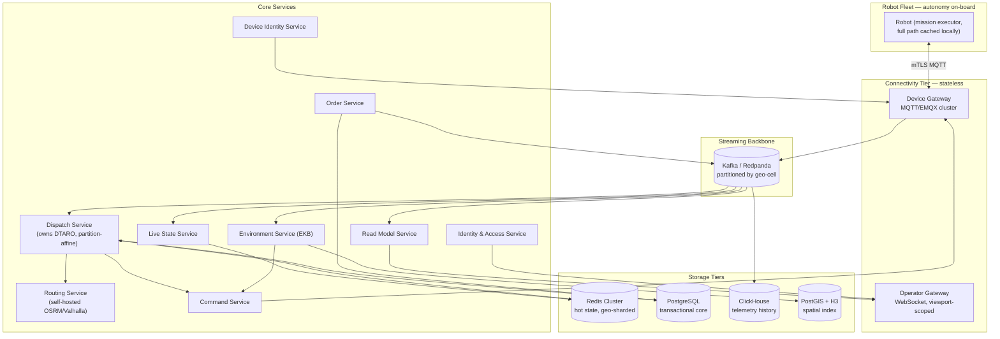
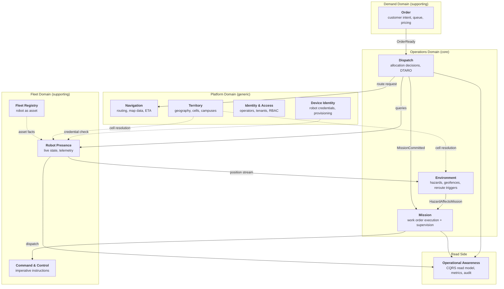
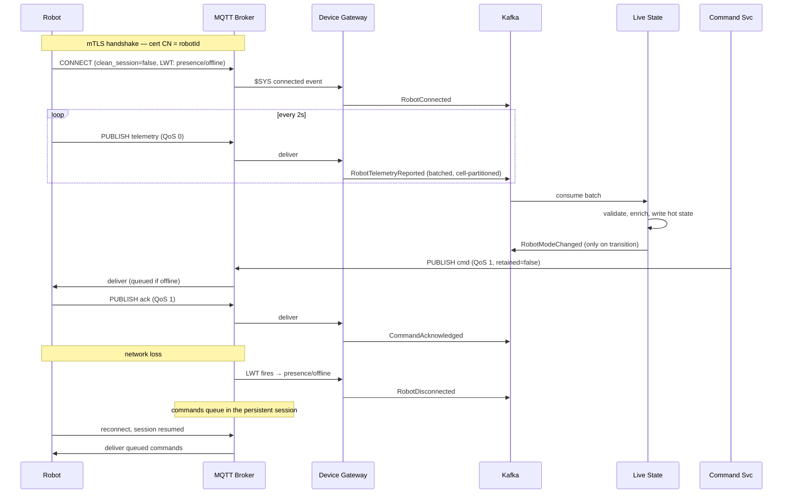
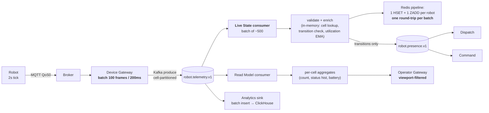
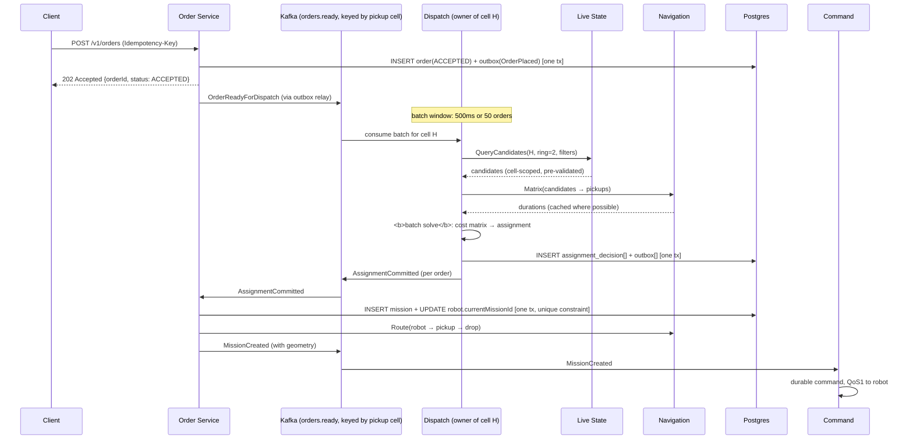
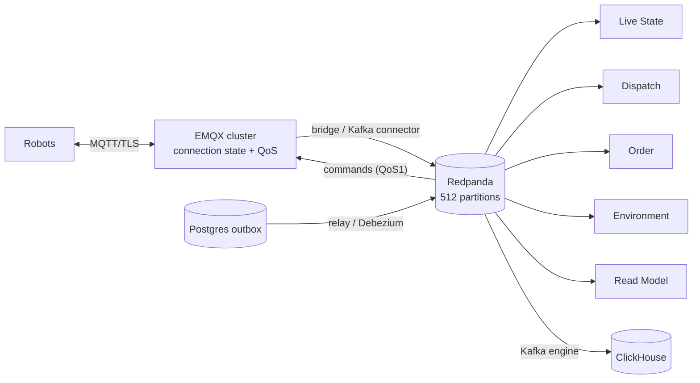
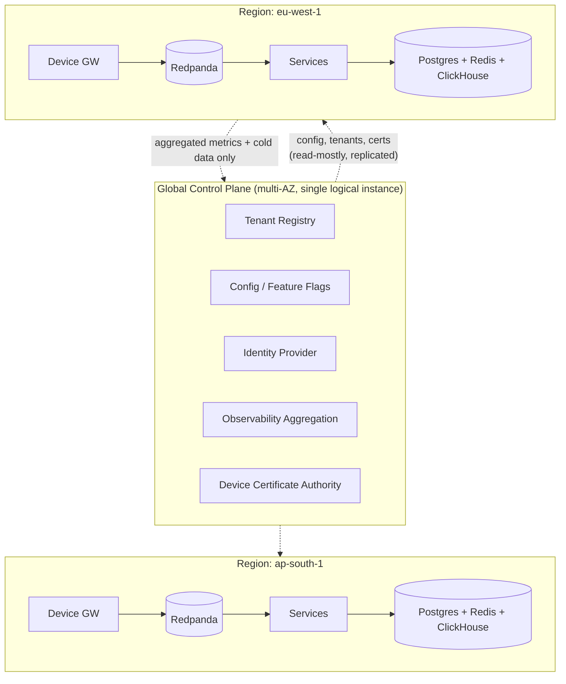

# RobotX — Target Architecture Proposal

**Status:** Draft for Technical Design Review
**Author:** Chief Architect
**Date:** 2026-07-26
**Baseline reviewed:** branch `feature/dashboard`, commit `fa1024f` + uncommitted working tree
**Supersedes:** `scale-architecture.md` (retains its geo-sharding thesis, revises its service catalog, sequencing, and broker choice)
**Companion documents:** `system.md` (current-state reference), `PHASE1_VERIFICATION.md` (finding-level audit), `FINAL_ARCHITECTURE_SUMMARY.md` (current-state diagrams)

---

## Table of Contents

| § | Section | § | Section |
|---|---|---|---|
| 1 | [Executive Summary](#1-executive-summary) | 18 | [Secret Management](#18-secret-management) |
| 2 | [Current Architecture Analysis](#2-current-architecture-analysis) | 19 | [Deployment Architecture](#19-deployment-architecture) |
| 3 | [Domain Analysis](#3-domain-analysis) | 20 | [Kubernetes Architecture](#20-kubernetes-architecture) |
| 4 | [Bounded Context Identification](#4-bounded-context-identification) | 21 | [Multi-Region Strategy](#21-multi-region-strategy) |
| 5 | [Recommended Services](#5-recommended-services) | 22 | [Edge Computing Strategy](#22-edge-computing-strategy) |
| 6 | [Communication Architecture](#6-communication-architecture) | 23 | [Disaster Recovery](#23-disaster-recovery) |
| 7 | [API Gateway Design](#7-api-gateway-design) | 24 | [High Availability](#24-high-availability) |
| 8 | [Authentication Flow](#8-authentication-flow) | 25 | [Observability](#25-observability) |
| 9 | [Robot Communication Architecture](#9-robot-communication-architecture) | 26 | [Security Architecture](#26-security-architecture) |
| 10 | [Telemetry Pipeline](#10-telemetry-pipeline) | 27 | [Rate Limiting](#27-rate-limiting) |
| 11 | [Task Allocation Pipeline](#11-task-allocation-pipeline) | 28 | [Fault Tolerance](#28-fault-tolerance) |
| 12 | [DTARO Placement](#12-dtaro-placement) | 29 | [Performance Bottlenecks](#29-performance-bottlenecks) |
| 13 | [Database Strategy](#13-database-strategy) | 30 | [Cost Considerations](#30-cost-considerations) |
| 14 | [Redis Strategy](#14-redis-strategy) | 31 | [Migration Plan](#31-migration-plan) |
| 15 | [Message Broker Strategy](#15-message-broker-strategy) | 32 | [Risks](#32-risks) |
| 16 | [Service Discovery](#16-service-discovery) | 33 | [Future Expansion](#33-future-expansion) |
| 17 | [Configuration Management](#17-configuration-management) | | |

---

## 1. Executive Summary

### 1.1 The recommendation in one paragraph

RobotX's service layer already approximates the right domain boundaries. Its problem is **not insufficient decomposition** — it is four specific structural properties of the data plane that make *any* topology, monolith or microservice, fail at scale. Decomposing into microservices before fixing those four properties produces a distributed monolith that is strictly harder to operate than what exists today. Therefore this proposal inverts the instinctive sequencing: **fix the data plane inside the current process first, achieve horizontal scale as a modular monolith, and only then extract services** — each extraction justified by a concrete scaling-profile mismatch or ownership boundary, not by a folder name.

### 1.2 The four blocking properties

Verified directly against the code, not inferred from the existing documentation:

| # | Property | Evidence | Consequence |
|---|---|---|---|
| **B1** | **Connection-state affinity** — the robot→socket routing table is a process-local `Map` | `sockets/robotSockets.js:5`; consumed by `commandDispatcher.service.js:17`, `robots.controller.js:565`, `tasks.controller.js:109`, `robotValidator.service.js:120` | A second process cannot dispatch a command to a robot connected to the first. **Hard blocker on running two instances**, independent of load. |
| **B2** | **Global fan-out on the hot path** — every telemetry frame is broadcast to *every* connected socket | `telemetry.handler.js:400` `io.emit("robot:update", …)` | O(N²) message amplification. At 10,000 robots this is 10,000 robots × 5,000 frames/s ≈ **50M socket writes/sec** for a workload whose useful payload is 5,000 frames/s. |
| **B3** | **Per-robot synchronous datastore round-trips inside the 2-second loop** | `telemetry.handler.js:170` (unconditional `findUnique` per tick); `robot.handler.js:210` (unconditional `robot.update` per HEARTBEAT, emitted every tick by `VirtualRobot.js:457`) | Postgres query rate scales linearly with fleet size at 1 Hz per robot. Ceiling ≈ 10k–25k robots against a well-tuned single instance, with zero headroom for anything else. |
| **B4** | **No durable work queue** — the allocation pipeline is `setImmediate()` | `task.service.js:371` | A process death between `task.create(PENDING)` and assignment orphans the order permanently. `taskRecovery.service.js:39` only recovers `ASSIGNED`/`IN_PROGRESS`; **`PENDING` is never recovered by anything.** |

B1 and B2 are correctness/architecture blockers. B3 is a capacity blocker. B4 is a durability blocker. None of the four is fixed by drawing service boundaries around them.

### 1.3 Three live defects found during this review — since fixed

> **Status update.** All three were subsequently confirmed by executable tests and **fixed**, along with a fourth (the reservation-lock degradation described at the end of this section). They are retained here because the *pattern* they represent — a feature correct in form and dead in effect, invisible to careful reading — is the strongest evidence for this document's central sequencing argument (§31.1). See `PHASE1_VERIFICATION.md` §0 Round 3 and §7.
>
> One further correction: this document originally also listed `cancelTask` not stopping the robot as an open defect (D7, §26.3). **That was wrong** — the fix was already present in `tasks.controller.js`. `PHASE1_VERIFICATION.md` had it marked open and the claim was carried over without re-reading the file.

These were not in `system.md` §16 or `PHASE1_VERIFICATION.md` at the time of writing. They materially changed the assessment of what was and was not working:

1. **The DTARO zone-locality term (F6) is functionally inert.** `robotRegistry.updateZone()` is exported but **called by nothing** (`grep -rn "updateZone" src/` returns only its definition and export). `assignRobotToZone()` (`zoneManager.service.js:134`) updates socket rooms and emits, but never persists `zoneId` to either the Redis registry or the `Robot.zoneId` column. Consequently `costEvaluator.service.js:110` evaluates `c.zoneId && c.zoneId === pickupZoneId` against a value that is always `null` → `Z = 1` for every candidate → a **constant offset with zero ranking effect**. `PHASE1_VERIFICATION.md` marks F6 as ✓ closed; it is implemented but dead.

2. **A per-tick dashboard broadcast storm, caused by the same defect.** Because `currentZoneId` is always `null` and `newZoneId` resolves to a real zone, the guard at `zoneManager.service.js:138` (`newZoneId !== currentZoneId`) is **true on every telemetry tick**, firing `socket.join()` plus a `ZONE_UPDATED` emit to the `dashboard` room 0.5×/robot/second, forever.

3. **The F10 telemetry DB-write throttle is defeated by the heartbeat path.** The new `DB_FLUSH_INTERVAL_MS` gate (`telemetry.handler.js:27`, `:308`) correctly throttles `robot.update` in the telemetry handler — but `VirtualRobot._tick()` emits `HEARTBEAT` in the *same* 2-second tick (`VirtualRobot.js:457`), and `robot.handler.js:210` issues an **unconditional, ungated `prisma.robot.update`** for every heartbeat. Aggregate write volume to `Robot` is unchanged; it moved handlers.

A fourth item worth noting: `kv.reserveRobot()` falls back to a process-local `Map` when Redis is unavailable (`kv.js:303`). The DTARO allocation lock therefore **silently degrades to a no-op across processes** — meaning the F4 race fix is void in exactly the multi-instance deployment it will first be needed in.

### 1.4 What the target architecture looks like

**Target state (Year 2–3, 100k+ robots):** 9 services, one streaming backbone, four storage tiers, geo-partitioned everywhere on the hot path.



### 1.5 Sequencing and cost

| Stage | Outcome | Duration | Team | Fleet ceiling reached |
|---|---|---|---|---|
| **0. Make change safe** | CI, tests, container, load-test baseline, fix B2 + the three live defects | 3–4 weeks | 1–2 | ~5,000 (from ~500) |
| **1. Modular monolith, horizontally scalable** | Fix B1, B3, B4 in place; N replicas behind an LB; outbox; Redis Streams bus | 8–12 weeks | 2–3 | ~25,000 |
| **2. Extract the edge** | Device Gateway (MQTT), Operator Gateway | 8–10 weeks | 3 | ~100,000 |
| **3. Extract the stream consumers** | Live State Service, telemetry → ClickHouse, Read Model Service | 8–10 weeks | 3–4 | ~250,000 |
| **4. Split the core domain** | Order Service / Dispatch Service split, explicit saga | 10–14 weeks | 4 | ~500,000 |
| **5. Remaining extractions** | Routing, EKB, Command, Device Identity | 12–16 weeks | 4–5 | multi-campus, multi-city |
| **6. Multi-region** | Regional cells, global control plane, DR | 12–20 weeks | 5–6 | multi-country |

**Stage 0 and Stage 1 together deliver a ~50× capacity increase for roughly one quarter of work, with no service extraction.** That is the single most important scheduling conclusion in this document.

### 1.6 Explicit anti-recommendations

Things this proposal deliberately does **not** recommend, to prevent scope creep during review:

- **No CQRS with event sourcing as the write model.** Event sourcing is recommended for exactly one aggregate (Mission), and only from Stage 4. The rest stays as state-oriented Postgres with an outbox. Full event sourcing across the platform is unjustifiable complexity for this domain.
- **No service mesh before Stage 3.** Istio/Linkerd solve problems (mTLS at scale, per-service traffic policy, distributed tracing injection) that do not exist with fewer than ~6 services.
- **No separate database per service at extraction time.** Schema-per-context inside one Postgres cluster first; physical split only where storage *shape* demands it (telemetry, spatial).
- **No two message brokers on day one.** MQTT and Kafka have genuinely different jobs and both are needed by Stage 2; NATS is not.
- **No Kubernetes before Stage 1 completes.** A single container image on a managed runtime is sufficient and much cheaper to operate until there are multiple service types.

---

## 2. Current Architecture Analysis

### 2.1 What the system is, precisely

A single Node.js process (`server.js`) hosting: an Express 5 REST API, one Socket.IO server serving both robots and operator dashboards, a Prisma/PostgreSQL client, an ioredis client behind a hand-written `kv` facade with in-memory fallback, and the entire simulated robot fleet as in-process `socket.io-client` peers connecting back to the same server. 13 services, 4 socket handlers, 7 controllers, 12 Prisma models.

### 2.2 Strengths — what must survive the migration

These are genuine engineering assets. Several are better than what I typically see in systems at this stage, and the migration plan is explicitly designed to preserve them.

| Strength | Evidence | Why it matters at scale |
|---|---|---|
| **Transport-independent service layer** | Both `controllers/*` and `sockets/handlers/*` call the same `services/*` modules; no business logic in either transport layer | This is the property that makes extraction *possible at all*. A service layer entangled with `req`/`res` or `socket` would need rewriting, not moving. **Highest-value existing asset.** |
| **Restart recovery is designed in, not bolted on** | `taskRecovery.service.js` rebuilds Redis path/state for every `ASSIGNED`/`IN_PROGRESS` task from Postgres + a fresh route; `server.js:140-184` re-dispatches after a grace window | The correct instinct for a distributed system: **durable store is truth, cache is derived and rebuildable**. This philosophy transfers directly to Kafka-based rebuilds. |
| **The allocation invariant is enforced by the database** | `Robot.currentTaskId String? @unique` + 1:1 relation (`schema.prisma:206-207`), re-checked inside `prisma.$transaction` (`task.service.js:249-253`) | The single most important correctness property (a robot is never double-assigned) is enforced by a constraint, not by application discipline. **Keep this exact mechanism** as the last-line defense even after partition-based serialization removes the race structurally. |
| **Compensating action already implemented correctly** | `_processAssignment`'s `finally` block releases the reservation on every path (`task.service.js:217-224`), with a TTL as crash backstop | This is a hand-rolled saga compensation. Making it explicit and durable is an evolution, not a rewrite. |
| **Graceful degradation instinct throughout** | Mapbox: driving→walking→cycling→straight-line (`task.service.js:78-126`); Redis: every write best-effort, every read falls back to Postgres | Correct default posture for a system where a delivery must complete even if a dependency is degraded. |
| **Multi-tier caching with correct invalidation** | `zoneManager.loadZones`: in-process 60s → Redis 300s → Postgres, with explicit `invalidateZoneCache` | Textbook. Generalize this pattern rather than replacing it. |
| **Auth is now comprehensively gated on both transports** | `router.use(authUser)` on all five operational route files; `verifyUserToken` shared with the Socket.IO dashboard gate (`socket.server.js:105-120`) | Removes the "reachable port = full control" failure mode. Real WebAuthn with signature-counter replay detection is above the bar for this stage. |
| **A test suite now exists** | `Backend/tests/` (14 files), `jest.config.js` — both untracked in git | Uncommitted, but it exists. This is the prerequisite for everything in §31 Stage 0. |

### 2.3 Weaknesses

Ordered by architectural consequence, not by severity of any individual bug.

#### W1 — The `Robot` aggregate conflates three different data lifetimes

`schema.prisma:169-231` mixes, in one row:

- **Asset facts** (`robotId`, `name`, `locationId`, `campusId`, `createdAt`) — write frequency: once per lifetime.
- **Live state** (`lat`, `lon`, `speed`, `battery`, `isOnline`, `lastSeenAt`, `socketId`) — write frequency: **0.5 Hz per robot, forever**.
- **Operational assignment** (`status`, `currentTaskId`, `zoneId`, `utilization`) — write frequency: per task transition, and it carries a **uniqueness constraint requiring ACID**.

These have write rates differing by seven orders of magnitude and completely different consistency requirements, yet share a row, a lock, and a storage engine. This is the root cause of B3, and it is why "add a cache in front of Postgres" cannot fix it — the cache is already there (`robot:{id}`, `registry:{id}`) and Postgres is *still* written every tick because the same row also holds the fields DTARO's candidate query filters on (`status`, `isOnline`, `currentTaskId`).

**This single modeling decision is the most consequential piece of technical debt in the system.** §13 addresses it directly.

#### W2 — Duplicate live-state stores with divergent semantics

`registry:{robotId}` (30s TTL, merge-write, `robotRegistry.service.js`) and `robot:{robotId}` (15s TTL, replace-write, `telemetry.handler.js:267`) hold overlapping fields for the same entity, written independently on every tick, read by different consumers. Doubles hot-path Redis write volume for zero benefit and creates a class of bug where two readers see different values for the same robot at the same instant.

#### W3 — Two competing command-delivery mechanisms, neither durable

- `commandDispatcher.dispatch()` — in-memory `setTimeout` retry, 2 attempts, silently drops (`commandDispatcher.service.js:32-57`). Used for `TASK_ASSIGN`, `REROUTE_ALERT`.
- `robots.controller.scheduleReliabilityCheck()` — `setTimeout` polling `Command.status` in Postgres, Redis-backed counter, 2 retries (`robots.controller.js:538-563`). Used for `STOP`/`PAUSE`/`RETURN`/`RESUME`.

Neither survives a process restart. A code comment now documents the split as intentional, which is worse than leaving it undocumented — a future reader will believe it is resolved. The right answer is one durable, at-least-once delivery mechanism (§9, §15).

#### W4 — Obstacle dissemination is O(fleet) per obstacle

`alertDissemination.processObstacleReport` (`:71-79`) calls `getAllRobotIds(kv)` → `SMEMBERS robots:all` (every robot ever seen, never pruned except on explicit delete) then issues one `getRobotState` per robot, then runs a linear segment-intersection test against each robot's **full planned path** (`routeIntersection.findAffectedRobots`).

At 100,000 robots with `OBSTACLE_PROBABILITY = 0.002` per 2s tick, obstacle reports arrive at ~100/sec, each triggering ~100,000 Redis reads of documents containing full route geometry (hundreds of coordinate pairs). That is ~10M Redis ops/sec against payloads of several KB each. This is the second-worst scaling property in the system after B2.

#### W5 — Orders and missions are the same table

`Task` is simultaneously the customer's delivery request and the robot's work order. This is fine today because a task is assigned within milliseconds of creation. It breaks the moment demand exceeds supply — which is the *expected steady state* of a commercial delivery platform. A queued order has no robot, no route, no ETA, and a lifecycle (accepted → queued → matched → cancelled by customer → refunded) that has nothing to do with the robot's mission lifecycle (dispatched → en route to pickup → loaded → en route to drop → delivered). §4 splits these.

#### W6 — No tenancy, no customer, no RBAC

The entire authorization model is `enum Role { SUPER_ADMIN }` (`schema.prisma:64-66`). There is no `Organization`, no `Customer`, no `Operator` with scoped permissions. For a platform intended to run multiple campuses across multiple countries with external customer APIs (§33), this is a ground-up addition, not an extension — and it touches every query in the system, because every query must eventually become tenant-scoped. **Adding tenancy later is dramatically more expensive than adding it now**, which is why §31 places it in Stage 1 rather than deferring it.

#### W7 — Singleton background work runs in every process

`startOfflineDetector` (`socket.server.js:36-59`) runs a fleet-wide `prisma.robot.updateMany` every 10 seconds; `startDtaroSweep` runs an EKB sweep every 60 seconds. Both are guarded by *module-level* booleans (`offlineSweepStarted`), which prevent double-registration within a process but do nothing across processes. Run N replicas and you get N concurrent fleet-wide updates.

#### W8 — Zero production packaging

No Dockerfile, no Compose, no CI, no `.env.example`, no migration/rollback procedure, no load test, no known capacity number. Nobody currently knows what the ceiling of the existing system actually is — every capacity statement in this document, including my own, is an estimate until Stage 0 measures it.

### 2.4 Coupling analysis

| Coupling type | Instance | Severity | Notes |
|---|---|---|---|
| **Shared mutable process state** | `robotSockets.js` Map read by 4 modules across 3 layers | **Critical** | B1. The single hard blocker on multi-instance. |
| **Shared database, no ownership** | All 13 services import the same `prisma` client and read/write any model | **High** | Normal and correct for a monolith; must become an enforced boundary before extraction. `taskAssignment` reads `Robot`; `dtaro.handler` writes `Task` *and* `Robot` *and* `Event` in one transaction. |
| **Temporal coupling via Redis key contracts** | `taskPath:{taskId}` written by `task.service`, read by `routing.service` and `socket.server`; `robotTaskState:{robotId}` written by 2 modules, read by 2 others | **High** | An implicit shared-memory interface with no schema, no versioning, no owner. Renaming a field breaks callers silently. |
| **Circular module dependency** | `task.service` → `taskAssignment` → `robotRegistry` → `robotSockets`; and `taskRecovery` → `task.service` | **Medium** | Resolvable; indicates `getRoutesWithDistance` belongs in a routing module, not in `task.service`. |
| **Transport ↔ domain leak** | `robotValidator.service.js:120` calls `getRobotSocket()` — a domain validator reaching into the transport layer | **Medium** | Small but symptomatic: it means robot eligibility cannot be evaluated by any process other than the one holding the socket. |
| **Cross-context transaction** | `dtaro.handler.js:91-109` updates `Task` and `Robot` in one `$transaction` | **Medium** | This is the one place a real cross-context transaction exists. It becomes the saga boundary in §13. |
| **Simulation coupled to API process** | `server.js:97` constructs the simulator inside `server.listen`; `robots.controller.js:83` reaches it via `app.locals` | **Medium** | Simulated robots share an event loop with the API serving them. Load-testing the API with the simulator in-process measures the wrong thing. |

### 2.5 Scalability bottlenecks — ranked with numbers

Assumptions: 2s telemetry interval, ~200-byte frames, ~3 task completions/robot/hour, obstacle probability 0.002/tick/robot.

| Rank | Bottleneck | Location | Scaling law | Ceiling |
|---|---|---|---|---|
| **1** | Global telemetry broadcast | `telemetry.handler.js:400` | **O(N²)** socket writes | ~2,000 robots before the event loop saturates on fan-out alone |
| **2** | Obstacle dissemination fan-out | `alertDissemination.js:71-79` | **O(N)** Redis reads × O(N × 0.001) obstacles/s = **O(N²)** | ~5,000 robots |
| **3** | Per-tick Postgres round-trips | `telemetry.handler.js:170` (read), `robot.handler.js:210` (heartbeat write) | O(N) queries/s at 1 Hz | ~10,000–25,000 robots against one Postgres |
| **4** | Single event loop for all sockets | `socket.server.js` | O(N) connections in one process | ~50,000 connections (Node.js practical limit), unreachable due to 1–3 |
| **5** | `robotSockets` Map (B1) | `robotSockets.js:5` | Not a throughput limit — a **topology** limit | Exactly 1 process |
| **6** | Mapbox calls in the allocation hot path | `task.service.js:78-111` — up to 6 Directions calls + 1 Matrix per assignment | O(assignments/s) external HTTP | ~10 assignments/s on rate limits; cost-prohibitive well before that |
| **7** | Zone lookup linear scan | `zoneManager.js:95-97` | O(zones) per telemetry tick per robot | Fine at 4 zones; O(N×Z) at thousands of zones across cities |
| **8** | `robots:all` unbounded Set | `robotRegistry.getAllRobotIds` | Grows forever | Memory + every consumer paying for dead entries |

**Note on bottleneck 6:** at 100k robots × 3 tasks/hour = ~83 assignments/sec × up to 7 Mapbox calls = **~580 external HTTP calls/sec, sustained**. This is infeasible on both rate-limit and cost grounds (§30) and forces the self-hosted routing decision in §5.

### 2.6 Technical debt register

| ID | Debt | Cost to fix now | Cost to fix at Stage 3 | Recommendation |
|---|---|---|---|---|
| D1 | Dual live-state Redis stores (W2) | Low (1 week) | High (two services depend on different shapes) | **Fix in Stage 1** |
| D2 | Dual command-retry mechanisms (W3) | Medium (2 weeks) | High | **Fix in Stage 1**, replaced wholesale by durable dispatch |
| D3 | Dead `zoneId` write path (§1.3 #1) | ~~Trivial (hours)~~ | — | ✅ **Done** — `zoneManager.assignRobotToZone` persists to registry + Postgres |
| D4 | Heartbeat DB write defeating the F10 throttle (§1.3 #3) | ~~Trivial (hours)~~ | — | ✅ **Done** — both write paths share `liveness.constants.js` |
| D5 | `task:{taskId}` Redis key — written every assignment, read nowhere | Trivial | — | Delete in Stage 0 |
| D6 | Legacy `assign_task` socket path (`socket.server.js:228`) | Trivial | — | Delete in Stage 0 |
| D7 | ~~`cancelTask` does not stop the robot~~ | — | — | ✅ **Not a defect** — already fixed; this row was carried over from a stale verdict |
| D8 | `Decision` table has zero writers | Low | Medium | Either implement or drop the table in Stage 1 |
| D9 | No tenancy model (W6) | Medium (4 weeks) | **Very high** — touches every query in every service | **Add in Stage 1** |
| D10 | `Telemetry` history in Postgres | Medium | Low (clean extraction) | Stage 3 |
| D11 | `ObstacleEvent` never swept; grows unbounded | Trivial | — | Stage 0 |
| D12 | Debug scripts with no production guard, one printing hash prefixes | Trivial | — | Stage 0 |

### 2.7 Hidden risks

Risks that will not appear in any load test and will surface as production incidents.

- **HR1 — The distributed lock silently becomes a local lock.** ✅ **Fixed.** `kv.reserveRobot` fell back to an in-process `Map` when Redis was down, and `disableRedis()` never retried for the process lifetime — so a 30-second blip permanently downgraded a process to in-memory mode, at which point the DTARO allocation lock was a no-op relative to sibling processes and double-assignment became possible with no error, no log, and no metric. A test spinning up two independent `kv` instances against an unreachable Redis confirmed **both** were granted the same robot. `reserveRobot` now fails closed (`503`/`LOCK_UNAVAILABLE`) when Redis is configured-but-unreachable, still uses the memory lock when Redis is *deliberately* disabled, and a backoff reconnect probe plus a `reconnecting` health flag close the permanent-degradation half. Pinned by `tests/unit/redis/lockFailClosed.test.js`.

- **HR2 — Redis TTL expiry is load-bearing for correctness, not just freshness.** `robot:{id}` has a 15s TTL and `registry:{id}` 30s. `robotValidator` treats absent live state as "fall back to the DB row." Under Redis memory pressure with an eviction policy other than `noeviction`, live-state keys evict early and DTARO silently scores robots on stale Postgres positions — which, given the F10 throttle, may now be up to 15 seconds old. Wrong robot selected, no error surfaced.

- **HR3 — Status is modeled in two incompatible vocabularies.** `RobotStatus` (Prisma enum, 6 values) vs `INCOMING_STATUS` (8 values including `RETURNING`, `CHARGING`) with a lossy mapping (`telemetry.handler.js:30-37`: `CHARGING → PAUSED`, `RETURNING → ACTIVE`). The DTARO candidate query then filters on `status IN (IDLE, PAUSED)` in Postgres to *include* charging robots — meaning **a genuinely paused robot and a charging robot are indistinguishable at the database layer**. Every consumer must re-derive intent from Redis. This will break as soon as a second consumer forgets to.

- **HR4 — Recovery has no bounded concurrency.** `recoverActiveTasks` (`taskRecovery.service.js:45`) loops over every active task issuing sequential Mapbox route calls. With 10,000 active tasks at restart, this is 10,000+ sequential external HTTP calls — the recovery itself becomes an outage, and it runs *before* `server.listen()` (`server.js:57`), so the process never becomes healthy.

- **HR5 — `PENDING` tasks are unrecoverable (B4).** No code path ever re-drives a `PENDING` task. A crash during the `setImmediate` window strands the order silently and forever.

- **HR6 — Idempotency is absent everywhere.** No idempotency key on task creation, command issuance, or telemetry. A client retry creates a duplicate task; a robot reconnecting after a network blip replays `distanceTravelled` (`telemetry.handler.js:250-252` trusts the value verbatim from virtual robots).

- **HR7 — Documentation drift is systemic, not incidental.** Three of the findings in §1.3 contradict documents written within the last 24 hours by careful review. The codebase demonstrably drifts faster than prose can track it. **This argues for executable specifications (contract tests, schema registry) over prose documentation**, and it is a direct input to the Stage 0 prioritization.

---

## 3. Domain Analysis

### 3.1 The business the architecture must serve

Stripped of implementation: *a customer requests that a physical object be moved from A to B; the platform selects a robot capable of doing it, plans a route, supervises execution against a changing physical environment, and proves the job was done.*

Four irreducible facts about this domain drive every structural decision below:

1. **The physical world is the source of truth, and it is eventually consistent by nature.** A robot's position was true when it was measured. There is no operation that makes it more current. Any part of the system demanding strong consistency on live state is fighting physics.
2. **Assignment is a scarce-resource allocation problem, and it demands strong consistency.** A robot can execute exactly one mission. This is the only invariant in the system worth paying for with locks, transactions, and partition-level serialization.
3. **Robots are autonomous, not remote-controlled.** The current design already sends the *entire* route geometry in `TASK_ASSIGN` (`task.service.js:312-316`) rather than streaming waypoints. This is correct and must be preserved: cloud unavailability must degrade supervision, never mission execution.
4. **Supply is finite and demand is not.** A commercial platform's normal state is a queue of unserved orders. The architecture must treat backlog as a first-class, observable, communicable state — not as a failure.

### 3.2 Subdomain classification

Classifying by *strategic value*, which determines build-vs-buy and where senior engineering effort goes.

| Subdomain | Type | Justification | Investment posture |
|---|---|---|---|
| **Task Allocation & Dispatch (DTARO)** | **Core** | The only place the platform can be *better* than a competitor rather than merely equivalent. Allocation quality directly determines delivery time, robot utilization, energy cost, and therefore unit economics. This is where ML eventually lives (§33). | Build. Best engineers. Highest test coverage. Independent deploy cadence. |
| **Mission Supervision & Environmental Response** | **Core** | Obstacle detection → affected-robot identification → replanning is safety-adjacent and specific to autonomous ground fleets. Nobody sells this. | Build. |
| **Fleet Live State** | **Supporting** | Nothing proprietary in "track where robots are," but it must be *fast and correct at scale*, and no off-the-shelf product fits the access pattern (geo-scoped candidate queries at allocation latency). | Build, but with commodity components (Redis Cluster, H3). |
| **Order Lifecycle** | **Supporting** | Standard order-management: intake, idempotency, state machine, cancellation, notification. Boring on purpose. | Build simply. Do not innovate here. |
| **Routing & Map Data** | **Supporting → Generic** | Strategically it is a commodity (OSRM, Valhalla, OSM data). Tactically it must be self-hosted at scale for cost/rate-limit reasons (§29). The *value* is in operating it cheaply, not in the algorithm. | **Buy/adopt open source, self-host.** Never write a router. |
| **Command & Control Delivery** | **Supporting** | Reliable, ordered, acknowledged delivery to a device. The *semantics* are domain-specific (an emergency STOP has different guarantees than a route update); the *transport* is commodity. | Thin domain layer over MQTT QoS. |
| **Device Identity & Provisioning** | **Generic** | X.509 provisioning, certificate rotation, attestation. Fully solved by IoT platforms. | **Buy** (AWS IoT Core / EMQX enterprise) or adopt standard PKI. Never build pairing codes at scale. |
| **Operator Identity & Access** | **Generic** | OIDC, RBAC, MFA, SSO. | **Buy** (Auth0/Cognito/Keycloak). Current bespoke JWT+PIN+WebAuthn is well-built but is not where effort should go. |
| **Geography & Territory** | **Generic** | Administrative hierarchy, campuses, zones, cells. | Build minimally; adopt H3 for the cell system rather than inventing one. |
| **Analytics & Reporting** | **Generic** | | Buy (warehouse + BI). |
| **Simulation** | **Supporting** | Currently disguised as production infrastructure. It is genuinely valuable — it exercises the real protocol — but it is a *testing* capability, not a runtime one. | Build, but **evict from the production process** (§31 Stage 0). |

### 3.3 The ubiquitous language, and where the code contradicts it

A precise glossary matters here because several current bugs are traceable to a vocabulary that carries two meanings.

| Term | Definition | Current code | Verdict |
|---|---|---|---|
| **Robot** | A physical asset with an identity, an owner, and a home territory. | `Robot` table | ✅ but overloaded (W1) |
| **Robot Presence** | Whether a robot is currently reachable, and where it was last seen. | `isOnline`/`lastSeenAt`/`socketId` on `Robot`; `robot:{id}`; `registry:{id}` | ❌ Three representations, no single owner |
| **Order** | A customer's request to move something from A to B. Exists before any robot is involved; may be queued, priced, cancelled by the customer. | *Does not exist* — collapsed into `Task` | ❌ **Missing concept** |
| **Mission** | A robot's committed work order: this robot, this route, this pickup, this drop. Created only at assignment. | Collapsed into `Task` | ❌ **Missing concept** |
| **Assignment** | The *decision* binding an Order to a Robot, at a point in time, with a recorded cost and reason. | Implicit; partially in write-only `metrics:allocation:*` | ⚠️ Not modeled — makes allocation quality unauditable |
| **Candidate** | A robot eligible for a specific order at a specific instant. | `taskAssignment.js` local variable | ✅ Correct concept, correctly transient |
| **Zone** | A rectangular geofence used for obstacle scoping and socket rooms. | `Zone` table | ⚠️ Conflates *operating territory* (business) with *spatial partition* (infrastructure). §13 separates them: Zone stays business, H3 cell becomes infrastructure. |
| **Status** | Two incompatible vocabularies (HR3). | `RobotStatus` enum vs `INCOMING_STATUS` | ❌ Must be unified: separate `LifecycleState` (asset) from `OperationalMode` (live) |
| **Command** | An imperative instruction requiring acknowledgement. | `Command` table + 2 delivery mechanisms | ⚠️ Model correct, delivery wrong |
| **Obstacle / Hazard** | A time-bounded environmental fact that invalidates planned routes. | `ObstacleEvent` + `ekb:*` | ✅ Well-modeled. `expiresAt` as a first-class field is the right instinct. |
| **Decision** | An operator's adjudication of an exception. | Table exists, zero writers | ❌ Vestigial |

**The single most valuable modeling change in this document is splitting `Task` into `Order` and `Mission`.** It is what makes queuing, customer-facing cancellation, batch allocation, re-assignment after failure, multi-leg deliveries, and eventually multi-robot orders expressible at all.

### 3.4 Aggregates and invariants

| Aggregate | Root | Invariants it protects | Consistency requirement |
|---|---|---|---|
| **Robot** | `robotId` | Unique identity; belongs to exactly one territory; lifecycle transitions are legal (`COMMISSIONED → ACTIVE → MAINTENANCE → DECOMMISSIONED`) | Strong, but low write rate |
| **RobotPresence** | `robotId` | None worth protecting — last-write-wins on a monotonic timestamp | **Eventual. Explicitly AP.** |
| **Order** | `orderId` | Valid state machine; idempotent creation; cannot be fulfilled twice | Strong |
| **Mission** | `missionId` | **A robot has at most one active mission** ← *the* invariant; a mission references exactly one order | **Strong. This is the CP boundary of the entire system.** |
| **Hazard** | `hazardId` | Time-bounded; spatially located | Eventual |
| **Command** | `commandId` | At-least-once delivery; idempotent application; terminal ACK/FAIL | Strong on record, at-least-once on delivery |

Everything not listed is eventually consistent. Stating this explicitly, up front, is what prevents the design from accumulating unnecessary synchronous coupling — the failure mode that makes the *current* per-tick pipeline as expensive as it is.

---

## 4. Bounded Context Identification

### 4.1 Method

Contexts were derived by asking, for each candidate boundary, four questions:

1. **Does the language change across it?** (`status` means something different to the dispatcher than to the telemetry pipeline.)
2. **Do the write rates differ by an order of magnitude or more?**
3. **Do the consistency requirements differ?**
4. **Would a team own it end-to-end without constantly coordinating with another team?**

A boundary passing three or four is a real context. A boundary passing one is a folder.

**Explicitly rejected boundaries** — these are folders in the current code that are *not* contexts:

- `zoneManager` / `routeIntersection` / `ekb` / `alertDissemination` — one context (Environment). They only ever operate together; splitting them creates chatter with no ownership benefit.
- `costEvaluator` / `robotValidator` / `taskAssignment` — one context (Dispatch). This is the §12 answer in embryo.
- `campus` / `location` / `zone` — one context (Territory), despite being three tables.
- `metrics` / `Event` / dashboard aggregation — one context (Operational Awareness), and it is a **read model**, not a write-side context.

### 4.2 The eleven contexts



### 4.3 Context definitions

| # | Context | Owns (aggregates) | Language boundary | Why it is a context and not a folder |
|---|---|---|---|---|
| **C1** | **Order** | `Order`, `OrderQueue` | "order", "customer", "queued", "priority", "cancelled", "SLA" | Low write rate, strong consistency, customer-facing, **must survive having no robots at all**. Completely different failure semantics from Mission. |
| **C2** | **Dispatch** | `Assignment` (decision record), `AllocationPolicy` | "candidate", "cost", "eligibility", "reservation", "batch", "cell owner" | Highest deploy cadence in the system (weight tuning, then models). Partition-affine. Latency-sensitive. Owns no long-lived entity — it owns *decisions*. |
| **C3** | **Mission** | `Mission`, `MissionLeg`, `MissionEvent` | "leg", "en route", "loaded", "delivered", "aborted", "supervision" | Long-running process with its own state machine and compensations. Distinct from Order (customer view) and from Command (transport). |
| **C4** | **Robot Presence** | `RobotPresence` (ephemeral) | "position", "battery", "heading", "last seen", "health", "utilization" | **Write rate 5–7 orders of magnitude above everything else.** Explicitly AP. This is the clearest context boundary in the entire system. |
| **C5** | **Fleet Registry** | `Robot`, `RobotModel`, `RobotCapability` | "commissioned", "chassis", "payload capacity", "home depot", "decommissioned" | Slow-changing asset master data, strongly consistent, owned by fleet ops rather than engineering. Splitting it from C4 is what resolves W1. |
| **C6** | **Command & Control** | `Command`, `CommandDelivery` | "issue", "acknowledge", "expire", "escalate", "emergency stop" | Delivery guarantees are the entire value. Safety-critical (`STOP`) with different SLOs from routine dispatch. |
| **C7** | **Environment** | `Hazard`, `Geofence`, `HazardImpact` | "hazard", "severity", "expiry", "affected", "blocked", "no-go" | Spatial query engine with an entirely different storage profile (spatial index, not KV). Safety-adjacent. |
| **C8** | **Navigation** | `Route`, `RouteCache`, `TravelTimeMatrix` | "profile", "graph", "waypoint", "ETA", "corridor" | Pure computation over a large static dataset. Scaling axis is CPU + map-data footprint per region — unrelated to fleet size. Cacheable. Replaceable. |
| **C9** | **Territory** | `Location`, `Campus`, `Zone`, `Cell` | "country", "state", "campus", "zone", "H3 cell", "service area" | Reference data, read-heavy, near-static, cached everywhere. Everyone depends on it; it depends on nobody. |
| **C10** | **Identity & Access** | `Tenant`, `Operator`, `Role`, `Credential` | "tenant", "role", "permission", "step-up", "session" | Generic subdomain, distinct compliance requirements, ideally outsourced. |
| **C11** | **Device Identity** | `DeviceCredential`, `ProvisioningRecord` | "certificate", "attestation", "rotation", "revocation", "enrollment" | **Deliberately separate from C10.** Different actors (machines vs humans), different lifecycle (years vs hours), different threat model (physical theft vs credential phishing), different scale (millions vs hundreds). Conflating them — as `robot.handler.js` does today by putting pairing next to JWT verification — is a security-modeling error. |
| **C12** | **Operational Awareness** | *(none — read model)* | "fleet health", "utilization", "SLA attainment", "audit trail" | CQRS read side. Owns projections, not truth. Isolating it prevents analytics load from ever back-pressuring operations — a property the current `getSystemMetrics` (which runs two `groupBy` queries against the operational DB inside `/health`) does not have. |

### 4.4 Context relationships (DDD patterns)

| Upstream → Downstream | Pattern | Rationale |
|---|---|---|
| Territory → everyone | **Published Language** | Cell IDs (H3) and territory IDs are a shared, versioned vocabulary. Never a runtime call on the hot path — replicated and cached. |
| Robot Presence → Dispatch | **Open Host Service** | Dispatch needs a stable, high-performance query API (`candidatesNear(cell, radius, filters)`). Presence must not know Dispatch exists. |
| Order → Dispatch | **Customer/Supplier**, event-driven | Order publishes `OrderReadyForDispatch`; Dispatch consumes. Order does not wait. |
| Dispatch → Mission | **Customer/Supplier**, event-driven | Dispatch publishes `AssignmentCommitted`; Mission materializes the work order. |
| Navigation → Dispatch, Mission | **Anticorruption Layer** | The ACL is mandatory: it is what makes Mapbox→OSRM swappable without touching either consumer. Today `mapbox.service.js` is already close to this — it exposes `directionsWithDistance`/`matrixDurationsToDestination`, not Mapbox response shapes. **Preserve and formalize this.** |
| Environment → Mission | **Customer/Supplier**, event-driven | Environment publishes `HazardImpactsMission`; Mission decides how to respond. Today, `alertDissemination` calls `rerouteRobot` directly — Environment currently *reaches into* mission execution. Wrong direction of control. |
| Device Identity → Presence | **Conformist** | Presence accepts whatever identity assertion the gateway provides. |
| Everything → Operational Awareness | **Published Language** (event stream) | One-way. Awareness never calls back. |
| Fleet Registry → Presence | **Shared Kernel** (`robotId` only) | The *only* shared kernel in the system, and deliberately minimal: a single identifier. |

### 4.5 Contexts ≠ Services

Twelve contexts do **not** mean twelve services. Contexts are a *modeling* boundary; services are a *deployment* boundary. §5 maps them onto **nine services**, with these deliberate merges:

- **Fleet Registry + Territory + Device Identity → one "Fleet Service."** All three are low-throughput, read-heavy master-data contexts with the same scaling profile and the same operational owner. Three separate services would be three separate deployments, three databases, and three on-call surfaces for a combined load of a few hundred requests per second. Merging them costs nothing architecturally (internal module boundaries preserve the contexts) and saves substantial operational overhead.
- **Order + Mission → separate services** despite being adjacent, because their *scaling profiles and failure semantics genuinely diverge* (Order must stay available when the entire fleet is down; Mission is meaningless without it).
- **Operational Awareness → one Read Model Service** serving all projections.

---
## 5. Recommended Services

Nine services at target state. Each entry below is the service contract a review board should hold the implementation to.

### 5.1 Service catalog at a glance

| Service | Contexts | Stateful? | Scaling axis | Extracted at |
|---|---|---|---|---|
| S1 Device Gateway | (transport only) | Connection state | Concurrent robot connections | Stage 2 |
| S2 Operator Gateway | (transport only) | Subscription state | Concurrent operator sessions | Stage 2 |
| S3 Live State Service | C4 Robot Presence | No (owns Redis) | Telemetry events/sec | Stage 3 |
| S4 Dispatch Service | C2 Dispatch | **Yes — partition-affine** | Geo-cells (orders/sec per cell) | Stage 4 |
| S5 Order Service | C1 Order, C3 Mission | No | Orders/sec | Stage 4 |
| S6 Navigation Service | C8 Navigation | No (owns map data) | CPU × covered area | Stage 5 |
| S7 Environment Service | C7 Environment | No (owns spatial index) | Hazards/sec × affected-path density | Stage 5 |
| S8 Command Service | C6 Command & Control | No | Commands/sec | Stage 5 |
| S9 Fleet Service | C5, C9, C11, C10 | No | Requests/sec (low) | Stage 5 |
| S10 Read Model Service | C12 | No (owns projections) | Operator sessions × event rate | Stage 3 |

*(S10 is numbered separately from S2 because the Operator Gateway is pure transport; the Read Model owns the projections it serves.)*

---

### S1 — Device Gateway

**Responsibility.** Terminate robot connections, authenticate them via mTLS, translate between the wire protocol and the internal event bus. **Nothing else.** It must never query a database, call an external API, or evaluate business logic — the reason is architectural, not stylistic: a gateway node holds tens of thousands of unrelated robots, so any blocking downstream call stalls all of them. This is precisely the failure mode of today's `telemetry.handler.js`, which performs a Postgres read, a Postgres write, three Redis round-trips, and a zone lookup inline on the socket handler for every frame.

**Ownership.** Platform/Infrastructure team.

**APIs (device-facing).** MQTT over TLS 1.3 with client certificates.

| Topic | Direction | QoS | Payload |
|---|---|---|---|
| `rbx/{tenant}/{robot}/telemetry` | robot → cloud | 0 | position, battery, speed, heading, mode |
| `rbx/{tenant}/{robot}/event` | robot → cloud | 1 | hazard report, mission-leg completion, fault |
| `rbx/{tenant}/{robot}/cmd` | cloud → robot | 1 | command envelope |
| `rbx/{tenant}/{robot}/mission` | cloud → robot | 1 | mission assignment with full route geometry |
| `rbx/{tenant}/{robot}/ack` | robot → cloud | 1 | command/mission acknowledgement |
| LWT: `rbx/{tenant}/{robot}/presence` | broker → cloud | 1 | `{"state":"offline"}` |

**Events published.** `RobotTelemetryReported`, `RobotConnected`, `RobotDisconnected` (from LWT), `HazardReported`, `MissionLegCompleted`, `RobotFaultRaised`, `CommandAcknowledged` — all onto Kafka, partitioned by geo-cell.

**Events consumed.** `CommandIssued`, `MissionAssigned` → publish to the robot's MQTT topic.

**Database ownership.** None. Explicitly stateless apart from broker session state.

**Redis ownership.** None.

**Scaling.** Horizontal, ~50k–100k connections per node. 100k robots ≈ 2–4 nodes plus headroom; 1M ≈ 20–40. Scale on connection count and inbound message rate, never on CPU alone.

**Deployment independence.** Total. Rolling restarts cost only reconnect time (robots reconnect with backoff + jitter — the thundering-herd control belongs here).

**Dependencies.** Device Identity (certificate revocation list, cached, checked out-of-band), Kafka.

**Why this is the first extraction (§31 Stage 2):** highest scaling-profile mismatch (connection-bound vs CPU-bound), zero domain coupling, zero database ownership. It is the cheapest possible first cut and it immediately removes the largest source of head-of-line blocking.

---

### S2 — Operator Gateway

**Responsibility.** Terminate operator WebSocket sessions and serve **viewport-scoped** subscriptions.

The single most important design change relative to today: the client declares *"I am viewing this bounding box at this zoom"* and receives only what is inside it. The current model — `io.emit("robot:update", …)` to every socket (`telemetry.handler.js:400`) plus `GET /api/robots/state` returning the entire fleet — cannot be tuned into working. No human parses 100,000 markers, no browser renders them, and no network budget carries them.

**APIs.** `subscribe(bbox, zoom, filters)`, `unsubscribe`, `getSnapshot(bbox)`. At low zoom the gateway serves **server-side aggregates per H3 cell** (counts, status histogram, mean battery) and only "unclusters" to individual robots once the viewport contains a human-scale number.

**Events consumed.** Cell-level aggregate updates and individual robot updates from the Read Model Service, filtered by active subscriptions.

**Database ownership.** None. **Redis ownership.** Subscription registry (ephemeral) + Socket.IO adapter pub/sub, if Socket.IO is retained.

**Scaling.** Horizontal, on concurrent operator sessions — hundreds to low thousands, i.e. three orders of magnitude smaller than S1. **This asymmetry is the entire justification for splitting S1 and S2**, and it exists at any fleet size above a few thousand: conflating a high-count, low-value connection tier with a low-count, high-value one means neither can be sized correctly.

**Dependencies.** Read Model Service, Identity & Access.

---

### S3 — Live State Service

**Responsibility.** The sole owner of robot live state. Consumes the telemetry stream; validates; enriches (cell resolution, status-transition legality, utilization EMA, distance accumulation); writes the canonical hot-state record; publishes derived events on state *changes*. Serves the geo-scoped candidate query that Dispatch depends on.

This is `telemetry.handler.js`'s logic — which is *correct* — relocated from "runs inline on a socket handler, synchronously, per frame" to "runs as a partitioned stream consumer, batched."

**APIs (internal, gRPC).**
```
GetPresence(robotId) → Presence
GetPresenceBatch(robotId[]) → Presence[]
QueryCandidates(cell, ringRadius, filter{minBattery, modes, capabilities}, limit) → Candidate[]
GetCellAggregate(cell[]) → CellAggregate[]
```
`QueryCandidates` is the API that replaces today's `prisma.robot.findMany` + `getManyRobotStates` + `validateRobot` loop in `taskAssignment.service.js`. Crucially, **it is cell-scoped**: it never scans the fleet.

**Events published.** `RobotPresenceChanged` (online/offline), `RobotModeChanged`, `RobotBatteryThresholdCrossed`, `RobotEnteredCell` / `RobotLeftCell`, `RobotHealthChanged`. Note these are **transitions**, not samples — the 0.5 Hz sample stream stays on the raw Kafka topic and is consumed only by Read Model and the analytics sink. Everything downstream of Live State reacts to changes, not ticks. This is what collapses the fan-out.

**Events consumed.** `RobotTelemetryReported`, `RobotConnected`/`Disconnected`, `RobotFaultRaised`.

**Database ownership.** None (Postgres). Writes an *asset-state* checkpoint to Fleet Service via event at low frequency (mode changes only).

**Redis ownership.** **Exclusive owner of `redis-hotstate`.** One canonical hash per robot (resolving W2), plus per-cell sorted sets for geo queries. No other service may read or write these keys — the current situation, where `telemetry.handler`, `robots.controller`, `task.service`, `taskRecovery`, and `robotRegistry` all touch `robot:*`, is exactly what makes the dual-store bug (W2) possible.

**Scaling.** Horizontal by Kafka partition. Throughput-bound, not connection-bound. At 100k robots: 50k events/sec, comfortably 6–10 consumer instances.

**Dependencies.** Kafka, Redis Cluster, Territory (cell definitions, cached).

---

### S4 — Dispatch Service

**Responsibility.** Decide which robot serves which order. Owns DTARO (see §12), the reservation protocol, and the batch matching loop. **This is the core domain service.**

**Design property that defines it: one owner per geo-cell.** Cells are assigned via Kafka consumer-group partition assignment on the `orders.ready` topic, keyed by pickup cell. Within a cell, allocation decisions are serialized by construction — **the double-assignment race disappears structurally rather than being defended against with a lock.** The Postgres `currentMissionId @unique` constraint (today's `Robot.currentTaskId @unique`) remains as the last-line defense across cell rebalancing.

**APIs.** Deliberately minimal and query-only: `GetAssignmentDecision(orderId)` (why this robot — the audit trail), `SimulateAllocation(order, policy)` (offline policy evaluation), `GetPolicy` / `SetPolicy(weights)` (the cost-weight admin API that does not exist today). **Dispatch is not called synchronously to assign.** Assignment is event-driven, which is what makes backlog a queue rather than a timeout.

**Events published.** `RobotReserved`, `AssignmentCommitted`, `AssignmentFailed{reason}`, `OrderRequeued`, `AllocationDecisionRecorded` (the real version of today's write-only `metrics:allocation:*`).

**Events consumed.** `OrderReadyForDispatch`, `MissionCompleted`, `MissionAborted`, `RobotPresenceChanged` (a robot becoming idle is a trigger to drain the local queue).

**Database ownership.** `dispatch` schema: `assignment_decision` (immutable audit log of every decision with full cost breakdown), `allocation_policy` (versioned weights). Writes `mission` rows via the Mission context's API/event — **not** directly.

**Redis ownership.** `redis-locks` — reservations only. **This instance must be configured to fail closed** (see HR1); a reservation that cannot be taken must raise an error, never fall back to a local map.

**Scaling.** Horizontal by cell partition, with the constraint that **partition count bounds parallelism**. Provision partitions generously (e.g. 512) from the start — repartitioning a keyed topic later is disruptive.

**Deployment independence.** High, with one caveat: a rolling restart triggers partition rebalancing, during which the affected cells pause allocation for seconds. Mitigate with Kafka static group membership and incremental cooperative rebalancing. **This is the most operationally delicate service in the platform** and the reason it is extracted at Stage 4, not earlier.

**Dependencies.** Live State (`QueryCandidates`), Navigation (route + matrix), Kafka, Postgres, Redis.

---

### S5 — Order Service

**Responsibility.** Own the customer's request end-to-end and orchestrate the fulfillment saga. Two contexts (Order and Mission) in one deployable, because Mission's write rate and consistency needs match Order's and separating them would create a chatty two-service transaction for no benefit.

**APIs (public, via gateway).**
```
POST /v1/orders            (Idempotency-Key required)
GET  /v1/orders/{id}
POST /v1/orders/{id}/cancel
GET  /v1/orders/{id}/tracking
GET  /v1/missions/{id}
```

**Events published.** `OrderPlaced`, `OrderReadyForDispatch`, `OrderQueued{estimatedWait}`, `OrderCancelled`, `MissionCreated`, `MissionLegStarted/Completed`, `MissionCompleted`, `MissionAborted{reason}`.

**Events consumed.** `AssignmentCommitted` → create Mission; `AssignmentFailed` → requeue or fail the order per policy; `MissionLegCompleted` (from the robot, via gateway) → advance the mission state machine; `HazardImpactsMission` → decide reroute vs hold vs abort; `CommandAcknowledged`.

**Database ownership.** `orders` schema: `order`, `order_event`, `mission`, `mission_leg`, `idempotency_key`, plus **the transactional outbox** (§13.6).

**Redis ownership.** None (idempotency keys live in Postgres — they need durability, not speed).

**Scaling.** Horizontal, stateless. At 100k robots × 3 missions/hour ≈ 83 orders/sec — trivially served by 3–4 replicas. **Order volume is never the bottleneck in this system**; telemetry is, by roughly three orders of magnitude.

---

### S6 — Navigation Service

**Responsibility.** Route geometry, travel-time matrices, ETA estimation, map-data lifecycle. Self-hosted OSRM or Valhalla behind a stable internal API, with the third-party provider demoted to a fallback for uncovered regions — **inverting today's arrangement** where Mapbox is the primary and straight-line interpolation is the fallback.

**APIs.** `Route(from, to, profile, avoid[]) → geometry + distance + duration`; `Matrix(origins[], destinations[], profile) → duration[][]`; `ETA(missionId, currentPosition)`.

**Events published.** `RouteComputed` (for cache warming/analytics). **Events consumed.** `HazardCreated`/`HazardExpired` → maintain avoid-set overlays.

**Database ownership.** Pre-processed routing graphs on local NVMe (not a database — a build artifact, versioned and deployed like code). **Redis ownership.** `redis-routecache`: keyed by `(cellFrom, cellTo, profile)` at reduced precision. Delivery routes are highly repetitive (campus corridors, depot→zone); a route cache is likely the single highest-ROI optimization in the entire platform (§29, §30).

**Scaling.** Horizontal and CPU-bound; each replica loads a regional graph, so **replicas are region-specialized, not interchangeable**. Route to the right replica set by region.

**Why self-hosted is non-negotiable at scale.** 83 assignments/sec × up to 7 Mapbox calls each (today's `getRoutesWithDistance` tries three profiles × two legs, plus a Matrix call) ≈ 580 external calls/sec. At commercial per-1000-request pricing this is a mid-six-figure monthly line item, before rate limits make it impossible anyway. §30 quantifies it.

**Migration cost.** Highest infrastructure lift of any service (OSM data pipeline, graph builds, regional deployment, update cadence). Mitigation: the ACL already exists in `mapbox.service.js` — consumers depend on `{points, distanceMeters, durationSec}`, not on Mapbox response shapes. **The swap is genuinely a swap.**

---

### S7 — Environment Service

**Responsibility.** Hazards, geofences, no-go areas, and — critically — *which missions are affected by a new hazard*.

**The core redesign.** Replace today's O(fleet) scan (W4) with an **inverted spatial index**: when a mission is assigned, its route geometry is decomposed into the H3 cells it traverses, and `cell → missionId[]` is maintained incrementally. A new hazard then resolves to a cell and reads a small set of cell keys. **O(fleet) becomes O(missions in a handful of cells)** — from ~100,000 Redis reads of multi-KB documents per hazard to a handful of reads of small sets.

**APIs.** `ReportHazard(location, severity, ttl, reporter)`, `QueryHazards(bbox|cell[])`, `GetAffectedMissions(hazard) → missionId[]`, `CheckRoute(geometry) → conflicts[]`.

**Events published.** `HazardCreated`, `HazardExpired`, `HazardImpactsMission{missionId, hazardId, severity}`. **Events consumed.** `HazardReported`, `MissionCreated`/`MissionCompleted` (index maintenance), `RobotTelemetryReported` (geofence-violation detection).

**Database ownership.** `environment` schema in PostGIS: `hazard`, `geofence`, `hazard_impact`. **With a retention policy** — today `ObstacleEvent.expiresAt` is indexed but nothing sweeps it (D11). **Redis ownership.** `redis-spatial`: the `cell → missionId[]` index and active-hazard cache.

**Critical control-flow correction.** Today `alertDissemination` *reaches into* mission execution — it calls `routing.rerouteRobot()` and emits `REROUTE_ALERT` directly to robot sockets. In the target, Environment publishes `HazardImpactsMission` and **Mission decides** whether to reroute, hold, or abort. Environment detects; it does not command. This inverts an incorrect direction of control and is what makes hazard policy (which currently only ever reroutes) configurable per hazard severity, per robot type, per tenant.

---

### S8 — Command Service

**Responsibility.** One durable, at-least-once, acknowledged command pipeline — replacing both current mechanisms (W3).

**APIs.** `IssueCommand(robotId, type, payload, priority, ttl, idempotencyKey) → commandId`; `GetCommandStatus(commandId)`; `CancelCommand(commandId)`.

**Command classes with distinct SLOs** — a distinction the current system does not make, and should:

| Class | Examples | Delivery | Target p99 | On failure |
|---|---|---|---|---|
| **Safety** | `EMERGENCY_STOP` | QoS 2, no TTL, escalating retry until ACK or manual intervention | < 500 ms | Page on-call; robot's own watchdog halts it on comms loss |
| **Operational** | `PAUSE`, `RESUME`, `RETURN_TO_BASE` | QoS 1, TTL 60 s, 3 retries | < 2 s | Mark FAILED, notify operator |
| **Advisory** | `REROUTE`, config update | QoS 1, TTL 300 s, retry until TTL | < 10 s | Drop silently, log |

**Events published.** `CommandIssued`, `CommandDelivered`, `CommandAcknowledged`, `CommandFailed`, `CommandExpired`. **Events consumed.** `CommandAcknowledged` (from gateway), `RobotPresenceChanged` (a robot coming online drains its pending queue — **the durable replacement for today's fire-and-forget drop**).

**Database ownership.** `command` schema: `command`, `command_delivery_attempt`. **Redis ownership.** Per-robot pending-command queue with TTL.

**Correctness properties the current system lacks:** commands survive process restart; commands survive robot offline (queued, delivered on reconnect); commands are idempotent (robot dedupes on `commandId`); delivery failure is *observable* rather than a silent drop after two `setTimeout`s.

---

### S9 — Fleet Service

**Responsibility.** Master data: robots as assets, territory, device credentials, operator identity and access. Four contexts, one deployable — justified in §4.5.

**APIs.**
```
Fleet:     POST/GET/PATCH/DELETE /v1/robots, /v1/robots/{id}/commission, /decommission
Territory: GET /v1/territories, /v1/campuses, /v1/zones, GET /v1/cells/resolve?lat&lon
Device:    POST /v1/devices/{id}/enroll → certificate;  POST /revoke;  GET /crl
IAM:       OIDC endpoints, /v1/tenants, /v1/operators, /v1/roles
```

**Events published.** `RobotCommissioned`, `RobotDecommissioned`, `RobotCapabilityChanged`, `TerritoryChanged`, `DeviceCredentialRevoked`, `TenantCreated`, `OperatorPermissionChanged`.

**Database ownership.** `fleet` schema (`robot`, `robot_model`, `capability`), `territory` schema (`location`, `campus`, `zone`, `cell_definition`), `device_identity` schema (`device_credential`, `enrollment`), `iam` schema (`tenant`, `operator`, `role`, `webauthn_credential`).

**Scaling.** Trivial — a few hundred req/s at most, overwhelmingly reads, heavily cached. **Territory data is replicated to every service's local cache** rather than queried on the hot path; today's three-tier `zoneManager` cache is exactly the right pattern to generalize.

**Note.** IAM is a strong candidate to replace entirely with a managed identity provider (§8). The existing WebAuthn implementation is well-built, but it is a generic subdomain and maintaining a relying-party implementation is not where engineering effort belongs at this stage.

---

### S10 — Read Model Service

**Responsibility.** Materialize every operator-facing and API-facing read projection from the event stream. Owns **no truth** — every projection is rebuildable by replaying Kafka from a retained offset.

**Projections.** Fleet map (cell aggregates + individual positions), fleet KPIs (online/active/idle/low-battery counts as continuously-maintained rollups — replacing today's client-side `.filter()` over the whole fleet in `DashboardPage.jsx`), mission tracking, allocation-quality dashboard (cost distributions, decision latency, rejection reasons — finally reading back what `logger.dtaro` currently only prints), audit log, SLA reports.

**Database ownership.** `readmodel` schema in Postgres (small, indexed projections) + ClickHouse (telemetry history, mission history, analytics).

**Why separate.** Two reasons: (1) analytics load must never back-pressure operations — today `/health` runs two `groupBy` aggregations against the operational database on every call, from an *unauthenticated* endpoint; (2) projections change far more often than domain models, and should deploy independently.

---

## 6. Communication Architecture

### 6.1 The decision rule

Not a preference — a rule, applied mechanically:

> **Synchronous** if and only if the caller cannot proceed without the answer *and* the answer is only available from one authority *and* the caller is a human-facing request already blocked on a response.
> **Asynchronous** in every other case.

Applied to the current call graph, this yields exactly three synchronous internal calls on the hot path (Dispatch→Live State for candidates, Dispatch→Navigation for routes, Gateway→Read Model for snapshots) and moves everything else onto events.

### 6.2 Synchronous surfaces

| Caller → Callee | Protocol | Why sync | Timeout | Failure behavior |
|---|---|---|---|---|
| Client → API Gateway | HTTPS/JSON | Public API | 10 s | HTTP error |
| Gateway → Order Service | gRPC | User blocked on a response | 3 s | 503 + Retry-After |
| Dispatch → Live State (`QueryCandidates`) | gRPC | Allocation cannot proceed without candidates | **200 ms** | Degrade to Postgres-backed candidate query (slower, staler) |
| Dispatch → Navigation (`Matrix`, `Route`) | gRPC | Cost function needs travel times | **500 ms** matrix / **1 s** route | Degrade to haversine-only scoring (this is exactly today's fallback — keep it) |
| Operator Gateway → Read Model | gRPC | Initial snapshot | 2 s | Empty snapshot + live stream only |
| Any service → Fleet (territory/robot facts) | gRPC | — | 1 s | **Serve from local cache; never fail on this** |

**Every synchronous call on this list has an explicit degraded mode.** A synchronous dependency without a defined fallback is a distributed-monolith coupling in disguise, and it is the failure that most commonly makes a microservice migration a net negative.

### 6.3 Asynchronous surfaces

Everything device-originated, every cross-context state change, every projection update.

| Topic | Key | Partitions | Retention | Producers | Consumers |
|---|---|---|---|---|---|
| `robot.telemetry.v1` | geo-cell | 512 | 6 h | Device Gateway | Live State, Read Model, Analytics sink |
| `robot.presence.v1` | robotId | 128 | 7 d | Live State | Dispatch, Read Model, Command |
| `robot.events.v1` | robotId | 128 | 7 d | Device Gateway | Environment, Order, Read Model |
| `orders.lifecycle.v1` | orderId | 128 | 30 d | Order | Read Model, Analytics |
| `orders.ready.v1` | **pickup cell** | **512** | 7 d | Order | **Dispatch (partition-affine)** |
| `dispatch.decisions.v1` | orderId | 128 | 30 d | Dispatch | Order, Read Model, Analytics |
| `mission.lifecycle.v1` | missionId | 256 | 30 d | Order | Environment, Command, Read Model |
| `environment.hazards.v1` | geo-cell | 256 | 24 h | Environment | Order, Navigation, Read Model |
| `commands.v1` | robotId | 128 | 7 d | Command | Device Gateway |

**Partitioning rationale, which is the load-bearing decision here:**

- `orders.ready` keyed by **pickup cell** is what gives Dispatch its single-writer-per-cell property. This is the mechanism, not a lock, that eliminates the double-assignment race.
- `robot.telemetry` keyed by **cell** (not robotId) means a Live State consumer handles a contiguous geographic slice, which makes cell aggregates computable locally without a shuffle. Cost: a robot crossing a cell boundary changes partition, so per-robot ordering is not guaranteed across the crossing — handled by monotonic timestamps and last-write-wins, which is correct for AP live state anyway.
- `commands` keyed by **robotId** guarantees per-robot command ordering, which matters: `PAUSE` then `RESUME` must not arrive reversed.

### 6.4 Request/reply over the bus

For the small set of cases needing a response but not a synchronous dependency (e.g. `SimulateAllocation` from an admin tool), use a correlation-ID request/reply pattern on dedicated topics with a reply-to header. **Keep this rare.** Request/reply over a log-structured broker has poor latency characteristics; if it is needed on a hot path, that is a signal the boundary is wrong.

### 6.5 Event contracts

**Envelope.** CloudEvents 1.0. Mandatory attributes:

```
specversion, type ("com.robotx.robot.telemetry.reported.v1"),
source ("/gateway/device/eu-west-1/node-7"), id (ULID),
time (RFC3339, producer clock), subject (robotId),
datacontenttype ("application/avro"),
+ extensions: tenantid, cellid, correlationid, causationid, traceparent (W3C)
```

`correlationid` (the originating business transaction, e.g. orderId) and `causationid` (the immediately preceding event) are what make a multi-service order flow debuggable. `traceparent` bridges events into distributed traces (§25).

**Schema governance.** Avro in a schema registry, with `BACKWARD_TRANSITIVE` compatibility enforced in CI:

1. **Additive changes only** within a major version: new optional fields with defaults.
2. **Never** remove a field, change its type, or repurpose its meaning. Deprecate and add.
3. **Breaking change ⇒ new major version ⇒ new topic** (`robot.telemetry.v2`). Both run in parallel; producers dual-write; consumers migrate independently; old topic retires when consumer lag on it hits zero.
4. **Consumers ignore unknown fields.** Non-negotiable.
5. **Every event is idempotent by `id`.** Consumers dedupe.

**Why a registry rather than TypeScript types or documentation:** HR7. This codebase has demonstrated that prose contracts drift within a day. Contracts must be executable and CI-enforced or they are aspirational.

### 6.6 Delivery semantics

**At-least-once everywhere; exactly-once nowhere.** Every consumer is idempotent by event `id` or by a natural key. Kafka transactions are used only in the outbox relay (§13.6), where the read-process-write cycle is genuinely transactional.

**Ordering** is guaranteed per partition only. Anything requiring global ordering must be redesigned; nothing in this domain requires it.

**Dead-letter topics** per consumer group, with an alert on non-zero depth. A message that cannot be processed after bounded retries goes to DLQ and is *visible* — never silently dropped, which is the current behavior of every failure path in `commandDispatcher.dispatch()`.

---

## 7. API Gateway Design

### 7.1 Scope

The gateway handles **north-south** traffic only (clients → platform). East-west (service ↔ service) goes direct, or through a mesh from Stage 3. Routing internal calls through a gateway adds a hop and a shared failure domain for no benefit.

### 7.2 Three distinct edges

Not one gateway — three, because the traffic classes have irreconcilable requirements:

| Edge | Clients | Auth | Rate limit | Protocol | Recommended |
|---|---|---|---|---|---|
| **Operator API** | Dashboard SPA | OIDC session cookie + step-up | Per operator | HTTPS/JSON + WS | Envoy or a managed gateway |
| **Partner API** | External customers (§33) | OAuth2 client credentials / mTLS | Per API key, tiered quota | HTTPS/JSON | Managed API gateway (usage plans, monetization) |
| **Device edge** | Robots | **mTLS client certificates** | Per device | MQTT/TLS | **EMQX/broker directly — not an HTTP gateway** |

The device edge deliberately does not pass through an HTTP API gateway. HTTP gateways are built for short-lived request/response and their connection-handling, rate-limiting, and observability models are wrong for millions of long-lived MQTT sessions.

### 7.3 Gateway responsibilities

**Does:** TLS termination, authentication (token validation, mTLS verification), coarse authorization (is this token allowed to reach this route at all), rate limiting and quota, request/response schema validation, tenant resolution → inject `X-Tenant-Id` as a trusted internal header, correlation-ID generation, request logging and RED metrics, canary/blue-green traffic splitting, CORS, WAF.

**Does not:** business logic, response aggregation across services (that is a BFF concern, and today's dashboard needs are simple enough not to warrant one), data transformation beyond protocol translation, fine-grained authorization (services own their own resource-level authorization — the gateway cannot know whether *this* operator may cancel *that* order).

### 7.4 Versioning

URL-path major versioning (`/v1/orders`) for the public API — the most operationally legible option, at the cost of some URL churn. Minor/additive changes are unversioned and backward-compatible. Deprecation: `Sunset` header (RFC 8594) + `Deprecation` header, minimum 6-month window for partner APIs, tracked per-consumer via API-key usage metrics so the retirement decision is data-driven.

### 7.5 Migration from today

Today there is no gateway; Express serves everything and `authUser` runs per-route-file. The first gateway deployment (Stage 1) sits in front of the unchanged monolith and does TLS, rate limiting, and correlation IDs only — authentication stays in the app initially. Authentication moves to the gateway in Stage 2, at which point the app trusts injected identity headers *and must reject them if they arrive from anywhere but the gateway* (network policy + a shared secret header). This is a classic and easily-fumbled step; call it out in the runbook.

---

## 8. Authentication Flow

### 8.1 Three independent identity systems

The current system has two (operator JWT, robot pairing code) and needs three, plus tenancy woven through all of them.

```mermaid
flowchart TB
    subgraph Human["Operator Identity — C10"]
        OIDC["OIDC Provider<br/>(Keycloak / Auth0 / Cognito)"]
        OIDC -->|"access token (15m) + refresh (8h)"| GW1[API Gateway]
        GW1 -->|"validated claims:<br/>sub, tenant, roles, scopes"| SVC1[Services]
        SVC1 -->|"destructive action"| STEP["Step-up: WebAuthn assertion<br/>→ short-lived (5 min) elevation token<br/>bound to actionType + resourceId"]
    end
    subgraph Machine["Device Identity — C11"]
        PROV["Provisioning:<br/>factory CSR → per-device X.509<br/>(private key in TPM/SE where available)"]
        PROV --> MTLS["mTLS handshake at Device Gateway<br/>CN = robotId, OU = tenantId"]
        MTLS --> CRL["OCSP stapling / CRL check"]
        CRL --> SESSION["Broker session — no app-level<br/>AUTH event, no pairing code"]
    end
    subgraph Partner["Partner API Identity"]
        OAUTH["OAuth2 client credentials<br/>or mTLS for high-value integrations"]
        OAUTH --> GW2[Partner Gateway]
        GW2 -->|"scoped to tenant + quota tier"| SVC2[Order Service]
    end
```



### 8.2 The most important change: device identity

Replace the 6-digit pairing code + Redis session token (`robot.handler.js:91-202`) with **per-device X.509 certificates and mutual TLS**.

| | Today | Target |
|---|---|---|
| Credential | 6-digit code (10⁶ space), 300 s TTL, then a UUID session token in Redis with 7-day TTL | X.509 cert, 1-year validity, private key never leaves the device |
| Brute force | 5 attempts → 1 h lockout (works, but the code space is small) | Cryptographically infeasible |
| Revocation | Delete a Redis key — **no revocation of the session token itself is possible before its 7-day TTL** | CRL / OCSP, effective immediately |
| Theft of a robot | Attacker has a valid 7-day session token, indistinguishable from the real robot | Revoke the certificate; hardware-backed keys resist extraction entirely |
| Where it is enforced | Application code, after the socket is established | **TLS handshake — the connection never establishes** |
| Scale | Redis lookup per auth | Handled by the broker; no application involvement |

**This is not a scale-driven change.** It is a security-model change that happens also to scale better. A fleet of physical vehicles operating on public roads under a shared-secret scheme is not defensible at a security review, at 100 robots or 100,000.

**Migration path (Stage 5, but can be pulled forward):** run both. New robots enroll with certificates; existing robots keep pairing until a maintenance window rotates them. The gateway accepts either during the overlap and emits a metric on legacy-auth usage so the retirement is measurable.

### 8.3 Operator authentication

Replace the bespoke JWT with a standard OIDC provider. **Not because the current implementation is bad** — it is careful work, and the WebAuthn ceremony with signature-counter replay detection (`webauthn_controller.js`) is genuinely well-implemented — but because:

- Session revocation is impossible today: a 7-day JWT with no server-side session record cannot be invalidated. The `authUser` middleware does hit Postgres for the user on every request (`auth_middleware.js:25`), so *deleting* a user works, but suspending a session does not.
- There is no refresh-token rotation, no device tracking, no concurrent-session limit, no anomalous-login detection.
- SSO/SAML for enterprise customers (§33) is a hard requirement that arrives with the first large campus customer, and retrofitting it onto a bespoke system is more work than adopting a provider now.
- RBAC beyond a single role requires building a permission model that OIDC providers ship with.

**Preserve verbatim:** the step-up authorization pattern. It is the right control. Strengthen it in one respect — today step-up is enforced *client-side* (`requestAuth` wraps actions in the SPA); a direct API call to `POST /api/tasks/:id/cancel` requires only the session cookie. In the target, destructive endpoints **require an elevation token in the request**, minted by a verified WebAuthn assertion, scoped to the action type and resource, valid for ~5 minutes, single-use. This closes the gap between what the UI enforces and what the API enforces.

### 8.4 Tenancy

Every token — operator, device, partner — carries a tenant claim. Every service resolves it into a mandatory query filter. Enforce with a shared middleware/interceptor plus **Postgres row-level security as a defense-in-depth backstop**, so a forgotten `WHERE tenant_id = ?` fails closed rather than leaking across tenants.

**Introduce tenancy in Stage 1 (D9).** Its cost grows superlinearly with the number of services and queries; retrofitting it across nine services and four datastores is a multi-quarter project, versus roughly four weeks in a single codebase today.

---

## 9. Robot Communication Architecture

### 9.1 Protocol decision: MQTT

| Criterion | Socket.IO (today) | MQTT 5 (recommended) | gRPC streaming | Raw WebSocket |
|---|---|---|---|---|
| Connections per node | ~50k (Node.js) | 100k–1M+ (EMQX/C++/Erlang) | ~100k | ~50k |
| Offline detection | 10 s DB polling sweep (`socket.server.js:41`) | **Last Will & Testament — broker-native, immediate** | Keepalive | Manual |
| Delivery guarantees | None (best-effort emit) | **QoS 0/1/2 per message** | Stream-level only | None |
| Offline queueing | None (commands dropped) | **Persistent sessions — queued, delivered on reconnect** | None | None |
| Reconnect resumption | Full re-auth + task recovery | **Session resumption, in-flight messages preserved** | Re-establish | Manual |
| Bandwidth per frame | JSON + Engine.IO framing | Binary, 2-byte fixed header | Protobuf + HTTP/2 | Raw |
| Constrained-device support | Poor | **Designed for it** | Heavy | Fair |
| Ecosystem | Web-oriented | **IoT-standard; managed options exist** | Backend-oriented | — |
| Operational maturity for fleets | Low | **High** | Medium | Low |

**Recommendation: MQTT 5 over TLS, EMQX cluster (or AWS IoT Core if the operational burden is unwelcome).**

**Benefits.** Each MQTT feature deletes a specific piece of bespoke code that currently exists and is imperfect:

| MQTT feature | Replaces |
|---|---|
| Last Will & Testament | `startOfflineDetector`'s 10 s fleet-wide `updateMany` (W7) |
| QoS 1 + persistent session | *Both* retry mechanisms (W3), and the silent-drop path in `commandDispatcher` |
| Session resumption | `session:{robotId}` Redis key + reconnect AUTH flow |
| mTLS | `pairing:{robotId}`, `pairingAttempts`, `pairingLocked`, the unlock endpoint |
| Topic ACLs | Per-event authorization checks in every handler |
| Broker clustering | `robotSockets` in-memory Map (**B1**) |
| Shared subscriptions | Manual consumer load-balancing |

**Drawbacks, stated honestly.**
- A new infrastructure component to operate (an EMQX cluster is a real operational commitment: cluster membership, session persistence, upgrade choreography).
- Robot firmware must change — a fleet-wide client rewrite. Mitigated by the fact that the current robot client is a simulator; **the cost of this change only ever increases from here.**
- MQTT's request/reply story is weaker than gRPC's. Not a problem: this system's device traffic is genuinely pub/sub, not RPC.
- Loses Socket.IO's automatic transport fallback (long-polling). Irrelevant for robots on cellular/WiFi.

**Alternatives considered.**
- *Keep Socket.IO + `@socket.io/redis-adapter`.* This is the **Stage 1** recommendation and it is a genuinely good intermediate step — it fixes B1 for roughly a week of work and gets the system to ~25k robots. It is not the endpoint: it does not give QoS, offline queueing, LWT, or per-device mTLS, and it keeps Node.js in the connection-holding path.
- *gRPC bidirectional streaming.* Excellent for backend-to-backend, and a defensible choice if the robots run substantial compute and the team is already fluent in Protobuf. Loses broker-mediated offline queueing and LWT; you would rebuild both. Choose MQTT unless there is a specific reason not to.
- *AMQP/RabbitMQ direct to devices.* Too heavy a per-connection footprint for edge devices.

### 9.2 Message flows



**Telemetry is QoS 0 deliberately.** A dropped position sample is worthless 2 seconds later; paying broker-ack overhead for it at 50,000 msg/s is a pure waste. Events that carry state transitions (mission-leg completion, hazard report, fault) are QoS 1 because losing them corrupts state.

### 9.3 What stays on the robot

Preserve the current design's best instinct: `TASK_ASSIGN` carries the **entire route geometry** (`task.service.js:312-316`), not a stream of waypoints. The robot navigates autonomously against a cached path.

**Contract:** a robot that loses cloud connectivity mid-mission must (a) continue to its current destination, (b) buffer telemetry locally, (c) refuse to start a *new* mission, (d) fall back to a safe-stop after a configurable comms-loss timeout, and (e) replay buffered events on reconnect. Cloud unavailability degrades supervision; it never degrades execution or safety. §22 expands this.

---

## 10. Telemetry Pipeline

### 10.1 Today's per-tick cost

From `telemetry.handler.js`, executed sequentially, per robot, every 2 seconds:

| Step | Operation | Cost |
|---|---|---|
| 1–4 | Backpressure, rate limit, Zod parse, auth check | in-process |
| 5 | `prisma.robot.findUnique` | **1 Postgres read — unconditional** |
| 6 | Status-transition validation | in-process |
| 7 | `kv.get(robot:{id})` | 1 Redis read |
| 9 | `kv.set(robot:{id})` | 1 Redis write |
| 10 | `prisma.robot.update` | 1 Postgres write, **throttled to 15 s** ✓ |
| 11 | Snapshot decision + `kv.get`/`set(snapshotState)` | 1–2 Redis ops |
| 11b | `telemetry.create` | 1 Postgres insert, throttled |
| 12 | `updateTelemetry` → registry write | **1 Redis read + 1 Redis write** (W2 duplication) |
| 13 | `getRobotState` + `updateUtilization` | **1 Redis read + 1 Redis write** |
| 14 | `getRobotState` (third time) + zone check + `ZONE_UPDATED` emit | **1 Redis read + a dashboard broadcast, every tick** (§1.3 #2) |
| 15 | Battery-persist check | 1–3 Redis ops |
| 16 | `io.emit("robot:update")` | **broadcast to every connected socket** (B2) |
| — | Plus, in the same 2 s tick: `HEARTBEAT` | **1 unconditional Postgres write** (§1.3 #3) |

**Per robot per tick: 1 Postgres read + 1 Postgres write (heartbeat) + ~10 Redis round-trips + one O(N) broadcast — all sequential.**

At 10,000 robots that is 5,000 Postgres reads/s, 5,000 Postgres writes/s, ~50,000 Redis ops/s, and ~250 million socket writes/s. The last number is the one that ends the conversation.

### 10.2 Target pipeline



### 10.3 The four changes that matter

**1. Batching converts per-robot cost into per-batch cost.** A batch of 500 frames becomes one Redis pipeline round-trip and one ClickHouse insert, rather than 500 × 10 sequential round-trips. This alone is roughly a 50× reduction in datastore operations.

**2. Postgres leaves the hot path entirely.** The `Robot` row stops holding live state (W1). Live state lives in Redis; history lives in ClickHouse; Postgres holds only asset facts and the mission-assignment invariant. Postgres write rate becomes proportional to *mission transitions* (~83/s at 100k robots), not to fleet size × tick rate.

**3. Fan-out becomes viewport-scoped and pre-aggregated.** Instead of N robots × N sockets, the Read Model maintains per-cell aggregates and the Operator Gateway pushes only what each subscription's bounding box contains. **O(N²) → O(operators × visible cells).** At 100k robots and 50 operators viewing ~20 cells each, this is ~1,000 aggregate updates/sec total, versus 5×10⁹.

**4. Downstream services consume transitions, not samples.** Dispatch does not care that a robot moved 11 metres; it cares that a robot became `IDLE`. Publishing `RobotModeChanged` only on actual transitions reduces the event rate reaching business services by roughly two orders of magnitude.

### 10.4 Sampling and retention

| Tier | Rate | Store | Retention | Purpose |
|---|---|---|---|---|
| Hot | Every frame (0.5 Hz) | Redis, last value only | TTL 60 s | Allocation, live map |
| Warm | ~0.07 Hz (existing smart-snapshot rule: ≥15 s, ≥10 m moved, or ≥2 % battery — **this logic is already correct**, `telemetry.handler.js:50-89`) | ClickHouse | 90 d | Incident review, route analysis, ML training |
| Cold | Same rows, compressed | Object storage (Parquet) | 2–7 y (regulatory) | Compliance, long-horizon ML |
| Transitions | Event-driven | Kafka → ClickHouse | 2 y | Audit, SLA |

At 100k robots the warm tier is ~6,600 rows/s ≈ 570M rows/day. **ClickHouse handles this on a modest cluster; Postgres would not survive a week.** This makes the `Telemetry` table the single clearest candidate for physical extraction (D10) — and a clean one, because nothing reads it on the hot path (only `GET /api/robots/:id/history`, which takes the last 50 rows).

### 10.5 Backpressure

Kafka is the buffer. If Live State consumers fall behind, consumer lag grows and is alerted on; robots are unaffected because they publish QoS 0 to a broker that never blocks them. This is a strict improvement over today, where the "backpressure" mechanism is `socket.conn.transport.ws.bufferedAmount > 1MB → silently drop the frame` (`telemetry.handler.js:96-107`) — per-socket, invisible, and lossy in a way nothing measures.

---

## 11. Task Allocation Pipeline

### 11.1 Today's flow and its three structural problems

`POST /api/tasks/assign` → create `PENDING` → return 200 → `setImmediate` → select → reserve → route → transaction → dispatch.

1. **The queue is `setImmediate`** (B4). Not durable, not observable, not rate-limited, not prioritizable, not recoverable.
2. **Allocation is per-task and greedy.** Each task independently picks its own global optimum. Two tasks arriving 10 ms apart both want the same robot; one loses and retries (the F4 fix), but neither considered that assigning them *jointly* might be better for both. This is myopic in a way that compounds under load.
3. **The candidate pool is a global scan.** `prisma.robot.findMany({where: {status: {in:["IDLE","PAUSED"]}, isOnline: true, currentTaskId: null}, take: 100})` (`taskAssignment.service.js:77`) has **no geographic predicate at all**. It takes an arbitrary 100 idle robots from anywhere in the world and scores them. At single-campus scale this is harmless. At multi-city scale it is both wrong (the nearest robot may not be in the arbitrary 100) and expensive.

### 11.2 Target pipeline



### 11.3 Batch matching

Collect orders arriving in a cell over a short window (500 ms, or 50 orders, whichever first), build a cost matrix over (pending orders × available candidates), and solve.

- **Small batches (≤ 20×20):** greedy minimum-cost assignment. Adequate and simple.
- **Larger batches:** Hungarian algorithm / min-cost bipartite matching. Optimal, O(n³), fine at these sizes.
- **Very large:** auction algorithms or LP relaxation. Not needed at foreseeable per-cell volumes.

**Benefits.** The race disappears (single writer per cell). Global cost improves measurably — the classic result is 10–25 % better assignment cost versus greedy sequential, which translates directly into delivery time and energy. It gives a natural place to apply fairness constraints (starvation avoidance for low-priority orders).

**Drawbacks.** Adds up to the batch-window latency to assignment (500 ms — negligible against a 20-minute delivery). Requires care that a high-priority order can preempt the window.

**Alternatives.** *Keep sequential greedy* — simpler, and honestly fine below a few orders/sec per cell; the batch solver should be behind a policy flag so it can be switched on per cell as volume warrants. *Global optimization across all cells* — theoretically better, practically a non-starter (no partition boundary, no single writer, unbounded latency).

### 11.4 Cell escalation

If cell H has no eligible candidates: search ring 1 (6 neighbours), then ring 2 (18), then declare the order `QUEUED` with an estimated wait derived from the cell's historical robot-availability distribution. **Queued is a first-class, communicated state, not a failure** — this is the §3.1 fact #4 made concrete, and it is the single most important customer-experience property the current system lacks (today, allocation failure marks the task `FAILED` and the operator sees it only via a socket event).

### 11.5 Reservation, retained

Keep `SET NX EX` reservations even after partitioning removes the intra-cell race — they defend the boundary cases: cell rebalancing during a Kafka consumer-group change, and cross-ring escalation where two cells reach for the same robot. **But fix HR1: the reservation store must fail closed.** If the lock service is unavailable, allocation stops. Halting allocation is a recoverable business problem; double-assigning a physical vehicle is not.

---

## 12. DTARO Placement

**Question:** should DTARO be a standalone service, or belong to the Task Service?

**Answer: neither. DTARO belongs inside the Dispatch Service as a versioned, swappable domain library — and Dispatch must be a separate service from Order/Mission.**

### 12.1 What DTARO actually is, per the code

Reading `costEvaluator.service.js` without the surrounding narrative: `computeCosts(kv, candidates, weights, pickupZoneId)` is a **pure function** — normalize four vectors, apply a weighted sum, sort. Its only I/O is a `getRobotState` call per candidate (`:73`) that is already redundant, because `taskAssignment.service.js:98` fetched exactly that data one call earlier via `getManyRobotStates`. Remove that redundancy and DTARO has **zero I/O**. It is arithmetic over a candidate array.

Everything expensive in "DTARO" lives *outside* the cost function: the candidate query, the Redis state fetch, the Mapbox matrix call, the reservation, the transaction. Those are the Dispatch pipeline, not the scoring model.

This distinction determines the answer.

### 12.2 The four options

**Option A — Standalone DTARO microservice.**

*Benefits:* independently deployable scoring; a natural seam for later ML model serving; explicit ownership.

*Drawbacks (decisive):*
- **The candidate set must cross the wire.** 100 candidates × ~300 bytes of state ≈ 30 KB per call, at 83 calls/sec, purely to run arithmetic that takes microseconds. The serialization cost exceeds the computation cost by orders of magnitude.
- **It adds a network failure mode to the most critical decision in the system** with no compensating benefit — you cannot scale it independently, because its resource consumption is dominated by the candidate fetch, which is on the *other* side of the call.
- **It fragments the allocation transaction.** Selection, reservation, and commit must be atomic-ish; splitting selection across a network boundary means a service can pick a robot that is reserved before the answer returns.
- **It cannot own the partition.** The single-writer-per-cell property (§11) requires the component holding the Kafka partition to make the decision. A stateless scorer called over RPC cannot hold a partition.

*Verdict:* **Reject.** This is the textbook "nanoservice" anti-pattern: a service boundary drawn around a function rather than around a capability.

**Option B — DTARO inside a combined Task/Order Service.**

*Benefits:* fewest services; no boundary to design; matches the current code (`task.service` calls `taskAssignment` directly).

*Drawbacks (decisive):*
- **Irreconcilable scaling profiles.** Order lifecycle is low-throughput, transactional, CRUD-shaped, latency-tolerant (a customer waits 200 ms happily). Allocation is high-throughput, latency-critical, compute-bound, and **partition-affine**. Colocating them forces the same replica count, the same instance shape, and the same rebalancing behavior on both.
- **Irreconcilable deploy cadences.** Cost weights, eligibility rules, escalation policy, and later ML models will change *weekly*. Order CRUD changes quarterly. Coupling them means every weight tweak redeploys the customer-facing order API — the single most availability-sensitive component in the platform.
- **Irreconcilable availability requirements.** Order Service must accept orders when the entire fleet is offline (queue them). Dispatch is meaningless without fleet state. Coupling them means a Live State outage takes down order intake — a direct revenue impact from an operational failure that should be invisible to customers.
- **It blocks partition ownership.** Order Service must be horizontally uniform (any replica serves any request). Dispatch must be partition-affine. One deployable cannot be both.

*Verdict:* **Reject.** This is the current architecture, and it is precisely the coupling that makes backlog impossible to express.

**Option C — DTARO as a library inside a dedicated Dispatch Service. ✅ RECOMMENDED**

Dispatch is its own service, partition-affine, owning the allocation loop. DTARO is a versioned internal module within it, exposed behind a strategy interface:

```
interface AllocationStrategy {
  name: string
  version: string
  score(candidates: Candidate[], order: Order, context: Context): ScoredCandidate[]
}
```

with `DtaroV1Strategy` (the current 5-term weighted sum) as the default implementation.

*Benefits:*
- Zero network hop on the hot path; scoring runs on data already in memory.
- Dispatch owns the Kafka partition → single-writer serialization → **the race is eliminated structurally**.
- Selection, reservation, and decision-recording are in one process — one transaction boundary, one failure domain.
- Weight/policy changes deploy independently of the customer-facing API.
- **The strategy interface is the ML seam** (§12.4) — a better one than a separate service would provide.
- Every allocation decision is recorded in Dispatch's own `assignment_decision` table with its full cost breakdown, making allocation quality auditable and A/B-testable for the first time.

*Drawbacks (accepted):*
- Dispatch cannot be scaled independently *of itself* for scoring vs. fetching. This is fine — they scale together because they are the same workload.
- Changing the scoring model requires redeploying Dispatch. Mitigated by hot-reloadable policy configuration for weights (the common case) and treating a new *strategy* as a genuine code change (the rare case).
- Dispatch becomes the most operationally delicate service (partition rebalancing). Accepted, and mitigated in §28.

**Option D — DTARO inside the Robot Registry / Live State Service.**

*Benefits:* candidate data is local; zero fetch cost.

*Drawbacks:* Live State is an **AP** service optimized for write throughput; allocation is a **CP** decision requiring transactional commits. Colocating them means either Live State takes on transactional Postgres responsibility (violating its design) or allocation gives up its consistency guarantee (unacceptable). It also inverts the dependency — a high-write-rate infrastructure service would own the core business domain.

*Verdict:* **Reject.**

### 12.3 Recommended boundary, stated precisely

| Concern | Owner |
|---|---|
| Cost function, weights, normalization, scoring | **DTARO library** (inside Dispatch) |
| Eligibility rules (battery, health, capability) | **DTARO library** — today's `robotValidator.service.js`, moved in |
| Candidate retrieval | **Live State Service** (`QueryCandidates`) |
| Travel-time inputs | **Navigation Service** (`Matrix`) |
| Batch window, matching algorithm, cell escalation | **Dispatch Service** |
| Reservation protocol | **Dispatch Service** |
| Decision audit record | **Dispatch Service** (`assignment_decision`) |
| Mission creation, route computation, robot binding | **Order Service** (reacting to `AssignmentCommitted`) |
| Order queue, priority, customer communication | **Order Service** |

Note what moves *out* of DTARO: `taskAssignment.service.js` currently does candidate fetching, validation, Mapbox calls, cost evaluation, and logging in one function. Three of those five belong to other services. The residue — scoring and eligibility — is DTARO proper, and it is small, pure, and highly testable. **That is a sign the boundary is right.**

### 12.4 Why this specifically enables the ML future

When DTARO is replaced by a learned model, the strategy interface makes it a **configuration change, not an architecture change**:

```
MlStrategy implements AllocationStrategy:
    score(candidates, order, context):
        try:
            return modelClient.rank(features(candidates, order), timeout=50ms)   # circuit-breaker guarded
        catch (timeout | breakerOpen | lowConfidence):
            return DtaroV1Strategy.score(...)                                     # deterministic fallback
```

DTARO becomes the **permanent, deterministic, auditable fallback** for the ML path — which is exactly what a safety-relevant system needs, and exactly what a separate DTARO service would make awkward (two network hops, two failure domains, and a fallback that is itself remote). Shadow-mode evaluation (run both, log both, act on one) also becomes trivial when both live in the same process.

**This is the strongest argument for Option C**, and it is why the recommendation is a library-behind-an-interface rather than either a service or an inlined function.

---

## 13. Database Strategy

### 13.1 Principles

1. **Split by storage shape before splitting by service.** A time-series table and a transactional table belong in different engines regardless of who owns them.
2. **One writer per table.** Enforced by schema ownership, then by database credentials.
3. **No cross-service joins, ever.** Data needed across boundaries is replicated by event, not joined.
4. **No distributed transactions.** Saga + outbox + idempotent consumers.
5. **Every extraction is reversible until the physical split.** Schema-per-context inside one cluster is a free rehearsal of database-per-service.

### 13.2 Target storage map

| Store | Engine | Owner | Contents | Consistency | Scale profile |
|---|---|---|---|---|---|
| **Transactional core** | PostgreSQL 16 (managed, HA) | schema-per-service | orders, missions, assignments, commands, robots, territory, identity, outbox | **Strong (ACID)** | Vertical + read replicas; shard by tenant/region only if forced |
| **Hot state** | Redis Cluster | Live State | presence, geo index, reservations | Eventual (AP) | Horizontal, by hash slot |
| **Telemetry & analytics** | ClickHouse | Read Model | telemetry history, mission history, decision logs | Eventual, append-only | Horizontal |
| **Spatial** | PostGIS (may share the Postgres cluster) | Environment, Territory | hazards, geofences, zone geometry, cell defs | Strong-ish | Read-heavy, cacheable |
| **Object storage** | S3-compatible | Read Model | cold telemetry (Parquet), robot camera media, audit exports | Eventual | Effectively unbounded |

**Deliberately *not* recommended: CockroachDB/YugabyteDB** (as `scale-architecture.md` suggested). Distributed SQL solves *write scalability for the transactional core*, and the transactional core here is small: ~83 mission transitions/sec at 100k robots, plus order CRUD. A single well-provisioned Postgres handles that with an order of magnitude of headroom. Adopting distributed SQL costs a materially harder operational model, worse latency for the common single-row case, and Prisma-compatibility friction — to solve a problem that does not exist once telemetry leaves Postgres. **Revisit only if transactional write volume genuinely exceeds a single primary**, which would require roughly 1M robots.

### 13.3 Migration from the shared schema

**Step 1 (Stage 1) — Schema-per-context, one database.**

```sql
CREATE SCHEMA fleet;      -- robot, robot_model, capability
CREATE SCHEMA territory;  -- location, campus, zone, cell_definition
CREATE SCHEMA orders;     -- order, mission, mission_leg, idempotency_key, outbox
CREATE SCHEMA dispatch;   -- assignment_decision, allocation_policy
CREATE SCHEMA command;    -- command, command_delivery_attempt
CREATE SCHEMA environment;-- hazard, geofence, hazard_impact
CREATE SCHEMA iam;        -- tenant, operator, role, webauthn_credential
CREATE SCHEMA readmodel;  -- projections
```

One database role per schema, with `USAGE` on its own schema and **no privileges on any other**. Foreign keys crossing schemas are dropped and replaced with application-level references. Cross-schema joins now fail with a permission error at development time rather than becoming a hidden coupling discovered during extraction.

*This step is cheap, reversible, and it is where the real work of decomposition happens.* Every cross-schema query that breaks is a boundary violation the design must answer for. Doing this before any service extraction converts a class of runtime distributed-systems bugs into compile/test-time errors.

**Step 2 (Stage 3+) — Physical split, only where justified:**

| Split | Trigger | Justification |
|---|---|---|
| `Telemetry` → ClickHouse | Stage 3 | Storage shape. 570M rows/day. Nothing reads it on the hot path. **Cleanest extraction in the system.** |
| Live state → Redis Cluster | Stage 1 | Already there; consolidate the two keys (W2) |
| `environment` → PostGIS | Stage 5 | Needs spatial indexes and geometry types |
| `orders`, `dispatch` → own cluster | Stage 4+, only under demonstrated contention | Blast-radius isolation for the core domain |
| Everything else | — | **Stays in the shared cluster indefinitely.** Nine databases for nine services is a cost, not a goal. |

### 13.4 The `Robot` split (resolving W1)

| Field today | Goes to | Write rate |
|---|---|---|
| `robotId`, `name`, `locationId`, `campusId`, `createdAt` | `fleet.robot` (Postgres) | once/lifetime |
| `lat`, `lon`, `speed`, `battery`, `isOnline`, `lastSeenAt`, `socketId` | Redis hot state | 0.5 Hz |
| `status` → `lifecycle_state` (COMMISSIONED/ACTIVE/MAINTENANCE/DECOMMISSIONED) | `fleet.robot` | rare |
| `status` → `operational_mode` (IDLE/EN_ROUTE/CHARGING/FAULT/PAUSED) | Redis hot state, mirrored to `fleet.robot` **on transition only** | ~10/day |
| `currentTaskId` → `current_mission_id` | `fleet.robot`, **`UNIQUE` retained** | per mission |
| `zoneId` | derived (cell), Redis | continuous |
| `utilization` | Redis | continuous |

This also resolves HR3: `lifecycle_state` and `operational_mode` are separate columns with separate vocabularies, so `CHARGING` and `PAUSED` stop being the same value.

The mirrored `operational_mode` and `current_mission_id` in Postgres are what let Dispatch's fallback candidate query work when Redis is unavailable, and what let the `UNIQUE` constraint keep enforcing the core invariant.

### 13.5 Saga

**Exactly one saga: Order Fulfillment.** Orchestrated (not choreographed) by the Order Service, because the flow has real branching and needs a single place to answer "why is this order stuck."

| Step | Service | Compensation |
|---|---|---|
| 1. Accept order | Order | Cancel order, notify customer |
| 2. Publish ready-for-dispatch | Order | Remove from queue |
| 3. Reserve robot | Dispatch | **Release reservation** (already implemented — `task.service.js:221`) |
| 4. Compute route | Navigation | *(none — idempotent read)* |
| 5. Commit mission + bind robot | Order (tx, `UNIQUE`) | Delete mission, unbind robot, republish order |
| 6. Dispatch to robot | Command | Send `ABORT_MISSION`; unbind; requeue |
| 7. Execute | Robot | `RETURN_TO_BASE`; mark mission aborted; requeue order |

**Timeouts per step** (a step exceeding its budget triggers compensation), with **compensation itself idempotent** — compensating twice must be safe, because at-least-once delivery guarantees it will sometimes happen.

**Note:** the current system already implements step 3's compensation correctly in a `finally` block. The change is making the whole flow durable and observable rather than living in one function's control flow. That is a meaningful reduction in conceptual novelty for the team.

### 13.6 Outbox

**Mandatory from Stage 1**, and it fixes a live dual-write bug rather than being speculative infrastructure.

Today, `_finalizeAssignment` (`task.service.js:248-322`) commits a Prisma transaction and *then* performs socket emits and dispatch inside `try/catch { /* ignore */ }`. If the process dies — or the emit simply fails — the database says `ASSIGNED`, the robot was never told, and the dashboard never learned. There is no reconciliation for this beyond a full restart.

```sql
CREATE TABLE orders.outbox (
  id            BIGSERIAL PRIMARY KEY,
  aggregate_type TEXT NOT NULL,
  aggregate_id  TEXT NOT NULL,
  event_type    TEXT NOT NULL,
  payload       JSONB NOT NULL,
  headers       JSONB NOT NULL,      -- correlation, causation, traceparent, tenant
  created_at    TIMESTAMPTZ NOT NULL DEFAULT now(),
  published_at  TIMESTAMPTZ
);
CREATE INDEX ON orders.outbox (created_at) WHERE published_at IS NULL;
```

The domain write and the outbox insert share one transaction. A relay publishes to Kafka and marks rows published.

**Relay options:** Debezium CDC on the WAL (no application involvement, exactly-once-ish, but a Kafka Connect cluster to operate) or a polling relay (simpler, ~100 ms added latency, adequate at this event volume). **Recommend polling first, CDC when volume or latency justifies it** — the polling relay is ~150 lines and can be replaced transparently later.

### 13.7 Distributed transactions

**None. 2PC is rejected outright**: it requires a coordinator that is a single point of failure, holds locks across network boundaries, and interacts badly with every store here except Postgres. Saga + outbox + idempotency covers every case in this domain, and the one true invariant (one mission per robot) is protected by a local `UNIQUE` constraint inside a single database — which is why §13.2 keeps `fleet.robot` and `orders.mission` in the *same* Postgres cluster.

---

## 14. Redis Strategy

### 14.1 The problem

One Redis instance currently performs eight distinct jobs — live-state store, session store, distributed lock, EKB primary store, rate limiter, metrics sink, pairing-code store, WebAuthn challenge store — behind a facade with a **uniform** in-memory fallback. Uniformity is the bug: falling back to memory is correct for a cache and catastrophic for a lock (HR1).

### 14.2 Split by role and by failure semantics

| Instance | Purpose | Persistence | Eviction | Sizing @100k robots | **Fallback on unavailability** |
|---|---|---|---|---|---|
| `redis-hotstate` | Presence, geo index | AOF everysec | `noeviction` | ~50 GB across 6+ shards | **Degrade** → Postgres mirror, slower and staler, with a metric |
| `redis-locks` | Reservations | AOF always | `noeviction` | < 1 GB, 3-node HA | **FAIL CLOSED.** Allocation halts. Never memory. |
| `redis-ratelimit` | Rate-limit counters | none | `allkeys-lru` | ~5 GB | **Fail open** (allow the request) with an alert — a rate limiter that fails closed is a self-inflicted outage |
| `redis-cache` | Routes, territory, matrices | none | `allkeys-lru` | ~20 GB | **Degrade** → recompute |
| `redis-pubsub` | Socket.IO adapter (until Stage 2) | none | n/a | small | **Fail closed** — cross-instance delivery is a correctness property |

**The rule, stated as policy:** *the fallback behavior of a Redis-backed capability is part of that capability's contract and must be declared explicitly per capability. A shared facade with one fallback policy is an architectural error.*

Implementation: replace the single `kv` facade with typed clients — `PresenceStore`, `LockStore`, `RateLimiter`, `Cache` — each with its own connection, its own failure policy, and its own health metric. `kv.js` today is otherwise a good abstraction; this is a refinement, not a rewrite. **This is a Stage 0/1 change and it is cheap.**

### 14.3 Key design

**One canonical presence record per robot** (resolving W2 and D1):

```
HSET presence:{tenant}:{robotId}
  lat lon heading speed battery mode health cell
  utilization mission_id updated_at conn_state
EXPIRE presence:{tenant}:{robotId} 60

ZADD cell:{tenant}:{h3cell}  {updated_at}  {robotId}     # membership + staleness in one structure
SADD cell:{tenant}:{h3cell}:idle {robotId}               # pre-filtered candidate set
```

The pre-filtered idle set is what makes `QueryCandidates` a `SMEMBERS` on a handful of cells instead of a scan-plus-filter. **This is the single most important Redis design decision**, and it directly replaces the current `prisma.robot.findMany` + per-candidate validation loop.

Hash fields (rather than a serialized JSON blob) allow partial updates — only the fields that changed are written, cutting network bytes on the hot path substantially versus today's full-document `SET`.

### 14.4 Additional requirements

- **Background reconnect.** `disableRedis()` (`kv.js:78-95`) permanently downgrades a process. Every client needs an exponential-backoff reconnect probe and a `redis_connection_state` gauge. (F15/F39, still open.)
- **Cluster mode with hash tags** so a robot's presence hash and its cell sets can be co-located when needed: `{tenant:cell}:...`.
- **`noeviction` on hot state** (HR2) with memory alerting at 70 %. Silent eviction of live state produces silently wrong allocations.
- **Kill the metrics sink.** `metrics:allocation:{Date.now()}` (`metrics.service.js:20`) is write-only, collides on same-millisecond writes, and is read by nothing. Replace with Prometheus counters/histograms plus the durable `dispatch.assignment_decision` table.
- **Prune `robots:all`.** Unbounded and never cleaned; replaced entirely by per-cell sets.

---

## 15. Message Broker Strategy

### 15.1 The comparison

| Dimension | Kafka / Redpanda | RabbitMQ | NATS JetStream |
|---|---|---|---|
| Model | Distributed commit log | Message queue + exchanges | Pub/sub + streams |
| Sustained throughput | **Millions msg/s** (partitioned) | ~50k–100k msg/s/queue | ~1M+ msg/s (core), lower with JetStream persistence |
| Latency (p99) | 5–50 ms | 1–10 ms | **< 1 ms core**, low single-digit ms JetStream |
| **Replay** | **Native — offset-based, any consumer, any time** | ❌ Consumed = gone | ✔ Limited (stream replay) |
| **Ordering** | **Strict per partition** | Per queue, lost with competing consumers | Per subject |
| **Consumer-group partition assignment** | **Native — this is the mechanism for single-writer-per-cell** | ❌ | Partial |
| Retention | Time/size/compaction, tiered to object storage | Until consumed | Time/size |
| Multiple independent consumers | **Native — each group has its own offsets** | Requires fan-out exchange + a queue per consumer | Native |
| Routing flexibility | Topic + partition key only | **Excellent — topic/header/fanout exchanges** | Subject hierarchies + wildcards |
| Per-message priority / TTL / DLQ | Weak (app-level) | **Excellent, native** | Moderate |
| Operational burden | High (Kafka) / **Moderate (Redpanda — no ZooKeeper, single binary)** | Moderate | **Low** |
| Stream-processing ecosystem | **Flink, ksqlDB, Connect, ClickHouse sink, Debezium** | Sparse | Sparse |
| Client maturity (Node.js) | Good (KafkaJS, confluent-kafka) | Excellent | Good |

### 15.2 Fit against this system's actual workload

The workload is not one workload:

| Workload | Volume @100k robots | Shape | Best fit |
|---|---|---|---|
| Telemetry ingestion | 50,000/s | High-volume, ordered, **replayable, multi-consumer** | **Kafka** |
| Presence transitions | ~1,000/s | Ordered per robot, multi-consumer | **Kafka** |
| Order dispatch | ~83/s | **Requires partition ownership for single-writer** | **Kafka** |
| Mission lifecycle | ~500/s | Ordered, multi-consumer, audited | **Kafka** |
| Hazard events | ~100/s | Fan-out, low latency | Kafka (NATS marginally better) |
| Command delivery | ~200/s | **Per-message TTL, priority, DLQ, low latency** | **RabbitMQ/NATS better in isolation** |
| Robot connectivity | 100k connections | Device protocol | **MQTT (not a general broker)** |

Kafka wins five of seven, including all the high-volume ones. Command delivery is the one genuine mismatch — and it is solved better by MQTT QoS 1 at the edge than by adding a third broker, because command delivery's hard requirements (durable queueing while a robot is offline, delivery on reconnect, per-message ack) are exactly MQTT's persistent-session semantics.

### 15.3 Recommendation

> **Adopt Kafka (Redpanda distribution) as the single internal event backbone. Use MQTT at the device edge as a protocol gateway, not as a second application-level bus. Do not adopt NATS or RabbitMQ.**
>
> **Stage the adoption: Redis Streams first (Stage 1), Kafka from Stage 2.**

**Why Kafka, specifically:**

1. **Replay is a hard requirement, not a nice-to-have.** Every Read Model projection must be rebuildable from the log; new consumers (a future ML feature pipeline, a new analytics view, a bug-fixed projection) must be able to start from a historical offset. RabbitMQ makes this impossible; NATS JetStream makes it awkward.
2. **Consumer-group partition assignment *is* the mechanism** by which single-writer-per-cell allocation works (§11). Without it, that property must be rebuilt with a distributed coordination service — replacing one dependency with a harder one.
3. **Per-partition ordering matches the domain.** Robot status transitions must apply in order (the `TRANSITIONS` state machine in `telemetry.handler.js:14-22` is order-dependent); partitioning by robot gives that free.
4. **Multiple independent consumers at different rates.** Live State consumes telemetry in near-real-time; the analytics sink batches it hourly; a backfill job replays a week. Independent offsets make this trivial.
5. **The ecosystem is the deciding factor for the analytics tier.** ClickHouse's Kafka table engine, Debezium for CDC/outbox, and Flink for stream aggregation are all first-class. Building equivalents on RabbitMQ or NATS is months of work.
6. **Redpanda specifically** removes the strongest argument against Kafka: no JVM, no ZooKeeper, a single binary, Kafka-API-compatible so nothing is locked in. For a small team this materially changes the operational calculus.

**Why not RabbitMQ:** its strengths (per-message routing, priority, TTL, DLQ) apply to ~200 msg/s of command traffic, while its weaknesses (no replay, queue-as-throughput-bottleneck, per-message ack overhead) apply to 50,000 msg/s of telemetry. It is optimizing the 0.4 % case at the expense of the 99 % case. If the workload were mostly work-distribution rather than event-streaming, this answer would flip.

**Why not NATS:** genuinely excellent, genuinely lower operational burden, genuinely lower latency. It loses on replay depth, ecosystem, and partition-assignment semantics — the three things this architecture depends on most. NATS would be the right answer for a command-and-control-dominated system; this one is telemetry-dominated by three orders of magnitude. **Reconsider NATS if a future latency requirement (sub-millisecond command fan-out for coordinated multi-robot maneuvers) emerges** — it would then be added alongside Kafka for that specific job, not in place of it.

**Why Redis Streams first:** Redis is already deployed. Redis Streams provides consumer groups, at-least-once delivery, acknowledgement, and bounded replay — enough to decouple the telemetry pipeline and prove the consumer model at Stage 1 with **zero new infrastructure**. It is honestly limited (no partition rebalancing, memory-bound retention, weaker durability), and those limits bind at roughly 10k–25k robots — which is exactly the Stage 1 ceiling. **Introducing Kafka at Stage 1 would mean operating a broker before there is a service that needs one.** The event *contracts* (§6.5) are broker-agnostic, so the swap is a transport change, not a redesign.

### 15.4 Topology



Two brokers, with a clean division: **EMQX owns connection state and per-device delivery guarantees; Redpanda owns the durable, replayable event log.** Neither duplicates the other's job. EMQX's native Kafka bridge means the boundary is configuration, not code.

---
## 16. Service Discovery

**Recommendation: Kubernetes DNS + Service objects. Nothing else, until there is a demonstrated reason.**

| Approach | Verdict |
|---|---|
| **Kubernetes DNS** (`live-state.robotx.svc.cluster.local`) | ✅ **Recommended.** Zero additional infrastructure, native health-check integration, works with every client library. |
| Consul / etcd registry | ❌ A separate cluster to operate, solving a problem K8s already solves. Justified only in a hybrid non-K8s environment. |
| Service mesh discovery (Istio/Linkerd) | ⏳ **Stage 3+.** Adopt for mTLS, traffic policy, and trace propagation — discovery is then a side effect, not the reason. |
| Client-side load balancing (gRPC + headless Service) | ✅ **For gRPC specifically.** Kubernetes `Service` load-balances L4, which pins long-lived HTTP/2 connections to one backend. Use a headless Service plus gRPC's `round_robin` policy so requests actually spread. **A frequently-missed detail that produces mysterious hot-spotting.** |

**Special cases the standard answer does not cover:**

- **Device Gateway** is not discovered internally — robots reach it via a public NLB with DNS and, ideally, geo-routing (§21). Connection-count-aware balancing matters more than round-robin: a node that has been up longest accumulates the most connections, and round-robin during a rolling restart produces badly skewed distribution.
- **Dispatch partition ownership is not service discovery.** Which instance owns cell H is decided by the Kafka consumer group, not by DNS. Anything needing to reach "the owner of cell H" should publish to the partition, not look up an address. If a synchronous call to a specific partition owner ever appears necessary, that is a design smell — revisit the boundary.
- **Navigation replicas are region-specialized** (each loads a regional graph). Discovery must therefore be region-aware: separate Services per region (`navigation-eu-west`, `navigation-ap-south`), selected by the caller from the order's region, not a single pool.

---

## 17. Configuration Management

### 17.1 Three tiers

| Tier | Examples | Mechanism | Change requires |
|---|---|---|---|
| **Build-time** | Language runtime, dependency versions, routing-graph build | Container image tag | New image + deploy |
| **Deploy-time** | Connection strings, topic names, replica counts, feature flags at launch | K8s ConfigMap + env vars | Pod restart |
| **Runtime** | DTARO weights, batch window, rate limits, hazard TTLs, circuit-breaker thresholds, kill switches | **Config service / feature-flag platform, hot-reloaded** | **No restart** |

### 17.2 The runtime tier is the one that matters here

The current system has a specific, named gap: `system.md` §6.1 notes that DTARO cost weights "live only as a function parameter — there is no persistence or admin UI for changing them." Tuning allocation therefore requires a code change and a deploy of the process that also serves the customer API.

Runtime-configurable, with audit and instant rollback:

```yaml
dispatch:
  strategy: dtaro-v1                 # ← the ML switch (§12.4)
  weights: { w1: 0.50, w2: 0.30, w3: 0.15, w4: 0.05, w5: 0.05 }
  batchWindowMs: 500
  maxBatchSize: 50
  cellEscalationRings: 2
  reservationTtlSec: 30
  batteryThreshold: 20               # today: dtaro.constants.js — good pattern, wrong tier
  chargingInterruptBattery: 30
telemetry:
  snapshotIntervalSec: 15
  snapshotMinMoveMeters: 10
  snapshotBatteryDeltaPct: 2
environment:
  hazardDefaultTtlSec: 300
  obstacleRadiusMeters: 30
circuitBreakers:
  navigation: { errorThresholdPct: 50, windowSec: 30, openDurationSec: 60 }
```

**Every one of these values is currently a hardcoded constant** across `dtaro.constants.js`, `simulation/constants.js`, `routing.service.js:20-21`, `ekb.service.js:18`, and `telemetry.handler.js:27`. Centralizing them is a Stage 1 change with immediate operational payoff: the ability to retune allocation during an incident without a deploy.

**Scoping.** Configuration resolves per (tenant, region, cell-class), not globally. A dense urban cell and a sparse campus cell want different batch windows and different escalation behavior.

**Recommendation:** a feature-flag platform (LaunchDarkly, Unleash, or Flagsmith) rather than a bespoke config service — the audit trail, percentage rollout, and instant-kill capabilities are the actual value and are tedious to rebuild.

**Guardrails, mandatory.** Runtime config that can break allocation must have: schema validation on write, bounds checking (weights in [0,1], TTLs within sane ranges), a two-person rule for production changes, an audit log, and automatic rollback on an SLO breach within N minutes of a change. Hot-reloadable config without guardrails is an outage generator.

---

## 18. Secret Management

**Current state:** a `Backend/.env` file, `.gitignore`d, containing `DATABASE_URL`, `JWT_SECRET`, `MAPBOX_TOKEN`, `GOOGLE_CLIENT_ID`, and admin bootstrap credentials. `system.md` §15 is the only documentation of the required variables; there is no `.env.example`.

**Target:**

| Secret class | Store | Rotation | Delivery |
|---|---|---|---|
| DB credentials | Vault / cloud secrets manager, **dynamic short-lived credentials** | Automatic, hourly | Vault Agent sidecar or CSI driver |
| Service-to-service identity | **SPIFFE/SPIRE via the mesh** | Automatic, hourly | mTLS certs, never a shared secret |
| Device certificates | Private CA (Vault PKI / ACM PCA) | 1 year, auto-renew at 2/3 life | Provisioning API + on-device secure element |
| Third-party API keys | Secrets manager | 90 days | Env injection at pod start |
| Signing keys (JWT/session) | **KMS/HSM — key never leaves** | 90 days with overlap | Sign/verify via KMS API |
| Encryption keys | KMS with envelope encryption | Annual | Data-key caching |

**Non-negotiable rules:**
1. No secret in a container image, ConfigMap, environment variable in a manifest, log line, or error message.
2. **Prefer dynamic secrets over static ones.** A 1-hour database credential is a fundamentally different risk profile from a permanent one.
3. Every secret has a documented, *tested* rotation procedure. Untested rotation is the same as no rotation, and it is discovered during an incident.
4. **CI secret scanning** (gitleaks/trufflehog) as a blocking check, plus a scan of full git history before the repository is ever shared more widely.
5. Access to production secrets is audited and requires just-in-time elevation.

**Immediate actions (Stage 0):** commit a `.env.example` documenting every variable (D-list item); add secret scanning to CI; **rotate `JWT_SECRET` and `MAPBOX_TOKEN` now** — they have existed in a developer environment with no rotation history; and add a `NODE_ENV` production guard to `scripts/check_password.js` / `check_users.js`, the latter of which prints password-hash prefixes to stdout (D12).

---

## 19. Deployment Architecture

### 19.1 Environments

| Env | Purpose | Data | Fleet | Deploy trigger |
|---|---|---|---|---|
| Local | Development | Seeded | Simulated (Docker Compose) | — |
| CI | Test | Ephemeral | Simulated | Every PR |
| Staging | Integration, load, chaos | Anonymized production-shaped | **Simulated at ≥ 10 % of production scale** | Merge to `main` |
| Canary | Production traffic, small slice | Production | **Real, 1–5 % of fleet** | Manual promotion |
| Production | | Production | Real | Automated after canary bake |

**Staging must run a simulated fleet at meaningful scale.** The `VirtualRobot` simulator is a genuine asset here — it speaks the real protocol and exercises the real auth, validation, and allocation paths. **Extracted from the production process** (§31 Stage 0) and run as its own deployment, it becomes the load-generation and integration-test platform, which is a much better use of it than being a production dependency.

### 19.2 Deployment strategy per service class

| Class | Services | Strategy | Rationale |
|---|---|---|---|
| Stateless HTTP/gRPC | Order, Fleet, Read Model, Navigation | **Rolling**, `maxSurge=25%`, `maxUnavailable=0` | Standard |
| Connection-holding | Device Gateway, Operator Gateway | **Slow rolling with connection draining** (300 s), reconnect backoff + jitter enforced client-side | A fast rolling restart of gateways causes a fleet-wide reconnect storm |
| **Partition-affine** | **Dispatch** | **One pod at a time**, with static group membership + cooperative rebalancing | Each restart pauses the pod's cells; sequential minimizes the affected fraction |
| Stream consumers | Live State, Environment, Read Model | **Rolling**, tolerant of duplicate processing (consumers are idempotent) | At-least-once makes brief overlap safe |
| Schema migrations | — | **Expand/contract, always** | See below |

### 19.3 Database migrations

**Expand/contract, without exception**, because rolling deploys mean old and new code run simultaneously:

1. **Expand** — add the new column/table, nullable, with a default. Deploy. Old code ignores it.
2. **Migrate** — backfill in bounded batches, online, rate-limited.
3. **Dual-write** — new code writes both old and new. Deploy. Verify equivalence with a reconciliation job.
4. **Switch reads** — new code reads new. Deploy. Bake.
5. **Contract** — drop the old column. Separate deploy, days later, after confidence.

Prisma Migrate handles the mechanics; **the discipline is the hard part** and it must be a reviewed checklist item, not a convention. Note that the current `Robot.currentTaskId @unique` → `current_mission_id` rename is exactly this shape and is a good first exercise.

### 19.4 CI/CD

```
PR: lint → unit → integration (testcontainers) → contract (Pact) → build → scan (Trivy/Snyk)
    → deploy to ephemeral preview env → smoke → destroy
main: → staging → integration suite → load test (regression gate on p99) → chaos suite
    → manual approval → canary 5% (30 min bake, auto-rollback on SLO breach)
    → progressive 25% → 50% → 100%
```

**Regression gates that block a merge**, not advisory dashboards:
- p99 latency regression > 10 % on any golden-path endpoint.
- Telemetry ingestion throughput regression > 5 %.
- Any new N+1 query pattern (detectable by asserting query counts in integration tests).
- Test coverage decrease on `dispatch/` or `orders/`.

---

## 20. Kubernetes Architecture

### 20.1 Is Kubernetes justified?

**Not until Stage 2.** With one deployable (Stages 0–1), a managed container runtime (ECS Fargate, Cloud Run, App Runner) provides autoscaling, rolling deploys, and health checks at a fraction of the operational cost. **Adopting Kubernetes to run a single container is a common and expensive mistake.**

Kubernetes becomes justified when there are ≥ 4 service types with different scaling profiles, stateful workloads needing ordered identity, and a genuine need for pod-level network policy — i.e. Stage 2 onward. **Use a managed control plane (EKS/GKE/AKS). Never self-manage.**

### 20.2 Cluster topology

| Cluster | Scope | Contents |
|---|---|---|
| `robotx-{region}-prod` | One per region | All services for that region |
| `robotx-{region}-staging` | One per active region | Mirror at reduced scale |
| `robotx-global-control` | One, multi-AZ | Global control plane: tenant registry, config, CI runners, observability aggregation |

### 20.3 Node pools

Deliberately heterogeneous, because the workloads genuinely differ:

| Pool | Shape | Workloads | Autoscaling signal |
|---|---|---|---|
| `gateway` | Network-optimized, high ENI/conntrack limits, tuned `net.core.somaxconn` | Device/Operator Gateway, EMQX | **Connection count**, not CPU |
| `compute` | CPU-optimized | Dispatch, Navigation | CPU + queue lag |
| `stream` | Memory-optimized | Live State, Environment, Read Model consumers | **Kafka consumer lag** |
| `general` | Balanced | Order, Fleet, Command | RPS + CPU |
| `data` | Storage-optimized, local NVMe, **`StatefulSet` with pinned node affinity** | Redpanda, ClickHouse (if self-hosted) | Manual / capacity-planned |

### 20.4 Workload specifics

- **Device Gateway / EMQX** — `StatefulSet` (stable identity for broker cluster membership), `PodDisruptionBudget` with `maxUnavailable: 1`, `terminationGracePeriodSeconds: 300`, a `preStop` hook that stops accepting new connections and drains existing ones gradually. Anti-affinity across AZs.
- **Dispatch** — `Deployment` with `maxUnavailable: 1` and, critically, **Kafka static group membership** (`group.instance.id` bound to the pod ordinal) so a rolling restart does not trigger a full group rebalance. Without this, every deploy causes a fleet-wide allocation pause.
- **Live State** — HPA on **consumer lag**, exposed via a custom metric adapter (KEDA is the pragmatic choice here). CPU-based autoscaling is the wrong signal for a stream consumer and will oscillate.
- **All services** — `securityContext: {runAsNonRoot, readOnlyRootFilesystem, allowPrivilegeEscalation: false, drop ALL capabilities}`; resource requests **and** limits on every pod (an unlimited pod is a noisy neighbour waiting to happen); `topologySpreadConstraints` across AZs; distinct liveness/readiness/startup probes — **readiness must reflect dependency health so a pod that cannot reach Kafka stops receiving traffic instead of failing requests.**
- **NetworkPolicy: default-deny egress**, with explicit allows. A compromised Operator Gateway pod must not be able to reach Postgres.

### 20.5 Autoscaling

| Service | Metric | Min/Max @100k robots |
|---|---|---|
| Device Gateway | connections/pod (target 40k) | 4 / 20 |
| Live State | consumer lag (target < 1000) | 6 / 30 |
| Dispatch | **bounded by partition count** | 8 / 32 |
| Order | RPS | 3 / 15 |
| Navigation | CPU 60 % | 4 / 20 |
| Read Model | consumer lag | 4 / 20 |
| Operator Gateway | sessions/pod | 2 / 8 |

**Scaling Dispatch above the partition count achieves nothing** — surplus pods sit idle holding no partitions. Provision partitions for the 3-year horizon (512), not today's need.

---

## 21. Multi-Region Strategy

### 21.1 The governing constraint

Robots are physically located in exactly one place and never move between continents. **Ownership of a robot's data is therefore geographically natural and permanent** — a far easier position than a typical global SaaS, where users roam. Exploit this fully.

### 21.2 Model: regional cells with a thin global control plane



**Each region is fully autonomous for operations.** A region that loses its link to the global control plane continues dispatching, routing, and supervising missions indefinitely using cached tenant/config data. It loses only the ability to onboard new tenants and rotate certificates — both of which tolerate hours of unavailability.

**Explicitly rejected: active-active for operational data.** Two regions must never be able to assign the same robot. Cross-region consensus on the mission invariant would add tens of milliseconds to every allocation to protect against a scenario (a robot in Bengaluru being dispatched from Frankfurt) that is *physically impossible*. **A robot's region is a property of the physical world; treat it as immutable and shard on it.**

### 21.3 What is global vs regional

| Data | Placement | Consistency |
|---|---|---|
| Tenant registry, config, feature flags | Global, replicated read-only to regions | Eventual (seconds); regions cache and survive partition |
| Device CA and CRL | Global issue, regional cache | Eventual; CRL freshness SLO of minutes |
| Operator identity | Global IdP, regional token validation | Eventual |
| Robots, missions, orders, telemetry, hazards | **Regional only. Never replicated cross-region.** | Strong within region |
| Aggregated fleet KPIs | Regional compute → global rollup | Eventual (minutes) |
| Cold analytics | Regional → global warehouse | Batch |

### 21.4 Routing and failover

Latency-based DNS (Route53/Cloud DNS) sends a robot to its nearest gateway; the gateway validates that the robot's certificate `OU` matches the region and redirects if it does not (handling the genuine edge case of a robot physically relocated between campuses).

**Regional failure is a real, planned failover** and must be honest about its cost: promoting a warm standby in a neighbouring region requires the standby to have the region's Postgres replica (streaming, RPO ~seconds), a Redpanda mirror (MirrorMaker2, RPO ~seconds), and **no hot Redis state** — hot state is rebuilt from the telemetry stream on failover, which takes one telemetry interval (~2 s) plus consumer catch-up. Robots reconnect to the standby region's gateway via DNS failover.

**RTO ~15 minutes, RPO ~30 seconds for a full regional loss.** In the interim, robots continue their current missions autonomously (§22) — which is the property that makes a 15-minute RTO commercially acceptable for a robotics platform where it would not be for, say, a payments system.

### 21.5 Data residency

India's DPDP Act, EU GDPR, and equivalents mean regional data isolation is a **compliance requirement**, not just a latency optimization. The regional-cell model satisfies it by construction — telemetry, routes, and delivery addresses never leave their region. Only aggregated, non-personal metrics flow to the global plane. **Design this in now**; retrofitting residency onto a globally-replicated database is a rebuild.

---

## 22. Edge Computing Strategy

### 22.1 Three tiers of edge

| Tier | Location | Latency to robot | Responsibility |
|---|---|---|---|
| **On-robot** | The vehicle | 0 | Perception, obstacle avoidance, motion control, path following, safety stop, telemetry buffering |
| **Site edge** | Campus / warehouse / depot | < 5 ms | Local coordination, site geofences, local hazard dissemination, store-and-forward, local operator console |
| **Regional cloud** | Region | 20–80 ms | Allocation, routing, fleet supervision, persistence, analytics |

### 22.2 On-robot: the autonomy contract

The current design already gets the critical decision right — `TASK_ASSIGN` carries the **entire route geometry** (`task.service.js:312-316`), so the robot navigates from a locally-cached path rather than streamed waypoints. Preserve and formalize this as an explicit contract:

| Capability | On robot | Cloud | Rationale |
|---|---|---|---|
| Emergency stop | ✅ **Always local** | Advisory only | **A safety function must never depend on a network** |
| Obstacle avoidance (immediate) | ✅ | ❌ | Milliseconds matter |
| Path following | ✅ | ❌ | Path is cached |
| Local replanning (minor deviation) | ✅ | ❌ | Faster and network-independent |
| Global replanning (major reroute) | Fallback only | ✅ | Needs the road graph |
| Mission acceptance | ❌ | ✅ | Needs fleet-wide context |
| Battery/charging decisions | ✅ (threshold logic) | Advisory | Robot must self-preserve |
| Telemetry buffering during outage | ✅ (ring buffer, ≥ 30 min) | — | Prevents data loss |

**Degradation ladder on comms loss:**

| Elapsed | Behavior |
|---|---|
| 0–30 s | Normal. Buffer telemetry. |
| 30 s–5 min | Continue mission. Buffer. Refuse new missions. Local hazard avoidance only. |
| 5–15 min | Continue to the current waypoint; on arrival, hold. Escalate visual/audible indicator. |
| > 15 min | **Autonomous return-to-base** on the cached route, or safe-park if RTB is not viable. Continue buffering. |

Every threshold is configurable per tenant, per robot class, and per operating environment — a warehouse robot and a public-road robot warrant very different policies.

**This ladder does not exist today.** `VirtualRobot`'s reconnect logic (`RECONNECT_DELAY_MS = 3000`) reconnects indefinitely with no degradation behavior. Defining it is a Stage 0/1 specification task even though implementation is firmware-side.

### 22.3 Site edge

**When justified:** a campus with ≥ 50 robots, an unreliable uplink, sub-10 ms coordination requirements, or data-residency constraints requiring on-premises processing.

**What runs there:** a lightweight MQTT broker (store-and-forward to the regional cloud), a local hazard cache with site-scoped dissemination, a local operator console for the site supervisor, and telemetry buffering during uplink outages.

**What does *not* run there:** allocation (needs fleet-wide context), persistence (regional is the source of truth), the routing graph (too large to maintain per site).

**Recommendation: defer to Stage 6+.** Site edge adds a third deployment target and a fleet-of-clusters management problem (K3s/KubeEdge, GitOps to hundreds of sites, physical-hardware failure handling). It is genuinely valuable for warehouse deployments (§33) but is not on the critical path for the outdoor delivery use case, where cellular connectivity to a regional cloud is adequate and the on-robot autonomy contract covers the outage case.

---

## 23. Disaster Recovery

### 23.1 Targets

| Scenario | RTO | RPO | Mechanism |
|---|---|---|---|
| Single pod failure | < 30 s | 0 | K8s reschedule; consumers resume from offset |
| AZ failure | < 2 min | 0 | Multi-AZ everything; automatic |
| Postgres primary failure | < 60 s | < 10 s | Managed HA with automatic failover, synchronous standby |
| Redis shard failure | < 30 s | **Accepted loss** — rebuilt from stream | Cluster failover; hot state is derived, not truth |
| Redpanda broker loss | 0 | 0 | RF=3, `min.insync.replicas=2` |
| **Full region loss** | **< 15 min** | **< 30 s** | Cross-region replica promotion (§21.4) |
| Data corruption / bad deploy | < 4 h | < 5 min | PITR + event replay |
| Accidental mass deletion | < 4 h | < 5 min | PITR + soft deletes |
| Ransomware / account compromise | < 24 h | < 1 h | **Immutable, cross-account backups** |

### 23.2 Backups

| Asset | Method | Frequency | Retention | Restore test |
|---|---|---|---|---|
| Postgres | Automated snapshot + WAL PITR | Continuous | 35 d PITR, 1 y monthly | **Monthly, automated, with a measured RTO** |
| ClickHouse | Incremental → object storage | Daily | 90 d | Quarterly |
| Redpanda | Tiered storage to object storage | Continuous | 30 d | Quarterly (replay-to-new-cluster) |
| Redis | **None — deliberately** | — | — | — (rebuilt from stream) |
| K8s manifests / IaC | **Git is the backup** | Per commit | Forever | Every preview-env deploy |
| Secrets | Vault snapshot, encrypted, separate account | Daily | 90 d | Quarterly |
| Object storage | Cross-region replication + versioning + **Object Lock** | Continuous | 7 y | Annual |

**An untested backup is not a backup.** Restore drills belong on the calendar with a named owner, and their measured RTO is what goes in the table above — not the aspirational number.

### 23.3 Recovery properties specific to this system

Three properties make DR unusually tractable here, and they are all inherited from good decisions already present in the current design:

1. **Hot state is derived.** Losing all of Redis costs one telemetry interval. This is `taskRecovery.service.js`'s philosophy — rebuild the cache from durable truth — generalized. **Preserve it deliberately as a design constraint**: nothing may live *only* in Redis.
2. **Robots are autonomous.** A total cloud outage does not stop in-flight deliveries (§22). The RTO that matters commercially is "time until new orders can be accepted," not "time until robots stop."
3. **Projections are rebuildable.** Every Read Model view replays from Kafka. A corrupt projection is fixed by resetting an offset, not by a data-repair script.

**The one thing that is genuinely irreplaceable is the Postgres transactional core** — orders, missions, assignments, robot registry, identity. It is small (tens of GB even at a million robots), which makes aggressive backup and fast restore affordable. Protect it disproportionately.

---

## 24. High Availability

### 24.1 Availability targets, differentiated by function

A uniform SLO across a robotics platform is wrong — the functions have genuinely different criticality:

| Capability | SLO | Monthly budget | Justification |
|---|---|---|---|
| **Emergency stop delivery** | **99.99 %** | 4.3 min | Safety-critical |
| Robot connectivity (gateway) | 99.95 % | 22 min | Loss degrades supervision, not execution |
| Order intake | 99.9 % | 43 min | Revenue-facing; queueing absorbs brief outages |
| Allocation | 99.9 % | 43 min | Backlog absorbs; delays orders, does not lose them |
| Operator dashboard | 99.5 % | 3.6 h | Degraded visibility is tolerable briefly |
| Analytics / reporting | 99 % | 7.2 h | Non-operational |

**Emergency stop is the only 99.99 % target**, and it is achieved primarily by *not depending on the cloud*: the on-robot watchdog halts the vehicle on comms loss (§22). The cloud path is the fast path, not the only path. Designing safety around cloud availability rather than local autonomy would be the single most serious architectural error available in this domain.

### 24.2 Mechanisms

| Layer | HA mechanism |
|---|---|
| Robot | Local autonomy + watchdog + telemetry buffer |
| Gateway | ≥ 3 nodes across AZs; NLB health checks; client reconnect with backoff + jitter |
| Broker | Redpanda RF=3, `min.insync.replicas=2`, rack awareness = AZ |
| Stateless services | ≥ 3 replicas, spread across AZs, PDB `minAvailable: 2` |
| Dispatch | ≥ 3 replicas; partition rebalancing on loss (cells pause for seconds, then resume) |
| Postgres | Managed HA, synchronous standby in a second AZ, automatic failover, PgBouncer for pool stability |
| Redis | Cluster mode, ≥ 1 replica per shard, automatic failover |
| ClickHouse | RF=2 |

### 24.3 Removing single points of failure

| SPOF today | Resolution | Stage |
|---|---|---|
| **The entire application (one process)** | N replicas | 1 |
| `robotSockets` in-memory Map (**B1**) | Redis-backed routing → broker-managed sessions | 1 → 2 |
| Redis (locks fail to a local map — **HR1**) | Split instances, fail closed on locks, HA cluster | 0 → 1 |
| Postgres (single instance) | Managed HA with standby | 1 |
| **Mapbox** (no circuit breaker; degraded endpoint slows every assignment) | Circuit breaker + cache → self-hosted routing | 1 → 5 |
| Singleton sweeps running in every process (**W7**) | Leader election, then event-driven replacement | 1 |
| `setImmediate` allocation queue (**B4**) | Durable queue | 1 |

---

## 25. Observability

### 25.1 The principle

At Stage 0 there is essentially no observability: a custom logger with pretty console output, a `/health` endpoint that runs two aggregation queries against the operational database, and Redis keys written by `metrics.service.js` that nothing ever reads. **A distributed system without observability is not operable**, and the three live defects in §1.3 are direct evidence: each has been running in production-shaped code, and each was invisible because nothing measured the thing it broke.

Observability is therefore a **Stage 0 deliverable**, not a Stage 5 one. It is what makes every subsequent stage verifiable.

### 25.2 Metrics

**Prometheus + Grafana** (or a managed equivalent). RED for every service, USE for every resource, plus domain SLIs.

**Domain SLIs that matter most here** — each chosen because it would have caught a real defect:

| Metric | Type | Why |
|---|---|---|
| `telemetry_ingest_lag_seconds` | histogram | The primary saturation signal for the whole pipeline |
| `telemetry_frames_dropped_total{reason}` | counter | Today's backpressure drop is completely invisible |
| `allocation_decision_duration_seconds` | histogram | Core-domain latency SLI |
| `allocation_outcome_total{result}` | counter | `assigned` / `queued` / `failed` / `no_candidates` |
| `allocation_candidates_evaluated` | histogram | **A sudden drop to zero would have caught the dead-zone bug (§1.3 #1)** |
| `allocation_cost_components{component}` | histogram | **A component with zero variance is a dead cost term — the exact signature of the F6 defect** |
| `robot_presence_total{mode,cell}` | gauge | Fleet health |
| `mission_duration_seconds{leg}` | histogram | Business SLI |
| `order_queue_depth{cell,priority}` | gauge | **Backlog is a first-class business signal (§3.1)** |
| `command_delivery_duration_seconds{class}` | histogram | Safety-command SLO |
| `command_undelivered_total{class}` | counter | Today's silent drops |
| `redis_connection_state{instance}` | gauge | **HR1 — would have caught the permanent-degradation failure** |
| `lock_acquisition_failures_total` | counter | HR1 |
| `db_writes_total{table,source}` | counter | **Would have caught the heartbeat path defeating the F10 throttle (§1.3 #3)** |
| `external_api_calls_total{provider,outcome}` | counter | Mapbox cost + circuit-breaker state |

### 25.3 Tracing

**OpenTelemetry → Tempo/Jaeger.** Non-optional once an order flows through five services.

**Trace context must propagate through Kafka** via the `traceparent` header in the CloudEvents envelope (§6.5), so a single trace spans `POST /orders → outbox → Kafka → Dispatch → Live State → Navigation → Kafka → Order → Command → MQTT → robot ACK`. Without this, debugging a slow assignment becomes log archaeology across nine services.

**Sampling:** head-based 1 % baseline, **tail-based 100 % for errors and for traces exceeding a latency threshold**, plus 100 % for a configurable set of high-value tenants. Telemetry ingestion is sampled at 0.01 % — tracing 50k spans/sec would cost more than the system it observes.

### 25.4 Logging

Structured JSON only (the current logger already does this in production mode — a good foundation). Ship to Loki or an equivalent. **Every log line carries `trace_id`, `correlation_id`, `tenant_id`, `robot_id` where applicable.**

**Log volume discipline:** `telemetry.handler.js:394` currently logs an info line **per robot per tick**. At 100k robots that is 50,000 log lines/sec — likely a larger operational cost than the telemetry pipeline itself. Hot-path logging must be sampled or removed; the metrics above carry the information at a fraction of the cost.

Retention: 7 days hot, 30 days warm, 1 year cold for audit. Audit events (who did what to which robot) go to an append-only store with a separate, longer retention driven by compliance.

### 25.5 Alerting

**Alert on symptoms and SLO burn rate, never on causes.** "CPU is 80 %" is not an alert; "allocation p99 exceeds 3 s" is.

Multi-window burn-rate alerting (Google SRE workbook): fast burn (2 % of budget in 1 h) pages; slow burn (5 % in 6 h) creates a ticket.

| Alert | Severity |
|---|---|
| Emergency-stop delivery failure | **P1 — page immediately** |
| Telemetry ingest lag > 30 s | P1 |
| Allocation success rate < 95 % (15 min) | P1 |
| Postgres failover | P1 |
| `redis-locks` unavailable | **P1 — allocation has halted by design** |
| Order queue depth growing 30 min | P2 |
| Consumer lag rising steadily | P2 |
| DLQ depth > 0 | P2 |
| Certificate expiry < 30 d | P2 |
| Cost anomaly (external API spend) | P3 |

**Every alert has a runbook.** An alert without one is just anxiety delivered at 3 a.m.

### 25.6 Fleet health surface

`system.md` §16 notes there is no degraded-state indicator anywhere in the UI. Build a real one: per-region and per-cell health, dependency status (Redis/Kafka/Navigation/broker), fleet-availability heatmap, and the current degradation mode. Operators making decisions about physical vehicles need to know whether the data they are looking at is trustworthy — and today, when Redis silently downgrades to in-memory mode, they have no way to find out.

---

## 26. Security Architecture

### 26.1 Defense in depth

| Layer | Control |
|---|---|
| **Edge** | WAF, DDoS protection, geo-blocking, TLS 1.3 minimum, HSTS |
| **API** | OAuth2/OIDC, mTLS for partners, per-key quota, schema validation, request-size limits |
| **Device** | **mTLS with per-device X.509**, topic-level ACLs, cert pinning, revocation via CRL/OCSP |
| **Network** | Private subnets, default-deny NetworkPolicy, no public database endpoints, VPC endpoints for cloud services |
| **Service** | **mTLS between all services (SPIFFE via mesh)**, least-privilege service accounts |
| **Application** | Input validation (Zod is already used well), output encoding, parameterized queries (Prisma), rate limiting |
| **Data** | Encryption at rest (KMS), in transit (TLS everywhere), **row-level security for tenant isolation**, field-level encryption for PII (delivery addresses, recipient contact) |
| **Identity** | MFA mandatory for operators, step-up for destructive actions, short-lived tokens, JIT elevation for production access |
| **Audit** | Immutable audit log for every state-changing operation, shipped to a separate account |

### 26.2 Threat model — the ones specific to a robotics platform

| Threat | Impact | Mitigation |
|---|---|---|
| **Robot impersonation** | Attacker injects false telemetry, receives real missions, extracts delivery addresses | mTLS + hardware-backed keys; per-device revocation; **anomaly detection on impossible movement** (a robot "teleporting" between telemetry frames — note the current code has a 500 m sanity cap on distance accumulation but does **not** reject the position itself, `telemetry.handler.js:259`) |
| **Command injection / hijack** | Attacker commands a physical vehicle | Signed commands, topic ACLs (a robot may only subscribe to its own command topic), on-robot command validation, **rate limiting on safety commands**, human confirmation for fleet-wide actions |
| **Physical robot theft** | Credential extraction, fleet lateral movement | Secure element / TPM, per-device credentials (no shared secrets), immediate revocation, geofence-violation alerting, remote disable |
| **Mission data exfiltration** | Delivery addresses = customer PII at scale | Field-level encryption, tenant RLS, audit on bulk reads, **rate limiting on list endpoints** (today `GET /api/robots/state` returns the entire fleet to any authenticated operator) |
| **Allocation manipulation** | A tenant or insider biases allocation toward their own orders | Immutable `assignment_decision` audit records, policy-change two-person rule, anomaly detection on cost distributions |
| **Denial of service on allocation** | Flood of fake orders starves real ones | Per-tenant quota, idempotency, order-value/priority weighting, backlog isolation per tenant |
| **Supply-chain compromise** | Malicious dependency in the robot firmware path | SBOM, signed images (Sigstore/cosign), dependency scanning, **signed firmware with secure boot** |

### 26.3 Immediate hardening (Stage 0)

1. Rotate `JWT_SECRET` and `MAPBOX_TOKEN`.
2. Add production guards to `scripts/check_password.js` and `check_users.js`; stop printing hash prefixes.
3. **Enforce step-up server-side**, not just in the SPA (§8.3).
4. Add secret scanning to CI and scan git history.
5. ~~Fix `cancelTask` to actually stop the robot~~ — **already implemented**; this item was carried over from a stale verdict (see §1.3).
6. Add a `Deny` default to the socket `isDashboard` heuristic. Today, dashboard-vs-robot classification is `!!(origin || userAgent.includes("Mozilla"))` (`socket.server.js:97`) — a **connection that presents neither is classified as a robot and skips the JWT gate entirely**, relying on the robot `AUTH` event as the only barrier. That is a defensible position today (AUTH does gate everything) but it is a fragile default; classification should be explicit (a handshake parameter), not inferred from a User-Agent string.

### 26.4 Compliance trajectory

SOC 2 Type II is table stakes for enterprise campus customers; GDPR/DPDP apply to delivery addresses and recipient data; ISO 26262 / functional-safety standards apply as soon as robots operate on public roads at scale. Each has architectural implications (audit immutability, data residency, deterministic safety paths) that are cheap to accommodate now and expensive to retrofit. **The regional-cell model (§21) and the immutable audit log are the two structural decisions that pay for themselves here.**

---

## 27. Rate Limiting

### 27.1 Current state

Two in-memory limiters (`middlewares/rateLimitHttp.js`, `sockets/rateLimit.js`), both process-local `Map`s. With N replicas the effective limit becomes N × the configured limit, and every limit resets on deploy. Neither is a real control at scale.

### 27.2 Layered design

| Layer | Scope | Mechanism | Limits |
|---|---|---|---|
| **Edge / WAF** | Per IP | Cloud provider | 1000 req/min/IP; DDoS auto-mitigation |
| **API Gateway** | Per token / API key | Envoy + a global rate-limit service (Redis token bucket) | Tiered by plan |
| **Per tenant** | Per tenant, per endpoint class | Redis token bucket with `X-RateLimit-*` + `Retry-After` headers | Orders: 100/min free, 10k/min enterprise |
| **Per device** | Per robot | **Broker-level (EMQX native)** | Telemetry 1/s, events 10/min, ACKs 20/min |
| **Per service** | Internal | Circuit breaker + bulkhead (mesh) | Concurrency limits, not rate limits |
| **Per resource** | Expensive endpoints | Concurrency semaphore | Navigation matrix: 50 concurrent/tenant |

### 27.3 Design points that matter

- **Fail open for rate limiting.** If the rate-limit store is unreachable, allow the request and alert. A rate limiter that fails closed converts a Redis blip into a full outage — the opposite trade-off from locks (§14.2), and the distinction is deliberate.
- **Device rate limiting belongs in the broker, not the application.** EMQX enforces per-client message rates natively, before a message ever reaches application code. The current approach — rate-limiting inside the socket handler after parsing — means a flooding robot still consumes application CPU for every frame.
- **Priority-aware limiting.** A safety command must never be rate-limited behind routine traffic. Separate buckets per command class (§S8).
- **Cost-based limiting for expensive operations.** A Navigation matrix call over 100 origins is not one "request"; charge tokens proportional to cost. Otherwise a single tenant can consume the entire routing capacity within their nominal request quota.

---

## 28. Fault Tolerance

### 28.1 Patterns and where each applies

| Pattern | Applied to | Configuration |
|---|---|---|
| **Circuit breaker** | Navigation, external APIs, Live State from Dispatch | Open at 50 % errors over 30 s; half-open probe after 60 s |
| **Bulkhead** | Per-dependency connection pools and thread/concurrency budgets | Navigation exhaustion must not starve the Postgres pool |
| **Timeout** | **Every** network call | Explicit per §6.2; **no unbounded call anywhere** |
| **Retry with jitter** | Idempotent operations only | 3 attempts, exponential, full jitter |
| **Fallback** | Every degradable path | See table below |
| **Dead letter** | Every consumer | Alert on non-zero depth |
| **Idempotency** | Every consumer, every command, every order | By event id / idempotency key |
| **Load shedding** | Gateway, Dispatch | Reject low-priority work above a saturation threshold |
| **Backpressure** | Stream consumers | Kafka lag is the natural signal |

### 28.2 The degradation matrix

This table is the operational contract — what the system *does*, not what it fails to do:

| Failure | Degraded behavior | Lost capability |
|---|---|---|
| **Navigation unavailable** | Haversine-distance cost; straight-line geometry (**already implemented** — `task.service.js:114-126`) | Route accuracy, real ETAs |
| **Live State (Redis) unavailable** | Candidate query falls back to Postgres mirror | Freshness (up to the mirror interval); higher latency |
| **`redis-locks` unavailable** | **Allocation halts. Orders queue.** | New assignments — *deliberately* |
| **Kafka unavailable** | Gateway buffers locally (bounded), then sheds telemetry; commands queue in the broker | Analytics, projections, new allocations |
| **Postgres unavailable** | Read-only mode: existing missions continue, dashboards serve from projections | Order intake, new assignments |
| **Dispatch unavailable** | Orders accumulate in the Kafka topic; processed on recovery | Assignment latency (**no order loss**) |
| **Device Gateway partial loss** | Affected robots reconnect elsewhere; missions continue autonomously | Supervision for those robots, briefly |
| **Full cloud outage** | **Robots complete current missions, then RTB (§22.2)** | Everything cloud-side |

**Every row's "degraded behavior" column is a testable assertion**, and each belongs in the chaos suite (§28.3). A degradation mode that has never been exercised is a hypothesis.

### 28.3 Chaos engineering

From Stage 2, run as scheduled game days with a written hypothesis, blast-radius limit, and automatic abort:

| Experiment | Hypothesis |
|---|---|
| Kill a Device Gateway pod | Robots reconnect within 30 s; no mission interrupted |
| Partition a Redis shard | Allocation degrades to Postgres; latency rises; **no double-assignment** |
| Inject 2 s Navigation latency | Circuit breaker opens; haversine fallback engages; assignment continues |
| Kill a Dispatch pod | Partitions rebalance in < 30 s; queued orders process; no order lost |
| Postgres failover | < 60 s recovery; in-flight transactions retried; no duplicate missions |
| Redpanda broker loss | No message loss (RF=3) |
| Clock skew on a gateway | Telemetry timestamps remain sane; no state machine corruption |
| **Full region failover** | RTO < 15 min, RPO < 30 s, robots unaffected mid-mission |

**Start with the second experiment.** It directly tests HR1, which is the highest-severity latent defect identified in this review.

---

## 29. Performance Bottlenecks

### 29.1 Current, with headroom estimates

| # | Bottleneck | Fix | Effort | Headroom gained |
|---|---|---|---|---|
| 1 | `io.emit` global broadcast (**B2**) | Room-scoped emit → viewport subscriptions | **1 day** → 3 weeks | **~50×** |
| 2 | Obstacle fan-out O(N) (**W4**) | Cell-indexed inverted lookup | 2 weeks | **~100×** at scale |
| 3 | Heartbeat DB write (§1.3 #3) | Throttle identically to telemetry; better, move `lastSeenAt` to Redis | **2 hours** | **~2×** on DB writes |
| 4 | Telemetry DB read per tick | Cache the row in Redis; read only on transition | 3 days | ~2× on DB load |
| 5 | 10 sequential Redis round-trips/tick | Single pipeline; consolidate the two documents (W2) | 1 week | ~5× on Redis load |
| 6 | Sequential handler | Batch consumers | (Stage 3) | ~10× |
| 7 | Mapbox in the hot path | Route cache + circuit breaker → self-hosted | 1 week → 8 weeks | ~10× on assignment latency; large cost reduction |
| 8 | Global candidate scan (no geo predicate) | Cell-scoped `QueryCandidates` | 2 weeks | Turns O(fleet) into O(cell) |
| 9 | Per-tick zone `ZONE_UPDATED` storm (§1.3 #2) | Fix the `zoneId` write path | **2 hours** | Eliminates ~50 % of dashboard socket traffic |
| 10 | Per-tick info log | Sample or remove | **1 hour** | Large reduction in log spend |

**Items 1, 3, 9, and 10 total roughly two engineer-days and are the highest-ROI work available anywhere in this document.** They are all in Stage 0.

### 29.2 Where bottlenecks move next

| Fleet size | Binding constraint | Mitigation |
|---|---|---|
| 1k | Single event loop | Stage 0 fixes |
| 10k | Postgres write rate | Stage 1: Redis-primary live state |
| 50k | Node.js connection limit | Stage 2: gateway extraction + MQTT |
| 100k | Redis single-instance throughput | Stage 3: Redis Cluster, geo-sharded |
| 500k | Kafka partition count; Dispatch parallelism | Stage 4: repartition (plan for it early) |
| 1M | Postgres transactional core | Stage 6: shard by region/tenant |
| 5M+ | Routing graph memory per region | Hierarchical routing, tighter regional partitioning |

### 29.3 Latency budget for an assignment

| Step | Today | Target |
|---|---|---|
| Order accepted → queued | ~5 ms | 10 ms |
| Queue wait | 0 (setImmediate) | ≤ 500 ms (batch window) |
| Candidate query | 50–200 ms (DB + N Redis) | **10 ms** (one cell read) |
| Travel-time matrix | **200–2000 ms (Mapbox)** | **20 ms** (cached / self-hosted) |
| Cost evaluation | < 1 ms | < 1 ms |
| Reservation | 5 ms | 5 ms |
| Route computation | **400–4000 ms (up to 6 Mapbox calls)** | **50 ms** |
| DB commit | 20 ms | 20 ms |
| Dispatch to robot | 10 ms | 30 ms (broker) |
| **Total p50** | **~700 ms** | **~150 ms** |
| **Total p99** | **~6 s (Mapbox-dominated)** | **~800 ms** |

The p99 improvement comes almost entirely from removing external routing calls from the synchronous path. **Routing is the dominant latency term today, by roughly an order of magnitude**, and it is also the dominant cost term (§30) — which makes the Navigation Service the highest-value non-gateway extraction despite its infrastructure cost.

---

## 30. Cost Considerations

### 30.1 Model (order-of-magnitude, cloud list prices, single region)

| Component | 1k robots | 10k | 100k |
|---|---|---|---|
| Compute (all services) | $400 | $2,500 | $18,000 |
| Device Gateway / EMQX | $150 | $800 | $5,000 |
| Kafka / Redpanda | $200 | $1,200 | $7,000 |
| PostgreSQL (HA) | $300 | $900 | $3,500 |
| Redis Cluster | $150 | $700 | $4,500 |
| ClickHouse | $200 | $1,000 | $6,000 |
| Object storage | $50 | $300 | $2,500 |
| Network egress | $100 | $700 | $6,000 |
| Observability | $200 | $1,200 | $8,000 |
| **Self-hosted routing** | $300 | $600 | $2,500 |
| **Subtotal (self-hosted routing)** | **~$2,050** | **~$9,900** | **~$63,000/mo** |
| *Alternative: hosted Mapbox* | *~$1,500* | *~$15,000* | *~$180,000+/mo* |
| **Per robot per month** | **$2.05** | **$0.99** | **$0.63** |

### 30.2 The routing crossover

At 100k robots: 83 assignments/sec × ~7 Mapbox calls ≈ 580 calls/sec ≈ **1.5 billion calls/month**. At commercial per-1000 pricing this is a mid-six-figure monthly line item — and rate limits make it infeasible before cost does.

Self-hosted OSRM/Valhalla costs a few thousand dollars per month in compute plus the engineering time to operate the map-data pipeline. **The crossover is around 5,000–10,000 robots**, and the decision should be made *before* it, because the migration takes a quarter.

**A route cache is the cheapest intervention available.** Delivery routes are highly repetitive — depot→zone corridors, campus paths, recurring customer addresses. A cache keyed on `(cellFrom, cellTo, profile)` at reduced precision plausibly achieves 60–80 % hit rates, cutting external calls by that factor for roughly a week of work. **Do this in Stage 1 regardless of the self-hosting decision.**

### 30.3 Other cost levers, ranked by ROI

1. **Fix the O(N²) broadcast (§1.3, B2).** Not a cost optimization per se, but it is the difference between needing 4 gateway nodes and 200.
2. **Route caching.** ~70 % reduction in the largest external line item, for days of work.
3. **Telemetry retention tiering.** 90 days hot in ClickHouse, then Parquet in object storage — roughly 10× cheaper per GB. At 570M rows/day this is the largest storage lever.
4. **Sample hot-path logging.** 50k log lines/sec at 100k robots would exceed the compute cost of the pipeline generating them.
5. **Trace sampling.** Head 1 % + tail-based on errors, rather than 100 %.
6. **Spot/preemptible instances** for stream consumers and Navigation (both are restart-tolerant); on-demand for Dispatch and gateways.
7. **Graviton/ARM** for all Node.js and Go services — typically 20–30 % better price-performance for this workload shape.
8. **Compress telemetry on the wire.** MQTT + Protobuf/CBOR instead of JSON is roughly a 60 % payload reduction, which lands directly on the egress line.
9. **Reserved capacity** for the steady-state baseline once utilization patterns are understood — not before, because reserving the wrong shape is worse than paying on-demand.

### 30.4 The cost of the architecture itself

Worth stating plainly for a review board: **nine services cost more to run than one**, in infrastructure (per-service minimum replica counts, mesh sidecars, per-service observability) and materially more in engineering time. The 1k-robot column above is roughly 3–4× what the current monolith costs to run.

**This is why §31 defers extraction.** At 1,000 robots the monolith is cheaper *and* simpler. The architecture in this document earns its cost somewhere between 10,000 and 50,000 robots. Adopting it earlier is paying for capacity that will not be used, with complexity that will be.

---

## 31. Migration Plan

### 31.1 Governing principles

1. **Fix the data plane before drawing service boundaries.** Extracting services from a system with B1–B4 unresolved produces a distributed monolith with all the same limits and a much worse debugging story.
2. **Every stage must be independently valuable.** If the programme is cancelled after any stage, what shipped must still be a net improvement.
3. **The system stays operational throughout.** No big-bang cutover, ever.
4. **Strangler fig, always.** New path behind a flag; old path stays until the new one is proven; rollback is a flag flip, not a redeploy.
5. **Stateless before stateful. Highest scaling-mismatch first. Core domain last.**
6. **No stage begins without the observability to verify it.**

### 31.2 Stage 0 — Make change safe (3–4 weeks, 1–2 engineers)

**No architectural change. This stage exists because every subsequent stage depends on it.**

| Workstream | Deliverables |
|---|---|
| **Commit and CI** | Commit the working tree in reviewable chunks (overdue by two rounds per `PHASE1_VERIFICATION.md` F41). GitHub Actions: lint, test, build. Branch protection. |
| **Test baseline** | ✅ Partly done: 17 suites / 137 tests exist and pass locally (~43% lines, concentrated on allocation/auth/telemetry). ⬜ Remaining: wire them into CI so they actually gate merges; add testcontainers-backed integration tests against real Postgres/Redis; **cover the obstacle/reroute pipeline** (`routeIntersection` 4%, `routing` 8%, `ekb` 10% — safety-adjacent and the least trivial code in the repo). |
| **Packaging** | Dockerfile (multi-stage, non-root, distroless). docker-compose for local. `.env.example`. |
| **Observability** | Prometheus metrics (§25.2), structured logs with correlation IDs, OpenTelemetry tracing, Grafana dashboards, the first alerts. |
| **Load-test harness** | k6 or Gatling + the extracted `VirtualRobot` simulator. **Establish the actual current ceiling — nobody knows it today.** This number is the baseline for every subsequent claim. |
| **Critical bug fixes** | ✅ Done: §1.3 #1 (dead `zoneId` write), §1.3 #2 (per-tick `ZONE_UPDATED` storm), §1.3 #3 (heartbeat DB write defeating the F10 throttle), HR1 (locks fail closed + reconnect probe). ⬜ Remaining: **B2 (`io.emit` → `dashboard` room — ~1 day, the largest single headroom gain available)**, per-tick info logging, D5/D6 dead-code deletion. |
| **Security** | Rotate secrets, guard debug scripts, CI secret scanning, server-side step-up enforcement. |
| **Cleanup** | Delete the legacy `assign_task` socket path (D6), the dead `task:{taskId}` key (D5); add `ObstacleEvent` retention (D11). **Extract the simulator from the production process.** |

**Exit criteria:** CI green on every PR; golden paths covered by integration tests; a container image deployable to staging; a measured capacity number; B2 fixed and verified by load test.

**Rollback:** trivial — every change is small and independently revertible.

**Why this order:** these changes deliver an estimated **10× capacity increase for ~3 weeks of work**, with no architectural risk. There is no faster or safer improvement available anywhere in this document.

### 31.3 Stage 1 — Modular monolith, horizontally scalable (8–12 weeks, 2–3 engineers)

**Same deployable. N replicas. This is the highest-leverage stage in the programme.**

| Workstream | Deliverables | Resolves |
|---|---|---|
| **Module boundaries** | Restructure `src/` into `modules/{fleet,presence,orders,dispatch,environment,navigation,command,identity,readmodel}/`, each with an explicit `index.js` public API. Enforce with `eslint-plugin-boundaries` — cross-module imports that bypass `index.js` **fail the build**. | Pre-work for every extraction |
| **Schema-per-context** | Eight Postgres schemas, one DB role each, no cross-schema FKs or joins (§13.3). | Pre-work; surfaces every hidden coupling |
| **Multi-tenancy** | `tenant_id` on every table, resolved from the token, enforced by middleware + Postgres RLS. | **D9 — cost grows superlinearly if deferred** |
| **Redis-backed socket routing** | `@socket.io/redis-adapter`; replace the `robotSockets` Map with a Redis routing table (`robot:{id}:node`); command dispatch publishes to the owning node. | **B1 — the hard multi-instance blocker** |
| **Split the Redis roles** | Typed clients per §14.2 with per-capability failure policies; background reconnect probe. | HR1, HR2, F15/F39 |
| **Consolidate live state** | One canonical presence hash; delete the duplicate document. | **W2, D1** |
| **Durable work queue** | Redis Streams for the allocation pipeline; `setImmediate` removed; `PENDING` orders recoverable. | **B4, HR5** |
| **Transactional outbox** | Outbox table + polling relay; all cross-module events flow through it. | Dual-write bug in `_finalizeAssignment` |
| **Unify command delivery** | One durable command service module; delete both retry mechanisms. | **W3, D2** |
| **Leader election** | Singleton sweeps (offline detector, EKB sweep) run on one instance only, via a Redis lease. | **W7** |
| **Take Postgres off the hot path** | Live state is Redis-primary; Postgres mirrors mode/mission only on transition. | **B3, W1** |
| **Route cache + circuit breaker** | Cache keyed on cell pairs; breaker around Mapbox. | F7, cost |
| **Runtime configuration** | DTARO weights and thresholds hot-reloadable (§17). | Named gap in `system.md` §6.1 |
| **Cell system** | H3 adopted; cell resolution on ingest; cell-scoped candidate query. | Pre-work for geo-sharding |
| **API Gateway** | Deployed in front of the monolith: TLS, rate limiting, correlation IDs. | §7 |

**Exit criteria:** ≥ 3 replicas serving production traffic behind a load balancer; a load test at 25,000 simulated robots passing SLOs; no module importing another's internals; every event flowing through the outbox.

**Rollback:** each workstream is independently flagged. Multi-instance is the only irreversible-ish step, and it reverts by scaling to one replica.

**Testing:** integration tests must run against **two** application instances to catch anything still assuming process-local state — this is the specific class of bug this stage exists to eliminate.

**Why nothing is extracted yet:** every prerequisite for a *safe* extraction (module boundaries, schema ownership, event contracts, outbox, observability, tenancy) is created here. Extracting before them means discovering the couplings across a network boundary, in production, at 3 a.m.

### 31.4 Stage 2 — Extract the edge (8–10 weeks, 3 engineers)

**First extractions. Both are pure transport with zero database ownership — deliberately the lowest-risk possible first cut.**

1. **Kafka/Redpanda replaces Redis Streams.** Same event contracts; a transport swap. Do this first so the extracted services are built against the target bus.
2. **Device Gateway** — new service (Go or Node), EMQX cluster, MQTT protocol. Robots migrate in cohorts behind a feature flag; the monolith keeps its Socket.IO endpoint throughout the overlap. Dual-protocol support with a metric on legacy-transport usage.
3. **Operator Gateway** — viewport-scoped subscriptions. Ship alongside the existing full-fleet stream; the SPA switches per-user behind a flag.

**Rollback:** robots revert to Socket.IO by flag; the dashboard reverts to the full-fleet stream. Both old paths remain live for a full release cycle after cutover.

**Testing:** protocol conformance tests; a soak test with 100k simulated MQTT connections; failover tests (kill gateway nodes, verify reconnect distribution and the absence of a thundering herd).

**Why the edge first:** largest scaling-profile mismatch (connection-bound vs CPU-bound), no domain logic, no data ownership, and it removes the largest source of head-of-line blocking in one move.

### 31.5 Stage 3 — Extract the stream consumers (8–10 weeks, 3–4 engineers)

1. **Live State Service** — the telemetry module becomes a Kafka consumer service owning `redis-hotstate` and exposing `QueryCandidates`. The monolith calls it via gRPC.
2. **Telemetry → ClickHouse** — dual-write, verify, cut reads over, drop the Postgres table. **The single largest storage relief in the programme** (D10).
3. **Read Model Service** — projections built from the stream; the dashboard reads from it.

**Rollback:** the monolith retains its telemetry-handling code behind a flag for one release cycle. ClickHouse migration is expand/contract; the Postgres table is dropped only after a full retention period of verified parity.

**Testing:** replay a recorded production telemetry stream through both old and new pipelines; assert byte-equivalent hot state. **This "shadow replay" technique is the strongest available verification for a stream-processing extraction** and should be the template for Stages 4–5.

### 31.6 Stage 4 — Split the core domain (10–14 weeks, 4 engineers)

**The highest-risk stage. It is fourth, not first, deliberately.**

1. **Order Service** — extract order and mission lifecycle with the outbox and saga made explicit. `Task` splits into `Order` + `Mission` (expand/contract across three deploys).
2. **Dispatch Service** — extract allocation as a partition-affine Kafka consumer keyed by pickup cell. DTARO moves in as a strategy-interface library (§12).
3. **Batch matching** — enabled per cell behind a policy flag, starting with the lowest-volume cells.

**Rollback:** the monolith's allocation path remains and is re-enabled by flag. Because Dispatch is event-driven, reverting means pointing the consumer back at the monolith — orders queue in Kafka meanwhile and are not lost.

**Testing:** **shadow allocation** — run both allocators on the same order stream, act on the old one, log and compare both decisions. Ship the new one only when decision agreement and cost distributions are within an agreed tolerance. Property test: no robot ever holds two active missions, asserted continuously against production data.

**Why this order within the stage:** Order first, because Dispatch depends on `OrderReadyForDispatch` existing as a real event. Extracting Dispatch against a monolithic order path would require building a temporary adapter that is thrown away.

### 31.7 Stage 5 — Remaining extractions (12–16 weeks, 4–5 engineers)

1. **Navigation Service** — start as a wrapper around the existing Mapbox ACL, then swap the implementation to self-hosted OSRM/Valhalla behind the same interface. **Two separate, independently-rollback-able changes.**
2. **Environment Service** — with the cell-indexed inverted lookup replacing the O(N) scan (W4), and the control-flow inversion (Environment detects, Mission decides).
3. **Command Service** — thin by this point, since MQTT QoS already provides delivery.
4. **Fleet Service** — registry, territory, device identity, IAM. Device certificates roll out to robots during maintenance windows; pairing codes retire once legacy-auth usage metrics reach zero.
5. **Service mesh** — adopt here, when there are enough services for mTLS and traffic policy to be worth the sidecar cost.

### 31.8 Stage 6 — Multi-region (12–20 weeks, 5–6 engineers)

Global control plane; second region; cross-region replication for DR; data-residency enforcement; a tested regional failover drill. Do not begin until a business requirement (a customer in a second geography, or a residency obligation) exists — multi-region is the most expensive ongoing operational commitment in this document.

### 31.9 Cross-cutting: testing strategy

| Level | Scope | Gate |
|---|---|---|
| Unit | Pure logic — cost function, state machines, validators, geometry | Every PR |
| Integration | Service + real Postgres/Redis/Kafka (testcontainers) | Every PR |
| **Contract (Pact)** | Every service pair; consumer-driven | **Blocks provider deploys** |
| **Schema compatibility** | Every event schema against the registry | **Blocks merge** |
| End-to-end | Order → assignment → mission → delivery, in staging | Every merge to `main` |
| **Load** | Simulated fleet at ≥ 10 % of production scale | **Regression gate on p99** |
| Chaos | §28.3 experiments | Weekly in staging; monthly game day in production |
| **Shadow / replay** | New implementation vs old on identical input | **Required before every extraction cutover** |

**Contract tests are the mechanism that prevents a distributed monolith.** Without them, service boundaries erode silently — each team assumes a field will always be present, and the coupling is discovered only in production. They are non-negotiable from Stage 2.

### 31.10 Cross-cutting: rollback

| Change class | Rollback | Max time |
|---|---|---|
| Feature-flagged logic | Flag off | Seconds |
| Service deploy | Previous image | 2 min |
| Traffic-split extraction | Route back to monolith | Seconds |
| Additive schema change | None needed | — |
| Contracting schema change | **Restore from PITR** | Hours — **which is why contract steps are separate, late, and reviewed** |
| Event schema (new topic) | Consumers revert to the old topic | Minutes |
| Data migration | Reverse-migration script, **written and tested before the forward migration runs** | Hours |

**Rule: every migration ships with its reverse migration, and the reverse is tested in staging first.** A forward-only migration is an unrecoverable decision disguised as a deployment.

### 31.11 Timeline summary

```
Q1 ──────────── Q2 ──────────── Q3 ──────────── Q4 ──────────── Y2
[S0: safe]
    [S1: modular monolith, N replicas ─────────]
                        [S2: edge extraction ──────]
                                    [S3: stream consumers ────]
                                                [S4: core domain split ──────]
                                                            [S5: remaining ────────────]
                                                                        [S6: multi-region ──────]
▲ 5k robots   ▲ 25k              ▲ 100k          ▲ 250k         ▲ 500k        ▲ multi-country
```

**Stages 0–1 (one quarter, 2–3 engineers) deliver ~50× capacity. Stages 2–6 (18 months, growing to 6 engineers) deliver the remaining ~20×** plus multi-region, multi-tenancy at scale, and the extensibility for §33. The return per engineer-month is dramatically higher in the first quarter, and the plan is deliberately structured so that a decision to stop after Stage 1 still leaves a materially better system.

---

## 32. Risks

| # | Risk | Prob. | Impact | Mitigation | Owner |
|---|---|---|---|---|---|
| **R1** | **Team size mismatch.** This architecture implies a platform organization; the codebase is currently a very small team's work. Nine services + K8s + Kafka + mesh + multi-region is a >10-person ongoing commitment. | **High** | **Critical** | **Stay a modular monolith longer than instinct suggests.** Extract only under demonstrated pressure. Use managed services aggressively (managed Kafka, managed Postgres, managed identity) — buy operational capacity rather than building it. Revisit the stage plan at every quarter boundary against actual headcount. | Eng leadership |
| **R2** | **Distributed monolith.** Services extracted without real boundaries — synchronous chains, shared tables, coordinated deploys. All the cost, none of the benefit. | **High** | **Critical** | Schema-per-context and module boundaries **before** any extraction (Stage 1). Contract tests as a blocking gate. Every synchronous dependency must have a documented degraded mode (§6.2) — one without a fallback is a boundary violation. | Architecture review |
| R3 | **Migration stalls half-done.** Two architectures maintained forever; strictly worse than either. | Medium | High | Each stage independently valuable and independently shippable. Time-box every extraction; a stage exceeding 150 % of its estimate triggers a stop-and-reassess, not a push-through. | Programme lead |
| R4 | **Event schema drift.** Producers change shape; consumers break silently. | Medium | High | Schema registry with CI-enforced `BACKWARD_TRANSITIVE`; additive-only rule; new major = new topic. **HR7 makes this a near-certainty without automation.** | Platform |
| R5 | **Dispatch partition rebalancing storms.** Every deploy pauses allocation across all cells. | Medium | High | Static group membership; cooperative incremental rebalancing; one-pod-at-a-time deploys; alerting on rebalance frequency. | Dispatch team |
| R6 | **Cost overrun.** Nine services with minimum replica counts and per-service observability cost several times the monolith. | **High** | Medium | Per-stage cost gates in the plan. Spot instances for restart-tolerant workloads. Aggressive retention tiering. **Do not extract a service whose infrastructure cost exceeds its demonstrated value.** | Eng + finance |
| R7 | **Robot firmware migration to MQTT lags.** Two device protocols maintained indefinitely. | Medium | Medium | Fleet cohort rollout with a hard sunset date; a metric on legacy-transport usage; **make this decision early — the cost only increases with fleet size.** | Fleet ops |
| R8 | **Self-hosted routing underestimated.** OSM pipelines, graph builds, regional deployment, and data currency are a sustained commitment, not a one-time integration. | Medium | Medium | Prototype in Stage 1. Keep the hosted provider as fallback permanently. **The ACL already exists — preserve it, and never let consumers depend on routing internals.** | Navigation team |
| R9 | **Tenancy retrofit missed.** Deferred past Stage 1, then required across nine services and four datastores. | Medium | **Critical** | **Non-negotiable in Stage 1.** Enforce with RLS as a backstop so a missed filter fails closed. | Architecture review |
| R10 | **Observability lags the migration**, making each stage unverifiable. | Medium | High | Observability is a Stage 0 deliverable with explicit exit criteria. **No stage begins without the metrics to prove it worked.** | Platform |
| R11 | **Safety regression during migration.** A command-path change causes a robot to miss a stop command. | Low | **Critical** | Safety commands migrate last and separately. On-robot watchdog is the primary control and never depends on the cloud (§22, §24.1). Dedicated chaos experiments for the safety path. **Any change touching the safety path requires two reviewers and a staged rollout.** | Safety review |
| R12 | **Documentation drift** (HR7 — demonstrated three times in this review alone). | **High** | Medium | Executable specs: contract tests, schema registry, generated API docs. Prose documents describe *decisions* (ADRs), not *behavior*. Treat any behavioral claim in prose older than a sprint as unverified. | All |
| R13 | **Premature Kafka adoption.** A broker operated before a service needs one. | Medium | Medium | Redis Streams in Stage 1; Kafka only at Stage 2, when the first extracted service exists. Contracts are broker-agnostic, so the swap is a transport change. | Platform |
| R14 | **Key-person dependency.** Deep, undocumented context in a single contributor. | **High** | High | ADRs for every significant decision. Pair on every extraction. Runbooks per alert. **This risk is currently unmitigated and is arguably the highest-probability item in this table.** | Eng leadership |

**The two risks that most deserve a review board's attention are R1 and R2.** They are correlated: a small team attempting a nine-service architecture is the most reliable way to produce a distributed monolith. The mitigation for both is the same — *stay in the modular monolith until a specific, measured pressure forces a specific extraction*, and let the plan in §31 be a decision framework rather than a schedule to be executed.

---

## 33. Future Expansion

The architecture is evaluated below against each anticipated addition. The test applied is: **does this require a new architectural pattern, or does it fit the existing seams?** An addition requiring a new pattern indicates the design missed something.

### 33.1 AI decision engines

**Fits.** DTARO's `AllocationStrategy` interface (§12.4) is the seam. An ML ranker becomes `MlStrategy`, called from Dispatch with a 50 ms budget behind a circuit breaker, with `DtaroV1Strategy` as the deterministic fallback. Shadow mode (run both, log both, act on one) is trivial in-process.

**Requires:** a feature store fed from the Kafka stream, a model registry, a serving layer (KServe/Seldon/SageMaker), and — most importantly — **the `assignment_decision` audit table as training data.** Recording every decision with its full cost breakdown from Stage 4 onward is what makes an ML replacement possible at all. This is a strong secondary argument for the §12 recommendation.

**Non-negotiable:** the deterministic fallback stays forever. A learned model that fails open into an unpredictable allocation is not acceptable for a system dispatching physical vehicles.

### 33.2 ML optimization beyond allocation

Demand forecasting (pre-positioning robots before predicted demand), predictive maintenance (battery degradation, motor anomalies from telemetry), dynamic ETAs, route-choice learning, charging optimization against electricity pricing.

**Fits.** All are stream consumers producing either events (`DemandForecastUpdated`, `MaintenancePredicted`) or model outputs consumed by existing services. **None requires a new pattern** — which is the strongest evidence that the event-backbone choice (§15) is right. The telemetry history in ClickHouse is the training corpus, which is why the retention policy in §10.4 keeps 90 days hot and years cold.

### 33.3 Drone fleets

**Mostly fits, with three genuine extensions:**

| Aspect | Change |
|---|---|
| Spatial model | **2D → 3D.** H3 cells gain an altitude band. Affects Environment (3D hazards, no-fly volumes) and Navigation (3D routing). |
| Regulatory | **New bounded context: Airspace Authorization** (UTM/USS integration, flight-plan filing, NOTAM ingestion). Genuinely new — has no ground analogue. |
| Physics | Wind, weather, and payload materially affect range and ETA. New inputs to the cost function — but **the cost function is already a weighted multi-criteria model with a pluggable strategy**, so this is a new term, not a new architecture. |
| Safety | Far stricter. Loss-of-link behavior, geofence enforcement, and return-to-home must be certified on-device. **§22's autonomy contract already places these on the robot** — the right decision, made in advance. |

**Assessment:** the robot abstraction generalizes well. `RobotCapability` (§S9) is the extension point — a drone is a robot with different capabilities, different cost terms, and an additional authorization dependency. The one genuinely new context is airspace, and it is cleanly additive.

### 33.4 Warehouse robots

**Fits with one substantial addition.** Indoor operation means GPS is unavailable, so positioning comes from fiducials/SLAM/UWB — a different *source* for the same `presence` record. Routing shifts from a road graph to a floor-plan graph, which is a Navigation Service implementation detail behind the same interface.

**The genuine addition is site edge** (§22.3): warehouses have reliable local networks, sub-10 ms coordination needs (traffic management at aisle intersections), and often a hard requirement that operations continue during a WAN outage. This is where deferred site-edge infrastructure becomes necessary.

**New context: Traffic Management** (deconfliction, intersection reservation, congestion control) — genuinely new, because outdoor delivery robots operate on public infrastructure with human-scale traffic rules while warehouse robots operate in dense, coordinated formation.

### 33.5 Autonomous charging stations

**Fits as a new device class.** A charging station is a device with an identity, telemetry (occupancy, power draw, health), and commands (reserve, release, fault) — it uses the same Device Gateway, the same identity model, the same event backbone.

**Extends the core domain meaningfully:** charging becomes an allocation problem in its own right (which robot charges where and when), which is the *same* matching problem DTARO already solves. The `AllocationStrategy` interface applies directly. Charging-slot reservation uses the same reservation protocol as robot reservation.

**This is the cleanest possible validation of the §12 boundary** — a genuinely new business capability that needs no new architecture, only a second instantiation of an existing one.

### 33.6 General IoT devices

Environmental sensors, smart lockers, traffic beacons. **Fits directly** — the Device Gateway, device identity, and telemetry pipeline are already device-class-agnostic if `robotId` is generalized to `deviceId` with a `deviceType` discriminator. **Worth doing this generalization in Stage 2** while the gateway is being written, rather than retrofitting it.

### 33.7 External customer APIs

**Fits, with the Partner Gateway (§7.2) already in the design.** Requires: OAuth2 client credentials, per-key quota and usage plans, webhooks for order status (rather than polling), a sandbox environment, versioned public contracts with a formal deprecation policy, and SLA-backed availability commitments.

**The prerequisite is multi-tenancy** (D9, Stage 1). A partner API without tenant isolation is a data-breach vector. This is the third independent argument in this document for not deferring tenancy.

### 33.8 Third-party integrations

E-commerce platforms (Shopify/WooCommerce order ingestion), logistics networks, payments, mapping providers, fleet-management/telematics systems.

**Fits via a dedicated Integration Service** — an anticorruption layer per partner, translating external models into internal events. **Crucially, integrations must never call core services directly**; they publish `OrderPlaced` like any other client. This keeps partner-specific quirks quarantined in one service where they belong, and it means a badly-behaved integration cannot destabilize the core.

### 33.9 What would genuinely break this architecture

Stated for completeness, because an architecture proposal that claims to accommodate everything is not being honest:

| Change | Why it breaks the design |
|---|---|
| **Sub-10 ms cloud control loops** (e.g. remote teleoperation of motion control) | The entire design assumes autonomy on the robot and supervision from the cloud. Real-time cloud control requires deterministic networking and a fundamentally different topology. **Mitigation: never do this — teleoperation belongs at the site edge, not the regional cloud.** |
| **Multi-robot coordinated maneuvers** (convoys, cooperative lifting) | Requires strong consistency across multiple robots in real time, which the AP hot-state model cannot provide. Would need a dedicated coordination service with a consensus protocol — a genuinely new pattern. |
| **A robot serving multiple concurrent missions** (multi-drop consolidation) | Breaks the `current_mission_id UNIQUE` invariant, which is the CP anchor of the whole design. Solvable (mission becomes a container of legs, with a capacity constraint replacing the uniqueness constraint) but it is a core-domain redesign, not an extension. **This is the most likely of the three to actually be requested**, and it is worth modeling `Mission` with multiple legs from the outset (§4.3 already does) to leave the door open. |

---

## Appendix A — Decision Summary

| # | Decision | Choice | Primary reason | Alternatives rejected |
|---|---|---|---|---|
| A1 | Migration approach | **Fix the data plane first; extract second** | Extraction before B1–B4 yields a distributed monolith | Big-bang rewrite; extract-first |
| A2 | Target service count | **9** | Contexts ≠ services; merge low-throughput master data | 12+ (over-decomposed); 3–4 (under) |
| A3 | Device protocol | **MQTT 5 / EMQX** | Each feature replaces existing bespoke code | Socket.IO+adapter (Stage 1 only); gRPC; raw WS |
| A4 | Message broker | **Kafka (Redpanda)**, Redis Streams first | Replay + partition assignment + ecosystem | RabbitMQ (no replay); NATS (thinner ecosystem) |
| A5 | DTARO placement | **Library inside Dispatch, behind a strategy interface** | Pure function; partition ownership; ML seam | Standalone service; inside Task service |
| A6 | Order/Task model | **Split into Order + Mission** | Enables queueing, cancellation, batching, re-assignment | Keep `Task` |
| A7 | Database topology | **Schema-per-context in one Postgres; split by storage shape only** | Transactional core is small; distributed SQL unjustified | DB-per-service from day one; CockroachDB |
| A8 | Telemetry store | **ClickHouse** | 570M rows/day; Postgres cannot | TimescaleDB; Postgres partitioning |
| A9 | Hot state | **Redis Cluster, one canonical record, geo-sharded** | Removes W2; enables cell-scoped candidate queries | Aerospike; Hazelcast |
| A10 | Redis failure policy | **Per-capability, not uniform** | Locks must fail closed; caches must fail open | Single facade (current — HR1) |
| A11 | Distributed transactions | **None — saga + outbox + idempotency** | 2PC unworkable; the one true invariant is a local `UNIQUE` | 2PC; TCC |
| A12 | Allocation concurrency | **Single-writer-per-cell via Kafka partitions**, reservations retained at boundaries | Structural elimination beats defensive locking | Distributed locks only; optimistic concurrency |
| A13 | Routing | **Self-hosted OSRM/Valhalla, hosted as fallback** | Cost + rate limits at 5–10k robots | Mapbox-primary (current); Google |
| A14 | Multi-region | **Regional cells + thin global control plane** | Robots are geographically immutable | Active-active; single global region |
| A15 | Kubernetes | **From Stage 2 only, managed control plane** | Not justified for one deployable | K8s from day one; never |
| A16 | Service mesh | **Stage 3+** | Sidecar cost unjustified below ~6 services | From day one; never |
| A17 | Identity | **Managed OIDC; separate device identity with X.509** | Generic subdomain; human/machine models genuinely differ | Keep bespoke JWT; unify human+device |
| A18 | Tenancy | **Stage 1 — non-negotiable** | Retrofit cost grows superlinearly | Defer |
| A19 | Simulation | **Extract from production; use for load and integration testing** | Currently a production dependency; genuinely valuable as a test asset | Keep in-process; delete |
| A20 | Observability | **Stage 0 deliverable with exit criteria** | Every subsequent stage is unverifiable without it | Defer to Stage 3 |

## Appendix B — Open Questions for the Review

1. **Team trajectory.** What headcount is realistically available over the next 18 months? This single input determines whether the plan should stop at Stage 1, Stage 3, or run to completion. **R1 is the dominant risk and it is entirely a function of this answer.**
2. **Real fleet timeline.** When do physical robots arrive, and in what quantity? Device identity (§8.2) and the MQTT migration (R7) should be sequenced to land *before* the fleet grows, because both costs scale with fleet size.
3. **Commercial model.** Own-and-operate, or a platform for third-party fleet owners? The latter makes tenancy and the Partner API urgent rather than anticipated, and would justify pulling both forward.
4. **Geography.** Which second country, and when? Data residency (§21.5) is architectural and cheap now, expensive later.
5. **Regulatory posture.** Public-road operation invokes functional-safety requirements with architectural implications (deterministic safety paths, certified on-device behavior, audit immutability). What is the target jurisdiction and timeline?
6. **Build-vs-buy appetite.** Managed Kafka, managed identity, and managed Postgres each trade meaningful cost for meaningful operational capacity. Given R1, my recommendation is to buy aggressively — but this is a business decision, not an architectural one.
7. **What is the actual current ceiling?** No one knows. **Stage 0's load test should run before this proposal is approved**, because it is the only number in this document that is measured rather than estimated, and several sequencing decisions would shift if it is materially different from the ~500-robot estimate.

---

*This proposal describes the repository as read on 2026-07-26, including uncommitted working-tree changes. Three defects documented in §1.3 contradict documentation written within the previous 24 hours; per HR7, treat any behavioral claim here as requiring re-verification against the code before it is relied upon for an implementation decision.*

