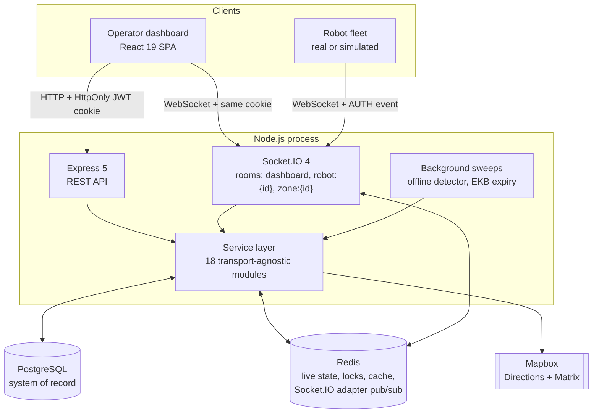
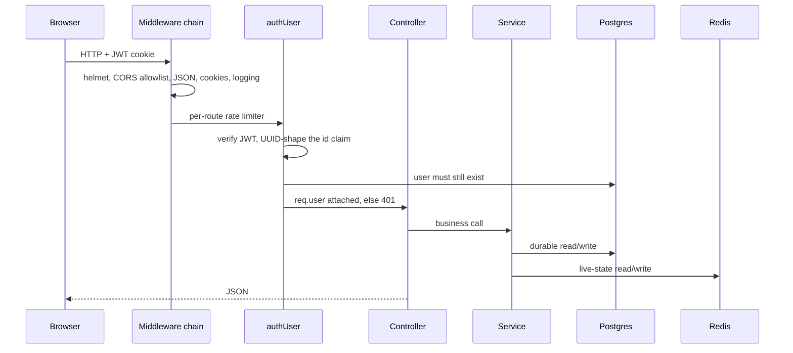
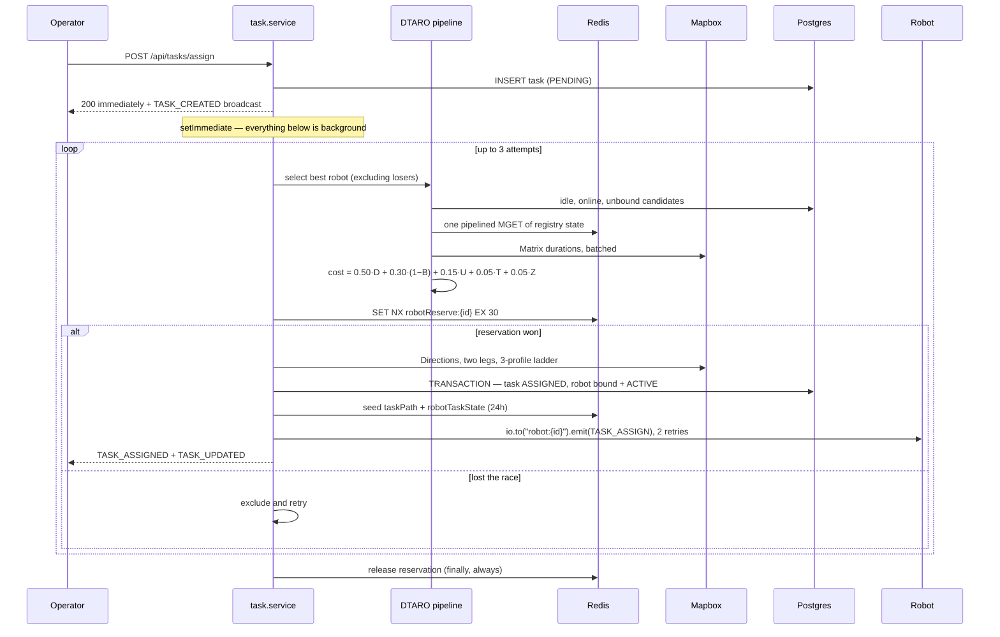
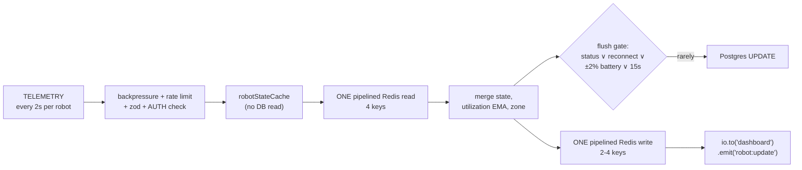
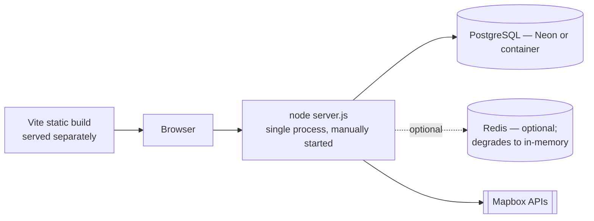
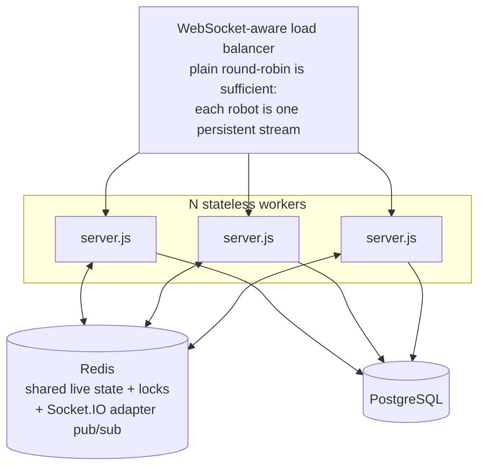
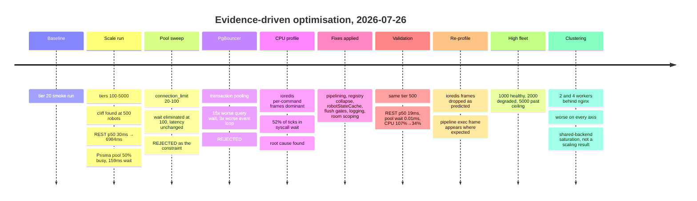

# RobotX — Final Architecture Summary

> **Executive architecture document.** The short-form picture of what RobotX is, how it is built, what it has been measured to do, and where it goes next. Verified against the implementation on branch `feature/dashboard` (HEAD `e558243`) — where prior documents and the code disagreed, the code won.
>
> Full subsystem detail lives in [`system.md`](./system.md). Raw measurement artefacts live in `Backend/benchmark/results/`.

---

## 1. Overall Architecture

RobotX is a **fleet command-and-control backend for autonomous delivery robots**: it commissions and authenticates robots, ingests their telemetry in real time, allocates delivery tasks to them with a multi-criteria cost function, plans and replans their routes, and streams the whole picture to an operator dashboard.

It is a **service-layered Node.js monolith** — one process hosting the REST API, the Socket.IO server, the database and cache clients, the background sweeps, and (in development) a full robot simulator. It is **cluster-capable but not clustered by default**: every mechanism required to run N processes behind a load balancer is implemented and validated as correct, but the default and currently-recommended deployment is a single process.

**The organising principle is a split between durable and live state.** PostgreSQL owns identity, ownership, and business records. Redis owns everything that changes every two seconds: positions, battery, utilization, zone membership, task route geometry, and allocation locks. That split is what allows a 1 000-robot fleet to stream telemetry continuously while the database sees roughly four writes per robot per minute.

**Services never reach for global clients.** `prisma`, `kv`, and `io` are passed in as arguments, which is why the same service layer serves both HTTP controllers and Socket.IO handlers, and why the business logic is testable against an in-memory cache and a mock database.

---

## 2. Major Components

| Component | Responsibility |
| --- | --- |
| **`server.js`** | Process wiring, Socket.IO Redis adapter, admin bootstrap, boot-time task recovery, simulator lifecycle, ordered graceful shutdown |
| **Express app** (`src/app.js`) | helmet → CORS → JSON/cookies → request logging → `/health` → `/api/*` → 404 → error handler |
| **`cache/kv.js`** | The sole Redis facade: pipelining, batch reads, atomic counters, fail-closed distributed locks, in-memory fallback, background reconnect with capped backoff |
| **Socket.IO layer** | Connection gate (JWT for dashboards, `AUTH` event for robots), four handler modules, per-socket per-event rate limiting, room-based addressing |
| **DTARO allocation** | `task.service` → `taskAssignment.service` → `robotValidator` + `costEvaluator`, with Redis `SET NX` reservation and bounded retry against the next-best candidate |
| **Telemetry pipeline** | `telemetry.handler` — validation, status-transition checking, one pipelined Redis read, gated Postgres flush, gated history snapshot, merged registry write, one pipelined Redis write, one room-scoped broadcast |
| **Environmental Knowledge Base** | `ekb.service` + `alertDissemination` + `routeIntersection` + `routing` — TTL-based obstacle store, exact path-intersection testing, A* replanning |
| **Zone manager** | Rectangular zone membership with a three-tier cache (in-process 60 s → Redis 300 s → Postgres), socket zone rooms, change-only side effects |
| **Simulator** | `SimulationEngine` + `VirtualRobot` — real `socket.io-client` peers speaking the production wire protocol, with realistic speed, battery, charging, and obstacle models |
| **Observability** | Dual-mode logger, always-on event-loop histogram, Prisma pool metrics, a rich `/health`, and two CPU-profiling modes |
| **Benchmark harness** | `benchmark/` — tiered load generation, per-worker health sampling, pool sweeps, PgBouncer comparison, flame-graph capture |

---

## 3. Request Flow

### Operator REST request

### Task assignment — the two-phase flow

The response returns after one `INSERT`. Up to six Mapbox calls, the candidate pipeline, and the finalisation transaction all happen after the client already has its answer.

### Telemetry — the hot path

**Per tick, per active robot: 2 Redis round trips, 0 Postgres queries in the common case, 1 socket emission.**

---

## 4. Deployment Architecture

### What exists today

There is **no Dockerfile, no compose file, no CI pipeline, and no `.env.example`**. The only container usage lives in the benchmark harness. Every environment variable must be supplied by hand — the reference table is [`system.md` §26](./system.md#26-configuration-and-environment).

### What the code already supports

Three pieces make this possible and are all implemented: the **Socket.IO Redis adapter** (so a room emit on one worker reaches clients on another), **room-based robot addressing** via `io.in("robot:{id}").fetchSockets()` + `io.to(...).emit(...)` (so any worker can reach any robot), and **Redis-backed reservations that fail closed** (so two workers can never grant the same robot). This topology was exercised at 2 000 robots across two workers and functioned correctly — see §6.

### Operational characteristics

- **Startup** — retrying Postgres connect (4 × 30 s), Redis attach with graceful fallback, idempotent admin bootstrap, boot-time task recovery from the database, then listen, then asynchronous simulator re-hydration.
- **Shutdown** — ordered drain: simulator → HTTP → Socket.IO → adapter clients → Redis → Prisma → exit. *(Bypassed entirely on Windows under external `TerminateProcess`.)*
- **Degradation** — Redis absent: single-process in-memory mode, correct by construction. Redis configured but unreachable: caches degrade silently, reconnect probe runs, and **allocation halts with a 503 rather than risk double-assigning a physical vehicle**. Mapbox absent: straight-line route fallback.

---

## 5. Scalability Model

**Validated single-node capacity: ~1 000 concurrent robots, fully healthy.**

| Tier | Auth | Telemetry in | Broadcast out | REST p50 | Event loop p95 | RSS | Assignments |
| --- | --- | --- | --- | --- | --- | --- | --- |
| **1 000** | **100 %** | 495.7/s | 498.2/s | **23 ms** | 31.9 ms | 435 MB | **24/24** |
| 2 000 | 96.4 % | 993.8/s | **199.6/s** | 21 ms (p95 1 550 ms) | 86.8 ms | 962 MB | 2/24 |
| 5 000 | 57.9 % | 1 436.8/s | **0/s** | — | — | 2 187 MB | 0/24 |

At 1 000 robots every frame ingested is a frame delivered. At 2 000, ingest still scales linearly but **dashboard fan-out collapses to 20 % of ingest** — the system takes data in but can no longer serve it out. At 5 000 the connection ramp itself stalls.

**The shape of the limit changed, not just its position.** Before optimisation, the system fell over at ~500 robots with a saturated Postgres connection pool — a *downstream-resource* limit. After, 1 000 is clean and failure at 2 000+ appears as broadcast starvation and memory growth with the pool idle — an *event-loop and socket fan-out* limit inside the Node process. That is a materially better failure mode: it is addressable by fan-out engineering (coalescing, viewport filtering, a dedicated broadcast tier) rather than by database capacity.

**Scaling model going forward:** stateless workers over shared Postgres and Redis. What must be fixed first is documented in §9.

---

## 6. Optimisation History

The discipline throughout was **measure → hypothesise → change one thing → re-measure**. Nothing here was applied speculatively; two plausible optimisations were measured, found harmful, and rejected.

### What was rejected, and why

| Hypothesis | Test | Result | Verdict |
| --- | --- | --- | --- |
| The Prisma pool is too small | Sweep `connection_limit` 20→100 at tiers 500/1 000 | At pool 100, wait fell to **0.13 ms** — and assignment p95 was still **8.7 s** | **Rejected.** Removing queueing at the pool did not remove the latency, so the pool was not causing it |
| Connection cost dominates; add PgBouncer | Transaction pooling, `default_pool_size=25` | Query wait **39 ms → 582 ms** at tier 1 000; event loop **236 ms → 630 ms**; 0/24 assignments | **Rejected.** An extra hop in front of a non-bottleneck |
| More workers on this machine will help | 2 and 4 processes behind nginx | Assignment REST p50 **21 ms → 20 813 ms**; 5 000-tier auth **57.9 % → 20.5 %** | **Rejected here.** Postgres writes/s ×13.7, Redis ops/s ×9.8, no new CPU |

### What was shipped

| Change | Motivating evidence | Effect |
| --- | --- | --- |
| **Redis pipelining** on the telemetry path | CPU profile: `ioredis Commander` 3.5 %, `sendCommand` 2.3 %, `Socket._writeGeneric` 2.0 % of non-library ticks | ~9 → **2** round trips per tick |
| **Registry read-modify-write collapse** | Four RMW cycles against the same key on the same tick | Folded into those same 2 round trips |
| **`robotStateCache`** | Pool contention traced to a per-tick `prisma.robot.findUnique` | Pool busy **9.91 → 0.5** of 20 |
| **Dirty-state DB flush gate** (+ the matching heartbeat gate) | 30 row writes per robot per minute | Postgres writes/s **252 → 98** |
| **Logging redesign** | Unconditional INFO log per tick, and a dev-path level-gating bug | Silent at `LOG_LEVEL=info`; sampled debug heartbeat retained |
| **Room-scoped broadcasts** | Global `io.emit` = O(N²) fan-out; every robot received every other robot's telemetry | Broadcast delivery **176 → 249/s** — scoping *increased* what operators see |
| **Socket.IO Redis adapter** | Correctness requirement above one process | Cross-worker broadcast verified working |
| **Room-based dispatch** | Same | `TASK_ASSIGN` / `REROUTE_ALERT` are worker-safe |
| **Nginx `worker_connections`** | Both 2w and 4w plateaued at ~254 robots regardless of tier — the signature of a fixed proxy cap | 512 default (≈256 with 2 connections per proxied WebSocket) → 16 384 |

---

## 7. Benchmark Summary

**Headline: the same 500-robot workload that was collapsing now runs at a third of the CPU with the database essentially idle.**

| Metric (tier 500) | Before | After | Change |
| --- | --- | --- | --- |
| `POST /api/tasks/assign` p50 | 6 984 ms | **19 ms** | **368×** |
| `GET /api/robots/state` p50 | 8 720 ms | **59 ms** | 148× |
| `GET /health` p50 | 10 196 ms | **18 ms** | 566× |
| Telemetry → dashboard p50 | 601 ms | **5 ms** | 120× |
| Assignments succeeded | 4 / 24 | **24 / 24** | — |
| Prisma pool busy | 9.91 / 20 | **0.5 / 20** | 20× |
| Prisma query wait | 158.97 ms | **0.01 ms** | ~16 000× |
| Postgres writes/s | 251.7 | **98.1** | 2.6× fewer |
| Event loop p95 | 130.2 ms | **31.8 ms** | 4.1× |
| Process CPU | 107.0 % | **33.9 %** | 3.2× |
| Telemetry throughput | 245.9/s | 248.2/s | unchanged — same work, less cost |

**Methodology.** Every tier: fresh database, fresh Redis, fresh processes, 15 s warmup, 75 s measurement window, external load generators (≤300 robots per child process) speaking the real wire protocol, `/health` sampled per worker directly rather than through the load balancer, assignment latency measured end-to-end from REST call to `TASK_UPDATED` broadcast. Two independent CPU profiles bracket the Redis work — one identifying the cost, one confirming its removal.

**Honest caveat.** All measurements are single-machine: load generators, server processes, Postgres, Redis, and nginx share one Windows laptop's CPU. The single-node results are trustworthy as a lower bound. **The clustering results are not a horizontal-scaling measurement** and should not be read as one — they measure what happens when N workers contend for one machine's shared backends.

---

## 8. Known Limitations

Full list with reproduction detail in [`system.md` §25](./system.md#25-known-defects-and-limitations).

### Defects found and fixed

The documentation audit surfaced seven defects, all now resolved and covered by regression tests. Every one of them was a **silent** failure — the system reported success, or reported a plausible-but-wrong reason, which is why none had been noticed.

| # | Failure mode | Resolution |
| --- | --- | --- |
| **D1** | `server.js` called `dispatchTaskAssign(robotId, payload)` against a `(io, robotId, payload)` signature. The robotId landed in the `io` slot, the presence check threw, the throw was swallowed as "robot offline", and the log said `dispatched: false`. Restarts never re-sent `TASK_ASSIGN`. | `io` is passed. `dispatch()` now validates it and returns `NO_IO_SERVER` with an error log, so the misuse can never again masquerade as an offline robot |
| **D2** | 14 of 137 tests failing. Half were stale assertions (global `io.emit`, old dispatch arity); the other half were caused by ad-hoc `{info, warn, error}` logger fixtures throwing on a `log.debug` the handler had since added — swallowed by the fixture's own no-op `error()` and surfacing only as a timeout | Assertions updated to the room-scoped surface; **every** logger fixture replaced with the shared full-surface `silentLogger`, eliminating the class |
| **D3** | The command endpoint emitted through the process-local socket map *and* used an event name no robot listened for. Every operator command against a virtual robot was ignored, unacknowledged, and `FAILED` ~15 s later | Endpoint and its retry scheduler dispatch by room; `VirtualRobot` implements the full `COMMAND` contract (STOP/PAUSE/RESUME/RETURN) and replies `COMMAND_ACK` |
| **D4** | `STOP` on task cancellation used the process-local socket map — under clustering a cancelled task's robot kept driving | Room-addressed via `dispatchStop` |
| **D5** | `RETURN_TO_BASE` was dead on both ends: nothing emitted it, and the `RETURN` command type was delivered as an event nothing handled | `RETURN` handled through the unified `COMMAND` path |
| **D6** | `robots:all` was written only at commissioning and never pruned. A robot missing from it is **skipped by obstacle rerouting** — the index was load-bearing for safety, not just for metrics | AUTH adds; disconnect and the offline sweep remove |
| **D12** | `Robot.socketId` was never cleared, so the column looked like a live handle indefinitely | Nulled on offline by both the disconnect handler and the sweep |

**Verification:** 22 suites, **169 tests, all passing**. Five new suites pin the fixes, including an integration test that drives a real Socket.IO server with a real client and asserts that the *old* two-argument call delivers nothing and reports `NO_IO_SERVER`. Because these were silent failures, the tests assert absence as well as presence — that `io.emit` is never called, that a locally-registered socket is never used for delivery, and that a malformed dispatch is distinguishable from an offline robot.

### Structural limitations (unchanged, documented, not addressed)

- **No authorization layer.** One role (`SUPER_ADMIN`), no per-endpoint checks. Step-up PIN/passkey ceremonies are real and server-verified, but are enforced by the frontend rather than required by the destructive endpoints.
- **Dashboard fan-out has no coalescing.** Every dashboard receives every robot's update regardless of viewport. This is the binding ceiling above ~1 000 robots.
- **Per-process state under clustering** — rate limiters, flush gates, and the robot state cache are all worker-local, so limits multiply and gates reset on cross-worker reconnect.
- **Duplicate live-state documents.** `robot:{id}` and `registry:{id}` overlap in six fields, both written every tick.
- **DTARO candidate selection is capped, not spatially filtered** (`take: 100` in unspecified order).
- **Mapbox is on the assignment critical path** with no route caching.
- **No deployment artefacts** — no Dockerfile, compose, CI, or `.env.example`.
- **`/health` is unauthenticated and expensive** (2 aggregations + 2 set reads + pool metrics + a Redis round trip).

---

## 9. Future Roadmap

Ordered by the ratio of value to evidence-we-already-have. The correctness tier is **done** — what follows is what remains.

### Done — correctness (D1–D6, D12)

Every defect in §8 is fixed and covered by tests; the suite is green at 169 tests. All server-to-robot delivery is now room-addressed and therefore worker-safe, which also removes one of the prerequisites for a meaningful multi-machine run.

### Near term — the measured ceiling

1. **Dashboard fan-out coalescing.** Batch robot updates into a periodic frame, and/or filter by viewport or zone. The measurements point at this as the single change that would move the ~1 000-robot ceiling, since it is broadcast delivery — not ingest — that fails first.
2. **Consolidate `robot:{id}` into `registry:{id}`.** Roughly a further 25 % cut in telemetry-path Redis payload volume.
3. **Batch the two remaining un-batched read paths** (`costEvaluator` per candidate, `alertDissemination` per robot) onto the existing `getManyRobotStates`.
4. **Spatially pre-filter DTARO candidates** using the existing `(lat, lon)` index instead of an arbitrary `take: 100`.

### The open question — multi-machine benchmarking

5. **Run the harness across separate hosts:** load generators, workers, Postgres, and Redis each on their own machine, behind a real load balancer. This is the one measurement that would convert §6's clustering result from "worse on this laptop" into an actual statement about horizontal scalability. It is currently **unstarted**, and every horizontal-scaling claim should be treated as unvalidated until it is done.

Prerequisites to make that run meaningful:

- **Leader election or a dedicated worker role** for the offline sweep and EKB sweep, which currently run in every worker and multiplied Postgres write load by 13.7× at two workers.
- **Pool budgeting** — `connection_limit` sized as `total ÷ workers` against the database's `max_connections`.
- **Shared rate-limit state** in Redis, so limits do not multiply by worker count.

### Longer term — production readiness

6. **Deployment artefacts** — Dockerfile, compose for the local stack, CI running the (green) test suite, and a committed `.env.example`.
7. **A real authorization layer** — additional roles, per-endpoint checks, and server-side enforcement of step-up for destructive actions.
8. **Close the observability loop** — `metrics:allocation:*` is written and never read; allocation cost and latency deserve aggregation and export rather than silent expiry.
9. **Reset the event-loop histogram periodically**, so long-running processes report recent percentiles rather than lifetime ones.

---

*Full technical reference: [`system.md`](./system.md). Measurement artefacts: `Backend/benchmark/results/`.*
