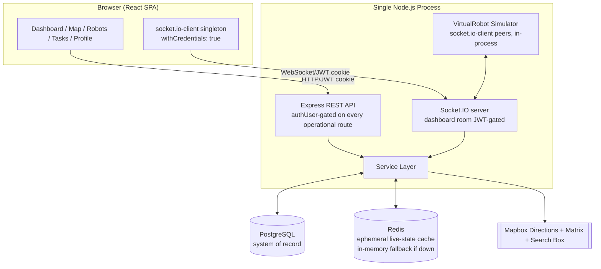
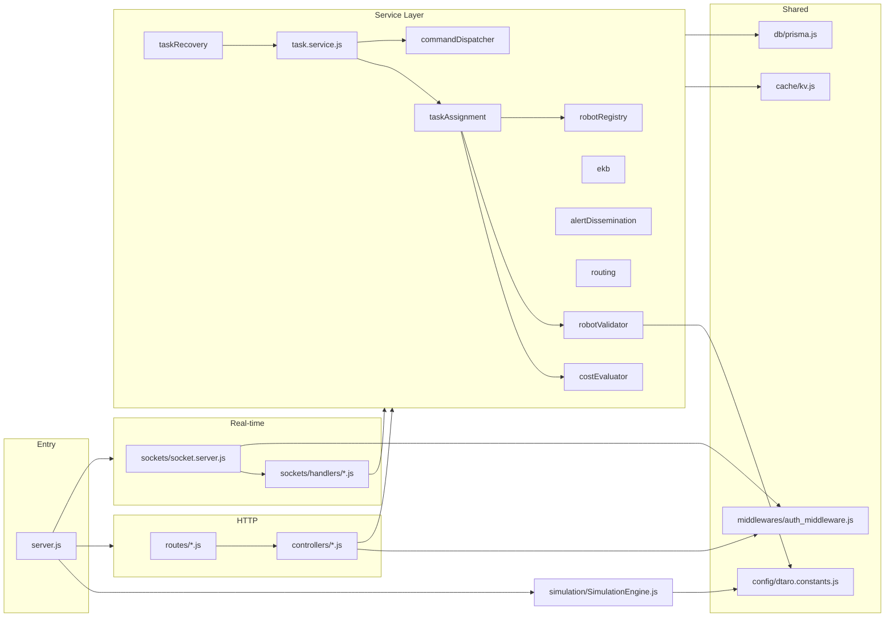
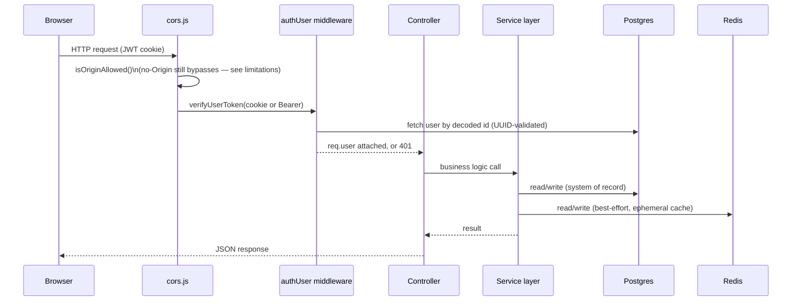
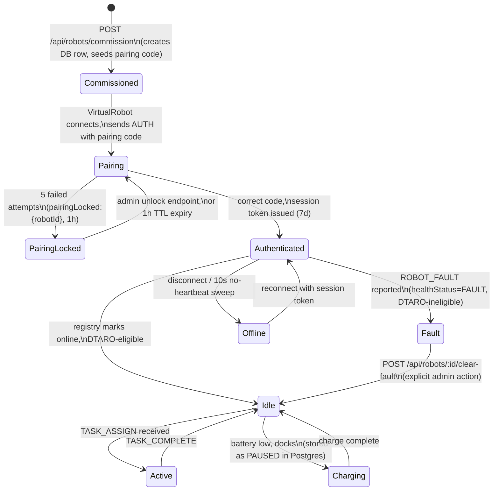
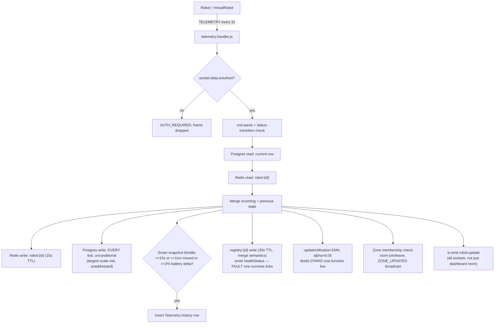
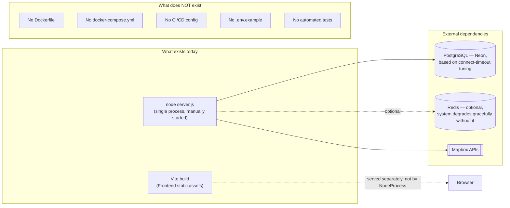
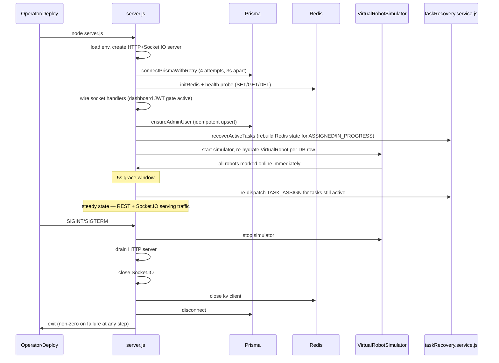

# RobotX — Final Architecture Summary

> Companion to `system.md` (full reference) and `PHASE1_VERIFICATION.md` (finding-by-finding audit). This document is the short-form architectural picture: module relationships, request/data flows, and operational lifecycle, as the repository actually exists today (branch `feature/dashboard`, commit `e020db8` + uncommitted working tree).

---

## 1. Current Architecture Overview

RobotX is a **single-process Node.js monolith**. One `server.js` process hosts an Express REST API, a Socket.IO server, a Prisma/PostgreSQL client, a Redis client (with in-memory fallback), and the entire simulated robot fleet (`VirtualRobot` instances connecting back into the same process as `socket.io-client` peers). There is no worker queue, no message broker, no second service of any kind.



**Services layer** (`Backend/src/services/`): `taskAssignment`, `costEvaluator`, `robotRegistry`, `robotValidator`, `zoneManager`, `ekb`, `alertDissemination`, `routing`, `commandDispatcher`, `task`, `taskRecovery`, `metrics`, `mapbox`. Both HTTP controllers and Socket.IO handlers call into this same layer — there is one source of truth for business logic regardless of transport.

---

## 2. Module Relationships



The one new cross-cutting dependency introduced by the latest round of work is `config/dtaro.constants.js` — the first shared-constants module in the codebase, imported by both `robotValidator.service.js` (server-side eligibility) and `simulation/constants.js` (VirtualRobot's own charge-interrupt logic). This is a pattern worth repeating for the codebase's other still-duplicated constants (rate-limit thresholds, TTLs).

---

## 3. Request Flow (REST)



Every operational route file (`robots.routes.js`, `tasks.routes.js`, `locations.routes.js`, `campuses.routes.js`, `simulator.routes.js`) applies `authUser` router-wide. `auth.routes.js` gates individual routes so `/login`/`/google`/`/logout` stay public.

---

## 4. Robot Flow (commission → auth → live)



Every robot — real or `VirtualRobot` — connects over the same Socket.IO protocol. The simulator exercises the identical auth/rate-limit/validation path a physical robot would.

---

## 5. Task Flow (DTARO allocation)

```mermaid
sequenceDiagram
    participant Operator
    participant API as tasks.controller.js
    participant TaskSvc as task.service.js
    participant Alloc as taskAssignment.service.js
    participant Cost as costEvaluator.service.js
    participant KV as Redis (kv.js)
    participant Mapbox
    participant DB as Postgres
    participant Robot as Robot socket

    Operator->>API: POST /api/tasks/assign
    API->>TaskSvc: assignTask()
    TaskSvc->>DB: create Task (PENDING)
    TaskSvc-->>Operator: 200 OK (PENDING) — returns immediately
    Note over TaskSvc: setImmediate() — background phase begins
    loop up to 3 attempts
        TaskSvc->>Alloc: selectNearestRobot(excludeIds)
        Alloc->>DB: query eligible candidates
        Alloc->>KV: getManyRobotStates() — one pipelined MGET
        Alloc->>Mapbox: Matrix API (batched)
        Alloc->>Cost: computeCosts() — D, B, U, T, Z weighted sum
        Cost-->>Alloc: winning robot
        TaskSvc->>KV: reserveRobot(robotId, taskId, 30s) — atomic SET NX
        alt reservation wins
            TaskSvc->>Mapbox: Directions API x2 legs
            TaskSvc->>DB: transaction: assign task, update robot
            TaskSvc->>KV: seed taskPath, robotTaskState; release reservation
            TaskSvc->>Robot: TASK_ASSIGN (2 retries, best-effort)
            TaskSvc->>KV: recordAllocation(real cost/latency)
            TaskSvc->>Operator: emit TASK_ASSIGNED / TASK_UPDATED (dashboard room)
        else reservation lost
            TaskSvc->>TaskSvc: exclude robot, retry
        end
    end
    Note over TaskSvc: task FAILED only after all 3 attempts exhausted
```

**What changed structurally in this pipeline versus a naive greedy allocator**: the reservation-and-retry loop means a task no longer fails outright the instant two requests race for the same robot — it falls through to the next-best eligible candidate first. This closes what was previously the single most consequential correctness gap in the allocation system.

**Task cancellation is the one lifecycle edge that remains a straight Postgres update with no downstream effect** — cancelling a task does not stop the robot or clean up its Redis routing state (see `PHASE1_VERIFICATION.md` §1, Tier 2).

---

## 6. Telemetry Flow



Two independent Redis documents (`robot:{robotId}` and `registry:{robotId}`) are still written per tick for overlapping data — this duplication was not resolved in the latest round of changes (see `system.md` §7 and §16).

---

## 7. Authentication Flow

```mermaid
flowchart TD
    subgraph HumanAuth["Human (Operator) Auth"]
        Login[POST /api/auth/login or /google] --> JWT["HttpOnly JWT cookie (7d)"]
        JWT --> REST["authUser gates all operational REST routes"]
        JWT --> SocketGate["verifyUserToken gates Socket.IO dashboard room"]
    end
    subgraph StepUp["Step-Up Authorization (destructive actions)"]
        Action[requestAuth wraps action] --> Modal[AuthChallengeModal]
        Modal --> PIN["PIN path: POST /api/auth/pin-auth\nbcrypt compare, server-verified"]
        Modal --> Passkey["Passkey path: POST /api/auth/webauthn/auth-options\nthen /verify — real @simplewebauthn/server ceremony"]
        Passkey --> Challenge["Server-issued Redis challenge (300s TTL)"]
        Challenge --> Counter["Signature counter must strictly advance\n(replay/clone detection)"]
        Counter --> Authorized[action proceeds only if verified:true]
    end
    subgraph RobotAuth["Robot Auth"]
        Pairing["6-digit pairing code (300s TTL)\nor session token (7d)"] --> AuthEvent["Socket.IO AUTH event"]
        AuthEvent --> Lockout["5 failed attempts -> pairingLocked (1h)\nkeyed by robotId, survives reconnect"]
        AuthEvent --> RobotSession["socket.data.isAuthed = true\nrequired before ANY telemetry is accepted"]
    end
```



Both step-up paths (PIN and Passkey) are now genuinely server-verified — this is the most significant authentication change since the prior review: WebAuthn went from a client-side-only illusion of security to a real, cryptographically-verified ceremony with replay protection.

---

## 8. Deployment Architecture



There is currently no reproducible build artifact and no documented deployment procedure. Every environment variable required to run the system (`system.md` §15) must be supplied by hand — there is no `.env.example` to reference, and no containerized environment to codify the dependency versions/config implicitly.

---

## 9. Operational Lifecycle



Restart-recovery (no in-flight task or robot state is lost across a restart) and graceful shutdown (ordered drain of every subsystem) remain the two most robust pieces of operational engineering in the system, unchanged by the latest round of work and worth explicitly protecting in any future refactor.

---

## 10. What Changed Architecturally in the Latest Round

No new architectural pattern was introduced — every change fits inside the existing single-process, service-layer shape:

- **New cross-cutting module**: `config/dtaro.constants.js` — first shared-constants file in the codebase.
- **New data-plane primitive**: Redis atomic reservations (`kv.reserveRobot`/`releaseReservation`, `SET NX EX`) — used to make the allocation pipeline race-safe without introducing a lock service or queue.
- **New data-plane primitive**: Redis pipelined batch reads (`kv.mget`, `robotRegistry.getManyRobotStates`) — used to cut Redis round-trips in both the DTARO candidate loop and the REST robot-list endpoints.
- **New security surface**: `webauthn_controller.js` + `WebAuthnCredential` table — a real WebAuthn relying-party implementation, isolated to its own controller/route file, following the existing controller/route/service layering rather than introducing a new pattern.
- **New DTARO input**: zone-locality now genuinely participates in the cost function (`Z` term), and utilization is genuinely live (EMA from telemetry) — both were previously either absent or dead code.

What did **not** change: process topology (still one process), data-store topology (still Postgres + Redis, same roles), transport (still REST + Socket.IO on one shared `io` instance), and the two duplicate-state patterns (`registry:`/`robot:` Redis keys, and the two command-retry mechanisms) that were already flagged as technical debt — both remain exactly as they were.

---

*See `system.md` for full subsystem detail and `PHASE1_VERIFICATION.md` for the complete finding-by-finding audit trail with evidence and prioritized recommendations.*
