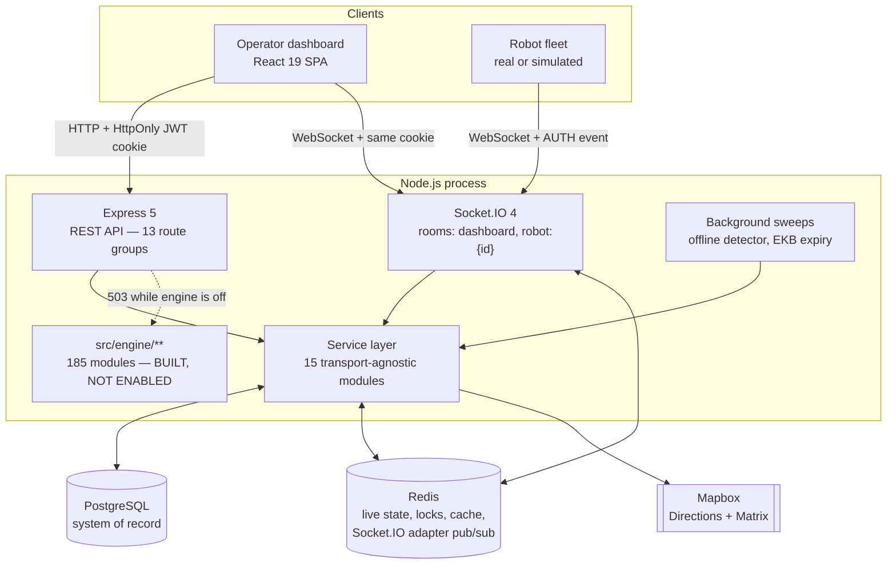
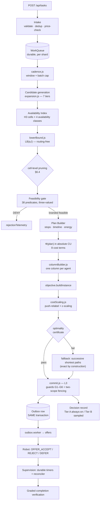
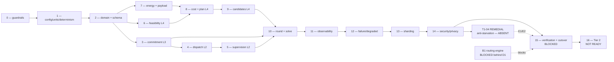
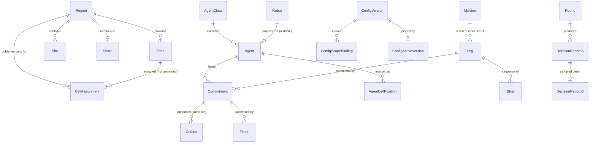

# RobotX — Complete System Technical Handbook

**Purpose.** One document that teaches you the whole RobotX system from first principles, and that you can defend in a technical presentation, viva, project review, or architecture interview.

**Compiled:** 2026-08-11 · **Branch:** `feature/dashboard` · **HEAD:** `63f5c58`

> ## ⚠ Currency notice — read before quoting any number from this handbook
>
> **This handbook was measured on 2026-08-11 at HEAD `63f5c58`. The tree has moved since.**
> Phase 15's remediation passes, the B1 prerequisite pass and the P15-F1 work all landed
> afterwards. Its *explanations* remain accurate; a number that is not re-measured is not.
>
> **Re-measured 2026-08-29 at HEAD `b68dc5d`, source digest `431010ace1…` (565 files):**
>
> | Quantity | This handbook says | **Current** |
> |---|---|---|
> | Test suites / tests | 145 / 6 363 | **160 / 7 162** · 0 failures · exit 0 |
> | Build gates in `npm run gates` | 7, all passing | **8** — 7 PASS, `gate:composition` **FAIL**; the script **exits 1** |
> | §24 release gates | 23 rows | **24 rows**, all blocking; `blockers({})` returns all 24 |
> | Release verdict | 16 GREEN · 2 RED · 1 PARTIAL · 4 NOT_EVALUATED | **16 GREEN · 1 RED · 7 NOT_EVALUATED — RELEASE: BLOCKED**, 8 blocking gates not green. There is no `PARTIAL` status in the gate algebra |
> | Registered workers | 19 | **18 registered**; `src/workers/` holds 20 `.js` files |
> | Workers on production scheduling | none | **11 of 18** — 8 `SCHEDULED` at boot, 3 of 4 `LEADER_ONLY` on promotion |
> | Production composition root | does not exist | **`Backend/server.js` is it.** `coordinator` still cannot be composed (B1) |
> | ADR files | 39 (ADR-01…33 + six lettered) | **40** — 38 frozen Appendix C records + **ADR-33 and ADR-34** (integration) |
> | Engine modules | 185 | **approximate.** Each gate scopes its own: `gate:tiers` governs 285, `gate:params` scans 189 |
> | Phase 15 | BLOCKED | **IMPLEMENTATION CLOSED · RELEASE BLOCKED · PHASE 16 NOT READY** |
>
> **For anything Phase-15-related, the current source of truth is
> [`docs/phase15/PHASE_15_MASTER.md`](docs/phase15/PHASE_15_MASTER.md)**, with
> `PHASE_15_IMPLEMENTATION_STATE.md`, `PHASE_15_VERIFICATION_STATE.md`, `PHASE_15_BLOCKERS.md` and
> `PHASE_15_CLOSURE_CHECKLIST.md` beside it.
>
> The Phase-15 *state* claims in §3.3, §3.4, §42 and §60.4 were corrected in place on 2026-08-29.
> The repeated count figures elsewhere (§34, §39, §40, §51, §63, §70, §84, §87, §88) were **left as
> written and registered as known drift** — see `docs/phase15/PHASE_15_BLOCKERS.md`
> § *Cross-phase documentation discrepancies*. Re-measure; do not quote.

---

## 0. How to read this document, and what it is worth

### 0.1 Everything here was checked against the repository

This handbook was **not** written from memory or from generic robotics knowledge. It was assembled by reading the repository in the authority order the project itself declares, and by **executing** the project's own verification tooling rather than quoting reports about it.

**Live commands run while writing this document** (2026-08-11, this machine):

| Command | Result observed |
|---|---|
| `npm run gates` | **7 / 7 PASS** — tiers (277 modules, 386 governed edges), params (183 modules / 242 parameters), tenets (274 modules), privacy (16 modules), erasure (3 corpus decisions, byte-identical), legacy-retirement (4 retired modules absent, 302 files), column-generation (`NOT_REQUIRED`) |
| `npm run gate:calibration` | **FAIL — 39 blocking findings.** 242 register entries: **52 DERIVED / 152 PROVISIONAL / 38 UNCALIBRATED**; 54 Safety-class |
| `npm run routing:readiness` | **OVERALL: BLOCKED.** D1 BLOCKED, D3 BLOCKED, D8 BLOCKED; B1 step 2 PASS (3 adapters), steps 1/3/4/5 BLOCKED |
| `npm test` | **145 suites · 6 363 tests · 0 failures**, 5 Jest projects, 172 s |

> **Use the live numbers, not the quoted ones.** `ARCHITECTURE.md` says 6 287 tests and `PHASE_1_REMEDIATION_AND_CLOSURE.md` says 6 357. Both were true when written; the Phase 2 remediation added tests after each. **Today the suite is 145 / 6 363 / 0.** This is a small example of the discipline the whole programme runs on — re-measure, do not quote.

**Counts re-measured against the tree, with two small corrections to the documentation:**

| Quantity | Documentation says | Counted today | Note |
|---|---|---|---|
| Feasibility predicates | 38 | **38** (`predicates/f01..f38.js`) | ✅ agrees |
| Engine workers | 19 | **19** `.js` files in `src/workers/` | ✅ agrees (includes `registry.js`, which is a registry rather than a worker — so **18 workers + 1 registry** is the stricter reading) |
| Registered parameters | 242 | **242** (live gate output) | ✅ agrees |
| Engine modules | "185 modules" | **186** `.js` files under `src/engine/` | ⚠️ Off by one. The gates count differently again — `gate:tiers` governs **277** modules and `gate:params` scans **183** *engine* modules — because each gate scopes itself to what it governs. **Quote a gate's own number with the gate's name attached, or say "~185".** |
| ADR files | "38 records" | **39** `ADR-*.md` files | ⚠️ The numbered series runs ADR-01…ADR-33 (33), plus six lettered sub-records (02b, 02c, 02d, 04b, 04c, 09b) = **39 files**. "38" appears to predate one addition. **Say "39 ADR files, ADR-01 through ADR-33 plus six lettered sub-records."** |

Those four command results, and this table, are the spine of this document. Everything else is read from source, schema, tests, ADRs, and the phase evidence trail.

### 0.2 The authority order used

The project declares its own hierarchy, and this handbook obeys it:

1. `NEXT_GENERATION_ASSIGNMENT_ENGINE.md` — **FROZEN**. The architecture. What is *required*.
2. `docs/adr/` — architecture decision records (**39 files**; the docs say 38 — see the count table below). Each fixes one decision **and its rejected alternative**.
3. `IMPLEMENTATION_EXECUTION_PLAN.md` — the plan of record: 16 phases + one remedial phase, capability inventory, §6.1 blocking decisions.
4. `docs/phase15/PHASE_15_MASTER.md` — the Phase 15 source of truth, with `PHASE_15_IMPLEMENTATION_STATE.md`, `PHASE_15_VERIFICATION_STATE.md`, `PHASE_15_BLOCKERS.md` and `PHASE_15_CLOSURE_CHECKLIST.md` beside it. **Authoritative for current programme state.** *(Superseded 2026-08-29: this slot previously held `PHASE_15_CONSOLIDATED_REMEDIATION_REPORT.md` rev 8.1, now archived at `docs/phase15/archive/` as historical evidence only.)*
5. `Backend/src/engine/ARCHITECTURE.md` and `TIERS.md` — module map and obligation tiers.
6. **Source, tests, migrations, and the eight build gates** — the final arbiter of *what exists*. (`npm run gates` runs eight since Phase 15 added `gate:composition`, and currently exits 1.)
7. `ARCHITECTURE.md` (root) — the current-state narrative. Explicitly ranks *below* all of the above.
8. `docs/history/` — **historical**. Describes deleted systems. Not current authority.

**Rule applied throughout:** the frozen spec says what is *required*; the code says what is *implemented*; the independent verification reports say what was actually *verified*; the latest remediation/closure report wins over an earlier finding it fixed.

### 0.3 Status vocabulary — use these words, they are not synonyms

The project defines six labels, and the difference between the middle three is the difference between a system that works and one that is merely written down.

| Label | Meaning |
|---|---|
| **DESIGN** | Specified in the frozen architecture. No code, or code not yet owned by a completed phase |
| **IMPLEMENTED** | Code exists, is tested, passes the build gates |
| **NOT YET WIRED** | Code exists and is tested, but **nothing in the repository constructs it in a production path** |
| **ENABLED / LIVE** | Actually running and deciding |
| **BLOCKED** | Cannot proceed until a named external decision, procurement, or measurement lands |
| **HISTORICAL** | Described a system generation that no longer exists |

> **The single most important sentence in this handbook:**
> **No component of the assignment engine is ENABLED / LIVE.** The host platform around it is. Both facts are deliberate, and you must be able to say both in one breath.

### 0.4 Contradiction register — where sources disagree

The repository contains a lot of documentation written at different times. These are the conflicts you will hit, stated explicitly rather than silently resolved.

| # | Earlier documentation said X | Current evidence shows Y | Why Y is authoritative |
|---|---|---|---|
| C1 | `docs/history/*` describes a working DTARO assignment engine with a cost function, reservations, and dispatch | Those four modules are **deleted from the build**; `gate:legacy` fails the build if they return | Verified live: *"4 retired module(s) absent from the build and unimported; no retired symbol redefined across 302 file(s)."* Code is the arbiter of existence |
| C2 | `Backend/benchmark/results/` contains impressive throughput numbers (1 000 robots, 496 msg/s, 24/24 assignments) | Those measured the **legacy DTARO monolith**, which no longer exists | `ARCHITECTURE.md` §8.3 labels them HISTORICAL. They remain valid evidence of *host-platform* behaviour, and several of those optimisations are still live — but they are **not** next-generation-engine performance |
| C3 | `engine/ARCHITECTURE.md` names `routing/client.js`, `stores/roles.js`, `deps/registry.js` as owned by Phases 8, 3, 12 | **None of the three exists.** The routing directory holds caches only; `stores/` and `deps/` are empty | Consolidated finding **N14**, and direct `ls` of the tree. The module map names what the owning phase *must* create — an entry there is not evidence of existence |
| C4 | Three documents filed the fairness modules (`ladder.js`, `operatorCapacity.js`, `agentStarvation.js`) under Phase 16 | They are **Tier 1** (T1-04, invariant I13) — a Phases 0–15 launch obligation, not a Tier 2 quality feature | `TIERS.md` T1-04 + spec §1.8. Ownership closed as **OAD-7**: plan §3 now carries **REMEDIAL PHASE T1-04**. The modules are still absent |
| C5 | `PHASE_10_IMPLEMENTATION_REPORT.md` (2026-08-05) describes the shipped solver as successive shortest paths | Phase 10 was **re-opened**; the shipped solver is now Goldberg–Tarjan push-relabel with ε-scaling (`solve/costScaling.js`) | `PHASE_10_COST_SCALING_IMPLEMENTATION_REPORT.md` (2026-08-08) supersedes it, and was independently verified. SSP is retained only as a test oracle and exactness fallback |
| C6 | `PHASE_1_INDEPENDENT_VERIFICATION.md` Finding 5 said the baseline commit citation was inaccurate | Remediation found **the verification report's own claim** was the inaccurate one | `PHASE_1_REMEDIATION_AND_CLOSURE.md` §5, checked against git history. Later evidence supersedes earlier evidence, in both directions |
| C7 | `PHASE_15_CONSOLIDATED_REMEDIATION_REPORT.md` §22.2 said D1's missing input was *"a boundary as GeoJSON … placed in configuration as `regions[].boundary`"* | **No runtime consumer requires region geometry at all.** Geometry is required by the *extract cut*, an operational artefact outside the published config schema | Revision 3, §30.1. The earlier reading made D1 look like a schema change when it is not one |
| C8 | The consolidated report recorded decision D2 (H3 resolutions) as MISSING | D2 is **decided and implemented**: `spatial/cells.js` pins `FINE: 8` / `COARSE: 5` as `@structural` | Finding **N15**, revision 2, verified in source |

**Presentation rule that follows from this table:** never quote a number without its class. This programme distinguishes *implementation-author benchmark*, *independent verification benchmark*, *diagnostic measurement*, and *formal gate evidence* — and only the fourth can discharge a release gate.

---
# PART I — WHAT ROBOTX IS

## 1. Level 1 — the beginner explanation

### 1.1 What is RobotX?

RobotX is a **fleet command-and-control backend for autonomous delivery robots**, with a real-time operator dashboard.

Think of it as air traffic control for a fleet of delivery robots. It:

- **commissions** robots (gives them an identity and credentials),
- **authenticates** them when they connect,
- **ingests their telemetry** — position, speed, battery, status — roughly every 2 seconds,
- **handles obstacle reports** and reroutes the robots that are actually affected,
- **streams the whole picture** to a React operator dashboard,
- and — this is the hard part — **decides which robot should do which delivery**.

That last responsibility is called **assignment**, and it is the part of the system currently being replaced.

### 1.2 What happens when a delivery task is created — *today*

```
Operator/API  →  POST /api/tasks  →  503 ENGINE_NOT_LIVE
```

That is not a bug. It is the deliberate current state:

- the **old** assignment engine (called DTARO) has been **deleted from the build**, not merely switched off;
- the **new** engine is **built and tested — ~185 modules — but switched off** (`ENGINE_ENABLED` defaults to `false`; `server.js` *is* the production composition root and starts 11 of the 18 registered workers, but it cannot construct a solve path because the `coordinator` needs a routing engine **B1 has not selected**);
- so there is currently **no component responsible for deciding a task**.

Accepting a task anyway would durably record work that nobody will ever act on — precisely the defect the new architecture exists to eliminate. **A 503 naming the state is honest; a queue nobody drains is not.**

**Everything else runs.** Robot authentication, telemetry ingestion, the live dashboard feed, obstacle handling and rerouting, the simulator, and the operator API are all live and working.

### 1.3 What happens when a robot is selected — *as designed*

When the engine is eventually enabled, one **round** of the assignment coordinator does this:

1. **Intake** — the work (a "Leg") is validated, deduplicated, and put on a durable per-shard queue.
2. **Candidate generation** — instead of scanning every robot, the engine searches outward from the pickup point through a hexagonal spatial index, cheapest cells first, and stops when it can *prove* nothing unexplored could be better.
3. **Feasibility** — 38 hard predicates run as a boolean gate *before* any cost is computed. Battery, payload mass, capability, zone permission, deadline, charger reachability. Anything that fails is out, and the cost code is **structurally incapable** of even seeing it.
4. **Cost** — each surviving robot-task pairing is priced in **absolute cost units (CU)**, a real dimensioned currency-like quantity, not a normalised 0–1 score.
5. **Solve** — the engine solves a min-cost flow over the whole batch, so it picks the best *global* assignment rather than the best greedy one.
6. **Commit** — one serialised conditional database write per shard, protected by six guards and two fencing scopes, with the dispatch message written in the *same transaction*.

### 1.4 What happens when the robot moves

The robot streams a `TELEMETRY` frame every ~2 seconds over a WebSocket. Per frame the server does:

```
validate → status-transition check → ONE pipelined Redis read
        → gated Postgres flush → gated history snapshot
        → merged registry write → ONE pipelined Redis write
        → ONE room-scoped broadcast to the dashboard
```

The word "gated" is the whole trick: database writes are throttled so **database load is decoupled from fleet size × tick rate**. Movement alone does not write to Postgres.

### 1.5 What happens when the task completes

The robot emits `TASK_COMPLETE`; the server acknowledges. In the **new** architecture completion is not trusted on the agent's word — it is **graded verification with plausibility checking** (ADR-17): arrival radius, corridor half-width, max speed, track gap, fix rate. Those thresholds already exist as environment variables (`VERIFY_ARRIVAL_RADIUS_M`, `VERIFY_CORRIDOR_HALF_WIDTH_M`, …).

---

## 2. The problem RobotX solves

### 2.1 Why autonomous delivery assignment is hard

A naïve reading says: "pick the nearest available robot." Every word in that sentence hides a constraint.

| Word | What actually has to be true | Where RobotX handles it |
|---|---|---|
| **pick** | The decision must be *exclusive* — two coordinators must never commit the same machine | Serialised conditional commit, guards G1–G6, two-scope fencing (ADR-04, ADR-10) |
| **the nearest** | Straight-line distance is not travel time. Real routing needs a road/sidewalk graph | ADR-11 self-hosted routing — **BLOCKED**, no engine selected |
| **available** | Available *when*? A robot finishing in 90 s may beat an idle one 2 km away | Availability Index with four classes incl. `FINISHING_SOON` |
| **robot** | Which robot *class*? Capabilities, container thermal class, payload mass, dimensional passage | 38 feasibility predicates, F21–F31 |
| — | Can it get there **and** still reach a charger with reserve intact? | F34/F35, energy model with layered reserves (ADR-09, ADR-09b) |

### 2.2 Why this is not a CRUD backend

Four properties make it categorically different:

1. **A wrong decision has a physical consequence.** A double-commanded machine, a stranded agent obstructing a road, lost goods. That is why the architecture tiers its obligations and why Tier 0 is *indivisible*.
2. **Decisions must be reproducible.** A decision made last Tuesday must be reconstructible byte-for-byte — for audit, for incident analysis, for shadow comparison. That forces fixed-point arithmetic, canonical ordering, config version pinning, and no wall-clock reads in the decision path.
3. **The candidate set is large and the budget is small.** 500 Legs × 200 candidates = 100 000 columns per round, against a 250 ms target.
4. **Safety values cannot be invented.** A battery reserve or a payload safety factor is not a tuning knob. This is why 39 parameters are *blocked on external evidence* rather than filled in with plausible-looking numbers.

### 2.3 The four blocking properties of the previous design

The legacy analysis (preserved in `docs/history/legacy-scale-analysis.md`) identified four structural defects in the old data plane. They are the best statement of *why* the new architecture looks the way it does:

| # | Defect | Consequence | How the frozen architecture answers it |
|---|---|---|---|
| **B1** | Connection-state affinity — the robot→socket table was a process-local `Map` | A second process could not dispatch to a robot connected to the first. **Hard blocker on running two instances** | Region sharding with single-writer-per-shard (ADR-12, ADR-10) |
| **B2** | Global fan-out — every telemetry frame broadcast to *every* socket | O(N²) amplification. At 10 000 robots ≈ **50 M socket writes/sec** for 5 000 useful frames/s | Room-scoped broadcast — **already live** in the host platform |
| **B3** | Per-robot synchronous DB round-trips inside the 2-second loop | Postgres query rate scaled linearly with fleet size. Ceiling ≈ 10k–25k robots, zero headroom | Gated Postgres flush — **already live** |
| **B4** | No durable work queue — the allocation pipeline was `setImmediate()` | A process death between `task.create(PENDING)` and assignment **orphaned the order permanently** | Durable per-shard `WorkQueue` + transactional outbox (ADR-05, ADR-27) |

> **This is the single best "why did you rebuild it?" answer you have.** B1 and B2 were correctness/architecture blockers, B3 a capacity blocker, B4 a durability blocker. **None of the four is fixed by drawing service boundaries around it** — which is why the rebuild is an engine replacement, not a microservice split.

---

## 3. Current system status — the honest table

### 3.1 The three generations

| Generation | State | Where |
|---|---|---|
| Original dashboard prototype (≈ Apr 2026) | **HISTORICAL** — superseded entirely | — |
| Legacy **DTARO** assignment engine (≈ Jul 2026) | **HISTORICAL — deleted from the build** | `docs/history/` |
| Next-generation assignment engine (Jul 2026 →) | **IMPLEMENTED · NOT YET WIRED · NOT ENABLED** | `Backend/src/engine/**` |

### 3.2 What runs today

| Subsystem | Status |
|---|---|
| Robot commissioning, pairing, authentication | **LIVE** |
| Telemetry ingestion (~2 s per robot) | **LIVE** |
| Operator dashboard feed (Socket.IO, room-scoped) | **LIVE** |
| Obstacle reports → EKB → selective rerouting | **LIVE** |
| Simulator (`VirtualRobot` over the real wire protocol) | **LIVE** |
| REST operator API — 13 route groups | **LIVE** |
| **Task assignment** | **NOT LIVE** — `POST /api/tasks` → `503 ENGINE_NOT_LIVE` |

### 3.3 The engine's real status

| Fact | Evidence |
|---|---|
| ~185 engine modules, **18 registered workers**, 38 feasibility predicates, 242 registered parameters | `Backend/src/engine/**`, `Backend/src/workers/**` |
| `ENGINE_ENABLED` defaults to **false** | `engine/cutover/enabled.js` |
| Liveness is a **conjunction**: process `ENGINE_ENABLED` **AND** the shard's `cutover.engine_enabled` binding | `cutover/enabled.js` |
| **`Backend/server.js` IS the production composition root** — but no real solve path is constructed anywhere outside a test fixture, because the `coordinator` cannot be composed: its round loop bottoms out in a routing engine **B1 has not selected** | `docs/phase15/PHASE_15_IMPLEMENTATION_STATE.md` · verified 2026-08-29 |
| **No round has ever executed** | ibid. |
| **11 of the 18 workers are on production scheduling** — 8 `SCHEDULED` started at boot, 3 of 4 `LEADER_ONLY` started on leadership promotion. `coordinator` is refused (B1); 6 are `DEFERRED`, each naming its own blocker | `src/workers/registry.js`; `ARCHITECTURE.md` §4.2 |

> **Corrected 2026-08-29.** This table previously read *"No production composition root exists"*
> (archived finding **N12**) and *"None of the 19 workers is on production scheduling."* Both were
> true when the handbook was compiled and both were made false by Phase 15's composition work. The
> worker count was wrong under every reading: 18 are registered, and `src/workers/` holds 20 `.js`
> files (18 `*.worker.js` + `registry.js` + `leaderWorkers.js`).

### 3.4 Programme status

| Item | Status |
|---|---|
| Phases 0–14 | Implemented and independently verified |
| **Phases 1–2** | **Additionally remediated and closed**, each with its migration executed against a disposable PostgreSQL 18.3 rather than statically checked |
| **REMEDIAL PHASE T1-04** | Registered (ownership closed, OAD-7). **Modules still absent** |
| **Phase 15** (verification, gates, cutover) | **IMPLEMENTATION CLOSED · RELEASE BLOCKED** — 8 of 24 blocking §24 gates are not green (1 RED, 7 NOT_EVALUATED); none is closable by a commit in this repository. *(Was "BLOCKED"; split into the two states on 2026-08-29 because conflating them is the specific error the Phase 15 documentation exists to prevent.)* |
| **Phase 16** (Tier 2 enablement) | **NOT READY — must not begin** |
| **B1** (routing engine selection) | **BLOCKED** behind **D1** (operating region), **D3** (fleet speed model) and **D8** (extract vintage) — all operations/product/commercial decisions, none an engineering task |
| Calibration | **39 Safety-class parameters not `DERIVED`** (242 entries: 52 DERIVED / 152 PROVISIONAL / 38 UNCALIBRATED; 54 Safety-class — re-verified 2026-08-29) |
| §6.1 blocking decisions **B1, B2, B3, B6, B8** | Unresolved |

`gates.blockers({})` returns all **24** release-gate rows with no evidence filed. **This is the release-gate machinery working as designed, not a defect.** *(24, not 23 — re-measured 2026-08-29.)*

**Full current state, blockers and next action: [`docs/phase15/PHASE_15_MASTER.md`](docs/phase15/PHASE_15_MASTER.md).**

---
# PART II — ARCHITECTURE

## 4. Level 2 — the engineering view of the live host platform

**Status: IMPLEMENTED and LIVE.** This is the part of RobotX that runs today.

### 4.1 Shape

A service-layered **Node.js monolith** — one process hosting the REST API, the Socket.IO server, the database and cache clients, background sweeps, and (in development) a full robot simulator. It is **cluster-capable but not clustered by default**.



### 4.2 The organising principle — durable versus live state

**PostgreSQL owns identity, ownership, and business records. Redis owns everything that changes every two seconds**: positions, battery, utilization, zone membership, route geometry, and locks.

That split is what lets a 1 000-robot fleet stream telemetry continuously while the database sees roughly **four writes per robot per minute**.

### 4.3 Dependency injection, not global clients

**Services never reach for global clients.** `prisma`, `kv`, and `io` are passed in as arguments. Three consequences worth stating in a presentation:

1. the same service layer serves both HTTP controllers and Socket.IO handlers;
2. business logic is testable against an in-memory cache and a mock database;
3. the engine's Tier 1 modules stay free of transport dependencies, which is what the tier gate enforces.

### 4.4 Technology

Node.js 20 (CI) · Express 5 · Prisma 5 + PostgreSQL · Redis (`ioredis`) · Socket.IO 4 with `@socket.io/redis-adapter` · `zod` validation · `pino` logging · `bcrypt` · `jsonwebtoken` · `@simplewebauthn/server` · `google-auth-library` · `h3-js` · `helmet`.

### 4.5 HTTP API — 13 route groups under `/api`

| Mount | Purpose | Introduced |
|---|---|---|
| `/auth` | Login, Google sign-in, PIN and WebAuthn step-up | Host platform |
| `/locations`, `/campuses` | Site and campus management | Host platform |
| `/robots` | Registry, commissioning, pairing, commands | Host platform |
| `/tasks` | Task intake — **currently 503 `ENGINE_NOT_LIVE`** | Host platform |
| `/simulator` | Simulator lifecycle | Host platform |
| `/config` | Configuration surface | Phase 1 |
| `/legs` | §4.5 operator visibility: leg state, deadline, owning timer | Phase 5 |
| `/diagnostics` | §7.7 binding-constraint distribution, near-miss margins | Phase 6 |
| `/explain` | §21.3 Explanation API — **explainability is a functional requirement (T8)** | Phase 11 |
| `/health` | §26 invariant register, §18.5 degraded-mode register | Phase 12 |
| `/shards` | §3.5 shard model, §19.2 rebalancing | Phase 13 |
| `/privacy` | §23.7 erasure surface — **the only operator surface that destroys data** | Phase 14 |

Express pipeline: `helmet` → CORS → JSON/cookies → request logging → `/health` → `/api/*` → 404 → error handler.

### 4.6 Service layer — 15 transport-agnostic modules

`adminBootstrap` · `alertDissemination` · `campus` · `commandDispatcher` · `ekb` · `location` · `mapbox` · `metrics` · `robot` · `robotRegistry` · `routeIntersection` · `routing` · `task` · `telemetry` · `zoneManager`

---

## 5. Level 3 — architectural boundaries

### 5.1 The four-layer engine model (§3.1)

The engine's layers are separated by **failure semantics** — the property that matters most under partial failure. **A layer may only depend downward.**

```
┌─ L4  DECISION LAYER ─────────────────────────────────────────────────────────┐
│  Deterministic, side-effect-free, replayable.                                │
│  Feasibility · Column pricing · Solve · SOFT reservations · Decision records  │
│  Failure semantics: retryable, idempotent, no external effect.               │
├─ L3  COMMITMENT LAYER ───────────────────────────────────────────────────────┤
│  Serialised per shard, durable, fenced.                                      │
│  HARD commitment write · Fence allocation · Outbox write · Lease grant        │
│  Failure semantics: CP — refuses to act when it cannot guarantee exclusivity. │
├─ L2  EXECUTION LAYER ────────────────────────────────────────────────────────┤
│  At-least-once, idempotent, supervised.                                      │
│  Dispatch · ACK · Lease renewal · Progress ingestion · Recovery               │
│  Failure semantics: retries forever with escalation; never silently drops.    │
├─ L1  STATE & ESTIMATION LAYER ───────────────────────────────────────────────┤
│  Eventually consistent, cache-backed, reconstructible.                       │
│  Live agent state · Spatial index · Routing · Forecast · Prices · Reliability │
│  Failure semantics: AP — degrades to reduced-envelope operation.             │
└──────────────────────────────────────────────────────────────────────────────┘
```

> **The critical property, and the best single sentence about this architecture:**
> **L1 may be lossy and L4 may be repeated, but L3 must be exactly once.**
>
> This is the **inverse** of the legacy system, where the cache — an L1 concern — carried the exclusivity guarantee. Concentrating the consistency requirement into the smallest possible layer, a single conditional write per HARD commitment, is what allows every other layer to be fast, replicated, and failure-tolerant.

It is also why **SOFT reservations are not durable**: a SOFT reservation produces no external effect, so it belongs in L4, where being lost simply means being recomputed. They are round-local in coordinator memory and **schema-forbidden in the store** (ADR-04c).

### 5.2 Obligation tiers — the normative part

The frozen architecture tiers **every mechanism**, and the tiering is normative. A mechanism's tier states **what its absence or incorrectness costs**.

| Tier | Name | If it is wrong | May a release ship without it? |
|---|---|---|---|
| **0** | Safety core | A physical incident: a double-commanded machine, a stranded agent, lost goods, an unsafe pairing executed | **No** |
| **1** | Operational integrity | The engine is unsupportable, unauditable, or unbounded in time — decisions nobody can explain, reproduce, or terminate | **No**, for production |
| **2** | Allocation quality | It allocates worse than it could. **Nothing physical is at risk** | **Yes** — each individually disableable |

**Why tiers exist** (quoting §1.8, and this is worth reading aloud in a presentation):

> "A document whose thirty-eight feasibility predicates, column generation, deferral, preemption, churn pricing, approximate-dynamic-programming terminal values, and hierarchical Bayesian reliability estimation all appear at the same level of obligation will be partially implemented — its scope guarantees that — and the subset that ships will otherwise be **self-selected by whoever implements it first**, with no analysis of whether that subset is safe on its own."

**Three rules:**

1. Every Tier 2 mechanism MUST be **individually disableable**, and every kill switch MUST degrade to a Tier 1 behaviour that is **itself complete and tested**. *A kill switch that degrades to an untested path is not a control.*
2. **No Tier 0 or Tier 1 guarantee may depend on a Tier 2 mechanism.** Mechanically enforced over the static import graph — verified live: *"277 modules, 386 governed import edges, no Tier 0/1 → Tier 2 dependency."*
3. The staged order is a **consequence, not a suggestion**. Tier 0 + Tier 1, at `capacity[agent_class] = 1`, in the singleton regime, with deferral and preemption off, is *"a complete, safe, shippable engine."*

**The compliant pattern for an optional Tier 2 enhancement** — a Tier 1 module never imports its Tier 2 enhancement:

```
  ✗  cost/phi.js          require("./cOpportunity")     ← gate fails
  ✓  engine/bootstrap.js  phi.registerTerm(cOpportunity) when the switch is on
```

*A Tier 2 mechanism statically linked into the Tier 1 path is a kill switch that cannot actually be thrown.*

**Tier 0 (11 mechanisms)** — feasibility gate, three-valued evaluation, energy feasibility + charger reachability, payload/capability predicates, the serialised conditional commit with G1–G6, two-scope fencing + agent-side dedup, custody, durable timers + reconciler, transactional outbox, stranding classification + escalation, degraded-mode register.
**Tier 1 (7)** — CU units + parameter register, determinism/replay, Tier A decision record + Explanation API, **the anti-starvation ladder (T1-04 — absent)**, cancellation/reassignment/settlement, admission control, the Invariant Checker.
**Tier 2 (13)** — batch solving, multi-Leg columns, chaining, deferral, preemption, opportunity cost, churn pricing, local search, reliability-priced risk, duty-cycle regulariser, repositioning, consolidation, cross-region candidacy.

### 5.3 The §22.5 supported monotone ladder

Supported kill-switch combinations are the **prefixes** of this order. Any other combination is *permitted* — an operator must never be blocked from disabling a specific misbehaving mechanism — but is recorded as an **unrehearsed combination**, alerts as such, and requires explicit acknowledgement.

`reposition_injection` → `preemption` → `deferral` → `cross_region_candidacy` → `chaining` → `multi_leg_columns` → `reliability_based_gating` → `batch_solving` → `opportunity_cost_term`

> **Recorded specification discrepancy, and a good "did you find problems in the spec?" answer.** §1.8 enumerates **twelve** Tier 2 mechanisms; §22.5 tabulates **nine** kill switches and reasons about "the nine independent switches" and their 512 combinations. Churn pricing, post-solve local search, and the duty-cycle regulariser appear in §1.8 with **no §22.5 row**. Phase 0 did **not** resolve this — resolving it is an architecture change and the architecture is frozen. It **recorded** it: those three carry their own switch and are marked **off ladder**, leaving §22.5's prefix reasoning and its 2⁹ count untouched. Still open as **OAD-8**.

### 5.4 Module boundaries actually enforced

| Rule | Enforced by |
|---|---|
| No Tier 0/1 module depends on a Tier 2 module | `tools/gates/checkTierDependencies.js` |
| No behavioural constant outside the parameter register | `tools/gates/checkParameterRegister.js` |
| Cost evaluation is **structurally unable** to see an infeasible candidate | `src/engine/guards/tenets.js` (non-enumerable Symbol brand) |
| No wall-clock read or unseeded randomness in the decision path | `src/engine/guards/tenets.js` |
| A layer may only depend downward | Code review against the layer table |
| No side effect before its authorising write | `dispatch/outbox.js` |
| The cache tier never holds the only copy of a correctness-critical fact | `stores/roles.js` — **does not exist yet** (gap 3) |

---
# PART III — END-TO-END FLOWS

## 6. Flow A — the telemetry path (LIVE, runs today)

This is the flow you can demonstrate. Trace one `TELEMETRY` frame:

```mermaid
flowchart LR
    VR["Robot / VirtualRobot<br/>~2 s tick"] -->|"TELEMETRY over WS"| TH["telemetry.handler.js"]
    TH --> AUTH{"socket.data.isAuthed<br/>&& robotId?"}
    AUTH -->|no| REQ["emit AUTH_REQUIRED"]
    AUTH -->|yes| RL["per-socket per-event<br/>rate limit"]
    RL --> Z["zod validate"]
    Z --> PL["attestation +<br/>trustBoundaries<br/>plausibility check"]
    PL --> RD1[("ONE pipelined Redis read<br/>robot: · snapshotState: · registry: · vr:batteryPersistAt:")]
    RD1 --> CACHE["robotStateCache<br/>process-local Map"]
    CACHE --> GATE{"dirty-state gate:<br/>status change / reconnect /<br/>≥2% battery / ≥15 s?"}
    GATE -->|yes| PG[("prisma.robot.update")]
    GATE -->|no| SKIP["skip DB"]
    SKIP --> MERGE["buildMergedRegistryState<br/>(pure) + utilization EMA"]
    PG --> MERGE
    MERGE --> RD2[("ONE pipelined Redis write")]
    RD2 --> BC["io.to('dashboard').emit(ROBOT_UPDATE)"]
```



**Stage by stage:**

| # | Stage | Enters | Happens | Module | Reads | Writes | Why | On failure |
|---|---|---|---|---|---|---|---|---|
| 1 | Auth check | raw frame | `socket.data.isAuthed && socket.data.robotId` checked on **every** frame | `telemetry.handler` | socket state | — | No first-telemetry binding, no unauthenticated fallback. Only the AUTH success path may set `robotId` | `AUTH_REQUIRED` emitted; robot self-heals within one tick |
| 2 | Rate limit | frame | per-socket, per-event budget | `sockets/rateLimit.js` | in-memory | — | A compromised robot cannot flood | frame dropped |
| 3 | Validation | frame | `zod` schema | `telemetry.handler` | — | — | Untrusted input | rejected |
| 4 | Plausibility | position, SoC | kinematic check against last accepted fix; implausible-report counter | `engine/security/trustBoundaries` | in-memory `Map` | — | §23.5 — agent reports are untrusted. Persistent implausibility → quarantine + security event | counted; sustained pattern quarantines |
| 5 | Live-state read | robotId | **one** pipelined Redis read replacing four `GET`s | `cache/kv.js` | `robot:`, `snapshotState:`, `registry:`, `vr:batteryPersistAt:` | — | Was 9 round-trips/tick; now 2 | in-memory fallback; a miss is a miss |
| 6 | Hot DB fields | robotId | served from `robotStateCache` (process-local `Map`, seeded at AUTH) | `cache/robotStateCache.js` | Map | — | Eliminated the unconditional per-tick `findUnique` | cold-path fallback to one DB read |
| 7 | Postgres flush gate | merged state | writes **only** on status transition, reconnect, ≥2 % battery delta, or ≥15 s | `telemetry.handler` | — | `Robot` row | Movement deliberately does **not** trigger a flush. Decouples DB load from fleet size × tick rate | `P2025` caught — surfaces a robot deleted mid-session |
| 8 | Registry merge | fetched value | telemetry fields, utilization EMA, zone membership computed from the **one** already-fetched value | `robotRegistry.service` | — | — | Collapsed four read-modify-write cycles on the same key | pure function, cannot fail on IO |
| 9 | Zone side effects | new zone | Postgres write, room move, `ZONE_UPDATED` fire **only on an actual zone crossing** | `zoneManager.service` | — | `Robot.zoneId`, rooms | Legacy bug: fired every tick because `currentZoneId` was always `null` | — |
| 10 | Live-state write | merged | **one** pipelined Redis write | `cache/kv.js` | — | `robot:`, `registry:`, … | — | silent; cache is never an authority |
| 11 | Broadcast | update | `io.to("dashboard").emit(...)` — **room-scoped**, not `io.emit` | Socket.IO | — | — | Global emit was O(N²): every frame to every socket including other robots | adapter pub/sub carries it cross-worker |

**The safety/determinism rule that applies here:** the telemetry path is **L1** — eventually consistent, cache-backed, reconstructible. It is allowed to be lossy. Nothing correctness-critical has its only copy here.

### 6.1 The historical defect this path exists to fix

> **Original problem:** an unconditional `prisma.robot.findUnique` on **every** TELEMETRY frame, plus an unconditional `prisma.robot.update` on **every** HEARTBEAT (emitted in the same 2-second tick). Postgres query rate scaled linearly with fleet size at 1 Hz per robot.
>
> **The subtle part:** the telemetry handler's `DB_FLUSH_INTERVAL_MS` gate *was* implemented and *was* correct — and it did nothing, because the heartbeat path in a different handler wrote unconditionally. **Aggregate write volume was unchanged; it had merely moved handlers.** Both paths had to be gated.
>
> **This is the "correct in form, dead in effect" lesson**, and it is the reason the current programme gates on **executable checks rather than careful reading**.

---

## 7. Flow B — the assignment round (DESIGNED + IMPLEMENTED, never executed)

**Nothing below has ever decided a real task.** Say that sentence before you draw the diagram.



### 7.1 Stage-by-stage, with the failure semantics

| Stage | Enters | What happens | Module | Layer | Reads | Writes | Why it exists | Failure |
|---|---|---|---|---|---|---|---|---|
| **Intake** | task request | validate, admit, deduplicate, price-check, enqueue | `intake/intake.js`, `admission.js` | L2 | config snapshot | `WorkQueue` row | Replaces `setImmediate()` — B4, the durability blocker. Response must **not imply an assignment has occurred**: it returns an honest predicted window | Admission control + backpressure (T1-06) |
| **Cadence** | queue depth | decides window and batch cap; a fast-path verdict is *window 0, cap 1* | `solve/cadence.js` | L4 | config | — | §9.2: **the fast path is the batch path at `|L| = 1`** — literally the same code, not a parallel implementation. Enforced by a build-time test | — |
| **Candidate generation** | one Leg | 7 expansion tiers, cheapest cells first, driven by the **pruning rule** not a fixed ring count | `candidates/expansion.js` | L4 | Availability Index | — | Replaces the legacy unordered `LIMIT 100` | truncation records its achieved bound |
| **Lower bound** | agent snapshot | `LB(a,l)` computed **without routing** | `candidates/lowerBound.js` | L4 | config, snapshot | — | Lets a whole cell be discarded from boundary geometry alone | `bound.ok === false` → skipped with `lbProblems` |
| **Feasibility** | candidate | 38 predicates, cheapest first, short-circuit on first denial | `feasibility/evaluate.js` | L4 | agent snapshot, mission, plan, config — **and nothing else** | rejection telemetry | **Boolean pre-cost gate.** The cost evaluator is *structurally incapable* of receiving an infeasible pairing | `DENY` on indeterminate for every class I and R predicate |
| **Plan build** | feasible pairing | stop sequencing, insertion evaluation, timeline and energy projection | `plan/planBuilder.js`, `timeline.js` | L4 | routing, energy | — | Produces the object cost is computed over | — |
| **Cost** | plan | `Φ(plan)` = sum of 8 terms in **absolute additive CU** | `cost/phi.js` + one module per term | L4 | config exchange rates | — | ADR-01 — dimensioned, traceable to accounting figures | sign discipline enforced |
| **Column build** | priced plan | one column per agent per round, priced by marginal insertion cost | `plan/columnBuilder.js` | L4 | — | — | The solve's decision variables | multi-Leg columns refused in the singleton regime |
| **Solve** | instance | min-cost flow via push-relabel with ε-scaling, over exact scaled integers | `solve/costScaling.js` | L4 | — | — | ADR-02b — set partitioning that **degenerates to an integral min-cost flow** in the singleton regime | anytime: budget exceeded returns incumbent + bound, **never nothing and never a hang** |
| **Certify** | flow | recompute exact lexicographic potentials by Bellman–Ford on the final residual network; check LP duality's two conditions | `costScaling.certify()` | L4 | — | — | *Exact and says so from a proof recomputed on every run* | certificate failure → fall back to the exact reference solver |
| **Commit** | allocation | one **serialised conditional write per shard**, guards G1–G6, two-scope fencing, outbox row in the same transaction | `commitment/commit.js` | **L3** | commitment store | `Commitment`, `Outbox`, fences, leases | The exactly-once boundary. This is where the system stops being retryable | **CP** — refuses to act when it cannot guarantee exclusivity |
| **Dispatch** | outbox row | drain, deliver, ACK/NACK correlation, retry | `dispatch/outbox.js`, `offers.js` | L2 | `Outbox` | — | ADR-05, ADR-27 — **every external side effect is emitted only via an outbox row written in the same transaction as the guarded write authorising it** | at-least-once; durable agent-side dedup (I19, I21) |
| **Supervise** | commitment | **durable timers** keyed on each entity's own version, plus a continuous reconciler | `supervision/timers.js`, `reconciler.js` | L2 | timers | repairs | ADR-07 — not in-process timers. Makes "stuck forever" structurally impossible | reconciler repairs desired-vs-actual |
| **Verify** | completion claim | graded verification with plausibility checking | `supervision/verification.js` | L2 | observations | evidence | ADR-17 — **not a trusted agent assertion** | — |
| **Record** | everything | Tier A bounded always-on; Tier B sampled and budgeted | `observability/decisionRecord.js` | L1 | — | records | ADR-24. Full per-candidate retention would be **~10 TB/day/region** | reconstructible by replay |

### 7.2 The six guards, G1–G6

Every commit is conditional on all six. This is the exclusivity mechanism, and it is worth memorising:

| Guard | Condition | Prevents |
|---|---|---|
| **G1** | `shard.leadership_fence` equals the value read at round start, **re-read inside the transaction** | A coordinator whose lease expired mid-round committing on stale leadership. *G1 is what makes leadership a **database-enforced** property* |
| **G2** | Agent's active HARD commitment count `< capacity[agent_class]` | Over-commitment |
| **G3** | Agent's `authority_epoch` equals the decision snapshot's value | The agent having been quarantined, e-stopped, migrated, or stood down since the snapshot |
| **G4** | Leg `version` equals the snapshot's | Concurrent modification of the Leg |
| **G5** | `cancel_requested_at IS NULL` **OR** `leg.purpose ∈ custodial_purposes` | Committing cancelled work — while still permitting the recovery Legs that cancellation itself mandates |
| **G6** | Leg state is the expected one | Committing from an unexpected state |

### 7.3 Two-scope fencing — the defect it prevents

This is one of the sharpest pieces of reasoning in the project, and a superb interview answer.

**Authority is not a single thing.** Some commands assert authority over the *agent* (stand down, quarantine, clear e-stop, migrate). Others assert authority over *one mission* (reroute, resequence, recall). An agent with `capacity > 1` runs several missions concurrently, so these change **independently**.

**With a single per-agent epoch:**

> If commitment C1 is granted epoch 5 and C2 epoch 6 on the same agent, then a reroute for C1 carries epoch 5, is below the highest the agent has seen, and is **rejected** — C1 becomes uncommandable for the rest of its life. When C1 later settles and bumps the counter to 7, every subsequent command for C2 carries 6 and is likewise rejected. **The fleet would seize after the second concurrent commitment on any agent.**

**The correction is not to the allocation of the numbers** — both scopes draw from one per-agent monotone counter, which preserves I6's total order and lets the reconciler decide which of two observations is newer — **but to their comparison: per commitment id, not per agent.**

---
# PART IV — THE ASSIGNMENT ENGINE, IN DEPTH

## 8. What the engine is, in one paragraph

The frozen architecture is a **rolling-horizon batch allocator over Legs** with absolute CU costs, durable two-scope-fenced commitment, transactional-outbox dispatch, and durable supervision. The engine it replaced was a **greedy per-arrival single-task dispatcher**. Those are different systems, which is why the engine is a **new tree** under `src/engine/**`, not a refactor.

**Deliberate exclusions in today's implementation:** `capacity[agent_class] = 1`, singleton regime, deferral and preemption **off**, `λ_zone` from static configured priors. The frozen architecture states that this subset — Tier 0 + Tier 1 — is *"a complete, safe, shippable engine."*

---

## 9. Candidate generation (§6) — how the engine avoids checking every robot

### 9.1 The problem

The legacy system ran an unordered `LIMIT 100` query. That is wrong in two ways: it may miss the optimum entirely, and it cannot say by how much. The frozen architecture demands a search that **stops with a proof**.

### 9.2 The Availability Index (§6.2)

A live spatial index over assignable agents, keyed `(shard, coarse_cell, fine_cell, availability_class)`, stored as Redis SETs of agent id, with two secondary indices (capability class, container class).

**Four availability classes**, and `classify()` assigns exactly one per agent:

| Class | Meaning |
|---|---|
| `IDLE_READY` | Free now |
| `QUEUE_CAPACITY_AVAILABLE` | Busy but has spare queue capacity |
| `CHARGING_INTERRUPTIBLE` | Charging, but the charge may be interrupted |
| `FINISHING_SOON` | Projected free within `candidate.finishing_soon_horizon` |

**Why partition at all:** *"the common case — find ready agents nearby — touches only the smallest partition."* An agent already `IDLE_READY` is never also carried in a busier partition.

**Loss must be survivable.** Index staleness costs *quality*, never *correctness*, because **feasibility is re-verified at commit**. Every write goes through `kv` (advisory, fail-open), and `rebuildFromRecords()` reconstructs the whole index from durable state on Cold Index. `AgentCellPosition` (Prisma) is the durable mirror.

### 9.3 The seven expansion tiers (§6.3)

Candidates are gathered in **expanding tiers, cheapest first**. Expansion is driven by the **pruning rule of §6.4, not by a fixed ring count**.

| Tier | Name | Searches | Needs |
|---|---|---|---|
| 0 | `CHAINING` | Agents already committed to a compatible nearby Leg with spare queue capacity | Live commitment state — injected as `tierZeroAgentIds` |
| 1 | `ORIGIN_CELL` | The Leg's own fine cell, `IDLE_READY` + `QUEUE_CAPACITY_AVAILABLE` | — |
| 2 | `KRING` | Expanding k-rings around the origin cell | H3 |
| 3 | `ZONE` | The whole zone | Published zone→cells map |
| 4 | `REGION` | The region's coarse cells | Published region map |
| 5 | `WIDENED_CLASSES` | `CHARGING_INTERRUPTIBLE` + `FINISHING_SOON`, at a widened radius | — |
| 6 | `CROSS_REGION` | Neighbouring regions | Cross-region map — **Tier 2, `cross_region_candidacy`** |

> **A design point worth presenting.** Tiers 3, 4 and 6 need *published maps* — configuration data, not computed geometry. Each is **optional**, and a tier whose map is not supplied is **skipped (yields no candidates, not an error)** — the correct behaviour for a deployment that has not yet published one. That is directly relevant to the current state, where no region is declared.

### 9.4 The lower bound `LB(a, l)` (§6.4) — the pruning device

```
LB(a, l) =   ( great_circle( position(a), first_stop(l) ) / v_max(class(a)) ) · λ_min
           + wait_until_available(a) · λ_min
           + E_min(a, l) · cu_per_wh
           + C_delay[l]( earliest_possible_completion(a, l) )
           − Ω_terminal(region, decision_time)
           − Ω_policy
```

**The defining property: it is computable *without routing*.** Every term is a provable underestimate reachable from the agent snapshot, the Leg's declared targets, and the config register alone. That is what lets a whole cell be discarded from its **boundary geometry** before any of its members is scored against a routed plan.

**Why each positive term is safe to underestimate:**

| Term | Why it cannot overestimate |
|---|---|
| Travel + wait | Great-circle distance is the shortest possible path on **any** network; `maxSpeedMs` is declared as an **upper bound** on achievable speed, so dividing by it cannot overstate the fastest possible travel time; `cost.lambda_time_floor` is a configured floor on `cost.lambda_time`, **checked at publish** |
| Energy | `E_min = κ(a) · β_dist(class) · distance` — the one term of §14.2's equation present at every mission regardless of terrain, mass, or dwell, with climb, mass, move-time, stop-start, dwell, aux and thermal **omitted**. §14.2 adds each non-negatively and floors the bracket at zero, so omitting them can only *reduce* the estimate |
| Delay | `C_delay` evaluated at the **earliest physically possible** completion time, and it is monotonically increasing in completion time by construction, so no later routed completion can price lower |

**Why the corrections are safe to subtract.** Three cost terms can be **negative** (`C_opportunity`, `C_policy`), and *a bound that omits a negative term is larger than the true cost, not smaller* — which would break admissibility. `candidates/omega.js` supplies one combined non-negative milli-CU quantity `Ω_terminal + Ω_policy`, each half itself an admissible bound on the most negative value its term could contribute. `Ω_policy` is `cost.policy.max_total_credit`, **derived at configuration publish time** — *"what makes the bound a structural property of the configuration rather than a claim requiring separate maintenance."*

**One caveat, recorded rather than silently resolved.** §14.2's regenerative term is *subtracted* inside the bracket before the floor, so a steeply net-descending route can in principle realise a true `E_leg` **below** `β_dist · distance` — a case this distance-only estimate does not see, because the climb/descent profile it would need comes from routing, which §6.4 explicitly puts out of scope. §6.4 names exactly this formula without qualifying it against regeneration, so the module implements it literally and escalates in `PHASE_9_IMPLEMENTATION_REPORT.md`. **This is a good example of the project's honesty discipline — implement the spec literally, record the doubt.**

### 9.5 Admissibility is a **build gate**, not a sampled property

`lower_bound_admissibility` checks `LB ≤ γ` **exhaustively over the configured parameter space** — every `C_policy` ceiling, every published `λ_zone` range, every agent class, every SLA class — and the build fails on any combination admitting `LB > γ`. It is re-run at every config publish.

**Why this matters more than it sounds:** an inadmissible bound *silently discards the optimum while advertising a proof that it did not*. Phase 9 is rated **MEDIUM-HIGH risk** for exactly this reason.

Verified: this gate is **legitimately GREEN**, and the pruning defects below do not touch it.

### 9.6 The three known pruning gaps — you must know these

These are open findings. Presenting the engine without them is presenting a different engine.

| # | Finding | What the spec requires | What the code does | Severity |
|---|---|---|---|---|
| **N16** | **The per-candidate lower-bound filter does not exist** | §20.3 item 1: *"Exact routing is requested only for the shortlist that survives geometric pruning"* | `candidates/expansion.js` computes `LB(a,l)`, records it as `lbMilliCU`, then calls `evaluateExact` **unconditionally**. Proven by execution: an agent whose `LB` is 100 573 132 milliCU against an established `C*` of 1 000 milliCU is **still exactly evaluated** | **High** |
| **N17** | **"Truncate by lower bound" is truncation by enumeration order** | §9.4: truncate by lower bound | On reaching `candidate.max_evaluated` (200), expansion stops, retaining the first 200 agents in **canonical (ring, then agent_id) order** rather than the 200 with smallest `LB` | **Medium** — a quality defect, not an admissibility defect |
| **N18** | **The recorded search gap understates the proven bound** | §6.4: the recorded number must be `C* − min LB over unexplored`, *"a **proven** bound"* | The final floor is taken at `ring + 1` while the frontier is still inside `ring`. Measured: on a cap truncation `achievedGapMilliCU` was reported as **4 817 548** where the bound actually proved is **5 000 000** | **High** |

**What N16 costs, quantitatively.** It is why a round performs **~200 000 per-candidate routing reads**, and why **~180 ms of a 250 ms budget** goes to lookups alone at the measured in-process floor of 0.9 µs/read — with **no engine, no solver, and no commit in it**. *A faster cache tier cannot fix a read count.*

**Cell-level pruning does exist and is active.** `unexploredRingFloorMilliCU()` computes the geometric floor for a ring not yet queried, from ring distance alone, at the fleet's best-case speed/energy coefficients (never a specific agent's, since none has been touched). Once a ring **is** queried, every agent in it gets its own tighter, agent-specific `LB`.

**Why N18 is inert today but must be fixed before the composition root lands:** no round has ever run. But **shadow's decision records are the `shadow_agreement` evidence**, and a record carrying an understated search gap contaminates the agreement evidence and the §21.4 SLI at the same time.

---

## 10. The feasibility gate (§7) — Tier 0, mechanism T0-01

### 10.1 What it is

> "Feasibility is a **boolean gate evaluated before cost, on the full candidate set, with no access to cost values**. The cost evaluator MUST be **structurally incapable** of receiving an infeasible pairing — enforced by **type separation, not by convention**, so that a future change cannot accidentally introduce a path where a high-priority mission 'scores around' a safety rule."

### 10.2 How "structurally incapable" is actually achieved

This is the best example in the codebase of a **structure rather than a rule**:

1. `guards/tenets.js` holds a **non-enumerable Symbol brand** that survives neither `JSON.parse(JSON.stringify(x))` nor `{ ...x }`.
2. `assertFeasible()` must be called by every cost entry point.
3. A **build gate** fails any module in the cost scope that accepts a candidate-shaped parameter without asserting it.
4. `brandFeasible()` is called from **exactly one place** — on a candidate that passed every predicate.

A candidate that failed is returned **unbranded**, so the cost evaluator does not *decline* to price it — **it cannot**, because `assertFeasible()` throws. That is invariant **I14**.

### 10.3 Manual assignment does not bypass the gate

> In the baseline, supplying a robot id **skipped validation entirely**, permitting assignment to a 6 %-battery or faulted robot.

In this design, manual assignment sets the candidate set to a single agent and **runs the identical gate**. There is deliberately **no `skipPredicates`, no `manual` flag, and no privileged caller**. *An operator's power is to choose which agent, never to make an infeasible agent feasible, and the way to guarantee that is to offer no other entry point.*

### 10.4 Three-valued logic (§7.3) — Tier 0, mechanism T0-02

Each predicate returns `SATISFIED`, `VIOLATED`, or `INDETERMINATE`. **The third value is the whole point.**

> A two-valued gate has to decide what an absent reading means at the moment it reads it, and the baseline decided **permissively** every time: a null battery reading **passed** eligibility *and* scored as 100 %; an absent health record **passed** the fault check; an expired live state yielded the **best possible** utilisation score.
>
> **Under T2, unknown is never permission.**

A predicate does **not** decide what its own `INDETERMINATE` means. It **declares a policy** and `threeValued.js` applies it. The declaration lives in `register.js` and is **machine-checked** against §7.3's permission column — so a class I or R predicate **cannot acquire a permissive policy by editing one file**.

**Constraint classes:** `INVARIANT` (I), `REGULATORY` (R), `CONTRACTUAL` (C), `POLICY` (P), `FEASIBILITY` (F). **Mandatory `DENY` on indeterminate for every class I and R predicate.**

**Policies:** `DENY`, `ADMIT_WITH_PENALTY`, `DENY_UNLESS_ENVELOPE`.

**Dual classes:** §7.5 gives three predicates two classes — F25 `C/R`, F27 `R/P`, F37 `F/C`. The governing class is the **stricter** of the two, *because the looser one cannot license an override the stricter one forbids*. `declaredClass` preserves the spec's own string so a reviewer can check the choice rather than take it on trust.

### 10.5 The systemic-indeterminacy guard (§7.4)

**The problem with naive fail-closed:**

> "Strict `DENY` on unknown data has a failure mode of its own: a telemetry or state-service outage would render the whole fleet infeasible and halt the operation. **Fixing the baseline's fail-open behaviour by naive fail-closed would trade a safety bug for an availability outage.**"

**The guard does not make an unsafe fleet assignable.** It distinguishes two situations that produce identical rejection counts and require opposite responses:

- *the agents are unfit* — the rejections are real, and the fleet should stop;
- *the observability of the agents has failed* — the rejections are an artefact, and stopping the fleet is a self-inflicted outage.

**The separating signal:** the fraction of candidates rejected **solely** due to `INDETERMINATE`. A genuinely unfit fleet produces `VIOLATED`; a fleet whose telemetry failed produces `INDETERMINATE`. **Three-valued evaluation is what makes the distinction observable at all.** If the fraction exceeds `feasibility.systemic_indeterminacy_threshold` (default 0.30), the cause is declared systemic — an infrastructure fault, not a property of the agents.

### 10.6 The 38 predicates, by group

Evaluated in **§7.5's order — cheapest first**, with short-circuit on the first denial by default. **The order is a performance property only**: every predicate is a pure function of the snapshot, so the *verdict* is order-independent. `collectAll` disables the short-circuit for diagnostics and produces an identical verdict.

#### Group 1 — Identity and lifecycle (local, sub-microsecond)

| ID | Predicate | Class | Policy | Cache |
|---|---|---|---|---|
| F1 | Agent exists and is commissioned | I | DENY | AGENT |
| F2 | Lifecycle state is active | P | DENY | AGENT |
| F3 | Not under operator hold or quarantine | P | DENY | AGENT |
| F4–F9 | Remaining identity/lifecycle and safety-entry predicates | — | — | — |

#### Group 2 — Safety and health

| ID | Predicate | Class | Policy |
|---|---|---|---|
| F10 | Localisation confidence ≥ threshold, **corroborated independently of the localisation stack** | I | DENY |
| F11 | Reliability estimate within acceptable bound for the mission class | P | ADMIT_WITH_PENALTY |
| F12 | No safety-relevant recall or advisory outstanding against this agent class | R | DENY |

#### Group 3 — Connectivity and commandability

| ID | Predicate | Class | Policy |
|---|---|---|---|
| F13 | Live session exists and heartbeat within `connectivity.max_heartbeat_age` | I | DENY |
| F14 | **Command path proven** — a recent command round-trip or heartbeat ACK succeeded | I | DENY |
| F15 | Link quality sufficient for the mission's supervision requirement | P | ADMIT_WITH_PENALTY |
| F16 | Observation freshness within budget for every safety-relevant input | I | DENY |

> **F14 is worth calling out.** "The robot is connected" is not the same as "we can command it." F14 demands *proof* that the command path works, not merely that a socket is open.

#### Group 4 — Commitment and availability

| ID | Predicate | Class | Policy |
|---|---|---|---|
| F17 | Plan holds ≤ `capacity[agent_class]` concurrent commitments and extends no further than `plan.commitment_horizon` | I | DENY |
| F18 | No conflicting reservation held by another subsystem | I | DENY |
| F19 | Projected availability time ≤ mission's latest feasible start | F | DENY |
| F20 | Not excluded for this Leg by cooloff, incumbent penalty, or NACK cooloff | P | DENY |

#### Group 5 — Capability and payload (T0-04)

| ID | Predicate | Class | Policy |
|---|---|---|---|
| F21 | `RequirementSet(m) ⊆ CapabilityBundle(a)` under the typed algebra of §2.3 | I | DENY |
| F22 | Total payload mass ≤ rated capacity × `payload.safety_factor` **at every point in the plan** | I | DENY |
| F23 | Dimensional and volumetric packing feasible | I | DENY |
| F24 | Centre-of-gravity envelope satisfied **for every loading state** | I | DENY |
| F25 | Thermal class of an assigned compartment covers the payload's required range for the projected duration | C/R | DENY |
| F26 | Hazmat, security, and segregation rules satisfied for the **combined** load | R | DENY |

#### Group 6 — Spatial, temporal, regulatory

| ID | Predicate | Class | Policy |
|---|---|---|---|
| F27 | Agent authorised in **every zone the planned route traverses** | R/P | DENY |
| F28 | Route uses only road/surface classes the MobilityModel permits | I | DENY |
| F29 | Dimensional passage feasible along the route | I | DENY |
| F30 | Time-of-day, day-of-week, event restrictions satisfied for the projected traversal window | R | DENY |
| F31 | Environmental envelope satisfied over the projected mission window using **forecast** conditions | I | DENY |
| F32 | Site access prerequisites obtainable | F | DENY_UNLESS_ENVELOPE |
| F33 | Geofence: origin and destination inside the serviceable region | C | DENY |

#### Group 7 — Computed mission feasibility (most expensive — a plan projection each)

| ID | Predicate | Class | Policy |
|---|---|---|---|
| F34 | Energy feasibility with layered reserves at the configured confidence, **evaluated at all three shortfall tiers** | I | DENY |
| F35 | **Charger reachable from the projected mission end with reserve intact** | I | DENY |
| F36 | Maintenance interval not exceeded before projected mission end | P | DENY |
| F37 | Deadline feasibility: earliest feasible completion ≤ hard deadline | F/C | DENY |
| F38 | Plan validity: a complete, executable plan exists with all stops sequenced within their time windows | F | DENY |

### 10.7 Predicate caching (§7.6) — three levels

| Tier | Keyed by | Invalidated by |
|---|---|---|
| `AGENT` | Agent state only | Any change to lifecycle, health, capability, firmware, certification |
| `CLASS` | `(agent_class, mission_class, zone)` | Config or map version change |
| `NONE` | Mission-specific — **not cached** | — ordered last and short-circuits early instead |

`NONE` is **named rather than left as an absence**, so that every row classifies itself.

---

## 11. Cost (§8) — absolute CU, not a normalised score

### 11.1 The decision (ADR-01)

**Decision: absolute additive CU with dimensioned exchange rates.**
**Rejected: min-max normalised weighted sum.**

**Why the rejection matters.** A dimensionless min-max normalised score **cannot express**:

- **opportunity cost** — what you give up by using this robot now;
- **deferral pricing** — the cost of waiting versus assigning now;
- **an admissible lower bound** — you cannot bound a quantity that is renormalised every round against a changing candidate set.

The legacy DTARO cost function was exactly such a normalised weighted sum, and the legacy scale document argued it should carry forward. **The frozen architecture rejected that** (ADR-01, ADR-02c).

### 11.2 The unit

**1 CU = one second of the reference agent class's fully-loaded committed time.** Every other cost is priced against it. `cost.cu_per_currency_unit` converts CU to money, so decision records carry **both views**: operators and finance reason in currency, the engine in CU.

Costs are held in **milli-CU as `BigInt`** — integers, never floats.

### 11.3 The eight terms of `Φ(plan)`

| Module | Term | Tier |
|---|---|---|
| `cDirect.js` | Direct cost — time, energy, distance | 1 |
| `cRisk.js` | Risk-priced failure expectation | 1 |
| `cLifecycle.js` | Wear, battery equivalent-cycle cost | 1 |
| `cDelay.js` | Delay against the deadline (monotone in completion time) | 1 |
| `cPolicy.js` | Policy credits/penalties (can be **negative**) | 1 |
| `cOpportunity.js` | Opportunity cost / terminal value (can be **negative**) | **2** — `opportunity_cost_term` |
| `cDefer.js` | Deferral as a priced arc | **2** — `deferral` |
| `cChurn.js` | Churn pricing on reassignment | **2** — `churn_pricing` |

`signDiscipline.js` enforces which terms may be negative — which is exactly what `omega.js` must bound for the lower bound to stay admissible.

**`cost/phi.js` is Tier 1 and may not import `cOpportunity.js`, `cDefer.js`, or `cChurn.js`.** It obtains optional terms through **registration at composition time**, never a static import. The tier gate proves this on every build.

---
# PART V — THE SOLVER AND PHASE 10

> **This is your strongest technical section.** It has a clean problem statement, a real algorithm, a measured 45–60× improvement, an independently reproduced verification, a defect found *by measurement rather than review*, and an honest statement that the target is still not met.

## 12. The formulation (ADR-02b)

**Decision: set partitioning over marginally-priced columns, one column per agent per round; degenerates to an integral min-cost flow in the singleton regime.**
**Rejected: capacity-`k` min-cost flow, whose arc costs are not separable once an agent holds two Legs.**

### 12.1 The network

```
           ┌── cost γ(c) ──► agent a ──┐
  S ──► Leg l                          ├──► T
           └── cost C_defer[l] ────────┘
```

| Arc | Capacity | Cost | Meaning |
|---|---|---|---|
| `S → l` | 1 | `(0,0)` | The **coverage row** — exactly one unit per Leg |
| `l → a` | 1 | `(0, γ(c))` | The singleton **column** pairing `l` with `a` |
| `l → T` | 1 | `(0, C_defer[l])` | The deferral variable `y[l]`, when priced |
| `l → T` | 1 | `(1, 0)` | Remain-queued, when the `deferral` switch is thrown |
| `a → T` | 1 | `(0,0)` | §9.3's **exclusivity row**, ≤ 1 per agent |

### 12.2 Lexicographic costs — priority, not big-M

Costs are **lexicographic pairs `(unassigned, milliCU)` of `BigInt`**, added componentwise and compared lexicographically.

**Why this is elegant:** §22.5 rule 1 says *"immediate assignment when any feasible candidate exists"*. Expressing that as a huge monetary penalty (big-M) would be a **dimensioned quantity fabricated from an ordering** — exactly what §1.3 prohibits. A lexicographic pair expresses it as a **priority**: the first component dominates absolutely, so leaving a Leg unassigned is *categorically* worse than any amount of money, without inventing a number.

---

## 13. Before the optimisation — the verified limitation

### 13.1 The algorithm that was there

**Successive shortest paths with Johnson potentials.** Initial potentials by one relaxation pass in topological order (the initial network is a DAG in the order `S < Legs < Agents < T`, so this is exact even for the negative `γ` that `C_opportunity` produces); then `|L|` augmentations, each a Dijkstra over the whole residual network on non-negative reduced costs, each pushing **exactly one unit**.

### 13.2 Why it was slow, precisely — two compounding costs

Only the first is asymptotic, and separating them is the point:

1. **The algorithm.** `|L|` Dijkstras over `|L| · k` arcs is `O(m² · k · log)`. **Measured exponent in Legs: 2.089 at r² = 1.0000** — the prediction, exactly.
2. **The arithmetic.** At 500 × 200 that is ~50 M edge relaxations, each allocating three `BigInt` pair arrays and performing ~6 `BigInt` operations — **~150 M short-lived array allocations per solve.**

Cost scaling addresses **both**: it removes the `|L|` multiplier, and it works on **typed arrays of exact integers** rather than on allocated `BigInt` pairs.

---

## 14. The optimisation — cost scaling

### 14.1 The algorithm

**Goldberg–Tarjan push-relabel with ε-scaling**, over exact scaled integers. `Backend/src/engine/solve/costScaling.js`, 684 lines.

Prices `p(v)` per node; the **reduced cost** of a residual arc `(v,w)` is `c_p(v,w) = c(v,w) + p(v) − p(w)`. A pseudoflow is **ε-optimal** when every residual arc has `c_p ≥ −ε`.

| Operation | Definition | Invariant it preserves |
|---|---|---|
| **saturate** (start of `refine`) | push all residual capacity on every arc with `c_p < 0` | makes the pseudoflow 0-optimal, hence ε-optimal for the new ε |
| **push** | move `min(excess(v), residual(v,w))` along an arc with `c_p < 0` | the reverse arc it creates has `c_p > 0 ≥ −ε` |
| **relabel** | `p(v) ← max{ p(w) − c(v,w) − ε : (v,w) residual }` | the maximising arc becomes admissible at exactly `−ε`; every other residual arc keeps `c_p ≥ −ε` because `p(v)` is their maximum |
| **`refine` returns** | no node holds excess | the pseudoflow is a genuine flow, and it is ε-optimal |

Relabel strictly **decreases** `p(v)` by at least `ε` whenever no admissible arc existed, which is what bounds the number of relabels.

### 14.2 The scaling schedule, and why the answer is *exact*

Costs are pre-multiplied by `scale = n + 1`. Then `ε < 1` on the scaled costs is `ε < 1/(n+1)` on the originals, and **a flow that is `1/(n+1)`-optimal on integer costs is optimal** — any improving cycle would have to improve by at least 1 and can contain at most `n` arcs.

```
ε ← max(1, max|scaled cost|)
loop:  refine(ε);  if ε = 1 break;  ε ← max(1, ⌈ε/2⌉)
```

It always ends with `refine(1)`, so an all-zero-cost instance still routes its flow. At 500 × 200 this is **40 phases**. **There is no tolerance in the result.**

### 14.3 The K-collapse — explained for a beginner, then mathematically

#### Beginner version

ε-scaling needs **one number** to halve each phase. But our costs are **pairs** — `(how many Legs went unassigned, how much money)` — and pairs cannot be halved meaningfully.

So we squash the pair into a single number by multiplying the first component by a very large constant `K` and adding the second:

```
w  =  unassigned × K  +  milliCU
```

Think of it like a scoreboard where the first digit is "penalty points" and the remaining digits are "cents". If you guarantee that the cents column **can never overflow into the penalty column**, then comparing the combined number is *exactly* the same as comparing the pair lexicographically.

The trick is choosing `K` big enough that overflow is **impossible by construction**, not merely unlikely.

#### Mathematical version

```
K = 1 + 2 · n · max|milliCU|
```

where `n` is the node count of the instance.

**Why it is exact.** Any simple path or cycle in this network has **at most `n` arcs**. So the money component of any cost the algorithm ever compares is bounded by `n · max|milliCU| < K/2`. The collapsed comparison is therefore **identical to the lexicographic one, arc for arc** — not an approximation.

**And it is not an unregistered constant.** §1.3 prohibits behavioural constants outside the parameter register. `K` is **derived from the instance, not configured** — *"nothing can reach `K` by construction rather than by assumption."* That distinction is what keeps `gate:params` green.

#### A small worked example

Suppose an instance has `n = 6` nodes and the largest money cost is `max|milliCU| = 500`.

```
K = 1 + 2 · 6 · 500 = 6001
```

Two costs:

| Pair `(unassigned, milliCU)` | Collapsed `w` |
|---|---|
| `(0, 4500)` | `0 · 6001 + 4500 = 4500` |
| `(1, 10)` | `1 · 6001 + 10 = 6011` |

`4500 < 6011`, so the assigned-but-expensive option wins over the unassigned-but-cheap one — **which is exactly what lexicographic comparison gives**. And because any real path sums at most `6 × 500 = 3000 < K/2 = 3000.5` in the money component, no accumulation of money can ever cross into the penalty column.

### 14.4 What changes about dimensionality — and what does not

**This is a common confusion, so state it carefully in a presentation.** The collapse does **not** reduce the number of candidates or the number of columns. It reduces the **arithmetic width** of each cost from a two-component `BigInt` pair to **one exactly-representable integer in a `Float64Array`**.

| | Before | After |
|---|---|---|
| Candidates per Leg | up to 200 | up to 200 (unchanged) |
| Columns at 500 × 200 | 100 000 | 100 000 (unchanged) |
| Cost representation | `BigInt` pair, heap-allocated per relaxation | one exact integer in a typed array |
| Per-relaxation allocations | 3 arrays + ~6 `BigInt` ops | **zero** |
| Comparison semantics | lexicographic on pairs | **identical**, by the `K` bound |

**The saving is the allocation elimination plus the algorithm class change** — not a reduction in problem size.

### 14.5 Determinism — how it is preserved

Every loop is over an **index range** — never over a `Map`, a `Set`, or an object's keys.

| Decision point | Order |
|---|---|
| Active nodes | FIFO, seeded in ascending node index |
| Residual/admissible arc scan | flat CSR in the order `buildNetwork` appended them — the canonical column order `objective.buildInstance` produced |
| Push target | first admissible arc in that order |
| Relabel | maximum over that order; **the first maximum wins** |
| Final extraction | forward arcs in index order, then `canonicalSort` by Leg id |

**No clock, no randomness, no hashing, no concurrency.** `gate:tenets` covers the module (`src/engine/solve/` is in `DECISION_PATH_SCOPE`) and passes — verified live today across 274 modules, 0 violations.

### 14.6 Data structures

Typed arrays sized once per solve, all `O(|V| + |E|)`: `Int32Array` for arc heads, residual capacities, excess, and current-arc pointers; `Float64Array` for exact-integer scaled costs and prices; a `Uint8Array` queue flag and an `Int32Array` ring of size `|V| + 1`. **Arc tails are read as `arcHead[arc ^ 1]` rather than stored.** There is **no per-relaxation allocation anywhere in the inner loop.**

---

## 15. Why correctness was not traded for speed

### 15.1 The network is untouched

`buildNetwork()` is **byte-for-byte the function it was**: same nodes, same arcs, same capacities, same lexicographic costs, same refusal of a multi-Leg column. `objective.js` is unmodified. **Nothing in the formulation moved to make the solver faster.**

### 15.2 The optimality certificate

Every cost-scaling solve returns an **optimality certificate**. `certify()` recomputes exact lexicographic potentials by **Bellman–Ford on the final residual network** — in the exact `(unassigned, milliCU)` pair, **not** in the collapsed representation — and checks:

1. **feasibility** — every node's excess is zero;
2. **dual feasibility** — every residual arc has a lexicographically non-negative reduced cost.

Together those **prove** the flow is a minimum-cost flow, *for this instance, on this run*.

> **Say this sentence in the presentation:** *"Where the previous solver was exact **by construction**, this one is exact **and says so from a proof recomputed on every run**."*

**The collapse and the scaled arithmetic are devices for finding a candidate flow; nothing downstream trusts them.** If `K` were ever wrong, or the scaled arithmetic ever lost exactness, the certificate would fail and the round would fall back to the exact reference solver.

**The certificate is not vacuous.** A hand-built suboptimal flow (routing L1→A1 and L2→A2 at cost 110 where the optimum is 50) is fed to `certify()` directly in the test suite and is **rejected**.

### 15.3 The exactness fallback

`prepare()` refuses an instance whose costs are too wide for exact float64 integer arithmetic, with a **named reason**: `MONEY_TOO_WIDE`, `COLLAPSE_TOO_WIDE`, `SCALED_COST_TOO_WIDE`. Prices are guarded against the exactly-representable range at **every relabel**.

A refusal, a runtime overflow, a stuck node, a tripped relabel guard, **or a failed certificate** all route the round to the reference solver, which is exact.

> **Exactness is unconditional; speed is conditional. That is the correct direction for a Tier 1 module to fail in.**

Exercised by a test at `γ = 4 × 10¹⁸` milli-CU (int64 is what §9.6 permits). At realistic magnitudes it is unreachable: at 500 × 200 with `γ ≤ 106` CU the widest scaled intermediate is ~1 × 10¹¹ against a 9 × 10¹⁵ ceiling.

### 15.4 A defect found by measurement, not review — the duals

§9.3 permits the singleton regime to publish its duals as *"exact marginal prices of the integer problem"*.

**The first working implementation seeded the certificate's potentials from the ε-optimal scaling prices.** Measurement against the reference solver showed the result was dual-*feasible* but landed on an **arbitrary vertex of the dual polytope**: on a four-column instance it published `π[L1] = 75 000` where the reference published `10 000`, and selected columns carried **non-zero reduced cost** — not a marginal price.

**Two changes fixed it:**

1. **Zero-seeded relaxation.** Relaxing from zero converges to the pointwise *maximal* potential satisfying the system; the system is shift-invariant, so a solution exists under the zero ceiling exactly when one exists at all — the seed costs nothing in generality.
2. **Complementary slackness forced on the priced arcs carrying flow.** Relaxing a saturated `PAIRING`/`DEFER` arc in its forward direction as well as its residual reverse turns the pair of inequalities into an equality. The **structural** arcs (`S → Leg`, `agent → T`) are excluded deliberately — forcing them tight over-constrains the dual and admits no solution, which is why the reference solver's own potentials do not make them tight either.

Both solvers now publish prices satisfying, over **every** column:

```
γ(c) + π[leg] − π[agent] ≥ 0      dual feasibility
                          = 0      on every selected column — complementary slackness
```

Verified at 250 × 200 over **all 50 000 columns: 0 violations of either.**

**One caveat, pre-existing and unchanged.** On a round that leaves Legs queued, the dual is a lexicographic pair and **only its milli-CU component is published** — publishing §22.5's assignment priority as a price would be a dimensioned quantity fabricated from an ordering. The projection then omits the term that makes dual feasibility hold across all columns. Complementary slackness still holds everywhere. **The reference solver behaves identically** — measured on 15 of 300 generated instances, all of them rounds with queued Legs, with the same residues.

---

## 16. Verification — what was actually proved

### 16.1 The 300-instance differential sweep

**300 generated instances** (deterministic xorshift, seeds 1–300; 1–12 Legs, 1–10 agents, 1–5 candidates per Leg, cost spans to 500 milli-CU, signed costs on ⅓, priced deferral on ¼):

| Checked | Result |
|---|---|
| Objective identical (exact milli-CU) | **300 / 300** |
| Flow value identical | **300 / 300** |
| Assigned / deferred / queued counts identical | **300 / 300** |
| Cost scaling certified optimal | **300 / 300** |
| Full invariant set on both results | **300 / 300** |
| ***Allocation* byte-identical** | **292 / 300** (recorded, not asserted) |

**30 larger instances** (seeds 1000–1029; 30–70 Legs, 5–20 agents so exclusivity binds and Legs are left queued, 6 candidates each): objective and queued-count identical on all 30, certified on all 30.

**At the benchmark shape:**

| | 250 × 200 | 500 × 200 |
|---|---|---|
| Objective | identical (2 500 000) | identical (5 000 000) |
| Assigned / queued | identical (250 / 0) | identical (500 / 0) |
| Set of queued Legs | identical | identical |
| Legs given a **different equal-cost** agent | 113 | 183 |
| Dual feasibility violations over all columns | **0** | **0** |
| Complementary slackness violations | **0** | **0** |

### 16.2 What the 292/300 actually means — do not misstate this

The 8/300 and 113/183 divergences are **tie-breaking among equal-cost optima**, and **the certificate proves both selections optimal**.

**Why this is legitimate:** the two are different algorithms reaching the same optimum. Where the optimum is unique they must agree arc for arc, and that **is** asserted. Where several allocations share the optimal cost, §9.6 requires ties to resolve by an **explicit total order** and that identical input produces identical output — it does **not** require that two different exact algorithms select the same member of the optimal set. §9.6's own acceptance test pins the **code version**, so replay is unaffected.

**The 500 × 200 fixture is engineered to be maximally degenerate** — only 97 distinct `γ` values cover 50 000–100 000 columns. **The 292/300 figure on varied generated instances is the better indication of how often the optimum is actually unique.**

> **The one semantic delta in the change, stated rather than buried:** which member of the optimal set is selected can differ from the previous implementation's choice. **Objective, feasibility, cardinality, the queued set, and the published prices do not.**

### 16.3 Determinism testing

| Test | Result |
|---|---|
| 10 repeated solves of one tie-heavy instance (20 Legs × 6 candidates, 120 columns, 11 distinct prices) — allocation, objective, bound, LP–IP gap, flow value, leg duals, agent duals, solver diagnostics compared as one serialised value | **byte-identical, 10/10** |
| The same instance rebuilt from scratch and re-solved | identical |
| **Column arrival order reversed** | identical (`buildInstance` canonicalises before the solver sees it) |
| All-equal-cost instance, forward and reversed input | identical agent selected |
| Every generated-sweep instance solved twice | identical |

### 16.4 Independent verification

`PHASE_10_COST_SCALING_INDEPENDENT_VERIFICATION.md` — a reviewer who did not implement the change **independently re-derived the algorithm** rather than re-reading it, and **reproduced `292/300` exactly** by running the test and reading the console output.

The verification raised five findings, and **none was blocking**:

| # | Finding | Nature |
|---|---|---|
| 1 | Algorithm choice differs from the blocker plan's specific | Informational |
| 2 | **`buildInstance` is not a minor residual cost; it is significant** — the report's "~1 % of the round" framing was corrected | Should be corrected in the report |
| 3 | The `phase0Scaffold.test.js` ownership guard was not tightened first | Informational |
| 4 | **§20.1 is not met, and the report says so** — do not let the improvement be read as a pass | Informational, already disclosed |
| 5 | `scale_targets` **cannot go GREEN from this workstream alone** | Not a defect |

**Finding 2 is important for your presentation.** After the solver got ~45–60× faster, `objective.buildInstance` went from ~1 % of the round to **34.8–36.9 %** of the measured subtotal. *Optimising the dominant term promotes the next one.* This is a genuinely good thing to volunteer in a viva.

### 16.5 Correctness test count

`solveCostScaling.test.js` plus the surrounding solver suites contribute the solver's share of today's **145 suites / 6 363 tests / 0 failures**. Earlier reports cite **129 solver tests** at their own point in time.

---

## 17. Performance results — with their measurement class

> **Read the class column before the numbers.** Four kinds of number appear in this programme and they are **not interchangeable**.

| Class | What it is | Can it discharge §20.1? |
|---|---|---|
| **Implementation-author benchmark** | Standalone Node process, one solver per process, p50, build machine | **No** |
| **Independent verification benchmark** | The Jest `scale` lane, re-run by a reviewer on their own machine | **No** |
| **Diagnostic measurement** | Any single-process, p50, in-repository run | **No** |
| **Formal §20.1 gate evidence** | Whole-round **p99**, per shard, over production-shaped traffic, on **representative production hardware**, with routing and commit inside the same 250 ms | **This alone** — and it **exists nowhere yet** |

**All numbers below are class 1 or 3.** Machine: a **Windows 11 laptop, Node v22.17.0 — not representative production hardware, and not a shard.**

### 17.1 Session-end table (final code, same protocol)

| Workload | Build | Old solver | **New solver** | Validate | Total (old) | **Total (new)** | Speed-up |
|---|---:|---:|---:|---:|---:|---:|---:|
| 100 × 200 | 62 ms | 1 174 ms | **142 ms** | 2.2 ms | 1 238 ms | **206 ms** | **8.2×** |
| 250 × 200 | 207 ms | 8 635 ms | **285 ms** | 4.6 ms | 8 847 ms | **497 ms** | **30.3×** |
| 500 × 200 | 347 ms | 30 323 ms | **508 ms** | 14.2 ms | 30 684 ms | **869 ms** | **59.7×** |

> **A methodological point worth volunteering.** The machine **drifted ~1.3× slower** over the session under sustained load — the reference solver measured 23 536 ms at session start and 30 323 ms at the end, with `buildInstance` moving 255 → 347 ms **with no code change between them**. Both arms drifted together. **The ratio and the exponent are the drift-immune evidence**, and both measurement sets are published rather than the flattering one.

### 17.2 Interleaved — both arms under identical conditions

`scaleHarness.interleaved()` runs A, B, A, B, … so a garbage-collection pause lands in both arms:

| Workload | New solver | Old solver | Ratio |
|---|---:|---:|---:|
| 100 × 200 (5 trials) | 112.8 ms | 1 036.2 ms | 9.2× |
| 250 × 200 (3 trials) | 282.4 ms | 6 854.7 ms | 24.3× |
| 500 × 200 (3 trials) | 661.2 ms | 30 156.6 ms | **45.6×** |

*Cost scaling is inflated in this arm because it pays for the reference arm's garbage; in production the reference solver does not run.*

### 17.3 Scaling exponents — the §20.2 question, answered

Power-law fits by least squares on the logs, median of 5 trials per point:

| Fit | Successive shortest paths | **Cost scaling** |
|---|---|---|
| Exponent in **Legs** | **2.089** (r² 1.0000) | **1.075 – 1.284** across repeats (r² 0.965 – 0.995) |
| Exponent in **candidates** | 0.667 (r² 0.987) | 0.614 – 0.719 (r² 0.81 – 0.997) |
| Exponent in Legs at 100 candidates | — | 1.215 (r² 0.980) |

Measured points, cost scaling, `[50, 100, 200, 400]` Legs × 20 candidates: `[4.2, 9.5, 19.0, 63.7] ms`. Reference, `[25, 50, 100, 200]` × 8: `[3.5, 15.3, 63.1, 271.1] ms` — a clean doubling-quadruples curve.

**§20.2 states `O(m · k · log)` *typical* for the singleton regime with cost scaling.** The exponent in Legs moved from **2.089 to ≈ 1.2** and the exponent in candidates is unchanged and sub-linear — **which is the regime §20.2 describes.**

> **The candidate-count exponent being unchanged is itself informative: §6.5's candidate cap was never what was expensive.** That is a sharp observation to offer.

**The measurement grid was widened** from `[25, 50, 100, 200]` at 8 candidates to `[50, 100, 200, 400]` at 20, because the old grid now runs in 1.7–19 ms, and *a power-law fit over single-digit milliseconds on a machine with a garbage collector measures the runtime rather than the algorithm.* **This is what keeps the exponent a measurement.**

**Test bounds were changed, and none is a weakening.** `round.scale.test.js` now asserts `0.7 < exponent_Legs < 1.6` (was `1.5 < … < 2.6`). The bounds are the two **regimes**, not a tolerance: the reference solver measures 2.089 at r² = 1.0000 on the same grid, so the upper bound catches a revert to it or an accidental quadratic arrived at any other way. **The old bound asserted a defect** — its own comment said *"a cost-scaling replacement would land near 1 and fail the upper end of nothing but this comment."*

Similarly, the old `attained === false` assertion on §20.1 was **designed to fail when the gap closed** — *"that failure is the signal to re-open `scale_targets` and update the report."* **That is exactly what happened.**

### 17.4 Anytime behaviour, and a second defect found by measurement

§9.4: *"The solver MUST be an anytime algorithm: at any point it holds a feasible solution and a bound. Exceeding the time budget returns the incumbent with its bound, never nothing and never a hang."*

A budget-limited solve was measured **spending 2 975 ms against a 250 ms budget proving a negative.** Fixed: the budget is now consulted before the network is collapsed, and then between phases.

### 17.5 Against §20.1 — the honest statement

§20.1 target: *round wall-clock (500 Legs × 200 candidates) < 250 ms.*

| | Before | After |
|---|---:|---:|
| Solve | 23 536 ms | 345 – 508 ms |
| Build + solve + validate | 23 801 ms | 610 – 869 ms |
| Multiple of the 250 ms target | **95×** | **2.4× – 3.5×** |

**The gap is closed by a factor of ~30 and is not closed.**

And the true gap is **unknown rather than 3.7×**, because §20.1's target is the **whole round**, and the measurement omits:

| Stage | Why absent | Its own budget |
|---|---|---|
| Candidate generation | Needs an availability index and agent snapshots | < 5 ms **per Leg** |
| Feasibility | Needs agent state | < 50 µs per candidate × 100 000 |
| **Routing — approach** | **Needs a routing engine: B1** | < 20 ms per cached 200×1 matrix |
| **Routing — return leg** | **Needs a routing engine: B1** | < 10 µs cached / < 2 ms on miss, × `m·k` |
| Plan pricing / column building | Needs the cost clients | `O(q·s)` |
| Commit | Needs the database | < 20 ms p99 |

> **§20.3 states plainly that routing is the dominant term, and it is entirely absent from every measurement anyone has taken.** The measured 913–931 ms subtotal is a **lower bound on the gap, not the gap** — and it is a lower bound taken at **p50 in one process on a build machine**, against a target stated at **p99 per shard on representative hardware**.

**`scale_targets` is RED, and it has three independent causes:**

1. **Solver algorithm class** — addressed, ~30–60×, independently verified, **and not sufficient alone**.
2. **B1 routing** — untouched, unmeasured, the term §20.3 calls dominant.
3. **The routing read count (N16)** — ~200 000 per-candidate reads per round; **a faster tier cannot fix a read count**.

**And a fourth problem: the target is not arithmetically defined.** Consolidated finding **N19** — §20.1's per-unit budgets, taken as per-round aggregates at §9.4's own caps, **exceed the 250 ms round budget by 2×–40× on five separate rows**, and `solve.time_budget` (250 ms) **equals** `perf.round_wall_clock_p99` (250 ms) exactly. The frozen architecture states **no aggregation rule and no intra-round concurrency model.** So `scale_targets` has no arithmetically defined target. This is an open **architecture** question (**OAD-2 / Q-20.1**), not an engineering one, **and it is answerable now with no engine and no region.**

> **The programme's own conclusion, and a great line to quote:** *"No further solver optimisation should be scoped until routing has a number, because scoping the second-largest term while the largest is unmeasured is how a programme optimises the wrong half."*

---
# PART VI — PERFORMANCE ENGINEERING AND OPTIMIZATION

> **Scope warning you must state first.** This section has **two halves that must never be mixed**:
> - **§18 — host platform.** Measured on the **legacy DTARO monolith**, which no longer exists. Several of these optimisations **are still live** in the host platform. They are **not** next-generation engine performance.
> - **§17 (above) — engine solver.** Measured on the current engine, but only three of ~seven round stages, at p50, in one process, on a laptop.

## 18. Host-platform performance engineering (HISTORICAL harness, LIVE optimisations)

### 18.1 The methodology — and why it is the most transferable part of the project

> **measure → hypothesise → change one thing → re-measure.**
>
> **No optimisation was applied speculatively.** Each was preceded by a measurement identifying it and followed by a measurement confirming it. **Two optimisations that seemed obvious — increasing the Prisma pool, and adding PgBouncer — were measured, found to be neutral or harmful, and rejected. They are documented as findings, not as failures.**

All runs: one Windows laptop, one Postgres container, one Redis, `DISABLE_VIRTUAL_SIMULATOR=true`, `LOG_LEVEL=info`, 15 s warm-up, 75 s measurement window. Every claim is backed by a JSON artefact under `Backend/benchmark/results/`.

### 18.2 The problem, as first measured

Stage `optimized`, single process, pool 20:

| Tier | Authed | Telemetry/s | assign REST p50 | `/robots/state` p50 | Pool busy | Query wait | Event loop p95 |
|---|---|---|---|---|---|---|---|
| 100 | 100 % | 50.2 | **30 ms** | 55 ms | 0.39 / 20 | 0 ms | 31.7 ms |
| 500 | 100 % | 245.9 | **6 984 ms** | 8 720 ms | 9.91 / 20 | 158.97 ms | 130.2 ms |
| 1000 | 95.5 % | 489.6 | **14 349 ms** | 14 560 ms | 17.5 / 20 | 464.05 ms | 530.5 ms |
| 5000 | 28.6 % | 699.4 | **19 326 ms** | 39 401 ms | — | — | — |

**A 230× increase in REST latency for a 5× increase in fleet size.** Task assignment collapsed with it: 24/24 succeeded at tier 100, **4/24** at tier 500, **0/24** at tier 1000.

Adding a `prismaPool` block to `/health` made the mechanism **visible rather than inferred**. Postgres connection-pool contention was the *symptom*. The question was **what was consuming the pool**.

### 18.3 Investigation 1 — Prisma pool sizing → **REJECTED**

Re-ran tiers 500 and 1000 across `connection_limit ∈ {20, 40, 60, 80, 100}`.

| Tier | Pool | Pool busy | Wait avg | assign p50 | assign p95 | Assign OK | Loop p95 |
|---|---|---|---|---|---|---|---|
| 500 | 20 | 6.12 | 14.20 ms | 402 ms | 11 095 ms | 11/24 | 79.7 ms |
| 500 | 40 | 15.00 | 13.95 ms | 288 ms | 2 953 ms | 3/24 | 95.0 ms |
| 500 | 60 | 10.18 | 17.23 ms | 4 887 ms | 13 358 ms | 11/24 | 162.4 ms |
| 500 | 80 | 10.38 | 15.84 ms | 1 269 ms | 4 338 ms | 8/24 | 97.0 ms |
| 500 | **100** | 5.25 | **0.13 ms** | 1 572 ms | **8 712 ms** | 18/24 | 102.5 ms |
| 1000 | 100 | 40.32 | 39.05 ms | 3 701 ms | 3 701 ms | 2/24 | 235.9 ms |

**Conclusion: pool size was not the binding constraint.** Raising it to 100 **essentially eliminated pool wait at tier 500 (0.13 ms)** — and assignment p95 was **still 8.7 seconds** and the event loop still at 102 ms p95.

> **The reasoning is the valuable part: removing queueing at the pool did not remove the latency, which meant the latency was not caused by queueing at the pool.** Something upstream was generating far too many operations.

The sweep also showed **no monotonic relationship** — pool 60 was worse than pool 40 at tier 500. *That non-monotonicity is itself evidence of a noisy, contention-dominated system rather than a cleanly pool-limited one.* **Pool stays at 20.**

### 18.4 Investigation 2 — PgBouncer → **REJECTED**

Hypothesis: connection *establishment* and per-connection memory, rather than pool size, were the cost. PgBouncer in transaction-pooling mode (`default_pool_size=25`, `max_client_conn=2000`).

| Tier | Config | Pool busy | Wait avg | Wait max | CPU avg | Loop p95 | Assign OK |
|---|---|---|---|---|---|---|---|
| 500 | direct, pool 100 | 5.25 | **0.13 ms** | 0.45 ms | 93.4 % | 102.5 ms | **18/24** |
| 500 | pgbouncer, 100 | 25.67 | 58.73 ms | 140.60 ms | 119.9 % | 122.4 ms | 4/24 |
| 500 | pgbouncer, 200 | 23.29 | 6.19 ms | 22.39 ms | 107.5 % | 177.4 ms | 4/24 |
| 1000 | direct, pool 100 | 40.32 | **39.05 ms** | 59.49 ms | 97.2 % | 235.9 ms | 2/24 |
| 1000 | pgbouncer, 100 | 81.33 | **582.34 ms** | 1 216.78 ms | 90.4 % | 629.5 ms | **0/24** |
| 1000 | pgbouncer, 200 | 191.00 | 481.25 ms | 669.25 ms | 102.5 % | 848.2 ms | **0/24** |

**Strictly worse on every axis.** At tier 1000, query wait went from 39 ms to **582 ms — a 15× regression** — and the event loop p95 nearly tripled.

> **The reason, in hindsight:** *the workload was never connection-bound, so inserting an extra network hop and a second queueing stage in front of a non-bottleneck added latency and CPU for nothing.*

PgBouncer is **not in the production path**; `benchmark/pgbouncer/up.sh` exists **only as the reproducible record of this experiment**.

### 18.5 Investigation 3 — CPU profiling → **the actual answer**

With both DB-layer hypotheses eliminated, the next step was to **stop guessing and profile**. Top JS frames by non-library ticks at 500 robots (8 135 total ticks):

```
 [Shared libraries]:
   4242  52.1%   ntdll.dll                 ← syscalls / IO wait
   2162  26.6%   node.exe

 [JavaScript]:
     59   3.5%   ioredis Commander.js       ← per-command wrapper
     38   2.3%   ioredis Redis.js sendCommand ← per-command socket write
     33   2.0%   node:net Socket._writeGeneric ← the write itself
     24   1.4%   telemetry.handler.js handleTelemetry
     23   1.4%   zod _parse
     10   0.6%   robotRegistry.service.js setRobotState
```

**The reading: the dominant application cost was per-command Redis round trips, not Postgres and not application logic.** The three ioredis/socket frames together accounted for ~7.8 % of non-library ticks, with **52 % of all ticks in `ntdll` waiting on IO** — *the signature of a process issuing far more small IO operations than it needs to.*

Counting the actual per-tick Redis traffic confirmed it: **roughly nine round trips per telemetry frame, of which four were separate read-modify-write cycles against the *same* `registry:{robotId}` key.**

### 18.6 The six optimisations applied

| # | Optimisation | Original bottleneck | Mechanism | Correctness preserved by | Result |
|---|---|---|---|---|---|
| **1** | **Redis pipelining in the telemetry hot path** | ~9 sequential round trips/tick; ioredis per-command frames dominant in the profile | Four independent `GET`s collapsed into **one pipelined read**; up to four `SET`s into **one pipelined write** flushed at the end of the handler | `pipeline()` is explicitly **not** a transaction — no `MULTI`. It collapses round trips **without adding cross-key atomicity**, so no code gained an atomicity assumption it did not already have | **9 → 2** round trips/tick |
| **2** | **Registry read-modify-write collapse** | Four RMW cycles on **one key** per tick | `mergeRobotState` split into `buildMergedRegistryState` (**pure**) + I/O; telemetry fields, utilization EMA, and zone membership computed from the one already-fetched value and written once. `applyZoneChangeSideEffects` split out so the Postgres write, room move, and `ZONE_UPDATED` fire **only on an actual zone crossing** | The merge is a pure function — testable in isolation, no IO ordering to get wrong | folded into the same 2 round trips |
| **3** | **`robotStateCache`** — eliminating the per-tick Postgres read | Unconditional `prisma.robot.findUnique` on **every** TELEMETRY frame — the direct source of pool contention | Per-process `Map` **seeded at AUTH from a lookup AUTH already had to perform** (no new query), kept coherent by every writer of the cached columns; cold-path fallback to one DB read on a miss | The self-heal the per-tick read gave for free — a robot deleted mid-session — is now surfaced by **catching Prisma `P2025`** on the write that discovers it | pool busy **9.91 → 0.5** |
| **4** | **Dirty-state Postgres flush gate** | 30 row writes/robot/min | Writes only on **status transition, reconnect, ≥2 % battery delta, or ≥15 s**. **Movement deliberately does not trigger a flush.** Paired with the **same gate on the HEARTBEAT path** | The `DB_FLUSH_INTERVAL_MS < OFFLINE_CUTOFF_MS` invariant in `liveness.constants.js` is what makes it safe — a stale key is always noticed before the sweep acts | PG writes/s **252 → 98** |
| **5** | **Logging redesign** | Unconditional `INFO`-level per-tick telemetry log — measured as a meaningful share of runtime for negligible operational value at fleet scale | Became a `debug`-level line **sampled at once per robot per 10 s**. Separately, the dev-path level-gating bug was fixed so `LOG_LEVEL` finally applies to the non-pino path | Still a usable live heartbeat when debugging; silent by default in production | measurable CPU reduction |
| **6** | **Socket.IO fan-out scoping** | Per-tick `robot:update` was a **global `io.emit`** — delivered to *every* connected socket **including every other robot**. O(N²) | Scoped to `io.to("dashboard")`. Two legacy aliases and one associated DB query deleted. Same scoping applied to `robot_online`, `robot_offline`, `COMMAND_STATUS` | **Delivery went *up*, not down** — see below | broadcasts **176.6 → 249.1/s** |

Two structural changes shipped alongside for **correctness under clustering** rather than single-node throughput: the **Socket.IO Redis adapter** (without which a room emit from one worker never reaches a client on another) and **room-based dispatch** in `commandDispatcher` (`io.in(room).fetchSockets()` + `io.to(room).emit()` instead of the process-local socket `Map`).

### 18.7 Validation — the same tier that had collapsed

| Metric | Before | After | Change |
|---|---:|---:|---:|
| assign REST p50 | 6 984 ms | **19 ms** | **368×** |
| assign REST p95 | 9 699 ms | **43 ms** | 226× |
| assignment end-to-end p50 | 1 241 ms | **189 ms** | 6.6× |
| `/api/robots/state` p50 | 8 720 ms | **59 ms** | 148× |
| `/health` p50 | 10 196 ms | **18 ms** | 566× |
| telemetry → dashboard p50 | 601 ms | **5 ms** | 120× |
| telemetry → dashboard p95 | 1 960 ms | **18 ms** | 109× |
| Dashboard broadcasts/s | 176.6 | **249.1** | full fan-out now delivered |
| **Assignments succeeded** | **4 / 24** | **24 / 24** | — |
| Prisma pool busy avg | 9.91 / 20 | **0.5 / 20** | 20× less contention |
| Prisma query wait avg | 158.97 ms | **0.01 ms** | ~16 000× |
| Postgres writes/s | 251.7 | **98.1** | 2.6× fewer |
| Event loop p95 | 130.2 ms | **31.8 ms** | 4.1× |
| Process CPU avg | 107.0 % | **33.9 %** | 3.2× |
| Redis ops/s avg | 3 549 | 2 190 | 1.6× fewer |

**Telemetry ingest was unchanged at ~248 msg/s — the same work being done, at a third of the CPU, with the pool essentially idle.**

> **The counter-intuitive result worth presenting.** Broadcast count went **up** while CPU went **down**. Before the fix, dashboard updates were being **dropped or delayed under contention** (176.6/s delivered against 245.9/s ingested); after, delivery **matches ingest** (249.1/s against 248.2/s). **Scoping the emit to one room did not reduce what operators see — it increased it.**

**Re-profile confirmation** (same tier, 9 618 ticks):

| Frame | Before | After |
|---|---|---|
| `ioredis Commander.js` | 3.5 % | **1.4 %** |
| `ioredis sendCommand` | 2.3 % | **1.5 %** |
| `Socket._writeGeneric` | 2.0 % | **0.7 %** |
| `kv.js exec` (the pipeline) | — | 1.2 % (new, expected) |
| `ntdll.dll` share of all ticks | 52.1 % | 70.2 % |

The ioredis frames dropped as predicted, the new pipeline `exec` frame appeared **exactly where it should**, and the shift toward `ntdll` reflects a process now **idle-waiting rather than CPU-bound** — *precisely what a 107 % → 34 % CPU reduction at constant throughput should look like in a profile.*

### 18.8 The Nginx configuration finding

Both 2-worker and 4-worker runs plateaued at **~254 authenticated robots, independent of tier (2 000 or 5 000) and independent of worker count** — *the signature of a fixed proxy-side cap rather than any backend limit.*

**Cause:** `nginx:alpine`'s compiled-in default is `worker_connections 512` with one worker process, and **a proxied WebSocket consumes two connections** (client side + upstream side) → effective ceiling ~256 concurrent robots. Config now sets `worker_processes auto`, `worker_rlimit_nofile 65535`, `worker_connections 16384`.

**The config deliberately omits sticky sessions**, and the reasoning is worth recording: robots connect with `transports: ["websocket"]` only, so each session is **one persistent TCP stream bound to one upstream at connect time — plain round-robin is already per-connection sticky.** Cross-worker room broadcasts are handled by the Socket.IO Redis adapter, not by the proxy.

### 18.9 Remaining known limitation, not done

**`robot:{id}` / `registry:{id}` Redis duplication** — six fields written **twice per tick**. Consolidating them is *"the most obvious remaining Redis optimisation"* and would give roughly a further **25 % reduction in telemetry-path Redis payload volume**. **It has not been done.**

---

## 19. Engine-side optimisations

| Optimisation | Where | Problem | Mechanism | Status |
|---|---|---|---|---|
| **H3 spatial pruning** | `spatial/cells.js`, `candidates/expansion.js` | Scanning every robot | Hierarchical k-ring expansion, cheapest cells first | **Active** |
| **Cell-level LB pruning** | `expansion.unexploredRingFloorMilliCU()` | Touching agents in cells that cannot win | Geometric floor from ring distance alone, at fleet best-case coefficients | **Active** |
| **Per-candidate LB filter** | §6.4 | Exact-evaluating agents that cannot win | — | **MISSING (N16)** |
| **K-collapse + ε-scaling solver** | `solve/costScaling.js` | `O(m²·k·log)` and 150 M `BigInt` allocations | Push-relabel over typed arrays of exact integers | **Active, verified** |
| **`buildInstance` optimisation** | `solve/objective.js` | Instance construction | Canonicalisation once, before the solver sees anything | **Active** — now 34.8–36.9 % of the measured subtotal (finding 2) |
| **Cell-pair travel-time cache** | `routing/cellPairCache.js` | Point-pair caches have poor hit rates | Keyed `(origin_cell, destination_cell, mobility_profile, time_bucket)`. Cells are ~200–500 m so the cache is **small relative to a point-pair cache and its hit rate is high** | **Built, unused** (no engine) |
| **Charger-reachability cache** | `routing/chargerReachabilityCache.js` | Mission-end positions **do not cluster** and would poison the cell-pair cache's hit rate | Its own key, own budget line, own SLI. **Tier 0** | **Built, unused** |
| **In-process routing cache tier** | `routing/inProcessCache.js` | Redis `GET` on **loopback** measures p50 **304 µs** / p99 **1 156 µs** — **30×–115×** the `< 10 µs` row it must serve. 100 000 × 304 µs ≈ **30 s** against a 250 ms budget | Bounded, version-namespaced, clock-free KV plus a **kv-shaped façade** that layers over the injected cross-round kv — so both cache modules compose behind it **without changing by one character** | **Built** — 18.8–20.9 s (Redis) → **1.46 s** (in-process) at the 500×200/25-cluster shape |
| **Bounded caches everywhere** | all of the above | Unbounded memory | Explicit bounds; **a read error is a miss and a write failure is silent** | **Active** |
| **Deterministic ordering** | `determinism/ordering.js` | Non-reproducible results | Canonical sort, `thenBy`, `descending`, `canonicalJson` | **Active** |

> **No routing engine changes that arithmetic**, which is why the in-process tier was designed and built **before** blocking decision B1 rather than after it. That is a good example of *finding the engineering that is answerable now*.

---

## 20. Scalability

### 20.1 "What happens when the fleet grows?"

Answer in three separate registers, and **never conflate them**:

| Register | What it is |
|---|---|
| **Simulation limits** | What the benchmark harness reached on one laptop, on the legacy monolith |
| **Architectural target** | What the frozen architecture is designed for — region sharding, ADR-12 |
| **Production-proven capacity** | **None. Zero. No production deployment exists** |

### 20.2 Validated single-node capacity — HISTORICAL, legacy monolith

Stage `highfleet`, single process, pool 20, post-optimisation:

| Tier | Authed | Ramp | Telemetry/s | Broadcast/s | assign p50 | `/robots/state` p50 | CPU | RSS avg/max | Loop p95 | Assign OK |
|---|---|---|---|---|---|---|---|---|---|---|
| **1 000** | **100 %** | 9.0 s | 495.7 | 498.2 | **23 ms** | 168 ms | 76.2 % | 435/502 MB | 31.9 ms | **24/24** |
| 2 000 | 96.4 % | 12.0 s | 993.8 | **199.6** | 21 ms (p95 1 550 ms) | 2 632 ms | 43.0 % | 962/1 471 MB | 86.8 ms | 2/24 |
| 5 000 | 57.9 % | 45.3 s | 1 436.8 | **0** | 29 ms | — | 49.5 % | 2 187/2 849 MB | — | 0/24 |

**Read these three rows precisely:**

- **1 000 robots is healthy.** Every robot authenticates, every frame is ingested, every frame reaches the dashboard, REST stays in the tens of milliseconds, the event loop is at its idle floor, and every assignment completes. **This is a validated operating point, not an extrapolation.**
- **2 000 robots is degraded but functional for ingest.** Telemetry ingest **scales linearly** (993.8 ≈ 2 × 495.7), but **dashboard fan-out collapses to 199.6/s — 20 % of ingest.** *The system is taking data in but can no longer serve it out.*
- **5 000 robots is past the ceiling.** Only 57.9 % authenticate, dashboard broadcast is **zero**, `/health` does not respond, RSS peaks at 2.85 GB.

**The plateau moved from ~500 to ~1 000–2 000 robots — and more importantly, the *character* of the limit changed.** Before: tier 500 collapsing with a saturated Postgres pool — a **downstream-resource** limit. After: tier 1 000 clean and failure at 2 000+ showing as broadcast starvation, memory growth, and connection ramp stalling **with the pool idle** — an **event-loop and socket fan-out** limit *inside the Node process itself*.

### 20.3 Why clustering on one machine did not help — **REJECTED**

| Config | Tier | Authed | Telemetry/s | Broadcast/s | assign p50 | `/robots/state` p50 | Pool busy | Query wait | PG w/s | Redis ops/s |
|---|---|---|---|---|---|---|---|---|---|---|
| **1 worker** | 2 000 | 96.4 % | 993.8 | 199.6 | **21 ms** | **2 632 ms** | 0/20 | 2.63 ms | 100.0 | 1 948 |
| 2 workers | 2 000 | 98.3 % | 969.0 | 298.0 | **20 813 ms** | 29 539 ms | **20/20** | **3 555 ms** | **1 374** | **18 996** |
| 4 workers | 2 000 | 96.0 % | 922.3 | 308.2 | **22 815 ms** | 31 895 ms | — | — | — | — |
| **1 worker** | 5 000 | **57.9 %** | 1 436.8 | 0 | 29 ms | — | — | — | — | — |
| 2 workers | 5 000 | 33.4 % | 813.1 | 296.6 | 16 827 ms | 24 821 ms | — | — | 1 597 | 23 072 |
| 4 workers | 5 000 | **20.5 %** | 391.8 | 15.6 | 27 929 ms | 45 154 ms | — | — | — | — |

**Clustering made every headline metric worse.** REST assignment latency went from 21 ms to 20.8 s with two workers and 22.8 s with four. At tier 5 000 the authenticated fleet went **57.9 % → 33.4 % → 20.5 %** as workers were added.

**The mechanism is visible in the resource columns, and it is not mysterious:**

1. **Shared-backend multiplication.** Each worker carries its own Prisma pool of 20 → two workers open 40 connections and four open 80 against the *same* Postgres, capped at `max_connections = 100`. **Postgres writes/s went from 100 to 1 374 at the same tier — a 13.7× increase in database write load for the same fleet** — because each worker independently runs the offline sweep, the EKB sweep, and per-worker `/health` metric queries, **and because throttle state is per-process**: a robot reconnecting to a different worker starts with an empty gate.
2. **Redis multiplication.** 1 948 → **18 996 ops/s — 9.8×** — from the same per-worker duplication plus the Socket.IO adapter's pub/sub, which now carries every room broadcast between every pair of workers.
3. **No new CPU.** All workers share the same physical machine, alongside Postgres, Redis, nginx, and up to 17 load-generator processes. **Adding workers subdivides the same cores while adding coordination overhead.**
4. **Proxy amplification.** Every robot connection becomes two connections through nginx.

> **The honest conclusion, and this is the sentence to use:** *"This is a **shared-backend saturation result, not a scaling result**. It says nothing about whether the architecture scales horizontally — it says that running N workers against one Postgres, one Redis, and one CPU on one laptop saturates the shared resources faster than it adds capacity."*

**The clustering machinery itself was validated as *correct***: 98.3 % of 2 000 robots authenticated across two workers, and **cross-worker dashboard broadcast worked** (298/s vs the single worker's 199.6/s at the same tier). **Correct, just not beneficial in this environment.**

### 20.4 What was and was not validated

**Validated:**
- ✅ ~1 000 concurrent robots on a single node, fully healthy
- ✅ Telemetry ingest scales linearly to ~1 437 msg/s — **the ingest path is not the first thing to break**
- ✅ The optimisation set is **causally validated** — each change preceded by an identifying measurement and followed by a confirming one, with **two independent CPU profiles bracketing the Redis work**
- ✅ Pool sizing and PgBouncer **ruled out with data, not opinion**
- ✅ Clustering is **functionally correct**
- ✅ Failure modes characterised: **broadcast starvation before ingest failure**; memory ~0.5 GB per 1 000 robots; connection ramp stalling as the first overload symptom

**Not validated — the top-priority missing measurement:**

> **Multi-machine benchmarking is unstarted.** Every number above was produced with load generators, servers, database, cache, and proxy **on one laptop**. Nothing about horizontal scaling can be concluded until workers, Postgres, Redis, and the load generators are on **separate hosts**. **This is the single measurement that would turn §20.3's negative result into an actual answer.**

### 20.5 The next bottlenecks, in order

| Ceiling | Where it binds | Evidence |
|---|---|---|
| **Dashboard fan-out** | ~500 broadcasts/s per process is comfortable; at ~1 000/s delivery drops to 20 % of ingest | `highfleet` tier 2 000 |
| **Connection ramp** | Above ~2 000 concurrent WebSockets the AUTH ramp plateaus | tier 5 000: 57.9 % after 45 s, then no progress |
| **Memory** | ~0.5 GB per 1 000 robots; 2.85 GB at tier 5 000 | RSS columns |
| **Event loop** | 31.9 ms p95 at 1 000 → 86.8 ms at 2 000 | `highfleet` |
| **Shared Postgres** | Saturates immediately under clustering | `cluster-2w`: pool 20/20, wait 3 555 ms |
| **Un-batched obstacle fan-out** | One `getRobotState` per member of `robots:all` per obstacle report | code path, **not yet load-tested** |

### 20.6 The architectural answer — ADR-12

**Decision: region sharding exploiting locality. Rejected: global queue or global optimiser.**

**The reasoning** (from the legacy scale analysis, and the source of ADR-12):

> **Geo-sharding — no service should ever hold or reason about "all robots" at once.** Every hot-path operation — telemetry write, allocation, obstacle check, dashboard query — must be scoped to a geographic cell *from the start*. Called out as **"the single most important architectural decision in this document — get this wrong and nothing else matters."**

### 20.7 The 10-million-robot arithmetic — quote the caveat with the numbers

> **⚠️ These are not measurements. They were never measurements.** They are order-of-magnitude reasoning derived from the codebase's own constants, *"used to make the scale visceral and to justify each design decision"* — **not a capacity plan.**

At 10 000 000 robots, all `ACTIVE`, on the legacy design:

| Metric | At 10M robots |
|---|---|
| Telemetry ingestion | **5 000 000 events/sec, sustained, 24/7** |
| Raw ingress | **≈ 1 GB/s ≈ 8 Gbps**, before WebSocket/TLS framing |
| Postgres | **10 M queries/sec reads + 10 M/sec writes.** A well-tuned single instance tops out ≈ 10 000–50 000 simple queries/sec — **200–1000× over capacity** |
| Redis | **10–15 M ops/sec.** A single node tops out ≈ 100 000–200 000 ops/sec even pipelined |
| Concurrent connections | **10 000 000.** A single Node process holds ~50 000–100 000 WebSockets → **100–200 gateway processes just to hold connections** |
| Task throughput | ≈ **8 300 completions/sec sustained** |
| Third-party routing calls | **Tens of thousands of external HTTP calls/sec** — infeasible on rate-limit and cost grounds |

**The conclusion these numbers forced:** nothing about the legacy single-process, single-Postgres, per-tick-synchronous-write design could be **tuned** into surviving that scale. **The hot path had to be replaced at the architecture level.**

### 20.8 The three rules for what you may claim

1. **You may say:** "~1 000 robots on a single node was measured healthy — on the legacy monolith, on one laptop, with everything colocated."
2. **You may say:** "The architecture targets region-sharded horizontal scale-out, per ADR-12."
3. **You may NOT say:** "RobotX supports N robots in production." **No production deployment exists, and no multi-machine benchmark has been run.**

---
# PART VII — ROUTING AND PHASE 15

## 21. What Phase 15 actually is — set expectations correctly

> **Phase 15 is NOT "the main business logic."** Say this plainly, because the amount of Phase 15 documentation (five reports, one of them 470 KB) invites the opposite conclusion.
>
> **Phase 15 is: verification, release gates, and production cutover.** Its job is to *prove* the Tier 0 + Tier 1 engine against §24's gates and cut over from the legacy path. The engine's business logic was built in Phases 1–14. Phase 15 completes and validates the **routing, configuration, readiness, safety, and release prerequisites** around an engine that already exists.

**Phase 15's own status: BLOCKED.**

### 21.1 Why routing became the blocker

Routing was expected to be one item among several. Two findings made it the **critical path**:

| Finding | What it established |
|---|---|
| **N11** | **The shadow composition root itself depends on B1.** `expandCandidates` needs `evaluateExact`, which needs travel times, which need a routing engine. **The 14-day shadow window therefore sits *behind* the longest-lead-time procurement item, not beside it.** |
| **N12** | **No composition root exists for the production coordinator either.** `coordinator.worker.js` takes five collaborators as injected `deps`; nothing constructs a real solve path outside a test fixture. **The cutover cannot happen without it, and it was not on anyone's plan.** Same B1 dependency |

Plus routing is the **dominant term** in `scale_targets` (§20.3 of the spec says so explicitly), and it blocks two of the 39 calibration parameters.

### 21.2 What IS decided about routing

| Decision | Record | Status |
|---|---|---|
| **Self-hosted routing with precomputed hierarchies.** Rejected: metered external API in the hot path | **ADR-11** | **Frozen** |
| **Region ⊃ zone ⊃ cell**, site orthogonal to zone; containment by *published assignment*, not query-time geometry | **ADR-28** | **Frozen** |
| **Region sharding exploiting locality.** Rejected: global queue or global optimiser | **ADR-12** | **Frozen** |
| **B1 traversal-domain scope** — B1 procures a self-hosted **outdoor geodesic** engine serving `SIDEWALK_GRAPH` and `ROAD_GRAPH` from **one OSM extract per region**; `INDOOR_GRAPH` and `AIRSPACE_VOLUME` are **excluded** | **ADR-33** | **Accepted** (integration decision) |
| H3 resolutions `FINE: 8` / `COARSE: 5`, pinned `@structural` under B5 | `spatial/cells.js` | **Implemented** |

#### The economics behind ADR-11 — a strong presentation moment

The legacy allocation path called Mapbox **synchronously inside assignment**: `getRoutesWithDistance` tried three profiles × two legs, plus a Matrix call — **up to 7 external HTTP calls per assignment**.

| Fleet | Assignments/sec | External calls/sec |
|---|---|---|
| 100 000 robots @ 3 tasks/hour | ≈ 83 | **≈ 580 sustained** |
| 10 000 000 robots | ≈ 8 300 | **tens of thousands** |

At commercial per-1000-request pricing, the 100k case alone was a **mid-six-figure monthly line item** — before rate limits made it impossible anyway.

**The conclusion: a metered third-party API cannot be the routing engine.** The viable path is open-source engines (OSRM, Valhalla, GraphHopper) fed by an offline OpenStreetMap build, with regional graph partitions matching cell boundaries — with a hosted API demoted to a **fallback for uncovered regions**, **inverting** the legacy arrangement where Mapbox was primary and straight-line interpolation was the fallback.

> **One observation worth carrying:** the anticorruption layer was already most of the way there. `mapbox.service.js` exposed `directionsWithDistance` / `matrixDurationsToDestination` — consumers depended on `{points, distanceMeters, durationSec}`, **not on Mapbox response shapes**. *The swap was genuinely a swap.*

### 21.3 What is NOT decided

**No routing engine has been selected.** OSRM, Valhalla, GraphHopper and an in-house option remain candidates. **Nothing has been deployed or benchmarked against a real region.**

**Verified live today** (`npm run routing:readiness` → `OVERALL: BLOCKED`):

| Engine | Present? | Deployable here? | Evidence |
|---|---|---|---|
| OSRM | No | No | `which osrm-routed osrm-extract` → not found; no container image; Docker daemon not running |
| Valhalla | No | No | `which valhalla_service` → not found |
| GraphHopper | No | No | `which graphhopper` → not found. **Java 20.0.2 IS present**, so the runtime exists; the engine, extract, and profiles do not |
| In-house | No | No | Nothing under `src/` or `tools/` routes |
| Mapbox (incumbent) | Credential present | **Ruled out by §5.2, not by measurement** | Metered per-request external API on the hot path is prohibited |

> **Per-candidate attributes were deliberately not filled in.** The brief requires fifteen attributes per candidate — engine, version, deployment mode, map data, region availability, matrix support, path support, cache compatibility, determinism, failure behaviour, timeout support, operational requirements, CH support, refresh requirements, resource requirements — **none of which can be verified from this environment.** *"Stating them from recollection would be inventing availability … which is the one thing that would make this report worthless."*

### 21.4 The blocker is one step earlier than "deploy a routing engine"

**This is the key insight of the whole Phase 15 routing analysis.**

> The target region, its spatial map, and the fleet's mobility profiles **do not exist in configuration**. Verified live: `service.defaultSnapshot()` returns `spatial: null`, `shards: null`, `bindings: {}`.
>
> **A routing deployment is defined by three things — *which extract*, *which profiles*, *which cells* — and this repository declares none of them.** Procuring an engine before those exist would produce **contraction hierarchies over an unknown area for an unknown vehicle set.**

### 21.5 The blocking decisions D1, D3, D4, D8

| ID | Decision | Owner | Status (verified live) |
|---|---|---|---|
| **D1** | **Region definition** — regionId + name, kind, the serviceable boundary as GeoJSON Polygon/MultiPolygon in WGS-84 `[lon, lat]`, the CRS, and a version label with a date | **Operations + Commercial** | **BLOCKED** — *"no authoritative operating region has been declared — the boundary B1's extract is cut from does not exist"* |
| **D3** | **Mobility models / routing profiles** — the agent classes this deployment operates and, per class, §2.2's six elements with a real speed model over `roadClass`, `gradient`, `surface`, `payloadMass`, `congestion`, `weather` | **Product + Fleet Engineering** | **BLOCKED** — the only `MobilityModel` present is the durable seed's `MOB-SIDEWALK-DEFAULT`, *"whose speedModel is a note deferring to this decision — a declaration, not a model"* |
| **D4** | **Traversal-domain scope** | Architecture | ✅ **RATIFIED as ADR-33** |
| **D8** | **Extract metadata contract** — which OSM snapshot the extract is cut from (**vintage**), how often it is re-cut (**cadence**), what routing downtime a re-contraction may take | **Operations** | **BLOCKED** — *"`CellAssignment.mapVersion` defaults to 0 and is explicitly not a foreign key, so there is not even a site to record a vintage at"* |

### 21.6 B1's five closing steps — verified live

| Step | Description | Status | Blocked by |
|---|---|---|---|
| 1 | Deploy each candidate against the target region extract, **per-profile contraction hierarchies BUILT** | **BLOCKED** | D1, D3 |
| 2 | One executable benchmark adapter per candidate | ✅ **PASS** — 3 adapters implemented (osrm, valhalla, graphhopper); 1 candidate correctly `NOT_IMPLEMENTED` (inhouse) — *"no engine exists to adapt to and none was fabricated"* | — |
| 3 | Run the benchmark per candidate **on representative hardware** | **BLOCKED** | D1, D3 (via step 1) |
| 4 | Record hierarchy build time and extract refresh cadence per candidate | **BLOCKED** | D1, D8 |
| 5 | **ENGINE SELECTION** — choose on recorded evidence and write the B1 ADR | **BLOCKED** | D1, D3, D8, steps 1/3/4 |

The tool's own closing statement:

> *"A benchmark run now would NOT be admissible as B1 Step 3 evidence: Step 1 has not been performed, so any number produced is a property of the harness and the two shipped caches, not of a candidate engine. **NO ENGINE IS SELECTED, RANKED OR RECOMMENDED BY THIS TOOL.** … A capability fact about a candidate is a fact, not a recommendation."*

### 21.7 Why contraction hierarchies matter — and why an engine measured without them is not measured

**Contraction hierarchies (CH)** are a preprocessing technique: the road graph is preprocessed once into a hierarchy of "shortcut" edges, so that a query can skip vast numbers of unimportant nodes. Query time drops by orders of magnitude; the cost is a **build step** that must be re-run whenever the map changes.

**§20.3 item 5 makes the precomputation the point**, so:

- **an engine benchmarked without CH built is not benchmarked** — you would be measuring the wrong algorithm;
- **the CH count is `(declared mobility models) × 2`, per region** — because `mobilityModel.routingProfileKey()` is `{modelId}:{domains}:{loaded|unloaded}` and **loaded and unloaded are distinct profiles**, since §15.5 makes mass and centre-of-gravity a routing constraint;
- **the declared model set is empty, so the count is currently zero and unknowable.** This is exactly why D3 blocks B1.

### 21.8 What Phase 15 *did* build — infrastructure, not decisions

Revision 7 of the consolidated report **changed source files and did not change a single decision.** It built the engineering that D1, D3 and D8 were waiting behind:

| Artefact | Purpose |
|---|---|
| `tools/routing/b1Benchmark.js` | Benchmark harness with a published adapter contract |
| `tools/routing/adapters/` | Three executable benchmark adapters (OSRM, Valhalla, GraphHopper) |
| `tools/routing/b1Readiness.js` | **Five-state readiness gate** — so the repository says **BLOCKED in code**, not only in a document |
| Region acceptance gate | So a supplied D1 is **accepted or refused mechanically** |
| Speed model routability contract | So a supplied D3 is checked against the nine-criterion acceptance contract |
| Extract metadata contract | So a supplied D8 is checked |
| `routing/inProcessCache.js` | The in-round cache tier §20.1's `< 10 µs` row requires — **discoverable now, without an engine** |

> **The framing to use:** *"Their purpose is to make the B1 decision **mechanically checkable when it arrives**. Their existence is not the decision."*

### 21.9 The B1 evidence procedure was itself broken — and this is a great story

Before Phase 15's routing pass, `npm run routing:b1` compared both §20.3 hit-rate rows against their registered targets. **Neither figure was produced by the engine:**

- the harness **warmed** the approach population and then read it → **1.00, always**;
- it walked the return-leg population **once cold and once warm** → **0.50, always**.

Verified invariant across two engines and two workload shapes. The 0.50 is below `route.charger_reachability_min_hit_rate` (0.90), so the row came back `EXCEEDED` and the tool exited 1.

> **Meaning: every candidate engine, at any speed, would have been reported as failing §20.1's routing budget — because of the harness's own loop structure.**

**Fixed, with four regression tests, including the end-to-end proof that a zero-latency adapter is no longer failed.**

**The lesson to present:** *a broken measurement instrument is worse than no instrument, because it produces confident wrong answers.* This is the same lesson as "correct in form, dead in effect."

### 21.10 A second engine-independent finding

**§20.1's `charger_reachability_cached` target of `< 10 µs` cannot be served by the shipped cache tier, and this has nothing to do with which engine is chosen.**

The caches take an injected `kv`; the shipped `kv` is Redis. Measured against **loopback** Redis on this machine: `GET` p50 **304 µs**, p99 **1 156 µs** — **30× to 115× the target.**

**Therefore the Phase 8 routing client needs an in-round, in-process tier in front of Redis** — *a design prerequisite discoverable now, without an engine.* Built as `routing/inProcessCache.js`.

**And a Tier 0 consequence (N20):** changing the routing cache read contract to meet that row is a **Tier 0 change, not a Phase 8 refactor** — `chargerReachabilityCache.js` is registered `TIER.SAFETY_CORE`. It carries §1.8's Tier 0 discipline, not merely Phase 8 ownership.

---

# PART VIII — PHASE-BY-PHASE HISTORY

## 22. The full phase table

> **Reading rule: do not assume a phase is closed merely because an implementation report exists.** Every phase has an implementation report *and* an independent verification. Phases 1 and 2 additionally have remediation-and-closure reports, and **those found real defects that a green suite had missed.**

| Phase | Purpose | Planned | Implemented | Verified | Key algorithms/techniques | Major findings | Fixes | Current status | Depended on by |
|---|---|---|---|---|---|---|---|---|---|
| **0** | Program setup and guardrails — the structures every later phase depends on, *before any behaviour changes* | Directory scaffolding, tier registry, build gates, ADR log, test lanes, CI | ✅ | ✅ | Static import-graph analysis; source-scan gates; planted-violation self-tests | §22.5 ladder discrepancy (12 Tier 2 mechanisms, 9 kill switches) **recorded, not resolved** | Three off-ladder switches added | **Closed.** Discrepancy still open as **OAD-8** | All |
| **1** | Config Service (§22), CU + exchange rates (§1.3), determinism (§9.6) — *before any component that consumes a parameter is written* | Parameter register, scope resolver, versioning, fixed-point, canonical ordering | ✅ | ✅ + **remediated & closed** | Exact base-10 `BigInt` scaling; canonical JSON; content signatures; most-specific-wins resolution | **7 findings** + a DB verification gap. See §23 — the case study | 5 fixed (incl. 2 found *during* remediation); 2 preserved as open by design | **CLOSED** 2026-08-10 | 2–16 |
| **2** | Domain model (§2), spatial hierarchy (§3.6), state machines (§4.2–4.3) | Agent/Mission/Leg/Stop/Custody, Region/Site/Cell, mobility + energy models | ✅ | ✅ + **remediated & closed** | H3 cell identity; containment by assignment; legacy→domain mappers | **10 findings.** Live PostgreSQL execution found **2 real defects the green suite missed** | Both fixed + regression tests | **CLOSED** 2026-08-10. 4 items open by design (one belongs to Phase 1, one to Phase 15) | 3–16 |
| **3** | Commitment core (L3) — §10 in full. *"After this phase, exclusivity is…"* enforced | Conditional commit, guards G1–G6, fencing, leases, idempotency, outbox row | ✅ | ✅ PASS | Serialised conditional write; two-scope fencing; monotone per-agent counter | Custody structural-copy scope question | — | Implemented, verified | 4, 5, 10, 13 |
| **4** | Dispatch + agent protocol (L2) — §11 | Transactional outbox, offer semantics, durable agent-side dedup | ✅ | ✅ PASS | Transactional outbox; dedup handshake; sequence numbers | Phase 3 carry-forward, disclosed | — | Implemented, verified | 5, 10 |
| **5** | Supervision + reconciliation (L2) — §12, §4.5. Makes *"stuck forever"* structurally impossible | Durable timers keyed on entity version; continuous reconciler; verification | ✅ | ✅ PASS | Durable timers (not in-process); desired-vs-actual reconciliation; graded completion verification | One genuine logic defect; a ten-vs-nine discrepancy correctly disclosed and resolved | Fixed | Implemented, verified | 10, 12 |
| **6** | Feasibility gate (L4) — §7 in full | 38 predicates, three-valued logic, systemic guard, caching, rejection telemetry | ✅ | ✅ PASS (with a disclosed plan-sequencing deviation) | Three-valued logic; Symbol-brand type separation; cheapest-first ordering; 3-level predicate cache | **A real, disclosed, plan-sequencing violation** — Phase 7 prerequisites used before Phase 7 | Resolved in Phase 7, *"not merely disclosed a second time"* | Implemented, verified | 8, 9, 10 |
| **7** | Energy + payload models — §14, §15. The physical models F22–F26 and F34–F35 depend on | Consumption, usable energy, wear, layered reserves, three shortfall tiers, `E_return`, charge curve; payload spec/container/packing/custody evidence | ✅ | ✅ PASS | Probabilistic Wh model with layered reserves; fleet-year event budgets → per-mission α; tiered packing | Finding 1 — one discrepancy across seven predicate/producer pairs | Fixed | Implemented, verified | 8, 9 |
| **8** | Cost function + Plan Builder (L4) — §8, §13 | `Φ(plan)` in absolute CU with every term; stop sequencing, insertion, timeline, energy projection; column builder | ✅ | ✅ PASS | Absolute additive CU; dimensioned exchange rates; sign discipline; marginal-insertion column pricing | *"The implementation **is** the derivation, not an approximation of it"* | — | Implemented, verified. **`routing/client.js` never created (gap 2)** | 9, 10 |
| **9** | Candidate generation + admissible bound (L4) — §6. Replaces the unordered `LIMIT 100` | Availability Index over H3 cells; tiers 0–6; `LB(a,l)` with Ω corrections; achieved-bound recording; cluster-shared candidate sets | ✅ | ✅ | H3 k-ring expansion; admissible lower bound; cell-boundary geometric floor; exhaustive `LB ≤ γ` build gate | **N16** per-candidate LB filter missing · **N17** truncation by enumeration order · **N18** recorded gap understates the proven bound | ❌ **All three open** | Implemented, **3 defects open.** N18 must be fixed **before** the composition root | 10 |
| **10** | Round loop + solve (L4→L3) — §9, §3.4. *Replaces the `setImmediate` detached assignment* | Round cadence, fast path as batch-of-one, singleton min-cost flow, budgets, anytime behaviour, spatial partitioning, commit integration | ✅ | ✅ PASS WITH MINOR ISSUES, then **RE-OPENED** | Successive shortest paths → **replaced by** Goldberg–Tarjan push-relabel + ε-scaling + K-collapse + optimality certificates | Solver missed §20.1 by **~94×**; algorithm class was wrong (§20.2 specifies cost scaling) | ✅ Re-implemented: **45–60× faster**, exponent 2.089 → ≈1.2, 300/300 objective-identical, independently reproduced | **Implemented, verified.** §20.1 still not met (2.4–3.5×) | 11–16 |
| **11** | Observability, decision records, explainability — §21 | Tier A/Tier B records, Explanation API, SLI set, shadow harness | ✅ | ✅ PASS WITH MINOR ISSUES | Two-tier records (bounded always-on + sampled/budgeted); replay reconstruction | **Finding 1:** the counterfactual evaluator was not wired as a release gate though §21.6 requires it | ✅ **Closed** — `npm run gate:columngen` now runs in `npm run gates` and on every PR, **fails closed** when column generation changes | Implemented, verified | 12–16 |
| **12** | Failure handling, degraded modes, invariant checker — §18, §26 | Named degraded modes with explicit invariant suspension; failure catalogue; external escalation; invariant checker | ✅ | ✅ PASS WITH MINOR ISSUES | `SUSPENDED` as a first-class checker status; invariant × mode matrix; obstruction classification | — | — | Implemented, verified. **`deps/registry.js`, `circuitBreaker.js` never created (gap 4)** | 13–16 |
| **13** | Sharding, leadership, single writer — §19, §3.5 | Region sharding, leader-elected single-writer coordinators, membership, rebalancing, cross-region saga | ✅ | ✅ PASS WITH MINOR ISSUES | Leader election; leadership fence enforced **in the database** via G1; shard sizing | — | — | Implemented, verified | 14–16 |
| **14** | Security, governance, privacy — §23 + remaining §22 governance | Attestation, command signing, manual override, surrogate identity store, erasure | ✅ | ✅ PASS WITH MINOR ISSUES | Surrogate keys; erasure tombstones with replay preservation; hash-chained audit stream | **F2:** `surrogateKeys` written by **no engine code path** | ❌ Open — decide before cutover | Implemented, verified. **1 finding open** | 15, 16 |
| **T1-04** | **REMEDIAL** — anti-starvation escalation ladder (§17.4, §17.5). Closes the **Tier 1** mechanism the plan records as a defect | `fairness/ladder.js`, `operatorCapacity.js`, `agentStarvation.js` | ❌ **Modules do not exist** | — | Aging multiplier with a cap that is only sound *because* the guarantee lives in the ladder | **Ownership was unassigned** — three documents had wrongly filed it under Phase 16 | Ownership **closed (OAD-7)**: plan §3 carries the remedial phase. **Registration is authorization, not implementation** | **OPEN — still blocking.** Phase 15's E1/E2 cannot be honestly discharged until it *completes* | 15, 16 |
| **15** | Verification, release gates, production cutover — prove Tier 0+1 against §24's gates, cut over from legacy | 23 release gates; shadow mode; cutover runbook; rollback runbook; legacy retirement | ✅ code implemented and verified | ✅ code verified correct | Five-state readiness gates; generated safety case; replay-over-erased-corpus gate | **16 GREEN · 2 RED · 1 PARTIAL · 4 NOT_EVALUATED.** 3 of 5 entry conditions unmet. N11, N12, N13, N14, N19, N20 | Legacy retirement ✅ done; CI expanded to all 7 gates + all 5 lanes ✅; columngen gate ✅ | **BLOCKED** | 16 |
| **16** | Tier 2 enablement (staged) — enable allocation-quality mechanisms one at a time, each behind its switch, each validated in shadow first | 13 Tier 2 mechanisms in the §22.5 ladder order | ❌ **No module exists** | — | Batch solving, multi-Leg columns, chaining, deferral, preemption, opportunity cost, reliability, fairness, repositioning, local search, cross-region | — | — | **NOT READY — must not begin** | — |

### 22.1 Phases that were reopened or remediated — the four you must know

| Phase | What happened | Why it matters |
|---|---|---|
| **Phase 1** | Independently verified, then **remediated and closed** on 2026-08-10. Remediation found **two further defects during its own testing** | Demonstrates the process works recursively |
| **Phase 2** | Independently verified, then **remediated and closed** on 2026-08-10. **Live PostgreSQL execution found 2 real defects that every static check and the entire green test suite had missed** | The single best argument for executable verification |
| **Phase 6** | Passed with a **real, disclosed plan-sequencing violation** — it used Phase 7 prerequisites before Phase 7 existed | Shows deviations are disclosed, not hidden — and *resolved* in the next phase, not re-disclosed |
| **Phase 10** | Passed, then **RE-OPENED** because §20.1 was missed by ~94× and the algorithm class was wrong | Shows a passing phase can be reopened on later evidence |

### 22.2 The dependency chain, compressed



**Phase 10 is the convergence point** — *"this is the integration point of every prior phase"*, rated **HIGH risk**, with **"Parallel with: nothing."**

---
# PART IX — PHASE 1 AS A CASE STUDY IN THE ENGINEERING PROCESS

> **Why Phase 1 is the case study to present.** It is small enough to explain in five minutes, and it contains every element of the programme's method: an independent reviewer finding a real numerical defect, a root cause in IEEE-754 arithmetic, an exact-arithmetic fix, a second defect found *by writing the tests for the first*, a documentation error found *in the verification report itself*, and two findings deliberately **left open** because no implementation phase has the authority to close them.

## 23. Phase 1 — the seven findings and what happened to each

| # | Finding | Classification | Status |
|---|---|---|---|
| 1 | `fixedPoint.toMilliCU()` misrounds exact decimal half boundaries | Implementation defect | ✅ **FIXED** |
| 2 | `POST /api/config/publish` returns 500 for malformed input | Implementation defect | ✅ **FIXED** |
| 3 | Exported Phase 1 functions lack direct test coverage | Coverage gap | ✅ **FIXED** (+ one further defect found and fixed) |
| 4 | `cost.reference_agent_class` undercounted in the report | Documentation | ✅ Corrected |
| 5 | Baseline commit citation inaccurate | Documentation | ✅ Corrected — **the verification report's own claim was the inaccurate one** |
| 6 | §22.2 post-`site` branch precedence | Architecture ambiguity | ⚠️ **DOCUMENTED, NOT RESOLVED** — exposure has since grown |
| 7 | V9 combined conservatism rejects the seeded defaults | External decision | ⚠️ **VERIFIED / NO DEFECT — external Safety decision required** |
| DB | Migration and immutability triggers never executed | Environmental | ✅ **EXECUTED** — 18/18 against a disposable PostgreSQL 18.3 |

## 23.1 Finding 1 — the fixed-point rounding bug

### What was found

Brute-force testing of ~1.3 M exact-half-boundary milli-CU values found **738–3 934 cases (≈0.2–0.4 %) where `toMilliCU()` rounded toward zero instead of away from zero.**

### Why floating-point arithmetic caused it

The old code scaled by multiplying, then compared against `0.5`:

```js
const scaled  = cu * MILLI_PER_CU;                 // cu * 1000
const rounded = scaled >= 0 ? Math.floor(scaled + 0.5)
                            : Math.ceil(scaled - 0.5);
```

A float64 **cannot hold most decimal fractions exactly**, so `cu * 1000` is **not the mathematical product**. Measured directly:

```
-32.7615 * 1000  ===  -32761.499999999996     // NOT -32761.5
```

The product of an exact decimal half boundary therefore lands **below** the boundary, and `Math.ceil(scaled − 0.5)` rounds it **toward** zero — the **opposite** of the stated `ROUND_HALF_AWAY_FROM_ZERO`.

> **The key sentence, and the one to quote:** *"No epsilon fixes this: any epsilon large enough to rescue this case misrounds a neighbouring one."*

This is why the fix had to be **exact arithmetic**, not a tolerance.

### The exact-decimal / BigInt fix

The scaling is now **exact, in base ten, with no float arithmetic at all**:

1. **`decimalParts(value)` reads `String(value)`.** ECMA-262 specifies this as *the shortest decimal that round-trips to the same float64* — a **total, deterministic, host-independent** function. It is parsed into an exact `(negative, digits: BigInt, exponent)` triple.
2. **The milli- prefix is a *decimal* prefix**, so scaling is `exponent + 3`, **not a multiply**.
3. **Rounding is the exact integer comparison `2·remainder ≥ denominator`**, taken on the **magnitude**, with the sign reattached afterwards and never participating — *which makes negation symmetry hold by construction rather than by coincidence*.

Both conversions in the module now funnel through one function, `roundScaledHalfAwayFromZero()`, so *"which rounding did this use?"* is answered by one implementation rather than one per call site.

### What improved beyond the fix

| Preserved | Improved |
|---|---|
| Rounding mode name and semantics | **Determinism strengthened** — no float intermediate remains to vary |
| Integer milli-CU representation | **Range widened** from the float64 *safe-integer* range to **`int64`** — the width §9.6 actually specifies — because the old guard existed only to protect a float intermediate that no longer exists |
| Overflow-as-error; negation symmetry | — |

### Verification evidence

```
verifier example -32.7615 -> -32762   (want -32762)     ✓
verifier example  32.7615 ->  32762   (want  32762)     ✓
exact half-boundary sweep, 800 000 cases, wrong = 0
negation asymmetries over 400 000 half-boundaries = 0
overflow still an error: RangeError: milli-CU overflow in toMilliCU
```

Against the **old** implementation the same sweep gave **5 900 / 800 000 wrong**. And — critically — **300 000 sampled ordinary (non-boundary) 3-decimal values showed *zero* divergence between old and new.** *The fix corrects half boundaries and nothing else.*

**16 regression tests** added, including **two property tests**: one sweeping **40 000 consecutive exact half boundaries**, one sweeping **60 000 mixed-magnitude values** at 3, 4 and 5 decimal places, both asserting `toMilliCU(-x) === -toMilliCU(x)`.

## 23.2 Finding 2 — malformed config error handling

### The defect

`POST /api/config/publish` returned **500** for malformed input. Root cause: `killSwitches.normaliseState()` and `resolver.indexBindings()` threw a **plain `Error`**, and both run inside `buildSnapshot()` → `validateCandidate()` → `publish()` — **entirely upstream** of the controller's boundary:

```js
catch (error) {
  if (error instanceof configService.ConfigValidationError) { /* 422 + findings */ }
  throw error;   // → 500
}
```

**The boundary discriminates on error *type*, and the type said "unexpected fault."** An operator's typo in a switch name or a scope level — both entirely plausible — was reported as a **server fault** and **bypassed the endpoint's own designed, tested contract.**

### The fix — structured `ConfigValidationError`

A new module `config/errors.js` holds `ConfigValidationError`. **It lives in its own module** because the three modules that detect malformed input are ones `service.js` depends on — *an error type they all import must sit below all of them.* `service.js` re-exports it, so `configService.ConfigValidationError` remains the name callers already use.

| Site | Finding id | Rule | Rejects |
|---|---|---|---|
| `killSwitches.normaliseState()` | `P5` | §22.5 | unknown switch name(s); a state that is not an object |
| `resolver.indexBindings()` | `P6` | §22.2 | a binding naming a non-§22.2 level; a binding that is not an object |
| **`regimes.activeRegime()`** | `P7` | §22.2 | a non-array `regimes`; a non-object regime; **two simultaneously active regimes** |

**The third site was found *during* remediation** — `regimes` is also caller-supplied on this endpoint.

**Each site collects *every* problem before throwing**, so one round-trip reports them all. Each summary message carries the first problem verbatim, so a caller reading only `error.message` still learns what is wrong — **which preserves the two existing assertions that match on it.**

> **This is not a catch-all.** Nothing was widened; each throw site names the specific input it rejected. **A plain `Error` from a config module still means "something unexpected went wrong" and still surfaces as a 500.**

## 23.3 The `deepFreeze` cyclic-graph bug — found by writing the tests

Finding 3 was a *coverage gap*, not a defect. Writing the coverage revealed a real one:

> **`deepFreeze()` recursed into children *before* freezing the node**, so its `Object.isFrozen` short-circuit **could never fire on a cycle**, and a cyclic graph **overflowed the stack**.

**The fix is one line of ordering:** freeze **before** recursing. This is **behaviour-identical for every acyclic graph** (freezing a parent does not prevent freezing its children) and makes the short-circuit **terminate a cycle**.

> **The lesson to present:** *the defect was invisible to reading and invisible to the existing tests, and it surfaced the moment someone wrote a test that passed a cyclic object.* Coverage is not bureaucracy.

### A non-defect, documented rather than "fixed"

`descending()` returns **`-0`** for a tie, because it negates `0`. **This is not a defect:** `-0 === 0`, so both `thenBy` (`verdict !== EQUAL`) and `Array.prototype.sort` treat it as equal. The test asserts equality **by value** and **says why over-specifying the sign of zero would pin an artefact rather than a behaviour.** No implementation change was made.

> **Worth presenting.** Knowing when *not* to change code is as much a skill as knowing when to.

## 23.4 Finding 5 — the verification report was wrong

The independent verification claimed the implementation report's baseline commit citation was inaccurate. **Remediation checked the repository history and found the verification report's own claim was the inaccurate one.**

> **Present this deliberately.** It shows the process is genuinely adversarial in both directions, and that "independent verification" is not treated as infallible either. The original text was **left standing and corrected alongside**, never rewritten in place.

## 23.5 Adversarial verification and database immutability

**The database gap:** every Phase 1 and Phase 2 document said, honestly, that **the largest migration in the programme had never been run against a live PostgreSQL.** The local cluster rejected the on-file credentials; `DATABASE_URL` pointed at a **shared Neon database — production infrastructure, not a disposable test target.**

**What was done instead:** a **disposable cluster created from the installed PostgreSQL 18.3 binaries**, in the session scratchpad, on port **55432**, bound to `127.0.0.1`, with its own superuser — touching neither the user's database nor Neon.

```
initdb  -D <scratch>/pgdata -U pgverify -A trust
postgres -D <scratch>/pgdata -p 55432 -c listen_addresses=127.0.0.1
```

**Results:** Phase 1 — **18/18** checks. Phase 2 — **21/21 migrations applied, 49/49 behavioural checks, legacy data md5-identical**, backfill converted 6 Robots + 7 Tasks with **0 orphans**, deterministic and idempotent against real DDL. **Immutability/append-only triggers and the HARD-only CHECK all fire**; the DELETE asymmetry was confirmed **deliberate**.

> **And this is the payoff:** live execution found **two real defects (Phase 2 findings 4 and 5) that every static check and the entire green test suite had missed** — a spatial mirror passing a non-column field to Prisma, and a spatial mirror writing logical map ids into foreign-key columns.

## 23.6 The two findings deliberately left open

| # | Finding | Why it is not closed |
|---|---|---|
| **6** | §22.2 draws three scope branches after `site`, and their **relative precedence is unstated**. Resolution needs a **total order**, so the implementation linearises them in the order the specification prints them, with `time_window` last | **An ambiguity in the frozen specification that no implementation phase has the authority to resolve.** Preserved, tested, escalated. **The exposure has grown since the verification — the ambiguity is no longer dormant** |
| **7** | **V9 combined conservatism rejects the seeded defaults** — ADR-32 requires the Config Service to publish the *combined product* of derating factors and reject it beyond a stated cap; the seeded defaults exceed it | **A Safety-class decision with a named owner.** Not a defect: the validator is working. Someone must decide how much total energy margin the fleet intends |

## 23.7 Phase 1 closure evidence

| Check | Result |
|---|---|
| `npm run gates` | **7/7 PASS** — tiers (277 modules, 386 edges) · params (183 modules / 242 parameters) · tenets (274 modules) · privacy (16 modules) · erasure (3 decisions, byte-identical) · legacy-retirement (4 modules, 302 files) · column-generation (`NOT_REQUIRED`) |
| `npm run verify` | **PASS** — 7/7 gates + full suite, 0 failures |
| `npm test` | **145 suites, 6 357 tests, 0 failures** (at closure; **6 363 today**) |
| Engine lane after the `toMilliCU` fix alone | 115 suites, 5 994 tests — passed **unchanged**, before any other change |

### Why the remaining external items did not invalidate closure

**Because they are not implementation defects.** Finding 6 is an **ambiguity in a frozen document** — closing it would require amending the architecture, which Phase 1 has no authority to do. Finding 7 is a **Safety decision with a named owner** — inventing the value would be exactly the fabrication the whole calibration discipline exists to prevent.

> **The closure criterion is "every legitimate implementation defect fixed, every non-implementation item preserved, tested, and escalated to its named owner" — not "zero open items."** That distinction is the professional core of this programme, and it is worth stating in a viva.

---

# PART X — THE CONFIGURATION SYSTEM

## 24. Why configuration is not a `.env` file

**Behavioural constants are not environment variables.** Every engine parameter lives in the **parameter register** (`src/engine/config/register/*.json`, **242 entries**), and `npm run gate:params` **fails the build on any bare behavioural constant in engine code** — verified live: *"183 engine modules checked against 242 registered parameters; no bare behavioural constants."*

Environment variables exist, but for **deployment facts** only: `DATABASE_URL`, `REDIS_URL`, `PORT`, `JWT_SECRET`, `FRONTEND_URL`, `ENGINE_ENABLED`, `SHARD_ID`, and so on.

### 24.1 §22.1's five requirements, and where each is met

| # | Requirement | Where met |
|---|---|---|
| 1 | **No behavioural constant in code.** Every threshold, weight, timeout, exchange rate, policy flag, and model reference is configuration | `register/*.json` + `checkParameterRegister.js` |
| 2 | **Every parameter has** name, type, unit, valid range, default, scope levels, owner, description, change class, blast radius | Checked at publish by `validators.checkEntryForm()` |
| 3 | **Configuration is versioned, immutable once published, and referenced by version in every decision record** | `publish()` writes a `ConfigVersion` whose row a **database trigger refuses to update or delete**, carrying a **content signature over the canonical serialisation** |
| 4 | **A round observes exactly one config version. Partial application is prohibited** | A snapshot is a **value object**: the round pins it and every resolution during that round reads it, **never the live store** |
| 5 | **Invalid configuration is rejected at publish time**, including cross-parameter consistency | `validators.validatePublish()` |
| 6 | **Derived parameters are computed, never hand-entered** | `derived.js` |

### 24.2 The scope hierarchy — most-specific-wins

```
global → region → zone → site → agent_class → agent
                              → tenant → sla_class → mission_class
                              → time_window (scheduled overrides, incl. regimes)
```

**Zone is a scope level, not merely an index key.** It sits between region and site because it is the unit that prices, coverage targets, and several policy adjustments are actually keyed by.

> **The reasoning is worth quoting:** *"Omitting it — while keying `λ_zone`, `policy.max_zone_affinity_credit`, and the balancing triggers on it elsewhere — would leave those values resolvable only by convention, **which is how two subsystems end up disagreeing about which zone's value applies**."*

**Site remains more specific than zone:** a depot's service-time model overrides the surrounding zone's.

**Two recorded conventions:**

1. **Linearisation of the branch.** §22.2 draws three lines branching after `site`. Resolution needs a **total order**, so the branches are linearised in the order the specification prints them, with `time_window` **last** — *a scheduled override (including an operating regime) is the most specific thing that can apply, which is what makes a regime able to move a parameter at all.* **This is Phase 1 Finding 6, still open.**
2. **`fleet` and `shard` are not new levels.** Appendix A uses both as Scope values; neither appears in §22.2's hierarchy. They are recorded per entry as `specScope` and **mapped onto existing levels** — `fleet` → `global`, `shard` → `region` (one shard owns one operating region). **No level was added.**

### 24.3 Traceability — "why is this threshold 34?"

**Every effective value is traceable to the scope level that supplied it.** `explain()` returns it, and `GET /api/config/resolve` exposes it. *One immediate answer, not an archaeology exercise.*

### 24.4 A register entry, in full

```json
{ "name": "cost.lambda_time_floor",
  "type": "number",
  "unit": "CU·s⁻¹",
  "default": 0.2,
  "range": { "min": 0 },
  "scopes": ["global"],
  "scopeSource": "implementation",
  "changeClass": "TUNED",
  "owner": "Eng",
  "blastRadius": "fleet-wide",
  "calibrationStatus": "PROVISIONAL",
  "awaits": "the minimum per-class lambda_time once classes are calibrated",
  "section": "§6.4",
  "constraint": "≤ min over agent classes of cost.lambda_time",
  "description": "λ_min — the configured floor on the marginal value of agent time. Required to be a genuine underestimate: the admissibility of the candidate-pruning lower bound depends on it." }
```

**Note four things:** the **unit is dimensioned**; the **constraint is machine-checkable at publish**; `awaits` names *what evidence is missing*; and the **description states why the value matters to a safety property.**

The register files also carry `rangeSource` / `scopeSource` = `"implementation"` markers wherever the spec stated no range or scope — **so a reviewer can tell what came from the architecture and what was assigned by an implementer.**

### 24.5 Change classes and approval

| Class | Meaning |
|---|---|
| `SAFETY` | Requires **two-person approval** (`SAFETY_APPROVAL_QUORUM = 2`) and an entry in the hash-chained audit stream |
| `STRUCTURAL` | Changes the shape of the system |
| `POLICY` | Operational policy |
| `TUNED` | Tunable within its declared range |

### 24.6 Immutability, signatures, and store roles

- **`ConfigVersion` rows are immutable** — enforced by a **database trigger**, not application code. Verified firing against a real PostgreSQL during Phase 1/2 remediation.
- Each version carries a **SHA-256 content signature over the canonical JSON serialisation** of its payload.
- **Store roles (§3.3): config is DB-authoritative and cache-read.** Redis mirrors the active-version pointer (`config:active`) and the materialised resolved set (`config:v:{version}`) so a resolution costs no query — **but the cache tier holds no correctness-critical sole copy: every read falls back to the database, and a flush of the entire cache tier costs latency and nothing else.** That is invariant **I16** and a Phase 15 release gate (`cache_tier_flush`, currently GREEN).

### 24.7 Kill switches and operating regimes

- `killSwitches.js` owns the 12 Tier 2 switches + the §22.5 monotone ladder. **All 12 default thrown.**
- `regimes.js` owns operating regimes — scheduled parameter overrides, resolved at the **most specific** scope level (`time_window`), which is what lets a regime move a parameter at all.
- **`activeRegime()` rejects two simultaneously active regimes** with a structured `P7` finding (added during Phase 1 remediation).

### 24.8 How workers and replays obtain the same configuration

**By pinning, not by reading.** A round captures a **snapshot** (a frozen value object) at its start. Every resolution during that round reads the snapshot. The **decision record carries the config version**. A replay loads *that version*, not the current one.

`determinism/snapshot.js` provides `deepFreeze()` — which is why its cyclic-graph bug mattered — and `captureDecisionTime()`, whose captured time *"is an input, never re-read."*

---
# PART XI — DETERMINISM AND REPLAY

## 25. The two different claims — know the difference

| Claim | Meaning | Difficulty |
|---|---|---|
| **"Same input → same result"** | Run the function twice in the same process; get the same answer | Easy. Rules out `Math.random()` and little else |
| **"Same input → same result across workers and replay"** | Run it in a **different process**, on a **different machine**, **months later**, against a **different live database**, and get the **byte-identical** answer | Hard. Rules out clocks, hash iteration order, float arithmetic, locale, unpinned config, cache-dependent paths |

**RobotX targets the second.** Invariant **I10**, Tier 1, mechanism **T1-02**.

### 25.1 Why determinism matters here

1. **Audit.** *"Why did the fleet send robot 47 instead of robot 12 on 3 August?"* must have an exact answer, reconstructed rather than remembered.
2. **Shadow mode.** The `shadow_agreement` gate compares the new engine's decisions against a baseline over 14 days of live traffic. **That comparison is meaningless if the engine is not deterministic.**
3. **Incident analysis.** After a physical incident you must be able to replay the exact decision with the exact config.
4. **Erasure vs replay (ADR-30).** A person exercises their right to erasure; the technical decision record must **still replay identically**. That is only possible if identity was never an input.

### 25.2 The seven mechanisms

| # | Mechanism | Module | What it eliminates |
|---|---|---|---|
| 1 | **Fixed-point arithmetic** — milli-CU as `BigInt`; exact base-10 scaling via `String(value)` | `determinism/fixedPoint.js` | Float representation error, host-dependent rounding |
| 2 | **Canonical ordering** — `canonicalSort`, `thenBy`, `descending`, `compareColumns`; every loop over an **index range**, never a `Map`/`Set`/object keys | `determinism/ordering.js` | Hash iteration order, insertion order, arrival order |
| 3 | **Canonical JSON** — one serialisation for one value | `ordering.canonicalJson` | Key-order-dependent signatures |
| 4 | **Snapshot pinning** — config resolved from a frozen snapshot the round captured, never from the live store | `determinism/snapshot.js`, `config/service.js` | Mid-round config drift; partial application |
| 5 | **Decision-time capture** — the clock is read **once**, at round start, and thereafter is an **input** | `snapshot.captureDecisionTime()` | Wall-clock drift within a round |
| 6 | **No wall-clock read or unseeded randomness in the decision path** — literal-pattern source scan | `guards/tenets.js` (`gate:tenets`) | `Date.now()`, `Math.random()`, `process.hrtime()` sneaking in |
| 7 | **Code-version pinning in the acceptance test** | §9.6 requirement 6 | Two different exact algorithms disagreeing on tie-breaks across versions |

### 25.3 Deterministic tie-breaking

§9.6 requires ties to resolve by an **explicit total order**, not by arrival or storage order. Concretely, in the solver:

| Decision point | Order |
|---|---|
| Active nodes | FIFO, seeded in **ascending node index** |
| Arc scan | flat CSR in `buildNetwork` append order = canonical column order |
| Push target | **first** admissible arc in that order |
| Relabel | maximum over that order; **the first maximum wins** |
| Extraction | forward arcs in index order, then `canonicalSort` by Leg id |

And in candidate generation: canonical **(ring, then `agent_id`)** order.

### 25.4 How T6 is enforced without a clock ban being unworkable

`candidates/expansion.js` has a real problem: §6.3 bounds expansion by *"a wall-clock budget"*, but the module is in the decision path where clock reads are forbidden.

**The resolution is injection.** `input.elapsedMs` is a **caller-supplied, zero-argument function reference** — the same injection shape as `deps.kv` elsewhere. So:

- the literal-pattern scan `gate:tenets` runs over the file's source **finds no `Date.now()` / `performance.now()` call to flag**;
- **the caller — outside the decision path — is where the clock is actually read.**

> **This is not a loophole; it is the boundary being drawn in the right place.** The decision function is a pure function of its inputs, one of which happens to be "how much time has elapsed." Replay supplies the recorded elapsed values.

### 25.5 Cache determinism

A cache must **never change a decision**. The rules:

- **A read error is a miss; a write failure is silent.** Every failure path degrades **toward a miss, never toward an answer**.
- **L1 holds a strict subset of what L2 holds; L2 holds what the engine can recompute.** Dropping either costs latency and nothing else.
- **The intra-cell offset is applied in one direction only** — `route.intra_cell_offset_m` is **added** to cached distance and derived travel time, **never subtracted**. *A quantised distance that is optimistic produces an ETA the plan cannot meet and an energy estimate the reserve does not cover; one that is pessimistic costs a little search quality. **The asymmetry of those two outcomes is the whole argument.***

### 25.6 Concrete determinism evidence from the repository

| Test | Result |
|---|---|
| 10 repeated solves of a tie-heavy instance, all outputs compared as one serialised value | **byte-identical, 10/10** |
| Column arrival order **reversed** | identical — `buildInstance` canonicalises before the solver sees it |
| All-equal-cost instance, forward and reversed input | identical agent selected |
| Every one of the 300 generated sweep instances solved twice | identical |
| `gate:erasure` — replay a **deliberately erased** corpus | **byte-for-byte reconstruction**; verified live: *"3 corpus decisions, 3 with a Tier B record; reconstruction from Tier A alone reproduces every one byte for byte… erasure removed 0 identifying fields from the inputs and changed no replayed cost"* |
| `gate:tenets` | verified live: **274 modules checked, 0 violations** |

### 25.7 Replay and reconstruction

**Decision records are two-tiered (ADR-24):**

| Tier | Retention | Why |
|---|---|---|
| **Tier A** | **Bounded, always-on** | Every decision must be explainable |
| **Tier B** | **Sampled and budgeted** | *Full per-candidate retention would be ~10 TB/day/region* |

**Tier B is reconstructible by replay from Tier A.** That is what `gate:erasure` proves — reconstruction from Tier A alone reproduces every Tier B record byte for byte.

**Tools:** `tools/replay/replayDecision.js` (also the erasure gate), `tools/evaluator/` (counterfactual evaluation), `observability/shadow.js`.

---

# PART XII — SAFETY ENGINEERING

## 26. The safety architecture

### 26.1 Tier 0 is indivisible

> **No agent may be commanded by an engine whose Tier 0 is incomplete.**

Tier 0 covers, and only these:

1. The **feasibility gate** and its class I/R predicates
2. **Three-valued evaluation** with `DENY` on indeterminate, plus the systemic-indeterminacy guard
3. **Energy feasibility at all three shortfall tiers** plus charger reachability
4. **Payload / capability / route-permission** predicates
5. The **serialised conditional commit** with guards G1–G6
6. **Two-scope fencing** with durable agent-side deduplication
7. **Custody** as a first-class state, with settlement ordering
8. **Durable timers** keyed on each entity's own version, and the reconciler
9. The **transactional outbox**
10. **Stranding classification** and the external escalation chain
11. The **degraded-mode register**, with every suspension explicit, named, and time-boxed

**Consequence for cutover:** because Tier 0 is indivisible, **there is no partial cutover.** The cutover switches the whole decision path at once, **per shard**, with rollback. *There is no state in which half the commitment core is live.*

### 26.2 The safety case is **generated, not written**

`docs/safety-case/SAFETY_CASE.md` is assembled by `npm run safety:case` **from the shipped code** — the constraint register, the invariant checker, the tier registry, and the release gates. **The only hand-written input is `hazards.json`, which contains the enumerated hazard list and *no evidence*.**

> *"The safety evidence is a query rather than a documentation exercise."* — §24.7

**Do not hand-edit it.** 12 hazards assembled from **38 predicates and 22 invariants**. Byte-identical regeneration confirmed twice.

**Example — hazard H1:**

> **H1 — Two commitments are granted on one physical agent.** *The hazard the whole commitment core exists to prevent: two decisions, taken concurrently or across a leadership change, each believing they hold the same agent. The physical consequence is two missions dispatched to one machine, which no downstream component can undo — §10.2 is explicit that a cache lock with a TTL cannot prevent it, because a paused holder cannot know it was preempted.*
>
> **Severity:** CATASTROPHIC · **Mitigating constraints:** F17, F18 (both class I, DENY, **waivable: never**) · **Monitoring invariants:** I1, I5, I19 (all Tier 0)

**Example — hazard H2:**

> **H2 — An agent is dispatched on a mission it cannot energetically complete, and strands.** *A percentage battery floor cannot express a tail requirement, and the same percentage means a different number of watt-hours on every pack and at every state of health.*
>
> **Severity:** SEVERE · **Mitigating constraints:** F34, F35 (class I, DENY, **never waivable**)

### 26.3 The 22 invariants, partitioned by tier

**"Each invariant belongs to exactly one obligation tier, and the register partitions cleanly across them."** `assertInvariantPartition()` **proves this mechanically** and the dependency gate runs it on every invocation.

| Tier | Invariants |
|---|---|
| **Tier 0** | I1, I2, I4, I5, I7, I8, I9, I12, I16, I17, I18, I19, I21, I22 |
| **Tier 1** | I3, I6, I10, I11, I13, I14, I15 |
| **Tier 2** | I20 |

**I20 is special:** it governs the **claims Tier 2 makes**. *"A quality mechanism may be absent, but it may not lie about its own optimality."*

**I16 is the one that separates this engine from the legacy one:** *the cache tier never holds the only copy of a correctness-critical fact.* **Its owning module `stores/roles.js` does not yet exist** — an open gap.

### 26.4 Fail-closed, with a guard against the guard

| Level | Behaviour |
|---|---|
| Per predicate | `INDETERMINATE` → **DENY** for every class I and R predicate. **Unknown is never permission** |
| Per round | The **systemic-indeterminacy guard** distinguishes "the fleet is unfit" from "our observability failed" |
| Per commit | **CP** — refuses to act when it cannot guarantee exclusivity |
| Per config publish | **Rejected at publish time**, including cross-parameter consistency |
| Per build | Seven gates run **first and independently of the tests** |
| Per release | 23 release gates, **all blocking**, `gates.blockers({})` returns every row with no evidence filed |

### 26.5 Energy safety — ADR-09 and ADR-09b

**ADR-09: probabilistic Wh model with layered reserves. Rejected: instantaneous percentage floor.**

**Why the percentage floor was rejected** — the registry entry says it in one line: *"A percentage floor cannot express a tail requirement and is replaced, not re-tuned."* (`legacy.dtaro.battery_threshold_pct`, `retiredInPhase: 15`, `consumers: []`.)

**ADR-09b: three consequence tiers, governed as fleet-year event budgets, with per-mission `α` derived. Rejected: a single per-mission probability covering outcomes whose consequences differ by orders of magnitude.**

> **The reasoning:** running out of charge and having to divert to a charger is not the same event as being immobilised in a live traffic lane. Governing both with one probability either over-constrains the cheap case or under-constrains the catastrophic one. So the budget is stated as **events per fleet-year per consequence tier**, and the per-mission probability `α[tier]` is **derived from it**.

**F34 evaluates all three tiers. F35 requires a charger reachable from the projected mission end with reserve intact.**

### 26.6 Conservatism — ADR-32

**Decision: every derating factor must declare the uncertainty it compensates; the Config Service publishes the combined product and rejects it beyond a stated cap.**
**Rejected: independently-chosen margins compounding invisibly to a fleet-wide conservatism nobody chose.**

> **The failure mode this prevents:** the energy team adds 15 % margin, the payload team adds 10 %, the routing team adds 20 %, the reserve model adds 25 %. Each is defensible alone. The **product** is 1.15 × 1.10 × 1.20 × 1.25 ≈ **1.9× — a fleet operating at half its real capability, and nobody chose that.**

This is why Phase 1 Finding 7 exists: **V9 rejects the seeded defaults**, because the seeded product already exceeds `energy.max_combined_conservatism`. **The validator is working.**

### 26.7 Stranding severity — ADR-25

**`STRANDED_SAFE` vs `STRANDED_OBSTRUCTING`**, classified from **map hazard data**. Different severity, different response target, different escalation chain. `ops.stranded_obstructing_response_target` is one of the 39 uncalibrated Safety parameters — it *"awaits a safety decision with the local highway or site authority."* **Long lead.**

### 26.8 Emergency and obstruction handling

- **`map/obstructionClass.js`** — obstruction classification (Tier 0, T0-10)
- **`failure/externalEscalation.js`** — the external escalation chain (Tier 0, T0-10), invariant I22
- **`ops.external_escalation_contacts`** — *"the responsible infrastructure operator per region, with a named owner and last-review instant."* **UNCALIBRATED, long lead.**
- **`ops.emergency_services_hazard_threshold`** — *"a safety decision with local emergency services and the site authority."* **UNCALIBRATED, long lead.**
- **Live host platform:** obstacle reports → **EKB** (TTL 300 s) → `routeIntersection.service` computes which robots' planned paths **geometrically intersect** the obstacle → reroutes **only those**, rather than replanning the fleet.

### 26.9 Degraded operation — ADR-20

**A named register plus a full invariant × mode matrix, with `SUSPENDED` as a first-class checker status.**

> **The point:** when the system degrades, some invariants genuinely cannot be checked. The wrong answer is to let the checker silently report "OK." The right answer is a status that says *"this invariant is suspended, under named mode M, until time T"* — **every suspension explicit, named, and time-boxed.**

### 26.10 Recovery and completion

- **Recovery is custody-aware (ADR-16):** reassign, transfer, or physical recovery — *which of the three depends on who is holding the goods.*
- **Completion is graded verification with plausibility checking (ADR-17), not a trusted agent assertion.**
- **Lifecycle supervision is durable timers plus a continuous reconciler (ADR-07)** — **not in-process timers**, because a process death must not lose a timer.

### 26.11 Safety mechanisms: implemented vs planned vs blocked

| Category | Items |
|---|---|
| **IMPLEMENTED** | Feasibility gate + 38 predicates · three-valued logic · systemic guard · energy model + 3 shortfall tiers · payload/packing/CoG · commit guards G1–G6 · two-scope fencing · agent dedup · custody + settlement · durable timers + reconciler · transactional outbox · obstruction classification · external escalation · degraded-mode register · invariant checker · generated safety case · 7 build gates |
| **IMPLEMENTED BUT NOT LIVE** | All of the above — **no round has ever run** |
| **MISSING (Tier 1)** | **Anti-starvation escalation ladder** (T1-04, I13) — 3 modules absent |
| **MISSING (owning module)** | `stores/roles.js` (owns I16) · `deps/registry.js` + `circuitBreaker.js` · `routing/client.js` (owns §5.2's degradation ladder) |
| **BLOCKED (calibration)** | **39 Safety-class parameters not DERIVED** — no Tier 0 parameter may be PROVISIONAL or UNCALIBRATED at launch (§22.4) |
| **OPEN DECISION** | §26 invariant-**observation window** is undefined anywhere in the repository. *Must be registered and derived **before** cutover, not while watching it* |
| **NOT REHEARSED** | `rollback_rehearsed` — **the earliest gate that can close**, depends on nothing else |

### 26.12 Why safety-sensitive values are not invented

**This is the discipline to present, and it is unusual enough to be memorable.**

Across five revisions of the consolidated Phase 15 report, every pass states its own stopping rule. Examples, verbatim:

> *"No commit was created. No threshold was changed. No gate was bypassed. No test was weakened. **No calibration value was invented.** No solver code was touched."*

> *"**Class A is empty.** Not one of the 39 can be derived from anything inside this repository."*

> *"`energy.model_residual_cv` … **Highest fabrication risk in the register** — its own description says a fabricated dispersion would produce three fabricated probabilities and F34 would admit or reject on them."*

And where a register entry was found to be **logically circular**, it was **not quietly fixed**:

> **`sim.max_optimistic_bias` is circular.** Its `awaits` reads *"the first one-sided simulator fidelity study against production"*, while the `simulator_fidelity` gate's statement is *"no safety-relevant model exceeds `sim.max_optimistic_bias`."* **A tolerance cannot be an output of the study it bounds.**
>
> **This was not corrected by that pass, deliberately.** It is a SAFETY-class register change requiring **two-person approval** under §22.3 and an entry in the **hash-chained audit stream**. *"Editing `awaits` unilaterally would be exactly the quiet edit §22.4 warns against."*

---

# PART XIII — THE PARAMETER REGISTER AND CALIBRATION

## 27. What "calibration blocked" means

**A parameter having a value is not the same as a parameter being calibrated.**

| Status | Meaning |
|---|---|
| `DERIVED` | The value was **derived from stated evidence**, and the derivation is recorded |
| `PROVISIONAL` | A **placeholder** that lets the code run. **Not evidence** |
| `UNCALIBRATED` | No value, or an explicit `null` |

**§22.4: no Tier 0 parameter may be PROVISIONAL or UNCALIBRATED at launch.**

### 27.1 Live numbers (verified today)

```
242 entries: 52 DERIVED, 152 PROVISIONAL, 38 UNCALIBRATED. 54 are Safety-class.
FAIL — 39 blocking findings.
```

`gate:calibration` is a **launch gate**, deliberately **not wired into `npm run gates`** — *"it blocks the cutover, not the build."*

### 27.2 Classification of all 39 — and the key finding

| Class | Meaning | Count |
|---|---|---|
| **A** | Derivable **now**, inside this repository | **0** |
| **B** | Requires **measurement** of an existing fleet, bench, vendor document, or CA | **15** |
| **C** | Requires **shadow** observation | **2** |
| **D** | Requires **production / fleet-operation** evidence | **3** |
| **E** | Requires an **accountable or architectural decision** | **17** |
| **F** | **Retirement** — must **not** be re-derived | **2** |

> **Class A is empty. Not one of the 39 can be derived from anything inside this repository.**
>
> The earlier blocker plan had a *"Group A — derivable immediately"* of 13 entries. **That assumed a named calibration owner with access to safety analyses, vendor datasheets, and external authorities.** From the repository's standpoint, every one of those is class **E** or a measurement of an artefact that does not exist here.

### 27.3 Representative examples

| Parameter | Class | What it actually requires |
|---|---|---|
| `energy.model_residual_cv` | **D** | Fitted residual variance vs realised Wh. **Highest fabrication risk in the register** |
| `energy.event_budget_per_fleet_year` | **E** | Ops/finance/safety sign-off — **B8**. **Every `α[tier]` derives from it** |
| `energy.reserve_floor_wh` | **B** | Per-class pack specification + controlled-shutdown energy (vendor) |
| `payload.safety_factor` | **B** | Per-class rated-mass certification (vendor) |
| `localisation.min_confidence` | **B** | Per-environment localisation accuracy measurements (field trials) |
| `health.required_tier` | **E** | An operations decision per SLA class. **Unset means F9 is INDETERMINATE and denies** |
| `ops.emergency_services_hazard_threshold` | **E** | A safety decision with local emergency services and the site authority. **Long lead** |
| `route.degraded_max_radius` | **E** | Blocked on **B1** — *needs an engine to compare a straight line against* |
| `shard.store_round_trip_budget` | **E** | Blocked on **B3** — p99 RTT to the **operated** consensus store |
| `legacy.dtaro.battery_threshold_pct` | **F** | **Retirement.** `retiredInPhase: 15`, `consumers: []` |

### 27.4 What blocks what — schedule this correctly

- **7 are blocked behind unresolved §6.1 decisions:** B1 (2), B2 (2), B3 (1), B6 (1), B8 (1 — which governs the register as a whole).
- **B8 — naming the calibration owner — gates 38 of the 39.**
- **B8 is NOT downstream of B1 and must not be scheduled as if it were.** Only **2** of the 39 sit behind B1.

> **The programme's own recommendation:** *"Two things should start on the same day, by different people: **name the calibration owner (B8)**, which is a decision rather than a project and gates 38 of the 39 parameters; and **rehearse the rollback in staging**, which depends on nothing else and remains the earliest gate that can close."*

### 27.5 Two structural problems, still present

1. **`sim.max_optimistic_bias` is circular** (see §26.12) — a SAFETY-class register change requiring two-person approval.
2. **Two entries need retirement, not derivation** — `legacy.dtaro.battery_threshold_pct` (consumers: none) and `legacy.dtaro.charging_interrupt_battery_pct` (after repointing its one consumer, `src/simulation/constants.js`).

---
# PART XIV — THE REAL-TIME SYSTEM

## 28. Socket.IO contract

**Rooms:** `dashboard` (all operator sockets) and `robot:{robotId}`.

| Direction | Events |
|---|---|
| **Robot → server** | `AUTH`, `TELEMETRY`, `HEARTBEAT`, `OBSTACLE_REPORT`, `TASK_COMPLETE`, `ROBOT_FAULT`, `COMMAND_ACK`, `OFFER_ACCEPT` / `OFFER_REJECT` / `OFFER_DEFER`, `SESSION_REKEY_ACK` |
| **Server → robot** | `AUTH_OK` / `AUTH_SUCCESS`, `AUTH_REQUIRED`, `UNAUTHORIZED`, `ERROR`, `TASK_ASSIGNED`, `COMMAND_STATUS`, `OBSTACLE_REPORT_ACK`, `TASK_COMPLETE_ACK`, `ROBOT_FAULT_ACK`, `SESSION_REKEY`, `SUPERVISION_SIGNAL` |
| **Server → dashboard** | `ROBOT_UPDATE` / `ROBOT_UPDATED`, `robot_online` / `robot_offline`, `robot_unregistered`, `TASK_UPDATED`, `ZONE_UPDATED`, `ALERT_CREATED`, `REROUTE_ALERT`, `SECURITY_EVENT` |

**Handlers:** `robot.handler` (AUTH, lifecycle) · `telemetry.handler` (**the hot path**) · `command.handler` · `dtaro.handler` (obstacle reports, completion, faults — **retains its historical name**) · `offer.handler` (Phase 4 agent protocol). **Per-socket, per-event rate limiting throughout.**

### 28.1 Robot authentication

**Robot sockets are useless until `AUTH` succeeds.** `telemetry.handler` checks `socket.data.isAuthed && socket.data.robotId` on **every** frame. **There is no first-telemetry binding and no unauthenticated fallback.** Only the AUTH success path may set `socket.data.robotId`. An uncommissioned `robotId` is **disconnected**.

**Commissioning flow:** a 6-digit `pairing:{robotId}` code with a 300 s TTL, a `pairingAttempts:` counter, and `pairingLocked:{robotId}` for 3 600 s **after 5 failures**.

**Reconnection:** the robot re-sends `AUTH` with its stored session token. The server treats a matching token as the reconnect path — refreshes the token TTL, replaces the socket in the local map, updates `socketId` in Postgres, **disconnects the stale socket**, and re-joins `robot:{id}`. The robot also re-sends `AUTH` whenever it receives `AUTH_REQUIRED`, **so a robot that reconnects and starts streaming before re-authenticating self-heals within one tick.**

### 28.2 Heartbeat, battery, charging

- **Heartbeat** is emitted in the same 2 s tick as telemetry. It is **gated on the DB write path** — without that gate the heartbeat's unconditional per-beat write (30/robot/min) **silently defeated** the telemetry gate's reduction to ~4/min.
- **Battery** persists across restarts via `vr:battery:{robotId}` / `vr:batteryPersistAt:{robotId}` (48 h TTL) — simulator continuity.
- **Charging** in the engine is modelled properly: `energy/chargeCurve.js`, `midMission.js`, `chargingSchedulerClient.js`, plus `Charger`, `ChargerReservation`, and `ChargerAvailabilityProjection` tables. **The Charging Scheduler itself is blocking decision B2 — it must exist and publish** before `energy.charger_availability_margin` and `energy.charger_projection_max_age` can be derived.

### 28.3 Liveness — three TTL philosophies, deliberately coexisting

| Philosophy | Range | Rationale |
|---|---|---|
| **Liveness** | 15–30 s | **The TTL *is* the signal.** Shorter than the offline cutoff, so a stale key is **always noticed before the sweep acts** |
| **Session** | 5 min – 7 days | The credential outlives its legitimate use window **and no longer** |
| **Work state** | 24 h | **Garbage collection, not a correctness dependency** — these are rebuilt from PostgreSQL at boot |

`robots:all` has **no TTL** because it is a **membership set, not a cache**.

### 28.4 The EKB, obstacles, and selective rerouting

Robots report obstacles into a TTL-based **Environmental Knowledge Base** (`ekb:event:{obstacleId}`, 300 s; `ekb:obstacles` index swept every 60 s).

The server computes which robots' planned paths **geometrically intersect** the obstacle (`routeIntersection.service`) and **reroutes only those** — rather than replanning the fleet.

> **Known limitation:** the obstacle fan-out is **un-batched** — one `getRobotState` per member of `robots:all` per obstacle report. Identified as a code path, **not yet load-tested**. `getManyRobotStates` exists and should be used.

### 28.5 The simulator — and why it is trustworthy

`VirtualRobot` instances connect back into the **same server** over `socket.io-client` and speak the **identical wire protocol** as physical hardware. **There is no privileged path.**

> **This is the strongest thing you can say about the simulator's fidelity at the protocol level:** anything the simulator can do, a real robot can do, because they use the same events, the same auth, the same rate limits, and the same handlers.

**But protocol fidelity is not model fidelity.** **ADR-31 — simulator trust** governs how much a simulator run may discharge, and the `simulator_fidelity` release gate is `NOT_EVALUATED`: `npm run sim:fidelity` reports **7 models `NOT_MEASURED`.** Closing it needs a fleet demand generator and realised production data per slice.

### 28.6 Observability on the live path

| Tool | What it gives |
|---|---|
| **`/health`** | The single richest diagnostic — sampled every 2 s per worker by the benchmark harness |
| **Event-loop monitor** | `perf_hooks.monitorEventLoopDelay({resolution: 20})`, started **before anything else** in `server.js`. Native histogram, no per-tick application code, **cheap enough to run permanently** |
| **Prisma pool metrics** | `previewFeatures = ["metrics"]` → `prisma_pool_connections_open/busy/idle` plus an average wait derived from `prisma_client_queries_wait_histogram_ms` |
| **CPU profiler** | `benchmark/profiledServer.js`, an in-process `inspector.Session` producing Chrome DevTools / speedscope `.cpuprofile` |

> **The event-loop histogram is cumulative since process start and is never reset**, so long-running processes report **lifetime** percentiles rather than recent ones. For the benchmark that is fine (each tier starts a fresh process); **in production it means a single early stall permanently inflates the max.** Know this before you quote an event-loop number.

> **The Prisma pool block is what made the pool-sizing and PgBouncer investigations conclusive rather than speculative.** Before it, pool contention could only be *inferred* from response latency. This is a good example of *"instrument first, then optimise."*

---

# PART XV — DATABASE AND DATA MODEL

## 29. Why two datastores

| Store | Owns | Why |
|---|---|---|
| **PostgreSQL** | Identity, ownership, business records, commitments, outbox, timers, decision records, config versions, audit | **System of record.** Transactions, constraints, triggers, and the serialised conditional write the whole exclusivity guarantee rests on |
| **Redis** | Positions, battery, utilization, zone membership, route geometry, sessions, pairing codes, locks, spatial index, Socket.IO adapter pub/sub | **Everything that changes every two seconds.** Sub-millisecond, TTL-native, and **never the sole copy of a correctness-critical fact** (I16) |

**The split is what lets a 1 000-robot fleet stream telemetry continuously while the database sees ~4 writes per robot per minute.**

## 29.1 Schema scale

**3 806 lines of `schema.prisma`, 21 migrations**, one per phase group:

```
20260402190740_init                          ← original prototype
20260420171310_add_pin_auth
20260518152516_dtaro_zone_obstacle
20260519052912_add_robot_name
20260519084941_add_task_distance_meters
20260725142730_add_google_auth
20260726075557_add_webauthn_credentials
20260728093000_config_registry_and_governance          ← Phase 1
20260728140000_domain_model_and_spatial_hierarchy      ← Phase 2
20260729120000_commitment_core                         ← Phase 3
20260730090000_dispatch_and_agent_protocol             ← Phase 4
20260803210000_supervision_and_reconciliation          ← Phase 5
20260804120000_feasibility_rejection_telemetry         ← Phase 6
20260804180000_energy_and_payload_models               ← Phase 7
20260804220000_cost_function_and_plan_builder          ← Phase 8
20260805100000_candidate_generation_and_availability_index ← Phase 9
20260805170000_round_loop_and_work_queue               ← Phase 10
20260806090000_decision_records_and_observability      ← Phase 11
20260807090000_degraded_modes_failure_handling_invariants ← Phase 12
20260808090000_sharding_leadership_single_writer       ← Phase 13
20260809090000_security_governance_privacy             ← Phase 14
```

> **A presentation point:** the migration list *is* the phase history. Each phase landed exactly one migration group, and **the whole set was executed against a disposable PostgreSQL 18.3 during the Phase 2 remediation — 21/21 applied, 49/49 behavioural checks, legacy data md5-identical.**

## 29.2 The conceptual model



### The four-way split of "Task"

> `IMPLEMENTATION_EXECUTION_PLAN.md` §0.3: *"Today's `Task` (pickup→drop, one robot) → `Task` + `Mission` + one `Leg` + two `Stop`s. **Today's Task collapses four architectural entities.**"*

| Entity | What it is |
|---|---|
| **Task** | The customer-facing order |
| **Mission** | The work required to fulfil it |
| **Leg** | *"A contiguous sequence of Stops executed by **one** agent under **one** commitment."* **The Leg is the unit of assignment and the decision index of the objective** |
| **Stop** | A single place-and-action, with its own time window |

> **Why this matters and is worth explaining:** a transfer between two robots is **two Legs of one Mission**. That is impossible to express when a task *is* a robot assignment. It is the structural reason the objective is indexed over Legs and not Missions (ADR-02).

### 29.3 Key models and their load-bearing fields

**`Agent`** — the domain projection of a `Robot`:

| Field | Why it exists |
|---|---|
| `agentId @unique` | Stable identity; seeded from `Robot.robotId` by the backfill, **which is what makes the mapping deterministic and re-runnable** |
| `robotDbId @unique`, nullable | *"§25 admits agents with **no Robot row** (drones, human couriers); unique because the projection is 1:1"* |
| `lifecycleState` | *"Lifecycle, distinct from operational status"* |
| **`authorityEpoch BigInt`** | The **agent-scope** fence. *"Advanced on agent-level authority changes (quarantine, session rekey, shard migration), **never on an ordinary commit**, so several commitments may be created against one agent in one round without invalidating each other"* |
| **`fenceCounter BigInt`** | *"The monotone source of **commitment-scope** fences. Each commitment draws its own fence and is compared **per commitment id**, never as a single maximum across the agent's concurrent commitments"* |
| `capacity` override | *"The durable record an `agent`-scope binding is published **from**, **never a second source of truth read at decision time**"* — the Config Service remains the authority |

**`Commitment`** — the durable contract:

| Field | Why |
|---|---|
| `commitmentId @unique` | *"The idempotency and correlation key across every subsystem"* |
| `agent`, `leg` — **`onDelete: Restrict`** | *"**Restrict, not Cascade**: a durable contract must not be silently destroyed by the deletion of the row it binds"* |
| `fence BigInt` | The commitment-scope fencing token |
| `leaseExpiry` | *"Absolute time after which the commitment is presumed lost **unless renewed on commitment-scoped positive evidence**"* |
| `planSnapshotRef`, `decisionRef` | Pointers to the plan and the decision record that produced it — **traceability by construction** |

**`Leg`:**

| Field | Why |
|---|---|
| **`purpose LegPurpose`** | *"Set at creation and **never mutated**. It exists because several mechanisms need to distinguish **why** a Leg exists, and leaving that implicit forces each of them to invent its own test, inconsistently"* (ADR-18) |
| `state LegState` | §4.3's state machine |
| `custodyState CustodyState` | §2.5 — custody is **first-class**, not derived |

**`CellAssignment`** — the spatial map:

| Field | Why |
|---|---|
| `cellId`, `resolution` | The H3 token and whether it is FINE or COARSE |
| `regionId` **`onDelete: Restrict`** | A published map cannot be orphaned |
| `zoneId`, `siteId` — **nullable** | **Containment by assignment**, not geometry (ADR-28) |
| **`mapVersion Int @default(0)`** — *"**Not a foreign key**: the mirror must be seedable before any configuration version is published, and **the pinned payload — not this row — is what a round resolves against**"* | This is also exactly why **D8 has nowhere to record an extract vintage** |
| `@@unique([cellId, mapVersion])` | One assignment per cell per map version |

**`AgentCellPosition`** — the durable mirror of the Availability Index:

> *"Redis holds the hot-path lookup (advisory, I16 — **its loss costs candidate-search quality, never correctness, because feasibility is re-verified at commit**); this table is the durable state `rebuildFromRecords()` reconstructs Redis from on Cold Index."*
>
> *"One row per agent, **upserted rather than appended**: only an agent's **current** index placement is ever queried, so a new observation supersedes the row rather than joining it — the append-only history already lives in `Observation`."*

### 29.4 Configuration and governance tables

`ConfigVersion` (immutable, trigger-enforced, content-signed) · `ConfigScopeBinding` · `ConfigActiveVersion` · `ParameterRegisterEntry` · `OperatingRegime` · `AuditEvent` (hash-chained).

### 29.5 Reliability, observability, and privacy tables

`Outbox` · `AgentDedupState` · `Timer` · `ReconcilerRepair` · `VerificationEvidence` · `Observation` · `DecisionRecordA` / `DecisionRecordB` · `InputSnapshot` · `CalibrationObservation` · `RejectionAggregate` · `NearMissSketch` · `DegradedModeEvent` · `InvariantStatus` · `ExternalEscalation` · `WorkQueue` · `Round` · `ShardLeadership` · `AgentFenceAudit`.

### 29.6 Enums that carry meaning

`LifecycleState` · `LegPurpose` · `LegState` · `CustodyState` · `ObstructionClass` · `ConfigChangeClass` · `CalibrationStatus` · `OperatingRegimeState` — **five new enums were the Phase 2 migration group's declared scope**, which is why `cells.js` deliberately uses a **string** rather than a database enum for resolution.

---

# PART XVI — CACHING ARCHITECTURE

## 30. The caches, and the rule they all obey

> **The rule: a cache must never change a safety decision.** Every cache in RobotX degrades **toward a miss, never toward an answer**. A read error is a miss; a write failure is silent; a miss falls through to the authority.
>
> **Invariant I16 — the cache tier never holds the only copy of a correctness-critical fact.** This is precisely the property that separates the new engine from the legacy one, **whose cache lock *was* the exclusivity guarantee.**

### 30.1 The full inventory

| Cache | What it stores | Key | TTL / lifetime | Invalidation | Determinism | Performance effect | Safety |
|---|---|---|---|---|---|---|---|
| **`robotStateCache`** | Hot `Robot` DB columns | robotId | Process lifetime | Every writer of the cached columns updates it | Process-local — **a clustering gap** | Pool busy **9.91 → 0.5** | Miss falls back to one DB read; `P2025` surfaces a deleted robot |
| **`robot:{id}`** (Redis) | Dashboard/REST live state | robotId | **15 s** (30 s from `VirtualRobot.commission`) | TTL | — | Serves REST without touching PG | Liveness: **TTL is the signal** |
| **`registry:{id}`** (Redis) | Control-plane robot state | robotId | **30 s** | TTL | — | — | **Known duplication with `robot:{id}` — 6 fields written twice per tick** |
| **`zones:all`** (Redis) | Zone cache tier | — | 300 s | TTL | — | Avoids a zone query per tick | — |
| **`taskPath:{taskId}`** (Redis) | Route geometry | taskId | 86 400 s | TTL | — | — | **Work state — GC, not a correctness dependency**; rebuilt from PG at boot |
| **`ekb:event:{id}`** (Redis) | Obstacle entries | obstacleId | 300 s, swept 60 s | TTL + sweep | — | — | Expiry is the safety property |
| **`config:active` / `config:v:{n}`** (Redis) | Active-version pointer + materialised resolved set | version | `config.cache_ttl` (3 600 s default) | Publish | **Resolution costs no query** | — | **DB-authoritative, cache-read.** A flush of the entire tier **costs latency and nothing else** — proven by the `cache_tier_flush` chaos gate |
| **`engine:idx:{shard}:{cell}:{class}`** (Redis) | Availability Index | shard/cell/class | — | Index maintainer | Sorted sets, canonical | The whole point of candidate generation | **Loss must be survivable** — `rebuildFromRecords()` from `AgentCellPosition` |
| **`cellPairCache`** | Travel time + distance | `(origin_cell, dest_cell, mobility_profile, time_bucket)` | injected kv | Map version | Additive-only offset | *"Because cells are ~200–500 m, the cache is small relative to a point-pair cache and its **hit rate is high**"* — SLI target **> 95 %** | `route.intra_cell_offset_m` **added, never subtracted** |
| **`chargerReachabilityCache`** | Reachable chargers from a cell | `(cell, profile, timeBucket)` | injected kv | Map version | Deterministic `.slice(0, k)` | SLI target **> 90 %** | **Tier 0.** Same one-directional conservatism argument for `E_return` |
| **`inProcessCache`** (L1) | Anything the two above hold | version-namespaced | round-local, **bounded** | Version namespace | **Clock-free** | Redis 18.8–20.9 s → **1.46 s** at the 500×200/25-cluster shape | *"L1 holds a strict subset of what L2 holds"* |
| **`feasibility/cache.js`** | Predicate verdicts | `AGENT` / `CLASS` tiers | — | Lifecycle/health/capability/firmware/certification change; config or map version change | Pure predicates | Skips re-evaluating cheap predicates | Mission-specific predicates are **`NONE` — not cached** |

### 30.2 Why the two routing caches are separate

**This is a nice piece of design reasoning to present.**

> *"The second population, return-leg queries to chargers, has its own cache with its own key and its own budget line, **because mission-end positions do not cluster and would poison this cache's hit rate**."*

Approach and linehaul queries are **anchored on mission origins that cluster heavily** around restaurants, depots, and pickup points. **Mission *ends* are wherever the customer is** — effectively uniform. Mixing them would drag a 95 %-hit-rate cache down toward the 90 % one, and you would not be able to tell which population caused a drop.

**Both hit rates are separate SLIs and both are alertable**, *"because a sustained drop in either translates directly into round-time growth, and a drop confined to one of them has a different cause and a different fix."*

### 30.3 The L1/L2 tier, and why it was built before B1

**The arithmetic that forced it:**

- §20.1 requires charger-reachability lookups at **< 10 µs cached**.
- §20.2 sizes that population at `O(m · k)` = 500 × 200 = **100 000 lookups per round**.
- Redis `GET` on **loopback** measures p50 **304 µs** / p99 **1 156 µs** on the build machine.
- **100 000 × 304 µs ≈ 30 seconds against a 250 ms whole-round budget.**

> **No routing engine changes that arithmetic**, which is why the in-process tier was designed and built **before** B1 rather than after it.

**Its design is a kv-shaped façade**, so `cellPairCache.js` and `chargerReachabilityCache.js` — which already take their kv client as an injected dependency — compose behind it **without either module changing by one character.** *The §6.2 seam that has kept B1 from contaminating the rest of the engine stays exactly where it is.*

**And what it deliberately is not:** *"It is **not** the routing client. It issues no query, holds no adapter, knows no engine, and implements no part of §5.2's degradation ladder. **A miss here is a miss** — what to do about one is the round's decision, and building that decision is Phase 8 work behind B1."*

### 30.4 `kv.js` — the sole Redis facade

Pipelining · batch reads (`mget`) · atomic counters · **fail-closed distributed locks** · in-memory fallback · background reconnect with capped backoff.

> **`pipeline()` is explicitly NOT a transaction** — there is no `MULTI`, so **it collapses round trips without adding cross-key atomicity.** State this if asked; it is the correctness caveat of the biggest host-platform optimisation.

**The Socket.IO Redis adapter maintains its own `socket.io#…` pub/sub channels on separate dedicated connections, never touched through `kv`.**

### 30.5 The legacy cache-lock defect, and why it is instructive

`robotReserve:{robotId}` (30 s TTL) still exists as an **advisory cache lock only** (ADR-04). In the legacy engine, **that lock *was* the exclusivity guarantee** — and it had two fatal problems:

1. **A cache lock with a TTL cannot prevent a double commit**, because *"a paused holder cannot know it was preempted"* (§10.2). A GC pause longer than the TTL and two coordinators both believe they hold the agent.
2. **`kv.reserveRobot()` fell back to a process-local `Map` when Redis was unavailable**, so the allocation lock **silently degraded to a no-op across processes** — *voiding the race fix in exactly the multi-instance deployment it was first needed in.*

**ADR-04's answer: durable conditional write plus two-scope fencing. Rejected: cache lock as the guarantee.**

---
# PART XVII — THE SPATIAL SYSTEM

## 31. The four spatial concepts — do not confuse them

| Concept | What it is | Who defines it |
|---|---|---|
| **Region** | The operating territory. **One region = one shard.** The unit of sharding, of routing extracts, and of several config scopes | **D1 — an Operations/Commercial decision. Currently undeclared.** |
| **Zone** | A **set of fine cells**. The unit that **prices** supply (`λ_zone`), coverage targets, and balancing triggers | Published configuration |
| **Cell** | The **index and cache** unit — a discrete geospatial cell. **FINE ~200–500 m, COARSE ~5–10 km** | H3, at resolutions 8 and 5 |
| **Site** | A bounded place with its own access rules and service-time behaviour. **Orthogonal to zone** | Published configuration |

> **The orthogonality is deliberate and worth quoting:** *"Sites and zones are orthogonal and deliberately so: **site is where service behaviour is learned, zone is where supply is priced.**"*

And two more, which are **not** spatial units of this hierarchy at all:

| Concept | What it is |
|---|---|
| **Routing graph** | The road/sidewalk network a routing engine queries. **Not cells.** Cells index *agents*; the graph routes *paths* |
| **Extract** | A cut of OpenStreetMap data for one region, from which per-profile contraction hierarchies are built. **An operational artefact, outside the published configuration schema** |

## 31.1 ADR-28 — the containment decision

**Decision: Region ⊃ zone ⊃ cell, with site orthogonal to zone; containment by published assignment, not by query-time geometry; zone admitted to the config scope hierarchy.**
**Rejected: four spatial units with unstated containment, and the pricing unit absent from the hierarchy that resolves it.**

**Why containment is by assignment:**

> *"A zone is defined as a **set of fine cells**, and a site as a **set of fine cells plus its indoor graph zones**. **Deriving containment from polygon intersection at query time would make a cell's zone depend on floating-point geometry evaluated per round, which is both slow and non-deterministic (T6).**"*

**Consequence in code:** a cell id is an **opaque token supplied by the published map**. `spatial/cells.js` gives it identity, validation, canonical ordering, and the resolution distinction — *"and nothing that would have to be rewritten once B5 is settled."*

> **This is a genuinely good piece of engineering to present.** Phase 2 needed cells but the spatial-primitive choice (B5) was Phase 9's. Rather than guess, Phase 2 built everything against an **opaque token**. When Phase 9 settled B5 as H3, *"nothing upstream of them — the containment-by-assignment functions, `hierarchy.js`, every published cell/zone/site map — changes, **because those were deliberately built against an opaque token and never needed to know which primitive produced it.**"*

## 31.2 Why H3

**B5 resolved: H3 preferred outdoors for uniform k-ring metrics.**

**The reason, stated in the spec and echoed in the code:** *"H3's uniform hexagons make k-ring expansion's distance bounds tight, which S2's mixed cell shapes do not."*

**Why that matters concretely.** The candidate search's pruning rule needs to compute, for a ring not yet queried, the **minimum possible `LB` of anything inside it** — from ring distance alone. With hexagons, every cell in ring *k* is at a **near-uniform** distance from the centre, so that floor is **tight**. With S2's mixed square/rectangular cells at varying latitudes, the bound would have to be taken over the worst-shaped cell in the ring, making it **loose** — and a loose bound prunes less.

**Pinned resolutions** (`spatial/cells.js`, `@structural` under B5):

| Label | H3 resolution | Approx. edge length |
|---|---|---|
| `FINE` | **8** | ~200–500 m |
| `COARSE` | **5** | ~5–10 km |

Justified against `h3.getHexagonEdgeLengthAvg`, and `edgeLengthMetres()` — **which §6.4's ring floor depends on** — already consumes it.

> **Correction to earlier documentation (C8/N15).** The consolidated report recorded decision **D2** (H3 resolutions) as MISSING. **It is decided and implemented.** What remains open is narrower and different: *whether the **global** 8/5 pair survives D1's regional density, and whether §6.2's "per-region configuration" requires an override path that does not exist.*

## 31.3 The indoor exclusion

`spatial/cells.js` handles **only the outdoor geodesic case**. §6.2's indoor and multi-level sites *"use **site-local graph zones** rather than geodesic cells"* — a distinct, per-region proximity-partition implementation this module does not touch.

**This is exactly what ADR-33 formalises:** `INDOOR_GRAPH` is a per-region *proximity partition*, **not something an OSM engine provides**, so scoping it into B1 would **mis-specify the procurement**.

## 31.4 Why D1 (region geometry) matters for routing deployment

**A refinement worth knowing, because it corrects an earlier reading (C7):**

> **No runtime consumer requires region geometry at all.** Geometry is required by the **extract cut** — an operational artefact **outside** the published configuration schema.

So D1 is **not a schema change**. It is five fields of operational fact:

1. `regionId` + name
2. kind
3. the **serviceable boundary as a GeoJSON Polygon/MultiPolygon in WGS-84 `[lon, lat]`**
4. the **CRS**
5. a **version label with a date**

**Without them:** *"which extract?"* has no answer, the cell cover cannot be derived, the shard cannot be defined, the profile count is unknowable, and **contraction hierarchies would be built over an unknown area for an unknown vehicle set.**

## 31.5 Spatial determinism

- **Canonical cell ordering** via `compareStrings` from `determinism/ordering.js`.
- Candidate enumeration in **(ring, then `agent_id`)** order.
- **No query-time geometry** in the decision path — containment is a map lookup.
- Cell ids are **opaque tokens**, so no floating-point comparison decides membership.

---

# PART XVIII — ROUTING AND THE MOBILITY MODEL

## 32. What a mobility model is

`domain/mobilityModel.js` declares, per agent class:

| Element | What it is |
|---|---|
| **Traversal domain** | Which network the agent moves on: `ROAD_GRAPH`, `SIDEWALK_GRAPH`, `INDOOR_GRAPH`, `AIRSPACE_VOLUME` |
| **Speed model** | Speed as a function of `roadClass`, `gradient`, `surface`, `payloadMass`, `congestion`, `weather` |
| **Routing profile key** | `{modelId}:{domains}:{loaded\|unloaded}` |
| Plus §2.2's remaining elements | permitted road/surface classes, dimensional limits, environmental envelope |

### 32.1 Loaded and unloaded are **distinct routing profiles**

**Because §15.5 makes mass and centre-of-gravity a routing constraint.** A loaded robot may be barred from a gradient or a surface an unloaded one can take.

**Therefore: contraction hierarchy count = (declared mobility models) × 2, per region.**

**The declared model set is currently empty, so the count is zero and unknowable.** *That is D3, and it is why B1 step 1 is blocked.*

### 32.2 The routing profile key, and a real hazard ADR-33 records

`routingProfileKey()` is **total** and yields `unknown:unknown:*` for a model with an absent `modelId` or an unrecognised domain — **so two differently-broken models would share cache entries.**

**ADR-33 rider 2: "Validate before you key."** The Phase 8 routing client **MUST** call `validateModel()` before it keys.

> **And revision 8.1 found this was a live fail-open, not a theoretical one:** *"two distinct mobility models were able to derive one routing profile key and still report `D3: PASS`."* **That was a genuine correctness fix, and §38 did not record it; §39.2 does.** The C4 criterion is now **mechanically enforced** rather than merely recorded.

### 32.3 The routing engine adapter contract

`tools/routing/b1Benchmark.js` publishes the contract. **Three adapters exist** (OSRM, Valhalla, GraphHopper); the in-house candidate is correctly `NOT_IMPLEMENTED` — *"no engine exists to adapt to and none was fabricated."*

> **But be precise about what step 2 delivered.** Revision 4 sharpens this: the repository holds **four different routing abstractions with three mutually incompatible `route` shapes** (N25), and the benchmark adapter covers **two of the five capabilities** the module map assigns to the Routing Service (N24). **Step 2 delivers the *benchmark* adapter, not the production one.** The production routing client is `src/engine/routing/client.js` — **which does not exist** (gap 2 / N14).

### 32.4 What `routing/client.js` would own, and what its absence costs

| Missing with it | Spec |
|---|---|
| §5.2's **two timeouts** | §5.2 |
| The **degradation ladder** | §5.2, §18.3 |
| §18.3 **B6's uniform-treatment rule** | §18.3 |
| **Three unregistered parameters** | §22 |

**This is B1's concrete repository-side shape.** It was previously recorded only as *"the routing directory contains caches only."*

### 32.5 Degraded routing, and why it is currently unusable

The degraded mode is **fully modelled with nothing that enters it**. Both of its parameters are blocked on B1:

- `route.degraded_max_radius` — **UNCALIBRATED (`null`)**. *"Needs an engine to compare a straight line against."*
- `route.degraded_reserve_factor` — **PROVISIONAL**. *"Degraded-estimate error distribution."*

> **The point:** you cannot calibrate "how far may I trust a straight line instead of a real route?" until you have a real route to measure the straight line against.

### 32.6 The legacy routing service, and why it is the anti-pattern

`src/services/routing.service.js` is **A\* over a waypoint array with a Mapbox Directions call and a straight-line fallback** — *"the exact F6 anti-pattern §5.2 calls architecturally incompatible."*

**Two things are wrong with it:**

1. **Metered external API in the hot path** — ADR-11's rejected alternative.
2. **Straight-line as the fallback** — the fallback is *optimistic*, so a routing failure produces an ETA the plan cannot meet and an energy estimate the reserve does not cover. **The correct arrangement inverts it:** self-hosted engine primary, hosted API as fallback for uncovered regions.

**One legacy surface was deliberately kept:** `task.service.js` retains `rerouteTask` and its straight-line fallback — *"because rerouting work already committed is an **operator action, not an assignment decision**, and deleting it would strand in-flight missions across the cutover."*

### 32.7 Implemented vs external decision — the clean split

| Implemented | External decision |
|---|---|
| Mobility model **schema and validation** | **Which agent classes, and their speed models (D3)** |
| Routing **profile key derivation** | — |
| **Cell-pair** and **charger-reachability** caches | — |
| **In-process L1 cache tier** | — |
| **Benchmark harness + 3 adapters** | **Which engine (B1 step 5)** |
| **Five-state readiness gate** | **Region boundary (D1)** |
| **Region acceptance gate** | **Extract vintage / cadence / re-contraction budget (D8)** |
| **Speed-model routability contract** | — |
| **Extract metadata contract** | — |
| **Traversal-domain scope (ADR-33)** | — |
| ❌ **Production routing client** — does not exist | — |

> **No actual speed values, mass values, routing engine, region geometry, or calibration values exist in this repository, and none was invented.** Say that plainly if asked "what speed do your robots go?"

---

# PART XIX — SECURITY AND PRIVACY

## 33. Host-platform authentication (LIVE)

### 33.1 Sessions

`POST /api/auth/login` bcrypt-compares, then issues a **7-day JWT into an HttpOnly cookie**.

**Verification does three things beyond `jwt.verify`:**

1. **rejects a non-UUID-shaped `id` claim** *before it reaches a Prisma UUID column*;
2. **re-reads the user**, so a deleted account's token stops working **immediately**;
3. **returns `null` rather than throwing.**

`authUser` returns **`500 "Server misconfigured"` if `JWT_SECRET` is unset** — *rather than silently accepting everything.*

### 33.2 Google sign-in never creates an account

It verifies against `GOOGLE_CLIENT_ID`, **requires `email_verified`**, looks up **by email**, and **returns 403 if absent**. **Email is the merge key.**

> **Why this matters:** an OAuth provider that can create accounts is an account-creation endpoint you did not write. This one is strictly an *authentication* path for accounts that already exist.

### 33.3 Step-up authorization — PIN and WebAuthn

**PIN:** bcrypt, with **transparent re-hash of legacy plaintext via `timingSafeEqual`**.

**WebAuthn — genuinely server-verified** via `@simplewebauthn/server`:

| Property | Detail |
|---|---|
| Challenges | **Server-generated**, stored in Redis with **300 s TTL**, deleted on **both success and failure** |
| RP identity | Derived from the request `Origin` **through the same allowlist CORS uses** |
| Registration | **Additionally requires the PIN** — *so a stolen session cookie alone cannot plant a passkey* |
| User verification | `userVerification: "required"` |
| Cloning defence | **Signature-counter enforcement** against cloned authenticators |

> **This was NOT always true.** The client-only passkey ceremony was **finding F31** of the legacy hardening review — the ceremony was performed entirely in the browser and the server accepted the result. It has since been implemented properly. **This is a good "what did you find and fix?" answer.**

### 33.4 CORS — one policy, three surfaces

`isOriginAllowed` is shared by **Express CORS, Socket.IO CORS, and WebAuthn RP resolution.**

- A **missing `Origin` header is denied.**
- Outside production, any `localhost` / `127.0.0.1` origin is allowed.
- In production the allowlist is **exactly `[FRONTEND_URL]`**.

### 33.5 Socket authentication

Dashboard sockets present **the same JWT as REST**. Robot sockets are **useless until `AUTH` succeeds** (see §28.1).

### 33.6 Rate limiting and brute-force protection

Per-socket, per-event rate limiting throughout. Pairing: **5 failures → 3 600 s lockout** (`pairingLocked:{robotId}`).

> **Known limitation:** rate limits are **per-process**, so they **multiply by worker count under clustering**. Documented, not fixed.

### 33.7 The single-tenant reality

**The only `Role` value is `SUPER_ADMIN`.** Any authenticated user has full access to every operational endpoint. **Say this if asked about authorization — there is no RBAC today.**

## 34. Engine security (IMPLEMENTED, not live)

| Mechanism | Module | Spec |
|---|---|---|
| **Attestation** — agent reports are untrusted input, validated before use | `security/attestation.js` | §23.5 |
| **Trust boundaries** — position plausibility, energy-rate tolerance, persistent-implausibility quarantine | `security/trustBoundaries.js` | §23.5 |
| **Command signing** | `security/commandSigning.js` | §23 |
| **Manual override** — with an audit trail; **cannot bypass the feasibility gate** | `security/override.js` | §23.6 |
| **Agent mTLS** | `AGENT_MTLS_REQUIRED` | §23 |
| **Certificate rotation** | `workers/certificateRotation.worker.js` | §23 |

**Waivability is declared per predicate.** F17, F18, F34, F35 are marked **`waivable: never`** in the generated safety case. *An override may choose which agent; it may never make an infeasible agent feasible.*

## 35. Privacy — ADR-30

**Decision: identifying values held only in a separate identity store behind a stable surrogate key; erasure tombstones the identity and leaves the technical record replayable; enforced by a build gate over an erased corpus.**
**Rejected: asserting the separation as a principle and leaving the decision-record schema to interpret it.**

### 35.1 The tension being resolved

- **GDPR-style erasure** says: when a person asks, destroy their data.
- **Auditability** says: a decision made six months ago must replay identically.

**Both are satisfiable only if identity was never an input to the decision.** So:

1. Identifying values live **only** in `privacy/identityStore.js`, behind a **stable surrogate key**.
2. The decision record references **the surrogate**, never the identity.
3. Erasure **tombstones the identity** and leaves the technical record **fully replayable**.

### 35.2 Two gates enforce it — both verified live today

| Gate | What it proves | Live result |
|---|---|---|
| `gate:privacy` | *"16 modules in the cost and decision-record scopes hold **no identifying field**; **no street address is an input to any cost term**"* | **PASS** |
| `gate:erasure` | Replays a **deliberately erased corpus** and asserts byte-for-byte reconstruction | **PASS** — *"3 corpus decisions, 3 with a Tier B record; reconstruction from Tier A alone reproduces every one byte for byte. **Erasure removed 0 identifying fields from the inputs and changed no replayed cost**, which is the separation §23.7 requires"* |

> **That second gate is unusual and worth highlighting.** Most systems claim privacy separation. This one **proves it by deleting the data and re-running the decision.**

### 35.3 The open privacy finding

**Phase 14 F2: `surrogateKeys` is written by no engine code path.** The module exists; nothing calls it. **Decide before cutover** — thread the lookup into `decisionRecord.js`, or reword the checklist disposition.

### 35.4 Decision-record volume — ADR-24

**Two-tiered because full per-candidate retention would be ~10 TB/day/region.** Tier A bounded and always-on; Tier B sampled and budgeted, **reconstructible by replay**.

### 35.5 Audit

`AuditEvent` is **hash-chained**. Safety-class configuration changes require **two-person approval** and an entry in that stream.

---
# PART XX — TESTING AND VERIFICATION STRATEGY

## 36. Four different things that are often confused

| Thing | Who does it | What it proves | Can it close a release gate? |
|---|---|---|---|
| **Implementation test** | The implementer | The code does what the implementer intended | No |
| **Independent verification** | A reviewer who did **not** implement it, running commands in **their own shell** | The claims are true **against the tree**, re-derived rather than re-read | No — it *authorises the next phase* |
| **Benchmark** | Either | How fast something is **on this machine, at this percentile, in this harness** | No |
| **Release gate** | The machinery | A named, blocking condition with a declared evidence class | **Yes — this alone** |

> **The distinction matters because 23 release gates currently return "no evidence filed."** That is not a failure of testing. It is the gate machinery correctly refusing to accept a test as gate evidence.

## 37. The build gates — run **first, and independently of the tests**

**Why first?** *"A tier-dependency violation or an unregistered behavioural constant is a **structural defect that no amount of passing tests makes acceptable**."*

**All seven verified PASS live today:**

| Gate | Command | Live result |
|---|---|---|
| **Tier dependencies** (§1.8 rule 2) | `gate:tiers` | 277 modules, 386 governed import edges, **no Tier 0/1 → Tier 2 dependency** |
| **Parameter register** (§22, App A) | `gate:params` | 183 engine modules vs 242 registered parameters, **no bare behavioural constants** |
| **Design tenets** (T1 type separation, T6 determinism) | `gate:tenets` | 274 modules, **0 violations** |
| **Identity isolation** (§23.7) | `gate:privacy` | 16 modules, **no identifying field, no street address in any cost term** |
| **Erasure reconstruction equivalence** | `gate:erasure` | 3 corpus decisions, **byte-identical reconstruction from Tier A alone** |
| **Legacy retirement** | `gate:legacy` | **4 retired modules absent and unimported**, no retired symbol redefined across 302 files |
| **Column generation** (§21.6) | `gate:columngen` | **`NOT_REQUIRED`** — applies only when column generation changes, and **fails closed** when it does |

**`gate:calibration` is deliberately NOT in `npm run gates`** — *"it blocks the cutover, not the build."*

### 37.1 The gates have their own tests

`npm run test:gates` is a lane whose job is to **plant violations and assert each gate reports them.** Phase 0's completion criterion was explicitly: *"both gates run in CI and **demonstrably fail on planted violations**."*

> **A gate that has never been seen to fail is not a gate.** This is the same principle as the optimality certificate being fed a deliberately suboptimal flow and rejecting it.

### 37.2 Documentation as a build dependency

**Four test files read `NEXT_GENERATION_ASSIGNMENT_ENGINE.md` and `docs/adr/**` from disk by path and assert against their contents** — `configRegister.test.js`, `degradedModeRegister.test.js`, `failureCatalogue.test.js`, `phase0Scaffold.test.js`. **`TIERS.md` is read by three more.**

**Moving, renaming, or reformatting any of them breaks the build.**

> **Why this exists:** *"precisely so that a documented guarantee cannot drift from an enforced one."* It is the structural answer to the "correct in form, dead in effect" lesson.

`TIERS.md` and `guards/tierAssertions.js` are **checked against each other** by `tests/engine/tierRegistry.test.js`. **Editing one without the other fails the build.**

## 38. The five test lanes

| Lane | Command | Scope |
|---|---|---|
| `legacy` | `test:legacy` | The live host platform |
| `gates` | `test:gates` | Gate self-tests — plant violations, assert detection |
| `engine` | `test:engine` | The 185 engine modules |
| `chaos` | `test:chaos` | Fault injection — 3 suites, 44 tests, incl. `cacheFlush.chaos.test.js` against the **real** `commit.js` |
| `scale` | `test:scale` | Scaling exponents, overload/admission, soak harness — 3 suites, 23 tests |

**Live today: 145 suites · 6 363 tests · 0 failures · 5 projects · 172 s.**

## 39. Verification techniques actually used

| Technique | Where | Example |
|---|---|---|
| **Exhaustive sweep** | `lower_bound_admissibility` | `LB ≤ γ` over **every** `C_policy` ceiling, **every** published `λ_zone` range, **every** agent class, **every** SLA class. Re-run at every config publish |
| **Property tests** | Phase 1 determinism | 40 000 consecutive exact half boundaries; 60 000 mixed-magnitude values, both asserting `toMilliCU(-x) === -toMilliCU(x)` |
| **Differential testing** | Phase 10 solver | 300 seeded instances, two independent exact algorithms compared on objective, flow, counts, feasibility, invariants |
| **Deterministic replay testing** | `gate:erasure`, `determinism_replay` | Byte-for-byte reconstruction |
| **Adversarial verification** | Phase 12+ | *"corrupt a matrix cell, neutralise a check's defect-detection logic, attempt to bypass the emergency-bypass parameter"* — proving checks **able to fail**, not merely able to pass |
| **Model checking** | `model_check_capacity_1_2_3` | Exhaustive at capacity 1, 2, 3 |
| **Chaos injection** | `chaos_capacity_1/2`, `cache_tier_flush` | Flush the entire cache tier against the real commit path |
| **Live-database execution** | Phase 1/2 remediation | Disposable PostgreSQL 18.3 on port 55432 — **found 2 defects the green suite missed** |
| **Independent re-derivation** | Phase 10 verification | The reviewer **re-derived the algorithm** rather than re-reading it, and reproduced `292/300` by running the test |

## 40. The 23 release gates

| Gate | Status |
|---|---|
| `tier_dependencies` · `parameter_register` · `design_tenets` · `identity_isolation` · `erasure_reconstruction_equivalence` · `legacy_removed_from_build` · `lower_bound_admissibility` · `model_check_capacity_1_2_3` · `determinism_replay` · `snapshot_retention` · `chaos_capacity_1` · `chaos_capacity_2` · `cache_tier_flush` · `overload_admission_control` · `safety_case_assembled` | **GREEN (15)** |
| `calibration_safety_derived` | **RED** — 39 findings |
| `scale_targets` | **RED** — 3 independent causes, and no arithmetically defined target |
| `locality` | **PARTIAL** — classified `EVIDENCE.SUITE` but the T9 cross-scale claim is **not build-closable as classified** |
| `simulator_fidelity` · `soak` · `shadow_agreement` · `invariants_enforced` · `rollback_rehearsed` | **NOT_EVALUATED (5)** |

*(The consolidated report's count of "16 GREEN" includes `lower_bound_admissibility` and the model-check/snapshot rows tallied slightly differently across revisions; the composition above is what `cutover/gates.js` enumerates.)*

**All 23 are `blocking: true`, and `gates.blockers({})` returns every row with no evidence filed.**

### 40.1 The five entry conditions for Phase 16

| # | Condition | State |
|---|---|---|
| **E1** | Every §24 gate GREEN | ❌ **NOT MET** |
| **E2** | Every §26 invariant `ENFORCED` in nominal operation, zero-violation SLI | ❌ **NOT MET** — no shard has operated; **the observation window is still undefined** |
| **E3** | Safety case assembled from queries | ✅ **MET** |
| **E4** | Legacy path removed from build | ✅ **MET** |
| **E5** | Rollback rehearsed | ❌ **NOT MET** |

### 40.2 Gates per tier

| Tier | Required gates |
|---|---|
| **Tier 0** | Model checking **and** chaos injection |
| **Tier 1** | Replay and reconstruction-equivalence gates |
| **Tier 2** | Shadow evaluation and counterfactual measurement |

**A tier's gates are not optional for a release that ships that tier.**

## 41. Formal verification

`formal/` holds TLA+ specifications: `commitment.tla` + configs `c1/c2/c3`, `lifecycle.tla` + configs `c1/c2/c3` — the capacity-1/2/3 model checks.

> **Open item (Ph15 F1): `tla2tools.jar` is not vendored**, so the TLA+ configurations **are not executed here**. **Deferred, as recommended** — §24.2 permits an equivalent checker, and one exists. **The precise blocker is the missing jar, not "no Java toolchain"** — that phrasing in `formal/README.md` was corrected.

## 42. CI

`.github/workflows/ci.yml` runs the build gates **first, independently**, then the test projects. The `gates` job runs **seven gate steps** plus `test:gates`; the `test` job runs four lanes, so all five Jest projects run once each. **`gate:columngen` is pull-request-only** (§21.6 gates a diff), so a push runs six gate steps.

> **This was recently fixed, and it is a good "what did you find?" item.** Until the pre-Phase-16 reconciliation, CI ran **three of the gates and two of the five lanes** — Phase 15's own execution-plan row names the CI pipeline among its files to modify **and it was never updated.** Now `gate:privacy`, `gate:erasure`, `gate:legacy`, `gate:columngen`, `test:chaos` and `test:scale` all run.
>
> **`gate:calibration` and `safety:case` are deliberately still absent, with the reasons recorded in the workflow file itself.**
>
> ### ⚠ A third gate is absent, and the workflow gives no reason for it
>
> **`gate:composition` is not in CI** — and it is the one gate in `npm run gates` that **fails**. The workflow header enumerates exactly two deliberate absences and this is not one of them. **Consequence: CI is green on a tree where the blocking §24 release gate `engine_decision_path_wired` is RED.**
>
> This is **not** a false green in the authoritative sense — `npm run gates` and `npm run release:verdict` are the §24 authority and both exit 1 — but it *is* a green CI badge on a build whose gate set does not pass. Recorded as residual observation 7 in [`docs/phase15/PHASE_15_BLOCKERS.md`](docs/phase15/PHASE_15_BLOCKERS.md). **Not fixed:** adding it would redden every pull request on an external blocker no contributor can close, which is the same argument the workflow already makes for `gate:calibration` — but unlike `gate:calibration`, nobody wrote that argument down. Changing CI is a code change and was out of scope for the documentation audit that found this.

---

# PART XXI — BENCHMARKING METHODOLOGY

## 43. The harness

`Backend/benchmark/orchestrator.js` is the measurement rig.

| Component | Role |
|---|---|
| `orchestrator.js` | Drives tiers, samples `/health` every 2 s per worker, aggregates |
| `robotWorker.js` | Child processes owning **up to 300 robots each**, each a **real `socket.io-client`** speaking the same AUTH/TELEMETRY/HEARTBEAT protocol |
| `dbReset.js` | **Pipelined** session-token seeding for the synthetic fleet (`bench-{robotId}`) |
| `profiledServer.js` | In-process `inspector.Session` → `.cpuprofile` |
| `poolSweep.js` / `poolSweepReport.js` | Prisma `connection_limit` sweep |
| `pgbouncer/up.sh` / `pgbouncerReport.js` | PgBouncer in transaction mode, tabulated against direct runs |
| `systemMetrics.js` | `pidusage` CPU/RSS sampling |

**A designated probe subset reports the exact send timestamp of each telemetry frame back to the orchestrator**, so end-to-end telemetry→dashboard latency is measured against the orchestrator's own `dashboard`-room socket — **not inferred**.

**Standard conditions:** one Windows laptop, one Postgres container, one Redis, `DISABLE_VIRTUAL_SIMULATOR=true`, `LOG_LEVEL=info`, **15 s warm-up, 75 s measurement window**.

> **`LOG_LEVEL=info` in `.env.benchmark` is not cosmetic.** Without both the dev-path level-gating fix *and* that setting, **the benchmark would reproduce the per-tick log volume it was measuring the removal of.**

## 44. The engine-side harness

`tests/scale/helpers/scaleHarness.js` provides:

| Function | Purpose |
|---|---|
| `scalingOf()` | Power-law fit by **least squares on the logs**, **median of 5 trials** per point |
| `interleaved()` | **A, B, A, B, …** so a garbage-collection pause lands in **both** arms |
| `inputAt()` | The 500 × 200 round fixture |

**Solver benchmarks use standalone processes outside Jest, one solver per process, so neither pays the other's garbage collection.**

## 45. The methodological rules this programme actually follows

1. **measure → hypothesise → change one thing → re-measure.** No speculative optimisation.
2. **Publish the unflattering set too.** When the machine drifted 1.3× slower mid-session, **both** measurement sets were published, and the **ratio and exponent** were identified as the drift-immune evidence.
3. **Widen the grid when the code gets fast.** *"A power-law fit over single-digit milliseconds on a machine with a garbage collector measures the runtime rather than the algorithm."*
4. **Assert regimes, not tolerances.** Test bounds are `0.7 < exponent < 1.6` — the two *algorithm classes* — not a band around a measurement.
5. **Write tests designed to fail when the problem is fixed.** The old `attained === false` assertion existed to signal *"re-open `scale_targets` and update the report."* It did exactly that.
6. **Name the measurement class every time.** Implementation-author benchmark / independent verification benchmark / diagnostic measurement / formal gate evidence.
7. **Never fabricate an unavailable measurement.** The one stand-in used anywhere is `tests/engine/helpers/nullRoutingAdapter.js`, which **routes nothing** and says in its own header that it *"is not a candidate engine and not B1 evidence."*

## 46. Why a benchmark is not production capacity

| A benchmark measures | Production requires |
|---|---|
| p50, one process, one machine | **p99, per shard, representative hardware** |
| Everything colocated on a laptop | Separate hosts for workers, PG, Redis, generators |
| A synthetic fleet with deterministic session tokens | Real robots with real network conditions |
| 75 seconds | **Multi-day soak** at production-shaped load |
| 3 of ~7 round stages | **The whole round**, with routing and commit inside the budget |
| The legacy monolith (for the host-platform numbers) | The next-generation engine |

> **The programme's own words:** *"All three differ from the fourth **in kind**: they measure two or three stages of the round in one process at p50, and §20.1 is the whole round at p99 on hardware nobody here has run on."*

---

# PART XXII — ARCHITECTURAL DECISIONS (ADRs)

## 47. How to read the ADRs

**39 files** — ADR-01 through ADR-33, plus six lettered sub-records (02b, 02c, 02d, 04b, 04c, 09b). *(The project documentation says "38 records"; the tree holds 39 `ADR-*.md` files. Use the counted number.)* ADR-01…32 are `Accepted — frozen`; **ADR-33 is `Accepted` as an *integration* decision.** Each fixes one decision's identity **and its rejected alternative**.

> **During Phases 0–16 you do not add ADRs, except for *integration* decisions numbered 33 upward.** An integration decision *"chooses how to meet the architecture, not what the architecture is,"* and **may not contradict a frozen record.**

## 48. The ADRs that matter for a presentation

| ADR | Decision | Rejected | Why it matters | Consequence in code |
|---|---|---|---|---|
| **ADR-01** | **Absolute additive CU with dimensioned exchange rates** | Min-max normalised weighted sum | A normalised score **cannot express opportunity cost, deferral pricing, or an admissible lower bound** | `cost/units.js`, `exchangeRates.js`, milli-CU `BigInt` everywhere |
| **ADR-02** | **Rolling-horizon batch, indexed over Legs, with the fast path as a batch of one** | Per-arrival greedy; full-horizon global optimisation; indexing over Missions | Legs are the unit that one agent executes under one commitment — a transfer is two Legs of one Mission | `solve/round.js` has **no fast-path branch**, and its absence is the deliverable |
| **ADR-02b** | **Set partitioning over marginally-priced columns; degenerates to an integral min-cost flow in the singleton regime** | Capacity-`k` min-cost flow, **whose arc costs are not separable once an agent holds two Legs** | Lets today's shippable engine be an *exact* integral solve while leaving room for Tier 2 columns | `solve/minCostFlow.js`, `costScaling.js`; `setPartitioning.js` is Phase 16's and absent |
| **ADR-04** | **Durable conditional write plus two-scope fencing** (agent `authority_epoch` + per-commitment `fence`) | **Cache lock as the guarantee**; a single per-agent epoch for both scopes | The legacy system's exclusivity **was** a cache lock, and a paused holder cannot know it was preempted | `commitment/commit.js`, `guards.js`, `fencing.js` |
| **ADR-04c** | **SOFT reservations round-local and schema-forbidden in the store** | Durable soft reservations | A SOFT reservation produces **no external effect**, so losing one means recomputing it | `shard/planState.js`, in-memory only |
| **ADR-05** | **Transactional outbox with mandatory ACK/NACK** | Fire-and-forget dispatch | The legacy `setImmediate()` orphaned `PENDING` tasks permanently on a process death | `dispatch/outbox.js`, `workers/outbox.worker.js` |
| **ADR-06** | **Three-valued logic with per-predicate policy plus systemic guard** | **Fail-open; blanket fail-closed** | Fail-open was the legacy bug; blanket fail-closed **trades a safety bug for an availability outage** | `feasibility/threeValued.js`, `systemicGuard.js` |
| **ADR-08** | **Hierarchical search with admissible lower-bound pruning** | **Fixed radius; unordered row limit** | The legacy `LIMIT 100` could miss the optimum and could not say by how much | `candidates/expansion.js`, `lowerBound.js` — **with N16/N17 open** |
| **ADR-09** | **Probabilistic Wh model with layered reserves** | **Instantaneous percentage floor** | *"A percentage floor cannot express a tail requirement and is replaced, not re-tuned"* | `energy/**`, F34/F35 |
| **ADR-09b** | **Three consequence tiers as fleet-year event budgets, with per-mission `α` derived** | A single per-mission probability | A charge diversion and an in-service immobilisation differ by orders of magnitude in consequence | `energy/tiers.js`, `reserves.js` |
| **ADR-11** | **Self-hosted routing with precomputed hierarchies** | **Metered external API in the hot path** | Up to 7 external calls per assignment; ~580 calls/s at 100k robots; **mid-six-figure monthly** before rate limits | `tools/routing/**` — **engine not selected (B1)** |
| **ADR-12** | **Region sharding exploiting locality** | **Global queue or global optimiser** | *"No service should ever hold or reason about 'all robots' at once"* | `shard/**`, single-writer-per-shard |
| **ADR-17** | **Graded verification with plausibility checking** | Trusted agent assertion | An agent claiming "delivered" is a claim, not evidence | `supervision/verification.js`, the `VERIFY_*` env vars |
| **ADR-20** | **Named degraded-mode register + full invariant × mode matrix, `SUSPENDED` first-class** | Implicit degradation | A checker that silently reports OK while it cannot check is worse than no checker | `degraded/modeRegister.js` |
| **ADR-24** | **Two-tiered decision records** — bounded Tier A, sampled Tier B, reconstructible by replay | Full per-candidate retention | **~10 TB/day/region** | `observability/decisionRecord.js` |
| **ADR-28** | **Region ⊃ zone ⊃ cell, site orthogonal; containment by published assignment** | Query-time polygon geometry | Query-time geometry is **slow and non-deterministic (T6)** | `spatial/cells.js`, `CellAssignment` |
| **ADR-30** | **Identity behind a surrogate key; erasure tombstones identity and leaves the record replayable; enforced by a build gate over an erased corpus** | Asserting the separation as a principle | Erasure and auditability are only jointly satisfiable if identity was never an input | `privacy/identityStore.js`, `gate:privacy`, `gate:erasure` |
| **ADR-32** | **Every derating factor declares the uncertainty it compensates; the Config Service publishes the combined product and rejects it beyond a cap** | Independently-chosen margins compounding invisibly | Four defensible margins multiply to ~1.9× — *a fleet operating at half capability, and nobody chose that* | `config/validators.js` V9 — **currently rejects the seeded defaults (Phase 1 F7)** |
| **ADR-33** | **B1 procures a self-hosted outdoor geodesic engine serving `SIDEWALK_GRAPH` + `ROAD_GRAPH` from one OSM extract per region; `INDOOR_GRAPH` and `AIRSPACE_VOLUME` excluded** | **Procuring a multi-modal routing platform** | See §48.1 | 4 benchmark adapters released; `MobilityModel.traversalDomain` stays scalar |

### 48.1 ADR-33 — exactly what it decides and what it does NOT

**You will be asked this, because it is the newest and most consequential ADR.**

**It DOES decide:**
- B1 procures a **self-hosted outdoor geodesic** routing engine;
- it serves **`SIDEWALK_GRAPH` and `ROAD_GRAPH`**;
- from **one OSM extract per region**;
- `INDOOR_GRAPH` and `AIRSPACE_VOLUME` are **excluded from B1's scope**.

**It does NOT decide:**
- **which engine** — *"that is **B1** itself, at its Step 5, on recorded evidence"*;
- **the adapter interface or the production routing client** — *"those are **Phase 8**"*;
- **the route-attribution contract the Tier 0 feasibility gate reads** — *"that is **Phase 8 + B6**"*.

**Its three riders:**

1. **D7 is deferred, not decided.** `MobilityModel.traversalDomain` remains a **scalar column** while B1's scope is single-domain-plus-`ROAD_GRAPH`-on-one-extract. `traversalDomains()` already supports a composition; the schema change is deferred.
2. **"Validate before you key."** `routingProfileKey()` is total and yields `unknown:unknown:*` for a broken model, **so two differently-broken models would share cache entries.** The Phase 8 routing client **MUST** call `validateModel()` before it keys.
3. **Scope is conditional on outdoor operation.** *"If D1 returns a purely indoor footprint, **B1 does not apply** rather than this record being wrong."*

**Why the rejection is right:** `INDOOR_GRAPH` is a per-region **proximity partition** implemented as site-local graph zones — **not something an OSM engine provides**. `AIRSPACE_VOLUME` is a future modality requiring **3D routing with airspace volumes**. *"Scoping either into B1 would mis-specify the procurement."*

**And an open ambiguity it created (OAD-1):** does a mobility model declaring **only** `INDOOR_GRAPH` or **only** `AIRSPACE_VOLUME` legitimately pass D3? **ADR-33 makes this ambiguous rather than wrong.** Raised in revision 8.1 as an **OPEN DECISION REQUIRED** for the authority owning ADR-33's scope. *"Engineering does not pick the reading."*

### 48.2 The nine open architectural decisions

| ID | Question | Owner |
|---|---|---|
| **OAD-1** | Does a mobility model declaring only `INDOOR_GRAPH` or only `AIRSPACE_VOLUME` pass D3? | The ADR-33 scope authority |
| **OAD-2** | §20.1 budget composition — no aggregation rule, no intra-round concurrency model | Architecture |
| **OAD-3** | §6.4 recorded search gap vs proven bound (N18) | Owning phase, **before** the composition root |
| **OAD-4** | **B1** — routing engine selection, blocked behind **D1** | Operations / commercial |
| **OAD-5** | **B2, B3, B6, B8** — §6.1 blocking decisions | Programme |
| **OAD-6** | Ownership of the three missing modules (`routing/client.js`, `stores/roles.js`, `deps/registry.js`) | Owning phases |
| **OAD-7** ✅ | **Which phase owns T1-04.** **CLOSED — decided: open a remedial phase.** *Ownership only is closed; the modules are still absent* | Programme |
| **OAD-8** | Enabling gates for churn pricing, post-solve local search, duty-cycle regulariser — **three Tier 2 mechanisms with a kill switch each and no §22.5 ladder row, no Phase 16 sub-phase and no gate. Escalated at Phase 0; never answered** | Architecture |
| **OAD-9** | **B10 — the Forecast Service**: build, buy, or declare permanently absent. **Without it, Phase 16a's live `λ_zone` resolves permanently to the static priors 16a exists to replace, so its gate could be signed off while delivering nothing** | **Programme (UNASSIGNED)** |

> **OAD-9 is the sharpest of these to raise in a viva.** It is a gate that could pass while delivering nothing — exactly the class of defect the whole verification discipline exists to catch, found by reading the plan against itself.

---

# PART XXIII — WHAT DID NOT WORK

## 49. Rejected optimisations and failed approaches

> **This section makes a presentation stronger, not weaker.** A project that only reports successes has not measured enough.

### 49.1 Prisma connection-pool tuning — **REJECTED**

| | |
|---|---|
| **What was tried** | `connection_limit` swept across 20 / 40 / 60 / 80 / 100 at tiers 500 and 1000 |
| **What happened** | At pool 100, tier 500: pool wait fell to **0.13 ms** — essentially eliminated. Assignment p95 was **still 8.7 seconds**; event loop still 102 ms p95. **No monotonic relationship** — pool 60 was worse than pool 40 |
| **Why** | The latency was **not caused by queueing at the pool**. Something upstream was generating far too many operations |
| **What was learned** | *Removing a queue does not remove latency the queue was not causing.* Non-monotonicity is itself evidence of a **contention-dominated** rather than **pool-limited** system |
| **What changed** | **Pool stays at 20.** Attention moved upstream, to profiling |

### 49.2 PgBouncer transaction pooling — **REJECTED**

| | |
|---|---|
| **What was tried** | PgBouncer in transaction mode (`default_pool_size=25`, `max_client_conn=2000`) in front of Postgres |
| **What happened** | **Strictly worse on every axis.** At tier 1000: query wait **39 ms → 582 ms (15× regression)**, event loop p95 nearly tripled, **assignments 2/24 → 0/24** |
| **Why** | *"The workload was **never connection-bound**, so inserting an extra network hop and a second queueing stage in front of a non-bottleneck added latency and CPU for nothing"* |
| **What was learned** | Validate the *bottleneck hypothesis* before adopting the *bottleneck's standard remedy* |
| **What changed** | **Not in the production path.** `benchmark/pgbouncer/up.sh` exists **only as the reproducible record of the experiment** |

### 49.3 Clustering on one machine — **REJECTED**

| | |
|---|---|
| **What was tried** | 2 and 4 `server.js` processes behind nginx, Socket.IO Redis adapter attached |
| **What happened** | **Every headline metric worse.** REST assignment p50 at tier 2000: **21 ms → 20 813 ms (2 workers) → 22 815 ms (4)**. Authenticated fleet at tier 5000: **57.9 % → 33.4 % → 20.5 %** |
| **Why — four mechanisms** | (1) **Shared-backend multiplication** — PG writes/s 100 → 1 374 (**13.7×**) at the same fleet, because each worker independently runs the sweeps and **throttle state is per-process**; (2) **Redis multiplication** — 1 948 → 18 996 ops/s (**9.8×**), including the adapter's own pub/sub; (3) **no new CPU** — all workers share one machine with PG, Redis, nginx and 17 load generators; (4) **proxy amplification** |
| **What was learned** | *"This is a **shared-backend saturation result, not a scaling result**."* The clustering machinery was **validated as correct** (98.3 % of 2 000 robots authenticated across two workers; cross-worker broadcast worked at 298/s) — **just not beneficial in this environment** |
| **What changed** | Single process by default. **Multi-machine benchmarking identified as the top-priority unstarted measurement** |

### 49.4 Cross-worker correctness problems found *because of* the clustering work

| Problem | Detail |
|---|---|
| **Task assignment worked on only one worker** | The robot→socket routing table was a **process-local `Map`** (`sockets/robotSockets.js`). A second process **could not dispatch a command** to a robot connected to the first. **Legacy blocker B1 — a hard blocker on running two instances, independent of load** |
| **Broadcasts did not cross workers** | Without the Socket.IO Redis adapter, a room emit from one worker **never reaches a client on another** |
| **Two paths still process-local** | `POST /api/robots/:robotId/command` and `tasks.controller.cancelTask` emitted through `getRobotSocket()`'s process-local Map — **silently broken under clustering** (defects D3/D4). Both were converted to room-based dispatch |
| **Rate limits and throttles multiply** | `lastDbFlushAt`, `lastHeartbeatDbFlushAt`, `robotStateCache`, and both rate limiters are process-local — a reconnect to a different worker **resets them**, and effective global limits **multiply by worker count** |
| **The advisory lock silently degraded** | `kv.reserveRobot()` fell back to a process-local `Map` when Redis was unavailable, so the allocation lock became **a no-op across processes** — *voiding the race fix in exactly the multi-instance deployment it was first needed in* |

### 49.5 Nginx `worker_connections` — a measurement artefact mistaken for a limit

| | |
|---|---|
| **What happened** | Both 2-worker and 4-worker runs plateaued at **~254 authenticated robots — independent of tier and independent of worker count** |
| **Why** | `nginx:alpine`'s compiled-in default is `worker_connections 512` with one worker process, and **a proxied WebSocket consumes two connections** → effective ceiling ~256 |
| **What was learned** | *A plateau that does not move with the variable you are testing is a property of the instrument, not the system.* |
| **What changed** | `worker_processes auto`, `worker_rlimit_nofile 65535`, `worker_connections 16384` — **so nginx is never the thing being measured** |

### 49.6 The routing benchmark that would have failed every engine

| | |
|---|---|
| **What was tried** | `npm run routing:b1` compared both §20.3 hit-rate rows against their registered targets |
| **What happened** | **Neither figure was produced by the engine.** The harness **warmed** the approach population then read it → **1.00, always**; and walked the return-leg population **once cold and once warm** → **0.50, always**. The 0.50 is below the 0.90 target, so the row returned `EXCEEDED` and the tool exited 1 |
| **Why it mattered** | **Every candidate engine, at any speed, would have been reported as failing §20.1's routing budget — because of the harness's own loop structure** |
| **What was learned** | *A broken measurement instrument is worse than no instrument, because it produces confident wrong answers.* Same class as "correct in form, dead in effect" |
| **What changed** | Fixed with **four regression tests**, including an end-to-end proof that a zero-latency adapter is no longer failed |

### 49.7 The routing cache tier that cannot meet its own budget

| | |
|---|---|
| **What was found** | §20.1 requires `< 10 µs` cached charger-reachability lookups. The shipped `kv` is Redis. **Loopback Redis `GET`: p50 304 µs, p99 1 156 µs — 30×–115× the target.** 100 000 lookups × 304 µs ≈ **30 s against a 250 ms budget** |
| **Why it matters** | **This has nothing to do with which engine is chosen** |
| **What changed** | `routing/inProcessCache.js` built **before** B1 — 18.8–20.9 s (Redis) → **1.46 s** at the 500×200/25-cluster shape |
| **Residual** | Even at the in-process floor of **0.9 µs/read**, N16's ~200 000 reads/round ≈ **180 ms of a 250 ms budget for lookups alone**. **A faster tier cannot fix a read count** |

### 49.8 Fail-open validation defects found by re-verification

| Defect | Where | Disposition |
|---|---|---|
| **`assessD3` fail-open** | Two distinct mobility models could derive **one routing profile key** and still report `D3: PASS` | ✅ **Fixed in revision 8** — a genuine correctness fix that revision 8's own §38 did not record; §39.2 does |
| **The DTARO zone-locality term was functionally inert** | `robotRegistry.updateZone()` was **exported but called by nothing**; `zoneId` was never persisted, so `c.zoneId === pickupZoneId` evaluated against a permanent `null` → **Z = 1 for every candidate → a constant offset with zero ranking effect.** *A prior verification had marked this finding closed* | Fixed (legacy) |
| **Per-tick dashboard broadcast storm** | Same root cause — `newZoneId !== currentZoneId` was **true on every tick**, firing a `socket.join()` + `ZONE_UPDATED` **0.5×/robot/second, forever** | Fixed (legacy) |
| **Telemetry DB-write throttle defeated by the heartbeat path** | The gate was correct and did nothing, because a different handler wrote unconditionally in the same tick. **Aggregate write volume unchanged; it had merely moved handlers** | Fixed (legacy) |

### 49.9 Stale documentation and seed artefacts that looked authoritative

| Item | What happened |
|---|---|
| **Seven documents describing deleted systems** | Moved to `docs/history/` with explicit HISTORICAL banners. **Nothing was deleted**; surviving rationale was migrated first |
| **Two `PHASE1_*` files** | Belonged to an **earlier, unrelated legacy-hardening programme**; renamed on archive to end a **one-character naming collision** with `PHASE_1_IMPLEMENTATION_REPORT.md` |
| **The seeded spatial map** | Looks like a region. **It is not.** Revision 6 searched the repository and environment for an authoritative D1 input — deployment config, approved GeoJSON, GIS files, manifests, ops docs — **classified every candidate and found no authoritative operational input.** *"No seed or demo artefact promoted"* |
| **`MOB-SIDEWALK-DEFAULT`** | Looks like a mobility model. Its `speedModel` is **a note deferring to D3** — *"a declaration, not a model"* |
| **Module map entries** | `engine/ARCHITECTURE.md` names modules the owning phase **MUST create**. Three of them **do not exist.** An entry there is **not evidence of existence** |
| **Phase 10's first report** | Describes a solver that was subsequently **replaced**. Superseded by the cost-scaling report |
| **Three documents filing T1-04 under Phase 16** | A **Tier 1 launch obligation** was mis-filed as a Tier 2 quality feature. Corrected; ownership closed as OAD-7 |

### 49.10 The counterfactual evaluator that was never wired

**§21.6 requires a counterfactual evaluator run *"whenever column generation changes"*, and Phase 16d's gate names it. It was never wired as a release gate.** Found as Phase 11 Finding 1.

✅ **Closed** — `npm run gate:columngen` now runs in `npm run gates` and on every pull request. It reports `NOT_REQUIRED` unless the change touches column generation, and **fails closed** when it does, *because no corpus exists to discharge it.* **The corpus remains blocked behind the composition root.**

## 50. The transferable lessons

1. **"Correct in form, dead in effect."** A feature can be present, reviewed, and completely inert. **Three such defects passed prior inspection** in the legacy system. *This is why the programme gates on executable checks rather than careful reading.*
2. **A green test suite is not proof.** Live PostgreSQL execution found **two real defects** that every static check and 6 000+ passing tests had missed.
3. **Verify the instrument before the subject.** Nginx's connection cap and the routing benchmark's loop structure both produced confident, wrong, systematic answers.
4. **Optimising the dominant term promotes the next one.** `buildInstance` went from ~1 % to ~35 % of the measured subtotal *without changing*.
5. **Reject with data, not opinion.** Pool sizing and PgBouncer were both eliminated by measurement — and documented as **findings**, not failures.
6. **Independent verification is not infallible either.** Phase 1 Finding 5 was **the verification report's own error**.
7. **Registration is authorization, not implementation.** T1-04's ownership is closed; **the modules are still absent.**

---
# PART XXIV — CURRENT SYSTEM STATUS

## 51. Status by category — do not mix these

### 51.1 IMPLEMENTED — and verified

**Host platform (LIVE):**
Robot commissioning, pairing, brute-force lockout · JWT/HttpOnly-cookie sessions · Google sign-in (authentication only) · PIN + **server-verified WebAuthn** step-up · shared CORS policy across three surfaces · Socket.IO with robot and dashboard rooms · per-socket per-event rate limiting · telemetry ingestion with pipelined Redis and gated Postgres flush · `robotStateCache` · room-scoped broadcasts · Socket.IO Redis adapter · room-based command dispatch · EKB obstacle handling with geometric route-intersection rerouting · `VirtualRobot` simulator over the real wire protocol · 13 REST route groups · `/health` with pool + event-loop metrics · CPU profiler support · benchmark harness.

**Engine (IMPLEMENTED, tested, gate-clean — but see 51.2):**
Config Service with 242-parameter register, scope resolution, immutable signed versions · determinism substrate (exact base-10 `BigInt` fixed point, canonical ordering, canonical JSON, snapshot pinning) · domain model (Agent/Mission/Leg/Stop/Custody) · spatial hierarchy with H3 · commitment core with guards G1–G6 and two-scope fencing · transactional outbox + dedup handshake · durable timers + reconciler + graded verification · **38-predicate three-valued feasibility gate with systemic guard** · energy model with layered reserves and three shortfall tiers · payload/container/packing/CoG · `Φ(plan)` in absolute CU with 8 terms · plan builder and column builder · **Availability Index and 7-tier candidate expansion with an admissible lower bound** · **cost-scaling min-cost-flow solver with optimality certificates and an exact fallback** · Tier A/B decision records and the Explanation API · degraded-mode register, failure catalogue, invariant checker · sharding, leadership, single writer · security (attestation, trust boundaries, command signing, override) and privacy (identity store, erasure) · cutover machinery and 23 release gates · **7 build gates, all passing** · generated safety case.

### 51.2 IMPLEMENTED BUT NOT LIVE

**Everything under `src/engine/**` — ~185 modules — and all 18 registered workers.** *(11 of the 18 are now started by `server.js`; the engine is inert regardless, because `ENGINE_ENABLED` defaults to `false` and no solve path can be constructed. Re-measured 2026-08-29.)*

| Fact | Consequence |
|---|---|
| `ENGINE_ENABLED` defaults to `false` | The engine is inert: no round runs, no commitment is written, no command is emitted |
| Liveness is a **conjunction** — process flag **AND** the shard's `cutover.engine_enabled` | A per-shard staged cutover, published as a config binding |
| **No production composition root exists** (N12) | Nothing constructs a real solve path outside a test fixture — **for the coordinator *or* for shadow** |
| **No round has ever executed** | Every engine performance number is a component measurement |
| **No worker is on production scheduling** | And 11 worker rows name a cadence parameter **absent from the register** (N13) — inert today, live the moment a scheduler runs |
| `POST /api/tasks` → **`503 ENGINE_NOT_LIVE`** | Deliberate. Intake would durably record work no component owns |

### 51.3 BLOCKED — cannot proceed without an external decision or input

| # | Blocker | Owner | What is actually needed |
|---|---|---|---|
| **D1** | Region definition | **Operations + Commercial** | regionId + name, kind, serviceable boundary as GeoJSON Polygon/MultiPolygon in WGS-84 `[lon, lat]`, the CRS, a version label with a date |
| **D3** | Mobility models / routing profiles | **Product + Fleet Engineering** | The agent classes operated, and per class a real speed model over roadClass, gradient, surface, payloadMass, congestion, weather |
| **D8** | Extract metadata | **Operations** | Extract **vintage**, refresh **cadence**, re-contraction **downtime budget** |
| **B1** | Routing engine selection | Operations / commercial | Steps 1, 3, 4, 5 — behind D1, D3, D8 |
| **B2** | Charging Scheduler must exist and publish | Programme | Gates 2 calibration parameters |
| **B3** | Operated consensus store | Programme | Gates `shard.store_round_trip_budget` |
| **B6** | Map hazard-data publication cadence | Programme | Gates `map.obstruction_class_max_age` |
| **B8** | **Name the calibration owner** | **Programme** | **Gates 38 of the 39 calibration parameters. A decision, not a project** |
| **B10** | Forecast Service — build, buy, or declare permanently absent | **UNASSIGNED** | Without it Phase 16a delivers nothing (OAD-9) |
| **Calibration** | 39 Safety-class parameters not `DERIVED` | Various | 17 accountable decisions · 15 measurements · 3 production-evidence · 2 shadow · 2 retirements. **0 derivable here** |
| **4 production-evidence gates** | `shadow_agreement`, `simulator_fidelity`, `soak`, `invariants_enforced` | — | Empirical, wall-clock-bound. Shadow needs **≥ 14 days** of live traffic *after* the composition root, which is behind B1 |

### 51.4 OPEN ENGINEERING ISSUE — genuinely ours to fix

| # | Issue | Severity | Note |
|---|---|---|---|
| 1 | **No production composition root** (N12/N11) | **High** | Needed for both coordinator and shadow. **One shared root can satisfy both and should be built once** |
| 2 | **`routing/client.js` does not exist** (N14) | **High** | With it: §5.2's two timeouts, the degradation ladder, §18.3 B6's uniform-treatment rule, three unregistered parameters |
| 3 | **`stores/roles.js` does not exist** | Open | **Owns invariant I16** — the cache never holds the only copy of a correctness-critical fact |
| 4 | **`deps/registry.js`, `circuitBreaker.js` do not exist** | Open | Named as Phase 12's |
| 5 | **N16 — per-candidate LB filter missing** | **High** | ~200 000 routing reads/round; ~180 ms of a 250 ms budget for lookups alone |
| 6 | **N17 — truncation by enumeration order** | Medium | Quality defect, not admissibility |
| 7 | **N18 — recorded search gap understates the proven bound** | **High** | **Inert today; must be fixed *before* the composition root lands**, because shadow's decision records are the `shadow_agreement` evidence |
| 8 | **T1-04 — anti-starvation ladder absent** | **Still blocking** | **Tier 1**, invariant I13. Phase 15's E1/E2 cannot be honestly discharged until the remedial phase *completes* |
| 9 | **N13 — 11 worker rows name an unregistered cadence parameter** | Medium | Five belong to workers the process claims it starts |
| 10 | **§26 invariant-observation window undefined** | Open | *Must be registered and derived **before** cutover, not while watching it* |
| 11 | **`locality` gate classified `EVIDENCE.SUITE`** but the T9 cross-scale claim is **not build-closable as classified** | Open | *The only finding that could let a gate close on evidence that does not support it.* Must be fixed before cutover |
| 12 | **`surrogateKeys` written by no engine code path** | Open | Decide before cutover |
| 13 | **`tla2tools.jar` not vendored** | Deferred | §24.2 permits an equivalent checker, and one exists |
| 14 | **`robot:{id}` / `registry:{id}` duplication** | Low | 6 fields written twice per tick; ~25 % of telemetry-path Redis payload |
| 15 | **Frontend undocumented architecturally** | Low | Beyond its own README |
| 16 | **Rate limits and throttle state are per-process** | Low | Multiply by worker count under clustering |
| 17 | **Un-batched obstacle fan-out** | Low | One `getRobotState` per member of `robots:all`; `getManyRobotStates` exists |
| 18 | **No graceful shutdown on Windows under external termination** | Low | `child.kill("SIGTERM")` on Windows is `TerminateProcess()`, not signal delivery |

### 51.5 FUTURE — planned, not implemented

**All of Phase 16 (Tier 2):** batch solving · multi-Leg columns (`setPartitioning.js`, `multiLegColumn.js`) · chaining (queue depth > 1) · deferral as a priced arc · preemption with victim disposition · opportunity-cost and terminal-value model · churn pricing · post-solve local search (`localSearch.js`) · reliability-priced risk (`reliability/`) · duty-cycle regulariser · repositioning · consolidation · cross-region candidacy.

**Verified mechanically: no Phase 16 module exists.** `src/engine/fairness/` holds only `.gitkeep`; there is no `preemption.js`, `setPartitioning.js`, `branchAndBound.js` or `localSearch.js`. The file-by-file ownership guard in `tests/engine/phase0Scaffold.test.js` **refuses all five by name.** **All 12 Tier 2 kill switches default thrown.**

**Also future:** multi-machine benchmarking · dashboard fan-out coalescing / viewport filtering · leader election for background sweeps · pool budgeting as `total ÷ workers`.

### 51.6 HISTORICAL — removed or replaced

| Item | Fate |
|---|---|
| **`taskAssignment.service.js`** | **Deleted.** `gate:legacy` fails the build if it returns |
| **`costEvaluator.service.js`** | **Deleted** |
| **`robotValidator.service.js`** | **Deleted** |
| **`taskRecovery.service.js`** | **Deleted** |
| The DTARO cost function `C(r)` — min-max normalised weighted sum | **Rejected.** ADR-01 replaced it |
| Cache-lock exclusivity (`robotReserve:*` as the guarantee) | **Rejected.** ADR-04. The key survives as an **advisory cache lock only** |
| `setImmediate()` detached assignment | **Removed.** ADR-05 durable outbox |
| Global `io.emit` per telemetry frame | **Removed.** Room-scoped |
| Per-tick `prisma.robot.findUnique` | **Removed.** `robotStateCache` |
| Unconditional per-heartbeat `robot.update` | **Removed.** Gated |
| Client-only WebAuthn ceremony (legacy F31) | **Replaced** with genuine server verification |
| Successive-shortest-path solver | **Demoted** to test oracle + exactness fallback |
| Kafka/MQTT/12-service/Kubernetes/distributed-SQL proposals | **Never built.** Not plans in progress |
| Seven superseded documents | Moved to `docs/history/`. **Nothing deleted** |

**One legacy surface deliberately kept:** `task.service.js` retains `rerouteTask` and its straight-line fallback — *"because rerouting work already committed is an operator action, not an assignment decision, and deleting it would strand in-flight missions across the cutover."*

## 52. Deployment, cutover, and rollback

### 52.1 Today

**Single Node.js process, `npm start`.** No Dockerfile, no compose file, no production deployment architecture for the new engine exists in the repository — *"and this document does not invent one."*

### 52.2 Cutover — IMPLEMENTED, not executed

`docs/runbooks/cutover.md` stages `cutover.engine_enabled = true` **shard by shard**. **There is no partial cutover:** because Tier 0 is indivisible, the cutover switches the whole decision path at once, per shard, with rollback.

### 52.3 Rollback — read this **before** cutover, not after

> **There is no legacy dispatcher to restore after Phase 15.**
>
> Disabling a shard does **not** restore the legacy dispatcher. `taskAssignment.service.js`, `costEvaluator.service.js`, `robotValidator.service.js` and `taskRecovery.service.js` are **deleted**; `task.service.js` has no selection path; and `checkLegacyRetirement.js` **fails the build** if any of them returns.
>
> **After this build, `cutover.engine_enabled = false` for a shard does not mean "the legacy dispatcher serves that shard." It means that shard has no decision path** — intake still accepts and durably queues work, and nothing assigns it until the engine is enabled again or the previous artefact is redeployed.

**This fact is counter-intuitive and, discovered during an incident, expensive.** It is the single most important sentence in `docs/runbooks/rollback.md`, **which must be read before the cutover runbook.**

`enabled.js`'s `describe()` returns the consequence **in words**, deliberately — *"an operator reading a health endpoint at 3 a.m. gets the consequence, not just the boolean."*

**`rollback_rehearsed` remains an open gate** — organisational and staging work, **depending on nothing else, and the earliest gate that can close.**

---

# PART XXV — PHASE 16 READINESS

## 53. What Phase 16 is

**Tier 2 enablement, staged.** Enable the allocation-quality mechanisms **one at a time, each behind its own kill switch, each validated in shadow first**, in the §22.5 monotone ladder order.

**Its entry condition:** every §24 gate GREEN **and** every §26 invariant observed `ENFORCED` in production.

## 54. Verdict: **PHASE 16: NOT READY — must not begin**

### 54.1 Why

| Blocker | State |
|---|---|
| `calibration_safety_derived` | **RED**, 39 findings |
| `scale_targets` | **RED**, and **its dominant term has never been measured** |
| `locality` | **PARTIAL**, against the wrong evidence class |
| `shadow_agreement`, `simulator_fidelity`, `soak`, `invariants_enforced` | **NOT_EVALUATED** |
| `rollback_rehearsed` | **NOT_EVALUATED** |
| **B1 routing decision** | **Unresolved** |
| **Production evidence** | **No shard has ever decided a Leg** |
| **Rollback evidence** | **No rehearsal has been performed** |
| **Phase 15** | **BLOCKED — and Phase 16's only prerequisite is Phase 15** |
| **T1-04** | **Absent.** Phase 15's E1/E2 cannot be honestly discharged until it completes |

**And three prerequisites were *added* in front of it by later review passes:** N16/N17/N18 (a Phase 9 defect pass), Q-20.1/OAD-2 (an architecture answer), and the Tier 0 cache-contract decision (N20).

> **Revision 2's own summary: *"Phase 16 remains NOT READY, and revision 2 moved it further away rather than closer."***

### 54.2 Blockers by nature — schedule accordingly

| Nature | Items |
|---|---|
| **Engineering** | Composition root · `routing/client.js` · `stores/roles.js` · `deps/registry.js` · N16 · N17 · **N18 (before the composition root)** · **T1-04** · N13 cadence parameters · `locality` reclassification · `surrogateKeys` wiring |
| **External decision** | **D1** (Operations + Commercial) · **D3** (Product + Fleet Eng) · **D8** (Operations) · **B1** · B2 · B3 · B6 · **B8** · B10 · OAD-1 · OAD-2 · OAD-8 |
| **Calibration** | 39 Safety-class parameters — 17 decisions, 15 measurements, 3 production-evidence, 2 shadow, 2 retirements |
| **Deployment / environment** | Representative production hardware · a staging environment · a routing engine deployment with CH built · a config-publish path · a second approver · a retained pre-Phase-15 artefact |
| **Wall-clock-bound** | ≥ **14 days** of shadow agreement · a multi-day soak · a per-model, per-slice simulator fidelity study · observation of §26 invariants in nominal operation |

### 54.3 What cannot be produced from this environment — and was not manufactured

- a deployed routing engine with built contraction hierarchies, or **any** measurement of one;
- **any** of the 39 Safety-class calibration values — no fleet, no vendor documentation, no external authority, no accountable owner;
- 14 days of shadow agreement against live traffic;
- a per-model, per-slice simulator fidelity study against realised production data;
- a multi-day soak at production-shaped load;
- **any** observation of a §26 invariant in nominal operation;
- a rollback rehearsal — no staging environment, no config-publish path, no second approver, no retained pre-Phase-15 artefact.

**Every one has an exact executable procedure recorded. None has a shortcut.**

### 54.4 The recommended critical path

**The single recommended next action is to resolve B1** — because:

- it is the **dominant term** in the gate the solver work could not close alone;
- it is a **newly-discovered prerequisite of the shadow composition root**, itself the longest wall-clock item in the programme (N11);
- **the same composition root is missing for the production coordinator**, so the cutover needs it too (N12);
- it blocks two calibration parameters and one deferred worker;
- it carries the **longest lead time** of any §6.1 item.

**And two things should start on the same day, by different people:**

1. **Name the calibration owner (B8)** — *a decision rather than a project*, gating **38 of the 39** parameters.
2. **Rehearse the rollback in staging** — depends on **nothing else** and is **the earliest gate that can close**.

**But B1 itself is blocked one step earlier**, and steps 1 and 2 of *that* need **no procurement, no vendor, and no hardware**:

1. **Declare the target region, its zone and cell map, and its shard definitions** (D1).
2. **Declare the fleet's mobility models** (D3).

> *"They are the shortest path to unblocking the longest-lead item in the programme, and nothing in this repository is doing them."*

---

# PART XXVI — "WHY THIS DESIGN?" — PRESENTATION Q&A

> **Labelling convention below.** Answers marked **[Documented]** come from the repository. Answers marked **[Engineering inference — not explicitly stated in the project]** are my reconstruction and must be presented as such.

## 55. Architecture choices

**Why Node.js?**
**[Engineering inference — not explicitly stated in the project.]** The repository does not record a language decision. The workload is I/O-bound — thousands of concurrent WebSockets with small frames — which suits a single-threaded event loop, and the profile confirms it: **52 % of ticks in `ntdll` waiting on IO**, not in application code. The consequences are visible and documented: the event-loop monitor exists precisely because a single-threaded loop makes lag the primary saturation signal, and the tier-2000 failure is an **event-loop and socket fan-out** limit rather than a CPU one. **Do not claim it was chosen for performance** — it was the platform the prototype started on, and the architecture accommodates it.

**Why PostgreSQL?**
**[Documented, by consequence.]** The exclusivity guarantee **is** a serialised conditional write with six guards, evaluated inside a transaction, with the outbox row written in the same transaction. That requires real transactions and real constraints. **ConfigVersion immutability is enforced by a database trigger, not application code.** G1 makes leadership *"a **database-enforced** property rather than"* an application convention. **You cannot build ADR-04, ADR-05, ADR-27 or §22.1 requirement 3 on a store without transactions.**

**Why Redis?**
**[Documented.]** *"PostgreSQL owns identity, ownership, and business records. Redis owns everything that changes every two seconds."* Sub-millisecond, TTL-native (and **the TTL *is* the liveness signal**), pipelineable, and it is what lets *"a 1 000-robot fleet stream telemetry continuously while the database sees roughly four writes per robot per minute."* **And, critically, invariant I16: Redis never holds the only copy of a correctness-critical fact.**

**Why Socket.IO?**
**[Documented, by consequence.]** Two properties the architecture actually uses: **rooms** (`dashboard`, `robot:{id}`) — which is how the O(N²) global fan-out was fixed — and the **Redis adapter**, *"without which a room emit from one worker never reaches a client on another."* Both are correctness requirements for >1 process, not conveniences.

**Why Prisma?**
**[Engineering inference.]** Not recorded as a decision. What *is* documented is that its **metrics preview feature** (`prisma_pool_connections_busy`, `prisma_client_queries_wait_histogram_ms`) *"gave direct visibility into pool contention — the exact quantity that the first round of scale work could only infer indirectly from response latency, and **the measurement that made the pool-sizing and PgBouncer investigations conclusive rather than speculative**."* That is an argument for keeping it, discovered after the fact.

**Why H3?**
**[Documented.]** B5 resolved: *"H3 preferred outdoors for **uniform k-ring metrics**"* — *"H3's uniform hexagons make k-ring expansion's distance bounds **tight**, which S2's mixed cell shapes do not."* The candidate search's pruning rule needs a **tight** minimum-possible-`LB` for an unexplored ring; loose bounds prune less.

**Why a configuration register instead of `.env` or constants?**
**[Documented — §22.1.]** Five reasons, each enforced: no behavioural constant in code (build gate); every parameter carries unit, range, owner, change class, blast radius (publish validation); versioned and immutable and referenced by version in every decision record (DB trigger + signature); a round observes exactly one version (snapshot pinning); invalid configuration rejected at publish including cross-parameter consistency. **Plus a sixth: `calibrationStatus` and `awaits` make "we do not know this value yet" a first-class, machine-checkable state.**

**Why immutable configuration versions?**
**[Documented.]** Because **a decision record references a config version**, and replay must resolve **that** version. If versions were mutable, a replay six months later would silently use different numbers and the reconstruction-equivalence gate would be meaningless. Enforced by a trigger that refuses UPDATE and DELETE, plus a **SHA-256 signature over the canonical serialisation**.

**Why deterministic ordering?**
**[Documented — §9.6, I10, T1-02.]** Because the claim is not *"same input → same result"* but *"same input → same result **across workers and replay**."* Hash iteration order, insertion order, and arrival order are all machine- and run-dependent. So every loop is over an **index range**, ties resolve by an **explicit total order**, and `buildInstance` canonicalises **before the solver sees anything** — proven by a test that **reverses the input order and asserts an identical result**.

**Why fixed-point arithmetic?**
**[Documented — Phase 1 Finding 1.]** Because float64 cannot hold most decimal fractions exactly, and *"no epsilon fixes this: any epsilon large enough to rescue this case misrounds a neighbouring one."* Costs are **milli-CU `BigInt`**, scaled by an **exact base-10** decomposition of `String(value)`, with rounding as the **exact integer comparison `2·remainder ≥ denominator`** taken on the magnitude — *"which makes negation symmetry hold **by construction** rather than by coincidence."*

**Why caching, given the safety constraints?**
**[Documented.]** Because the budget arithmetic demands it — 100 000 charger-reachability lookups per round against a 250 ms budget, where loopback Redis is 304 µs. **And the safety constraint is satisfied structurally, not by care:** every cache degrades **toward a miss, never toward an answer**; L1 ⊆ L2 ⊆ recomputable; the intra-cell offset is **added, never subtracted**; and `cache_tier_flush` is a chaos gate that **flushes the entire tier against the real commit path** and asserts nothing but latency changed.

**Why separate feasibility from optimization?**
**[Documented — T1, I14, §7.1.]** *"The cost evaluator MUST be **structurally incapable** of receiving an infeasible pairing — enforced by **type separation, not by convention**, so that a future change cannot accidentally introduce a path where a high-priority mission **'scores around' a safety rule**."* If safety were a cost term with a large weight, a sufficiently valuable mission could always outbid it. **A boolean gate cannot be outbid.**

**Why routing adapters rather than one routing client?**
**[Documented.]** Because **B1 is not decided**, and the adapters exist *"to make the B1 decision **mechanically checkable when it arrives**."* Note the precision: three **benchmark** adapters exist; the **production** routing client (`routing/client.js`) does not, and is Phase 8's.

**Why a phase-based architecture?**
**[Documented — §1.8 rule 3 and the plan's §0.2.]** Because *"a document whose thirty-eight feasibility predicates … all appear at the same level of obligation **will be partially implemented — its scope guarantees that** — and the subset that ships will otherwise be **self-selected by whoever implements it first**, with no analysis of whether that subset is safe on its own."* **The phases are the tiering made executable:** Phases 0–15 deliver Tier 0 + Tier 1, which is *"a complete, safe, shippable engine"*; Phase 16 enables Tier 2 one mechanism at a time.

**Why build the new engine as a new tree instead of refactoring?**
**[Documented.]** *"The existing implementation is precisely the baseline the frozen specification was written against: a greedy, per-arrival, single-task dispatcher with min-max normalised dimensionless costs, cache-based exclusivity, fire-and-forget dispatch, and no supervision. The architecture is a rolling-horizon batch allocator over Legs with absolute CU costs, durable two-scope-fenced commitment, transactional outbox dispatch, and durable supervision. **That is a new engine.**"*

**Why is the fast path not a separate implementation?**
**[Documented — §9.2.]** *"The fast path is the batch path invoked with a batch of one Leg — **not a parallel implementation that shares some code**, but literally the same round executed over `|L| = 1` … it is the property that is **enforceable by a build-time test rather than by review discipline**."* `solve/round.js` contains **no fast-path branch, and its absence is the deliverable.**

---

# PART XXVII — "HOW DOES IT WORK?" — CONCISE ANSWERS

## 56. Thirteen questions you will be asked

**How does RobotX assign a robot?**
A per-shard coordinator runs continuous rounds. Each round: pull a batch of Legs from a durable queue → generate candidates by expanding outward through H3 cells, cheapest first → run 38 feasibility predicates as a boolean pre-cost gate → price each survivor in absolute CU → build one column per agent → solve a min-cost flow over the whole batch → commit with six guards and two-scope fencing, writing the dispatch message in the same transaction. **It has never run in production.**

**How does it reject an infeasible robot?**
The feasibility gate returns the candidate **unbranded**. The cost evaluator calls `assertFeasible()`, which **throws** on an unbranded candidate. So the cost evaluator does not *decline* to price it — **it cannot**. The brand is a non-enumerable Symbol that survives neither JSON round-tripping nor object spread, and a build gate fails any cost-scope module that accepts a candidate without asserting it.

**How does it avoid checking every robot?**
An **Availability Index** partitions assignable agents by `(shard, coarse cell, fine cell, availability class)`. Expansion visits cells in increasing order of their **minimum possible `LB`**, computed from cell-boundary geometry alone — *so a whole cell can be discarded without touching its members*. Expansion stops when nothing unexplored could beat the incumbent, or at a cap, or at a wall-clock budget — **and records the achieved bound on truncation**.
*(Honest caveat: cell-level pruning is active; the **per-candidate** filter is missing — N16.)*

**How does it reduce routing calls?**
Three ways, two of them working: the lower bound is **computable without routing at all**, so pruning happens before any route is requested; two caches split the two query populations (**cell-pair** for approach/linehaul, ~95 % target; **charger-reachability** for return legs, ~90 % target) because *mission-end positions do not cluster and would poison the first cache*; and an **in-process L1 tier** sits in front of Redis because 100 000 × 304 µs is 30 s against a 250 ms budget. **The third way — the per-candidate LB filter — is not implemented, which is why a round would still issue ~200 000 reads.**

**How does it keep decisions deterministic?**
Milli-CU as `BigInt` with exact base-10 scaling; every loop over an index range, never a `Map`/`Set`; ties broken by an explicit total order; the clock read **once** at round start and thereafter an **input**; config resolved from a **pinned frozen snapshot**; and a build gate (`gate:tenets`) that **source-scans the decision path for clock reads and randomness** — 274 modules, 0 violations.

**How does it prevent configuration drift?**
Behavioural constants **cannot** live in code — `gate:params` fails the build. Versions are **immutable** (DB trigger) and **content-signed**. A round pins **one** snapshot and partial application is prohibited. Every effective value is **traceable to the scope level that supplied it**. Safety-class changes need **two approvers** and a **hash-chained audit** entry.

**How does it support replay?**
The decision record carries the **config version** and the **input snapshot reference**. Replay loads *that* version. Records are two-tiered — Tier A bounded and always-on, Tier B sampled — and **Tier B is reconstructible from Tier A**. Proven by `gate:erasure`, which replays a **deliberately erased** corpus and asserts **byte-for-byte** reconstruction.

**How does it handle robot telemetry?**
Every ~2 s per robot: auth check on **every** frame → rate limit → `zod` validation → plausibility/attestation → **one pipelined Redis read** → hot DB fields from a process-local cache → **gated** Postgres flush (status change, reconnect, ≥2 % battery, or ≥15 s — **movement does not trigger a flush**) → pure merge of registry state → **one pipelined Redis write** → **one room-scoped broadcast**. Nine Redis round trips became two; 252 PG writes/s became 98.

**How does it scale?**
**Architecturally**, by region sharding with a single writer per shard (ADR-12) — *"no service should ever hold or reason about 'all robots' at once."* **Measured**, ~1 000 robots healthy on one node (legacy monolith, one laptop). **Clustering on one machine was measured and rejected — a shared-backend saturation result, not a scaling result.** **Multi-machine benchmarking is unstarted, and no production capacity has been demonstrated.**

**How does it protect safety?**
Tiered obligations with **Tier 0 indivisible**; a boolean pre-cost gate of 38 predicates that **cannot be bypassed, including by manual assignment**; three-valued logic where **unknown is never permission**, guarded by a systemic-indeterminacy check so fail-closed does not become a self-inflicted outage; energy feasibility at three consequence tiers plus charger reachability; a serialised conditional commit with six guards and two-scope fencing; durable timers and a reconciler; a transactional outbox; **and a safety case generated from the shipped code rather than written.**

**How does it handle routing engine failure?**
**Today: it does not, because `routing/client.js` does not exist** — and with it §5.2's two timeouts and the degradation ladder. **As designed:** a degraded mode exists in the register with `route.degraded_max_radius` and `route.degraded_reserve_factor` — but both are **blocked on B1**, because you cannot calibrate how far to trust a straight line until you have a real route to compare it against. **The degraded mode is fully modelled with nothing that enters it.**

**How does it handle unavailable robots?**
Availability is a **four-class partition**, not a boolean: `IDLE_READY`, `QUEUE_CAPACITY_AVAILABLE`, `CHARGING_INTERRUPTIBLE`, `FINISHING_SOON` (projected free within a configured horizon). Tiers 1–4 search the first two; tier 5 admits the other two **at a widened radius**. And F19 checks *projected availability ≤ latest feasible start*, so "busy now" is not the same as "unavailable."

**How does it handle charging?**
As a **physical model, not a percentage**. `energy/chargeCurve.js`, `midMission.js`, `chargingSchedulerClient.js`, plus `Charger`, `ChargerReservation`, `ChargerAvailabilityProjection`. **F35 requires a charger reachable from the projected mission end with reserve intact** — enforced by a Tier 0 cache. The legacy percentage thresholds are **registered for retirement, not re-tuning**. *The Charging Scheduler itself is blocking decision **B2**.*

**How does it handle multi-worker execution?**
**Engine:** one **leader-elected coordinator per shard** is the only writer of HARD commitments in that shard, with the leadership fence **re-read inside the commit transaction** (G1) — so leadership is database-enforced. **Host platform:** the Socket.IO Redis adapter carries cross-worker room broadcasts, and dispatch is room-based rather than through a process-local socket map. **But** `robotStateCache`, throttle state, and rate limits are still **per-process**, and clustering on one machine was **measured worse on every axis**.

---
# PART XXVIII — ALGORITHMS, TECHNIQUES, AND ENGINEERING INNOVATIONS

> **Inclusion rule:** only techniques actually present in the repository. **Ordinary CRUD is not an innovation**, and nothing here is machine learning — **RobotX contains no ML and no AI model.** The learning boundary is explicitly governed by ADR-14.

## 57. The catalogue

### 57.1 Goldberg–Tarjan push-relabel with ε-scaling

| | |
|---|---|
| **Where** | `src/engine/solve/costScaling.js` |
| **Problem** | Successive shortest paths was `O(m²·k·log)` — measured exponent **2.089 (r² 1.0000)** — missing the 250 ms target by ~94× |
| **Basic idea** | Maintain node **prices**; a pseudoflow is **ε-optimal** when every residual arc has reduced cost `≥ −ε`. Repeatedly halve ε and re-optimise. When `ε < 1/(n+1)` on integer costs, the flow is **exactly optimal** |
| **Implementation** | Typed arrays (`Int32Array`, `Float64Array`), flat CSR arc layout, arc tails read as `arcHead[arc ^ 1]`, FIFO active-node ring, **zero allocation in the inner loop**. 40 scaling phases at 500 × 200 |
| **Complexity** | Phase count is `log₂` of the largest scaled cost, growing as `log(n · max\|γ\|)` — which is why it moves so little across shapes (36 → 38 → 40 for 100 → 250 → 500 Legs). **Measured exponent in Legs ≈ 1.2, in candidates ≈ 0.6–0.7** |
| **Benefit** | **45.6×** interleaved at 500 × 200; **59.7×** in the session-end table |
| **Safety** | Every solve returns an **optimality certificate**; a failed certificate falls back to the exact reference solver. **Exactness is unconditional; speed is conditional** |
| **How to present it** | *"We replaced the algorithm class, not the code. The specification named cost scaling; the shipped solver was successive shortest paths. Measuring the exponent showed 2.089 — exactly the prediction — so we implemented what §20.2 asked for and the exponent moved to 1.2."* |

### 57.2 The lexicographic collapse (K-collapse)

| | |
|---|---|
| **Where** | `costScaling.js` — `collapseK = 1n + 2n * moneyCeiling` |
| **Problem** | ε-scaling needs **one scalar** to halve, but costs are **lexicographic pairs** `(unassigned, milliCU)` |
| **Basic idea** | `w = unassigned · K + milliCU`, with `K` large enough that the money component **can never overflow into the priority component** |
| **Implementation** | `K = 1 + 2 · n · max\|milliCU\|`. Any simple path or cycle has **at most `n` arcs**, so the money component is bounded by `n · max\|milliCU\| < K/2`. **The collapsed comparison is identical to the lexicographic one, arc for arc** |
| **Complexity** | O(arcs) one-time transform |
| **Benefit** | Turns a two-component `BigInt` comparison into one exactly-representable integer in a typed array — **eliminating ~150 M short-lived allocations per solve** |
| **Safety** | `K` is **derived from the instance, not configured**, *"because nothing can reach `K` by **construction** rather than by assumption"* — which is why it does not violate §1.3's ban on unregistered constants. A refusal path (`COLLAPSE_TOO_WIDE`) guards exactness |
| **How to present it** | *"Think of a scoreboard where the leading digits are penalty points and the rest are cents. Choose the multiplier so the cents can never carry into the penalties, and comparing the single number is exactly comparing the pair."* Then give the `K = 6001` worked example |

### 57.3 The admissible lower bound `LB(a, l)`

| | |
|---|---|
| **Where** | `candidates/lowerBound.js` + `omega.js` |
| **Problem** | Deciding which robots to *not* evaluate, **without a proof you might have discarded the best one** |
| **Basic idea** | Compute a quantity that is **provably ≤ the true price**, using only facts available without routing |
| **Implementation** | Great-circle distance ÷ **declared max speed** × **λ floor**, plus wait × λ floor, plus **best-case** energy, plus delay at the **earliest possible** completion — **minus** `Ω_terminal + Ω_policy`, one combined non-negative bound on the most negative the two negative-capable cost terms could go |
| **Complexity** | O(1) per agent; no routing call |
| **Benefit** | Enables cell-level pruning **before touching any member of a cell** |
| **Safety** | **Admissibility is a build gate**, checked **exhaustively** over the configured parameter space, re-run at every config publish. *An inadmissible bound silently discards the optimum while advertising a proof that it did not* |
| **How to present it** | *"It is A\*'s heuristic admissibility condition, applied to fleet assignment: if your estimate can never exceed the truth, pruning on it can never discard the optimum."* Then state the regeneration caveat honestly |

### 57.4 Hierarchical H3 ring expansion with a geometric cell floor

| | |
|---|---|
| **Where** | `candidates/expansion.js`, `spatial/cells.js` |
| **Problem** | *"Which agents could serve this Leg?"* without scanning the fleet |
| **Basic idea** | Seven expansion tiers, cheapest first; for a ring **not yet queried**, compute the floor from **ring distance alone** at the fleet's best-case coefficients |
| **Implementation** | `unexploredRingFloorMilliCU()` evaluates the same `lowerBound()` formula at the *closest physically possible* position in the ring. Once a ring **is** queried, each agent gets its own tighter bound |
| **Complexity** | *Not formally specified; empirical behaviour documented instead.* The measured **candidate-count exponent is 0.61–0.72 — sub-linear and unchanged by the solver work**, which is itself the evidence that the candidate cap was never the expensive part |
| **Safety** | Truncation **records its achieved bound in CU** — so the decision record states what the search proved |
| **Present it as** | *"Hexagons because k-ring distance bounds are tight; tight bounds prune more."* |

### 57.5 Three-valued feasibility with a systemic guard

| | |
|---|---|
| **Where** | `feasibility/threeValued.js`, `systemicGuard.js` |
| **Problem** | Two-valued logic must decide what an absent reading means **at the moment it reads it** — and the baseline chose permissively **every time** |
| **Basic idea** | `SATISFIED` / `VIOLATED` / **`INDETERMINATE`**, with a **per-predicate declared policy** machine-checked against the spec's permission column |
| **Why the third value is load-bearing** | *"A fleet that is genuinely unfit and a fleet whose telemetry has failed produce **identical rejection counts** in a two-valued gate, and they require **opposite responses**"* |
| **The guard** | If the fraction of candidates rejected **solely** due to `INDETERMINATE` exceeds a threshold (default 0.30), the cause is declared **systemic** — infrastructure, not agents |
| **Safety** | **Unknown is never permission.** And naive fail-closed *"would trade a safety bug for an availability outage"* |
| **Present it as** | The single clearest example of a safety fix that **did not** create a new failure mode |

### 57.6 Structural type separation by non-enumerable Symbol brand

| | |
|---|---|
| **Where** | `guards/tenets.js`, `feasibility/evaluate.js` |
| **Problem** | *"A future change cannot accidentally introduce a path where a high-priority mission scores around a safety rule"* |
| **Implementation** | A **non-enumerable Symbol** brand that survives neither `JSON.parse(JSON.stringify(x))` nor `{ ...x }`; `assertFeasible()` at every cost entry point; a **build gate** failing any cost-scope module that accepts a candidate without asserting; **`brandFeasible()` called from exactly one place** |
| **Benefit** | Invariant I14 becomes a **structure**, not a rule |
| **Present it as** | *"The difference between a rule and a structure. A rule can be forgotten; this throws."* |

### 57.7 Two-scope fencing with per-commitment comparison

| | |
|---|---|
| **Where** | `commitment/fencing.js` |
| **Problem** | With a single per-agent epoch, *"the fleet would seize after the second concurrent commitment on any agent"* |
| **Basic idea** | Two kinds of authority — over the **agent**, and over **one mission** — fenced independently |
| **The subtlety** | *"The correction is **not** to the allocation of the numbers"* — both draw from one monotone per-agent counter, preserving I6's total order — *"but to their **comparison**: per commitment id, not per agent"* |
| **Present it as** | The best example in the project of a bug found **by reasoning about a steady state, not a corner case** |

### 57.8 The transactional outbox

| | |
|---|---|
| **Where** | `dispatch/outbox.js`, `sequence.js`, `workers/outbox.worker.js` |
| **Problem** | The legacy `setImmediate()` **orphaned `PENDING` tasks permanently** on a process death — *"`taskRecovery.service.js` recovered only `ASSIGNED`/`IN_PROGRESS`; `PENDING` was never recovered by anything"* |
| **Rule** | *"Every external side effect is emitted **only** via an outbox row written in the **same transaction** as the guarded write authorising it"* (ADR-27) — enforced as *"no side effect before its authorising write"* |
| **Safety** | At-least-once delivery + **durable agent-side deduplication** (I19, I21) |

### 57.9 Exact base-10 fixed-point via `String(value)` decomposition

| | |
|---|---|
| **Where** | `determinism/fixedPoint.js` |
| **Basic idea** | ECMA-262 specifies `String(number)` as *the shortest decimal that round-trips to the same float64* — **a total, deterministic, host-independent function.** Parse it into `(negative, digits: BigInt, exponent)`; scaling by milli is `exponent + 3`, **not a multiply**; round by the **exact integer comparison `2·remainder ≥ denominator`** on the magnitude |
| **Benefit** | 5 900 / 800 000 wrong → **0 / 800 000**; range widened from float64 safe-integer to **`int64`** |
| **Present it as** | *"We removed the float, not the symptom. Any epsilon large enough to fix one boundary breaks its neighbour."* |

### 57.10 Optimality certificates recomputed per run

| | |
|---|---|
| **Where** | `costScaling.certify()` |
| **Basic idea** | Bellman–Ford on the **final residual network**, in the **exact lexicographic pair** (not the collapsed form), checking feasibility (zero excess) and dual feasibility (non-negative reduced costs) — **which together prove minimum cost** |
| **Anti-vacuity** | A hand-built suboptimal flow is fed to `certify()` in the test suite and **is rejected** |
| **Present it as** | *"Exact **by construction** and exact **and says so from a proof recomputed on every run** are not the same fact."* |

### 57.11 Canonical JSON + content signatures + immutable versions

`ordering.canonicalJson` → one serialisation per value → **SHA-256 signature** over a `ConfigVersion`'s payload → **DB trigger refusing UPDATE/DELETE**. Together these make *"which configuration produced this decision?"* answerable and **tamper-evident**.

### 57.12 Multi-level configuration resolution with traceability

Ten scope levels, most-specific-wins, **linearised to a total order**, with `explain()` returning **which level supplied each effective value** — exposed at `GET /api/config/resolve`. *"Why is this threshold 34?" has a single, immediate answer.*

### 57.13 Redis pipelining in a hot path

Nine sequential round trips per telemetry frame → **two**. Identified by CPU profile (ioredis `Commander` + `sendCommand` + `Socket._writeGeneric` ≈ 7.8 % of non-library ticks, 52 % of all ticks in `ntdll`), confirmed by re-profile (those frames dropped, the new `kv.js exec` frame appeared **exactly where predicted**). **Caveat: `pipeline()` is not `MULTI` — it collapses round trips without adding atomicity.**

### 57.14 Two-population cache splitting

Approach/linehaul queries cluster on origins; **charger queries do not cluster**, and mixing them *"would poison this cache's hit rate."* Separate keys, separate budgets, **separate alertable SLIs** — *"a drop confined to one of them has a different cause and a different fix."*

### 57.15 One-directional cache conservatism

`route.intra_cell_offset_m` is **added, never subtracted**. *"A quantised distance that is optimistic produces an ETA the plan cannot meet and an energy estimate the reserve does not cover; one that is pessimistic costs a little search quality. **The asymmetry of those two outcomes is the whole argument.**"*

### 57.16 L1/L2 cache tiering with a kv-shaped façade

The L1 tier satisfies the **same `get`/`set` contract** as the injected cross-round kv, so it composes in front of both routing caches *"without either cache module changing by one character."* **L1 ⊆ L2 ⊆ recomputable**, so *"every failure path degrades toward a miss, never toward an answer."*

### 57.17 Room-scoped pub/sub

Global `io.emit` → `io.to("dashboard")`. **O(N²) → O(N).** And **delivery went up, not down** — from 176.6/s delivered against 245.9/s ingested, to 249.1/s against 248.2/s.

### 57.18 Gated persistence decoupled from tick rate

Postgres writes only on **status transition, reconnect, ≥2 % battery delta, or ≥15 s** — *movement deliberately does not trigger a flush* — with the **same gate on the heartbeat path**, protected by the invariant `DB_FLUSH_INTERVAL_MS < OFFLINE_CUTOFF_MS`.

### 57.19 Seeded differential benchmarking

300 deterministic xorshift instances, two independent exact algorithms, compared on objective / flow / counts / feasibility / full invariant set — **plus a recorded, non-asserted allocation-identity statistic (292/300)** whose divergences are **proven optimal by certificate**.

### 57.20 Adversarial verification

*"Corrupt a matrix cell, neutralise a check's defect-detection logic, attempt to bypass the emergency-bypass parameter"* — proving checks **able to fail**, not merely able to pass. Same principle as the gate self-test lane and the rejected suboptimal flow.

### 57.21 Fail-closed validation with structured findings

`ConfigValidationError` with `{ id, severity, rule, message }` findings, **collecting every problem before throwing** so one round-trip reports them all — and **deliberately not a catch-all**: *"a plain `Error` from a config module still means 'something unexpected went wrong' and still surfaces as a 500."*

### 57.22 Build-time tier enforcement over the static import graph

277 modules, 386 governed import edges, **no Tier 0/1 → Tier 2 dependency** — with the **compliant pattern** being registration at composition time, because *"a Tier 2 mechanism statically linked into the Tier 1 path is a kill switch that cannot actually be thrown."*

### 57.23 Generated safety case

Assembled by query from the constraint register, invariant checker, tier registry, and release gates. **The only hand-written input is the hazard list, which contains no evidence.** *"The safety evidence is a query rather than a documentation exercise."*

### 57.24 Replay-over-erased-corpus as a build gate

Deletes identifying data, replays the decision, asserts **byte-for-byte** reconstruction. Proves the privacy separation **by exercising it** rather than asserting it.

---

# PART XXIX — COMPLEXITY TABLE

## 58. Where complexity is established, and where it is not

| Component | Main operation | Complexity | Bottleneck | Optimization |
|---|---|---|---|---|
| **Solver — old** | Min-cost flow by successive shortest paths | `O(m² · k · log)`; **measured exponent in Legs 2.089, r² 1.0000** | `\|L\|` Dijkstras + ~150 M `BigInt` allocations | Replaced |
| **Solver — current** | Min-cost flow by push-relabel + ε-scaling | §20.2 states `O(m · k · log)` *typical*; **measured exponent in Legs ≈ 1.075–1.284, in candidates ≈ 0.61–0.72**. Scaling phases = `log₂(max scaled cost)` ≈ `log(n·max\|γ\|)` | Now **`buildInstance` is 34.8–36.9 %** of the measured subtotal | Typed arrays, CSR, zero inner-loop allocation |
| **Certificate** | Bellman–Ford on the final residual network | `O(V · E)` | Runs once per solve | Exact pair arithmetic only here |
| **Candidate expansion** | 7-tier H3 ring expansion with cell pruning | *Not formally specified; empirical behaviour documented instead.* Bounded by `candidate.max_evaluated` (200), `max_expansion_tiers`, `max_radius_by_sla_class`, and a wall-clock budget | **The routing read count** — ~200 000/round because N16's per-candidate filter is missing | Cell-level pruning active; **per-candidate filter missing** |
| **Lower bound** | `LB(a, l)` | **O(1) per agent, no routing call** | — | Ω corrections resolved once per round, not recomputed |
| **Feasibility gate** | 38 predicates, cheapest-first, short-circuit | O(predicates) per candidate, with early exit. Budget: **< 50 µs per candidate**, × 100 000 | Group 7 (computed mission feasibility) needs a plan projection each | 3-level caching (`AGENT` / `CLASS` / `NONE`); order is a **performance property only** |
| **Availability Index lookup** | Redis SET read per `(shard, cell, class)` | O(members returned). **T9 requires index lookup cost independent of fleet size** — this is the `locality` gate, currently **PARTIAL** | — | Class partitioning: *"the common case touches only the smallest partition"* |
| **Cell-pair cache** | Keyed lookup | O(1) | Redis at 304 µs p50 | In-process L1 tier |
| **Charger-reachability cache** | Keyed lookup + `.slice(0, k)` | O(1) amortised | Same | Same |
| **Commit** | Serialised conditional write, 6 guards | O(1) per commitment, **serialised per shard**. Budget: **< 20 ms p99, < 100 ms p99.9** | Single writer per shard **by design** | Guards evaluated inside the transaction |
| **Telemetry frame** | Validate → 1 pipelined read → gated write → 1 pipelined write → 1 room emit | **O(1) per frame**, plus O(dashboard sockets) for the broadcast | Dashboard fan-out — **the measured ceiling** | 9 → 2 Redis round trips; gated PG; room-scoped emit |
| **Obstacle fan-out** | One `getRobotState` per member of `robots:all` | **O(fleet) per obstacle report** | **Un-batched — a known issue, not yet load-tested** | `getManyRobotStates` exists and should be used |
| **Route-intersection check** | Geometric intersection of planned paths with the obstacle | O(robots with paths × path segments) | — | Only intersecting robots are rerouted, **not the fleet** |
| **Config resolution** | Most-specific-wins over 10 scope levels | O(levels) against a **pinned snapshot** — **no query** | — | Materialised resolved set cached in Redis; DB-authoritative |
| **Scope explain** | Same, retaining provenance | O(levels) | — | — |

> **Honesty note for the presentation.** Only the solver has a formally stated and independently measured complexity claim. For candidate expansion and the feasibility gate, **the repository documents empirical behaviour and configured caps rather than a proved bound** — and this table says so rather than inventing one.

---

# PART XXX — PERFORMANCE TABLE

## 59. The strongest verified results, with conditions

> **Read the "Class" column.** No row here is formal §20.1 gate evidence. **That class of evidence exists nowhere yet.**

### 59.1 Engine solver — current engine

**Conditions:** standalone Node processes outside Jest, one solver per process; `buildInstance`/`validate` are medians of 3 after one warm-up; the cost-scaling solve is a single cold run at full shape; **Windows 11 laptop, Node v22.17.0, not representative production hardware, not a shard.**

| Area | Before | After | Improvement | Verification | Class |
|---|---:|---:|---:|---|---|
| Solve, 500 × 200 | 30 323 ms | **508 ms** | **59.7×** | `PHASE_10_COST_SCALING_IMPLEMENTATION_REPORT.md` §8 | Impl.-author benchmark |
| Solve, 250 × 200 | 8 635 ms | **285 ms** | 30.3× | ibid. | Impl.-author benchmark |
| Solve, 100 × 200 | 1 174 ms | **142 ms** | 8.2× | ibid. | Impl.-author benchmark |
| Solve, 500 × 200, **interleaved** (GC-fair) | 30 156.6 ms | **661.2 ms** | **45.6×** | `scaleHarness.interleaved()`, 3 trials | Impl.-author benchmark |
| Build + solve + validate, 500 × 200 | 30 684 ms | **869 ms** | 35.3× | ibid. | Impl.-author benchmark |
| **Scaling exponent in Legs** | **2.089** (r² 1.0000) | **≈1.075–1.284** (r² 0.965–0.995) | quadratic → **near-linear** | Least-squares on logs, median of 5 per point; asserted in `round.scale.test.js` as `0.7 < e < 1.6` | Impl.-author benchmark |
| Scaling exponent in candidates | 0.667 (r² 0.987) | 0.614–0.719 | unchanged, **sub-linear** | ibid. | Impl.-author benchmark |
| Multiple of the 250 ms §20.1 target | **95×** | **2.4×–3.5×** | ~30× closer, **not closed** | ibid. | Diagnostic |
| Objective agreement, 300 seeded instances | — | **300/300 identical** | — | `solveCostScaling.test.js`, **independently reproduced** | Differential test |
| Allocation byte-identity | — | **292/300** (divergences = equal-cost ties, **both proven optimal**) | — | ibid., independently reproduced | Differential test |
| Dual feasibility + complementary slackness, 250 × 200 | — | **0 violations over all 50 000 columns** | — | ibid. | Differential test |
| Determinism, 10 repeated solves | — | **byte-identical 10/10** | — | ibid. | Determinism test |
| Routing cache path, 500×200/25-cluster | 18.8–20.9 s (Redis kv) | **1.46 s** (in-process tier) | ~13× | `PHASE_15_B1_ROUTING_DECISION_REPORT.md` §7, consolidated §13 | Diagnostic |

### 59.2 Host platform — **HISTORICAL harness, legacy DTARO monolith**

**Conditions:** one Windows laptop; one Postgres container; one Redis; `DISABLE_VIRTUAL_SIMULATOR=true`; `LOG_LEVEL=info`; 15 s warm-up; 75 s window; **tier 500, pool 20.** **These measured a system that no longer exists.**

| Area | Before | After | Improvement | Verification |
|---|---:|---:|---:|---|
| assign REST p50 | 6 984 ms | **19 ms** | **368×** | `results/optimized` → `optimized-redis-logging` |
| assign REST p95 | 9 699 ms | **43 ms** | 226× | ibid. |
| `/api/robots/state` p50 | 8 720 ms | **59 ms** | 148× | ibid. |
| `/health` p50 | 10 196 ms | **18 ms** | 566× | ibid. |
| telemetry → dashboard p50 | 601 ms | **5 ms** | 120× | probe-timestamped, measured against the orchestrator's own dashboard socket |
| telemetry → dashboard p95 | 1 960 ms | **18 ms** | 109× | ibid. |
| Assignments succeeded | **4 / 24** | **24 / 24** | — | ibid. |
| Prisma pool busy avg | 9.91 / 20 | **0.5 / 20** | 20× | `/health` `prismaPool` block |
| Prisma query wait avg | 158.97 ms | **0.01 ms** | ~16 000× | ibid. |
| Postgres writes/s | 251.7 | **98.1** | 2.6× | ibid. |
| Redis ops/s | 3 549 | 2 190 | 1.6× | ibid. |
| Redis round trips / telemetry frame | ~9 | **2** | 4.5× | code + CPU profile |
| Event loop p95 | 130.2 ms | **31.8 ms** | 4.1× | `monitorEventLoopDelay` |
| Process CPU avg | 107.0 % | **33.9 %** | 3.2× | `pidusage` |
| Dashboard broadcasts/s | 176.6 | **249.1** | **delivery now matches ingest** | ibid. |
| Telemetry ingest | ~248 msg/s | ~248 msg/s | **unchanged** — *same work, a third of the CPU* | ibid. |

### 59.3 Rejected — measured worse

| Change | Metric | Direct | With change | Verdict |
|---|---|---:|---:|---|
| PgBouncer, tier 1000 | query wait avg | 39.05 ms | **582.34 ms** | **15× worse — REJECTED** |
| PgBouncer, tier 1000 | event loop p95 | 235.9 ms | **629.5 ms** | ~3× worse |
| PgBouncer, tier 1000 | assignments OK | 2/24 | **0/24** | worse |
| Prisma pool 20 → 100, tier 500 | pool wait | 14.20 ms | **0.13 ms** | wait removed… |
| " | assign p95 | 11 095 ms | **8 712 ms** | …**latency essentially unchanged — REJECTED** |
| Clustering 1 → 2 workers, tier 2000 | assign REST p50 | 21 ms | **20 813 ms** | ~1 000× worse — **REJECTED** |
| Clustering 1 → 2 workers, tier 2000 | PG writes/s | 100.0 | **1 374** | 13.7× worse |
| Clustering 1 → 2 workers, tier 2000 | Redis ops/s | 1 948 | **18 996** | 9.8× worse |
| Clustering 1 → 4 workers, tier 5000 | authenticated | 57.9 % | **20.5 %** | worse |

### 59.4 The numbers that do NOT exist

| Metric | Status |
|---|---|
| Round latency in production | **None. No round has ever run** |
| Whole-round p99 at 500 × 200 on representative hardware | **None** |
| Any routing-engine measurement | **None. No engine is deployed** |
| Shadow-mode agreement | **Not started** — blocked behind B1 |
| Soak | **Not started** |
| Simulator fidelity | **7 models `NOT_MEASURED`** |
| Multi-machine scaling | **Unstarted — the top-priority missing measurement** |
| Production capacity of any kind | **None** |

---

# PART XXXI — CURRENT VS HISTORICAL: "DO NOT SAY THIS"

## 60. Obsolete claims and their corrections

> **This section exists because the repository contains ~9 300 lines of historical documentation describing systems that no longer exist.** Every row below is a claim that was once true.

### 60.1 About the system's state

| ❌ OLD CLAIM | ✅ CURRENT REALITY |
|---|---|
| "RobotX assigns delivery tasks to robots." | **Task assignment does not currently work.** `POST /api/tasks` returns `503 ENGINE_NOT_LIVE`. The legacy engine is deleted; the new one is built and switched off |
| "The DTARO assignment engine evaluates candidates using a weighted cost function." | **DTARO is deleted from the build.** Four modules removed; `gate:legacy` fails the build if any returns. ADR-01 replaced normalised weighted sums with absolute additive CU |
| "The cost function carries forward; it just needs U wired up and a genuine locality term." | **Explicitly rejected.** *A dimensionless min-max normalised score cannot express opportunity cost, deferral pricing, or an admissible lower bound* |
| "Robot reservation uses a Redis lock to prevent double assignment." | **Rejected as the guarantee (ADR-04).** *A cache lock with a TTL cannot prevent a double commit, because a paused holder cannot know it was preempted.* `robotReserve:*` survives as an **advisory cache lock only** |
| "Task assignment is dispatched via `setImmediate` for responsiveness." | **Removed.** That was legacy blocker **B4** — a process death between `task.create(PENDING)` and assignment **orphaned the order permanently** |
| "The engine is ready for production." | **Phase 15 is BLOCKED, Phase 16 must not begin, and no round has ever executed** |

### 60.2 About performance and scale

| ❌ OLD CLAIM | ✅ CURRENT REALITY |
|---|---|
| "RobotX handles 1 000 robots." | **A legacy-monolith benchmark, on one laptop, with everything colocated, reached ~1 000 robots healthy.** That system no longer exists, and it is not a production capacity statement |
| "RobotX scales to 10 million robots." | **That figure is order-of-magnitude *arithmetic derived from the codebase's own constants* to motivate geo-sharding.** *"These are not measurements. They were never measurements."* |
| "The system scales horizontally by adding workers." | **Clustering on one machine was measured and made every headline metric worse.** *"A shared-backend saturation result, not a scaling result."* **Multi-machine benchmarking is unstarted** |
| "The solver meets the 250 ms target." | **It does not.** 2.4×–3.5× over, on a laptop, measuring 3 of ~7 round stages at p50, **with routing entirely absent** |
| "We benchmarked the assignment engine." | **The benchmark harness measured the legacy monolith.** The engine has only component-level solver measurements |
| "Adding PgBouncer improved database performance." | **Measured strictly worse on every axis and rejected** |
| "Increasing the connection pool fixed the contention." | **Pool wait was eliminated and latency was essentially unchanged.** Pool stays at 20 |

### 60.3 About architecture and modules

| ❌ OLD CLAIM | ✅ CURRENT REALITY |
|---|---|
| "The routing service calls Mapbox with a straight-line fallback." | That is the **legacy** service and *"the exact F6 anti-pattern §5.2 calls architecturally incompatible."* ADR-11 mandates self-hosted routing — **and no engine has been selected** |
| "A routing engine has been chosen." | **No engine is selected, ranked, or recommended.** OSRM, Valhalla, GraphHopper, in-house all remain candidates; **none is present or deployable in this environment** |
| "`routing/client.js` handles routing for the engine." | **It does not exist.** The routing directory holds caches only |
| "The fairness modules are Phase 16 work." | **They are Tier 1 (T1-04, invariant I13) — a Phases 0–15 launch obligation.** Three documents had this wrong; corrected. Ownership closed as OAD-7; **the modules are still absent** |
| "The solver is successive shortest paths." | **Replaced by cost scaling.** SSP is retained only as a test oracle and exactness fallback |
| "`stores/roles.js` enforces the cache-authority rule." | **It does not exist.** Invariant I16's owning module is missing |
| "The system is a set of microservices." | **It is a single Node.js process.** Kafka/MQTT/12-service/Kubernetes/distributed-SQL proposals were **never built** |
| "H3 resolution is undecided." | **Decided and implemented:** `FINE: 8`, `COARSE: 5`, pinned `@structural` |

### 60.4 About verification

| ❌ OLD CLAIM | ✅ CURRENT REALITY |
|---|---|
| "All release gates pass." | **16 GREEN, 1 RED, 7 NOT_EVALUATED — RELEASE: BLOCKED**, 8 of 24 blocking gates not green; `gates.blockers({})` returns **all 24 with no evidence filed**. *(Re-measured 2026-08-29. The older "2 RED, 1 PARTIAL, 4 NOT_EVALUATED" is doubly wrong: the counts moved, and **there is no `PARTIAL` status in the gate algebra** — the statuses are GREEN, RED and NOT_EVALUATED, and `NOT_EVALUATED` blocks exactly as RED does.)* |
| "The build gates and the release gates are the same thing." | **They are not.** **8** build gates run on every `npm run gates` — and one of them, `gate:composition`, currently **FAILS** on B1, so the script exits 1. **CI runs seven of the eight and is green.** **24** release gates block the **cutover** |
| "Calibration is complete." | **39 Safety-class parameters are not `DERIVED`**, and **none of them is derivable inside this repository** |
| "The tests prove the system works." | **145 suites / 6 363 tests / 0 failures — and a live PostgreSQL execution still found two real defects the suite had missed** |
| "The TLA+ specs are model-checked in CI." | **`tla2tools.jar` is not vendored**, so they are not executed here. Deferred |
| "The suite has 6 287 tests." | **It has 6 363 today.** Re-measure; do not quote |

### 60.5 Phrases to avoid entirely

| ❌ Avoid | ✅ Instead |
|---|---|
| "AI-powered assignment" / "machine learning" | **There is no ML and no AI model in RobotX.** ADR-14 governs the learning boundary explicitly |
| "Real-time optimal routing" | No routing engine exists |
| "Production-ready" | Phase 15 is BLOCKED |
| "Battle-tested at scale" | No production deployment exists |
| "The system automatically calibrates itself" | 39 parameters await **external evidence and named owners** |
| "We support multi-tenancy" | **The only `Role` is `SUPER_ADMIN`** |
| "Sub-250ms assignment decisions" | 2.4×–3.5× over, on a laptop, without routing |

---
# PART XXXII — GLOSSARY

## 61. Terms, in plain language

**ADR** — *Architecture Decision Record.* A short document fixing one decision, **and the alternative that was rejected**. RobotX has 38.

**Admissible bound** — an estimate that is **guaranteed never to exceed the true value**. Pruning on an admissible bound can never discard the best answer.

**Agent** — the engine's word for a robot (or, in principle, a drone or human courier). `Agent` is the domain entity; `Robot` is the legacy row it projects.

**AP / CP** — from the CAP theorem. **AP** = stay available, tolerate stale data (RobotX's L1). **CP** = stay consistent, refuse to act when you cannot guarantee it (RobotX's L3).

**Attestation** — cryptographic evidence that an agent's report comes from the hardware/firmware it claims.

**B1** — the blocking decision *"which routing engine?"*. **Blocked**, behind D1.

**Candidate** — a robot being considered for a particular Leg, before feasibility and cost.

**Calibration** — determining a parameter's real value from evidence. `DERIVED` = done with a recorded derivation. `PROVISIONAL` = a placeholder. `UNCALIBRATED` = no value.

**Column** — one decision variable in the solver: *"this agent serves this Leg (or these Legs) at this price."* Today, one column per agent per Leg.

**Composition root** — the single place where all the real dependencies are wired together into a working object graph. **RobotX does not have one for the engine**, which is why nothing constructs a real solve path.

**Contraction hierarchy (CH)** — a routing-graph preprocessing technique that adds "shortcut" edges so queries can skip unimportant nodes. Enormously faster queries, at the cost of a rebuild whenever the map changes.

**CU / milli-CU** — *Cost Unit.* **1 CU = one second of the reference agent class's fully-loaded committed time.** Everything is priced against it. Held internally as **milli-CU integers (`BigInt`)** so arithmetic is exact.

**Custody** — who is physically holding the goods. A first-class state, not a derived one, because recovery depends on it.

**D1 / D3 / D4 / D8** — routing prerequisite decisions. **D1** = the region and its boundary. **D3** = mobility models and speed models. **D4** = traversal-domain scope (**decided — ADR-33**). **D8** = extract vintage, refresh cadence, re-contraction budget.

**Deterministic replay** — re-running a past decision and getting the **byte-identical** result, on a different machine, months later.

**Extract** — a cut of OpenStreetMap data covering one region, from which routing hierarchies are built.

**Fence / fencing token** — a monotonically increasing number attached to an authority claim, so a stale holder's commands are rejected. RobotX uses **two scopes**: agent-level and per-commitment.

**Feasibility predicate** — one hard yes/no safety or capability check. RobotX has **38**, run as a gate **before** any cost is computed.

**H3** — Uber's hexagonal geospatial index. The world is tiled into hexagons at 16 resolutions. RobotX uses **8 (fine, ~200–500 m)** and **5 (coarse, ~5–10 km)**.

**H3 resolution** — how fine the hexagons are. Higher number = smaller cells.

**Indeterminate** — the third truth value: *"could not evaluate"* — data absent, stale, or untrusted. **Distinct from "false."**

**Invariant** — a property that must always hold. RobotX has **22**, each belonging to exactly one tier, checked by a checker that runs **independently of the code that maintains them**.

**K-collapse** — squashing a lexicographic cost pair `(priority, money)` into one integer `priority · K + money`, choosing `K` so the money can never carry into the priority. Lets a scalar algorithm run on a lexicographic objective **exactly**.

**Kill switch** — a per-mechanism off switch. Every Tier 2 mechanism has one, and **must degrade to a Tier 1 behaviour that is itself complete and tested.**

**Leg** — *"a contiguous sequence of Stops executed by **one** agent under **one** commitment."* **The unit of assignment.** A transfer between two robots is two Legs of one Mission.

**Lower bound (`LB`)** — the cheapest this pairing could possibly be. See *admissible bound*.

**Min-cost flow** — a network optimisation problem: route a required amount of flow from source to sink at minimum total arc cost. RobotX's singleton-regime assignment problem **is** one.

**Mission** — the work needed to fulfil a Task. Composed of one or more Legs.

**Mobility model** — per agent class: which network it can traverse, how fast it goes under given conditions, what surfaces and gradients it permits.

**Outbox (transactional)** — a table where outgoing messages are written **in the same transaction** as the state change that authorises them, then delivered by a separate worker. Guarantees you never send a message for a change that did not commit.

**Push-relabel** — a min-cost-flow algorithm family that maintains node "prices" and pushes excess flow along cheap arcs, relabelling prices when stuck. With ε-scaling it is much faster than repeated shortest-path augmentation.

**Region** — the operating territory. **One region = one shard.**

**Replay** — see *deterministic replay*.

**Routing profile** — the parameter set a routing engine uses for one kind of movement. RobotX's key is `{modelId}:{domains}:{loaded|unloaded}` — **loaded and unloaded are separate profiles**, so each needs its own hierarchy.

**Set partitioning** — choose a set of columns that covers every item exactly once, at minimum cost. The general form of RobotX's solve; **in the singleton regime it degenerates to min-cost flow, which is integral and exact.**

**Shadow mode** — running the new engine alongside the live one, recording what it *would* have decided without acting. RobotX requires **≥ 14 days** of it before cutover.

**Shard** — one region's worth of work, with **exactly one leader-elected coordinator** that is the only writer of HARD commitments.

**SLA class** — service-level class of a mission, affecting deadlines, search radius, and pricing.

**SOFT / HARD reservation** — **SOFT** is round-local, in coordinator memory, **schema-forbidden in the store**, produces no external effect, and is recomputed if lost. **HARD** is the durable, fenced, exactly-once commitment.

**Snapshot (config)** — a frozen value object of resolved configuration. A round pins one and reads only from it.

**Socket.IO** — the WebSocket library. Its **rooms** give scoped broadcast; its **Redis adapter** carries room emits between processes.

**Systemic-indeterminacy guard** — a check that distinguishes *"the fleet is unfit"* from *"our observability failed"*, using the fraction of candidates rejected **solely** for indeterminate data.

**Telemetry** — the ~2 s stream of position, speed, battery, and status from each robot.

**Tier 0 / 1 / 2** — obligation tiers. **0 = safety core** (a physical incident if wrong; may not ship without). **1 = operational integrity** (unsupportable/unauditable if wrong; may not ship to production without). **2 = allocation quality** (allocates worse than it could; **may ship without**).

**Three-valued logic** — `SATISFIED` / `VIOLATED` / `INDETERMINATE`.

**WebAuthn** — the passkey standard. RobotX's implementation is **genuinely server-verified**, with server-generated challenges, origin-derived RP identity, and signature-counter enforcement.

**WorkQueue** — the durable per-shard priority queue of pending Legs. Replaced `setImmediate()`.

**ε-scaling** — solving a flow problem approximately at a large error tolerance ε, then repeatedly halving ε and re-optimising. When ε drops below `1/(n+1)` on integer costs, the answer is **exactly optimal**.

**Ω_terminal / Ω_policy** — non-negative bounds on how negative the two negative-capable cost terms could go, subtracted in `LB` so the bound stays admissible.

---

# PART XXXIII — PRESENTATION STORY

## 62. The narrative arc

> **The through-line that makes this presentation work:** *"This is a system where being wrong has a physical consequence, so the interesting engineering is not the features — it is the discipline that decides what may ship."* Every section should reinforce that.

### Section 1 — The problem (2 min)

**Say:** Autonomous delivery needs something to decide which robot does which delivery. That sounds like "pick the nearest available robot," but every word in that sentence hides a constraint: nearest by road or by line? available *when*? which robot *class*? and can it get there **and still reach a charger**?
**Detail that matters:** the four constraint categories — energy, payload/capability, spatial/regulatory, deadline.
**Diagram:** the "pick the nearest available robot" table, one row per hidden constraint.
**Expect:** *"Isn't this just a nearest-neighbour query?"* → No: nearest-by-straight-line is not nearest-by-travel-time, and a feasible robot is not the same as a nearby one.

### Section 2 — Why the simple system was not enough (3 min)

**Say:** We had one. It was a greedy per-arrival dispatcher, and it had four structural defects that no amount of tuning fixes.
**Detail:** B1 connection affinity (a hard blocker on running two processes), B2 global fan-out (O(N²)), B3 per-tick DB round trips, B4 no durable queue (**a process death orphaned the order permanently**).
**Diagram:** the four-blocker table with the "how the new architecture answers it" column.
**Expect:** *"Why not just fix them?"* → Two of the four were fixed in place and are live today. The other two require a different decision model.

### Section 3 — RobotX overview, and the honest status (2 min)

**Say:** Here is what runs, here is what does not, and the fact that assignment returns a 503 is a decision, not a defect.
**Detail:** the three generations; `ENGINE_ENABLED=false`; **no production composition root**; **no round has ever run**.
**Diagram:** the host-platform flowchart with the engine box marked "BUILT, NOT ENABLED."
**Expect:** *"So nothing works?"* → **Everything except assignment works.** And the 503 is deliberate: accepting a task nobody will decide is exactly the defect we are eliminating.

> **Lead with this, do not bury it.** A reviewer who discovers it at question time will discount everything before it.

### Section 4 — Architecture (4 min)

**Say:** Four layers separated by **failure semantics**, and three obligation tiers that decide what may ship.
**Detail:** *"L1 may be lossy and L4 may be repeated, but **L3 must be exactly once**"* — and that this is the **inverse** of the old system, where the cache carried the exclusivity guarantee.
**Diagram:** the four-layer box diagram; then the tier table.
**Expect:** *"How do you stop Tier 1 depending on Tier 2?"* → A build gate over the static import graph: 277 modules, 386 governed edges, zero violations. And the compliant pattern is **registration at composition time**, because a statically linked Tier 2 mechanism is a kill switch that cannot be thrown.

### Section 5 — Robot and task lifecycle (3 min)

**Say:** Trace one telemetry frame — **this part is live and demonstrable**.
**Detail:** 9 → 2 Redis round trips; the gated Postgres flush; the room-scoped broadcast.
**Diagram:** the telemetry flowchart.
**Expect:** *"Why not write every position to the database?"* → Because DB load would scale with fleet × tick rate. Gating decouples them: ~4 writes per robot per minute at 2-second telemetry.

### Section 6 — The assignment engine (5 min)

**Say:** A round is: batch → candidates → feasibility → cost → solve → commit → dispatch → record.
**Detail:** the Availability Index's four classes; the seven expansion tiers; **the pruning rule, not a fixed ring count**.
**Diagram:** the round flowchart.
**Expect:** *"How do you avoid scanning the fleet?"* → H3 cells + an admissible lower bound computable **without routing**, so a whole cell can be discarded from its boundary geometry.

### Section 7 — Feasibility (3 min)

**Say:** 38 hard predicates, run **before** cost, and the cost code is **structurally incapable** of seeing an infeasible candidate.
**Detail:** the Symbol brand; three-valued logic; **unknown is never permission**; the systemic guard so fail-closed does not become an outage.
**Diagram:** the seven predicate groups with a couple of concrete predicates each.
**Expect:** *"What if an operator wants to override?"* → **Manual assignment sets the candidate set to one agent and runs the identical gate.** There is no `skipPredicates` flag and no privileged caller.

### Section 8 — Optimisation (5 min) — **your strongest section**

**Say:** The specification asked for cost scaling. The shipped solver was successive shortest paths. We measured the exponent, got **2.089 at r² = 1.0000** — exactly the prediction — and replaced the algorithm class.
**Detail:** push-relabel + ε-scaling; **the K-collapse, explained with the scoreboard analogy and the `K = 6001` worked example**; the optimality certificate; the exact fallback.
**Diagram:** the flow network; then the before/after exponent plot.
**Expect:** *"How do you know it is still correct?"* → 300 seeded instances, 300/300 identical objective, **292/300 identical allocation with the divergences proven optimal by certificate**, 0 dual-feasibility violations over 50 000 columns, and **independently reproduced by a reviewer who re-derived the algorithm.**

### Section 9 — Routing (3 min)

**Say:** Routing is the blocker, and the blocker is **one step earlier than "deploy a routing engine."**
**Detail:** ADR-11's economics (7 external calls per assignment, ~580/s at 100k robots, mid-six-figure monthly); ADR-33's scope; **D1/D3/D8**; the readiness gate reporting **BLOCKED in code**.
**Diagram:** the five B1 steps with their blockers.
**Expect:** *"Why not just pick OSRM?"* → Because *"which extract, which profiles, which cells"* are all undeclared. You would build contraction hierarchies **over an unknown area for an unknown vehicle set.**

### Section 10 — Determinism (3 min)

**Say:** The claim is not "same input, same output." It is *"same input, same output **across workers and across replay, months later**."*
**Detail:** `BigInt` fixed point; canonical ordering; the clock read **once**; config **pinned**; a build gate that **source-scans for clock reads**.
**Diagram:** the seven-mechanism table.
**Expect:** *"Why does it matter?"* → Audit, incident analysis, and **shadow-mode comparison is meaningless without it**.

### Section 11 — Safety (4 min)

**Say:** Obligations are **tiered**, and the tiering is normative. Tier 0 is indivisible.
**Detail:** the §1.8 quote about a specification whose 38 predicates and ADP terminal values *"all appear at the same level of obligation"*; the generated safety case; **hazard H1 and why a cache lock cannot prevent it**.
**Diagram:** the tier table, then the H1 hazard card.
**Expect:** *"Who decides the safety values?"* → **Not us.** 39 parameters await external evidence and a named owner, and **not one is derivable in this repository.**

### Section 12 — Performance (4 min)

**Say:** Two separate stories, and I will keep them separate.
**Detail:** host platform (368× on assignment REST p50, 9→2 Redis round trips, 252→98 PG writes/s) — **on the legacy monolith**; engine solver (45–60×, exponent 2.089 → 1.2) — **on the current engine, 3 of 7 stages, p50, one laptop**.
**Diagram:** the two performance tables, visibly separated.
**Expect:** *"So how fast is it?"* → **We do not know the whole-round number, because routing is absent and it is the dominant term. What we have is a lower bound on the gap, not the gap.**

### Section 13 — Scalability (3 min)

**Say:** Architecturally, region sharding. Empirically, ~1 000 robots on one node — **on a system that no longer exists**. And **clustering on one machine made everything worse**.
**Detail:** the 13.7× PG write amplification and 9.8× Redis amplification; *"a shared-backend saturation result, not a scaling result."*
**Diagram:** the clustering table.
**Expect:** *"So it does not scale?"* → **We do not know.** The measurement that would answer it — multi-machine — is unstarted, and we say so rather than extrapolating.

### Section 14 — Verification (4 min)

**Say:** Four different things are usually confused: an implementation test, an independent verification, a benchmark, and a release gate.
**Detail:** 7 build gates run **first and independently**; 145 suites / 6 363 tests; **gates that plant violations and assert detection**; **four tests that read the specification from disk**; live PostgreSQL execution finding two defects the green suite missed.
**Diagram:** the four-column "what does this prove?" table.
**Expect:** *"Isn't 6 363 tests enough?"* → **No.** A green suite missed two real defects that a live database found in one run.

### Section 15 — Current limitations (3 min)

**Say:** Here is everything that is open, sorted by whether it is ours to fix.
**Detail:** engineering (composition root, `routing/client.js`, N16/N17/N18, T1-04) vs external decision (D1, D3, D8, B1, B8) vs calibration (39) vs environment.
**Diagram:** the status-category tables.
**Expect:** *"What is the single next action?"* → **Declare the region (D1) and the mobility models (D3).** Neither needs procurement, vendor, or hardware, and both unblock the longest-lead item.

### Section 16 — Future work (2 min)

**Say:** Phase 16 is Tier 2 — 13 quality mechanisms, each behind its own kill switch, each validated in shadow first, in a fixed ladder order.
**Detail:** and it **must not begin** — its entry condition is every gate green and every invariant observed enforced in production.
**Expect:** *"When?"* → After B1, after the composition root, after 14 days of shadow, after calibration. **No date is honest right now.**

### Section 17 — Conclusion (2 min)

**Say:** The deliverable is not a working dispatcher. It is **a safety-tiered architecture, an exactly-once commitment core, an exact and certified solver, and a verification discipline that has repeatedly caught things a green test suite did not** — plus an honest register of everything that is not done.

**Close with the strongest single line:** *"The most valuable output of this project is not the code that shipped. It is the list of things we refused to ship, and the reasons."*

---

# PART XXXIV — TALKING POINTS AT FIVE LENGTHS

## 63. The 30-second explanation

> RobotX is a fleet command-and-control backend for autonomous delivery robots. It authenticates robots, ingests telemetry every two seconds, handles obstacles, and streams everything to an operator dashboard — **all of which runs today.** It is mid-way through replacing its task-assignment engine: the old one is deleted, the new one is built and tested at 185 modules but deliberately switched off, because a routing decision it depends on has not been made. So `POST /api/tasks` returns a 503 that names the state — which is honest, where a queue nobody drains would not be.

## 64. The 1-minute explanation

> RobotX decides which robot does which delivery, and streams a live picture of the fleet to operators.
>
> The hard part is assignment. The old engine was a greedy per-arrival dispatcher with four structural defects: its socket table was process-local, so it could not run on two processes; it broadcast every telemetry frame to every socket; it hit the database once per robot per tick; and its work queue was `setImmediate()`, so a process death orphaned orders permanently.
>
> The replacement is a rolling-horizon batch allocator. Each round gathers candidates through a hexagonal spatial index using a lower bound that needs no routing, runs 38 hard feasibility predicates as a pre-cost gate, prices survivors in absolute cost units, solves a min-cost flow over the whole batch, and commits with six guards and two-scope fencing — writing the dispatch message in the same transaction.
>
> It is fully built and switched off. Seven build gates pass, 6 363 tests pass, and 23 release gates correctly report that the evidence to turn it on does not exist yet.

## 65. The 3-minute explanation

> *(Start with the 1-minute version, then add:)*
>
> **What makes this different from a normal backend is that being wrong has a physical consequence** — a double-commanded machine, a stranded robot blocking a road. So the architecture tiers every mechanism. Tier 0 is the safety core: get it wrong and something physical happens; **you may not ship without it**. Tier 1 is operational integrity: get it wrong and the engine is unexplainable or unbounded. Tier 2 is allocation quality: get it wrong and it just allocates worse — **and you may ship without it entirely.**
>
> That tiering is enforced by a build gate over the import graph: **no Tier 0 or Tier 1 module may depend on a Tier 2 one.** 277 modules, 386 governed edges, zero violations.
>
> **The two pieces of engineering I would highlight.** First, the solver. The specification asked for min-cost flow with cost scaling; the shipped code was successive shortest paths. We measured the scaling exponent and got 2.089 at r² = 1.0000 — exactly the theoretical prediction — so we replaced it with Goldberg–Tarjan push-relabel with ε-scaling. **45–60× faster, exponent down to about 1.2**, and every solve now returns an optimality certificate recomputed from LP duality — with an automatic fallback to the exact reference solver if the certificate ever fails.
>
> Second, the discipline. A green suite of 6 363 tests still missed two real defects that showed up the first time the migration ran against a live PostgreSQL. **That is why the programme gates on executable checks rather than careful reading** — and why two "obvious" optimisations, a bigger connection pool and PgBouncer, were both measured, found harmful, and rejected with data.

## 66. The 5-minute technical explanation

> *(3-minute version, then:)*
>
> **The layering is by failure semantics, not by module type.** L4 decision is deterministic and side-effect-free, so it can be repeated. L3 commitment is CP — it refuses to act when it cannot guarantee exclusivity. L2 execution is at-least-once and supervised. L1 state is AP and degrades. **The critical property is that L1 may be lossy and L4 may be repeated, but L3 must be exactly once** — and that is the inverse of the legacy system, where the *cache* carried the exclusivity guarantee. A cache lock with a TTL cannot prevent a double commit, because a paused holder cannot know it was preempted.
>
> **Candidate generation** avoids scanning the fleet with a lower bound computable **without routing** — great-circle distance over declared max speed at a configured λ floor, plus best-case energy, plus delay at the earliest possible completion, minus a bounded correction for the two cost terms that can go negative. Because it needs no routing, a **whole cell** can be discarded from its boundary geometry before any member is touched. And admissibility is not a claim: it is a **build gate that checks `LB ≤ γ` exhaustively over the configured parameter space** and re-runs at every config publish.
>
> **Feasibility is a boolean pre-cost gate that cannot be bypassed.** The cost evaluator is structurally incapable of receiving an infeasible pairing: feasible candidates carry a **non-enumerable Symbol brand** that survives neither JSON round-tripping nor object spread, every cost entry point asserts it, and a build gate fails any cost-scope module that does not. The predicates use **three-valued logic** — satisfied, violated, indeterminate — because the baseline treated an absent battery reading as a pass *and* scored it as 100 %. **Under this design, unknown is never permission.** And because naive fail-closed would turn a telemetry outage into a fleet-wide halt, there is a systemic-indeterminacy guard that distinguishes *"the fleet is unfit"* from *"our observability failed."*
>
> **The solve** is set partitioning over marginally-priced columns, which in today's singleton regime degenerates to an integral min-cost flow. Costs are lexicographic pairs — unassigned count first, money second — because "assign if any feasible candidate exists" is a *priority*, and expressing it as a big-M penalty would fabricate a dimensioned number from an ordering. To run ε-scaling on a pair, we collapse it: `w = unassigned · K + money`, with `K = 1 + 2n·max|money|`, so since any path has at most `n` arcs, money can never carry into the priority column. **The collapse is exact by construction, and `K` is derived from the instance rather than configured** — which is why it does not violate the ban on unregistered behavioural constants.
>
> **And we are honest about what is not done.** The per-candidate lower-bound filter §6.4 requires does not exist — the code computes the bound, records it, and evaluates exactly anyway. That is why a round would issue ~200 000 routing reads, and why roughly 180 ms of a 250 ms budget would go to lookups alone. **A faster cache tier cannot fix a read count.**

## 67. The 10-minute technical explanation

> *(5-minute version, then add these five blocks:)*
>
> **1 — Configuration is not a `.env` file.** Every behavioural constant lives in a 242-entry parameter register, and a build gate fails on any bare constant in engine code. Each entry carries type, unit, valid range, default, scope levels, owner, change class, blast radius, **calibration status**, and an `awaits` field naming the evidence it is missing. Resolution is most-specific-wins over ten scope levels, and every effective value is **traceable to the level that supplied it**. Versions are immutable — enforced by a database trigger, not application code — and content-signed over a canonical serialisation. A round **pins one snapshot** and partial application is prohibited. Safety-class changes need two approvers and an entry in a hash-chained audit stream.
>
> **2 — Determinism is a stronger claim than it sounds.** Not "same input, same output," but "same input, same output **across workers and across replay months later**." So: costs are milli-CU `BigInt` with exact base-10 scaling — we found that the old float multiply misrounded 5 900 of 800 000 exact half-boundaries, and that **no epsilon fixes it, because any epsilon large enough to rescue one case breaks its neighbour**. Every loop is over an index range, never a `Map`. Ties resolve by an explicit total order. The clock is read **once** at round start and is thereafter an input. And a build gate source-scans the decision path for clock reads and randomness — 274 modules, zero violations.
>
> **3 — Privacy and auditability are jointly satisfied, and proven.** Identifying values live only in a separate identity store behind a stable surrogate key; erasure tombstones the identity and leaves the technical record replayable. That is not asserted — it is a **build gate that deletes the data, replays the decision, and asserts byte-for-byte reconstruction.** Verified today: three corpus decisions, all reconstructed from Tier A alone, erasure changed no replayed cost.
>
> **4 — Two "obvious" optimisations were rejected with data.** We suspected connection-pool contention, so we swept the pool from 20 to 100: at 100, pool wait dropped to 0.13 ms and **assignment p95 was still 8.7 seconds** — which told us the latency was not caused by queueing at the pool. We then tried PgBouncer, and it was **strictly worse on every axis** — 15× worse query wait at tier 1000 — because the workload was never connection-bound. CPU profiling gave the real answer: **per-command Redis round trips**, nine per telemetry frame, four of them read-modify-writes against the same key. Pipelining took it to two, and assignment REST p50 went from 6 984 ms to 19 ms. Clustering on one machine was also measured and rejected — 13.7× the database write load for the same fleet — but that is **a shared-backend saturation result, not a scaling result**, and we say so.
>
> **5 — What is blocked, and why it is honest to say so.** Phase 15 is blocked: two release gates RED, one PARTIAL, four requiring evidence no repository can produce. **39 Safety-class parameters are not derived, and not one is derivable here** — they need vendor certifications, field trials, fleet telemetry, or an accountable owner's signature. The routing engine is unselected, and the blocker is one step earlier: **no region, no cell map, and no mobility models are declared**, so "which extract, which profiles, which cells" have no answers. The readiness gate reports **BLOCKED in code**, not just in a document. And there is a Tier 1 mechanism — the anti-starvation ladder — whose three modules were mis-filed under Phase 16 in three documents; ownership is now closed to a remedial phase, **but registration is authorization, not implementation, and the modules are still absent.**

---

# PART XXXV — VIVA AND INTERVIEW QUESTIONS

## 68. Architecture

**Q: Walk me through the architecture.**
Four layers by failure semantics — L4 decision (deterministic, replayable), L3 commitment (CP, exactly-once), L2 execution (at-least-once, supervised), L1 state (AP, degrades). A layer may only depend downward. On top of that, three obligation tiers that decide what may ship, enforced by a build gate over the import graph.

**Q: Why layer by failure semantics rather than by function?**
Because under partial failure the question that matters is *"what happens if this component's work is lost or repeated?"* Grouping by that gives you one place where exactly-once is required — a single conditional write — and lets everything else be fast, replicated, and failure-tolerant.

**Q: What is the single most important architectural property?**
**L1 may be lossy and L4 may be repeated, but L3 must be exactly once.** It is the inverse of the legacy design, where the cache — an L1 concern — carried the exclusivity guarantee.

**Q: How do you stop the architecture eroding?**
Seven build gates that run **before** the tests, four test files that **read the specification from disk** and assert against it, and a `TIERS.md` that is machine-checked against `tierAssertions.js` — editing one without the other fails the build.

**Q: What would you change if you started again?**
**[Engineering inference.]** I would build the composition root in Phase 3, not leave it to Phase 15 — its absence is now blocking both the coordinator and shadow mode, and it was discovered late (N11/N12). And I would have assigned T1-04 an owning phase at Phase 0, since the plan's own §2.8 inventory named the modules and no phase claimed them.

## 69. Backend

**Q: Why is `POST /api/tasks` returning 503?**
Because the legacy dispatcher is deleted and the engine is off, so no component is responsible for deciding the task. Accepting it would durably record work nobody will act on — the exact defect the new architecture exists to eliminate.

**Q: How do services get their dependencies?**
Injected. `prisma`, `kv`, and `io` are passed as arguments — never reached for globally. That is why the same service layer serves HTTP and Socket.IO, and why business logic is testable against an in-memory cache and a mock database.

**Q: What happens on a telemetry frame?**
Auth check on every frame → rate limit → `zod` validation → plausibility check → one pipelined Redis read → hot fields from a process-local cache → gated Postgres flush → pure registry merge → one pipelined Redis write → one room-scoped broadcast.

**Q: Why gate the Postgres write?**
To decouple database load from fleet size × tick rate. Writes happen on a status transition, a reconnect, a ≥2 % battery delta, or after 15 s. **Movement deliberately does not trigger one.**

**Q: What was the subtlest bug in that path?**
The gate was correct and did nothing, because the heartbeat handler wrote unconditionally in the same 2-second tick. **Aggregate write volume was unchanged; it had merely moved handlers.**

## 70. Database

**Q: Why PostgreSQL and Redis rather than one store?**
Postgres owns identity, ownership, and business records; Redis owns everything that changes every two seconds. That split lets a 1 000-robot fleet stream telemetry continuously while the database sees ~4 writes per robot per minute.

**Q: What stops Redis being a correctness dependency?**
Invariant **I16** — the cache tier never holds the only copy of a correctness-critical fact — plus a **chaos gate that flushes the entire cache tier against the real commit path** and asserts nothing but latency changed.

**Q: How is configuration immutability enforced?**
A **database trigger** refuses UPDATE and DELETE on `ConfigVersion`. Not application code. And it was **verified firing** against a real PostgreSQL during remediation.

**Q: Why is `Commitment` `onDelete: Restrict` rather than `Cascade`?**
*"A durable contract must not be silently destroyed by the deletion of the row it binds."*

**Q: Why does `Task` become four entities?**
Because a Leg is *"a contiguous sequence of Stops executed by one agent under one commitment."* A transfer between two robots is **two Legs of one Mission** — impossible to express when a task *is* an assignment. It is the structural reason the objective is indexed over Legs, not Missions.

## 71. Redis

**Q: Why three different TTL philosophies?**
Liveness (15–30 s) — **the TTL is the signal**, deliberately shorter than the offline cutoff so a stale key is always noticed before the sweep acts. Session (5 min–7 days) — the credential outlives its legitimate use window and no longer. Work state (24 h) — garbage collection, not a correctness dependency, rebuilt from Postgres at boot.

**Q: Is `kv.pipeline()` a transaction?**
**No.** There is no `MULTI`. It collapses round trips **without adding cross-key atomicity** — and that is stated explicitly so nothing acquires an atomicity assumption it does not have.

**Q: What is the biggest remaining Redis inefficiency?**
`robot:{id}` and `registry:{id}` overlap in six fields written twice per tick — roughly a further 25 % of telemetry-path payload. **Known, documented, not done.**

## 72. Real-time communication

**Q: Why room-scoped broadcasts?**
The per-tick update was a global `io.emit` — delivered to every socket **including every other robot**. O(N²). At 10 000 robots that is ~50 M socket writes/sec for a workload whose useful payload is 5 000 frames/s.

**Q: Did scoping reduce what operators see?**
**No — it increased it.** Before the fix, delivery was 176.6/s against 245.9/s ingested; after, 249.1/s against 248.2/s. Updates were being **dropped under contention**.

**Q: How do broadcasts cross workers?**
The Socket.IO Redis adapter, on **separate dedicated connections never touched through `kv`**. Without it a room emit from one worker never reaches a client on another.

**Q: How are robots authenticated on the socket?**
`socket.data.isAuthed && socket.data.robotId` is checked on **every** frame. **No first-telemetry binding, no unauthenticated fallback.** Only the AUTH success path may set `robotId`, and an uncommissioned id is disconnected.

## 73. Algorithms

**Q: Explain the lower bound and why it is safe.**
It is an underestimate of a pairing's true price, built only from facts available **without routing**: great-circle distance (the shortest path on any network) over the **declared maximum** speed, priced at a **configured floor** on the value of time; best-case energy; delay at the **earliest possible** completion. Three cost terms can be negative, so a bounded non-negative correction is subtracted. **Admissibility is a build gate checked exhaustively over the configured parameter space**, because an inadmissible bound would silently discard the optimum while advertising a proof.

**Q: Is there a case where it might not be admissible?**
**Yes, and it is recorded rather than hidden.** §14.2's regenerative term is subtracted inside the bracket before the floor, so a steeply net-descending route could realise true energy below the distance-only estimate. The bound cannot see it, because the gradient profile comes from routing, which §6.4 puts out of scope. §6.4 names this exact formula without qualifying it, so the module implements it literally and escalates.

**Q: Explain K-collapse.**
ε-scaling needs one scalar to halve, but the costs are lexicographic pairs `(unassigned, money)`. We collapse to `w = unassigned · K + money` with `K = 1 + 2n·max|money|`. Any simple path or cycle has at most `n` arcs, so the money component is bounded by `n·max|money| < K/2` and **can never carry into the priority column**. The collapsed comparison is identical to the lexicographic one, arc for arc.

**Q: Why is `K` not a violation of the no-bare-constants rule?**
Because it is **derived from the instance**, not configured — *"nothing can reach `K` by construction rather than by assumption."*

**Q: Why lexicographic costs rather than a big penalty?**
Because "assign if any feasible candidate exists" is a **priority**, and expressing it as a monetary penalty would be a dimensioned quantity fabricated from an ordering — which §1.3 prohibits.

**Q: How do you know the solver is optimal?**
Every solve recomputes exact lexicographic node potentials by Bellman–Ford on the final residual network — **in the exact pair, not the collapsed form** — and checks feasibility and dual feasibility. That is LP optimality. If it ever fails, the round falls back to the exact reference solver. **And the certificate is fed a deliberately suboptimal flow in the test suite, and rejects it.**

**Q: Why do 8 of 300 instances disagree?**
They are **ties among equal-cost optima**, and the certificate proves both selections optimal. §9.6 requires ties to resolve by an explicit total order and identical input to give identical output — it does **not** require two different exact algorithms to pick the same member of the optimal set. The 500 × 200 fixture is engineered to be maximally degenerate (97 distinct γ values over 100 000 columns), which is why 292/300 on varied instances is the better statistic.

## 74. Optimization

**Q: What was the bottleneck and how did you find it?**
Two, found differently. The **solver** was found by measuring the scaling exponent: 2.089 at r² = 1.0000, exactly the `O(m²·k·log)` prediction. The **host platform** was found by CPU profiling after two DB-layer hypotheses were eliminated: ioredis's per-command frames plus 52 % of ticks in `ntdll` — the signature of far too many small IO operations.

**Q: What did you try that did not work?**
Raising the Prisma pool (wait went to 0.13 ms, latency essentially unchanged — so the latency was not pool queueing), PgBouncer (15× worse query wait — the workload was never connection-bound), and clustering on one machine (13.7× the DB write load for the same fleet).

**Q: What happened after you fixed the solver?**
**`buildInstance` went from ~1 % of the round to 34.8–36.9 % of the measured subtotal without changing.** Optimising the dominant term promotes the next one — and the independent verification called that out as a correction to the report's framing.

**Q: Why not optimise further?**
Because *"scoping the second-largest term while the largest is unmeasured is how a programme optimises the wrong half."* Routing is the dominant term per §20.3 and has never been measured.

## 75. Routing

**Q: Why self-hosted routing?**
The legacy path made up to **7 external HTTP calls per assignment** — ~580/s sustained at 100 000 robots, a mid-six-figure monthly line item before rate limits made it impossible. ADR-11: self-hosted with precomputed hierarchies.

**Q: Which engine did you pick?**
**None.** OSRM, Valhalla, GraphHopper and in-house all remain candidates. None is present or deployable here, and **no engine is selected, ranked, or recommended.**

**Q: Why not just pick one?**
Because the blocker is one step earlier. **The region, its cell map, and the fleet's mobility profiles do not exist in configuration** — verified live: `spatial: null`, `shards: null`, `bindings: {}`. A routing deployment is *which extract, which profiles, which cells*, and none is declared. You would build contraction hierarchies over an unknown area for an unknown vehicle set.

**Q: How many contraction hierarchies would you need?**
**(declared mobility models) × 2, per region** — because loaded and unloaded are distinct routing profiles, since mass and centre-of-gravity are routing constraints. **The declared model set is empty, so the count is zero and unknowable.**

**Q: What did you find wrong with the routing benchmark itself?**
It reported hit rates the engine never produced — the harness warmed the approach population then read it (1.00, always) and walked the return-leg population once cold and once warm (0.50, always). The 0.50 is below the 0.90 target, so **every candidate engine, at any speed, would have been reported as failing.** Fixed, with four regression tests.

## 76. Scalability

**Q: How many robots does it support?**
**In production, none — there is no production deployment.** A legacy-monolith benchmark on one laptop reached ~1 000 robots fully healthy. Architecturally the target is region sharding with a single writer per shard.

**Q: Why did clustering make it worse?**
Four mechanisms: shared-backend multiplication (each worker its own pool and its own sweeps, PG writes 100 → 1 374/s), Redis multiplication (1 948 → 18 996 ops/s including adapter pub/sub), no new CPU, and proxy amplification. **It is a shared-backend saturation result, not a scaling result.**

**Q: What is the next bottleneck?**
**Dashboard fan-out.** At tier 2000 ingest scales linearly (993.8/s) but delivery collapses to 199.6/s — 20 % of ingest. Server-side coalescing or viewport filtering is the obvious next move.

**Q: What measurement would you do first?**
**Multi-machine benchmarking.** Everything so far had generators, servers, database, cache, and proxy on one laptop. **That is the single measurement that would turn the clustering negative result into an actual answer.**

## 77. Safety

**Q: How do you guarantee a robot is never double-assigned?**
A serialised conditional write per shard, guarded by six conditions evaluated **inside** the transaction — including the leadership fence re-read there, which makes leadership database-enforced — plus **two-scope fencing** and durable agent-side deduplication.

**Q: Why not a distributed lock?**
Because a cache lock with a TTL cannot prevent it: **a paused holder cannot know it was preempted.** That was the legacy design, and it is hazard H1's mitigation rationale.

**Q: Why two fencing scopes?**
Authority over the *agent* and authority over *one mission* change independently. With a single per-agent epoch, once an agent holds two concurrent commitments, commands for the older one fall below the highest epoch seen and are rejected — **the fleet would seize after the second concurrent commitment on any agent.** The fix is in the **comparison** — per commitment id — not in the allocation.

**Q: What if a safety-relevant reading is missing?**
`INDETERMINATE`, and every class I and R predicate denies on it. **Unknown is never permission.** But a blanket fail-closed would turn a telemetry outage into a fleet halt, so a systemic guard checks the fraction rejected **solely** for indeterminacy and declares the cause infrastructural above a threshold.

**Q: Can an operator override a safety rule?**
**No.** Manual assignment sets the candidate set to one agent and runs the **identical** gate. There is no `skipPredicates`, no `manual` flag, no privileged caller. F17, F18, F34, F35 are marked **waivable: never**.

**Q: Where does the safety case come from?**
It is **generated** by query from the shipped code — constraint register, invariant checker, tier registry, release gates. The only hand-written input is the hazard list, and it contains no evidence.

## 78. Security

**Q: How are operators authenticated?**
bcrypt login → 7-day JWT in an **HttpOnly** cookie. Verification additionally rejects a non-UUID `id` claim before it reaches a UUID column, **re-reads the user** so a deleted account's token dies immediately, and returns `null` rather than throwing. If `JWT_SECRET` is unset the API returns 500 rather than accepting everything.

**Q: Is your WebAuthn real?**
Yes — server-generated challenges in Redis with 300 s TTL deleted on **both** success and failure, RP identity derived from the request `Origin` through the same allowlist CORS uses, `userVerification: "required"`, signature-counter enforcement, and **registration additionally requires the PIN so a stolen session cookie alone cannot plant a passkey.** It was **not** always real — the client-only ceremony was a finding, and it was fixed.

**Q: Can Google sign-in create accounts?**
**No.** It requires `email_verified`, looks up by email, and returns 403 if absent.

**Q: What is your authorization model?**
Single-tenant, single-role: the only `Role` is `SUPER_ADMIN`. **Any authenticated user has full access.** No RBAC today.

**Q: How do you handle erasure without breaking audit?**
Identity lives only behind a surrogate key; erasure tombstones the identity and leaves the technical record replayable — **proven by a build gate that erases a corpus, replays it, and asserts byte-for-byte reconstruction.**

## 79. Testing

**Q: How much testing is there?**
145 suites, 6 363 tests, 0 failures, across 5 lanes — plus 7 build gates that run **first and independently**, because a tier violation is a structural defect no passing test makes acceptable.

**Q: How do you know the gates work?**
A dedicated lane **plants violations and asserts each gate reports them.** A gate that has never been seen to fail is not a gate.

**Q: What is the difference between a test and a release gate?**
A test proves the code does what the author intended. A release gate is a named blocking condition with a **declared evidence class** — and 23 of them currently return "no evidence filed," which is the machinery working.

**Q: Give an example of tests missing something.**
The Phase 2 migration had never been run against a live PostgreSQL. When it was — against a disposable 18.3 cluster on port 55432 — it **immediately exposed two real defects** that every static check and the entire green suite had missed.

**Q: What is adversarial verification?**
Deliberately breaking things to prove the checks catch them: corrupt a matrix cell, neutralise a check's defect-detection logic, attempt to bypass the emergency-bypass parameter, feed a hand-built suboptimal flow to the optimality certificate. **Proving checks able to fail, not merely able to pass.**

## 80. Deployment

**Q: How is it deployed?**
Single Node.js process, `npm start`. **No production deployment architecture for the new engine exists in the repository.**

**Q: How does cutover work?**
Per shard, by publishing `cutover.engine_enabled = true` as a config binding — versioned, audited, explainable, revertible by the same machinery every other parameter uses. **There is no partial cutover**, because Tier 0 is indivisible.

**Q: How do you roll back?**
**This is the counter-intuitive one.** Disabling a shard does **not** restore the legacy dispatcher — it is deleted, and a build gate keeps it deleted. It means **that shard has no decision path**. Intake still queues work; nothing assigns it until the engine is re-enabled or the previous artefact is redeployed. It is the single most important sentence in the rollback runbook, **which must be read before the cutover runbook.**

**Q: Has rollback been rehearsed?**
**No.** And it is the earliest gate that could close, because it depends on nothing else.

## 81. Design decisions

**Q: Why absolute cost units instead of a normalised score?**
Because a min-max normalised dimensionless score cannot express opportunity cost, deferral pricing, or **an admissible lower bound** — you cannot bound a quantity renormalised every round against a changing candidate set.

**Q: Why batch instead of greedy per arrival?**
Greedy commits the first acceptable robot; batch solves the whole set at once and can find an assignment that is worse for one Leg and better overall. And **the fast path is literally the batch path at a batch of one** — no parallel implementation, enforced by a build-time test.

**Q: Why is the objective indexed over Legs?**
Because a Leg is what one agent executes under one commitment. Indexing over Missions would make a two-robot transfer inexpressible.

**Q: Why freeze the architecture?**
So that implementation cannot quietly redefine the target. Where anything disagrees with the frozen document, **the other thing is defective** — and four test files read it from disk to keep that literal.

**Q: What did you do when the spec was ambiguous or contradictory?**
**Recorded it rather than resolving it.** §22.5 lists nine kill switches while §1.8 lists twelve Tier 2 mechanisms — the three orphans got their own switches, marked **off ladder**, leaving §22.5's prefix reasoning untouched, and the discrepancy was escalated. Same with §22.2's unordered scope branches, and with §20.1's budgets that do not compose. **An implementation phase does not have the authority to amend a frozen architecture.**

---

# PART XXXVI — WHAT YOU PERSONALLY NEED TO LEARN

## 82. MUST KNOW — you cannot defend the project without these

| # | Topic | What you need to be able to do |
|---|---|---|
| 1 | **The current status, stated in one breath** | Say "the host platform is live; assignment is not, deliberately; the legacy engine is deleted and the new one is built and switched off" **before** anyone asks |
| 2 | **The three obligation tiers, and why they exist** | Recite what each tier costs if wrong, and quote the §1.8 reasoning about a specification where everything appears at the same level of obligation |
| 3 | **The four-layer model and the exactly-once property** | *"L1 may be lossy and L4 may be repeated, but L3 must be exactly once"* — and why that is the inverse of the legacy design |
| 4 | **Why a cache lock cannot guarantee exclusivity** | *"A paused holder cannot know it was preempted."* This is hazard H1 and ADR-04 |
| 5 | **The feasibility gate and structural type separation** | Explain the Symbol brand, and why a boolean gate cannot be outbid where a weighted cost term can |
| 6 | **Three-valued logic and the systemic guard** | Explain why fail-open was the bug, why naive fail-closed is also a bug, and what signal separates the two cases |
| 7 | **The lower bound and admissibility** | Write the formula, explain why each term underestimates, explain the Ω corrections, and state the regeneration caveat |
| 8 | **The solver: push-relabel, ε-scaling, K-collapse, certificates** | Explain K-collapse to a beginner **and** give the `K = 6001` worked example |
| 9 | **The Phase 10 numbers and their measurement class** | 45–60×, exponent 2.089 → ≈1.2, 300/300 objective, 292/300 allocation — **and that none of it is §20.1 gate evidence** |
| 10 | **Why routing is blocked, one step earlier than expected** | *"Which extract, which profiles, which cells"* — and that `spatial: null`, `shards: null`, `bindings: {}` |
| 11 | **What "calibration blocked" means** | 242 entries, 39 blocking, **class A is empty**, and B8 gates 38 of 39 |
| 12 | **The host-platform optimisations and the two rejections** | 9→2 Redis round trips, gated PG, room scoping — and pool sizing and PgBouncer **rejected with data** |
| 13 | **Why clustering made things worse** | The four mechanisms, and *"a shared-backend saturation result, not a scaling result"* |
| 14 | **What you must NOT claim** | Everything in Part XXXI |

## 83. SHOULD KNOW — likely technical questions

| # | Topic |
|---|---|
| 1 | **Two-scope fencing and the fleet-seize failure mode** — the sharpest reasoning in the project |
| 2 | **The transactional outbox** and why `setImmediate()` was a durability defect |
| 3 | **The configuration system** — 242 entries, 10 scope levels, immutable signed versions, snapshot pinning |
| 4 | **The fixed-point rounding bug** — why `-32.7615 * 1000 !== -32761.5`, and why no epsilon fixes it |
| 5 | **Determinism** — the difference between "same input, same output" and "across workers and replay" |
| 6 | **ADR-30 privacy** and the erasure-replay gate |
| 7 | **The seven build gates**, what each checks, and that they run first |
| 8 | **H3 and why hexagons** — tight k-ring distance bounds |
| 9 | **The 38 predicates by group**, and 4–5 specific ones (F14 command path proven, F22 mass at every point in the plan, F34 three shortfall tiers, F35 charger reachable, F27 zone authorisation along the route) |
| 10 | **The three open pruning gaps** — N16, N17, N18 — and why N18 must be fixed before the composition root |
| 11 | **T1-04** — why it is Tier 1, not Phase 16, and that ownership ≠ implementation |
| 12 | **The 23 release gates** and the five entry conditions |
| 13 | **ADR-33** — what it decides and what it explicitly does not |
| 14 | **The telemetry flow** end to end |
| 15 | **Why the benchmark numbers are legacy-monolith numbers** |

## 84. NICE TO KNOW — depth for a strong viva

| # | Topic |
|---|---|
| 1 | The **dual-price defect** found by measurement, and the two fixes (zero-seeded relaxation; complementary slackness forced on priced arcs only) |
| 2 | The **anytime defect** — 2 975 ms spent against a 250 ms budget proving a negative |
| 3 | **`deepFreeze` cyclic-graph termination** — freeze before recursing |
| 4 | **`descending()` returning `-0`** — and why it was documented rather than "fixed" |
| 5 | The **nginx `worker_connections` 512 / two-connections-per-WebSocket** finding |
| 6 | The **routing benchmark's 1.00/0.50 invariant hit rates** and why they would have failed every engine |
| 7 | **N19 / OAD-2** — §20.1's budgets do not compose; five rows exceed the round budget by 2×–40×; `solve.time_budget` equals `perf.round_wall_clock_p99` exactly |
| 8 | **OAD-9 / B10** — Phase 16a's gate could be signed off while delivering nothing |
| 9 | The **`sim.max_optimistic_bias` circularity**, and why it was not quietly fixed |
| 10 | The **§22.5 ladder discrepancy** — twelve mechanisms, nine switches, three off-ladder |
| 11 | **ADR-32 conservatism compounding** — four defensible margins → ~1.9× |
| 12 | The **`assessD3` fail-open** found in revision 8 |
| 13 | **Disposable PostgreSQL 18.3 on port 55432** as a verification technique |
| 14 | **`Ω_terminal` / `Ω_policy`** derivation at publish time, and why recomputing them would be the "separate maintenance" §6.4 warns against |
| 15 | The **CSR arc layout and `arcHead[arc ^ 1]`** trick |

## 85. Suggested preparation order

1. Read **Parts I–III** of this handbook until you can give the 1-minute explanation without notes.
2. Run `npm run gates`, `npm test`, `npm run gate:calibration`, `npm run routing:readiness` **yourself**, and read the output. **Never present numbers you have not personally seen.**
3. Read `Backend/src/engine/TIERS.md` in full — it is 274 lines and it is the spine.
4. Read `candidates/lowerBound.js` and `solve/costScaling.js` **module docstrings** — they are essays, and they contain the reasoning you will be asked for.
5. Read `docs/adr/` — 38 short records, ~1 700 lines total. Focus on 01, 02b, 04, 06, 08, 09b, 11, 12, 28, 30, 32, 33.
6. Read the **§17.5 and §20.3** parts of this handbook until you can say *"we do not know the whole-round number"* comfortably.
7. Rehearse **Part XXXI (Do Not Say This)** last, so the corrections are freshest.

---

# PART XXXVII — SOURCE MAP

## 86. Traceability

| Topic | Primary source | Supporting source |
|---|---|---|
| **Overall current system** | `ARCHITECTURE.md` (root) | Source tree; live gate/test runs |
| **Frozen architecture** | `NEXT_GENERATION_ASSIGNMENT_ENGINE.md` | `docs/adr/` (39 files) |
| **Implementation plan, phases 0–16** | `IMPLEMENTATION_EXECUTION_PLAN.md` §3, §7 | Phase implementation reports |
| **Current programme status** | `docs/phase15/PHASE_15_MASTER.md` + the four canonical documents beside it | `npm run release:verdict`; `docs/phase15/archive/` (historical only) |
| **Engine module map** | `Backend/src/engine/ARCHITECTURE.md` | `IMPLEMENTATION_EXECUTION_PLAN.md` §2 |
| **Obligation tiers** | `Backend/src/engine/TIERS.md` | `guards/tierAssertions.js`; `tests/engine/tierRegistry.test.js` |
| **Assignment engine** | Spec §1–§9; ADR-01, 02, 02b–d, 26 | `engine/ARCHITECTURE.md`, `TIERS.md` |
| **Candidate generation** | Spec §6; ADR-08 | `candidates/expansion.js`, `lowerBound.js`, `omega.js`, `availabilityIndex.js`; `PHASE_9_*` |
| **Pruning gaps N16/N17/N18** | Consolidated §23 | `candidates/expansion.js:182–199, 261–264` |
| **Feasibility** | Spec §7, §14, §15; ADR-06, 09, 09b, 15 | `feasibility/register.js`, `evaluate.js`, `threeValued.js`, `systemicGuard.js`; `predicates/f01..f38.js` |
| **Cost model** | Spec §8; ADR-01, 02c, 03 | `cost/phi.js` + one module per term; `register/cost.json` |
| **Solver** | Spec §9.3, §9.4, §20.2; ADR-02b, 02d | `PHASE_10_COST_SCALING_IMPLEMENTATION_REPORT.md`; `PHASE_10_COST_SCALING_INDEPENDENT_VERIFICATION.md`; `solve/costScaling.js`, `minCostFlow.js`, `objective.js`, `round.js` |
| **Solver verification** | `PHASE_10_COST_SCALING_INDEPENDENT_VERIFICATION.md` | `tests/engine/solveCostScaling.test.js`; `tests/scale/round.scale.test.js` |
| **Commitment / exclusivity** | Spec §10; ADR-04, 04b, 04c, 10 | `commitment/commit.js`, `guards.js`, `fencing.js`, `leases.js` |
| **Dispatch / outbox** | Spec §11; ADR-05, 27 | `dispatch/outbox.js`, `offers.js`, `dedupHandshake.js`; `workers/outbox.worker.js` |
| **Supervision** | Spec §4.5, §12; ADR-07, 16, 17 | `supervision/timers.js`, `reconciler.js`, `verification.js` |
| **Configuration** | Spec §22, Appendix A; ADR-32 | `config/service.js`, `resolver.js`, `validators.js`, `derived.js`, `register/*.json`; `PHASE_1_*` |
| **Determinism** | Spec §9.6; T6; I10 | `determinism/fixedPoint.js`, `ordering.js`, `snapshot.js`; `PHASE_1_REMEDIATION_AND_CLOSURE.md` §1, §3 |
| **Calibration** | Spec §22.3, §22.4; ADR-32 | `tools/gates/checkCalibration.js` (live run); consolidated §7, §26 |
| **Spatial** | Spec §3.6, §6.2; **ADR-28** | `spatial/cells.js`, `hierarchy.js`, `regionBoundary.js`; `CellAssignment` in `schema.prisma` |
| **Routing decisions** | Spec §5.2, §20.3; **ADR-11, ADR-33** | `PHASE_15_B1_ROUTING_DECISION_REPORT.md`; `PHASE_15_ROUTING_CONFIGURATION_DECISION.md`; `PHASE_15_ROUTING_PREREQUISITE_REMEDIATION_REPORT.md`; consolidated §6, §21, §22, §30, §32, §36, §37, §38 |
| **Routing readiness (live)** | `npm run routing:readiness` | `tools/routing/b1Readiness.js`, `b1Benchmark.js`, `adapters/` |
| **Routing caches** | Spec §20.3 | `routing/cellPairCache.js`, `chargerReachabilityCache.js`, `inProcessCache.js` |
| **Mobility model** | Spec §2.1–2.2; ADR-33 | `domain/mobilityModel.js`; `MobilityModel` in `schema.prisma` |
| **Safety case** | `docs/safety-case/SAFETY_CASE.md` (**generated**) | `hazards.json`; `tools/safetyCase/assemble.js`; `feasibility/register.js`; `observability/invariantChecker.js` |
| **Security (host)** | `ARCHITECTURE.md` §3.7 | `middlewares/auth`, `config/cors`, WebAuthn controller; `docs/history/legacy-phase1-hardening-review.md` (F31) |
| **Security (engine)** | Spec §23 | `engine/security/`, `engine/privacy/` |
| **Privacy / erasure** | Spec §23.7; **ADR-30** | `gate:privacy`, `gate:erasure` (live runs); `tools/replay/replayDecision.js` |
| **Release gates** | Spec §24 | `engine/cutover/gates.js` (**24 rows**, re-measured 2026-08-29); `docs/phase15/PHASE_15_CLOSURE_CHECKLIST.md` |
| **Build gates** | Spec §1.5, §1.8, §22 | `tools/gates/*.js`; `src/engine/guards/tenets.js`; live `npm run gates` |
| **Cutover / rollback** | `docs/runbooks/cutover.md`, `docs/runbooks/rollback.md` | `engine/cutover/enabled.js`, `gates.js` |
| **Host platform** | `ARCHITECTURE.md` §3 | `Backend/src/**`; `docs/history/legacy-system-reference.md` |
| **Host-platform performance** | `docs/history/legacy-system-reference.md` §23 | `Backend/benchmark/results/**` (raw JSON artefacts) |
| **Scalability (historical)** | `docs/history/legacy-system-reference.md` §24 | `results/highfleet`, `cluster-2w`, `cluster-4w` |
| **Scale reasoning / ADR-12 rationale** | `docs/history/legacy-scale-analysis.md` | ADR-12, ADR-28 |
| **Rejected optimisations** | `docs/history/legacy-system-reference.md` §23.3, §23.4, §24.2 | `results/pool-sweep-summary.json`, `pgbouncer-comparison.json` |
| **Phase 1 case study** | `PHASE_1_REMEDIATION_AND_CLOSURE.md` | `PHASE_1_INDEPENDENT_VERIFICATION.md`, `PHASE_1_IMPLEMENTATION_REPORT.md` |
| **Phase 2 case study** | `PHASE_2_REMEDIATION_AND_CLOSURE.md` | `PHASE_2_INDEPENDENT_VERIFICATION.md` |
| **Formal verification** | `formal/*.tla`, `*.cfg` | `formal/README.md`; Ph15 F1 |
| **Data model** | `Backend/prisma/schema.prisma` (3 806 lines) | `prisma/migrations/` (21) |
| **CI** | `.github/workflows/ci.yml` | `package.json` gate + test scripts |
| **Historical documentation index** | `docs/history/README.md` | `ARCHITECTURE.md` §12 |

## 87. Commands to reproduce every live claim in this handbook

```bash
cd Backend

npm run gates                # 7/7 PASS
npm test                     # 145 suites / 6 363 tests / 0 failures
npm run gate:calibration     # FAIL — 39 findings; 242 entries, 52/152/38
npm run routing:readiness    # OVERALL: BLOCKED — D1, D3, D8
npm run safety:case          # regenerates docs/safety-case/SAFETY_CASE.md
npm run sim:fidelity         # 7 models NOT_MEASURED

# Individual gates
npm run gate:tiers           # 277 modules, 386 edges, 0 violations
npm run gate:params          # 183 modules / 242 parameters, 0 bare constants
npm run gate:tenets          # 274 modules, 0 violations
npm run gate:privacy         # 16 modules, 0 identifying fields
npm run gate:erasure         # 3 corpus decisions, byte-identical
npm run gate:legacy          # 4 retired modules absent across 302 files
npm run gate:columngen       # NOT_REQUIRED

# Test lanes
npm run test:engine
npm run test:gates
npm run test:chaos
npm run test:scale
```

---

## 88. Final note on how to use this handbook

**Its value is the discipline, not the feature list.** A reviewer who has seen a hundred project presentations has seen a hundred systems that "work." What they have rarely seen is a project that can say, precisely and without defensiveness:

- **what is implemented** — 185 engine modules, 7 build gates, 6 363 tests;
- **what is deliberately switched off, and why** — and that the 503 is the honest answer;
- **what was tried and rejected, with the measurements** — pool sizing, PgBouncer, clustering;
- **what is blocked on someone else's decision, named** — D1 to Operations, D3 to Product, B8 to the programme;
- **what is still wrong in our own code** — N16, N17, N18, T1-04, three missing modules;
- **and which numbers may not be quoted as evidence, and why.**

**Lead with that framing, and the open items become the strongest part of the presentation rather than the weakest.**


