# RobotX — System Documentation

> **Scope.** This document describes the RobotX backend **as implemented**, verified by reading every file under `Backend/src`, `Backend/server.js`, `Backend/prisma`, and `Backend/benchmark` on branch `feature/dashboard` (HEAD `e558243`). Where earlier documentation, design proposals, or review reports disagree with the code, the code wins and this document follows the code. Behaviour that is present but broken is documented as present-and-broken, not as intended.
>
> **Audience.** A senior backend engineer who has never opened the repository and needs to understand, operate, debug, and extend the system without reading the source.

---

## Table of Contents

1. [What RobotX Is](#1-what-robotx-is)
2. [Technology Stack](#2-technology-stack)
3. [Repository Layout](#3-repository-layout)
4. [Architecture Overview](#4-architecture-overview)
5. [Process Lifecycle — Startup and Shutdown](#5-process-lifecycle--startup-and-shutdown)
6. [Request Lifecycle](#6-request-lifecycle)
7. [Module Catalog](#7-module-catalog)
8. [Database — PostgreSQL via Prisma](#8-database--postgresql-via-prisma)
9. [Redis — Complete Key Map, TTLs, and Pipelining](#9-redis--complete-key-map-ttls-and-pipelining)
10. [Socket.IO — Rooms, Events, Auth, Cross-Worker Routing](#10-socketio--rooms-events-auth-cross-worker-routing)
11. [HTTP API — Every Route Group](#11-http-api--every-route-group)
12. [Background Services](#12-background-services)
13. [Telemetry System](#13-telemetry-system)
14. [Task Assignment — DTARO](#14-task-assignment--dtaro)
15. [Robot Lifecycle](#15-robot-lifecycle)
16. [Task Lifecycle](#16-task-lifecycle)
17. [Recovery Flow](#17-recovery-flow)
18. [Dashboard Flow](#18-dashboard-flow)
19. [Obstacle Detection, EKB, and Rerouting](#19-obstacle-detection-ekb-and-rerouting)
20. [Simulator](#20-simulator)
21. [Security](#21-security)
22. [Observability](#22-observability)
23. [Performance Engineering](#23-performance-engineering)
24. [Scalability](#24-scalability)
25. [Known Defects and Limitations](#25-known-defects-and-limitations)
26. [Configuration and Environment](#26-configuration-and-environment)
27. [Testing](#27-testing)

---

## 1. What RobotX Is

RobotX is a **fleet command-and-control backend for autonomous delivery robots**. It provides:

- **Fleet registry and commissioning** — robots are provisioned as database rows, paired with a short-lived code, and thereafter authenticate with a long-lived session token over Socket.IO.
- **Real-time telemetry ingestion** — each robot streams position, speed, battery, and status every ~2 seconds; the server maintains authoritative live state in Redis and a durable, throttled mirror in PostgreSQL.
- **Automated task allocation (DTARO)** — a multi-criteria cost function selects the best robot for a pickup→drop task, with atomic reservation to prevent double-assignment and bounded retry against the next-best candidate.
- **Route planning** — Mapbox Directions/Matrix with a straight-line fallback; A* replanning around obstacles.
- **Obstacle handling** — robots report obstacles into a TTL-based Environmental Knowledge Base; the server computes which robots' planned paths geometrically intersect the obstacle and reroutes only those.
- **Operator dashboard** — a React SPA that receives live robot, task, zone, and alert events over an authenticated Socket.IO room.
- **A built-in robot simulator** — `VirtualRobot` instances that connect back into the same server over `socket.io-client` and speak the identical wire protocol as physical hardware.

The system is currently **single-tenant and single-role**: the only `Role` enum value is `SUPER_ADMIN`, and any authenticated user has full access to every operational endpoint.

---

## 2. Technology Stack

### Backend (`Backend/`)

| Concern | Choice | Version |
| --- | --- | --- |
| Runtime | Node.js (CommonJS) | — |
| HTTP framework | Express | `^5.2.1` |
| Real-time transport | Socket.IO | `^4.8.3` |
| Cross-process fan-out | `@socket.io/redis-adapter` | `^8.3.0` |
| ORM / DB client | Prisma Client, `previewFeatures = ["metrics"]` | `^5.22.0` |
| Database | PostgreSQL | — |
| Cache / live state | Redis via `ioredis` | `^5.10.1` |
| Validation | Zod | `^3.25.76` |
| Auth | `jsonwebtoken`, `bcrypt`, `google-auth-library`, `@simplewebauthn/server` | `^9.0.3`, `^6.0.0`, `^10.9.1`, `^10.0.1` |
| HTTP hardening | `helmet`, `cors`, `cookie-parser` | `^8.1.0`, `^2.8.6`, `^1.4.7` |
| Structured logging | `pino` (production path only) | `^9.5.0` |
| Robot simulation | `socket.io-client` (loopback) | `^4.8.3` |
| Tests | Jest + Supertest | `^30.4.2`, `^7.2.2` |
| Benchmark process sampling | `pidusage` | `^4.0.1` |

### Frontend (`Frontend/`)

React 19 + Vite SPA, `react-router-dom` v6, Radix UI + Tailwind v4, `mapbox-gl` for the live map, `@react-oauth/google`, `@simplewebauthn/browser`, and a single shared `socket.io-client` instance (`Frontend/src/lib/socket.js`) created with `withCredentials: true` so the HttpOnly JWT cookie rides the handshake. REST calls go through `Frontend/src/lib/api/httpClient.js` with `credentials: 'include'`.

### External services

- **Mapbox Directions v5** (`geometries=geojson`, `overview=full`, `steps=false`) — route geometry for both task legs and for reroutes.
- **Mapbox Directions Matrix v1** — many-origins→one-destination travel durations, batched 24 origins per request, feeding DTARO's `T` cost term.

### Infrastructure — what actually exists

There is **no Dockerfile, no `docker-compose.yml`, no CI configuration, and no `.env.example`** in the repository. The only container usage lives inside the benchmark harness, which shells out to `docker run` for an `nginx:alpine` load balancer and an `edoburu/pgbouncer` instance. Deployment today is `node server.js` against a hand-maintained `Backend/.env`.

---

## 3. Repository Layout

```
RobotX/
├── Backend/
│   ├── server.js                    # entrypoint: wiring, Redis adapter, recovery, simulator, shutdown
│   ├── prisma/
│   │   ├── schema.prisma            # 12 models, 8 enums
│   │   ├── migrations/              # 7 migrations
│   │   └── seed.js, seed-pin.js
│   ├── src/
│   │   ├── app.js                   # Express app: middleware chain, /health, route mount
│   │   ├── cache/
│   │   │   ├── kv.js                # Redis facade: fallback, pipelining, locks, reconnect
│   │   │   └── robotStateCache.js   # per-process cache of hot Robot row fields
│   │   ├── config/                  # env, cors, logger, dtaro.constants, liveness.constants
│   │   ├── controllers/             # auth, webauthn, robots, tasks, campuses, locations, simulator
│   │   ├── db/prisma.js             # client singleton + retrying connect
│   │   ├── middlewares/             # auth_middleware, rateLimitHttp, errorHandler, notFound
│   │   ├── observability/eventLoopMonitor.js
│   │   ├── routes/                  # 6 route files + index
│   │   ├── services/                # 18 services (business logic; shared by HTTP + sockets)
│   │   ├── simulation/              # SimulationEngine, VirtualRobot, constants
│   │   ├── sockets/
│   │   │   ├── socket.server.js     # connection gate, dashboard auth, background sweeps
│   │   │   ├── robotSockets.js      # process-local robotId → socket Map
│   │   │   ├── rateLimit.js         # per-socket per-event limiter
│   │   │   └── handlers/            # robot, telemetry, command, dtaro
│   │   └── utils/                   # parse, json, distance, asyncHandler
│   ├── benchmark/                   # orchestrator, worker fleet, profilers, results/
│   └── tests/                       # jest unit + integration suites
└── Frontend/                        # React 19 + Vite SPA
```

Approximate backend size: ~6,400 lines of `src/` + `server.js`, ~1,600 lines of benchmark harness, 430 lines of Prisma schema.

---

## 4. Architecture Overview

RobotX is a **service-layered Node.js monolith**. One process hosts the Express REST API, the Socket.IO server, the Prisma client, the Redis facade, the background sweeps, and — unless explicitly disabled — the entire simulated fleet.

The process is **cluster-capable but not clustered by default**. Everything required to run N processes behind a load balancer is implemented and wired: the Socket.IO Redis adapter (`server.js`), room-based robot addressing (`commandDispatcher.service.js`), and adapter-aware presence checks via `io.in(room).fetchSockets()`. Multi-worker operation is exercised only by the benchmark harness, which starts N `server.js` processes on sequential ports behind a Docker `nginx:alpine` round-robin proxy.

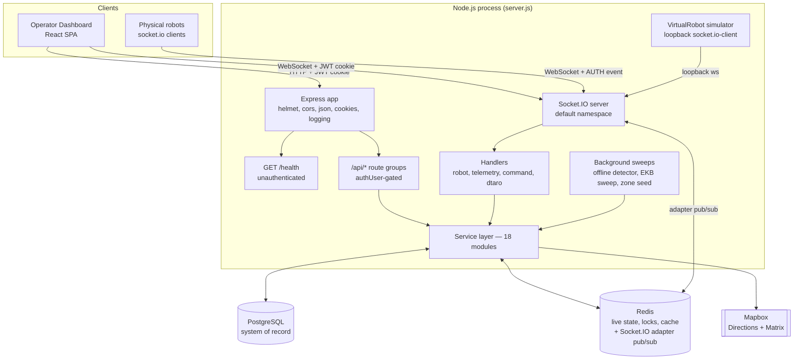

### Layering rules the code actually follows

- **Routes** declare paths, attach rate limiters, attach `authUser`. No logic.
- **Controllers** validate input (Zod on the newer endpoints), pull `prisma`/`kv`/`io` off `req.app.locals`, call a service, shape the JSON response. Wrapped in `asyncHandler` so rejections reach the error middleware.
- **Socket handlers** rate-limit, Zod-validate, verify `socket.data.isAuthed`, then call the same services.
- **Services** own all business logic and are transport-agnostic. They receive `prisma`, `kv`, and `io` as arguments rather than importing them — which is exactly what makes them unit-testable against the in-memory `kv` and a mock Prisma.
- **`cache/kv.js`** is the only module that talks to Redis for application state. The Socket.IO adapter is the one deliberate exception; it owns dedicated pub/sub connections.

### State ownership

| State | Authority | Mirror | Rationale |
| --- | --- | --- | --- |
| Robot identity, commissioning, location/campus assignment | PostgreSQL | — | Durable ownership metadata |
| Robot live position/speed/battery/status | Redis `robot:{id}` (15 s TTL) | PostgreSQL, throttled to ≥15 s | A row write per tick does not scale |
| DTARO registry state (utilization, zone, health, planned path, heartbeat) | Redis `registry:{id}` (30 s TTL) | `Robot.zoneId` on change only | Ephemeral, high-churn, rebuildable |
| Task record and status | PostgreSQL | — | Business record |
| Task route geometry + robot progress along it | Redis `taskPath:{taskId}`, `robotTaskState:{robotId}` (24 h TTL) | — | Rebuilt at boot by `taskRecovery` |
| Allocation lock | Redis `robotReserve:{id}` (30 s, `SET NX EX`) | — | Must be cross-process; fails closed |
| Obstacles | Redis `ekb:event:*` (5 min TTL) | `ObstacleEvent` table | TTL expiry *is* the intended lifecycle |
| Hot `Robot` row fields on the telemetry path | Per-process `robotStateCache` Map | PostgreSQL | Eliminates a per-tick `findUnique` |

### Graceful degradation policy

`cache/kv.js` distinguishes three Redis states and behaves differently in each:

1. **Not configured** (`REDIS_URL` empty or `REDIS_ENABLED=false`) — single-process operation is intentional, so the in-memory Map fallback (including a process-local reservation lock) is genuinely correct.
2. **Configured and reachable** — normal operation.
3. **Configured but unreachable** — cache-style reads/writes silently degrade to memory, a capped-exponential-backoff reconnect probe runs in the background (1 s → 30 s ceiling, `unref()`d), and **`reserveRobot` fails closed**: it throws a `503 LOCK_UNAVAILABLE` rather than hand out a process-local lock that two degraded replicas would both grant for the same robot.

The Socket.IO Redis adapter mirrors this policy with one loud exception: if the adapter cannot attach, the server logs a prominent warning and falls back to the single-process adapter. That is a real behaviour change (cross-worker broadcasts stop working), not a transparent degrade, which is why it is logged at warn level with an explicit explanation rather than swallowed.

---

## 5. Process Lifecycle — Startup and Shutdown

`Backend/server.js` is the only entrypoint. `npm start` and `npm run dev` both run `node server.js`.

### Startup sequence (exact order)

```mermaid
sequenceDiagram
    participant OS
    participant Server as server.js
    participant ELM as eventLoopMonitor
    participant Prisma
    participant KV as cache/kv.js
    participant Adapter as Redis adapter
    participant Sockets as socket.server.js
    participant Recovery as taskRecovery
    participant Sim as SimulationEngine

    OS->>Server: node server.js
    Server->>Server: require config/env (dotenv reads Backend/.env)
    Server->>ELM: start() perf_hooks histogram, resolution 20ms
    Server->>Server: require src/app (Express app built at import time)
    Server->>Server: http.createServer(app); new Server(io, cors isOriginAllowed)
    Server->>Prisma: connectPrismaWithRetry, 4 attempts, 3s apart
    Note over Prisma: DATABASE_URL patched with connect_timeout=30 at module load
    Server->>KV: initKv, connect or enter fallback plus backoff probe
    Server->>Adapter: if REDIS_URL set, pub and sub clients, await both ready
    Adapter-->>Server: io.adapter(createAdapter) or warn and stay single-process
    Server->>KV: banner probe, SET hb key EX 2, GET, DEL
    Server->>Server: app.locals = kv, prisma, io
    Server->>Sockets: initSocketServer(io, prisma, kv, logger)
    Note over Sockets: starts offline detector 10s, EKB sweep 60s, zone seeding
    Server->>Prisma: ensureAdminUser, idempotent upsert, skipped if creds absent
    Server->>Recovery: recoverActiveTasks, rebuild Redis task state from DB
    Server->>OS: server.listen(PORT, HOST)
    Server->>Sim: createVirtualRobotSimulator, stored on app.locals
    alt DISABLE_VIRTUAL_SIMULATOR=true
        Server->>Server: print benchmark-mode banner, stop here
    else default
        Server->>Sim: start()
        Server->>Prisma: findMany robots, updateMany isOnline=true lastSeenAt=now
        Server->>Sim: addRobot() per robot (re-hydration)
        Note over Server: setTimeout 5000ms
        Server->>Server: re-dispatch TASK_ASSIGN for ASSIGNED/IN_PROGRESS tasks
        Server->>Sockets: emit TASK_ASSIGNED to dashboard room per task
    end
```

Notable details:

- **`connect_timeout=30`** is appended to `DATABASE_URL` once at `db/prisma.js` module load if not already present. Serverless Postgres (Neon) can take seconds to wake from suspension; without this the first boot reliably failed with `P1001`. Combined with `retries=4, delayMs=3000`, worst-case startup wait is roughly two minutes.
- **Startup ordering matters.** `recoverActiveTasks` runs *before* `listen`, so Redis task state is rebuilt before any robot can reconnect. Simulator re-hydration runs *after* `listen` and asynchronously, so the HTTP server becomes ready without waiting on the fleet.
- **`EADDRINUSE` is fatal** with a specific operator-facing message, rather than an unhandled error.
- **Startup re-dispatch** hands `io` to `dispatchTaskAssign(io, robotId, payload)` so the re-sent `TASK_ASSIGN` is room-addressed and therefore worker-safe. This call previously omitted `io` and silently delivered nothing; see [§25, D1](#25-known-defects-and-limitations) for the failure mode and the guard that now makes that misuse loud.

### Shutdown sequence

`SIGINT` and `SIGTERM` both route to one `shutdown(signal)` function, which drains in this order:

1. Log a warning.
2. `virtualSimulator.stop()` — clears every robot tick timer and disconnects their client sockets.
3. `await new Promise(resolve => server.close(resolve))` — stop accepting new HTTP connections, drain in-flight ones.
4. `io.close()`.
5. Disconnect the Socket.IO adapter pub/sub clients.
6. `closeKv()` — clear the reconnect timer, then `redis.quit()` falling back to `disconnect()`.
7. `disconnectPrisma()`.
8. `process.exit(0)`, or `exit(1)` if any step threw.

**Windows caveat, discovered during benchmarking:** `child.kill("SIGTERM")` on Windows is not signal delivery — it is an abrupt `TerminateProcess()`, and none of the above runs. The benchmark harness works around this by opening an IPC channel and sending `{type: "shutdown"}`, which `benchmark/profiledServer.js` converts into a synthetic in-process `SIGTERM` emit. This matters beyond benchmarking: **on Windows, RobotX has no graceful shutdown path under external process termination.**

---

## 6. Request Lifecycle

### HTTP request lifecycle

```mermaid
sequenceDiagram
    participant C as Client
    participant H as helmet
    participant CO as cors delegate
    participant P as json + cookieParser
    participant L as request logger
    participant R as Router /api
    participant RL as rate limiter
    participant A as authUser
    participant Ctl as Controller
    participant S as Service
    participant E as errorHandler

    C->>H: HTTP request
    H->>CO: security headers set
    CO->>CO: isOriginAllowed(origin)
    Note over CO: missing Origin header is denied; non-browser callers<br/>are authenticated downstream regardless
    CO->>P: parse JSON body and cookies
    P->>L: logger.http(req), res.on finish logger.httpEnd
    L->>R: dispatch
    R->>RL: per-route limiter, in-process Map keyed ip+method+path
    RL-->>C: 429 when over limit
    RL->>A: under limit
    A->>A: token = cookie token, else Bearer header
    A->>A: jwt.verify plus UUID-shape check on decoded.id
    A->>S: prisma.user.findUnique(id), token must map to a live user
    A-->>C: 401 if any check fails
    A->>Ctl: req.user = id, email, role
    Ctl->>S: business call with prisma/kv/io from app.locals
    S-->>Ctl: result
    Ctl-->>C: JSON
    Ctl->>E: thrown error via asyncHandler
    E-->>C: message with err.status, or 500 Internal Server Error
```

**Middleware chain in `src/app.js`, in order:** `helmet()` → `cors({origin: corsOriginDelegate, credentials: true})` → `express.json()` → `cookieParser()` → request/response logger → `GET /health` (unauthenticated) → `app.use("/api", apiRoutes)` → `notFound` → `errorHandler`.

**Error handling.** `errorHandler` maps `err.status` to the response code, replaces the body message with a generic `"Internal Server Error"` for 500s so internals never leak to the client, and logs the first stack frame belonging to `/src/`. For 500s only, it additionally logs the first four stack lines joined by `|`.

### Socket connection lifecycle

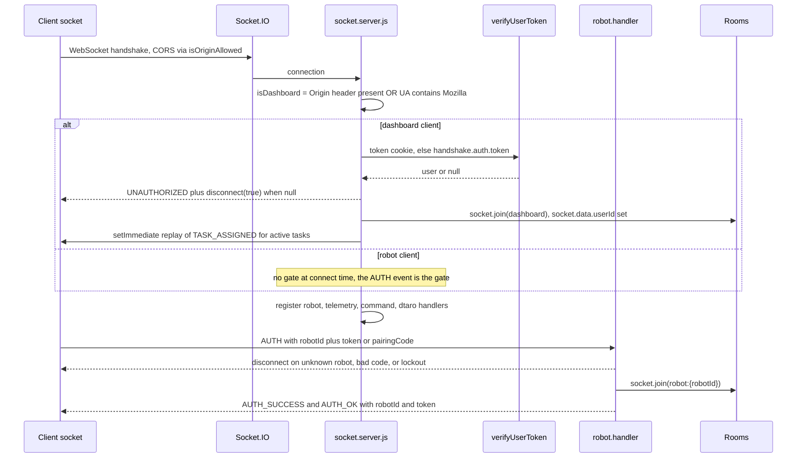

The dashboard/robot split is a **heuristic**, not an authenticated distinction: any connection presenting an `Origin` header or a `Mozilla`-containing User-Agent is treated as a dashboard candidate and must produce a valid JWT or be disconnected. Everything else falls through to the robot path, where the `AUTH` event is the real gate — no handler except `AUTH` does anything useful before `socket.data.isAuthed` is true.

---

## 7. Module Catalog

### 7.1 Entry and application shell

| Module | Responsibility | Key dependencies | Public surface |
| --- | --- | --- | --- |
| `server.js` | Process wiring, Redis adapter attach, admin bootstrap, task recovery, simulator boot, graceful shutdown | everything | entrypoint |
| `src/app.js` | Express app assembly, middleware chain, `/health` | `config/logger`, `config/cors`, `metrics.service`, `eventLoopMonitor`, `routes` | `app` |
| `src/routes/index.js` | Mounts the six route groups under `/api` | route modules | Express router |

### 7.2 Configuration

| Module | Contents |
| --- | --- |
| `config/env.js` | Side-effect-only `dotenv.config()` against `Backend/.env` |
| `config/cors.js` | `isOriginAllowed(origin)`, `corsOriginDelegate` — shared by Express CORS, Socket.IO CORS, and WebAuthn RP-ID resolution |
| `config/logger.js` | Dual-mode logger, see [§22](#22-observability) |
| `config/dtaro.constants.js` | `BATTERY_THRESHOLD = 20`, `CHARGING_INTERRUPT_BATTERY = 30` — one source of truth shared by `robotValidator.service.js` and `simulation/constants.js` |
| `config/liveness.constants.js` | `DB_FLUSH_INTERVAL_MS = 15_000`, `OFFLINE_CUTOFF_MS = 30_000`, `OFFLINE_SWEEP_INTERVAL_MS = 10_000`, `OFFLINE_SWEEP_BATCH = 500` |

The liveness invariant is load-bearing: **`DB_FLUSH_INTERVAL_MS < OFFLINE_CUTOFF_MS`**. Both TELEMETRY and HEARTBEAT throttle their `Robot.lastSeenAt` writes to the flush interval; the offline sweep marks a robot offline when `lastSeenAt` is older than the cutoff. If the cutoff were less than or equal to the flush interval, healthy robots would flap offline in the gap between two throttled writes. The current 2x margin tolerates one entirely missed flush.

### 7.3 Data access

| Module | Responsibility | Notes |
| --- | --- | --- |
| `db/prisma.js` | Lazily-constructed `PrismaClient` singleton, `connectPrismaWithRetry`, `disconnectPrisma` | Patches `connect_timeout=30` into `DATABASE_URL` at import |
| `cache/kv.js` | Redis facade: in-memory fallback, pipelining, batch reads, atomic counters, fail-closed reservations, background reconnect, health probe | The only application-state Redis client |
| `cache/robotStateCache.js` | `Map<robotId, {id, status, isOnline, lat, lon, battery}>` | Seeded at AUTH, updated by every writer of those columns; removes a per-tick DB read |

### 7.4 Middlewares

| Module | Responsibility |
| --- | --- |
| `auth_middleware.js` | `verifyUserToken(token)` — shared by REST and the socket dashboard gate — and `authUser`. Enforces a UUID-shape check on `decoded.id` before hitting the DB, and requires the user still to exist |
| `rateLimitHttp.js` | `createRateLimiter({windowMs, limit, keyPrefix})` — fixed-window counter in a process-local `Map`, keyed `prefix:ip:method:baseUrl+path`, opportunistic cleanup above 50 000 entries |
| `errorHandler.js` | Status mapping, message sanitisation for 500s, single-frame stack logging |
| `notFound.js` | `404 {message: "Not Found"}` |

### 7.5 Services — responsibilities and interactions

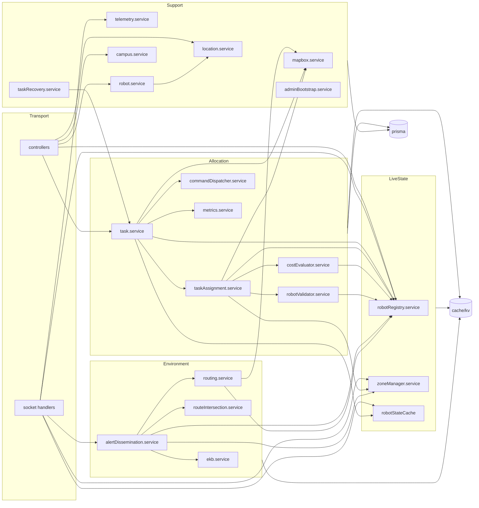

| Service | Responsibility | Public API |
| --- | --- | --- |
| `task.service` | Task creation, two-phase assignment orchestration, reservation retry loop, route computation, DB finalisation transaction, reroute | `assignTask`, `rerouteTask`, `straightLineRoute`, `getRoutesWithDistance` |
| `taskAssignment.service` | DTARO candidate pipeline: DB query, batched registry read, validation, Mapbox Matrix, cost evaluation, winner | `selectNearestRobot` |
| `costEvaluator.service` | The DTARO cost function with min-max normalisation | `computeCosts` |
| `robotValidator.service` | Per-candidate eligibility: online, IDLE or CHARGING-with-reserve, no current task, battery floor, no fault, socket/registry auth consistency | `validateRobot` |
| `robotRegistry.service` | Live-state facade over `registry:{robotId}`: single and batch reads, merge-writes, typed field updaters | `getRobotState`, `getManyRobotStates`, `setRobotState`, `mergeRobotState`, `buildMergedRegistryState`, `getAllRobotIds`, `markOnline`, `markOffline`, `updateTelemetry`, `updateZone`, `updatePlannedPath`, `updateUtilization`, `updateAssignedTask`, `updateHealthStatus`, `registryKey`, `REGISTRY_TTL` |
| `zoneManager.service` | Zone membership from coordinates, three-tier zone cache, socket zone rooms, zone-change side effects, default zone seeding | `getZoneForCoordinates`, `assignRobotToZone`, `applyZoneChangeSideEffects`, `invalidateZoneCache`, `seedDefaultZones` |
| `commandDispatcher.service` | Room-based, adapter-aware, retrying dispatch to a robot | `dispatch`, `dispatchTaskAssign`, `dispatchRerouteAlert` |
| `ekb.service` | Obstacle storage (Redis TTL primary, Postgres secondary, in-memory tertiary), active-set retrieval, expiry sweep | `storeObstacle`, `getActiveObstacles`, `sweepExpired` |
| `alertDissemination.service` | End-to-end obstacle pipeline: zone, EKB, dashboard alert, affected-robot computation, per-robot reroute alert and server-side replan | `processObstacleReport` |
| `routeIntersection.service` | Pure geometry: parametric segment intersection, path-vs-segment test, affected-robot filter | `segmentsIntersect`, `pathIntersectsSegment`, `findAffectedRobots` |
| `routing.service` | A* over the existing waypoint graph, Mapbox-backed replanning, in-task reroute write-back | `replanRoute`, `rerouteRobot` |
| `mapbox.service` | Directions and Matrix HTTP clients with GeoJSON parsing and typed errors | `directionsWithDistance`, `directionsPolyline`, `matrixDurationsToDestination` |
| `taskRecovery.service` | Boot-time rebuild of Redis task state for ASSIGNED/IN_PROGRESS tasks | `recoverActiveTasks` |
| `telemetry.service` | Single-purpose `Telemetry` row insert | `saveTelemetry` |
| `robot.service` | Commissioning validation and creation; filtered robot listing with location-descendant expansion | `commissionRobot`, `listRobots` |
| `location.service` | Recursive CTE descendant expansion with a JS BFS fallback, listing, idempotent creation | `collectDescendantLocationIds`, `listLocations`, `createLocation` |
| `campus.service` | Campus listing and creation | `listCampuses`, `createCampus` |
| `metrics.service` | Allocation event recording; `/health` system snapshot | `recordAllocation`, `getSystemMetrics` |
| `adminBootstrap.service` | Idempotent super-admin upsert from env credentials | `ensureAdminUser` |

### 7.6 How modules communicate

There are exactly four communication mechanisms in the backend, and no message broker or queue:

1. **Direct function calls with injected dependencies.** Controllers and handlers pass `prisma`, `kv`, and `io` explicitly into services. Services never reach for a global client. This is the dominant mechanism.
2. **Redis as shared state.** Cross-cutting state — live robot state, registry, locks, task routes, EKB — is exchanged through `cache/kv.js` keys rather than in-process references, which is what makes those flows survive a restart and, in principle, work across processes.
3. **Socket.IO rooms as an addressed bus.** `io.to("robot:{id}")`, `io.to("zone:{id}")`, `io.to("dashboard")`. With the Redis adapter attached these cross process boundaries; without it they are process-local.
4. **Two process-local Maps that are deliberately not shared:** `sockets/robotSockets.js` (robotId to live socket object, used where a real socket reference is needed) and `cache/robotStateCache.js` (hot DB fields). Both are correct only within one process, and the places that depend on `robotSockets` for *delivery* rather than *presence* are the system's clustering gaps — see [§25](#25-known-defects-and-limitations).

---

## 8. Database — PostgreSQL via Prisma

### 8.1 Schema overview

12 models, 8 enums, defined in `Backend/prisma/schema.prisma` and materialised by 7 migrations.

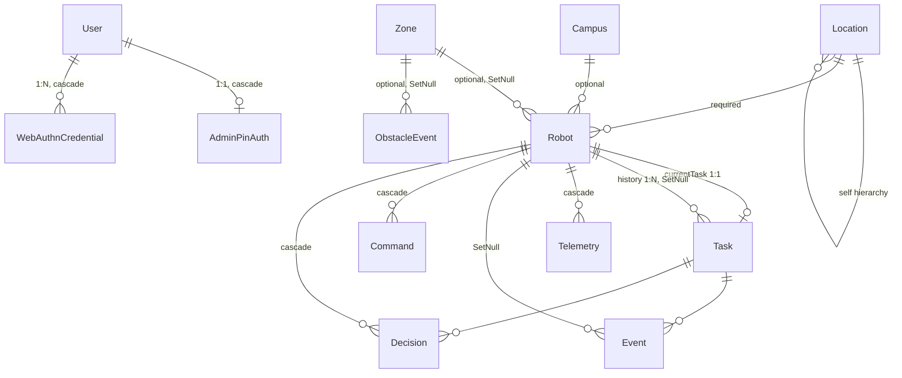

**Enums.** `RobotStatus` (IDLE, ACTIVE, PAUSED, OFFLINE, ERROR, ISSUES), `TaskStatus` (PENDING, ASSIGNED, IN_PROGRESS, COMPLETED, FAILED, CANCELLED), `CommandType` (STOP, PAUSE, RETURN, RESUME), `CommandStatus` (SENT, ACK, FAILED), `EventType` (INFO, WARNING, CRITICAL), `DecisionAction` (WAIT, REROUTE, CANCEL), `LocationType` (COUNTRY, STATE, CITY, AREA), `Role` (SUPER_ADMIN).

Note that `CHARGING` and `RETURNING` are **not** in `RobotStatus`. They are virtual-only labels the fleet reports; `telemetry.handler.js` maps `RETURNING → ACTIVE` and `CHARGING → PAUSED` for the DB write, while preserving the raw label in Redis and in the dashboard broadcast. Any code reading robot status must know which of the two representations it is looking at.

### 8.2 Model reference

| Model | Purpose | Notable fields | Indexes |
| --- | --- | --- | --- |
| `User` | Operator account | `email` unique, `password` bcrypt, `googleId` unique nullable, `role` | `User_email_key`, `User_googleId_key` |
| `AdminPinAuth` | Step-up PIN | `pinHash`, `userId` unique | `AdminPinAuth_userId_key` |
| `WebAuthnCredential` | Passkey | `credentialId` unique, `publicKey` base64url COSE, `counter` BigInt, `transports`, `deviceType`, `backedUp`, `lastUsedAt` | `credentialId` unique, `userId` |
| `Location` | Self-referencing geographic hierarchy | `type`, `slug` unique, `parentId`, `lat`, `lon` | `type`, `parentId`, unique `(name, parentId)` |
| `Campus` | Optional robot grouping | `code` unique, `centerLat/Lon` | `code` unique |
| `Zone` | DTARO rectangular sub-area | `name` unique, `minLat/maxLat/minLon/maxLon` | `name` unique |
| `Robot` | Fleet unit and durable live-state mirror | `robotId` unique, `name`, `locationId` (required), `campusId`, `zoneId`, `utilization`, `status`, `battery`, `isOnline`, `socketId`, `lastSeenAt`, `lat/lon/speed`, `currentTaskId` unique | `status`, `isOnline`, `lastSeenAt`, `locationId`, `(locationId, isOnline)`, `campusId`, `zoneId`, `(lat, lon)` |
| `Task` | Delivery job | `taskId` unique, `robotId`, `pickup/pickupLat/pickupLon`, `drop/dropLat/dropLon`, `distanceMeters`, `status`, `startedAt`, `completedAt` | `robotId`, `status` |
| `Telemetry` | Throttled history stream | `robotId`, `lat/lon/speed/battery`, `createdAt` | `(robotId, createdAt)` |
| `Event` | Notifications and audit log | `robotId?`, `taskId?`, `type`, `message` | `robotId`, `taskId`, `createdAt` |
| `Command` | Operator command with ACK tracking | `robotId`, `type`, `status`, `issuedAt`, `executedAt` | `robotId`, `issuedAt` |
| `Decision` | Operator decision modal record | `robotId`, `taskId?`, `reason`, `imageUrl?`, `action?`, `resolvedAt?` | `robotId`, `taskId` |
| `ObstacleEvent` | Durable obstacle record | `obstacleId` unique, `lat/lon`, `zoneId?`, `severity`, `reportingRobotId?`, `expiresAt` | `zoneId`, `expiresAt` |

### 8.3 Relationships worth understanding

- **`Robot.currentTaskId` is a `@unique` FK to `Task`, and `Task.robotId` is a separate FK back to `Robot`.** This is a deliberate strict-1:1 current-task binding layered on top of a 1:N history relation. The uniqueness constraint is the database-level guarantee that one task cannot be the current task of two robots. The application-level guarantee against one *robot* holding two tasks is the `currentTaskId != null` check inside the assignment transaction, plus the Redis reservation.
- **Cascade policy is asymmetric on purpose.** Deleting a robot cascades to `Telemetry`, `Command`, and `Decision` (pure per-robot data) but only nulls the FK on `Task` and `Event` (records that retain business/audit meaning without the robot).
- **`Location` is recursive.** `location.service.collectDescendantLocationIds` walks it with a PostgreSQL `WITH RECURSIVE` CTE and falls back to a JS breadth-first traversal if the raw query fails, so a non-Postgres provider still works (at N+1 cost).

### 8.4 Indexing strategy

The index set is shaped around three query patterns actually present in the code:

1. **The DTARO candidate query** — `WHERE status IN ('IDLE','PAUSED') AND isOnline = true AND currentTaskId IS NULL`. Served by `Robot_status_idx` and `Robot_isOnline_idx`.
2. **The offline sweep** — `WHERE isOnline = true AND lastSeenAt < cutoff`. Served by `Robot_isOnline_idx` and `Robot_lastSeenAt_idx`.
3. **Dashboard filtering** — by location subtree, campus, or zone. Served by `Robot_locationId_idx`, the composite `Robot_locationId_isOnline_idx`, `Robot_campusId_idx`, and `Robot_zoneId_idx`.

`Robot_lat_lon_idx` is a plain composite B-tree on `(lat, lon)`. It does **not** support radius or bounding-box search efficiently — there is no PostGIS and no spatial index. Nothing in the current query set requires one, because zone membership is computed in application code against cached rectangles rather than in SQL.

`Telemetry_robotId_createdAt_idx` serves the only read of that table: `GET /api/robots/:robotId/history`, which takes the most recent 50 rows.

### 8.5 Transactions

Exactly three interactive transactions exist:

1. **Assignment finalisation** (`task.service._finalizeAssignment`) — re-reads the robot inside the transaction, re-checks `currentTaskId == null` and `status ∈ {IDLE, PAUSED}`, updates the `Task` to `ASSIGNED` with its computed `distanceMeters`, and binds `Robot.currentTaskId` + `status = ACTIVE`. This is the last-line defence against a double-assignment that slipped past the Redis reservation.
2. **Task completion** (`dtaro.handler` `TASK_COMPLETE`) — conditionally marks the task `COMPLETED` (only if it belongs to this robot and is still `ASSIGNED`/`IN_PROGRESS`) and releases the robot to `IDLE` with `currentTaskId = null`, `speed = 0`.
3. **Task cancellation** (`tasks.controller.cancelTask`) — marks the task `CANCELLED` and, **only if the robot's `currentTaskId` still points at this exact task**, releases the robot. The `releasedRobotCode` variable derived inside the transaction gates every downstream side effect (STOP emit, Redis cleanup, dashboard event), so a cancel that races a completion cannot stop a robot that has already moved on.

Everything else is a single statement, and single statements are individually atomic. Notably, telemetry's throttled `robot.update` is deliberately **not** transactional — it is a best-effort durable mirror of state Redis already owns.

### 8.6 Persistence strategy — live vs. durable

The central design decision in this system is that **PostgreSQL is not on the telemetry hot path**.

| Write | Trigger | Frequency at 2 s tick |
| --- | --- | --- |
| `Robot` row update (TELEMETRY) | status transition, reconnect, ≥2 % battery delta, or 15 s elapsed | ~4/min/robot, not 30/min |
| `Robot.lastSeenAt` (HEARTBEAT) | 15 s elapsed | ~4/min/robot |
| `Telemetry` row insert | ≥15 s elapsed, or >10 m moved, or ≥2 % battery delta | variable; movement-driven |
| `Robot.zoneId` | zone boundary crossing only | rare |
| Task/Command/Event/Decision rows | business events | low |

Position freshness is carried entirely by Redis (`robot:{id}`, rewritten every tick). Movement alone deliberately does **not** force a `Robot` row flush — a moving robot covers more than 10 m almost every tick, so gating on distance would defeat the throttle entirely.

The durability contract this buys: after a crash, a robot's DB row may be up to 15 seconds stale in position and battery, but its `status`, `isOnline`, and task binding are correct, and `taskRecovery` rebuilds the rest from the DB plus a fresh Mapbox route.

---

## 9. Redis — Complete Key Map, TTLs, and Pipelining

### 9.1 The `kv` facade

Everything except the Socket.IO adapter goes through `cache/kv.js`, whose surface is:

| Method | Redis primitive | Fallback behaviour |
| --- | --- | --- |
| `set(key, value, {ex})` | `SET` / `SET … EX` | in-memory Map with TTL semantics |
| `get(key)` | `GET` | in-memory read with expiry check |
| `del(key)` | `DEL` | Map delete |
| `sadd/srem/smembers` | `SADD`/`SREM`/`SMEMBERS` | in-memory `Set` |
| `mget(keys)` | `MGET` — one round trip | sequential in-memory reads, same order/null semantics |
| `pipeline()` | `MULTI`-less pipeline; `.get()/.set()` builder, `.exec()` | sequential in-memory ops preserving order |
| `setManyEx(entries)` | pipelined `SET … EX` | sequential sets. **Currently has no callers** |
| `incr(key, {ex})` | `INCR` + `EXPIRE` | non-atomic read-modify-write (safe under single-threaded Node) |
| `reserveRobot(key, value, ttl)` | `SET … EX … NX` | **fails closed** when Redis is configured but unreachable |
| `releaseReservation(key)` | `DEL` | deliberately lenient — runs in `finally`, backed by the TTL |
| `health()` | — | `{redis, configured, reconnecting}` |

`pipeline()` is explicitly **not** a transaction. There is no `MULTI`, so commands can partially apply on a connection error exactly as independent calls can. It collapses round trips; it does not add cross-key atomicity. That distinction is what makes it safe to use on the telemetry path, where every key is independently owned by the same robot and partial application is already the pre-existing failure mode.

### 9.2 Complete key catalog

| Key | Type | TTL | Written by | Read by |
| --- | --- | --- | --- | --- |
| `robot:{robotId}` | JSON string | 15 s (30 s from `VirtualRobot.commission`) | `telemetry.handler`, `robots.controller.writeRobotLiveState`, `VirtualRobot.commission` | `task.service.readRobotLive`, `taskRecovery`, `robots.controller` (`mget` on list/state) |
| `registry:{robotId}` | JSON string | 30 s (`REGISTRY_TTL`) | `robotRegistry.setRobotState/mergeRobotState`, telemetry pipeline write | `getRobotState`, `getManyRobotStates`, offline sweep, `costEvaluator`, `robotValidator`, `alertDissemination` |
| `robots:all` | Set | none | AUTH (`robot.handler`), `writeRobotLiveState`, `VirtualRobot.commission`, `taskRecovery`; removed on disconnect, by the offline sweep, and on decommission | `getAllRobotIds` (EKB fan-out), `metrics.getSystemMetrics` |
| `session:{robotId}` | string | 86 400 s (`robot.handler`) / 604 800 s (`VirtualRobot`) | `robot.handler` AUTH, `VirtualRobot.commission` | `robot.handler` AUTH |
| `pairing:{robotId}` | 6-digit string | 300 s | `robots.controller.commissionRobotWithPairing` | `robot.handler` AUTH (deleted on success) |
| `pairingAttempts:{robotId}` | counter | 300 s | `robot.handler` (`INCR`) | `robot.handler` |
| `pairingLocked:{robotId}` | `"1"` | 3 600 s | `robot.handler` on 5th failure | `robot.handler` AUTH; cleared by `POST /:robotId/pairing/unlock` |
| `socket:{socket.id}` | robotId | 3 600 s | `robot.handler` AUTH | `robot.handler` disconnect |
| `snapshotState:{robotId}` | JSON `{t, lat, lon, battery}` | 86 400 s | telemetry pipeline | telemetry pipeline (snapshot throttle decision) |
| `vr:battery:{robotId}` | number string | 48 h | `VirtualRobot._maybePersistBattery`, telemetry pipeline | `VirtualRobot.commission` |
| `vr:batteryPersistAt:{robotId}` | ms timestamp | 48 h | telemetry pipeline | telemetry pipeline |
| `taskPath:{taskId}` | JSON `{toPickup, toDrop, pickup, drop}` | 86 400 s | `task.service.seedTaskKeys`, reroute, `taskRecovery`, `routing.rerouteRobot` | `server.js` startup re-dispatch, dashboard re-hydration, `rerouteTask`, `routing.rerouteRobot` |
| `robotTaskState:{robotId}` | JSON `{taskId, phase, pathIndex, waitUntil, segment, startedAt, parking}` | 86 400 s | `seedTaskKeys`, `taskRecovery`, `rerouteTask` | `rerouteTask`, `routing.rerouteRobot` |
| `robotTask:{robotId}` | taskId | 86 400 s | `seedTaskKeys`, `taskRecovery` | **no reader** — write and delete only |
| `task:{taskId}` | JSON `{phase, idx, waitUntil}` | 86 400 s | `seedTaskKeys` | **no reader** — write and delete only |
| `robotReserve:{robotId}` | taskId | 30 s (`RESERVATION_TTL_SEC`) | `kv.reserveRobot` (`SET NX EX`) | the `SET NX` itself; released in `finally` |
| `zones:all` | JSON array | 300 s | `zoneManager.loadZones` | `zoneManager.loadZones` |
| `ekb:event:{obstacleId}` | JSON | 300 s (`DEFAULT_TTL_SEC`) | `ekb.storeObstacle` | `ekb.getActiveObstacles`, `ekb.sweepExpired` |
| `ekb:obstacles` | Set | none (swept every 60 s) | `ekb.storeObstacle` | `getActiveObstacles`, `sweepExpired`, `metrics` |
| `metrics:allocation:{ms}` | JSON | 3 600 s | `metrics.recordAllocation` | **no reader** — no aggregation exists |
| `cmd:rt:{commandId}` | ms string | 86 400 s | `command.handler` on ACK | none in backend |
| `cmdretry:{commandId}` | counter string | 3 600 s | `robots.controller.sendRobotCommand` | same controller's retry scheduler |
| `webauthn:regChallenge:{userId}` | challenge | 300 s | `webauthn_controller.registerOptions` | `register` |
| `webauthn:authChallenge:{userId}` | challenge | 300 s | `webauthn_controller.authOptions` | `verify` |
| `health:{ms}`, `hb:{ms}` | `"1"` | 2 s | `/health`, startup banner probe | immediately, then deleted |

Additionally, `@socket.io/redis-adapter` maintains its own `socket.io#…` pub/sub channels on **separate dedicated connections**. Those are never touched through `kv`.

### 9.3 TTL strategy

Three distinct TTL philosophies coexist, each matched to what the key means:

- **Liveness TTLs (15–30 s)** — `robot:{id}` and `registry:{id}`. The TTL *is* the liveness signal: an expired key means "no telemetry recently". These are shorter than the offline cutoff so a stale key is always noticed before the sweep acts.
- **Session TTLs (5 min – 7 days)** — pairing codes (5 min), WebAuthn challenges (5 min), lockouts (1 h), socket bindings (1 h), robot sessions (24 h or 7 days depending on writer), battery snapshots (48 h). Chosen so the credential outlives its legitimate use window and no longer.
- **Work-state TTLs (24 h)** — `taskPath`, `robotTaskState`. Long enough that no realistic task outlives them; short enough that abandoned state self-cleans. These are also rebuilt from PostgreSQL at boot, so the TTL is a garbage-collection mechanism, not a correctness dependency.

The one deliberate no-TTL key, `robots:all`, is a membership set rather than a cache: it is maintained by explicit add/remove at the connection-lifecycle boundaries (AUTH adds, disconnect and the offline sweep remove), so it has no expiry to reason about. It was previously written only at commissioning and never pruned, which made it wrong in both directions — see [§25, D6](#25-known-defects-and-limitations).

### 9.4 The registry vs. live-state duplication

Two JSON documents per robot overlap substantially:

- `robot:{robotId}` — `{lat, lon, battery, status, speed, lastSeenAt, distanceTravelled}`
- `registry:{robotId}` — `{robotId, socketId, lat, lon, battery, status, speed, zoneId, utilization, plannedPath, healthStatus, authenticated, connected, assignedTaskId, etaSec, lastHeartbeat, updatedAt}`

The split is historical: `robot:{id}` is the dashboard/REST live-state key, `registry:{id}` is the DTARO control-plane key. Six fields are written twice per tick. Consolidating them is the single most obvious remaining Redis optimisation and has not been done.

### 9.5 Caching strategy

`zoneManager` implements the only genuine multi-tier cache:

```
in-process Map (60 s)  →  Redis zones:all (300 s)  →  PostgreSQL zone.findMany
```

with explicit invalidation (`invalidateZoneCache`) after zone seeding. This is why the telemetry hot path can call `getZoneForCoordinates` on every tick without a Redis round trip — at steady state the answer comes from process memory.

`robotStateCache` is a second, simpler in-process cache: hot `Robot` row fields keyed by `robotId`, seeded from the AUTH lookup that already had to happen, and kept coherent by every writer of `status`/`isOnline`/`lat`/`lon`/`battery` (`robot.handler` online/offline, telemetry flush, `dtaro.handler` TASK_COMPLETE and ROBOT_FAULT, `task.service` finalisation, `robots.controller` clear-fault and delete). Its purpose is exactly one thing: eliminating a `prisma.robot.findUnique` per telemetry frame.

### 9.6 Pipelining — what, where, and why

**Where pipelining is used:**

1. **`telemetry.handler` read batch** — one pipeline containing four `GET`s: `robot:{id}`, `snapshotState:{id}`, `registry:{id}`, `vr:batteryPersistAt:{id}`. All four are keyed only by `robotId` with no interdependency, so they can be fetched in one round trip.
2. **`telemetry.handler` write batch** — one pipeline accumulating up to four `SET`s: `robot:{id}` (always), `registry:{id}` (always), `snapshotState:{id}` (when a snapshot is due), `vr:battery:{id}` + `vr:batteryPersistAt:{id}` (every ~2 min). Flushed once at the end of the handler.
3. **`kv.mget`** — used by `robotRegistry.getManyRobotStates` (DTARO candidate fan-in) and by `robots.controller` for the `GET /api/robots` and `GET /api/robots/state` live-state overlay.
4. **`benchmark/dbReset.js`** — pipelined session-token seeding for the synthetic fleet.

**Why it was introduced.** Before pipelining, one telemetry frame issued roughly nine sequential Redis round trips: four independent `GET`s, plus `mergeRobotState`'s own read-modify-write, plus `assignRobotToZone`'s separate read-modify-write, plus the snapshot and battery writes — four separate read-modify-write cycles against the *same* `registry:{robotId}` key on the *same* tick. CPU profiling at 500 concurrently-active robots (`benchmark/results/profile-500/profile-summary.txt`) put ioredis's per-command machinery among the top JS frames — `Commander.js` at 3.5 % and `sendCommand` at 2.3 % of non-library ticks, with `Socket._writeGeneric` at 2.0 % and 52 % of all ticks inside `ntdll.dll` (syscall/IO wait). The cost was not Redis itself; it was the per-command socket write and await, multiplied by fleet size and tick rate.

**How the registry collapse was achieved.** `mergeRobotState` was split into an I/O half and a pure half. `buildMergedRegistryState(robotId, rawValue, computeFn)` does the merge with no I/O, so the telemetry handler can feed it the value it already fetched in the batched read and queue the resulting `SET` into the batched write. Zone membership was folded into the same `computeFn`, and `applyZoneChangeSideEffects` was split out of `assignRobotToZone` so the expensive branch (Postgres write, room join/leave, `ZONE_UPDATED` broadcast) runs **only on an actual zone crossing**, which is rare by construction.

**Trade-offs accepted:**

- **No atomicity.** A pipeline that fails midway can leave some keys written and others not. This is the same exposure the previous independent calls had, so nothing regressed — but it means no invariant may span two keys in one pipeline. None does.
- **Read-modify-write is still not atomic.** `buildMergedRegistryState` reads at time T and writes at T+ε. Two concurrent writers to one robot's registry could lose an update. In practice a robot has exactly one socket and therefore one writer, so this is theoretical; it would become real if a second concurrent registry writer were ever introduced.
- **Latency batching.** The write pipeline is flushed once at the end of the handler, so a write issued early in the handler is not visible to Redis until the handler completes. Nothing within the handler re-reads its own writes.
- **Debuggability.** A pipeline failure surfaces as one rejected `exec()` rather than a specific failing command. The handler swallows it under the same degrade-gracefully policy as before.

**Measured result.** See [§23](#23-performance-engineering): at 500 robots, `POST /api/tasks/assign` p50 went from 6 984 ms to 19 ms, `GET /api/robots/state` p50 from 8 720 ms to 59 ms, and Prisma pool wait from 158.97 ms to 0.01 ms.

---

## 10. Socket.IO — Rooms, Events, Auth, Cross-Worker Routing

### 10.1 Namespaces

There are **no custom namespaces**. Everything runs on the default `/` namespace. Separation between dashboard clients and robots is achieved entirely with rooms and per-socket state, not namespaces.

### 10.2 Rooms and naming

| Room | Members | Joined by | Purpose |
| --- | --- | --- | --- |
| `dashboard` | Authenticated operator browsers | `socket.server.js` after JWT verification | All operator-facing broadcasts |
| `robot:{robotId}` | Exactly one robot socket | `robot.handler` after AUTH success | Addressed, worker-safe delivery to one robot |
| `zone:{zoneId}` | Robots currently inside a zone | `zoneManager.updateSocketZoneRoom` on zone change | Zone-scoped broadcast (room is maintained; nothing currently broadcasts to it) |

Socket.IO also implicitly places every socket in a room named after its own socket id; the code never uses that.

`robot:{robotId}` is the important one. It exists so that *any* worker process can address *any* robot without holding its socket object, by going through the adapter rather than a local Map.

### 10.3 Authentication

**Dashboard sockets.** On `connection`, `socket.server.js` classifies the socket as a dashboard candidate if the handshake carries an `Origin` header **or** a User-Agent containing `Mozilla`. Dashboard candidates must present a JWT — extracted from the `token` cookie in the handshake headers, falling back to `handshake.auth.token` for non-cookie clients — which is verified by the same `verifyUserToken` the REST middleware uses. Failure results in an `UNAUTHORIZED` emit followed by `disconnect(true)`. Success sets `socket.data.userId` and joins the `dashboard` room.

**Robot sockets.** No gate at connect time. The `AUTH` event is the gate:

```mermaid
sequenceDiagram
    participant R as Robot
    participant H as robot.handler
    participant DB as Postgres
    participant KV as Redis

    R->>H: AUTH {robotId, token?, pairingCode?}
    H->>H: rate limit 5 per 60s, min 100ms
    H->>H: zod validate; disconnect on failure
    H->>DB: robot.findUnique(robotId)
    DB-->>H: row or null
    H-->>R: disconnect if unknown robot
    H->>H: seed robotStateCache from this row
    H->>KV: GET session:{robotId}, GET pairing:{robotId}
    alt token matches stored session
        H->>KV: refresh session TTL to 24h
    else pairing path
        H->>KV: GET pairingLocked:{robotId}
        H-->>R: disconnect if locked
        H->>H: compare pairingCode to stored code
        H->>KV: INCR pairingAttempts on mismatch; lock at 5
        H-->>R: disconnect on mismatch
        H->>H: mint crypto.randomUUID session token
        H->>KV: SET session:{robotId} EX 24h
    end
    H->>H: replace previous socket in local map
    H->>KV: SET socket:{socket.id} = robotId EX 1h
    H->>DB: robot.update isOnline=true socketId lastSeenAt
    H->>H: disconnect previous socket if different
    H->>KV: DEL pairing + pairingAttempts on first pairing
    H-->>R: AUTH_SUCCESS and AUTH_OK {robotId, token}
    H->>H: io.to(dashboard).emit(robot_online)
    H->>H: socket.join(robot:{robotId})
    H->>KV: markOnline registry write
    H->>H: zone assignment from last known position
```

The ordering here is deliberate: the DB row is updated to point at the **new** socket id *before* the previous socket is disconnected, so a reconnect race cannot leave the DB pointing at a socket that is already gone.

### 10.4 Complete event map

**Robot → server**

| Event | Rate limit | Validation | Handler |
| --- | --- | --- | --- |
| `AUTH` | 5 / 60 s, min 100 ms | Zod `{robotId: string, token?, pairingCode?}` passthrough | `robot.handler` |
| `TELEMETRY` / `telemetry` | 50 / 5 s, min 100 ms | Zod with numeric-string coercion, passthrough | `telemetry.handler` |
| `HEARTBEAT` / `heartbeat` | 10 / 5 s, min 100 ms | none | `robot.handler` |
| `OBSTACLE_REPORT` | 10 / 60 s, min 500 ms | Zod `{lat, lon, severity?}` | `dtaro.handler` |
| `TASK_COMPLETE` | 5 / 30 s, min 1 000 ms | `taskId` string coercion | `dtaro.handler` |
| `ROBOT_FAULT` | 5 / 60 s, min 1 000 ms | Zod `{code?, message?, sensor?}` | `dtaro.handler` |
| `COMMAND_ACK` | 20 / 60 s, min 100 ms | Zod `{commandId: string}` | `command.handler` |
| `assign_task` | none | none | `socket.server.js` — legacy operator path |

**Server → robot**

| Event | Emitted by | Delivery mechanism |
| --- | --- | --- |
| `AUTH_SUCCESS` / `AUTH_OK` | `robot.handler` | direct `socket.emit` |
| `AUTH_REQUIRED` | `telemetry.handler` when a frame arrives pre-AUTH | direct `socket.emit` |
| `TASK_ASSIGN` | `task.service` via `commandDispatcher` | `io.to("robot:{id}")` — **worker-safe** |
| `REROUTE_ALERT` | `task.service` reroute, `alertDissemination` | `io.to("robot:{id}")` — **worker-safe** |
| `STOP` | `tasks.controller.cancelTask` via `dispatchStop` | `io.to("robot:{id}")` — **worker-safe**, no retry |
| `COMMAND` | `robots.controller.sendRobotCommand` via `dispatchCommand` | `io.to("robot:{id}")` — **worker-safe**, no retry |
| `OBSTACLE_REPORT_ACK`, `TASK_COMPLETE_ACK`, `ROBOT_FAULT_ACK`, `ERROR` | `dtaro.handler` | direct `socket.emit` |
| `UNAUTHORIZED` | `socket.server.js` dashboard gate | direct `socket.emit` |

**Server → dashboard room** (all via `io.to("dashboard").emit`)

| Event | Emitted by | Meaning |
| --- | --- | --- |
| `robot:update` | `telemetry.handler`, every accepted frame | The canonical live-state event |
| `ROBOT_UPDATE` | `robots.controller` on commission/pairing | Legacy alias, different payload shape |
| `ROBOT_UPDATED` | `dtaro.handler` ROBOT_FAULT, `robots.controller` clear-fault | Fault state change |
| `ROBOT_COMMISSIONED` | `robots.controller.commissionRobot` | New marker on the map |
| `robot_online` / `robot_offline` | `robot.handler` AUTH / disconnect | Presence |
| `robot_unregistered` | `telemetry.handler` when the DB row is gone | Robot deleted mid-session |
| `TASK_CREATED` | `task.service.assignTask` phase 1 | PENDING card appears immediately |
| `TASK_ASSIGNED` | `task.service` finalisation, dashboard re-hydration, startup re-dispatch | Route overlay payload |
| `TASK_UPDATED` | finalisation, cancel, complete, reroute, failure | Task state machine transitions |
| `task_assigned` / `task_error` | legacy `assign_task` socket path | Legacy operator flow |
| `ALERT_CREATED` | `alertDissemination` | New obstacle |
| `REROUTE_ALERT` | `alertDissemination` | Per-robot reroute, mirrored to operators |
| `ZONE_UPDATED` | `zoneManager.applyZoneChangeSideEffects` | Robot crossed a zone boundary |
| `COMMAND_STATUS` | `command.handler` on ACK | Command acknowledged with response time |

### 10.5 Reconnect behaviour

**Robots.** The client sets `reconnection: true` with `reconnectionAttempts: Infinity` and a 3 s → 10 s backoff (`VirtualRobot`; the benchmark worker uses 5 attempts, 1.5 s → 8 s). On reconnect the robot re-sends `AUTH` with its stored session token. The server treats a matching session token as the reconnect path: it refreshes the token TTL, replaces the socket in the local map, updates `socketId` in Postgres, disconnects the stale socket, and re-joins `robot:{id}`. The robot also re-sends `AUTH` whenever it receives `AUTH_REQUIRED`, which is what the telemetry handler emits if a frame arrives on an unauthenticated socket — so a robot that reconnects and starts streaming before re-authenticating self-heals within one tick.

**Dashboards.** The browser socket is a module-level singleton reused across Vite HMR (`Frontend/src/lib/socket.js`). On reconnect it re-runs the handshake with the JWT cookie, is re-gated, re-joins `dashboard`, and receives a `setImmediate` replay of `TASK_ASSIGNED` for every currently `ASSIGNED`/`IN_PROGRESS` task whose `taskPath:{taskId}` is still in Redis. That replay is what makes route overlays survive a page reload or a mid-session connect.

**Disconnect handling.** Two `disconnect` listeners are registered per socket. `socket.server.js` logs it. `robot.handler` performs the real work, guarded three ways so that a stale socket's disconnect cannot mark a freshly reconnected robot offline: it resolves the bound robotId (from `socket.data` or the `socket:{id}` Redis key), deletes that key, checks the DB `socketId` still equals this socket, checks the local map still points at this socket, and only then marks the robot offline in Postgres and the registry and emits `robot_offline`.

### 10.6 The Redis adapter and cross-worker communication

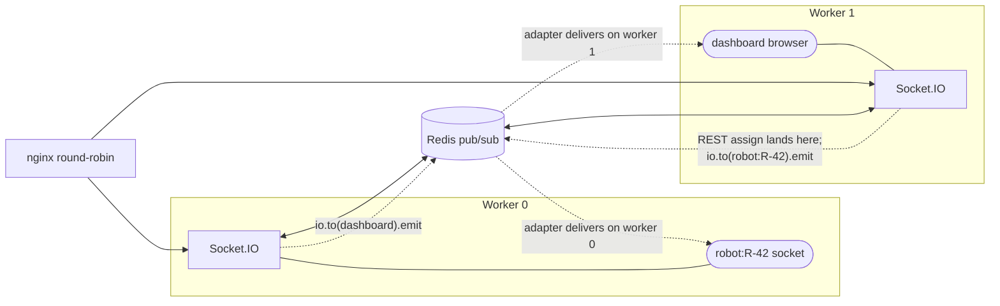

`server.js` attaches the adapter with two dedicated `ioredis` connections (a publisher and its `.duplicate()` subscriber), awaiting `ready` on both before calling `io.adapter(createAdapter(pub, sub))`. If either fails, it logs a deliberately loud warning explaining that cross-worker dashboard broadcasts will silently stop working, and continues on the default in-memory adapter.

`commandDispatcher.service` is the piece that actually depends on this. Its `dispatch(io, robotId, event, payload)`:

1. Calls `await io.in("robot:{robotId}").fetchSockets()` — an **adapter-aware** presence check that sees sockets on other workers, unlike `getRobotSocket()`'s local Map.
2. If the room is empty, backs off (1 s, then 2 s) and retries, up to `MAX_RETRIES = 2` additional attempts.
3. On success, `io.to(room).emit(event, payload)` and returns `{dispatched: true, socketId, attempts}`.
4. If the room is still empty after all attempts, returns `{dispatched: false}` — the payload is dropped. Real robots are expected to reconnect and pick state back up through task recovery.

`dispatchRerouteAlert` uses `retries: 1` because rerouting is time-sensitive and a stale reroute is worse than none.

**Every server-to-robot message now goes through this dispatcher.** `dispatchTaskAssign`, `dispatchRerouteAlert`, `dispatchCommand` (operator commands), and `dispatchStop` (task cancellation) are the complete set. `POST /api/robots/:robotId/command` and `tasks.controller.cancelTask` previously emitted through `getRobotSocket()`'s process-local Map and were therefore silently broken under clustering ([§25, D3/D4](#25-known-defects-and-limitations)); both were converted.

`getRobotSocket()` survives only for **presence and identity** checks inside one process, where that is exactly the right semantics: `robotRegistry` uses it to compute the `connected` flag, `robotValidator` to detect a socket/registry auth desync, and `robot.handler` to replace a superseded socket on reconnect. Nothing uses it to deliver a payload.

`dispatch()` also validates that its first argument really is a Socket.IO server before doing anything, returning `{dispatched: false, error: "NO_IO_SERVER"}` and logging at error level otherwise. Without that check, calling the older two-argument form degraded into an indistinguishable "robot appears offline" — which is precisely how D1 stayed invisible.

### 10.7 Rate limiting mechanism

`sockets/rateLimit.js` implements a two-part limiter per socket per event:

- **Hard minimum spacing** (`minIntervalMs`) tracked in a module-level `Map` keyed `socketId:event`, with opportunistic cleanup of entries older than 60 s once the map exceeds 50 000 entries.
- **Fixed-window counter** (`limit` per `windowMs`) stored on `socket.data.__rl`, which dies with the socket and needs no cleanup.

Both are process-local. Under clustering, a robot that reconnects to a different worker gets a fresh budget, and the effective global limit is `N_workers ×` the configured limit.

### 10.8 Backpressure

`telemetry.handler` checks `socket.conn.transport.ws.bufferedAmount` against `SOCKET_BUFFER_LIMIT_BYTES` (default 1 000 000) at the very top of the handler and drops the frame outright if the transport is backed up. This is flood protection for a robot whose downlink has stalled: dropping a telemetry frame costs nothing, because the next one arrives in 2 seconds with fresher data.

---

## 11. HTTP API — Every Route Group

All application routes are mounted under `/api`. `GET /health` is the one exception and sits outside it, unauthenticated.

### 11.1 `GET /health` (public)

Returns, in a single response:

```jsonc
{
  "server": "ok",
  "redis": "ok" | "fail",          // live SET/GET/DEL probe with 2s TTL
  "db": "ok" | "fail",             // SELECT 1
  "uptime": 1234,                  // seconds
  "eventLoopDelay": { "minMs":…, "meanMs":…, "p50Ms":…, "p95Ms":…, "p99Ms":…, "maxMs":… },
  "prismaPool": {                  // from prisma.$metrics.json()
    "connectionsOpen":…, "connectionsBusy":…, "connectionsIdle":…,
    "queriesWaitAvgMs":…, "queriesWaitCount":…
  },
  "timestamp": 1700000000000,
  "robots":    { "total":…, "online":…, "active":…, "idle":…, "issues":… },
  "tasks":     { "total":…, "pending":…, "inProgress":…, "completed":…, "failed":… },
  "obstacles": { "active":… }
}
```

Every sub-probe is individually try/caught, so a Redis outage degrades the response rather than failing it. Note the cost: three Redis commands, one `SELECT 1`, two `groupBy` aggregations, two `SMEMBERS`, and a `$metrics` call — all reachable without authentication. See [defect D8](#25-known-defects-and-limitations).

### 11.2 `/api/auth`

| Method | Path | Auth | Rate limit | Behaviour |
| --- | --- | --- | --- | --- |
| POST | `/login` | public | 10/min | bcrypt compare, 7-day JWT in an HttpOnly cookie |
| POST | `/google` | public | 10/min | Verifies a Google ID token; requires `email_verified`; **never creates an account** — 403 if the email is unknown; links `googleId` on first use |
| POST | `/logout` | public | — | Clears the cookie with matching attributes |
| GET | `/me` | `authUser` | — | Current user `{id, email, role}` |
| POST | `/change-password` | `authUser` | — | Requires `currentPassword`; re-hashes at cost 10 |
| POST | `/pin-auth` | `authUser` | — | Step-up PIN check; bcrypt, with transparent migration of legacy plaintext PINs via `crypto.timingSafeEqual` then re-hash |
| POST | `/webauthn/register-options` | `authUser` | 20/min | Generates registration options; stores challenge in Redis for 300 s |
| POST | `/webauthn/register` | `authUser` | 20/min | **Re-checks the PIN**, then verifies the attestation and persists the credential |
| POST | `/webauthn/auth-options` | `authUser` | 20/min | Generates assertion options; 404 if no passkey registered |
| POST | `/webauthn/verify` | `authUser` | 20/min | Verifies the assertion, enforces counter advance, updates `counter` + `lastUsedAt` |
| GET | `/webauthn/status` | `authUser` | — | `{registered, count}` |

### 11.3 `/api/robots` — `router.use(authUser)` applies to every route

| Method | Path | Rate limit | Behaviour |
| --- | --- | --- | --- |
| GET | `/` | — | DB list filtered by `campusId`, or `locationId` with optional recursive descendant expansion, plus `isOnline`/`status`; overlaid with live Redis state via one `MGET` |
| GET | `/state` | — | Full fleet with `campus`, `location`, `currentTask` included, ordered by online-then-recency, same Redis overlay |
| GET | `/:robotId/history` | — | Most recent 50 `Telemetry` rows |
| POST | `/commission` | 30/min | Zod-validated. Creates the robot if new, updates commissioning fields if it exists, then mints a 6-digit pairing code (`crypto.randomInt`) with a 300 s TTL and seeds live state |
| POST | `/` | 30/min | Legacy commissioning. Creates the robot, seeds Redis, emits `ROBOT_UPDATE` + `ROBOT_COMMISSIONED`, and auto-starts a `VirtualRobot` for it |
| POST | `/:robotId/pairing/unlock` | 60/min | Admin override: deletes `pairingLocked` and `pairingAttempts` |
| POST | `/:robotId/command` | 60/min | Validates `type ∈ {STOP, PAUSE, RETURN, RESUME}`, persists a `Command` row, emits `COMMAND` to the robot, and schedules a reliability check every 5 s up to 2 retries before marking `FAILED` |
| POST | `/:robotId/clear-fault` | 60/min | The only path out of `ERROR`/`healthStatus: FAULT`. Rejects with 409 if the robot is not actually in a fault state. Recovers to `ACTIVE` if a task is still bound, else `IDLE`; writes an `Event` row |
| DELETE | `/:robotId` | 10/min | Deletes the row (cascading telemetry/commands/decisions), clears the cache entry, removes `robot:{id}` and the `robots:all` membership, and stops the `VirtualRobot` |

### 11.4 `/api/tasks` — `router.use(authUser)`

| Method | Path | Rate limit | Behaviour |
| --- | --- | --- | --- |
| GET | `/` | — | Up to 250 tasks, newest first, optionally filtered by `status` and by `robotId` (resolved to the internal id; an unknown robot yields a deliberate `__none__` sentinel so the query returns empty rather than everything) |
| POST | `/assign` | 60/min | Creates the `PENDING` task and returns immediately; DTARO runs in the background — see [§14](#14-task-assignment--dtaro) |
| POST | `/:taskId/cancel` | 120/min | Idempotent for terminal tasks; otherwise transactional cancel + conditional robot release + STOP + Redis cleanup |
| POST | `/:taskId/reroute` | 30/min | Recomputes the active leg from the robot's live position |

### 11.5 `/api/locations`, `/api/campuses`, `/api/simulator` — all `router.use(authUser)`

| Method | Path | Behaviour |
| --- | --- | --- |
| GET | `/api/locations` | Cascading-dropdown semantics: no `parentId` returns roots (`parentId IS NULL`), otherwise children of that parent; optional `type` filter |
| POST | `/api/locations` | Idempotent create — returns the existing row on `(name, parentId)` collision, including on a race |
| GET | `/api/locations/:id/descendants` | Recursive CTE descendant id list |
| GET/POST | `/api/campuses` | List / create with required `code`, `name`, `centerLat`, `centerLon` |
| GET | `/api/simulator/status` | Full simulator snapshot including every virtual robot's state |
| POST | `/api/simulator/start` / `/stop` / `/reset` | Engine lifecycle; 503 if the simulator was never initialised |
| PATCH | `/api/simulator/config` | Reserved — the handler is a no-op |

### 11.6 Authentication, authorization, and validation posture

**Authentication** is uniform: every `/api` route group applies `authUser`, either router-wide (`robots`, `tasks`, `locations`, `campuses`, `simulator`) or per-route (`auth`, so that login/logout stay public). `authUser` accepts a `token` cookie or an `Authorization: Bearer` header, with the cookie taking precedence.

**Authorization does not exist as a distinct layer.** `Role` has one value. `authUser` attaches `req.user` and never checks `role`. Any authenticated session can commission robots, decommission them, assign and cancel tasks, and drive the simulator. The step-up PIN/passkey ceremonies are enforced by the *frontend* before it issues destructive calls; the backend exposes `pin-auth` and `webauthn/verify` as verification endpoints but does not require a recent step-up on the destructive endpoints themselves.

**Validation** is mixed by vintage. Newer surfaces use Zod schemas (`commissionRobotWithPairing`, `sendRobotCommand`, every socket event payload). Older ones use hand-rolled `toStringOrNull`/`toNumberOrNull` coercion with explicit `err.status` throws (`robot.service.commissionRobot`, `campus.service`, `location.service`, `task.service.assignTask`). Both styles produce the same `{message}` error shape via `errorHandler`.

---

## 12. Background Services

Five things run on their own schedule inside the process. There is no scheduler abstraction; each is a `setInterval` or a `setTimeout` started during boot.

| Process | Where started | Interval | Guard | What it does |
| --- | --- | --- | --- | --- |
| **Offline detector** | `socket.server.startOfflineDetector` | 10 s | module flag `offlineSweepStarted` | Backstop offline detection — see below |
| **EKB expiry sweep** | `socket.server.startDtaroSweep` | 60 s | module flag `dtaroSweepStarted`; timer `unref()`d | Removes obstacle ids from `ekb:obstacles` whose `ekb:event:{id}` key has expired |
| **Zone seeding** | `socket.server.startDtaroSweep` | once at boot | idempotent (`zone.count() > 0` short-circuit) | Creates four quadrant zones around the first campus's centre, `±0.005°` (~550 m) per quadrant, then invalidates the zone cache |
| **Virtual robot ticks** | `VirtualRobot.start` | 2 s per robot | timer `unref()`d | Full simulation tick — see [§20](#20-simulator) |
| **Command reliability check** | `robots.controller.sendRobotCommand` | 5 s, self-rescheduling | max 2 retries, then `FAILED` | Re-emits `COMMAND` if the row is still `SENT` |

Additionally, `task.service.assignTask` schedules the entire DTARO pipeline via `setImmediate`, and the dashboard re-hydration replay is also `setImmediate` — both are one-shot deferrals rather than recurring services, but they are the reason the corresponding HTTP/socket responses are fast.

### The offline detector in detail

This is the subtlest background service, because the introduction of the DB flush throttle made a stale `Robot.lastSeenAt` column insufficient evidence that a robot is gone.

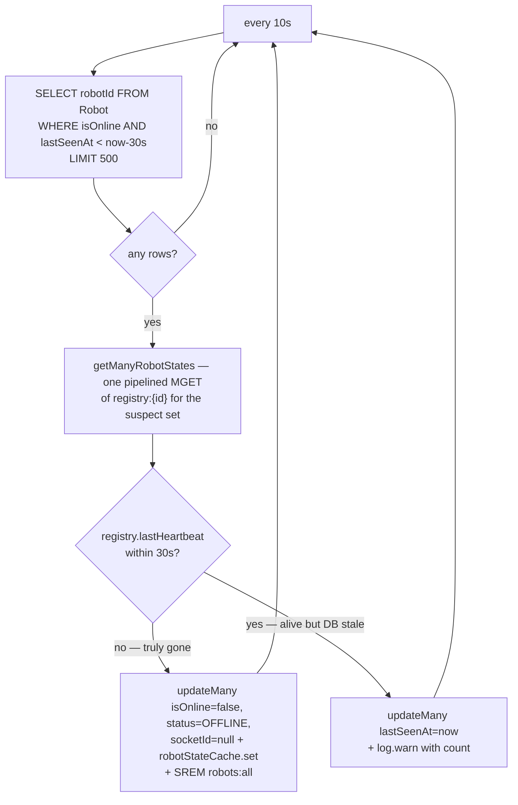

Three properties worth noting:

- **It is a backstop, not the primary signal.** A robot that disconnects normally is marked offline immediately by the `disconnect` handler. The sweep only catches process kills, half-open TCP connections, and lost networks — so its 10 s latency is not user-visible in the common case. Because it is the path taken exactly when the disconnect handler never ran, it must perform the same cleanup the handler would: clearing `socketId` and removing the robot from `robots:all`, not just flipping `isOnline`.
- **Its cost scales with the number of *suspect* robots, not fleet size.** The DB query filters to already-stale rows and caps at 500 per pass.
- **The reconcile branch is an alarm.** A sustained non-zero `"robots live in registry but stale in DB"` warning count means the flush gate is not keeping up, and is the intended signal to investigate before robots start flapping.

With Redis unavailable, the sweep degrades to pure DB-column behaviour, which is still safe precisely because of the `DB_FLUSH_INTERVAL_MS < OFFLINE_CUTOFF_MS` invariant.

---

## 13. Telemetry System

This is the highest-volume path in the system: one frame per robot per 2 seconds, plus a `HEARTBEAT` on the same tick.

### 13.1 The pipeline

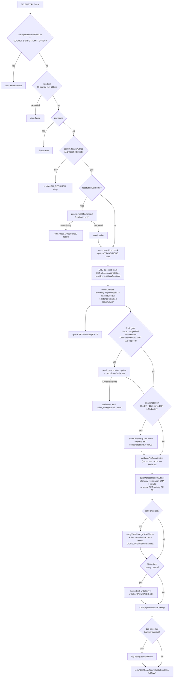

### 13.2 Validation

The Zod schema is intentionally permissive (`.passthrough()`), because robot firmware may add fields. It coerces numeric strings to numbers and empty strings to `null` via a preprocessor, and coerces `robotId`/`status` to strings. A parse failure drops the frame silently — a malformed frame from a robot is not an error condition worth logging at fleet scale.

Beyond schema validation there is a **status transition table**. Incoming status is checked against `INCOMING_STATUS` (which additionally permits the virtual-only `RETURNING` and `CHARGING`), mapped to a DB-safe value (`RETURNING → ACTIVE`, `CHARGING → PAUSED`), and then validated against `TRANSITIONS[currentStatus]`. An unmodeled jump is logged at warn level and the status update is dropped — but the rest of the frame (position, battery, speed) is still processed. The raw incoming label is what goes to Redis and to the dashboard; only the DB write uses the mapped value.

Critically, **the frame's own `robotId` field is never trusted**. The handler uses `socket.data.robotId`, bound only by a successful `AUTH`. A robot cannot report telemetry on behalf of another robot.

### 13.3 Throttling — three independent gates

| Gate | Threshold | Protects |
| --- | --- | --- |
| Rate limit | 50 frames / 5 s, ≥100 ms apart | The handler itself |
| Postgres flush gate | status change ∨ reconnect ∨ ≥2 % battery delta ∨ 15 s elapsed | `Robot` row write volume |
| Snapshot gate | 15 s elapsed ∨ >10 m moved ∨ ≥2 % battery delta | `Telemetry` insert volume |
| Battery persistence | 120 s elapsed | `vr:battery` write volume |
| Debug log sample | 10 s per robot (`TELEMETRY_LOG_SAMPLE_MS`) | Log volume |

The flush-gate state (`lastDbFlushAt`) and log-sample state (`lastTelemetryLogAt`) are module-level `Map`s bounded by fleet size, not by tick rate. The parallel `HEARTBEAT` gate in `robot.handler` (`lastHeartbeatDbFlushAt`) additionally performs opportunistic cleanup above 50 000 entries.

The heartbeat gate exists because of a specific trap: `VirtualRobot._tick()` emits `HEARTBEAT` and `TELEMETRY` on the *same* tick. Before the heartbeat path was throttled, it issued an unconditional `robot.update` per beat — 30 writes/robot/minute — completely defeating the telemetry handler's reduction to ~4/min. Aggregate write volume had not dropped; it had merely moved handlers.

### 13.4 Persistence

- **Redis, every tick:** `robot:{id}` with a 15 s TTL — the authoritative live position.
- **Redis, every tick:** `registry:{id}` with a 30 s TTL — telemetry fields plus the utilization EMA plus zone membership, in one merged write.
- **Postgres, gated:** the `Robot` row.
- **Postgres, gated:** a `Telemetry` history row.
- **Redis, every ~2 min:** the battery snapshot, so a robot's charge level survives a restart.

`distanceTravelled` is handled two ways: `VirtualRobot` sends the value directly and is trusted; a real robot has it accumulated server-side from consecutive haversine deltas, with a 500 m per-tick sanity ceiling to reject GPS jumps.

### 13.5 Utilization EMA

Inside the registry merge:

```
isActive = (status === "ACTIVE") ? 1 : 0
util' = clamp(util + 0.05 × (isActive − util), 0, 1)
```

With α = 0.05 at a 2 s tick, the time constant is ~40 s — a robot that goes fully active reaches ~63 % utilization after about 40 seconds. This value feeds DTARO's `U` cost term live, so allocation genuinely prefers robots that have been idle recently.

### 13.6 Dashboard updates

Exactly **one** event per accepted frame: `io.to("dashboard").emit("robot:update", fullState)`.

This was previously a global `io.emit` plus two legacy aliases (`ROBOT_UPDATE`, `robot_update`) plus an extra DB query. The global emit was an O(N²) fan-out at fleet scale — every robot socket received every other robot's telemetry, for which it has no use. Scoping to the `dashboard` room and deleting the aliases removed two redundant emissions and one query per tick and changed the fan-out from `robots × robots` to `robots × dashboards`.

### 13.7 Per-tick cost, per active robot (current implementation)

| Resource | Cost |
| --- | --- |
| Redis round trips | **2** (one pipelined read of 4 keys, one pipelined write of 2–4 keys) |
| Postgres queries | **0** in the common case; 1 `UPDATE` roughly every 15 s; 1 `INSERT` when a snapshot is due |
| Socket emissions | **1**, to the dashboard room only |
| Zone lookups | 1, served from an in-process 60 s cache |
| Log lines | 0 at `LOG_LEVEL=info`; 1 per robot per 10 s at `debug` |

---

## 14. Task Assignment — DTARO

DTARO (Dynamic Task Allocation and Robot Orchestration, as the codebase uses the term) is the multi-criteria allocation pipeline in `task.service` + `taskAssignment.service` + `costEvaluator.service` + `robotValidator.service`.

### 14.1 The two-phase design

`POST /api/tasks/assign` returns in the time it takes to `INSERT` one row. Everything expensive — DTARO selection, up to six Mapbox calls, the finalisation transaction, dispatch — happens in a `setImmediate` continuation after the response is already on the wire.

```mermaid
sequenceDiagram
    participant Op as Operator
    participant Ctl as tasks.controller
    participant TS as task.service
    participant TA as taskAssignment
    participant RV as robotValidator
    participant CE as costEvaluator
    participant KV as Redis
    participant MB as Mapbox
    participant DB as Postgres
    participant CD as commandDispatcher
    participant R as Robot

    Op->>Ctl: POST /api/tasks/assign
    Ctl->>TS: assignTask(prisma, body, {kv, io})
    TS->>TS: validate pickup/drop + coords; mint TSK-{ms}-{rand}
    TS->>DB: task.create status=PENDING
    TS->>Op: emit TASK_CREATED to dashboard
    TS-->>Ctl: return PENDING task
    Ctl-->>Op: 200 {ok:true, task}

    Note over TS: setImmediate — background phase
    loop attempt 0..2
        TS->>TA: selectNearestRobot({pickup, excludeRobotIds})
        TA->>KV: getZoneForCoordinates(pickup) — 3-tier cache
        TA->>DB: findMany status IN (IDLE,PAUSED), isOnline, currentTaskId NULL, take 100
        TA->>KV: getManyRobotStates — ONE pipelined MGET
        TA->>RV: validateRobot per candidate (uses prefetched liveState)
        TA->>MB: Matrix durations, batched 24 origins
        TA->>CE: computeCosts(candidates, weights, pickupZoneId)
        CE->>KV: getRobotState per candidate (N individual GETs — see D9)
        CE-->>TA: costs with D,B,U,T,Z components
        TA-->>TS: winner {robotId, start, cost, components}
        TS->>KV: reserveRobot(robotReserve:{id}, taskId, 30s) SET NX EX
        alt reservation won
            TS->>TS: break out of retry loop
        else lost to a concurrent assignment
            TS->>TS: push robotId to excludeRobotIds, retry
        end
    end
    TS->>DB: robot.findUnique — re-check commissioned, unbound, online
    TS->>KV: readRobotLive robot:{id} for the freshest start position
    TS->>MB: Directions x2 legs, profiles driving→walking→cycling
    TS->>DB: TRANSACTION re-check + task ASSIGNED + robot ACTIVE/currentTaskId
    TS->>TS: robotStateCache.set(status ACTIVE)
    TS->>KV: seedTaskKeys — taskPath, task, robotTask, robotTaskState (24h)
    TS->>Op: emit TASK_ASSIGNED + TASK_UPDATED to dashboard
    TS->>KV: updatePlannedPath + updateAssignedTask on the registry
    TS->>CD: dispatchTaskAssign(io, robotId, payload)
    CD->>R: io.to(robot:{id}).emit(TASK_ASSIGN) — retries 2x on empty room
    TS->>KV: recordAllocation metrics
    TS->>KV: releaseReservation in finally
```

If the background phase throws anywhere, the catch marks the task `FAILED` in Postgres and emits `TASK_UPDATED {status: "FAILED"}`.

### 14.2 The cost function

```
C(r) = w₁·D(r) + w₂·(1 − B(r)) + w₃·U(r) + w₄·T(r) + w₅·Z(r)
```

| Term | Meaning | Source | Weight |
| --- | --- | --- | --- |
| `D` | Haversine distance robot→pickup, min-max normalised across the candidate set | computed in `taskAssignment` | `w₁ = 0.50` |
| `B` | Battery, inverted as `1 − battery/100` | registry live value, DB fallback, else 100 | `w₂ = 0.30` |
| `U` | Utilization EMA | registry | `w₃ = 0.15` |
| `T` | Mapbox Matrix travel duration, min-max normalised | Matrix API; `null → 0` | `w₄ = 0.05` |
| `Z` | Zone-locality penalty: `0` if the robot is in the pickup's zone, `1` otherwise; `0` for everyone when the pickup's zone is unknown | registry `zoneId`, DB fallback | `w₅ = 0.05` |

`w₁…w₄` sum to 1 and are the original DTARO weights. `w₅` is layered additively on top rather than consuming budget from the others, making zone locality a tiebreaker-style nudge rather than a re-tuning of the base formula.

`normalize()` returns a uniform `0.5` for every candidate when all values are equal, which is both the divide-by-zero guard and the semantically right answer (no candidate is better on that axis).

### 14.3 Validation (eligibility)

`robotValidator.validateRobot` rejects in this order, returning a human-readable reason for the DTARO allocation log:

1. `!isOnline` → "Robot is offline"
2. Effective status is `CHARGING` (Redis says `CHARGING`, or DB `PAUSED` + Redis `CHARGING`):
   - rejected outright unless `allowCharging` (the allocation path passes `true`)
   - battery must be ≥ `max(batteryThreshold, CHARGING_INTERRUPT_BATTERY)` = 30 %, so a charging robot is only interrupted if it has enough charge to actually complete work
   - must have no `currentTaskId`
3. DB status ≠ `IDLE` → rejected with the actual status
4. `currentTaskId` set → "Robot already has an active task"
5. Battery < `BATTERY_THRESHOLD` (20 %) → rejected
6. `registry.healthStatus === "FAULT"` → rejected
7. A live socket exists but `registry.authenticated === false` → rejected as a desync guard

The `liveState` parameter lets the caller pass a pre-fetched registry entry, which is how the batched `getManyRobotStates` read avoids one Redis round trip per candidate.

### 14.4 Reservation and retry

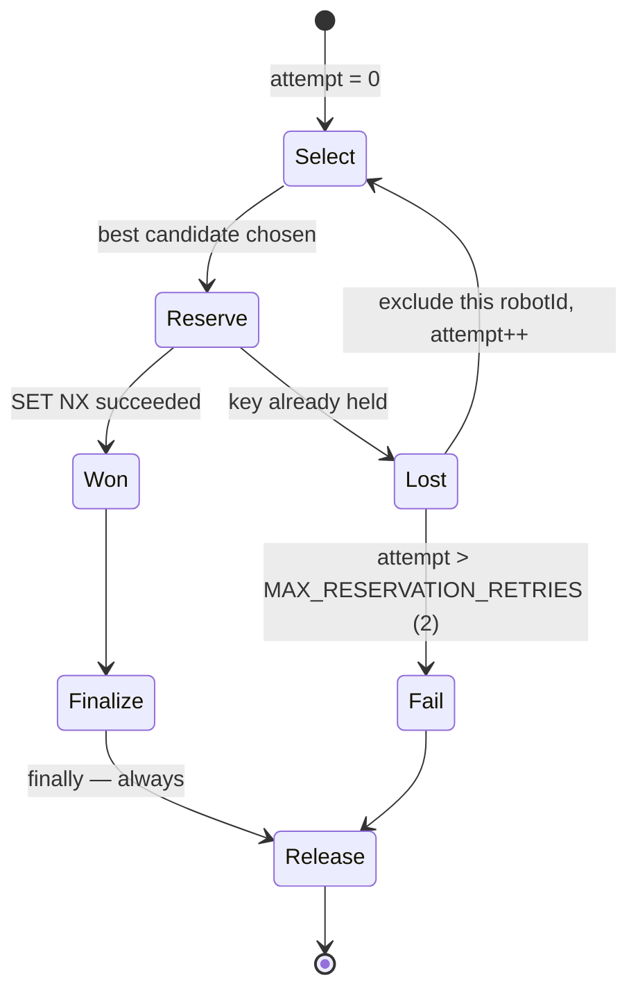

- **Key:** `robotReserve:{robotId}`, value = `taskId`, `SET … EX 30 NX`.
- **Retry budget:** `MAX_RESERVATION_RETRIES = 2`, so up to three selection attempts, each excluding every previously-lost candidate.
- **Release:** in a `finally`, on every path including failure, so a reservation never outlives its request. The 30 s TTL is the last-resort backstop for a process crash between reserve and release.
- **Fail-closed:** if Redis is configured but unreachable, `reserveRobot` throws `503 LOCK_UNAVAILABLE` instead of granting a process-local lock. Halting allocation is a recoverable business problem — orders queue and retry. Double-assigning a physical vehicle is not.
- **Manual assignment** (`robotId` supplied in the request body) reserves that exact robot and does not retry: there is no "next candidate" when the caller named one.

### 14.5 Dispatch — room-based and worker-safe

`dispatchTaskAssign(io, robotId, payload)` → `io.in("robot:{robotId}").fetchSockets()` for presence, then `io.to(room).emit("TASK_ASSIGN", {...payload, timestamp})`, with two backed-off retries (1 s, 2 s) if the room is empty. Because both operations go through the Socket.IO adapter, this works whether or not the REST request landed on the worker that owns the robot's connection.

### 14.6 Route computation

`getRoutesWithDistance({from, pickup, drop})` tries Mapbox profiles in order — `driving`, then `walking`, then `cycling` — computing both legs in parallel per profile. The first profile where both legs succeed wins. It stitches the seam by overwriting `toDrop[0]` with the last point of `toPickup`, so the two rendered polylines join exactly at the pickup marker. If every profile fails, it falls back to a 100-point straight-line interpolation per leg and flags `usedFallback: true`; distance is then computed by summing consecutive haversine segments.

### 14.7 Observability of allocation

`logger.dtaro({candidates, results, rejected, winner})` prints, in development, a per-candidate table with the cost, all five components, and a bar; plus every rejection with its reason; plus the winner. In production it collapses to one pino line with the winner and candidate count. `metrics.recordAllocation` writes `metrics:allocation:{ms}` with the cost, components, and selection latency — though nothing currently reads those keys ([defect D7](#25-known-defects-and-limitations)).

---

## 15. Robot Lifecycle

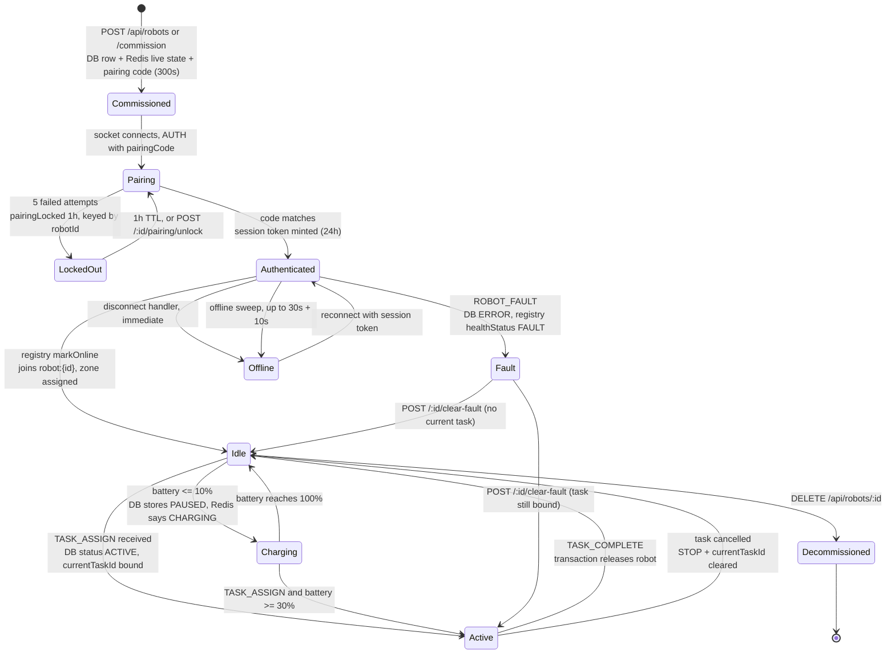

Two details that are easy to get wrong:

- **`CHARGING` is a Redis-only status.** The DB column says `PAUSED`. `robotValidator` reconstructs the real state by checking both, which is why its charging branch tests `effectiveStatus === "CHARGING" || (dbStatus === "PAUSED" && liveStatus === "CHARGING")`.
- **`ERROR` has exactly one exit.** `ROBOT_FAULT` sets `Robot.status = ERROR` and `registry.healthStatus = FAULT` and nothing clears them automatically. `POST /api/robots/:robotId/clear-fault` is the only path back, it rejects with 409 if the robot is not actually in a fault state, and it recovers to `ACTIVE` rather than `IDLE` when a task is still bound — so recovery does not silently orphan an in-flight task.

---

## 16. Task Lifecycle

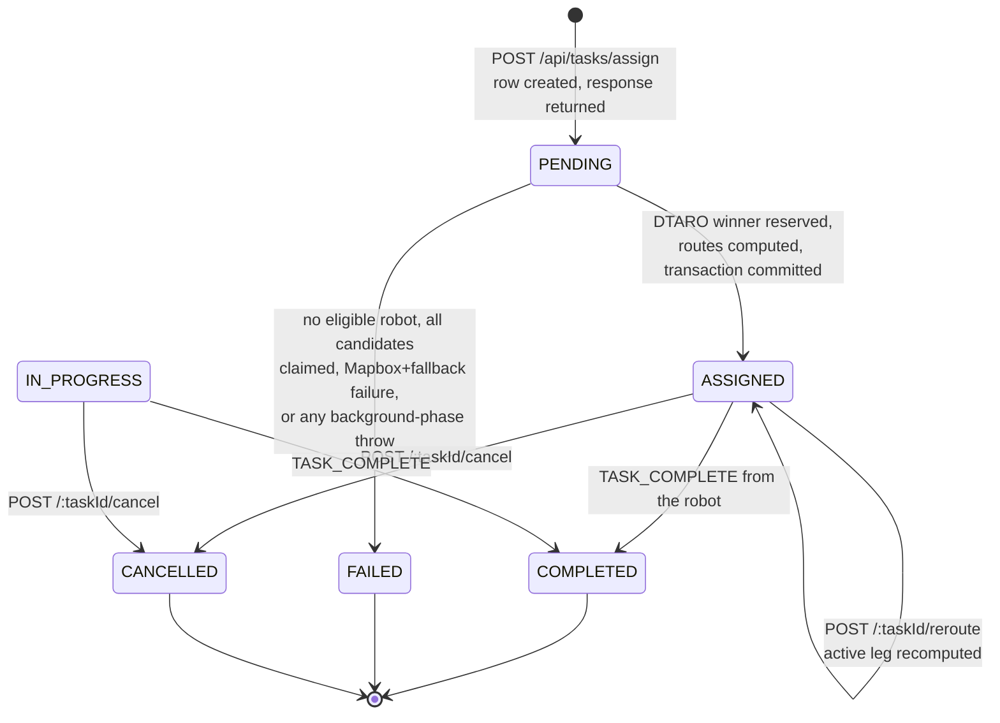

**A note on `IN_PROGRESS`.** The enum defines it and both the recovery query and the completion/cancel guards accept it, but **no code path ever writes it**. Tasks go `PENDING → ASSIGNED → COMPLETED`. `Task.startedAt` is likewise never written. This is a modelled-but-unimplemented state, not a bug that breaks anything — the guards that accept it are correctly defensive.

**Cancellation semantics** are the most carefully written part of this lifecycle. The transaction marks the task `CANCELLED`, then re-reads the robot and releases it **only if `robot.currentTaskId === task.id`**. The resulting `releasedRobotCode` gates every downstream effect: the `STOP` emit, the deletion of `taskPath`/`task`/`robotTaskState`/`robotTask`, the registry `updateAssignedTask(null)` and `updatePlannedPath(null)`, and the `TASK_UPDATED` broadcast. Cancelling an already-terminal task is a no-op that returns the current row.

**Reroute** determines the active leg from `robotTaskState.phase`/`segment`, recomputes just that leg from the robot's live position through the same three-profile Mapbox ladder, writes the new geometry back into `taskPath:{taskId}`, resets `pathIndex` to 0, emits `TASK_UPDATED {action: "REROUTED", segment, newPath}` to the dashboard, and sends `REROUTE_ALERT` to the robot's room.

---

## 17. Recovery Flow

RobotX recovers from a restart in four independent stages, each covering a different piece of lost state.

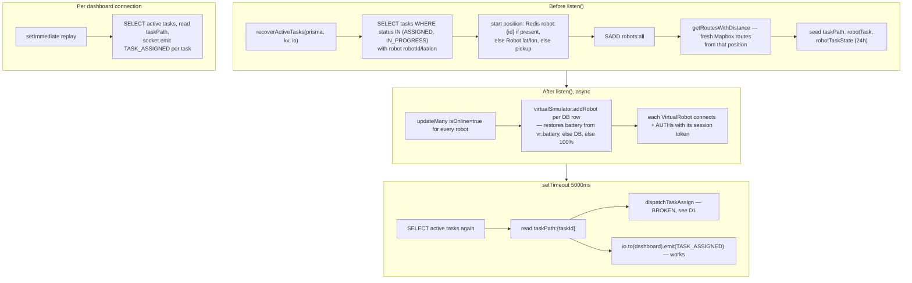

**Why the start position matters.** `recoverActiveTasks` prefers the Redis live position over the DB column, because Redis was written on the last tick before shutdown while the DB column may be up to 15 s stale. It then computes a *fresh* route from that position rather than restoring the old one — so `path[0]` is approximately where the robot actually is. `VirtualRobot._onTaskAssign` exploits this: it snaps to the nearest waypoint on the received path, which for a fresh assignment means teleporting onto the road network, and for a restart resume means continuing from where it left off rather than backtracking to the route start.

**What is not recovered:** in-flight `PENDING` tasks whose background assignment phase was interrupted by the restart. They stay `PENDING` forever — nothing re-drives them. `Command` rows in `SENT` state likewise have no boot-time retry; only the in-process 5-second scheduler, which dies with the process.

**Robustness of the individual stages.** Each task in `recoverActiveTasks` is independently try/caught for both route generation and Redis seeding, so one unroutable task cannot abort recovery for the rest. The whole call is wrapped in a try/catch in `server.js` that logs and continues — a total recovery failure does not prevent the server from starting.

---

## 18. Dashboard Flow

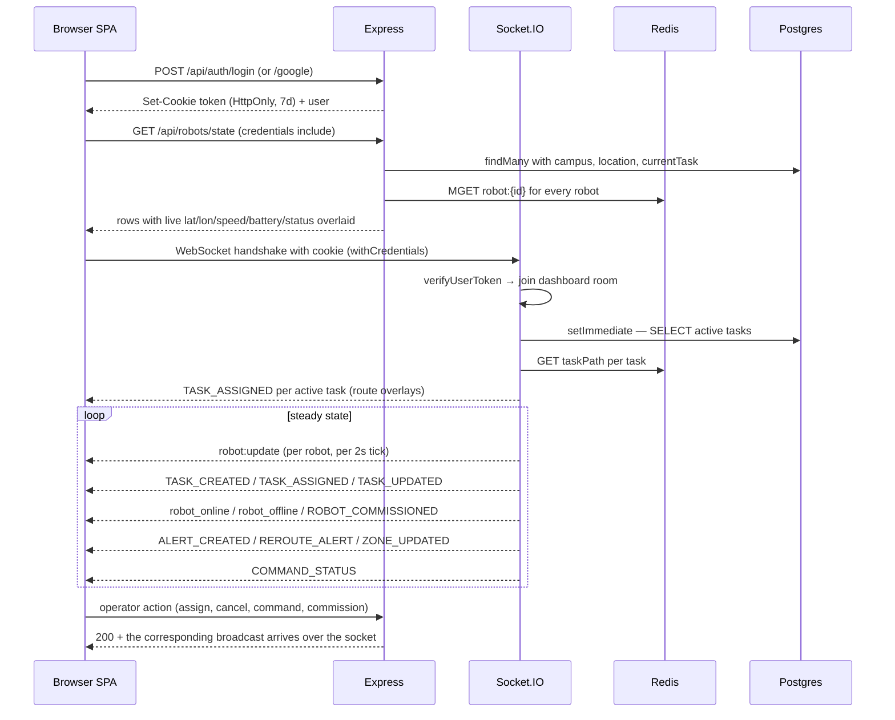

**Initial load is REST; steady state is sockets.** `GET /api/robots/state` is the only place the full fleet is materialised, and it merges the DB rows with a single pipelined `MGET` of every `robot:{id}` key so the first paint already shows live positions rather than 15-second-stale DB columns.

**The frontend subscribes to exactly three socket events for the map** (`Frontend/src/features/maps/mapControl/hooks/useRobotStream.js`): `robot:update`, `ROBOT_COMMISSIONED`, and the `TASK_ASSIGNED`/`TASK_UPDATED` pair for route overlays. The other dashboard events feed the notifications menu, the task list, and the decision modal.

**Broadcast volume.** One `robot:update` per active robot per 2 s, delivered to every socket in the `dashboard` room. At 1 000 robots this is ~500 events/s per dashboard client — which the benchmark confirms is delivered in full at that tier (`dashboardBroadcastPerSec: 498.2` against `telemetryMsgPerSec: 495.72`). There is no server-side coalescing, batching, or viewport filtering; every dashboard receives every robot's update regardless of what is on screen. That is the next fan-out ceiling after the ingest ceiling.

---

## 19. Obstacle Detection, EKB, and Rerouting

```mermaid
sequenceDiagram
    participant R as Reporting robot
    participant H as dtaro.handler
    participant AD as alertDissemination
    participant ZM as zoneManager
    participant EKB as ekb.service
    participant KV as Redis
    participant DB as Postgres
    participant RI as routeIntersection
    participant RT as routing.service
    participant Aff as Affected robots
    participant Dash as Dashboard

    R->>H: OBSTACLE_REPORT {lat, lon, severity}
    H->>H: rate limit 10 per 60s, min 500ms; zod validate; require authed
    H->>AD: processObstacleReport
    AD->>ZM: getZoneForCoordinates — 3-tier cache
    AD->>EKB: storeObstacle
    EKB->>KV: SET ekb:event:{id} EX 300 + SADD ekb:obstacles
    EKB->>DB: ObstacleEvent.create (best-effort)
    AD->>Dash: ALERT_CREATED
    AD->>KV: SMEMBERS robots:all
    AD->>KV: getRobotState per id (N individual GETs)
    AD->>RI: findAffectedRobots(states, blockStart, blockEnd)
    Note over RI: obstacle modelled as a ~22m diagonal segment;<br/>each consecutive plannedPath pair tested by<br/>parametric segment intersection
    loop per affected robot
        AD->>Aff: io.to(robot:{id}).emit(REROUTE_ALERT)
        AD->>Dash: REROUTE_ALERT mirrored
        AD->>RT: rerouteRobot
        RT->>KV: GET robotTaskState + taskPath
        RT->>RT: replanRoute — mark waypoints within 30m blocked,<br/>A* over the waypoint graph (k=6 nearest)
        RT->>RT: if A* fails, fresh Mapbox Directions from current position
        RT->>KV: write new leg back into taskPath, updatePlannedPath
        RT->>Dash: TASK_UPDATED {action REROUTED}
    end
    H-->>R: OBSTACLE_REPORT_ACK {obstacleId, affectedRobots, timestamp}
```

**The EKB is TTL-first by design.** Redis is the primary store with a 300 s expiry, PostgreSQL is a durable secondary written best-effort (a failure there is swallowed), and an in-memory `Map` is the tertiary fallback when Redis is down. The `ekb:obstacles` Set is the index; because Set members do not expire with the keys they point at, `getActiveObstacles` prunes dangling ids as it reads and the 60 s sweep prunes them proactively.

**Intersection testing is exact, not radius-based.** `segmentsIntersect` is the standard cross-product parametric test on raw lat/lon (valid at campus scale), treating parallel segments as non-intersecting. A robot is "affected" only if some consecutive pair of its `plannedPath` waypoints genuinely crosses the obstacle segment — so a robot passing 50 m away is not rerouted.

**A\* operates on the existing path as a graph**, not on a spatial grid: nodes are indices into the current waypoint array, edges connect each node to its 6 nearest geographic neighbours excluding blocked ones, `g` is haversine distance and `h` is haversine-to-goal. If nothing within 30 m of the obstacle is blocked, the original path from the current index is returned unchanged. If A* finds no route, the code falls back to a fresh Mapbox Directions call from the current position.

**Cost characteristics.** `neighbors(i)` maps over the entire waypoint array, computes a haversine to every other point, sorts, and slices — so A* is roughly `O(n² log n)` in path length. Mapbox `overview=full` routes routinely have hundreds of points. This runs off the telemetry hot path (only on an obstacle report affecting that specific robot), but it is a synchronous CPU burst on the event loop, and `alertDissemination` runs all affected robots' replans concurrently via `Promise.allSettled`.

**The fan-out is `robots:all`-shaped**, which makes the correctness of that index load-bearing for safety rather than merely for metrics: a robot absent from the Set is never considered for rerouting, however directly its path crosses the obstacle. The index is now maintained at the connection-lifecycle boundaries (AUTH adds; disconnect and the offline sweep remove) rather than only at commissioning — see [§25, D6](#25-known-defects-and-limitations) for what it used to miss.

The fan-out is still **un-batched**: `getAllRobotIds` reads the Set and then issues one `getRobotState` per member, even though `getManyRobotStates` exists. At fleet scale one obstacle report costs N Redis round trips. This is the largest un-batched read remaining in the codebase ([D9](#25-known-defects-and-limitations)).

---

## 20. Simulator

The simulator exists so the full stack can be exercised — auth, rate limits, validation, telemetry, allocation, obstacles, recovery — without physical hardware. Critically, **it is not a mock**: `VirtualRobot` is a real `socket.io-client` that connects over the network loopback to the same server and speaks the identical wire protocol.

### 20.1 Architecture

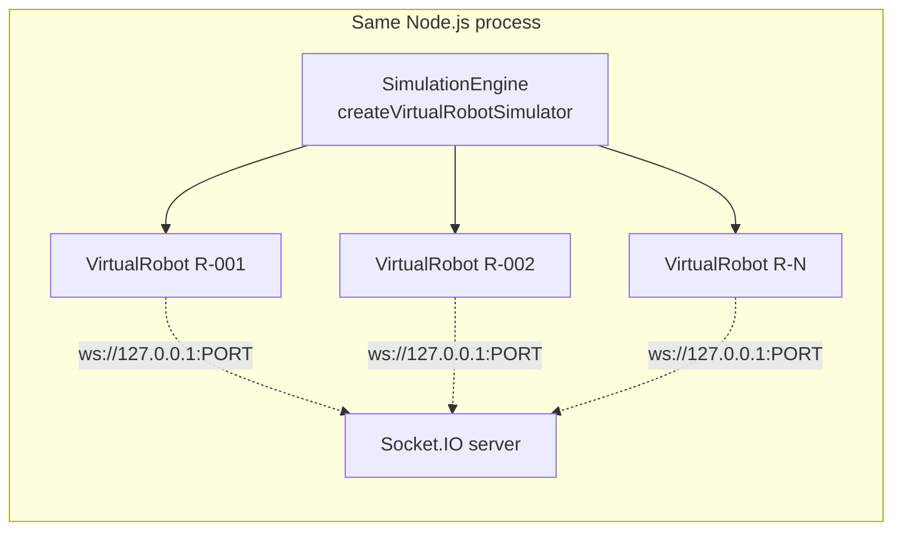

`SimulationEngine` is a closure-based factory exposing `start`, `stop`, `reset`, `addRobot`, `removeRobot`, `getStatus`, `setConfig`. It holds an array of `VirtualRobot` instances and is stored on `app.locals.virtualSimulator` so `/api/simulator/*` and the commission/decommission controllers can reach it.

Robots are **never spawned automatically**. They appear either because someone commissioned one (`robots.controller` calls `addRobot`) or because the server is re-hydrating rows that already exist in the DB at boot. `addRobot` is idempotent by `robotId`.

### 20.2 VirtualRobot

**Commissioning** (`commission(kv)`) mints a `crypto.randomUUID()` session token into `session:{robotId}` (7-day TTL), restores battery with the priority `vr:battery:{id}` Redis key → the DB `battery` column → 100 %, and seeds `robot:{id}` plus `robots:all` so DTARO and the dashboard see the robot immediately.

**Connection** uses `transports: ["websocket"]` with infinite reconnection (3 s → 10 s backoff). On `connect` it emits `AUTH` with the session token; on `AUTH_SUCCESS` it registers task handlers (guarded so a reconnect does not double-register); on `AUTH_REQUIRED` it re-authenticates.

**The 2-second tick** does, in order: update EMA speed → handle charging → advance the task (unless charging) → enter charging if battery ≤ 10 % and idle → drain battery (unless charging) → maybe report an obstacle → emit `HEARTBEAT` → emit `TELEMETRY` → maybe persist battery → emit a throttled simulation log line.

**Movement model.** Speed is an EMA (`α = 0.20`) toward a jittered target around 5.56 m/s, clamped to [5.0, 8.33] m/s (18–30 km/h). Per tick the robot gets a distance budget of `speed × 2 s`, capped at 40 m as a teleport guard, and walks as many waypoints as that budget allows — so it moves at the correct ground speed regardless of how densely Mapbox sampled the path. Heading is derived from the actual movement vector (falling back to the bearing toward the next waypoint when movement is negligible) and smoothed with a wrap-aware EMA so the map marker never flips 359° → 1°.

**Battery model** (real-time rates at a 2 s tick): `ACTIVE` drains 0.0444 %/tick (100 % → 20 % in one hour), `IDLE`/`PAUSED`/`ISSUES` drain 0.0089 %/tick (100 % → 20 % in five hours), charging adds 0.10 %/tick (10 % → 100 % in 30 minutes) after a 30 s docking delay. Below 20 % while `ACTIVE` the robot flips to `ISSUES`; at ≤ 10 % with no task it docks. The floor is 5 %.

One subtlety worth preserving: `_updateSpeed` treats `ISSUES` as a *navigating* state. `ISSUES` means "moving on critically low battery", not "stopped" — treating it as halted would decelerate the robot to 0 m/s on the next tick and strand it mid-route while its task stayed `ASSIGNED` in the DB forever.

**Operator commands.** `VirtualRobot` implements the same `COMMAND` contract a physical robot must: it listens for `COMMAND {commandId, type}`, applies the action, and replies `COMMAND_ACK {commandId, robotId, timestamp}` — which is what moves the persisted `Command` row from `SENT` to `ACK` and records its response time.

| Type | Effect | Task retained? |
| --- | --- | --- |
| `STOP` | Status → `PAUSED`, speed 0. Ignored while `CHARGING`. | Yes — `RESUME` can pick it back up |
| `PAUSE` | Identical to `STOP` | Yes |
| `RESUME` | Status → `ACTIVE` if a task and phase exist, else `IDLE`. Refused while `CHARGING`. | Yes |
| `RETURN` | Clears the task, charging state, and any deferred assignment; status → `IDLE` | No |
| anything else | Ignored, and deliberately **not** acknowledged, so the Command row correctly ends up `FAILED` | — |

Type matching is case-insensitive. The bare `STOP` and `RETURN_TO_BASE` events are still handled directly — `STOP` because task cancellation dispatches it as a lifecycle event that expects no ACK, `RETURN_TO_BASE` for older robot firmware.

**Task state machine:** `TO_PICKUP → WAIT_PICKUP (10 s) → TO_DROP → WAIT_DROP (8 s) → TASK_COMPLETE`. On `TASK_ASSIGN` the robot snaps to the nearest waypoint on the received path. If it is charging below 30 % it **defers** the assignment into `_pendingResume` rather than discarding it, and replays it once fully charged — without this, a task re-dispatched after a restart to a robot that had auto-docked on a low persisted battery would be silently dropped forever, leaving the DB task stuck at `ASSIGNED`.

**Obstacle reporting:** 0.002 probability per tick while `ACTIVE` (~1 per 1 000 s per active robot), jittered within ±0.0001° of the current position, 30 % `HIGH` / 70 % `MEDIUM`.

### 20.3 Benchmark integration

The in-process simulator is unsuitable for capacity measurement: every commissioned robot would run its own client inside the server process and compete with the server for CPU. `DISABLE_VIRTUAL_SIMULATOR=true` therefore short-circuits the re-hydration block in `server.js` entirely, leaving an external load generator as the sole source of robot traffic. The default (unset) preserves normal behaviour exactly.

The benchmark's own fleet lives in `benchmark/robotWorker.js` — child processes owning up to 300 robots each, each robot a real `socket.io-client` speaking the same AUTH/TELEMETRY/HEARTBEAT protocol, with deterministic `bench-{robotId}` session tokens pre-seeded into Redis by `dbReset.js`. A small designated probe subset reports the exact send timestamp of each telemetry frame back to the orchestrator so end-to-end telemetry→dashboard latency can be measured against the orchestrator's own `dashboard`-room socket.

### 20.4 Simulator events

`GET /api/simulator/status` returns `{started, serverUrl, robotCount, robots: [...]}`, where each robot reports `robotId`, `lat`, `lon`, `battery`, `speed`, `status`, `phase`, `taskId`, `connected`, `chargingPhase`, and `pendingResumeTaskId`. This is the only introspection surface into simulator internals, and it is the fastest way to answer "why is that robot not moving".

---

## 21. Security

### 21.1 JWT sessions

`POST /api/auth/login` bcrypt-compares the password and issues `jwt.sign({id, role}, JWT_SECRET, {expiresIn: "7d"})` into an HttpOnly cookie. Cookie attributes come from `getAuthCookieOptions()`: `httpOnly: true` always; `secure` defaults to `NODE_ENV === "production"` and is overridable via `COOKIE_SECURE`; `sameSite` defaults to `lax` and is overridable via `COOKIE_SAMESITE` (needed as `none` for genuinely cross-site production deployments); `path: "/"`; `maxAge` 7 days.

Verification (`verifyUserToken`) does three things beyond `jwt.verify`: it rejects a token whose `id` claim is not UUID-shaped (before that value ever reaches a Prisma UUID column), it re-reads the user from the database so a deleted account's token stops working immediately, and it returns `null` rather than throwing so both call sites can treat failure uniformly. `authUser` additionally returns `500 "Server misconfigured"` if `JWT_SECRET` is unset, rather than silently accepting everything.

**Google sign-in never creates an account.** `googleLogin` verifies the ID token against `GOOGLE_CLIENT_ID`, requires `email_verified`, looks the user up **by email**, and returns `403 "No account found for this email"` if absent. Email is the merge key, so a user always lands in the single account tied to their address regardless of sign-in method; `googleId` is linked on first successful use.

### 21.2 Step-up authorization — PIN and WebAuthn

**PIN** (`verifyUserPin`) fetches `AdminPinAuth` for that user only, and handles two storage formats: bcrypt hashes (detected by the `$2a$`/`$2b$`/`$2y$` prefix) verified with `bcrypt.compare`, and legacy plaintext PINs compared with `crypto.timingSafeEqual` on equal-length buffers and then **transparently re-hashed to bcrypt** on first successful auth.

**WebAuthn** is a genuine server-verified relying-party implementation via `@simplewebauthn/server`:

- **RP identity is derived from the request `Origin`**, gated through the same `isOriginAllowed` allowlist the CORS layer uses, because the ceremony runs in the browser at the frontend's origin rather than the backend's host. A missing or disallowed Origin is a `400`.
- **Challenges are server-generated and stored in Redis** under `webauthn:{reg|auth}Challenge:{userId}` with a 300 s TTL, and are deleted on both success and failure so a spent challenge cannot be replayed.
- **Registration requires the PIN as well.** Minting a durable credential is security-sensitive, so a stolen session cookie alone cannot plant a passkey.
- **`userVerification: "required"`** on both ceremonies; `residentKey: "preferred"`; `authenticatorAttachment: "platform"`; algorithms limited to ES256 and RS256.
- **Signature-counter enforcement.** A non-advancing counter is rejected as a possible cloned authenticator. The check is skipped only when both the stored and new counters are exactly 0, which is the spec-legal case for authenticators that never implement one.
- Duplicate registration surfaces as a `409` via the Prisma `P2002` unique violation on `credentialId`.

### 21.3 CORS

`isOriginAllowed` is shared by Express CORS, Socket.IO CORS, and WebAuthn RP resolution — one policy, three surfaces.

- **A missing `Origin` header is denied.** Only non-browser callers omit it, and none of them consume CORS response headers; every operational surface is independently authenticated downstream. Denying here closes the no-Origin bypass as defence-in-depth without affecting curl, server-to-server, or robot socket clients.
- Outside production, any `localhost` or `127.0.0.1` origin is allowed.
- In production, the allowlist is exactly `[FRONTEND_URL]`, compared after URL normalisation.
- Malformed origins are denied.

### 21.4 Socket authentication

Covered in [§10.3](#103-authentication). The security-relevant invariants:

- Dashboard sockets present the same JWT as REST and are disconnected if it does not verify.
- Robot sockets are useless until `AUTH` succeeds — `telemetry.handler` checks `socket.data.isAuthed && socket.data.robotId` on **every** frame and emits `AUTH_REQUIRED` otherwise. There is no first-telemetry binding and no unauthenticated fallback.
- Only the AUTH success path may set `socket.data.robotId`, and every downstream handler uses that value rather than anything in the payload.
- An unknown `robotId` (not commissioned in the DB) is disconnected outright.

### 21.5 Rate limiting

| Surface | Configuration |
| --- | --- |
| `POST /auth/login`, `/auth/google` | 10 / 60 s per IP |
| `/auth/webauthn/*` (except status) | 20 / 60 s per IP |
| `POST /robots` and `/robots/commission` | 30 / 60 s per IP |
| `POST /robots/:id/{command,clear-fault,pairing/unlock}` | 60 / 60 s per IP |
| `DELETE /robots/:id` | 10 / 60 s per IP |
| `POST /tasks/assign` | 60 / 60 s per IP |
| `POST /tasks/:id/cancel` | 120 / 60 s per IP |
| `POST /tasks/:id/reroute` | 30 / 60 s per IP |
| Socket events | per-socket, per-event — see [§10.4](#104-complete-event-map) |

Client IP resolution prefers the first entry of `X-Forwarded-For`. Behind an untrusted proxy this header is spoofable, and Express `trust proxy` is not configured — so IP-based limits are only as trustworthy as the deployment's ingress.

### 21.6 Brute-force protection on robot pairing

Failed pairing attempts increment `pairingAttempts:{robotId}` via the atomic Redis `INCR` (safe under concurrent AUTH attempts) with a 300 s window. At 5 failures, `pairingLocked:{robotId}` is set for one hour and **all** further pairing attempts for that robotId are rejected before any code comparison happens. Because both keys are keyed by `robotId` rather than `socket.id`, the counter survives reconnects and new sockets — an attacker cannot reset the budget by reconnecting. An operator can clear it early via `POST /api/robots/:robotId/pairing/unlock`.

### 21.7 Other hardening present

- `helmet()` with defaults on every response.
- Log sanitisation: the logger redacts any key named `password`, `token`, `secret`, `authorization`, `cookie`, or `pin`, recursively to depth 3, in both request-body logging and metadata.
- Admin-bootstrap email is only logged when `LOG_PII=true`.
- 500-level error messages are replaced with a generic string before reaching the client.
- Pairing codes use `crypto.randomInt`, session tokens use `crypto.randomUUID`, task ids use `crypto.randomInt` for their suffix.

### 21.8 Security gaps

- **No authorization layer.** One role, no per-endpoint checks. See [§11.6](#116-authentication-authorization-and-validation-posture).
- **Step-up is enforced client-side.** The destructive endpoints do not require proof of a recent PIN/passkey ceremony; the frontend gates them.
- **The dashboard/robot classification is a heuristic.** A non-browser client that omits `Origin` and sends a non-`Mozilla` User-Agent is routed to the robot path — where it still must pass `AUTH`, so this is a routing weakness rather than an authentication bypass.
- **`/health` is unauthenticated and expensive.**
- **Rate limits are per-process**, so they multiply by worker count under clustering.

---

## 22. Observability

### 22.1 Logging

`config/logger.js` is a dual-mode logger selected by `NODE_ENV`:

- **Production** — `pino` NDJSON to stdout at `LOG_LEVEL` (default `info`), with `Error` instances passed through pino's `err` serializer.
- **Development** — hand-rolled ANSI-coloured, emoji-prefixed lines with a `HH:MM:SS` timestamp, a level glyph, an optional module tag, and a `key=value` metadata line with values truncated at 100 characters.

Beyond `info`/`warn`/`error`/`debug`/`child`, it exposes domain-specific renderers: `http(req)` and `httpEnd(req, res, ms)` (both skipping `/health` and `/favicon.ico`), `socket`/`socketIn`/`socketOut`, `dtaro(report)` (the allocation table), `simulation(meta)` (throttled to once per 10 s per robot+status+phase), `obstacle(meta)`, and `startup(info)` (the boxed banner).

**Dev-path level gating was a real bug, now fixed.** The `pino` `level` option only ever applied to the production path; the dev `printLine` path had no filtering at all, so `.debug()` was indistinguishable from `.info()` in dev and benchmark runs regardless of `LOG_LEVEL`. `LEVEL_RANK` + `devLevelEnabled` now gate the dev path with the same defaults (`debug` in dev, `info` in prod), so default local behaviour is unchanged but `LOG_LEVEL=info` finally silences debug output. This is why `.env.benchmark` sets `LOG_LEVEL=info` explicitly — without both the fix and the setting, the benchmark would reproduce the per-tick log volume it was measuring the removal of.

### 22.2 Metrics

Two independent metric surfaces:

- **`metrics.getSystemMetrics(kv, prisma)`** — two Prisma `groupBy` aggregations (robots by status, tasks by status) plus two Redis `SMEMBERS` (`robots:all` for online count, `ekb:obstacles` for active obstacles). Folded into `/health`. Every sub-read is individually try/caught.
- **`metrics.recordAllocation(kv, data)`** — writes `metrics:allocation:{ms}` with `{robotId, taskId, cost, costComponents, latencyMs, timestamp}` at a 1 h TTL. **Nothing reads these keys.** There is no aggregation, no dashboard, and no export.

### 22.3 Health endpoint

See [§11.1](#111-get-health-public). It is the single richest diagnostic in the system and the one the benchmark harness samples every 2 seconds per worker.

### 22.4 Event-loop monitoring

`observability/eventLoopMonitor.js` wraps `perf_hooks.monitorEventLoopDelay({resolution: 20})`, started before anything else in `server.js`. `snapshot()` returns min/mean/p50/p95/p99/max in milliseconds. It is a native histogram with no per-tick application code involved, cheap enough to run permanently rather than only during benchmarking — which is the point: it stays useful for diagnosing production slowdowns.

Note that the histogram is **cumulative since process start** and is never reset, so long-running processes report lifetime percentiles rather than recent ones. For the benchmark that is fine (each tier starts a fresh process); in production it means a single early stall permanently inflates the max.

### 22.5 Prisma pool metrics

`previewFeatures = ["metrics"]` in the schema enables `prisma.$metrics.json()`, from which `/health` extracts `prisma_pool_connections_open`, `..._busy`, `..._idle`, and derives an average wait from the `prisma_client_queries_wait_histogram_ms` sum/count. This gives direct visibility into pool contention — the exact quantity that the first round of scale work could only infer indirectly from response latency, and the measurement that made the pool-sizing and PgBouncer investigations conclusive rather than speculative.

### 22.6 Profiler support

Two profiling modes, selected by `BENCH_PROFILE`:

- **`prof`** — V8's `--prof` tick log, written into the results directory and post-processed with `--prof-process` into a text report. Survives `process.exit()`.
- **`cpuprof`** — `benchmark/profiledServer.js`, an in-process `inspector.Session` wrapper producing a `.cpuprofile` in Chrome DevTools / speedscope format.

`profiledServer.js` exists because Node's plain `--cpu-prof` flag **does not survive** an explicit `process.exit()` from inside a signal handler: `Profiler.stop` is an async inspector round-trip, and the process is torn down before it resolves, silently producing no file. The wrapper monkey-patches `process.exit` *before* requiring `server.js`, so the shutdown path flushes the profile to disk and only then performs the real exit. It also converts the orchestrator's IPC `{type: "shutdown"}` message into a synthetic in-process `SIGTERM` emit, because Windows `child.kill("SIGTERM")` never delivers a real signal.

### 22.7 Benchmark harness

`benchmark/orchestrator.js` is the measurement rig.

| Component | Role |
| --- | --- |
| `orchestrator.js` | Per-tier lifecycle: DB reset/seed → start N servers → wait healthy → admin login → fork worker fleet → connect a dashboard monitor socket → wait for AUTH plateau → warmup → measurement window → write `tier-N.json` → tear down |
| `dbReset.js` | `TRUNCATE` the robot-dependent tables, `FLUSHDB`, bulk `createMany` N robots in chunks of 1 000, pipeline-seed their `session:{id}` tokens |
| `robotWorker.js` | Child process owning ≤300 robots as real socket.io clients; reports aggregate counters every second and probe send-timestamps for latency measurement |
| `systemMetrics.js` | `pidusage` per server PID, Redis `INFO stats` deltas, `pg_stat_database` deltas, per-worker `/health` sampling, and percentile summarisation |
| `poolSweep.js` / `poolSweepReport.js` | Re-runs the orchestrator once per `connection_limit`, then tabulates |
| `pgbouncer/up.sh` / `pgbouncerReport.js` | Stands up PgBouncer in transaction mode and tabulates against the direct-connection runs |
| `profiledServer.js` | CPU-profile wrapper (above) |

**Methodology.** Each tier gets a fresh database, a fresh Redis, and fresh server processes. Warmup is 15 s and the measurement window is 75 s (configurable). Fleet AUTH is waited on until 95 % or until no progress for 10 s — the ramp-up rate is itself a reported metric rather than something truncated by a fixed timeout. Resource sampling runs every 2 s. Task assignments are driven at one per 3 s and matched to their `TASK_UPDATED` broadcast for true end-to-end latency, with a 10 s timeout bucket. REST reads (`/api/robots/state`, `/health`) are issued every 5 s. In multi-worker mode, `/health` is sampled from each worker **directly**, not through the load balancer, so a lagging worker cannot hide behind a healthy one.

Measured quantities per tier: auth ratio and ramp-up time; REST req/s, telemetry msg/s, heartbeat msg/s, dashboard broadcast/s; assignment end-to-end, assign REST, telemetry→dashboard, `/api/robots/state`, and `/health` latencies (count/avg/p50/p95/max); process CPU and RSS; Redis ops/s; Postgres writes/s, transactions/s, backend count; event-loop mean and p95; Prisma pool open/busy/wait; and assignment attempt/success/failure/timeout counts.

**Known methodology caveats:** everything runs on one Windows laptop — load generators (up to 17 child processes at tier 5000), server processes, Postgres, Redis, and nginx all share the same CPU. The `pidusage` CPU figure sums across workers, so >100 % means multiple cores. `robotsStateRestMs` and `healthRestMs` have very small sample counts (a handful per 75 s window), so their p95 is a weak statistic. And at the highest tiers the harness itself is visibly a participant in the contention.

---

## 23. Performance Engineering

Every claim in this section is backed by a JSON artefact under `Backend/benchmark/results/`. Stage directory names are given so each number can be re-checked against its source.

### 23.1 Methodology

The discipline applied throughout was **measure → hypothesise → change one thing → re-measure**. No optimisation in this section was applied speculatively; each was preceded by a measurement identifying it and followed by a measurement confirming it. Two optimisations that seemed obvious — increasing the Prisma pool, and adding PgBouncer — were measured, found to be neutral or harmful, and **rejected**. They are documented here as findings, not as failures.

All runs: one Windows laptop, one Postgres container, one Redis, `DISABLE_VIRTUAL_SIMULATOR=true`, `LOG_LEVEL=info`, 15 s warmup, 75 s measurement window, unless noted.

### 23.2 The problem, as first measured

Stage `optimized` (2026-07-26 18:07–18:14), tiers 100/500/1000/5000, single process, pool 20:

| Tier | Authed | Telemetry/s | assign REST p50 | `/robots/state` p50 | Pool busy avg | Query wait avg | Event loop p95 |
| --- | --- | --- | --- | --- | --- | --- | --- |
| 100 | 100 % | 50.2 | **30 ms** | 55 ms | 0.39 / 20 | 0 ms | 31.7 ms |
| 500 | 100 % | 245.9 | **6 984 ms** | 8 720 ms | 9.91 / 20 | 158.97 ms | 130.2 ms |
| 1000 | 95.5 % | 489.6 | **14 349 ms** | 14 560 ms | 17.5 / 20 | 464.05 ms | 530.5 ms |
| 5000 | 28.6 % | 699.4 | **19 326 ms** | 39 401 ms | — | — | — |

The cliff between 100 and 500 robots is a 230× increase in REST latency for a 5× increase in fleet size. Task assignment collapsed with it: 24/24 succeeded at tier 100, 4/24 at tier 500, 0/24 at tier 1000.

The `prismaPool` block added to `/health` made the mechanism visible rather than inferred: at tier 500 the pool was 50 % busy with 159 ms average query wait; at tier 1000 it was 88 % busy with 464 ms wait. **Postgres connection-pool contention** was the symptom. The question was what was consuming the pool.

### 23.3 Investigation 1 — Prisma pool sizing (rejected)

`poolSweep.js` re-ran tiers 500 and 1000 across `connection_limit` ∈ {20, 40, 60, 80, 100}. Source: `results/pool-sweep-summary.json`.

| Tier | Pool | Pool busy avg | Wait avg | assign p50 | assign p95 | Assign OK | Event loop p95 |
| --- | --- | --- | --- | --- | --- | --- | --- |
| 500 | 20 | 6.12 | 14.20 ms | 402 ms | 11 095 ms | 11/24 | 79.7 ms |
| 500 | 40 | 15.00 | 13.95 ms | 288 ms | 2 953 ms | 3/24 | 95.0 ms |
| 500 | 60 | 10.18 | 17.23 ms | 4 887 ms | 13 358 ms | 11/24 | 162.4 ms |
| 500 | 80 | 10.38 | 15.84 ms | 1 269 ms | 4 338 ms | 8/24 | 97.0 ms |
| 500 | 100 | 5.25 | **0.13 ms** | 1 572 ms | 8 712 ms | 18/24 | 102.5 ms |
| 1000 | 20 | 13.29 | 170.55 ms | 406 ms | 406 ms | 2/24 | 200.0 ms |
| 1000 | 40 | 40.00 | 127.94 ms | — | — | 0/24 | 584.6 ms |
| 1000 | 60 | 18.22 | 37.53 ms | 536 ms | 536 ms | 1/24 | 166.3 ms |
| 1000 | 80 | 27.29 | 22.28 ms | 598 ms | 598 ms | 1/24 | 304.3 ms |
| 1000 | 100 | 40.32 | 39.05 ms | 3 701 ms | 3 701 ms | 2/24 | 235.9 ms |

**Conclusion: pool size was not the binding constraint.** Raising it to 100 essentially eliminated pool *wait* at tier 500 (0.13 ms) — and assignment p95 was still 8.7 seconds and the event loop still at 102 ms p95. Removing queueing at the pool did not remove the latency, which meant the latency was not caused by queueing at the pool. Something upstream was generating far too many operations.

The sweep also showed no monotonic relationship: pool 60 was worse than pool 40 at tier 500. That non-monotonicity is itself evidence of a noisy, contention-dominated system rather than a cleanly pool-limited one.

### 23.4 Investigation 2 — PgBouncer (rejected)

Hypothesis: connection *establishment* and per-connection memory, rather than pool size, were the cost. PgBouncer in transaction-pooling mode (`default_pool_size=25`, `max_client_conn=2000`) was placed in front of Postgres and the app pointed at it. Source: `results/pgbouncer-comparison.json`.

| Tier | Config | Pool busy avg | Wait avg | Wait max | CPU avg | Event loop p95 | Assign OK |
| --- | --- | --- | --- | --- | --- | --- | --- |
| 500 | direct, pool 100 | 5.25 | 0.13 ms | 0.45 ms | 93.4 % | 102.5 ms | 18/24 |
| 500 | pgbouncer, 100 | 25.67 | 58.73 ms | 140.60 ms | 119.9 % | 122.4 ms | 4/24 |
| 500 | pgbouncer, 200 | 23.29 | 6.19 ms | 22.39 ms | 107.5 % | 177.4 ms | 4/24 |
| 1000 | direct, pool 100 | 40.32 | 39.05 ms | 59.49 ms | 97.2 % | 235.9 ms | 2/24 |
| 1000 | pgbouncer, 100 | 81.33 | 582.34 ms | 1 216.78 ms | 90.4 % | 629.5 ms | **0/24** |
| 1000 | pgbouncer, 200 | 191.00 | 481.25 ms | 669.25 ms | 102.5 % | 848.2 ms | **0/24** |

**Conclusion: strictly worse on every axis, and rejected.** At tier 1000, query wait went from 39 ms to 582 ms — a 15× regression — and the event loop p95 nearly tripled. The reason is straightforward in hindsight: the workload was never connection-bound, so inserting an extra network hop and a second queueing stage in front of a non-bottleneck added latency and CPU for nothing. PgBouncer is not in the production path and `benchmark/pgbouncer/up.sh` exists only as the reproducible record of this experiment.

### 23.5 Investigation 3 — CPU profiling (the actual answer)

With both DB-layer hypotheses eliminated, the next step was to stop guessing and profile. Stage `profile-500` (`--prof`, 500 robots) — top JS frames by non-library ticks, from `results/profile-500/profile-summary.txt` (8 135 total ticks):

```
 [Shared libraries]:
   4242  52.1%   ntdll.dll                 ← syscalls / IO wait
   2162  26.6%   node.exe

 [JavaScript]:
    109   6.5%   Builtin: LoadIC
     76   4.6%   Builtin: KeyedLoadIC_Megamorphic
     64   3.8%   Builtin: LoadIC_Megamorphic
     59   3.5%   ioredis/built/utils/Commander.js:74     ← per-command wrapper
     44   2.6%   Builtin: CallFunction_ReceiverIsAny
     38   2.3%   ioredis/built/Redis.js:327 sendCommand  ← per-command socket write
     33   2.0%   node:net Socket._writeGeneric          ← the write itself
     24   1.4%   telemetry.handler.js handleTelemetry
     23   1.4%   zod/types.cjs _parse
     10   0.6%   robotRegistry.service.js setRobotState
```

The reading: **the dominant application cost was per-command Redis round trips, not Postgres and not application logic.** `Commander` + `sendCommand` + `_writeGeneric` together accounted for ~7.8 % of non-library ticks, with 52 % of all ticks sitting in `ntdll` waiting on IO — the signature of a process issuing far more small IO operations than it needs to. `setRobotState` appearing at all confirmed the registry read-modify-write cycles as a specific contributor.

Counting the actual per-tick Redis traffic against the code confirmed it: roughly nine round trips per telemetry frame, of which four were separate read-modify-write cycles against the *same* `registry:{robotId}` key.

### 23.6 The optimisations applied

Six changes, all driven by the profile above and by the pool-contention measurement.

**1. Redis pipelining in the telemetry hot path.** Four independent `GET`s (`robot:`, `snapshotState:`, `registry:`, `vr:batteryPersistAt:`) collapsed into one pipelined read; up to four `SET`s collapsed into one pipelined write flushed at the end of the handler. Per-tick round trips: ~9 → **2**. Trade-offs in [§9.6](#96-pipelining--what-where-and-why).

**2. Registry read-modify-write collapse.** `mergeRobotState` split into `buildMergedRegistryState` (pure) + I/O, so telemetry fields, the utilization EMA, and zone membership are computed from the one already-fetched value and written once. `applyZoneChangeSideEffects` split out of `assignRobotToZone` so the Postgres write, room move, and `ZONE_UPDATED` broadcast fire only on an actual zone crossing rather than every tick.

**3. `robotStateCache` — eliminating the per-tick Postgres read.** The unconditional `prisma.robot.findUnique` on every TELEMETRY frame was the dominant per-tick DB cost and the direct source of pool contention. It is now served from a per-process `Map` seeded at AUTH (from a lookup AUTH already had to perform — no new query) and kept coherent by every writer of the cached columns. Cold-path fallback to a single DB read remains for a cache miss. The self-heal case that the per-tick read used to provide for free — a robot deleted mid-session — is now surfaced by catching Prisma `P2025` on the write that discovers it.

**4. The dirty-state Postgres flush gate.** `Robot` row writes now happen only on a status transition, a reconnect, a ≥2 % battery delta, or after 15 s. Movement deliberately does not trigger a flush. Paired with the same gate on the `HEARTBEAT` path — without which the heartbeat's unconditional per-beat write (30/robot/min) silently defeated the telemetry gate's reduction to ~4/min, moving the writes between handlers without reducing them. The `DB_FLUSH_INTERVAL_MS < OFFLINE_CUTOFF_MS` invariant in `liveness.constants.js` is what makes this safe.

**5. Logging redesign.** The unconditional `INFO`-level per-tick telemetry log was measured as a meaningful share of runtime for negligible operational value at fleet scale. It became a `debug`-level line sampled at once per robot per 10 s — silent by default in production, still a usable live heartbeat when debugging. Separately, the dev-path level-gating bug was fixed so `LOG_LEVEL` finally applies to the non-pino path.

**6. Socket.IO fan-out scoping.** The per-tick `robot:update` was a global `io.emit` — delivered to *every* connected socket including every other robot, an O(N²) pattern at fleet scale. Scoped to `io.to("dashboard")`. Two legacy aliases (`ROBOT_UPDATE`, `robot_update`) and one associated DB query were deleted. The same room-scoping was applied to `robot_online`, `robot_offline`, and `COMMAND_STATUS`.

Two structural changes shipped alongside these for correctness under clustering rather than for single-node throughput: the **Socket.IO Redis adapter** (without which a room emit from one worker never reaches a client on another) and **room-based dispatch** in `commandDispatcher` (`io.in(room).fetchSockets()` + `io.to(room).emit()` instead of the process-local socket Map).

### 23.7 Validation

Stage `optimized-redis-logging` (19:47), tier 500, pool 20 — the same tier that had collapsed:

| Metric | Before (`optimized`, tier 500) | After (`optimized-redis-logging`) | Change |
| --- | --- | --- | --- |
| assign REST p50 | 6 984 ms | **19 ms** | **368× faster** |
| assign REST p95 | 9 699 ms | **43 ms** | 226× faster |
| assignment end-to-end p50 | 1 241 ms | **189 ms** | 6.6× faster |
| `/api/robots/state` p50 | 8 720 ms | **59 ms** | 148× faster |
| `/health` p50 | 10 196 ms | **18 ms** | 566× faster |
| telemetry → dashboard p50 | 601 ms | **5 ms** | 120× faster |
| telemetry → dashboard p95 | 1 960 ms | **18 ms** | 109× faster |
| Dashboard broadcasts/s | 176.6 | **249.1** | full fan-out now delivered |
| Assignments succeeded | 4 / 24 | **24 / 24** | — |
| Prisma pool busy avg | 9.91 / 20 | **0.5 / 20** | 20× less contention |
| Prisma query wait avg | 158.97 ms | **0.01 ms** | ~16 000× |
| Postgres writes/s | 251.7 | **98.1** | 2.6× fewer |
| Event loop p95 | 130.2 ms | **31.8 ms** | 4.1× |
| Process CPU avg | 107.0 % | **33.9 %** | 3.2× |
| Redis ops/s avg | 3 549 | 2 190 | 1.6× fewer |

Telemetry ingest was unchanged at ~248 msg/s — the same work was being done, at a third of the CPU, with the pool essentially idle.

Note the broadcast count going **up** while CPU went down: before the fix, dashboard updates were being dropped or delayed under contention (176.6/s delivered against 245.9/s ingested); after, delivery matches ingest (249.1/s against 248.2/s). Scoping the emit to one room did not reduce what operators see — it increased it.

**Re-profile confirmation.** Stage `optimized-redis-logging-prof2` (19:56), same tier, 9 618 ticks:

| Frame | Before | After |
| --- | --- | --- |
| `ioredis Commander.js` | 3.5 % | 1.4 % |
| `ioredis sendCommand` | 2.3 % | 1.5 % |
| `Socket._writeGeneric` | 2.0 % | 0.7 % |
| `kv.js exec` (the pipeline) | — | 1.2 % (new, expected) |
| `ntdll.dll` share of all ticks | 52.1 % | 70.2 % |

The ioredis frames dropped as predicted, the new pipeline `exec` frame appeared exactly where it should, and the shift of total ticks toward `ntdll` reflects a process that is now idle-waiting rather than CPU-bound at this tier — which is precisely what a 107 % → 34 % CPU reduction at constant throughput should look like in a profile.

### 23.8 Nginx configuration fix

Discovered while setting up multi-worker runs. Both 2-worker and 4-worker runs plateaued at ~254 authenticated robots, *independent of tier (2 000 or 5 000) and independent of worker count* — the signature of a fixed proxy-side cap rather than any backend limit.

Cause: `nginx:alpine`'s compiled-in default is `worker_connections 512` with one worker process, and a proxied WebSocket consumes **two** connections (client side + upstream side), giving an effective ceiling of ~256 concurrent robots. The generated config now sets `worker_processes auto`, `worker_rlimit_nofile 65535`, and `worker_connections 16384`, so nginx is never the thing being measured.

The config also deliberately omits sticky sessions, and the reasoning is worth recording: `robotWorker.js` connects with `transports: ["websocket"]` only, so each robot's entire session is one persistent TCP stream bound to one upstream at connect time — plain round-robin is already per-connection sticky. Cross-worker room broadcasts are handled by the Socket.IO Redis adapter, not by the proxy.

### 23.9 Summary of optimisation outcomes

| Optimisation | Evidence that motivated it | Outcome | Status |
| --- | --- | --- | --- |
| Prisma pool tuning | Pool busy 88 %, wait 464 ms at tier 1000 | Wait removed at pool 100; latency unchanged | **Rejected** — not the constraint; pool stays at 20 |
| PgBouncer transaction pooling | Hypothesis that connection cost dominated | 15× worse query wait, 3× worse event loop | **Rejected** |
| Redis pipelining | CPU profile: ioredis per-command frames dominant | 9 → 2 round trips/tick | **Shipped** |
| Registry RMW collapse | 4 read-modify-writes on one key per tick | Folded into the same 2 round trips | **Shipped** |
| `robotStateCache` | Pool contention traced to per-tick `findUnique` | Pool busy 9.91 → 0.5 | **Shipped** |
| DB flush gate (+ heartbeat gate) | 30 row writes/robot/min | PG writes/s 252 → 98 | **Shipped** |
| Logging redesign | CPU profile; unconditional INFO per tick | Silent at `LOG_LEVEL=info` | **Shipped** |
| Room-scoped broadcasts | O(N²) global `io.emit` | Broadcast delivery 176 → 249/s | **Shipped** |
| Socket.IO Redis adapter | Correctness requirement for >1 process | Cross-worker broadcast works | **Shipped** |
| Room-based dispatch | Correctness requirement for >1 process | `TASK_ASSIGN`/`REROUTE_ALERT` are worker-safe | **Shipped** (2 paths still local — D3/D4) |
| Nginx `worker_connections` | Plateau at ~254 robots regardless of tier | Cap removed | **Shipped** (benchmark config) |
| Clustering on one machine | Single-node plateau at ~1 000–2 000 | Worse on every axis | **Rejected** — see [§24](#24-scalability) |

---

## 24. Scalability

### 24.1 Validated single-node capacity

Stage `highfleet` (20:12–20:18), single process, pool 20, post-optimisation:

| Tier | Authed | Ramp | Telemetry/s | Broadcast/s | assign REST p50 | `/robots/state` p50 | `/health` p50 | CPU avg | RSS avg / max | Event loop p95 | Assign OK |
| --- | --- | --- | --- | --- | --- | --- | --- | --- | --- | --- | --- |
| 1 000 | **100 %** | 9.0 s | 495.7 | 498.2 | **23 ms** | 168 ms | 48 ms | 76.2 % | 435 / 502 MB | 31.9 ms | **24/24** |
| 2 000 | 96.4 % | 12.0 s | 993.8 | 199.6 | 21 ms (p95 1 550 ms) | 2 632 ms | 4 557 ms | 43.0 % | 962 / 1 471 MB | 86.8 ms | 2/24 |
| 5 000 | 57.9 % | 45.3 s | 1 436.8 | **0** | 29 ms | — | — | 49.5 % | 2 187 / 2 849 MB | — | 0/24 |

Reading these three rows precisely:

- **1 000 robots is healthy.** Every robot authenticates, every telemetry frame is ingested, every frame reaches the dashboard, REST stays in the tens of milliseconds, the event loop is at its idle floor, and every task assignment completes. This is a validated operating point, not an extrapolation.
- **2 000 robots is degraded but functional for ingest.** Telemetry ingest scales linearly (993.8/s ≈ 2 × 495.7/s), but **dashboard fan-out collapses to 199.6/s — 20 % of ingest**. REST reads go to multi-second latency. Memory more than doubles, peaking at 1.47 GB. Assignments mostly time out. The system is taking data in but can no longer serve it out.
- **5 000 robots is past the ceiling.** Only 57.9 % authenticate before the ramp plateaus, dashboard broadcast is zero, `/health` does not respond within the window, and RSS peaks at 2.85 GB.

**The plateau moved from ~500 to ~1 000–2 000 robots**, and — more importantly — the *character* of the limit changed. Before the optimisations, tier 500 was already collapsing with a saturated Postgres pool: a **downstream-resource** limit. After, tier 1 000 is clean and the failure at 2 000+ shows as broadcast starvation, memory growth, and connection ramp stalling with the pool idle: an **event-loop and socket fan-out** limit inside the Node process itself.

### 24.2 Why clustering on one machine did not help

Stages `cluster-2w` and `cluster-4w` (20:56–21:07): 2 and 4 `server.js` processes behind nginx, Socket.IO Redis adapter attached, same tiers.

| Config | Tier | Authed | Telemetry/s | Broadcast/s | assign REST p50 | `/robots/state` p50 | Pool busy | Query wait avg | PG writes/s | Redis ops/s |
| --- | --- | --- | --- | --- | --- | --- | --- | --- | --- | --- |
| **1 worker** | 2 000 | 96.4 % | 993.8 | 199.6 | **21 ms** | **2 632 ms** | 0 / 20 | 2.63 ms | 100.0 | 1 948 |
| 2 workers | 2 000 | 98.3 % | 969.0 | 298.0 | 20 813 ms | 29 539 ms | **20 / 20** | **3 555 ms** | **1 374** | **18 996** |
| 4 workers | 2 000 | 96.0 % | 922.3 | 308.2 | 22 815 ms | 31 895 ms | — | — | — | — |
| **1 worker** | 5 000 | **57.9 %** | 1 436.8 | 0 | 29 ms | — | — | — | — | — |
| 2 workers | 5 000 | 33.4 % | 813.1 | 296.6 | 16 827 ms | 24 821 ms | — | — | 1 597 | 23 072 |
| 4 workers | 5 000 | **20.5 %** | 391.8 | 15.6 | 27 929 ms | 45 154 ms | — | — | — | — |

**Clustering made every headline metric worse.** At tier 2 000, REST assignment latency went from 21 ms to 20.8 s with two workers and 22.8 s with four. At tier 5 000, the authenticated fleet went 57.9 % → 33.4 % → 20.5 % as workers were added.

The mechanism is visible in the resource columns, and it is not mysterious:

1. **Shared-backend multiplication.** Each worker carries its own Prisma pool of 20, so two workers open 40 connections and four open 80 against the *same* Postgres — which the benchmark container caps at `max_connections = 100`. Postgres writes/s went from 100 (1 worker) to 1 374 (2 workers) at the same tier, a **13.7× increase in database write load for the same fleet**, because each worker independently runs the offline sweep, the EKB sweep, and per-worker `/health` metric queries, and because throttle state (`lastDbFlushAt`, `lastHeartbeatDbFlushAt`) is per-process — a robot that reconnects to a different worker starts with an empty gate.
2. **Redis multiplication.** Redis ops/s went from 1 948 to 18 996 — a **9.8× increase** — driven by the same per-worker duplication plus the Socket.IO adapter's own pub/sub traffic, which now carries every room broadcast between every pair of workers.
3. **No new CPU.** All workers share the same physical machine, alongside Postgres, Redis, nginx, and up to 17 load-generator processes. Adding workers subdivides the same cores while adding coordination overhead.
4. **Proxy amplification.** Every robot connection becomes two connections (client-side and upstream-side) through nginx, doubling socket count and adding a copy per frame.

**The honest conclusion: this is a shared-backend saturation result, not a scaling result.** It says nothing about whether the architecture scales horizontally — it says that running N workers against one Postgres, one Redis, and one CPU on one laptop saturates the shared resources faster than it adds capacity. The clustering machinery itself was validated as *correct* (98.3 % of 2 000 robots authenticated across two workers, and cross-worker dashboard broadcast worked — 298/s vs. the single worker's 199.6/s at the same tier), just not as *beneficial* in this environment.

### 24.3 What has been validated

- ✅ **~1 000 concurrent robots on a single node**, fully healthy: 100 % auth, ~496 telemetry msg/s ingested and broadcast, 23 ms REST p50, 24/24 assignments, 31.9 ms event-loop p95, ~500 MB RSS.
- ✅ **Telemetry ingest scales linearly to ~1 437 msg/s** (tier 5 000) even where other subsystems have failed — the ingest path itself is not the first thing to break.
- ✅ **The optimisation set is causally validated**: each change was preceded by a measurement identifying it and followed by a measurement confirming it, with two independent CPU profiles bracketing the Redis work.
- ✅ **Pool sizing and PgBouncer are ruled out** with data, not opinion.
- ✅ **Clustering is functionally correct**: the Redis adapter, room-based dispatch, and per-connection-sticky round-robin all work; 2 000 robots authenticated across two workers.
- ✅ **Failure modes are characterised**: broadcast starvation before ingest failure; memory growth roughly linear at ~0.5 GB per 1 000 robots; connection ramp stalling as the first symptom of overload.

### 24.4 Current limits and the next bottlenecks

| Ceiling | Where it binds | Evidence |
| --- | --- | --- |
| **Dashboard fan-out** | ~500 broadcasts/s per process is comfortable; at ~1 000/s (tier 2 000) delivery drops to 20 % of ingest | `highfleet` tier 2 000: 993.8 ingested, 199.6 delivered |
| **Connection ramp** | Above ~2 000 concurrent WebSockets the AUTH ramp plateaus rather than completing | tier 5 000: 57.9 % after 45 s, then no progress |
| **Memory** | ~0.5 GB per 1 000 robots; 2.85 GB peak at tier 5 000 | `highfleet` RSS columns |
| **Event loop** | 31.9 ms p95 at 1 000 → 86.8 ms at 2 000 | `highfleet` |
| **Shared Postgres** | Saturates immediately under clustering (40+ connections against `max_connections=100`) | `cluster-2w`: pool 20/20, wait 3 555 ms |
| **Un-batched obstacle fan-out** | One `getRobotState` per member of `robots:all` per obstacle report | code path, not yet load-tested |

### 24.5 Scalability model and future work

The architecture that the current code supports is **horizontal scale-out of stateless workers over shared Postgres and Redis**:

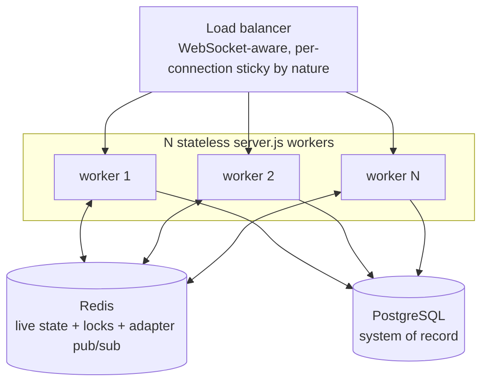

Everything that must be shared already is: live state, reservations, task routes, and the EKB are in Redis; the system of record is Postgres; room addressing goes through the adapter. What is still per-process and would need attention before this is real:

1. **Multi-machine benchmarking (the top priority, currently unstarted).** Every number above was produced with load generators, servers, database, cache, and proxy on one laptop. Nothing about horizontal scaling can be concluded until workers, Postgres, Redis, and the load generators are on separate hosts. This is the single measurement that would turn §24.2's negative result into an actual answer.
2. **Per-worker duplicate background work.** The offline sweep and EKB sweep run in every worker. They need leader election or a dedicated worker role; otherwise DB load multiplies by worker count, exactly as measured.
3. **Per-worker throttle state.** `lastDbFlushAt`, `lastHeartbeatDbFlushAt`, `robotStateCache`, and both rate limiters are process-local, so a reconnect to a different worker resets them and the effective global limits multiply.
4. **Pool budgeting.** `connection_limit` must be sized as `total ÷ workers`, not per worker, against the database's `max_connections`.
5. **Dashboard fan-out.** Server-side coalescing (batch N robot updates into one frame per interval), viewport/zone filtering, or a dedicated fan-out tier is the obvious next optimisation and would directly move the tier-2 000 ceiling.
6. **Redis as the next shared ceiling.** 19 000 ops/s at two workers and tier 2 000 was already substantial; a real deployment needs this measured against a dedicated Redis instance.
7. **Consolidating `robot:{id}` and `registry:{id}`.** Six duplicated fields written twice per tick is roughly a further 25 % reduction in telemetry-path Redis payload volume.
8. **Un-batched reads.** `costEvaluator`'s per-candidate `getRobotState` and `alertDissemination`'s per-robot `getRobotState` should both use `getManyRobotStates`.

---

## 25. Known Defects and Limitations

Verified against the code, not inherited from prior documents.

### Resolved — the defect class, and how each is now pinned

Seven defects found during the documentation audit were fixed. Each is recorded here with its original failure mode, because the failure modes are instructive and because the regression tests are named after them.

**D1 — Startup task re-dispatch never delivered.** `server.js` called `dispatchTaskAssign(robotId, payload)` against the three-argument `(io, robotId, taskPayload)` signature. The robotId string landed in the `io` position, `io.in(room)` threw inside `dispatch`, the throw was swallowed as "no socket connected", two retries elapsed, and the caller logged a cheerful `dispatched: false`. A restart therefore never re-sent `TASK_ASSIGN` to robots mid-task — and the log said only that the robot appeared offline.

*Fixed:* `io` is now passed. More importantly the failure mode itself is closed: `dispatch()` validates its first argument up front and returns `{dispatched: false, error: "NO_IO_SERVER"}` after logging at error level, so a malformed call is a loud programming error rather than an indistinguishable offline robot. *Pinned by:* `tests/unit/sockets/commandDispatch.test.js` (misuse guard) and `tests/integration/robotCommandRoundTrip.test.js`, which asserts over a real socket that the two-argument form delivers nothing and reports `NO_IO_SERVER`.

**D2 — The test suite was red: 14 of 137 failing.** Two independent causes, both in the fixtures rather than the code:
- *Stale assertions.* Eleven tests asserted on `io.emit.mock.calls`, but broadcasts had been scoped to `io.to("dashboard").emit` during the fan-out optimisation; three asserted the old two-argument `dispatchTaskAssign` signature. One test was literally named *"broadcasts robot:update to every connected socket (not scoped to a room)"* — asserting the behaviour that had been deliberately removed.
- *An incomplete logger fixture.* Several suites injected an ad-hoc `{ info, warn, error }` object as the logger. The telemetry handler had since gained a sampled `log.debug(...)` call immediately before its dashboard broadcast, so those tests threw `log.debug is not a function` mid-handler; the outer catch routed it to the fixture's own no-op `error()`, and the test simply timed out with no diagnostic. This was the real reason eight telemetry tests failed — the stale assertion was only the visible half.

*Fixed:* assertions updated to the room-scoped surface; every inline logger fixture replaced with the existing full-surface `tests/mocks/silentLogger`, which removes the whole class of "fixture missing a method the code has since started calling". `createFakeIo` gained `roomEmits(room)`, `emittedTo(room, event)`, and `joinRoom(room, socket)` so room delivery is directly assertable and `io.emit` can be asserted *never* to be called.

**D3 — The command endpoint was neither worker-safe nor understood by robots.** Two problems in one endpoint. (a) `POST /api/robots/:robotId/command` emitted through `getRobotSocket()`, the process-local Map, so under clustering a command for a robot owned by another worker was dropped and the `Command` row went to `FAILED` after two retries. (b) It emitted `COMMAND {commandId, type}`, but `VirtualRobot` listened only for bare `STOP` and `RETURN_TO_BASE`. So even single-process, *every* operator command against a virtual robot was ignored, never acknowledged, and marked `FAILED` ~15 s later.

*Fixed:* the endpoint (and its 5 s retry scheduler) now dispatch via `commandDispatcher.dispatchCommand`, which addresses the robot's room through the adapter; `delivered` in the response now reflects adapter-wide presence rather than local presence. `VirtualRobot` gained a `COMMAND` handler covering the full `CommandType` enum — `STOP`/`PAUSE` halt while retaining the task, `RESUME` restores `ACTIVE` (refused while charging), `RETURN` abandons the task — and replies with `COMMAND_ACK` carrying the same `commandId`, which is what moves the `Command` row to `ACK`. An unknown type is deliberately *not* acknowledged, so it correctly ends up `FAILED`. *Pinned by:* `tests/unit/tasks/robotsControllerCommand.test.js` (including an explicit assertion that a locally-registered socket is *not* used), `tests/unit/simulation/virtualRobotCommand.test.js`, and the integration round trip.

**D4 — `STOP` on task cancellation was not worker-safe.** `tasks.controller.cancelTask` emitted through `getRobotSocket`, so under clustering a cancelled task's robot could keep driving even though the DB and Redis state were cleaned up correctly. *Fixed:* now `commandDispatcher.dispatchStop`, room-addressed. *Pinned by:* `tests/unit/tasks/tasksControllerCancel.test.js` and the integration round trip.

**D5 — `RETURN_TO_BASE` was dead on both ends.** `VirtualRobot` listened for it; nothing ever emitted it. Meanwhile the `RETURN` command type was accepted by the API and delivered as `COMMAND {type: "RETURN"}`, which nothing handled. *Fixed:* `RETURN` is handled through the unified `COMMAND` path (D3). The bare `RETURN_TO_BASE` listener is retained for older robot firmware, but is no longer the only implementation.

**D6 — `robots:all` was unreliable in both directions.** Members were added only by commissioning, `VirtualRobot.commission`, and task recovery — never by AUTH — and removed only on decommission, never on disconnect. A robot that authenticated by any other route (a real unit reconnecting, any fleet present after a Redis flush) was absent from the index for its entire session, while departed robots lingered forever. The `/health` online count was wrong in both directions, and — the dangerous half — `alertDissemination`'s obstacle fan-out iterates this set, so a robot missing from it was **never rerouted around an obstacle on its path**.

*Fixed:* AUTH adds the robot to the index, the disconnect handler removes it, and the offline sweep removes the robots it marks offline (the sweep exists precisely for the cases where the disconnect handler never ran, so it has to do the same cleanup). All three writes are best-effort and never block their caller. *Pinned by:* `tests/unit/redis/liveRobotIndex.test.js`, which also covers the case that a superseded socket's disconnect must not evict the robot that replaced it.

**D12 — `Robot.socketId` was never cleared.** Written at AUTH, left stale after disconnect, so the column looked like a live handle indefinitely. *Fixed:* both `markRobotOffline` and the offline sweep now null it alongside `isOnline`/`status`. *Pinned by:* `tests/unit/redis/liveRobotIndex.test.js`.

### Remaining limitations (working as written, but constrained)

Numbering is preserved from the original audit so external references stay valid; D1–D6 and D12 are resolved above.

**D7 — Write-only Redis keys.** `task:{taskId}`, `robotTask:{robotId}`, and `metrics:allocation:{ms}` are written (and in the first two cases deleted) but never read by anything. `metrics:allocation` in particular means allocation cost/latency data is collected and expires unexamined — there is no aggregation, dashboard, or export.

**D8 — `/health` is unauthenticated and expensive.** Three Redis commands, `SELECT 1`, two `groupBy` aggregations, two `SMEMBERS`, and a `$metrics` call, reachable by anyone who can reach the port. It is also excluded from request logging, so the abuse would be invisible.

**D9 — Un-batched Redis reads on two paths.** `costEvaluator.computeCosts` issues one `getRobotState` per candidate even though `taskAssignment` already batch-fetched exactly that data one function call earlier. `alertDissemination` issues one `getRobotState` per member of `robots:all` on every obstacle report. Both should use `getManyRobotStates`.

**D10 — DTARO candidate selection is capped, not filtered.** `prisma.robot.findMany({..., take: 100})` returns the first 100 matching rows in unspecified order — not the 100 nearest. Beyond ~100 idle robots, allocation quality degrades arbitrarily. A spatial pre-filter (bounding box on the indexed `(lat, lon)`) is the natural fix.

**D11 — A\* is `O(n² log n)` in path length.** `neighbors(i)` computes a haversine to every other waypoint, sorts, and slices, for every expanded node. Mapbox `overview=full` paths routinely have hundreds of points, and `alertDissemination` replans all affected robots concurrently. This is a synchronous event-loop burst.

**D13 — `IN_PROGRESS` and `startedAt` are never written.** Modelled in the schema, accepted by every guard, produced by no code path.

**D14 — Per-process state under clustering.** `robotStateCache`, `lastDbFlushAt`, `lastHeartbeatDbFlushAt`, the socket rate limiter, and the HTTP rate limiter are all process-local. Effective rate limits multiply by worker count; flush gates reset on cross-worker reconnect. Measured consequence in [§24.2](#242-why-clustering-on-one-machine-did-not-help).

**D15 — `robotStateCache` has no eviction policy.** Entries are removed only on decommission or on a `P2025`. A long-running process accumulates one entry per robot ever seen. Bounded by fleet size, so not a leak in practice, but unbounded in principle.

**D16 — Mapbox is on the assignment critical path.** Up to two Directions calls per profile across three profiles, plus Matrix batches, all inside the background assignment phase. Total outage degrades to straight-line routes (correct, but geometrically wrong for a road network). There is no caching of route geometry between identical pickup/drop pairs.

**D17 — No authorization layer, and step-up is client-enforced.** See [§21.8](#218-security-gaps).

**D18 — No deployment artefacts.** No Dockerfile, no compose file, no CI, no `.env.example`. Every environment variable must be supplied by hand with no reference list in the repository.

**D19 — Duplicate live-state documents.** `robot:{id}` and `registry:{id}` overlap in six fields, both written every tick.

**D20 — Cumulative event-loop histogram.** Never reset, so a long-running process reports lifetime percentiles and a single early stall permanently inflates `maxMs`.

**D21 — `kv.setManyEx` has no callers.** Dead API surface on the facade.

**D22 — `X-Forwarded-For` is trusted without `trust proxy`.** IP-based rate limiting is spoofable if the ingress does not sanitise the header.

**D23 — No graceful shutdown on Windows under external termination.** `TerminateProcess()` bypasses the entire `SIGTERM` handler.

---

## 26. Configuration and Environment

### 26.1 Environment variables

Read from `Backend/.env` via `config/env.js`. There is no `.env.example`; this table is the reference.

| Variable | Required | Default | Used by |
| --- | --- | --- | --- |
| `DATABASE_URL` | **yes** | — | Prisma. `connect_timeout=30` is appended automatically |
| `JWT_SECRET` | **yes** | — | Login, token verification. Missing → `500 Server misconfigured` on every authed route |
| `FRONTEND_URL` | **yes in production** | — | The entire CORS allowlist in production |
| `REDIS_URL` | no | — | `kv` facade and the Socket.IO adapter. Absent → in-memory single-process mode |
| `REDIS_ENABLED` | no | `true` | Set to `false` to force in-memory mode even with a URL present |
| `REDIS_CONNECT_TIMEOUT_MS` | no | `5000` | Both `kv` and the adapter clients |
| `PORT` | no | `3000` | HTTP listener |
| `HOST` | no | `0.0.0.0` | HTTP listener bind address |
| `NODE_ENV` | no | `development` | Logger mode, cookie `secure` default, CORS localhost allowance |
| `LOG_LEVEL` | no | `debug` in dev, `info` in prod | Both the pino and dev logger paths |
| `LOG_PII` | no | `false` | Whether the admin bootstrap logs the email |
| `MAPBOX_TOKEN` / `MAPBOX_ACCESS_TOKEN` | no | — | Directions and Matrix. Absent → `503` from `mapbox.service`, which the caller degrades to straight-line routes |
| `GOOGLE_CLIENT_ID` | no | — | Google sign-in. Absent → `500` on `/api/auth/google` only |
| `COOKIE_SECURE` | no | `NODE_ENV === "production"` | Auth cookie |
| `COOKIE_SAMESITE` | no | `lax` | Auth cookie — set to `none` for cross-site production |
| `SEED_ADMIN_EMAIL` / `SEED_ADMIN_PASSWORD` | no | — | Admin bootstrap. Also accepted as `ADMIN_EMAIL`/`ADMIN_PASSWORD` or lowercase `email`/`password`. Absent → bootstrap skipped with an info log |
| `DISABLE_VIRTUAL_SIMULATOR` | no | `false` | `true` skips simulator re-hydration entirely (benchmark mode) |
| `SOCKET_BUFFER_LIMIT_BYTES` | no | `1000000` | Telemetry backpressure threshold |
| `TELEMETRY_LOG_SAMPLE_MS` | no | `10000` | Per-robot debug-log sampling interval |

**Benchmark-only** (`Backend/.env.benchmark`, loaded by the orchestrator): `BENCH_STAGE`, `BENCH_WORKERS`, `WORKER_BASE_PORT`, `BENCH_POOL_SIZE`, `BENCH_DATABASE_URL`, `BENCH_WARMUP_MS`, `BENCH_DURATION_MS`, `BENCH_ASSIGN_INTERVAL_MS`, `BENCH_PROFILE` (`prof` | `cpuprof`), `BENCH_DEBUG_SAMPLE`, `CPU_PROF_OUT`.

**Frontend** (Vite, `import.meta.env`): `VITE_API_URL` (default `http://localhost:3000`), `VITE_SOCKET_URL` (same default), `VITE_SOCKET_GLOBAL_KEY`.

### 26.2 Tunable constants (code, not environment)

| Constant | Value | File |
| --- | --- | --- |
| `DB_FLUSH_INTERVAL_MS` | 15 000 | `config/liveness.constants.js` |
| `OFFLINE_CUTOFF_MS` | 30 000 | same |
| `OFFLINE_SWEEP_INTERVAL_MS` | 10 000 | same |
| `OFFLINE_SWEEP_BATCH` | 500 | same |
| `BATTERY_THRESHOLD` | 20 % | `config/dtaro.constants.js` |
| `CHARGING_INTERRUPT_BATTERY` | 30 % | same |
| `REGISTRY_TTL` | 30 s | `robotRegistry.service.js` |
| `RESERVATION_TTL_SEC` | 30 s | `task.service.js` |
| `MAX_RESERVATION_RETRIES` | 2 | same |
| `DEFAULT_WEIGHTS` | `w₁ .50, w₂ .30, w₃ .15, w₄ .05, w₅ .05` | `costEvaluator.service.js` |
| `MAX_RETRIES` / `RETRY_BASE_MS` | 2 / 1 000 ms | `commandDispatcher.service.js` |
| `PAIRING_LOCKOUT_THRESHOLD` / `_TTL_SEC` | 5 / 3 600 | `robot.handler.js` |
| `ZONE_CACHE_LOCAL_TTL` / `_REDIS_TTL` | 60 000 ms / 300 s | `zoneManager.service.js` |
| `DEFAULT_TTL_SEC` (EKB) | 300 s | `ekb.service.js` |
| `OBSTACLE_RADIUS_M` / `K_NEAREST` | 30 m / 6 | `routing.service.js` |
| `TELEMETRY_INTERVAL_MS` | 2 000 ms | `simulation/constants.js` |
| Simulator speed / battery / wait constants | see file | `simulation/constants.js` |

### 26.3 Running the system

```bash
# Backend
cd Backend
npm install
npx prisma migrate deploy      # or: npx prisma migrate dev
npx prisma db seed             # seeds locations/campus; seed-pin.js seeds the step-up PIN
npm start                      # node server.js

# Frontend
cd Frontend
npm install
npm run dev

# Tests
cd Backend
npm test                       # jest --runInBand --forceExit
npm run test:coverage

# Benchmarks (requires Backend/.env.benchmark, Postgres + Redis reachable)
node benchmark/orchestrator.js 100,500,1000
BENCH_STAGE=cluster-2w BENCH_WORKERS=2 node benchmark/orchestrator.js 2000,5000   # needs Docker
node benchmark/poolSweep.js 20,40,60,80,100 500,1000
BENCH_PROFILE=cpuprof BENCH_STAGE=flame node benchmark/orchestrator.js 500
```

---

## 27. Testing

### 27.1 Configuration

`jest.config.js`: node environment, `tests/**/*.test.js`, `--runInBand` (serialised — the suites share module-level state and an in-memory `kv`), `tests/setup/env.js` for environment setup, `clearMocks` + `restoreMocks`, 10 s timeout. `config/logger` is module-mapped to `tests/mocks/silentLogger.js` for every import path. Coverage excludes `src/simulation/**` and the logger.

### 27.2 Helpers

| Helper | Purpose |
| --- | --- |
| `tests/helpers/testKv.js` | The **real** `kv` facade running in its in-memory fallback mode — so tests exercise actual TTL, reservation, `mget`, and pipeline logic rather than a hand-rolled stand-in |
| `tests/helpers/mockPrisma.js` | Jest-mock Prisma surface |
| `tests/helpers/fakeSocket.js` | `createFakeSocket` (an `EventEmitter` where `trigger` simulates inbound events and `emit` records outbound ones) and `createFakeIo` — which records per-room emissions and exposes `roomEmits(room)`, `emittedTo(room, event)`, and `joinRoom(room, socket)`. `io.in(room).fetchSockets()` genuinely returns only the sockets a test joined, so the dispatcher's presence check behaves as it does in production |
| `tests/mocks/silentLogger.js` | The full logger surface as no-ops. Used for **every** injected logger. Ad-hoc `{ info, warn, error }` fixtures are what let D2 hide: the handler later started calling `log.debug`, the fixture threw, its own no-op `error()` swallowed the throw, and the test failed as an unexplained timeout |
| `tests/helpers/waitFor.js` | Polling assertion helper for async handler side effects |

### 27.3 Current coverage

**22 suites, 169 tests, all passing** (~12 s, `--runInBand`).

| Area | Suite | What it pins |
| --- | --- | --- |
| Auth | `authMiddleware.test.js` | Token extraction precedence, UUID-claim rejection, expired/wrong-secret/deleted-user handling, missing-`JWT_SECRET` 500 |
| Auth | `cors.test.js` | No-Origin denial, localhost dev allowance, production denial, allowlist matching, malformed origins |
| Auth | `webauthnController.test.js` | Origin gating, challenge storage/deletion, PIN re-check on registration, replay prevention, duplicate-credential 409, counter-advance enforcement including the spec-legal 0→0 case |
| Auth | `socketAuthGate.test.js` *(integration)* | Dashboard-room JWT gate over a real Socket.IO server: valid cookie joins, no/garbage/wrong-secret token rejected |
| DTARO | `costEvaluator.test.js` | Each cost term's influence, zone neutrality when the pickup zone is unknown, the all-equal 0.5 normalisation case, custom weights |
| DTARO | `robotValidator.test.js` | Every rejection branch, the CHARGING matrix, the prefetched-`liveState` path, socket/registry desync |
| DTARO | `taskAssignment.test.js` | Candidate pipeline behaviour and error statuses |
| DTARO | `reservationLocking.test.js` | `SET NX` semantics, TTL expiry as a deadlock backstop, key independence, the retry-with-exclusion loop |
| DTARO | `zoneLocality.test.js` | Registry zone persistence, Z-term discrimination, and that `ZONE_UPDATED` is a state-change event rather than a per-tick broadcast |
| Redis | `kv.test.js` | Facade semantics in fallback mode |
| Redis | `lockFailClosed.test.js` | The fail-closed reservation policy |
| Redis | `liveRobotIndex.test.js` **(new)** | `robots:all` membership follows connection state: AUTH adds, disconnect removes, a superseded socket's disconnect does not evict its replacement, and offline clears `socketId` |
| Sockets | `commandDispatch.test.js` **(new)** | Room addressing, empty-room non-delivery, the `NO_IO_SERVER` misuse guard across every typed helper, and the no-retry policy for operator dispatches |
| Tasks | `taskService.test.js` | End-to-end assignment, retry on lost reservation, manual assignment, the `(io, robotId, payload)` dispatch signature |
| Tasks | `tasksControllerCancel.test.js` | Conditional robot release, room-addressed `STOP`, Redis cleanup |
| Tasks | `robotsControllerCommand.test.js` **(new)** | The command endpoint dispatches by room, explicitly does *not* use the process-local socket map, reports `delivered` from adapter-wide presence, and validates the type against the enum |
| Tasks | `taskRecovery.test.js` | Boot-time Redis rebuild |
| Tasks | `dtaroHandlerTaskComplete.test.js` | Completion transaction and registry cleanup |
| Telemetry | `telemetryHandler.test.js` | Auth gate, coercion, registry write, utilization EMA, transition table, CHARGING mapping, flush gate, and that `robot:update` goes **only** to the dashboard room (`io.emit` must never be called) |
| Telemetry | `heartbeatDbWrites.test.js` | The heartbeat flush gate |
| Simulation | `virtualRobotCommand.test.js` **(new)** | The full `COMMAND` contract: each type's effect, ACK with the originating `commandId`, case-insensitive matching, no ACK for unknown types, CHARGING interactions |
| Integration | `robotCommandRoundTrip.test.js` **(new)** | Real HTTP + Socket.IO server, real client: AUTH joins `robot:{id}`; `COMMAND`/`TASK_ASSIGN`/`STOP` all arrive; the old two-argument dispatch delivers nothing and reports `NO_IO_SERVER`; an unauthenticated socket receives nothing; AUTH/disconnect move the robot in and out of `robots:all` |

### 27.4 What the regression tests deliberately assert *negatively*

Three of the fixed defects were silent failures, so the tests assert absence as well as presence — a passing test that only checked the happy path would not have caught any of them:

- `expect(io.emit).not.toHaveBeenCalled()` — a global broadcast must never reappear.
- `expect(strandedSocket.emit).not.toHaveBeenCalled()` — a socket present in the process-local map but absent from the room must not be used.
- `expect(result).toMatchObject({ error: "NO_IO_SERVER" })` — a malformed dispatch must be distinguishable from an offline robot.

### 27.5 Gaps

- `src/simulation/**` is excluded from coverage; it now has one test suite (command handling), but the movement, battery, and charging models remain untested.
- No end-to-end HTTP tests (`supertest` is a dependency but no suite uses it).
- No tests for `alertDissemination`, `routing` (A*), `routeIntersection`, `ekb`, `metrics`, or the offline sweep's reconcile branch.
- No load or soak testing outside the benchmark harness, which is a measurement rig rather than an assertion suite.

---

*Companion document: `FINAL_ARCHITECTURE_SUMMARY.md` — the executive view. Benchmark artefacts: `Backend/benchmark/results/`.*
