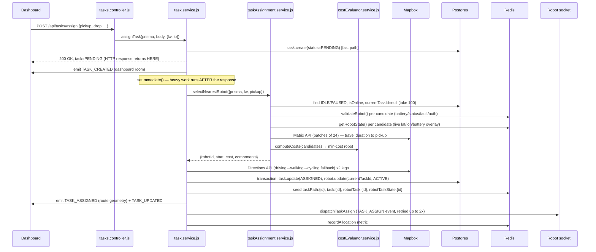

# RobotX — System Documentation

> Living technical record of the RobotX fleet-management platform: architecture, data model, real-time pipeline, the DTARO robot-allocation system, Redis/Socket.IO usage, current flaws, and the roadmap toward a production-grade admin dashboard.
>
> Scope of this document: everything under `Backend/` and `Frontend/` as of branch `feature/dashboard`, commit history ending at `3cc8e8b "simulation attempted"`. Written to be a standalone context artifact — a future session (human or AI) should be able to read only this file and understand the whole system well enough to make correct architectural decisions.

---

## Table of Contents

1. [What RobotX Is](#1-what-robotx-is)
2. [Tech Stack](#2-tech-stack)
3. [High-Level Architecture](#3-high-level-architecture)
4. [Data Model (PostgreSQL / Prisma)](#4-data-model-postgresql--prisma)
5. [The DTARO Task Allocation Pipeline](#5-the-dtaro-task-allocation-pipeline) — *the part you're worried about*
6. [Redis Usage — Complete Key Map](#6-redis-usage--complete-key-map)
7. [Socket.IO Usage — Complete Event Map](#7-socketio-usage--complete-event-map)
8. [Real-Time Telemetry Pipeline](#8-real-time-telemetry-pipeline)
9. [Virtual Robot Simulation Engine](#9-virtual-robot-simulation-engine)
10. [Obstacle Detection & Rerouting (EKB)](#10-obstacle-detection--rerouting-ekb)
11. [Authentication & Authorization](#11-authentication--authorization)
12. [Frontend Architecture](#12-frontend-architecture)
13. [Current Admin Dashboard — What Exists Today](#13-current-admin-dashboard--what-exists-today)
14. [Known Flaws & Risks](#14-known-flaws--risks) — *read this section carefully*
15. [What's Already Done Well](#15-whats-already-done-well)
16. [What a "Complete" Admin Dashboard Needs](#16-what-a-complete-admin-dashboard-needs)
17. [Optimization & Reliability Roadmap (Prioritized)](#17-optimization--reliability-roadmap-prioritized)

---

## 1. What RobotX Is

RobotX is a fleet-management platform for autonomous delivery robots (ground rovers, modeled as delivery bots at 20–30 km/h). An operator (single `SUPER_ADMIN` role today) commissions robots, creates delivery tasks (pickup → drop, geocoded via Mapbox), and the backend automatically:

- Selects the best available robot for a task using a multi-criteria cost function ("DTARO" — the project's own name for its Distance/Task/Allocation/Routing/Obstacle-avoidance system).
- Computes a real road route via Mapbox Directions.
- Dispatches the task to the robot over a persistent Socket.IO connection.
- Tracks the robot's live position/battery/status and streams it to connected dashboards.
- Detects obstacles reported by robots, determines which other robots are affected, and re-routes them automatically.
- Since no physical robot hardware exists yet, every commissioned robot is backed by a **VirtualRobot** — a fully simulated robot that connects over the same Socket.IO protocol a real robot would use, so the entire pipeline (auth, telemetry, task execution, battery drain, charging, obstacle reporting) is exercised end-to-end without hardware.

This is fundamentally a **real-time systems problem** wrapped in a CRUD dashboard: the hard parts are allocation correctness, race-condition safety under concurrency, Redis/Postgres consistency, and Socket.IO reliability — not the UI.

---

## 2. Tech Stack

### Backend (`Backend/`)
| Layer | Choice | Notes |
|---|---|---|
| Runtime | Node.js (CommonJS, no TypeScript) | `server.js` is the entry point |
| Web framework | Express 5 | `src/app.js` |
| Realtime | `socket.io` v4 (server) | one shared `io` instance stored on `app.locals.io` |
| ORM | Prisma 5 → PostgreSQL | `Backend/prisma/schema.prisma` |
| Cache / live-state store | `ioredis` v5, wrapped in a custom `kv` facade with an **in-memory fallback** | `src/cache/kv.js` |
| Auth | `jsonwebtoken` (HttpOnly cookie), `bcrypt` (password/PIN hashing), `google-auth-library` (Google OAuth) | |
| Routing/geocoding | Mapbox Directions API + Mapbox Matrix API (HTTP, via native `fetch`) | `src/services/mapbox.service.js` |
| Validation | `zod` schemas on socket payloads and some HTTP bodies | |
| Logging | Custom logger (`src/config/logger.js`) — colorized dev console, `pino` JSON in production, plus domain-specific formatters (`logger.dtaro`, `logger.simulation`, `logger.obstacle`) | |
| Security headers | `helmet` | |
| Rate limiting | Custom in-memory limiters — one for HTTP (`middlewares/rateLimitHttp.js`), one for Socket.IO (`sockets/rateLimit.js`) | not Redis-backed, see [flaws](#14-known-flaws--risks) |

### Frontend (`Frontend/`)
| Layer | Choice | Notes |
|---|---|---|
| Framework | React 19 + Vite 8 | `src/main.jsx` → `RobotXApp.jsx` |
| Routing | `react-router-dom` v6 | `src/router/AppRouter.jsx` |
| State | Custom Context (no Redux/Zustand) | `src/context/AppProvider.jsx` + `appContext.js` |
| Realtime client | `socket.io-client`, single module-level singleton | `src/lib/socket.js` |
| Maps | `mapbox-gl` v3 | `src/features/maps/MapControl.jsx` + helpers |
| UI kit | Radix UI primitives + Tailwind CSS v4 + `class-variance-authority` (shadcn-style) | `src/components/ui/*` |
| Animation | `framer-motion`, `gsap` | marker movement, map style transitions |
| Charts | `recharts` (custom `BatteryPieChart`) | |
| Forms | `react-hook-form` + `@hookform/resolvers` + `zod` | (present as dependency; usage is currently minimal — most forms are hand-rolled, e.g. `CreateTaskModal`) |
| Auth widget | `@react-oauth/google` | |

### Infra / operational notes
- No Docker/Compose files, no CI config, no test runner configured (`"test": "echo ... && exit 1"` in `Backend/package.json`).
- No `.env.example` found in the repo snapshot — environment variables are inferred from code (full list in §2.1 below).
- Prisma migrations exist and are checked in (`Backend/prisma/migrations/*`), including a Postgres-only recursive CTE (`$queryRaw` in `location.service.js`) — **ties the project to PostgreSQL**, not portable to MySQL/SQLite without rewriting that query.

### 2.1 Environment Variables Reference

Every variable actually read by the code (grepped across both apps — nothing here is guessed). None of these are documented in a `.env.example` anywhere in the repo, so this table is currently the only place they're all listed together.

**Backend (`Backend/.env`, loaded by `src/config/env.js`):**

| Variable | Read in | Required? | Purpose |
|---|---|---|---|
| `DATABASE_URL` | `src/db/prisma.js` | Yes | Postgres connection string; `connect_timeout=30` is patched onto it automatically at module load if not already present. |
| `REDIS_URL` | `src/cache/kv.js` | No | If unset or empty, Redis is disabled entirely and the in-memory fallback is used from boot. |
| `REDIS_ENABLED` | `src/cache/kv.js` | No | Set to `"false"` to force-disable Redis even if `REDIS_URL` is set. |
| `REDIS_CONNECT_TIMEOUT_MS` | `src/cache/kv.js` | No | Default `5000`. |
| `PORT` | `server.js` | No | Default `3000`. |
| `HOST` | `server.js` | No | Default `0.0.0.0`. |
| `NODE_ENV` | `server.js`, `config/cors.js`, `config/logger.js`, `auth_controller.js` | No | Drives production-vs-dev behavior in the logger (JSON vs colorized), CORS localhost allowance, and cookie `secure`/`sameSite` defaults. |
| `LOG_LEVEL` | `config/logger.js` | No | Passed straight to `pino`; default `info` in prod, `debug` otherwise. |
| `FRONTEND_URL` | `config/cors.js` | Yes in production | The only entry in the CORS allowlist for non-localhost origins. |
| `JWT_SECRET` | `auth_controller.js`, `auth_middleware.js` | Yes | Signs/verifies the 7-day admin session JWT. If unset, login/`me`/`change-password` all fail closed with `500 Server misconfigured` — a reasonable fail-safe. |
| `GOOGLE_CLIENT_ID` | `auth_controller.js` | Only if Google login is used | Verifies the audience of the Google ID token. |
| `COOKIE_SECURE` | `auth_controller.js` | No | Overrides the `secure` cookie flag; defaults to `NODE_ENV === "production"`. |
| `COOKIE_SAMESITE` | `auth_controller.js` | No | Defaults to `"lax"` in both dev and prod. |
| `SEED_ADMIN_EMAIL` / `ADMIN_EMAIL` | `adminBootstrap.service.js` | No (but no admin exists without it) | Idempotent upsert target for the bootstrap `SUPER_ADMIN`. Checked in this priority order; `email`/`password` (lowercase, no prefix) are also accepted as a third fallback. |
| `SEED_ADMIN_PASSWORD` / `ADMIN_PASSWORD` | `adminBootstrap.service.js` | No | Paired with the email var above. |
| `LOG_PII` | `adminBootstrap.service.js` | No | Set to `"true"` to log the bootstrap admin's email; otherwise it's redacted from logs. |
| `MAPBOX_TOKEN` / `MAPBOX_ACCESS_TOKEN` | `mapbox.service.js` | Yes (routing/allocation breaks without it) | Checked in this order; whichever is set first wins. Every Directions/Matrix call throws a `503` if neither is set. |
| `SOCKET_BUFFER_LIMIT_BYTES` | `telemetry.handler.js` | No | Default `1_000_000` — WebSocket backpressure threshold for dropping telemetry frames. |

**Frontend (`Frontend/.env`, read via Vite's `import.meta.env`, so these must be prefixed `VITE_` and are baked in at build time — changing them requires a rebuild, not just a restart):**

| Variable | Read in | Required? | Purpose |
|---|---|---|---|
| `VITE_API_URL` | every `lib/api/*.js` file | No | Default `http://localhost:3000`. Base URL for all REST calls. |
| `VITE_SOCKET_URL` | `lib/socket.js` | No | Default `http://localhost:3000`. Socket.IO endpoint. |
| `VITE_SOCKET_GLOBAL_KEY` | `lib/socket.js` | No | Default `__robotx_socket__`. `globalThis` key used to persist the socket singleton across Vite HMR reloads. |
| `VITE_MAPBOX_TOKEN` | `MapControl.jsx`, `LocationCombobox.tsx` | Yes (map/location-search is a hard error without it) | Used both for the Mapbox GL map tiles and for the Search Box API (suggest/retrieve) calls made **directly from the browser** (see §12.2). Being bundled into client-side JS is normal for a Mapbox *public* token, but that only stays safe if the token is scoped with URL/referrer restrictions on the Mapbox account — that configuration lives outside this repo entirely and couldn't be verified from the code alone. |
| `VITE_GOOGLE_CLIENT_ID` | `RobotXApp.jsx` | Only if Google login is used | Passed to `GoogleOAuthProvider`; must match the backend's `GOOGLE_CLIENT_ID`. |

---

## 3. High-Level Architecture

```mermaid
flowchart LR
    subgraph Client["Browser (React SPA)"]
        UI[Dashboard / Map / Tasks / Robots pages]
        SIO_C[socket.io-client singleton]
    end

    subgraph Server["Node.js Backend (single process)"]
        EXPRESS[Express REST API]
        IO[Socket.IO server]
        SVC[Service layer: taskAssignment, costEvaluator,\nrobotRegistry, robotValidator, zoneManager,\nekb, alertDissemination, routing, commandDispatcher]
        VR[VirtualRobot simulator\n(in-process socket.io-client instances)]
    end

    PG[(PostgreSQL via Prisma)]
    REDIS[(Redis via ioredis,\nin-memory fallback if down)]
    MAPBOX[[Mapbox Directions + Matrix API]]

    UI <--HTTP fetch (cookie auth)--> EXPRESS
    SIO_C <--WebSocket--> IO
    EXPRESS --> SVC
    IO --> SVC
    SVC <--> PG
    SVC <--> REDIS
    SVC --> MAPBOX
    VR <--AUTH/TELEMETRY/TASK_ASSIGN socket events--> IO
    VR -.->|"real robot would connect here instead"| IO
```

**Everything runs in one Node.js process.** There is no worker queue, no separate microservice, no message broker beyond Redis-as-cache. `server.js` boots Express + Socket.IO + Prisma + Redis + the VirtualRobot simulator together, and on shutdown drains all of them in sequence (`SIGINT`/`SIGTERM` handlers).

### Startup sequence (`Backend/server.js`)
1. Load env (`src/config/env.js` — `dotenv` from `Backend/.env`).
2. Create HTTP server + attach Socket.IO with CORS origin-check callback.
3. Connect Prisma with retry (`connectPrismaWithRetry` — up to 4 attempts, 3s apart, each with a 30s connect timeout patched onto `DATABASE_URL` — tuned for Neon's cold-start wake latency).
4. Initialize the `kv` (Redis) facade; probe it with a throwaway `SET/GET/DEL` to report Redis health in the startup banner.
5. Register everything on `app.locals` (`kv`, `prisma`, `io`) so controllers can reach them via `req.app.locals`.
6. Wire socket handlers (`initSocketServer`).
7. `ensureAdminUser` — idempotent upsert of a single `SUPER_ADMIN` from `SEED_ADMIN_EMAIL`/`SEED_ADMIN_PASSWORD` env vars.
8. `recoverActiveTasks` — rebuilds Redis task-path/state keys for any `ASSIGNED`/`IN_PROGRESS` task left over from a previous run (see §5.6).
9. `server.listen()` → create the `VirtualRobotSimulator`, start it, then **re-hydrate** a `VirtualRobot` instance for every robot row already in Postgres (so a server restart doesn't lose the fleet), mark them all `isOnline: true` immediately (so DTARO can assign to them before their sockets reconnect), and after a 5s grace window, re-dispatch `TASK_ASSIGN` for any task that was active before the restart.

This restart-recovery logic is one of the more carefully engineered parts of the system — it exists specifically so that a `nodemon`/deploy restart doesn't strand in-flight deliveries.

### 3.1 Developer tooling, seed data & one-off scripts

None of these are wired into `npm run` scripts (`Backend/package.json` only defines `start`/`dev`/`test`, plus the Prisma `seed` hook) — they're run manually with `node <path>`.

| Script | What it does | Notes |
|---|---|---|
| `Backend/prisma/seed.js` | Idempotent (`upsert`) seed of the minimal `Location` hierarchy (India → Karnataka → Bengaluru → Rajarajeshwari Nagar) and one `Campus` (`RNSIT`). Wired as the Prisma `seed` hook (`prisma db seed`). | This is the *only* location data that exists unless an operator manually adds more via `POST /api/locations` — everything else demoed in the app (RR Nagar/Indiranagar/Whitefield in `Frontend/src/config/mapConfig.js`) is unused static config, not the live seed (see §12 note on dead frontend config). |
| `Backend/prisma/seed-pin.js` | Sets the **same hardcoded PIN, `931100`**, on every `AdminPinAuth` row in the database (bcrypt-hashed, upserted). Meant as a one-time dev convenience. | **This literal PIN value is committed to the repository in plaintext.** See flaw #27. |
| `Backend/scripts/check_password.js` | CLI: `node scripts/check_password.js <email> <password>` — bcrypt-compares a candidate password against the stored hash and prints whether it matches. | Debug-only; reads `.env` directly, has no safeguards against being run against a production `DATABASE_URL`. |
| `Backend/scripts/check_users.js` | CLI: dumps the first 20 users (email, role, createdAt, and the first 4 characters of the password hash) as JSON to stdout. | Also debug-only; printing even a hash *prefix* is a minor information-leak habit worth breaking before this ships anywhere non-local. |
| `Backend/robot.js` | A **standalone manual test client** — connects via `socket.io-client` to `http://localhost:3000` and emits the legacy lowercase `telemetry` event every 2s for a hardcoded `robotId: "RBT-001"`, with random jittered lat/lon and a random battery value, and **never emits `AUTH` at all**. | This script is itself the clearest, most concrete demonstration in the repo of the unauthenticated legacy-telemetry-bind path described in flaw #26 — it works today with zero pairing/session setup, for any `robotId` that exists in the DB and has no active session. |

---

## 4. Data Model (PostgreSQL / Prisma)

Full schema: `Backend/prisma/schema.prisma`. Key entities:

- **User** — single-role (`SUPER_ADMIN` only, enum has one value) admin account. Supports password login and Google OAuth (`googleId`), merged by email — a Google sign-in never creates a second account, it only links to the existing row with the same verified email.
- **AdminPinAuth** — separate table, one-to-one with `User`, stores a second-factor PIN hash (bcrypt, with an auto-migration path for legacy plaintext PINs via `crypto.timingSafeEqual`).
- **Location** — self-referential hierarchy (`COUNTRY → STATE → CITY → AREA`) used purely as a cascading filter for the map UI, not as a real geofencing/dispatch boundary. Unique on `(name, parentId)`.
- **Robot** — the central live-state row: `status` (enum: `IDLE/ACTIVE/PAUSED/OFFLINE/ERROR/ISSUES`), `battery`, `lat/lon/speed`, `isOnline`, `socketId`, `lastSeenAt`, and a **strict 1:1** `currentTaskId` (a robot can have at most one active task, enforced by a unique FK). Also has `zoneId` + `utilization` for DTARO. Indexed on `status`, `isOnline`, `lastSeenAt`, `locationId(+isOnline)`, `campusId`, `zoneId`, `lat/lon`.
- **Zone** — rectangular bounding boxes (`minLat/maxLat/minLon/maxLon`) used for obstacle geofencing and Socket.IO room targeting. Seeded automatically as 4 quadrants around a Campus center (`zoneManager.service.js:seedDefaultZones`) the first time any campus exists and no zones do.
- **ObstacleEvent** — persisted mirror of the Redis-primary EKB (Environmental Knowledge Base) obstacle store; `expiresAt` drives cleanup.
- **Campus** — optional grouping of robots/tasks around a center point; also the seed anchor for default Zones.
- **Task** — `pickup/pickupLat/pickupLon`, `drop/dropLat/dropLon`, `distanceMeters`, `status` (`PENDING → ASSIGNED → IN_PROGRESS → COMPLETED | FAILED | CANCELLED`), `startedAt/completedAt`. One robot ↔ many tasks over time (`RobotTasks`), but only one can be `currentTask`.
- **Telemetry** — historical position/speed/battery snapshots, *not* every tick — see the "smart snapshot" throttle in §8.
- **Event** — generic audit/notification log (`INFO/WARNING/CRITICAL`), used both for genuine audit trail (faults, command ACKs) and ad hoc logging.
- **Command** — `STOP/PAUSE/RETURN/RESUME` with `status` (`SENT/ACK/FAILED`), `issuedAt/executedAt` — this is the only place command delivery is tracked durably; retries are otherwise in-memory (see flaws).
- **Decision** — modeled in the schema (`reason`, `imageUrl`, `action: WAIT/REROUTE/CANCEL`, `resolvedAt`) for an operator "obstacle decision" workflow, but **the current frontend `DecisionRequiredModal` never persists a `Decision` row** — the whole decision UI is client-side state only (see §14). The table exists but nothing writes to it today (`prisma.decision.create` does not appear anywhere in the service layer that was reviewed).

---

## 5. The DTARO Task Allocation Pipeline

This is the system's core intellectual property and — per your explicit concern — the part most worth understanding precisely before optimizing further.

### 5.1 What "DTARO" means in this codebase

It's this project's internal name for the rule-based multi-criteria allocation system. It is **not** a learned/ML model — it is a deterministic weighted-sum cost function evaluated fresh for every task:

```
C(r) = w1·D(r) + w2·(1−B(r)) + w3·U(r) + w4·T(r)

D(r) = normalized straight-line/haversine distance from robot r to the pickup point (0–1, min-max across current candidates)
B(r) = battery level 0–100, used as (1 − B/100)  → low battery = high cost
U(r) = utilization ratio 0–1 from the Redis registry (currently always defaults to 0 — see flaws)
T(r) = normalized Mapbox-Matrix travel duration to pickup (0–1, min-max across current candidates)

Default weights: w1=0.50 (distance), w2=0.30 (battery), w3=0.15 (utilization), w4=0.05 (travel time)
```

Source: `Backend/src/services/costEvaluator.service.js`. Weights are overridable per-call via `costWeights` but there is **no persistence or admin UI** for changing them — they live only as a function parameter today.

### 5.2 End-to-end flow for `POST /api/tasks/assign`



**Key design decision**: the HTTP response returns immediately after creating a `PENDING` task row (Phase 1), and all the expensive work — robot selection, two Mapbox Directions calls, the DB transaction, Redis writes, socket dispatch — happens in Phase 2 inside `setImmediate()` (`task.service.js:assignTask` / `_processAssignment`). This keeps the API responsive but means **assignment failures are only visible via the socket `TASK_UPDATED{status:"FAILED"}` event**, not via the original HTTP call. The frontend correctly listens for this (`onTaskUpdated` in `AppProvider.jsx`), so the UX degrades gracefully, but any caller that only checks the HTTP response will believe the task succeeded when it may still fail moments later.

### 5.3 Candidate selection & validation (`taskAssignment.service.js`, `robotValidator.service.js`)

1. Postgres query: `status IN (IDLE, PAUSED)`, `isOnline: true`, `currentTaskId: null`, capped at `maxRobots` (default 100).
   - `PAUSED` is included deliberately because **virtual robots that are `CHARGING` are stored in Postgres as `PAUSED`** (the Prisma `RobotStatus` enum has no `CHARGING` value — see §9). Redis is the only place the real `"CHARGING"` string survives.
2. Each candidate is run through `validateRobot()`:
   - Must be online.
   - Effective status is taken from **Redis first, DB second** (`live.status` wins over `dbStatus`) — because DB can be stale between telemetry ticks.
   - If effectively `CHARGING` and `allowCharging` is true (it always is, from `taskAssignment.service.js`): battery must be ≥ `max(batteryThreshold, 20)` = **20%** to be allowed to interrupt charging.
   - If not charging: must be DB-`IDLE`, have no `currentTaskId`, battery ≥ 20% (`BATTERY_THRESHOLD`), and `healthStatus !== "FAULT"`.
   - If a live socket is connected but the registry says `authenticated:false`, reject (auth/registry desync guard).
3. Surviving candidates get their **live position** overlaid from the Redis registry (`registry:{robotId}`), falling back to the DB row's `lat/lon` if Redis has nothing.
4. Mapbox Matrix API is called in batches of 24 origins → 1 destination (the pickup point) to get real travel-time estimates; on any failure the whole batch falls back to `durationSec: null`, which `costEvaluator` treats as `0` after normalization (i.e. the travel-time term stops discriminating between candidates when Mapbox is down).
5. `computeCosts()` runs the weighted-sum formula (§5.1) and the **minimum-cost** robot wins (ties broken by `array.reduce` — the first minimum found).
6. A full structured decision log is written via `logger.dtaro()` — candidates, per-candidate cost breakdown, rejection reasons, and the winner — visible in the dev console with a nice bar-chart-style readout. This is a genuinely good piece of the system for debugging *why* a particular robot was picked.

### 5.4 Finalization

`_processAssignment()` re-fetches the chosen robot row, re-validates it's still assignable, computes the two-leg road route (`getRoutesWithDistance`: pickup→drop, tried at `driving → walking → cycling` Mapbox profiles, then a dense straight-line fallback if all three fail), and **commits the assignment inside a Prisma transaction** that re-checks `currentTaskId` is still null at commit time (defense against a race — see §14 for why this defense is incomplete). On success it seeds Redis task-state keys, emits `TASK_ASSIGNED`/`TASK_UPDATED` to the `dashboard` room, and dispatches `TASK_ASSIGN` to the robot's socket via `commandDispatcher.service.js` (2 retries, exponential-ish backoff: 1s then 2s, silently dropped if no socket after that — the robot recovers state on reconnect via the recovery path, not via this retry).

### 5.5 Rerouting an in-progress task (`rerouteTask`)

Two independent triggers exist:
1. **Automatic** — `alertDissemination.service.js` calls `routing.service.js:rerouteRobot()` for every robot whose planned path intersects a newly reported obstacle (see §10). This runs with zero operator involvement.
2. **Manual** — `POST /api/tasks/:taskId/reroute`, wired to the frontend's `DecisionRequiredModal` "REROUTE" button. It re-reads the robot's live position, determines which segment it's on (`toPickup` vs `toDrop` from `robotTaskState:{robotId}`), asks Mapbox for a fresh route from the robot's *current* position to the same destination, and pushes it via `REROUTE_ALERT`.

Both paths converge on the same Redis `taskPath:{taskId}` structure and the same `REROUTE_ALERT` socket event, so they're consistent — but see §14 for why the manual path is largely redundant given the automatic one already ran.

### 5.6 Restart recovery (`taskRecovery.service.js`)

On boot, every `ASSIGNED`/`IN_PROGRESS` task gets its Redis path/state keys rebuilt from the DB + a fresh Mapbox route computed from the robot's last-known position (Redis live position preferred, DB fallback). This means **a server restart does not lose in-flight deliveries** — robots reconnect, `server.js`'s startup re-hydration re-dispatches `TASK_ASSIGN` for tasks still active after a 5s grace window. This is a genuinely strong piece of engineering most fleet-management side-projects skip entirely.

### 5.7 What the cost function does *not* account for (see §14 for the full flaw list)

- **Zone locality** — despite the system tracking `zoneId` per robot and per obstacle, the DTARO cost function has zero zone-awareness. A robot on the far side of the city (if it happens to have marginally lower haversine distance due to Mapbox Matrix being unavailable) can beat a robot in the same zone as the pickup.
- **Utilization is effectively always 0** — `updateUtilization()` exists in `robotRegistry.service.js` but is never called from anywhere in the reviewed codebase. The `w3=0.15` weight is therefore inert; the real formula in production is `C(r) ≈ 0.50·D + 0.30·(1−B) + 0.05·T` renormalized, i.e. utilization contributes nothing today despite being 15% of the intended weight.
- **No global/batch optimization** — each pending task is assigned independently and greedily. If 3 tasks arrive within the same tick, each one's `selectNearestRobot()` call runs against the *same* Postgres snapshot of "IDLE robots" (no locking/reservation between the selection query and the final transaction), so more than one task can pick the same "best" robot. The DB transaction's re-check (`if (cur?.currentTaskId) throw`) prevents a *double* assignment, but the **loser task simply fails outright** — there is no retry against the second-best candidate, no requeueing. This is arguably the single most important reliability gap in the whole allocation system for any real multi-robot, multi-task-at-once load.

---

## 6. Redis Usage — Complete Key Map

Redis is used purely as a **fast, ephemeral, TTL-based live-state cache** layered in front of PostgreSQL (the system of record), plus a couple of places where it's the *only* store (sessions, pairing codes, obstacle events primary copy). The wrapper in `Backend/src/cache/kv.js` is worth understanding on its own:

- It is **not** a thin ioredis passthrough — it's a hand-written facade (`get/set/del/exists/sadd/srem/smembers/setManyEx/incr/health`) that transparently falls back to an **in-process `Map`** (with hand-rolled TTL semantics) if Redis is unreachable at startup or becomes unreachable later (`disableRedis()` trips a flag and every subsequent call silently uses memory).
- This means **the system is designed to run correctly with zero Redis** — a deliberate resilience choice — but it also means: (a) in-memory fallback state is per-process and lost on restart/scale-out, and (b) if you ever run more than one Node process (horizontal scaling), the in-memory fallback silently breaks cross-process consistency with no error surfaced beyond a one-time warning log.

### Key catalog

| Key pattern | TTL | Written by | Read by | Purpose |
|---|---|---|---|---|
| `registry:{robotId}` | 30s | `robotRegistry.service.js` (`setRobotState`, called by `markOnline/markOffline/updateTelemetry/updateZone/updatePlannedPath/updateUtilization/updateETA/updateAssignedTask/updateHealthStatus`) | `costEvaluator`, `robotValidator`, `taskAssignment`, `alertDissemination` | **The DTARO live-state document** — the canonical "what does the allocator currently believe about this robot" record: lat/lon/battery/status/speed/zoneId/utilization/plannedPath/healthStatus/authenticated/connected/assignedTaskId/etaSec/lastHeartbeat. 30s TTL means a robot that stops sending telemetry silently "disappears" from DTARO's view within 30s even if its DB row still says `isOnline:true`. |
| `robot:{robotId}` | 15s | `telemetry.handler.js` (every TELEMETRY tick), `robots.controller.js` (`writeRobotLiveState` on commission) | `task.service.js` (current position for routing), `taskRecovery.service.js`, `robots.controller.js` (merge overlay for `GET /api/robots*`) | **The dashboard-facing live-state document** — a *second*, differently-shaped live-state key for the same robot (lat/lon/battery/status/speed/lastSeenAt/distanceTravelled). This is a distinct key from `registry:{robotId}` above — see [flaw: duplicate live-state stores](#14-known-flaws--risks). |
| `robots:all` (Set) | none (persistent set) | `sadd` on commission / VirtualRobot commission / task recovery | `getAllRobotIds`, `metrics.service.js` (online count) | Index of every robot ID ever seen live, used to enumerate "all robots" without a Postgres scan. Never pruned on decommission except explicitly in `deleteRobot`. |
| `session:{robotId}` | 7 days (`SESSION_TTL_SEC`) | `robot.handler.js` AUTH success, `VirtualRobot.commission()` | `robot.handler.js` AUTH (reconnect path) | Bearer session token for a robot's Socket.IO reconnects — avoids re-pairing on every reconnect. |
| `pairing:{robotId}` | 300s | `robots.controller.js` (`commissionRobotWithPairing`) | `robot.handler.js` AUTH (first-time pairing) | One-time 6-digit pairing code a physical robot would key in to bind to its commissioned identity. |
| `pairingAttempts:{robotId}` | 300s | `robot.handler.js` (`kv.incr`, atomic) | same | Brute-force counter on pairing attempts — **logged at ≥5 but never actually blocks** (see flaws: it warns, doesn't lock out). |
| `socket:{socket.id}` | 3600s | `robot.handler.js` AUTH, `telemetry.handler.js` (legacy bind) | disconnect handler (reverse lookup socket→robotId) | Lets the disconnect handler figure out which robot a socket belonged to even if `socket.data.robotId` was never set (legacy/no-AUTH clients). |
| `taskPath:{taskId}` | 86400s | `task.service.js` (assign + reroute), `taskRecovery.service.js` | `task.service.js` (reroute), `routing.service.js` (rerouteRobot), `socket.server.js` (dashboard re-hydration on connect) | `{ toPickup, toDrop, pickup, drop }` — the full route geometry for a task. **Not cleared on cancel** (see flaws). |
| `task:{taskId}` | 86400s | `task.service.js` seed | *(nothing currently reads this exact key — see flaws)* | `{ phase, idx, waitUntil }` — appears to be a superseded/duplicate of `robotTaskState:{robotId}` below; written but not consumed anywhere found in the reviewed code. |
| `robotTask:{robotId}` | 86400s | `task.service.js`, `taskRecovery.service.js` | *(not read anywhere found)* | Maps a robot to its current task ID — likely dead code / leftover from an earlier design, duplicating `robot.currentTaskId` in Postgres and `assignedTaskId` in the registry. |
| `robotTaskState:{robotId}` | 86400s | `task.service.js`, `taskRecovery.service.js` | `task.service.js` (reroute — determine segment), `routing.service.js` (rerouteRobot) | `{ taskId, phase, pathIndex, waitUntil, segment, startedAt, parking }` — the actual state machine the reroute logic reads. **Not cleared on `TASK_COMPLETE`** consistently (cleared in `dtaro.handler.js` TASK_COMPLETE, good) but **not cleared on cancel** (bad — see flaws). |
| `snapshotState:{robotId}` | 86400s | `telemetry.handler.js` | same | Tracks the last-persisted telemetry snapshot (time/position/battery) so the "smart snapshot" throttle (§8) knows whether the next tick needs a new `Telemetry` row in Postgres. |
| `vr:battery:{robotId}` | 48h | `VirtualRobot._maybePersistBattery()` (every 60 ticks ≈ 2 min), `telemetry.handler.js` (real-robot mirror, every 120s) | `VirtualRobot.commission()` on restart | Survives a server restart with the robot's actual battery level instead of resetting to 100%. |
| `vr:batteryPersistAt:{robotId}` | 48h | `telemetry.handler.js` | same | Debounce timestamp so battery isn't written to Redis on every single telemetry tick. |
| `zones:all` | 300s | `zoneManager.service.js` (`loadZones`, tier 2 cache) | same | Redis-tier cache of all Zone rows, itself backed by a 60s in-process memory tier *and* Postgres as tier 3. Three-tier cache for data that changes maybe once a day. |
| `ekb:event:{obstacleId}` | `ttlSec` (default 300s) | `ekb.service.js` (`storeObstacle`) | `ekb.service.js` (`getActiveObstacles`) | The actual obstacle payload; Redis TTL is the **primary expiry mechanism** — Postgres `ObstacleEvent.expiresAt` is a secondary/audit copy that is never itself swept (no cron/query filters on it visible in the reviewed code beyond the initial `create`). |
| `ekb:obstacles` (Set) | none | `ekb.service.js` | same, `metrics.service.js` | Index of active obstacle IDs; periodically swept (`sweepExpired`, every 60s via `socket.server.js:startDtaroSweep`) to prune IDs whose underlying key already TTL'd out. |
| `metrics:allocation:{timestamp}` | 3600s | `metrics.service.js` (`recordAllocation`, called after every successful assignment) | *(nothing currently reads these back — see flaws)* | Write-only telemetry: one key per allocation event, cost is currently always logged as `null` (`task.service.js` calls `recordAllocation(kv, { ..., cost: null, latencyMs: null })` — **the actual DTARO cost/components computed in `selectNearestRobot` are never passed through to this call**, so this metrics store is currently inert data). |
| `cmd:rt:{commandId}` | 86400s | `command.handler.js` (`COMMAND_ACK`) | *(not read anywhere found)* | Command round-trip time, written but not surfaced in any dashboard/metrics endpoint yet. |
| `cmdretry:{commandId}` | 3600s | `robots.controller.js` (`sendRobotCommand` retry loop) | same | In-memory-adjacent retry counter for the STOP/PAUSE/RETURN/RESUME command reliability loop. |
| `health:{timestamp}`, `hb:{timestamp}` | 2s | `app.js` `/health`, `server.js` startup probe | same | Throwaway keys purely to test Redis is alive; self-delete after use. |

### Design pattern used throughout: multi-tier fallback

Nearly every Redis read follows the same shape: **Redis (fast, ephemeral) → Postgres (source of truth) → sane default**, and every Redis *write* is best-effort (wrapped in try/catch, failure is silently swallowed) so a Redis outage degrades functionality (DTARO loses live position/battery precision, obstacle detection loses persistence) without crashing the request pipeline. This is a consistent and good architectural instinct — but it also means **Redis being down is invisible to the operator** unless they look at the `/health` endpoint or server logs; there's no dashboard indicator for "running degraded."

---

## 7. Socket.IO Usage — Complete Event Map

One shared `io` instance (`Backend/src/sockets/socket.server.js`). Two categories of client connect to the same endpoint: **dashboards** (browsers) and **robots** (real or `VirtualRobot`). They're told apart heuristically — `isDashboard = !!(origin || userAgent.includes("Mozilla"))` — there is no separate namespace or path; this is a soft signal used only to decide whether to auto-join the `"dashboard"` room, not a security boundary.

### Rooms
| Room | Who joins | Purpose |
|---|---|---|
| `dashboard` | Any socket whose handshake looks browser-like | Receives all fleet-wide broadcasts (`TASK_*`, `ROBOT_*`, `ALERT_CREATED`, `ZONE_UPDATED`, `REROUTE_ALERT` dashboard copies) |
| `robot:{robotId}` | A robot socket, after successful `AUTH` | Targeted delivery — obstacle alerts targeted at one robot are sent here rather than broadcast to all robots |
| `zone:{zoneId}` | A robot socket, updated every time its zone changes (`zoneManager.service.js:updateSocketZoneRoom`) | Reserved for zone-scoped broadcasts; **not currently used to emit anything** — infrastructure exists, no producer uses it yet (see flaws) |

### Events — robot → server

| Event | Handler | Rate limit | Notes |
|---|---|---|---|
| `AUTH` | `robot.handler.js` | 5/60s, min 100ms | Session-token reconnect path or pairing-code first-time path. Rejects unknown `robotId` (must be pre-commissioned). Disconnects the *previous* socket for the same robot only after DB is updated to point at the new one (avoids a window where both sockets look valid). |
| `TELEMETRY` (+ legacy alias `telemetry`) | `telemetry.handler.js` | 50/5s, min 100ms | The single highest-frequency event in the system (every 2s per active robot). See §8 for the full write fan-out this triggers. |
| `HEARTBEAT` (+ legacy `heartbeat`) | `robot.handler.js` | 10/5s, min 100ms | Just bumps `lastSeenAt` — used so the 10s offline-sweep doesn't flip a robot to `OFFLINE` between telemetry ticks. |
| `OBSTACLE_REPORT` | `dtaro.handler.js` | 10/60s, min 500ms | Requires prior AUTH. Triggers the full obstacle-dissemination pipeline (§10). |
| `TASK_COMPLETE` | `dtaro.handler.js` | 5/30s, min 1000ms | Marks task `COMPLETED` in a transaction, frees the robot to `IDLE`, clears `robotTaskState`/`robotTask` Redis keys. |
| `ROBOT_FAULT` | `dtaro.handler.js` | 5/60s, min 1000ms | Sets robot `status=ERROR` in DB, `healthStatus=FAULT` in registry, logs an `Event` row, broadcasts `ROBOT_UPDATED`. Note: nothing in the reviewed code path ever *clears* `healthStatus` back to `OK` — a robot that reports a fault stays DTARO-ineligible forever unless something manually resets its registry state (no such reset endpoint currently exists). |
| `COMMAND_ACK` | `command.handler.js` | 20/60s, min 100ms | Marks a `Command` row `ACK`, computes response time, stores it, logs an `Event`, broadcasts `COMMAND_STATUS`. |

### Events — server → robot

| Event | Sent by | Delivery guarantee |
|---|---|---|
| `TASK_ASSIGN` | `commandDispatcher.service.js` (`dispatchTaskAssign`) | Best-effort with 2 retries (1s, 2s backoff) if no socket is connected; silently dropped after that — relies on restart-recovery or reconnect to eventually deliver task state, **not this dispatch call**. |
| `REROUTE_ALERT` | `commandDispatcher.service.js` (`dispatchRerouteAlert`) | 1 retry only (time-sensitive) |
| `STOP` / `RETURN_TO_BASE` | `commandDispatcher.service.js` (generic `dispatch`) / `robots.controller.js` command endpoint | Same retry pattern; `robots.controller.js`'s own `sendRobotCommand` has a *separate*, overlapping retry loop (`scheduleReliabilityCheck`, up to 2 retries every 5s, checking `Command.status` in Postgres) — **two independent retry mechanisms exist for command delivery** depending on which code path issued the command (see flaws). |
| `COMMAND` | `robots.controller.js` (`sendRobotCommand`) | Generic typed command wrapper `{commandId, type}`; distinct from the DTARO-specific `TASK_ASSIGN`/`REROUTE_ALERT`/`STOP`/`RETURN_TO_BASE` names emitted by `commandDispatcher.service.js` — **two different naming schemes for what is conceptually the same "send a command to a robot" concept**. |
| `AUTH_SUCCESS` / `AUTH_OK` (alias) / `AUTH_REQUIRED` | `robot.handler.js` | — |

### Events — server → dashboard

`robot:update` (canonical telemetry — explicitly documented in code as replacing two removed legacy aliases `ROBOT_UPDATE`/`robot_update` to cut 3x redundant emits down to 1x), `ROBOT_UPDATED` (status/fault changes), `ROBOT_COMMISSIONED`, `robot_online`/`robot_offline`/`robot_unregistered` (broadcast to *all* sockets, not just `dashboard` room — minor inconsistency), `TASK_CREATED`, `TASK_UPDATED` (status changes AND reroute notifications multiplexed onto the same event, discriminated by an `action` field), `TASK_ASSIGNED` (route geometry payload), `ALERT_CREATED`, `REROUTE_ALERT` (dashboard gets a copy alongside the robot-targeted one), `ZONE_UPDATED`, `COMMAND_STATUS`, and the legacy socket-based task creation path `assign_task` → `task_assigned`/`task_error` (still registered in `socket.server.js`, parallel to the REST `POST /api/tasks/assign` path — **two ways to create a task exist simultaneously**, only the REST path is used by the current frontend).

### Rate limiting mechanism (`sockets/rateLimit.js`)

A single in-memory `Map` keyed by `socket.id + event name`, combining a hard minimum-interval gate and a sliding-window counter. This is **per-process, per-socket** state — it resets on reconnect and does not survive/scale across multiple server instances. There's a size-based opportunistic cleanup (evicts entries idle >60s once the map exceeds 50,000 entries) rather than a proper TTL, which is a reasonable pragmatic choice for a single-process system but would need to move to Redis (e.g. a sliding-window counter via `INCR`+`EXPIRE`, which the `kv.incr()` helper already supports) before horizontal scaling.

---

## 8. Real-Time Telemetry Pipeline

Every 2 seconds, each connected robot (real or virtual) emits `TELEMETRY`. `telemetry.handler.js` is the single busiest code path in the backend; per tick it does, **sequentially**:

1. Backpressure check — drop the frame if the socket's WebSocket `bufferedAmount` exceeds `SOCKET_BUFFER_LIMIT_BYTES` (default 1MB).
2. Rate-limit check (50/5s, 100ms min interval).
3. Zod-validate/parse the payload (lat/lon/speed/battery/status/distanceTravelled — all optional/nullable, coerced from string if needed).
4. Auth binding check — if a `session:{robotId}` exists but this socket hasn't AUTH'd, tell it to `AUTH_REQUIRED` and drop the frame (protects against spoofed telemetry once a robot is provisioned with a session).
5. **One Postgres read** (`prisma.robot.findUnique`) to get the current DB row for status-transition validation and to fill gaps in the incoming payload.
6. Status-transition validation against a hardcoded state machine (`TRANSITIONS` map — e.g. `ERROR` can only go to `IDLE/ACTIVE/OFFLINE/ISSUES`), logging a warning and dropping the status field (not the whole frame) on an invalid transition.
7. **One Redis read** (`robot:{robotId}`) to merge with the previous state (fills gaps for fields the incoming payload didn't include — e.g. a payload with only `battery` shouldn't clobber `lat/lon` to null).
8. Distance-travelled accounting: `VirtualRobot`s send it directly (they track it exactly); real robots would have it accumulated server-side from haversine deltas between consecutive positions, with a 500m sanity cap to reject GPS jump artifacts.
9. **One Redis write** (`robot:{robotId}`, 15s TTL) with the merged full state.
10. **One Postgres write** (`prisma.robot.update`) — lat/lon/battery/lastSeenAt/isOnline/status, i.e. **every single telemetry tick writes to Postgres**, not just Redis (see flaws — this is a lot of DB write load for a value that's already cached).
11. **Smart snapshot decision** (`shouldStoreSnapshotSmart`) — only inserts a new `Telemetry` history row if ≥15s have elapsed, or the robot moved ≥~11m (`moveDegreesThreshold=0.0001°`), or battery changed by ≥2% since the last stored snapshot. This is the one place per-tick Postgres load is deliberately throttled.
12. Registry update (`updateTelemetry` → another Redis write to `registry:{robotId}`, separate from step 9's `robot:{robotId}` write — **two different Redis keys are written per tick for what is largely the same data**, see flaws).
13. Zone-membership check + Socket.IO room join/leave if the robot crossed a zone boundary, plus a `ZONE_UPDATED` broadcast to `dashboard` on change.
14. Every ~120s: persist battery to `vr:battery:{robotId}` so real robots survive restarts like `VirtualRobot`s already do.
15. `io.emit("robot:update", fullState)` — **broadcast to literally every connected socket**, not just the `dashboard` room (robots also receive other robots' telemetry — harmless today since robots ignore unrecognized events, but wasted bandwidth and a minor room-hygiene inconsistency versus the rest of the codebase, which is otherwise careful to scope emits to `dashboard`).

**Per-tick cost, per active robot: 2 Postgres round-trips (1 read + 1 write) + 2–3 Redis round-trips (get + 2 sets), all sequential (`await`ed one after another, not pipelined/batched), every 2 seconds.** With N active robots this is `~2N` DB queries/sec and `~2.5N` Redis ops/sec at steady state — see §14 for why this doesn't scale past a modest fleet size without changes.

---

## 9. Virtual Robot Simulation Engine

`Backend/src/simulation/{SimulationEngine,VirtualRobot,constants}.js`. This is a genuinely thorough simulator — worth understanding because **it is currently the only "robot" that exists**, so its fidelity determines what the whole rest of the system gets tested against.

- **Never auto-spawned.** A `VirtualRobot` is created only when a robot is commissioned via the API (`SimulationEngine.addRobot`), and one is re-created per DB row on server restart (`server.js` re-hydration, §3).
- **Connects exactly like a real robot would** — a real `socket.io-client` instance hitting the same `AUTH`/`TELEMETRY`/`TASK_ASSIGN` protocol, not a fake in-process shortcut. This is a strong design choice: it means the entire pipeline (auth, rate limits, zod validation, registry updates) is genuinely exercised, not bypassed.
- **Battery model** — real-time rates, not per-tick random jitter: `100%→20%` in 1 hour while `ACTIVE` (0.0444%/tick), `100%→20%` in 5 hours while idle/paused (0.0089%/tick), `10%→100%` in 30 minutes while charging (0.10%/tick), with a 30s "docking" delay before current starts flowing. Battery is persisted to Redis every ~2 minutes (`BATTERY_PERSIST_TICKS=60`) so a restart resumes from the real level (Redis → DB fallback → 100% default, in that priority).
- **Speed model** — EMA-smoothed (`α=0.20`) around a 20–30 km/h band (`5.0–8.33 m/s`), not a hard step function, so telemetry looks like a real accelerating/decelerating vehicle rather than teleporting between fixed speeds.
- **Task execution state machine**: `TO_PICKUP → WAIT_PICKUP (10s) → TO_DROP → WAIT_DROP (8s) → complete (emit TASK_COMPLETE)`. Movement (`_stepAlongPath`) advances through as many waypoints as the tick's speed×time budget allows (capped at `MOVE_STEP_METERS=40m`/tick as a teleport guard), and computes a heading (for marker rotation) from the actual movement vector, EMA-smoothed with wrap-around-safe interpolation to avoid the marker snapping through 359°→1°.
- **Charging state machine** is fully separate from and higher-priority than task navigation in the per-tick order (`_tick()`: speed update → charging → task-advance-if-not-charging → enter-charging-if-critical → battery-drain-if-not-charging → obstacle-report → heartbeat → telemetry emit → battery-persist). A `TASK_ASSIGN` arriving while charging is either accepted immediately (interrupting charge, if battery ≥ `CHARGING_INTERRUPT_BATTERY=30%`) or **deferred** (`_pendingResume`) if battery is too low — resumed automatically once charging completes. This deferred-resume logic exists specifically to fix a real bug class: a task recovered after a restart, redispatched to a robot that had auto-docked on critically low persisted battery, would otherwise be silently dropped forever.
- **Obstacle simulation** — while `ACTIVE`, a small per-tick probability (`OBSTACLE_PROBABILITY=0.002`, ≈ once every ~15 minutes of continuous driving) emits a synthetic `OBSTACLE_REPORT` near the robot's current position, exercising the entire EKB/rerouting pipeline organically during normal operation without any operator action.
- **Reroute handling** mirrors the two possible payload shapes from the server: a full replacement path (`newPath`, preferred — resets `pathIndex` to 0 and swaps `activePath` wholesale) or, if the server only sent an obstacle location (older/fallback shape), a local "skip ahead past nearby waypoints" heuristic.

**The known battery-threshold mismatch** (documented in detail in §14): the server-side validator (`robotValidator.service.js`) allows dispatching a task to a charging robot at as low as 20% battery, but the *client-side* `VirtualRobot` itself refuses to interrupt charging below 30% (`CHARGING_INTERRUPT_BATTERY`) and defers the task instead. Nothing is broken by this today (deferred-resume handles it gracefully) but it means the server's eligibility check and the robot's actual behavior disagree about a threshold that both hardcode independently — a real robot firmware team would find this surprising.

### 9.1 There is a *second*, entirely separate simulation engine that is never started

`Backend/src/services/simulation.service.js` exports `createSimulationEngine()` — a fundamentally different, **server-side, batch-tick** robot simulator, distinct from the socket.io-client-based `VirtualRobot` covered above. It is fully implemented but **`createSimulationEngine` is never imported or called anywhere in the codebase** — confirmed by a repo-wide search; `server.js` only ever constructs `createVirtualRobotSimulator` from `src/simulation/SimulationEngine.js`. It is dead code today, but it's worth understanding because it already solves several of the scale problems raised in §14/§17 that the *live* `VirtualRobot` path does not:

- Runs one global `setInterval` tick (not one timer per robot) over every ID in the `robots:all` Redis set, in batches of 50, and explicitly **skips any robot that has a real connected socket** (`if (getRobotSocket(robotId)) return;`) — i.e. it was designed to simulate robots that *aren't* separately connected via `VirtualRobot`, suggesting it may have been an earlier or alternate approach later superseded by (or meant to complement) the per-robot socket-client design.
- **Batches its Redis writes** with the existing `kv.setManyEx()` pipelining helper (one pipelined call per 50-robot batch instead of N individual `SET`s).
- **Batches its dashboard socket emits** into a single `ROBOT_UPDATE_BATCH` event per tick-batch, instead of one `robot:update` emit per robot per tick — the frontend's `AppProvider.jsx`/`useRobotStream.js` currently only listens for the singular `robot:update` event, so **this batched event is not consumed by the frontend even if the engine were started**.
- **Actually implements DTARO utilization tracking** — an EMA (`α=0.05`) of `1` while `ACTIVE` / `0` while not, written via the same `updateUtilization()` registry function the live cost-function reads. This is the only place in the entire codebase that calls `updateUtilization()`.
- Re-implements its own task-execution state machine (`computeTaskStep`) directly against the same `robotTaskState:{robotId}` / `taskPath:{taskId}` Redis keys `VirtualRobot`/`task.service.js` use — a parallel, independent implementation of pickup→wait→drop→wait→complete, with its own constants (`WAIT_MS=120000`, `STEP_METERS=15`, `ARRIVE_METERS=2.5`) that **do not match** `VirtualRobot`'s constants (`PICKUP_WAIT_MS=10000`, `DROP_WAIT_MS=8000`, `ARRIVE_THRESHOLD_METERS=3`) or its speed model.

**Net effect**: the codebase currently contains two independent, incompatible implementations of "simulate a robot executing a task," only one of which is wired up. The wired one (`VirtualRobot`) has no utilization tracking and no batched I/O; the unwired one (`simulation.service.js`) has both, plus a different timing model. Before doing any work on utilization (§14 #6) or on telemetry-write scaling (§14 #18), decide explicitly whether `simulation.service.js` should be revived, merged into `VirtualRobot`, or deleted — don't build a third implementation without first accounting for this one.

---

## 10. Obstacle Detection & Rerouting (EKB)

"EKB" = Environmental Knowledge Base — the project's name for its obstacle-tracking layer (`ekb.service.js`, backed primarily by Redis with TTL auto-expiry, secondarily persisted to Postgres `ObstacleEvent`).

Full pipeline (`alertDissemination.service.js:processObstacleReport`), triggered either by a real/virtual robot's `OBSTACLE_REPORT` socket event or (implicitly) never by an operator today (no "operator reports obstacle" UI path exists):

1. Determine which `Zone` (if any) contains the obstacle's coordinates (`zoneManager.service.js`, 3-tier cached bounding-box lookup).
2. Store the obstacle (Redis primary with TTL, Postgres secondary, in-memory fallback if Redis is down).
3. Broadcast `ALERT_CREATED` to the `dashboard` room — this is what the frontend listens for to pop the `DecisionRequiredModal` with a 60s countdown.
4. Load every currently-tracked robot's live state + `plannedPath` from the registry.
5. Model the obstacle as a tiny ~22m line segment and run a proper **parametric line-segment intersection test** (`routeIntersection.service.js`) against every robot's planned path, waypoint-pair by waypoint-pair — this correctly finds every robot whose route crosses near the obstacle, not just the reporting robot.
6. For every affected robot: emit `REROUTE_ALERT` to its dedicated `robot:{robotId}` room *and* a copy to `dashboard`, then run **server-side path replanning** (`routing.service.js:rerouteRobot`) — this is fully automatic, independent of any operator decision.
7. Replanning itself first tries a custom **A\* search over the existing route's waypoints** (treating them as a graph, each waypoint's K=6 nearest neighbors as edges, waypoints within 30m of the obstacle marked blocked) — a genuinely non-trivial piece of routing logic implemented from scratch rather than just re-calling Mapbox every time. If A\* can't find a path (obstacle fully blocks the corridor), it falls back to a fresh Mapbox Directions call from the robot's current position to the same destination.

**The important implication documented once already but worth restating plainly here**: by the time the operator even sees the `DecisionRequiredModal`, the backend has *already* rerouted every affected robot. The modal's WAIT/REROUTE/CANCEL choice is cosmetic — WAIT just re-shows the same popup in 2 minutes (client-side `setTimeout`, no server interaction at all), REROUTE calls the same `POST /api/tasks/:taskId/reroute` endpoint a second time (redundant with the automatic reroute that already ran), and CANCEL only dismisses the modal locally — it does **not** call `POST /api/tasks/:taskId/cancel`, does **not** stop the robot, and has no server-side effect whatsoever. See §14.

---

## 11. Authentication & Authorization

### Human (operator) auth
- **Login**: email+password (`bcrypt.compare`) or Google OAuth (`google-auth-library`, verifies ID token audience against `GOOGLE_CLIENT_ID`, requires `email_verified`). Both paths issue the same JWT (`{id, role}`, 7-day expiry) in an **HttpOnly cookie** (`getAuthCookieOptions()` — `secure`/`sameSite` derived from `NODE_ENV`/`COOKIE_SECURE`/`COOKIE_SAMESITE` env vars).
- **Google merge behavior**: a Google sign-in never creates a new account — it only succeeds if a `User` row with that exact verified email already exists, and links `googleId` to it. This is a deliberate single-admin-account design, not a general-purpose signup flow.
- **PIN second factor**: `AdminPinAuth`, separate table, bcrypt-hashed, with an auto-migration path for legacy plaintext PINs (constant-time compare via `crypto.timingSafeEqual`, then re-hash on success). `POST /api/auth/pin-auth` requires the JWT middleware first, so it's a step-up check on an already-authenticated session, not a standalone factor.
- **`authUser` middleware** (`middlewares/auth_middleware.js`): reads the JWT from either the cookie or an `Authorization: Bearer` header, verifies it, validates the `id` claim looks like a UUID, fetches the user from Postgres (not just trusting the JWT payload — a reasonable defense against a compromised secret being useful after a user is deleted), attaches `req.user`.

### Robot auth
Session-token (post-pairing) or one-time 6-digit pairing code, both over Socket.IO `AUTH` (§7). No JWT is used for robots — they're a fundamentally different trust model (long-lived device sessions, not human sessions).

### ⚠️ The gap: most operational REST endpoints are unauthenticated

Grepping every `routes/*.js` file: **`authUser` is only ever applied to `/api/auth/me`, `/api/auth/change-password`, and `/api/auth/pin-auth`.**

`/api/robots/*` (list, state, history, **commission, delete, send command**), `/api/tasks/*` (list, **assign, cancel, reroute**), `/api/locations/*`, `/api/campuses/*`, and `/api/simulator/*` (**start/stop/reset the entire simulation**) have **no JWT check at all**. They are protected only by:
- CORS (`isOriginAllowed` — but this function explicitly returns `true` for requests with **no `Origin` header at all**, i.e. any non-browser client — `curl`, a server-to-server call, Postman — bypasses the origin check entirely by construction).
- Best-effort in-memory HTTP rate limiting (`rateLimitHttp.js` — commission 30/min, command 60/min, retire 10/min, task-assign 60/min, etc.) — this throttles abuse volume but does not require authentication.

**Concretely**: anyone who can reach the backend's port (which in production means anyone on the internet unless there's a reverse proxy/firewall in front that isn't part of this repo) can commission and delete robots, assign and cancel tasks, send `STOP` commands to the whole fleet, and stop the simulator, with zero login required. This is the single highest-priority item in §14/§17 — everything else in the security posture is reasonable (helmet, bcrypt, HttpOnly cookies, JWT UUID validation) except this one gap, which is severe precisely because the rest of the app assumes it doesn't exist (the frontend never lets an unauthenticated user reach these actions, but the API itself doesn't enforce it).

### ⚠️ The second gap: the "Passkey" step-up option is not cryptographically verified by anything

The frontend's `requestAuth()` step-up flow (§12) offers the operator two ways to authorize a destructive action: **PIN** or **Passkey** (biometric/WebAuthn). Only one of these is real:

- **PIN path** (`AuthChallengeModal.jsx:handleAuth` → `lib/api/auth.js:pinAuth` → `POST /api/auth/pin-auth`): the PIN is sent to the server, compared against the bcrypt hash in `AdminPinAuth.pinHash` (behind the JWT-authenticated route), and the request only proceeds on a genuine server-verified match. This is real, server-enforced authorization.
- **Passkey path** (`ProfilePage.jsx:FingerprintSection` for registration, `AuthChallengeModal.jsx:handlePasskeyAuth` for verification): this is standard browser WebAuthn (`navigator.credentials.create`/`.get`), but it is used **entirely client-side, with no server participation at any point**:
  - Registration generates a real WebAuthn key pair via the platform authenticator, then **only stores `cred.rawId` (base64url-encoded) in `localStorage`** (`robotx_passkey_cred`). The public key the authenticator returns is read but **never sent to the backend and never persisted anywhere server-side** — there is no WebAuthn-related table, column, or route anywhere in `Backend/`.
  - Verification generates its **challenge locally in the browser** (`randomBytes(32)`, not issued by a server nonce), calls `navigator.credentials.get()`, and — if the call resolves with any truthy assertion object — immediately calls `request.action()`. **The returned assertion's signature is never verified against a public key**, because no public key exists anywhere outside that one browser's platform authenticator to verify it against.
  - Net effect: the "Passkey" option currently proves only "this browser's OS-level biometric prompt succeeded," which is not nothing, but it is not what WebAuthn is designed to prove (that a specific, server-registered key signed a server-issued challenge) and provides **zero cryptographic assurance verifiable by the backend** — the backend has no idea a passkey ceremony even happened.
  - This is asymmetric with the PIN path in exactly the way that matters: of the two "Authorization Required" options presented as equivalent in the UI, only one is actually checked by the server.

Combined with the REST-auth gap above, this means the entire `requestAuth`/`AuthChallengeModal` step-up system — PIN included — is, today, a **client-side-only convention**: it only stops the *UI* from calling an action without confirmation. Nothing stops a direct API call (or a modified frontend build) from skipping it entirely, because the underlying endpoints require no proof that any step-up occurred (§11's REST-auth gap). Fixing the REST-auth gap alone would still leave the Passkey path providing an illusion of two-factor security that isn't real; both need addressing together (see §14 #25, #1, and the Tier 0 roadmap in §17).

---

## 12. Frontend Architecture

### State management: one global Context, no Redux/Zustand
`Frontend/src/context/AppProvider.jsx` is the single source of truth for: session, robots list, tasks list, events/audit log, user preferences (persisted per-user in `localStorage` via `userPreferencesStorage.js`), the "decision required" modal state, the "auth challenge" (step-up confirmation) modal state, and a `taskPathCacheRef` (a `Map`, kept as a ref specifically so it survives re-renders/navigation without triggering them — populated from `TASK_ASSIGNED` socket events so the map can draw a route even if the user wasn't on `/map` when the event fired).

Split into two contexts (`AppStateContext`, `AppActionsContext`) so that components which only dispatch actions don't re-render on every state change — a correct, deliberate performance pattern.

### The "requestAuth" step-up confirmation pattern
Every destructive/consequential action (`stopAll`, `commission`, `retire`, `createTask`, `cancelTask`, robot commands) is wrapped in `requestAuth(intent, action, isDestructive)`, which surfaces an `AuthChallengeModal` the operator must confirm before `action()` actually runs. This is a nice UX safety net for a single-operator system, but it is **client-side only** — nothing on the backend requires a second confirmation token; a direct API call skips it entirely (consistent with the broader auth gap in §11).

### Real-time sync (`AppProvider`'s socket `useEffect`)
Subscribes once to `robot:update`, `ROBOT_UPDATED`, `TASK_CREATED`, `TASK_UPDATED`, `TASK_ASSIGNED`, `ALERT_CREATED`, `REROUTE_ALERT` and folds every event into the global `robots`/`tasks` arrays via immutable `setState` updates keyed by ID — this is what makes every page (Dashboard, Robots, Tasks) live-update without polling. `socket.js` itself is a **module-level singleton**, explicitly reused across Vite HMR reloads via a `globalThis` key, specifically to avoid connect/disconnect spam during development.

### Map (`features/maps/MapControl.jsx` + `mapControl/hooks/useRobotStream.js`)
The single most complex frontend file. Highlights:
- Mapbox GL markers are custom DOM elements (not the built-in marker icon), with a separate "scale wrapper" child element specifically because Mapbox itself writes a `transform` onto the marker root every frame for positioning — animating zoom-scale or appear-animations on the *same* element would fight Mapbox's own transform and desync the marker from its true coordinate. This is a subtle, correctly-solved bug class documented inline in comments.
- Route lines are drawn as **4 separate layers per robot per leg** (done/todo × pickup/drop), each with a glow + casing + main line sublayer, so the "already traveled" portion of a route visually fades while the remaining portion stays vivid — driven by the robot's live `pathIndex` from `robotTaskState`.
- Camera position persists across route navigation via a **module-level variable** (`persistedMapCamera`, `mapHasBeenOpenedBefore`) outside React state, specifically because navigating away from `/map` fully tears down the Mapbox GL instance (it's not kept mounted in a background tab) — a deliberate tradeoff (memory/simplicity over instant remount).
- Zoom-proportional marker/route sizing (mirroring Uber/Swiggy-style live tracking apps) with a hard minimum zoom clamp (`TRACKING_MIN_ZOOM=11`) once a location/campus is focused, so users can't zoom out far enough that fixed-pixel markers visually "float" off their roads.
- Robots are shown on the map as soon as *any* filter level is selected (country/state/city/area/campus) — they are **not actually geo-filtered by the selection** (a deliberate choice, documented inline, because robots can be commissioned at custom Mapbox-searched locations outside the seeded Location hierarchy); the filter only drives camera position.

### 12.1 Map internals — the supporting hooks/providers

`MapControl.jsx` is a thin composition root; the actual logic is split across four collaborators, each with a single clear responsibility:

- **`MapProvider.jsx` / `mapContext.js`** — the smallest possible context, holding only three refs (`mapContainerRef`, `mapRef`, `markersRef`) so the Mapbox GL instance and its marker `Map<robotId, entry>` are reachable from any descendant hook without prop-drilling. No state, no re-renders — purely a ref-sharing mechanism.
- **`useMapController.js`** — owns exactly two concerns: tracking whether the underlying `mapboxgl.Map` has fired its `load` event (`isMapLoaded`, with a `pendingFlyRef` queue so a `flyTo()` call made before load doesn't get lost), and a `flyTo()` wrapper that pairs every camera move with a GSAP "pulse" on the overlay/canvas refs (a brief opacity/blur flicker) purely as a visual cue that the camera is about to jump.
- **`useLocationFilters.js`** — owns the cascading Country→State→City→Area(+Campus) dropdown state entirely independently of the map itself (it only talks to `lib/api/locations.js`). Two things worth knowing: (1) it **persists the last-selected filter chain to `localStorage`** (`robotx.map.filters`) so returning to `/map` restores the same filter without a re-pick, writing only the prefix of the hierarchy that's still fully valid (e.g. it won't persist a `cityId` without its parent `stateId`); (2) each level's effect fetches its children fresh on parent change and **resets only the descendant selections that are no longer valid** for the new parent (`shouldResetChildren` computed by comparing against a `prevXRef`) — child dropdowns aren't blown away on every parent re-render, only on an actual parent value change.
- **`useRobotStream.js`** — covered above; the actual marker/route-drawing engine, driven by the global `robots` array (from `AppProvider`) rather than by fetching its own copy.

### 12.2 `LocationCombobox.tsx` — Mapbox Search Box API v1 integration

The Mapbox place-search widget used by `CreateTaskModal`, `CommissionPage`, and (implicitly) anywhere pickup/drop/zone text needs to resolve to real coordinates. Notable design choices:
- Uses the newer **Mapbox Search Box API** (`/search/searchbox/v1/suggest` then `/search/searchbox/v1/retrieve/{id}`) rather than the older Geocoding v5 endpoint, specifically for better POI coverage (named colleges, buildings, landmarks — not just addresses).
- **Correctly implements Mapbox's session-token billing model**: one `crypto.randomUUID()` session token is generated per search *interaction* and reused across every keystroke's `suggest` call and the final `retrieve` call, then explicitly rotated to a new UUID after a selection completes — this is exactly how Mapbox expects session tokens to be used to get session-based (cheaper) pricing instead of being billed per-request. A `proximity` bias (hardcoded to the Bengaluru campus coordinates) is also passed on every suggest call to bias results toward the relevant metro area.
- Debounced (default 350ms) with `AbortController`-based cancellation of in-flight requests when the query changes before a response arrives — a stale response can never clobber a newer query's results.
- **These calls are made directly from the browser** using `VITE_MAPBOX_TOKEN` (client-bundled) — normal practice for Mapbox's public-token model, but worth noting there is no evidence in the repo of the token being scoped with URL/referrer restrictions on the Mapbox account side; that configuration (if any) lives outside this codebase entirely.

### 12.3 Layout shell & notifications

- **`AppSidebar.jsx`** — static nav (Dashboard/Robots/Map/Tasks) plus a "Commission Unit" shortcut and Logout; role label falls back through `session.user.role` → `session.identity` → `"Operator"`.
- **`AppTopBar.jsx`** — route title resolved via a tiny lookup table (`router/routeTitles.js`, plain pathname string-matching, not tied to the route config — editing `AppRouter.jsx` without also updating `routeTitles.js` will silently produce a wrong/stale title), a notification bell (badge count capped visually at 9), and a Profile shortcut showing the user's email initial as an avatar fallback.
- **`NotificationsMenu.jsx`** — a Radix dropdown rendering the same `events` array `AppTopBar`'s badge count is drawn from (i.e. still the in-memory, 6-entry-capped list from `AppProvider` — see the audit-log gap in §13/§16). Selecting a notification just closes the menu and navigates to `/`; it doesn't deep-link to the specific robot/task the event was about.
- **User preferences (`lib/storage/userPreferencesStorage.js`)** — `notificationsEnabled` / `auditLogEnabled` / `theme` (`system|light|dark`), persisted to `localStorage` **keyed by user ID** (`robotx_user_prefs:{userId}`), with a one-time migration path from an older **email-keyed** storage scheme (`robotx_user_prefs:{email}`) — handles the case where a user's email might change but their `userId` (from the JWT) stays stable. This is client-side-only storage; preferences do not sync across devices/browsers and are not persisted server-side anywhere.
- **`AuthChallengeModal.jsx` / `ProfilePage.jsx:FingerprintSection`** — the PIN/Passkey step-up UI covered in depth in §11's Passkey subsection.

### Routing (`AppRouter.jsx`)
Simple: `/login` public, everything else behind `RequireAuth` (checks `session.isAuthenticated`, resolved once via `GET /api/auth/me` on load), single `Layout` shell (`layout.tsx`) with sidebar/topbar/outlet plus the three global modals (auth-challenge, create-task, decision-required).

### 12.4 Dead frontend config

`Frontend/src/config/mapConfig.js` exports `MAP_STYLE` (actually used, by `MapControl.jsx`) alongside `MAP_CENTER`, `MAP_ZOOM`, `LOCATION_TREE` (a hardcoded India→Karnataka→Bengaluru→{RR Nagar, Indiranagar, Whitefield} tree with center/zoom/radius per area), and `MAP_FLEET_ROBOTS` (3 hardcoded demo robots with fixed 3-point paths) — **none of the latter three are imported anywhere in the codebase** (confirmed by search). These read as leftovers from an earlier static-demo version of the map, predating the current live Redis/Postgres-backed location hierarchy and robot stream. Safe to delete once confirmed unused, or worth keeping only if there's a near-term plan to reuse them for an offline/demo mode.

---

## 13. Current Admin Dashboard — What Exists Today

| Page | Route | What it shows/does |
|---|---|---|
| Dashboard | `/` | 4 metric cards (online/active robots, active/failed tasks), a battery-health pie chart + healthy/moderate/low breakdown, a scrollable "lowest battery first" list, a scrollable live speed list. All client-computed from the global `robots`/`tasks` arrays — no server-side aggregation endpoint. |
| Map | `/map` | Full-fleet live map with cascading Country→State→City→Area→Campus filters, animated robot markers with heading rotation, live route overlays with progress shading, obstacle-triggered reroute visualization, recenter control. |
| Robots | `/robots` | Card grid with search + status/battery filter chips, a slide-in detail panel per robot (STOP/PAUSE/RETURN commands, Retire), no bulk actions. |
| Robot Detail | `/robots/:id` | Single-robot deep view: battery/speed live state, unit info, command buttons (RESUME/RETURN/STOP/RETIRE). "Primary Vision" camera panel is a static placeholder — **no camera stream integration exists**. |
| Commission | `/commission` | Form to register a new unit (ID, name, chassis type — cosmetic only, not persisted anywhere in the schema — and a Mapbox-searched initial zone). |
| Tasks | `/tasks` | Metric cards + task card grid with live ETA/remaining-distance computed from robot speed and task distance, Create Task modal (Mapbox place search for pickup/drop, backend auto-assigns the robot), Cancel action per task. |
| Profile | `/profile` | (not reviewed in depth — user account settings, presumably password/PIN change) |

**Notably absent** relative to "complete admin dashboard" expectations: no audit-log page (the `events` array in `AppProvider` is capped at 6 entries and lives only in memory — refresh loses it, and it is never sourced from the `Event` Postgres table, which does accumulate real audit rows server-side that nothing in the UI reads back), no user/role management (single hardcoded `SUPER_ADMIN`), no zone/campus management UI (zones are only ever seeded automatically, never edited), no DTARO cost-weight configuration UI, no historical analytics (Telemetry/Command/Event tables accumulate data that no chart/report reads), no obstacle history view (EKB data is transient by design but nothing shows past obstacles either), no command-center-style "fleet timeline."

---

## 14. Known Flaws & Risks

Ordered roughly by severity/impact. File:line references are approximate (function/file level) so they stay valid across minor edits.

### Security
1. **Most operational REST endpoints have no authentication** (`robots.routes.js`, `tasks.routes.js`, `locations.routes.js`, `campuses.routes.js`, `simulator.routes.js`) — commission/delete robots, assign/cancel/reroute tasks, send fleet-wide STOP commands, and start/stop the simulator are all reachable without a JWT. Only `/api/auth/*` is guarded. **Highest priority fix.**
2. CORS's `isOriginAllowed()` returns `true` whenever the request has no `Origin` header — meaning any non-browser HTTP client bypasses the origin allowlist entirely by construction; combined with #1, there is effectively no access control on the API surface today beyond rate limiting.
3. Pairing brute-force protection (`pairingAttempts:{robotId}`) only **logs a warning** at ≥5 attempts — it never actually blocks further attempts or locks the robot ID.
4. `ROBOT_FAULT` sets a robot's registry `healthStatus` to `FAULT`, which makes it permanently ineligible for DTARO allocation — there is no endpoint or code path found that ever clears it back to `OK`. A robot that faults once needs a manual Redis edit (or a restart, since the registry key has only a 30s TTL and will simply expire and repopulate as `OK` from the next telemetry tick — meaning the fault flag is actually **transient by TTL accident**, not by design, which is itself worth being deliberate about either way).

### Task allocation correctness (the part you flagged as a specific concern)
5. **No allocation locking/reservation** — `selectNearestRobot()` reads a Postgres snapshot of eligible robots, and the actual claim only happens later inside a transaction in `_processAssignment()`. Between those two points (which includes 1–2 Mapbox HTTP round-trips, non-trivial latency), a second concurrent `assignTask()` call can select the *same* robot. The transaction's re-check prevents a double-assignment, but **the losing task simply fails** (`status: FAILED`) with **no retry against the next-best candidate** — for any workload with more than one task arriving close together, this directly costs completed deliveries. This is the most important correctness gap in the whole allocation pipeline.
6. **`utilization` (U in the cost formula) is always 0 in the live system** — `updateUtilization()` is defined in `robotRegistry.service.js` and is correctly implemented (EMA-based active/idle tracking) by `simulation.service.js:createSimulationEngine`, but that engine is **never started** (§9.1) — it's dead code. The engine that actually runs (`VirtualRobot`/`SimulationEngine.js`) never calls `updateUtilization()` at all. So 15% of the intended cost-function weight is dead weight in the system as it actually runs today, even though a working implementation of the missing piece already exists elsewhere in the repo, unused.
7. **Zone data is tracked but never used in allocation** — the cost function has no zone-locality term despite `Zone`/`zoneId` infrastructure existing specifically for DTARO. A robot on the other side of the service area can outrank a same-zone robot purely on haversine distance if Mapbox Matrix happens to be down for that request.
8. **Battery-threshold mismatch between server and simulator**: `robotValidator.service.js` allows dispatching to a charging robot at battery ≥20%; `VirtualRobot`'s own `CHARGING_INTERRUPT_BATTERY` constant is 30%. Today this is masked by the deferred-resume mechanism, but the two independent hardcoded thresholds disagreeing is a latent inconsistency that will surprise whoever tunes one without the other.
9. **Mapbox is a hard external dependency in the allocation hot path** — both `selectNearestRobot` (Matrix API) and `_processAssignment` (Directions API ×2) call out to Mapbox synchronously per task. There's a straight-line/haversine fallback for routing itself, but no cached/precomputed distance matrix, no circuit breaker, and no visibility into Mapbox latency/error rate anywhere in the metrics layer.
10. **Redundant Redis reads per candidate** — `validateRobot()` internally calls `getRobotState()`, and `taskAssignment.service.js`'s candidate-overlay loop calls `getRobotState()` again for the same robot right after. Each candidate does at least 2 Redis round-trips where 1 (or a pipelined `MGET`-equivalent) would do — the Redis facade doesn't currently expose a batched get, so this would need `kv.js` extended first (it already has `setManyEx` for batched writes; no equivalent batched read exists).
11. **The allocation metrics store is inert**: `recordAllocation()` is called with `cost: null, latencyMs: null` — the actual computed cost/components from `selectNearestRobot()` are discarded before reaching the metrics call, so `metrics:allocation:*` currently records nothing useful despite the plumbing existing end-to-end.
12. **Redundant/dead Redis keys**: `task:{taskId}` and `robotTask:{robotId}` are written on every assignment/recovery but no code path in the reviewed backend reads them back — `robotTaskState:{robotId}` is the key that's actually consulted for reroute/segment logic. These look like remnants of an earlier design iteration; worth confirming dead and removing, or documenting why they're kept for forward compatibility.

### Task lifecycle / cleanup
13. **Cancelling a task does not stop the robot.** `tasks.controller.js:cancelTask` only updates Postgres (`Task.status = CANCELLED`, frees `robot.currentTaskId`) — it never emits `STOP`/`RETURN_TO_BASE` to the robot's socket, and never clears `taskPath:{taskId}` / `robotTaskState:{robotId}` in Redis. A physical or virtual robot mid-route will keep driving toward the (now-cancelled) pickup/drop until it independently emits `TASK_COMPLETE` for a task the server no longer recognizes as active, or until an operator manually sends STOP.
14. **The "Decision Required" modal has no server-side effect for WAIT or CANCEL.** WAIT is a pure client-side `setTimeout` re-show; CANCEL just calls `setDecisionRequest(null)` — it does not call the task-cancel API, does not stop the robot, and does not record a `Decision` row. Only REROUTE calls a real endpoint, and by the time the operator sees the modal the backend has *already* auto-rerouted every affected robot (§10) — so REROUTE is largely a redundant, cosmetic second reroute. The `Decision` Prisma model exists but nothing in the reviewed service layer ever writes to it (no `prisma.decision.create` found) — the whole "decision" concept described by the schema (`reason`, `imageUrl`, `action`, `resolvedAt`) is unimplemented at the persistence layer; today it's 100% client-side ephemeral state.
15. **Two duplicate live-state representations of the same robot in Redis** — `registry:{robotId}` (written by `robotRegistry.service.js`, read by DTARO) and `robot:{robotId}` (written directly by `telemetry.handler.js`/`robots.controller.js`, read by REST endpoints and task/recovery code) store overlapping fields (lat/lon/battery/status/speed) independently, with different TTLs (30s vs 15s) and different field names in places (`distanceTravelled` only lives on `robot:{robotId}`; `zoneId`/`plannedPath`/`utilization`/`healthStatus` only live on `registry:{robotId}`). They can drift out of sync during partial write failures, and every consumer needs to know which of the two keys is authoritative for which field — there is no single "the live robot state" accessor.
16. **Two independent command-retry mechanisms** exist for what is conceptually one concept ("deliver this command to a robot reliably"): `commandDispatcher.service.js`'s generic `dispatch()` (2 retries, 1–2s backoff, in-memory, fire-and-forget) and `robots.controller.js:sendRobotCommand`'s `scheduleReliabilityCheck` (2 retries every 5s, checks Postgres `Command.status`, sets `FAILED` after exhausting retries). Both are pure in-memory `setTimeout` chains — a server restart mid-retry silently abandons the retry with no recovery (unlike task assignment, which *does* have restart-recovery).
17. **Two task-creation code paths coexist**: the REST `POST /api/tasks/assign` (used by the current frontend) and a legacy Socket.IO `assign_task` → `task_assigned`/`task_error` handler still registered in `socket.server.js`. Only one is exercised today, but both are live and both would need to be kept consistent with any future change to the allocation pipeline.

### Scalability
18. **Per-tick Postgres write on every telemetry frame** (§8, step 10) — with N robots sending telemetry every 2s, that's `N/2` `UPDATE robot` statements per second purely to keep `lat/lon/battery/lastSeenAt` fresh, even though the same data is already fresher in Redis. This is fine at the current small simulated fleet size but will not scale to a large fleet without batching (e.g. periodic bulk `updateMany` from Redis snapshots instead of per-event writes) or moving `lat/lon` off the hot Postgres write path entirely (Redis + periodic snapshot job).
19. **In-memory rate limiting and Socket.IO robot-socket registry (`robotSockets.js`, a plain `Map`) are per-process state** — the system as written cannot horizontally scale to multiple Node instances without moving both to Redis (rate limiting) and a pub/sub or sticky-session layer (socket registry), respectively. There is no `@socket.io/redis-adapter` configured anywhere in `socket.server.js`.
20. **The in-memory Redis fallback (`kv.js`) silently changes system behavior under a Redis outage** in a way that's invisible operationally — no dashboard indicator, only a one-time console warning (`disableRedis()`). If Redis is flaky (not fully down, but timing out intermittently), the fallback logic doesn't distinguish "truly down" from "one slow request," and there's no reconnection-retry loop back to Redis once it's disabled for a process lifetime (`initRedis()` only runs once at boot; a later Redis recovery is never detected).
21. **`GET /api/robots`, `/api/robots/state` do a Redis `GET` per robot row in a `Promise.all`** rather than a single pipelined `MGET` — fine at current scale, will show up as a real bottleneck once robot counts grow past a few hundred with this dashboard polling/refreshing frequently.

### Data model / consistency
22. `ObstacleEvent.expiresAt` in Postgres is never itself used to filter/sweep — only the Redis TTL actually expires obstacles; the Postgres table will accumulate every obstacle ever reported indefinitely (fine for audit, but nothing currently prunes or archives it, and no query in the reviewed code even reads historical `ObstacleEvent` rows back for a "past incidents" view).
23. `Location.type` is a free-standing enum-like filter hierarchy with no actual geofencing relationship to `Zone` (which is a separate, unrelated bounding-box concept used only for obstacle dissemination) — an operator could reasonably expect "Location: Area" and "Zone" to be the same concept; they are not, and nothing in the UI clarifies the distinction.
24. `Robot.name`, chassis "type" selected in the Commission form, and other cosmetic fields entered at commission time (`type: 'Rover (Ground)' / 'Drone (Aerial)'`) are **not persisted anywhere** — `CommissionPage.jsx` collects a chassis type that `commissionRobot()` (backend) never reads or stores (the Prisma `Robot` model has no `type`/`chassis` field at all).

### Additional findings from a deeper pass (security-critical — read alongside #1)

25. **The "Passkey" step-up option is not cryptographically verified by anything, anywhere** (full detail in §11). Registration discards the WebAuthn public key after generating it (only the credential ID is kept, client-side, in `localStorage`); verification generates its own challenge in the browser and treats "the browser returned *an* assertion" as sufficient proof, with no signature check against a stored public key because none exists. Of the two step-up methods offered as equivalent in the `AuthChallengeModal` UI, only PIN is actually verified server-side. This should be fixed or removed in the same pass as #1 — otherwise fixing #1 alone still leaves operators trusting a security control that provides no real cryptographic guarantee.
26. **An unauthenticated legacy telemetry-bind path lets any client inject fake position/battery/status for a robot it merely knows the ID of** — `telemetry.handler.js` binds a socket to whatever `robotId` its first valid `TELEMETRY`/`telemetry` payload names, with no `AUTH` required, as long as that robot has never been paired (no `session:{robotId}` key yet exists in Redis). This isn't hypothetical: `Backend/robot.js`, a manual test script checked into the repo root, does exactly this today — connects, and blasts fabricated telemetry for `robotId: "RBT-001"` every 2 seconds with zero authentication. Any commissioned-but-unpaired robot ID is equally exploitable by any other client.
27. **A hardcoded default admin PIN (`931100`) is committed to the repository in plaintext** (`Backend/prisma/seed-pin.js`), designed to be bulk-applied to every user's `AdminPinAuth` row. If this script was ever run against a real deployment and the PIN never rotated per-account afterward, anyone with read access to the repository (now or in its history) knows the PIN gating every `AuthChallengeModal`-protected destructive action for every admin.
28. **Dead code, minor but worth cleaning up alongside the above**: `Backend/src/utils/polylineDecode.js` (`decodePolyline`) is fully implemented but never imported anywhere — `mapbox.service.js` deliberately switched to `geometries=geojson` specifically to avoid needing it (per its own inline comment). `Frontend/src/config/mapConfig.js`'s `LOCATION_TREE` and `MAP_FLEET_ROBOTS` exports are similarly unreferenced anywhere (§12.4) — both read as leftovers from an earlier iteration of the system, predating the live Mapbox-Search-Box/Redis-backed versions of the same features.
29. **`Backend/src/services/simulation.service.js`'s dead second engine (§9.1) is itself undiscoverable without reading the whole codebase** — it isn't referenced from any doc, comment-linked from `SimulationEngine.js`, or flagged anywhere as deprecated/experimental. A future contributor grepping for "simulation" has equal odds of finding the live engine or the dead one first, with nothing in either file signaling which is which. At minimum, add a one-line comment at the top of each file cross-referencing the other and stating which one `server.js` actually starts.

---

## 15. What's Already Done Well

Worth stating explicitly so future changes don't accidentally regress these:

- **Restart resilience for in-flight tasks** (§5.6, §3) — genuinely rare for a project at this stage to have solved. Don't lose this when refactoring the allocation pipeline.
- **Graceful multi-tier degradation everywhere Redis is touched** — every Redis write is best-effort and every read has a Postgres or in-memory fallback; the system keeps functioning (with reduced precision) through a Redis outage rather than crashing.
- **The DTARO structured decision log** (`logger.dtaro()`) — a real, human-readable audit trail of *why* a specific robot was chosen over others, including rejected candidates and their rejection reasons. This is exactly the kind of introspection a rule-based allocator needs and most systems skip.
- **Genuine A\* path replanning** around obstacles (`routing.service.js`) rather than just re-calling an external routing API every time — reduces Mapbox dependency/latency for the common case, with Mapbox as a correct fallback for the uncommon case (fully-blocked corridor).
- **Realistic, physically-motivated simulation** (battery real-time rates, EMA speed, docking delay, deferred-resume-after-charge) — this is what makes the rest of the system testable end-to-end without hardware, and it's been built with real care rather than as a stub.
- **Deliberate HTTP-response-fast / heavy-work-async split** for task assignment (`setImmediate`) — correct instinct for keeping the API responsive under Mapbox latency, paired correctly with socket-based status updates on the frontend.
- **Careful Mapbox GL marker/transform handling** on the frontend — the "don't animate the same element Mapbox positions" bug class is subtle and is correctly solved with inline documentation of *why*, not just *what*.
- **Split state/actions React contexts** to avoid unnecessary re-renders — a correct, non-obvious performance pattern applied consistently.
- **Correct Mapbox Search Box session-token usage** (`LocationCombobox.tsx`, §12.2) — one session token per search interaction, reused across every keystroke and the final retrieve call, then rotated after selection. This is exactly the pattern Mapbox's pricing model expects and is easy to get wrong (e.g. minting a new token per keystroke, which bills every suggestion individually instead of as one session).
- **Sensible, well-throttled dropdown persistence** (`useLocationFilters.js`, §12.1) — the map's location filter chain survives navigation via `localStorage`, but only persists the *valid prefix* of the hierarchy (never a child ID without its parent), and only resets descendant selections that are actually invalidated by a parent change rather than blowing away the whole filter chain on every render.

---

## 16. What a "Complete" Admin Dashboard Needs

Beyond fixing the flaws in §14, a genuinely complete fleet-admin dashboard for this domain should add:

1. **Auth-gated everything** (§14 #1) — table stakes before anything else here matters.
2. **Role-based access control** beyond a single hardcoded `SUPER_ADMIN` — at minimum an operator vs. viewer distinction, since right now anyone with the one shared login can do anything, including emergency-stop the whole fleet.
3. **A real audit-log page** backed by the `Event` table (which already accumulates real data server-side) instead of the current 6-entry in-memory client list that resets on refresh.
4. **Zone & Campus management UI** — currently zones are only auto-seeded as 4 fixed quadrants and never editable; a real deployment will need custom zone shapes, not just axis-aligned bounding boxes seeded once.
5. **DTARO cost-weight configuration UI**, with the weights persisted (new table or a config row) instead of only overridable via an unused function parameter — plus a way to preview/simulate how a weight change would have affected recent allocation decisions using the (currently inert) allocation metrics log.
6. **A working allocation-metrics/analytics view** — cost distributions, allocation latency, Mapbox failure rate, rejection reasons over time — the data model for this already exists (`metrics:allocation:*` in Redis) but is currently written with null values and never read back anywhere.
7. **Historical obstacle/incident view** — `ObstacleEvent` accumulates in Postgres but nothing displays it; useful for spotting recurring problem zones.
8. **A genuine "fleet health" degraded-mode indicator** — surface Redis-down / Mapbox-down / high-latency states in the UI itself, not just server logs, since the system is explicitly designed to keep running degraded rather than crash.
9. **Task retry / manual re-assignment UI** for `FAILED` tasks — right now a failed assignment is a dead end; an operator should be able to see *why* it failed (candidate pool, rejection reasons — the data already exists in the DTARO log) and manually retry or reassign.
10. **Camera/sensor stream integration** for the Robot Detail page's currently-placeholder "Primary Vision" panel, whenever real hardware exists.
11. **Bulk operations** on the Robots page (multi-select STOP/PAUSE/RETURN, bulk decommission) — currently every command is one robot at a time via the slide-in panel (the global "Emergency Stop" button in `AppProvider.stopAll` is the only bulk action that exists).
12. **A settings/config surface** for the many currently-hardcoded constants that a real operator would want to tune without a code deploy: battery threshold (20%), offline-detection cutoff (10s), obstacle probability, telemetry interval, rate-limit thresholds, cost-function weights.

---

## 17. Optimization & Reliability Roadmap (Prioritized)

A concrete, ordered punch list — each item references the flaw number(s) it resolves from §14.

**Tier 0 — before anything else, because it's an open door today:**
1. Apply `authUser` (or an equivalent) to `/api/robots/*`, `/api/tasks/*`, `/api/simulator/*`, `/api/locations/*`, `/api/campuses/*`. (#1)
2. Fix `isOriginAllowed()` so a missing `Origin` header doesn't bypass the allowlist for state-changing routes, or explicitly document/accept that non-browser clients are expected and rely solely on auth instead. (#2)
3. Either implement real server-side WebAuthn (issue+store a server challenge, register+persist the public key, verify the signed assertion against it — e.g. via `@simplewebauthn/server`) or remove the Passkey option from `AuthChallengeModal`/`ProfilePage` until it can be. Don't ship a security control that visually looks equivalent to PIN but provides no verifiable guarantee. (#25)
4. Require `AUTH` before any `TELEMETRY` frame is accepted for a robot that has never been paired, instead of binding on first-telemetry — close the gap `Backend/robot.js` demonstrates. (#26)
5. Rotate the seeded PIN (`931100`) on any environment where `seed-pin.js` has ever been run, and stop committing literal default credentials to the repository going forward (move it to a required env var with no hardcoded fallback, or generate one randomly and print it once at seed time). (#27)

**Tier 1 — allocation correctness (the part you're most worried about):**
6. Add a short-lived Redis "reservation" lock (`SET robotReserve:{robotId} taskId NX EX 30`) taken at candidate-selection time and released/confirmed at transaction-commit time, so a losing concurrent request can detect the conflict *before* burning a Mapbox routing call, and — critically — **retry against the next-best candidate** instead of failing the task outright. (#5)
7. Decide the fate of `simulation.service.js:createSimulationEngine` first (§9.1) — it already contains a working `updateUtilization()` call and batched I/O; either revive/merge it, port just its utilization-tracking logic into the live `VirtualRobot`/telemetry path, or delete it and implement utilization tracking fresh. Don't build a third parallel implementation. (#6)
8. Add a zone-locality term (or a hard same-zone-first filter before falling back to cross-zone) to the cost function, now that Zone infrastructure already exists. (#7)
9. Reconcile `BATTERY_THRESHOLD`/`chargingMinBattery` (server) with `CHARGING_INTERRUPT_BATTERY` (simulator) — pick one number, source both from the same constant. (#8)
10. Fix `recordAllocation()` to actually receive and store the computed `cost`/`components`/`latencyMs` from `selectNearestRobot()`, so the metrics store stops being inert. (#11)
11. Batch the per-candidate Redis reads in `taskAssignment.service.js` into a single pipelined fetch (extend `kv.js` with a batched-get helper alongside the existing `setManyEx`). (#10)
12. Remove or document-and-keep `task:{taskId}` / `robotTask:{robotId}` — confirm dead, delete, or note why they're intentionally retained. (#12)

**Tier 2 — lifecycle correctness:**
13. On `cancelTask`, also emit `STOP`/`RETURN_TO_BASE` to the robot and clear `taskPath:{taskId}` / `robotTaskState:{robotId}`. (#13)
14. Decide what the Decision workflow should actually mean, then implement it for real: WAIT should probably set a server-side snooze state (not a client `setTimeout`), CANCEL should call the real cancel endpoint, and every resolution should write a `Decision` row (the table already exists) so there's an audit trail of operator obstacle-response decisions. (#14)
15. Collapse `registry:{robotId}` and `robot:{robotId}` into one canonical live-state document (or clearly document a one-directional sync so there's a single source of truth per field). (#15)
16. Pick one command-delivery/retry mechanism and remove the other, or explicitly merge them so there's one retry policy, one ACK path, one failure mode. (#16)
17. Remove the legacy `assign_task` Socket.IO task-creation path once confirmed unused, or keep it but route it through the exact same `task.service.js:assignTask` (it already does) and delete the duplicate `task_assigned`/`task_error` socket-emit wrapper in `socket.server.js` so there's only one event vocabulary for task creation. (#17)

**Tier 3 — scale-readiness (do before adding more simulated or real robots at volume):**
18. Move `lat/lon` off the per-telemetry-tick Postgres write path — batch-flush from Redis on an interval instead of writing on every 2s tick. (#18)
19. Add `@socket.io/redis-adapter` and move rate-limiting/robot-socket-registry state into Redis before considering horizontal scaling. (#19)
20. Add a Redis reconnection-retry loop so a transient outage doesn't permanently downgrade a process to in-memory-fallback for its entire lifetime. (#20)
21. Replace per-robot `Promise.all` Redis `GET`s in `GET /api/robots*` with a single pipelined `MGET`. (#21)

**Tier 3.5 — housekeeping (cheap, do opportunistically):**
22. Rotate/remove the hardcoded seed PIN and stop committing default credentials. (#27)
23. Delete or comment-cross-reference the dead code found in the deeper pass: `polylineDecode.js`, `mapConfig.js`'s unused exports, and `simulation.service.js` vs. `SimulationEngine.js` (#28, #29).

**Tier 4 — completeness (§16 items), once the above are solid.**

---

*End of document. Update this file as the system changes — it is meant to be read cold by a future session and be sufficient on its own to reason about the whole system correctly.*
